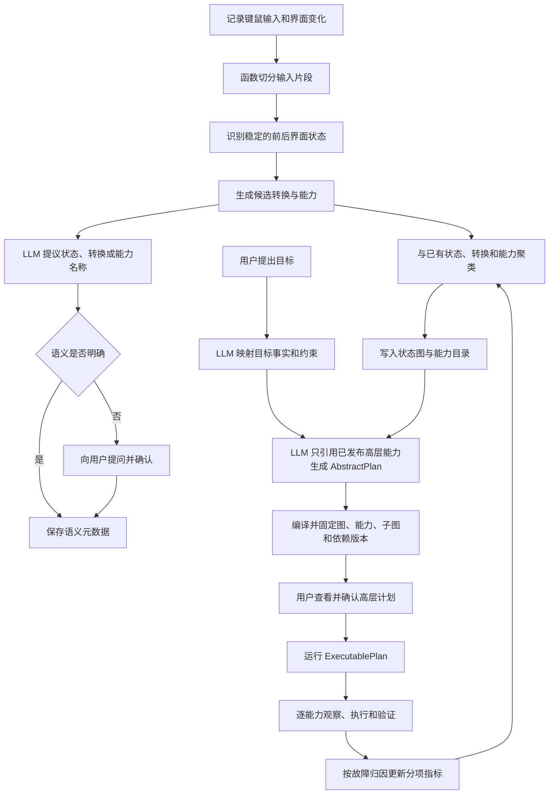

# 面向游戏的关系网驱动 AI 规划与执行系统：总体架构与关键问题分析

> 文档性质：初步想法经需求澄清后的总体方向分析
>
> 核心前提：状态定义、转换关系和能力候选由确定性函数根据用户键鼠演示和界面变化生成；LLM 不决定机器状态、图结构或执行结果，只承担语义标注、提问确认和受已发布能力约束的高层计划组合
>
> Whimbox 参考基线：`2.5.4`，提交 `a10fa3059f7a47cd26ba65a562184c8735562320`
>
> UIAgent 本机感知实验基线：`D:\Games\UIAgent`，用于复用或对照采集、OCR、YOLO、SAM、CLIP、统一观测与离线回放能力
>
> AzurLaneAutoScript 非规范参考基线：只借鉴观察—决策—执行—再观察、逐边验证、连续控件归一化、看门狗和错误证据思想，不复制其游戏专用结构或 GPLv3 代码
>
> 图像处理专题：[OCR、YOLO、CLIP、SAM 模块概念](02-图像处理模块概念.md)
>
> Whimbox 图像实现参考：[截图、预处理、识别与输出](03-Whimbox图像处理参考.md)
>
> Whimbox 界面状态参考：[页面特征、导航与主界面恢复](04-Whimbox界面状态判断.md)
>
> Whimbox 键鼠执行参考：[输入适配、视觉闭环、宏与跑图控制](05-Whimbox键鼠执行.md)
>
> Whimbox 任务运行参考：[任务调度、停止与资源互斥](06-Whimbox任务调度停止与资源互斥.md)
>
> Whimbox 前后端解耦参考：[运行事件与前后端解耦](07-Whimbox运行事件与前后端解耦.md)
>
> Whimbox 资产管理参考：[脚本资源与版本管理](08-Whimbox脚本资源与版本管理.md)
>
> Whimbox 能力入口参考：[插件能力注册与调用边界](09-Whimbox插件能力注册与调用边界.md)
>
> Whimbox 可靠执行参考：[错误恢复与执行证据](10-Whimbox错误恢复与执行证据.md)
>
> Whimbox LLM 边界参考：[Agent 语义层与工具边界](11-Whimbox-Agent语义层与工具边界.md)
>
> Whimbox 连续控制参考：[自动跑图视觉闭环](12-Whimbox自动跑图视觉闭环.md)
>
> 地图自动建图方案：[游戏内地图自动采集、拼接与关系网](13-游戏内地图自动采集拼接与关系网方案.md)
>
> 大世界互动方案：[互动姿态与主动视角搜索](14-大世界互动姿态与主动视角搜索方案.md)
>
> 后续统一设计：[界面与交互要素发现](../interface_discovery/基于用户游玩监控的界面与交互要素发现构想.md) · [连续滚轮与视口控制](../interface_discovery/鼠标滚轮缩放与视口控制构想.md) · [多窗口输入与异常恢复](../interface_discovery/多窗口输入归属与游戏视角异常恢复构想.md) · [分层关系网与复合能力子图](../interface_discovery/分层关系网与复合能力子图构想.md) · [瞬态故障与置信度隔离](../interface_discovery/游戏瞬态故障判读与置信度隔离构想.md) · [动态控件绑定](../interface_discovery/角色能力切换与动态控件绑定构想.md) · [ALAS 可借鉴机制](../../references/alas/AzurLaneAutoScript可借鉴机制与设计思想.md)

## 1. 澄清后的项目定位

该项目的核心不是让 LLM 从原始画面中自由提炼游戏关系，也不是让 LLM 直接学习和生成键鼠操作。

系统首先使用确定性函数记录并收束用户演示：

```text
稳定界面状态
-> 一组用户键鼠输入
-> 新的稳定界面状态
-> 形成候选小步骤
```

例如：

```text
游戏主界面
-> 按下 ESC
-> 菜单界面
```

```text
游戏主界面
-> 按下 B
-> 背包界面
```

这些小步骤经过聚类、确认和运行验证后形成状态定义、转换候选和能力候选。LLM 不参与前后状态是否发生变化、输入序列是什么、图中节点如何连接等机器事实的确定。

LLM 的职责集中在两个位置：

1. 为机器生成的状态、转换和能力提出人类可读的名称、说明和疑问，由用户确认；
2. 在状态图和已发布能力目录约束下，将用户目标映射为目标事实，并选择已有高层能力组成 `AbstractPlan`。

`AbstractPlan` 必须经过后端确定性编译，固定主图、能力、子图、Adapter、检测器和校准版本，生成 `ExecutablePlan`，再由用户点击确认执行。

因此，该系统更准确的定义是：

> 用户演示驱动的因子化状态图 + 版本化能力与模块 DAG + LLM 语义规划 + 确定性编译 + 可验证执行

## 2. 总体闭环



整个闭环分成四个明确阶段：

1. 用户演示产生机器可验证的状态转换；
2. LLM 和用户补充语义，但不修改机器连接、能力绑定或执行事实；
3. LLM 从高层能力投影生成 `AbstractPlan`，编译器生成固定版本的 `ExecutablePlan`；
4. 用户批准后，执行器逐能力运行和验证，并将恢复尝试与原始执行分开记录。

## 3. 图模型：状态节点、转换边与能力分开

### 3.1 推荐使用三段式关系

状态图只表达“哪些机器状态可以通过什么能力发生转换”。能力的实现、版本、资源和内部流程不内嵌到状态节点中。

推荐采用：

```text
StateDefinition
-> TransitionDefinition(capability_ref)
-> StateDefinition
```

例如：

```text
state.game_main
-> transition.open_menu [capability_ref=nikki.open_menu@caprev_007]
-> state.menu
```

```text
state.game_main
-> transition.open_inventory [capability_ref=nikki.open_inventory@caprev_004]
-> state.inventory
```

这样可以清晰分离：

- `StateDefinition`：可被机器判断的状态事实定义；
- `TransitionDefinition`：状态图中的有向边，声明起点、结果和所引用能力；
- `CapabilitySpec`：实际可调用能力的稳定契约、版本、资源、风险和实现引用；
- 语义信息：LLM 或用户提供的名称、描述和标签；
- 运行信息：每次 `CapabilityRun`、`StepAttempt`、恢复和证据。

转换边不复制能力实现。同一个通用能力可以被多个状态图或区域图引用，定义依赖形成有向无环的模块调用关系；某个 `GraphModule` 内部仍可存在带进度条件、次数和超时上限的受控循环。

### 3.2 为什么转换不能只等于按键

相同输入在不同状态下含义不同：

- 主界面按 ESC 可能打开菜单；
- 子页面按 ESC 可能返回上一级；
- 弹窗中按 ESC 可能关闭弹窗；
- 战斗或过场中按 ESC 可能无效。

因此，转换身份至少由以下内容共同决定：

```text
前置状态
+ capability_ref
+ 目标状态或结果集合
```

规范化输入属于能力实现证据，不能把“按 ESC”本身定义成一个全局固定转换。

### 3.3 一个能力可能有多个结果

同一个前置状态和输入可能因为弹窗、网络延迟、游戏更新或隐藏条件产生不同结果。

因此 `CapabilitySpec` 可以拥有多个 Outcome，`TransitionDefinition` 只选择与本边有关的结果映射：

```text
CapabilityOutcome
  -> SUCCEEDED: state.inventory
  -> FAILED: 明确失败，但不自动说明关系定义错误
  -> UNKNOWN: 无法确认
  -> CANCELLED: 已停止并进入清理
  -> BLOCKED: 当前条件明确不允许执行，且未发送业务输入
```

每个结果还必须携带 `reason_code`、`FailureAttribution` 和 `SampleDisposition`。计划默认只沿已验证的 `SUCCEEDED` 结果推进；其他结果进入暂停、恢复、重新规划或停止分支。

### 3.4 三种能力类型

```text
Capability
├── AtomicCapability
├── CompositeCapability
└── ContinuousCapability
```

- `atomic`：调用确定性截图、识别、单次按键或点击等原子执行器；
- `composite`：通过 `GraphModule + Adapter` 引用可复用子图，定义依赖为 DAG；
- `continuous`：调用参数化反馈控制器，例如滑块、滚轮缩放、镜头或移动，不把每个连续值枚举成状态节点。

三类能力对状态图暴露同一种 `CapabilitySpec`。状态图和 LLM 不需要知道内部是 Python 函数、子图还是连续控制器。

## 4. 状态节点

### 4.1 `StateDefinition` 的机器身份

状态定义必须先有不依赖名称的稳定机器身份，例如：

- 页面模板特征集合；
- OCR 关键文本及其区域；
- 可见按钮或图标集合；
- 特定区域的视觉指纹；
- 窗口、分辨率和游戏版本范围；
- 状态检测器 ID 和版本。

机器身份用于聚类、连接和执行验证。它描述可判断的事实条件，而不是保存一张代表全部状态的截图。

LLM 给出的“菜单”“背包”“角色详情”等名称只是语义元数据。即使名称后来修改，也不改变状态 ID 和图中的连接关系。

### 4.2 `StateSnapshot` 与帧证据

推荐把三个对象分开：

```text
StateDefinition  定义某类状态需要满足的机器事实
StateSnapshot    某一时刻已经判定的因子化事实集合
FrameEvidence    支撑这次判定的截图或局部证据
```

一个快照至少可以按需包含 `desktop/application/game/ui/input/health/continuous_variables/context_objects`。能力只读取自己声明的字段，避免把“背包页面 + 音量 60% + 某角色 + 某地图位置”组合成一个巨型节点。

截图变化不会自动产生新状态定义；图标缺失、控件变灰、窗口焦点变化和游戏瞬态故障分别进入 UI 完整性、可用性、输入归属和环境健康因子。

### 4.3 稳定状态与动画状态

系统不应把每一个画面变化都创建为状态节点。早期可以采用：

```text
画面保持稳定
-> 发生一组输入
-> 等待动画或加载结束
-> 新画面再次稳定
```

动画中间帧、加载图标和短暂过渡默认保留在原始记录中，不单独进入主状态图。

### 4.4 状态候选的合并

新截图出现后，后台函数需要判断：

1. 是否与已有状态足够相似；
2. 是否只是同一页面的动态内容变化；
3. 是否属于同一页面的不同子状态；
4. 是否应该创建新的候选状态；
5. 是否需要 LLM 或用户帮助命名和区分。

合并过程决定机器 ID；LLM 只能提供语义建议。

## 5. 小步骤的自动收束

### 5.1 初始切分规则

早期可以将一个小步骤定义为：

```text
稳定状态 S0
-> 连续输入事件组 A
-> 稳定状态 S1
```

连续输入事件组可以按以下规则切分：

- 输入间隔超过阈值；
- 新界面已经稳定；
- 已知页面发生切换；
- 用户主动添加步骤标记；
- 达到最大输入事件数；
- 达到最长记录时间；
- 检测到明确的成功或失败界面。

### 5.2 输入规范化

原始输入需要保留，但用于步骤聚类的输入应做规范化，例如：

- 键盘按下和释放合并为一次按键；
- 连续字符输入与快捷键区分；
- 鼠标坐标转换为窗口内相对坐标；
- 能识别 UI 元素时，将坐标点击转换为元素选择器；
- 去除无意义的鼠标微动；
- 保留输入间隔的合理范围，而不是要求毫秒级完全一致。

原始记录是证据，规范化输入用于生成 `TransitionDefinition + CapabilitySpec` 候选，不直接成为正式执行定义。

### 5.3 相同步骤的聚类

候选转换片段可以使用以下机器键进行初步聚类：

```text
pre_state_id
+ normalized_input_signature
+ outcome_state_id
```

多次用户演示命中同一组合时，系统不创建大量重复节点，而是增加该候选转换和能力的观测次数与证据记录。

### 5.4 从演示到可发布能力

一次演示不能直接成为自动计划可用能力。能力、GraphModule 和 Adapter 统一使用发布轴：

```text
DRAFT
-> CANDIDATE
-> SHADOW
-> ACTIVE
-> DEGRADED
-> RETIRED
```

| 状态 | 含义 |
| --- | --- |
| `DRAFT` | 刚从演示或人工定义生成，契约可能不完整 |
| `CANDIDATE` | Schema、依赖和结果集合完整，可以进入模块测试 |
| `SHADOW` | 只观察、模拟或在受控条件下验证，不进入正式自动计划 |
| `ACTIVE` | 已达到发布门槛，允许规划器和用户计划使用 |
| `DEGRADED` | 当前可靠性、依赖或兼容性下降，停止自动选用 |
| `RETIRED` | 不再用于新计划，但保留历史版本和运行证据 |

语义确认、验证事实和发布状态是三个正交维度：

```text
semantic_confirmation  用户确认名称、说明和别名
validation_records     某修订在特定环境和样本上的验证事实
release_status         当前是否允许进入正式计划
```

用户确认名称不等于能力已经通过执行验证；拥有验证记录也不自动意味着已经发布为 `ACTIVE`。

## 6. 机器事实、语义和运行统计分离

同一个转换和能力建议拆成三组信息，并让二者通过稳定引用连接。

### 6.1 机器定义

```text
TransitionDefinition:
  transition_id
  from_state_definition_id
  to_state_definition_ids
  capability_id + capability_revision
  guard
  outcome_mapping

CapabilitySpec:
  kind = atomic / composite / continuous
  parameters
  preconditions / outcomes
  resources / risk / timeout
  implementation_ref
  supported_environment
  release_status
```

这些字段决定寻路和执行。

### 6.2 语义元数据

```text
display_name
description
tags
llm_proposal
semantic_confidence
confirmed_by
confirmed_at
```

这些字段用于搜索、展示、自然语言理解和用户确认，不参与图结构正确性的判断。

### 6.3 执行统计

```text
capability_id + capability_revision
graph_module_revision / adapter_revision
focus_epoch / control_schema_epoch
attempt_id
outcome
reason_code
failure_attribution
sample_disposition
phase_timestamps
evidence_ids
```

聚合指标从这些不可变运行记录派生，用于评估可靠性和路径选择；统计变化不产生新定义版本。

## 7. 定义版本与分项指标

### 7.1 是否需要版本

建议从第一版保留不可变 `revision_id`，但只在机器定义发生变化时创建新修订。`StateDefinition`、`TransitionDefinition`、`CapabilitySpec`、GraphModule、Adapter、检测器和连续控制校准分别版本化，不能共用一个模糊的节点版本号。

| 变化 | 是否产生新定义版本 |
| --- | --- |
| LLM 修改能力或转换名称 | 否 |
| 用户修改说明或标签 | 否 |
| 成功次数增加 | 否 |
| 运行可靠性变化 | 否 |
| 原子输入或控制器实现变化 | 是 |
| 前置状态定义变化 | 是 |
| 结果状态或 Outcome 变化 | 是 |
| 成功判定器变化 | 是 |
| 支持的游戏版本范围变化 | 通常是 |
| `focus_epoch` 或 `control_schema_epoch` 在运行中变化 | 否；使当前运行上下文失效并要求重新解析 |

定义修订解决“机器契约是否改变”，运行指标解决“当前条件下是否可靠”，二者不能混为一体。计划必须固定所用修订；运行时 epoch 只表示上下文是否仍然有效，不产生定义修订。

### 7.2 指标必须分开

不建议用一个总置信度或成功率同时表达所有不确定性。至少区分：

| 指标 | 回答的问题 |
| --- | --- |
| `state_confidence` | 本次 `StateSnapshot` 判定是否可靠 |
| `transition_confidence` | 该能力与状态变化的因果关系是否成立 |
| `availability_confidence` | 能力在当前上下文是否可用，例如按钮是否正常启用 |
| `conditional_reliability` | 在明确前置条件和环境桶内执行成功率如何 |
| `perception_confidence` | 模板、OCR、YOLO等感知证据是否可信 |
| `input_routing_confidence` | 输入是否确实投递给目标窗口 |
| `environment_health` | 游戏客户端、窗口、网络和UI完整性是否健康 |
| `recovery_reliability` | 指定恢复策略在相同故障签名下是否有效 |
| `semantic_confidence` | LLM 对状态或能力名称的把握，仅属于语义层 |

`FailureAttribution` 说明失败属于能力定义、感知、输入路由、游戏环境、版本兼容还是尚无法归因；`SampleDisposition` 决定本次样本能否更新某项指标。游戏瞬态Bug、图标缺失、焦点错投和用户取消不得直接降低关系正确性。

规划和运行门槛可以组合多个机器指标；语义置信度主要决定是否需要向用户提问，不能替代任何执行门槛。

## 8. LLM 的职责边界

### 8.1 状态、转换和能力命名

LLM 可以接收：

- 前置状态关键帧；
- 输入摘要；
- 后置状态关键帧；
- 已有状态、转换和能力名称；
- OCR 文本；
- 当前游戏上下文。

LLM 可以返回：

```text
建议状态名称
建议转换或能力名称
简短说明
语义置信度
需要用户确认的问题
```

例如：

> 检测到从主界面按 B 后出现物品分类和格子区域。这个步骤是否应命名为“打开背包”？

用户确认后只更新语义元数据，不修改输入序列和图连接。

### 8.2 目标理解

用户提出“打开背包”“进入菜单”“从背包回到主界面”等目标时，LLM负责：

1. 搜索已有状态名称和标签；
2. 将自然语言映射为目标状态 ID；
3. 识别用户附加约束；
4. 在不明确时向用户提问；
5. 输出目标状态和约束，不输出底层键鼠操作。

### 8.3 高层计划组合

LLM只能从当前状态图投影和 `ACTIVE` 高层能力目录中选择：

```text
当前状态
-> capability_id@revision_id
-> 下一状态
-> ...
-> 目标状态
```

LLM输出的是 `AbstractPlan`，只包含用户可理解的高层能力 ID、参数、目标效果、假设和问题，不展开原子输入、子图节点或连续控制周期。

确定性编译器根据 `TransitionDefinition` 和 `CapabilitySpec` 延迟展开 `CompositeCapability`，选择 Adapter，固定主图、能力、GraphModule、检测器、校准和应用 Profile 修订，生成 `ExecutablePlan`。对于简单 UI 图，BFS、Dijkstra 或其他确定性寻路已经足够。LLM的主要价值是目标语义映射、约束理解、候选路径选择和解释，而不是替代图搜索、动态控件绑定或故障归因。

## 9. 计划校验与用户确认

### 9.1 后端确定性编译与校验

LLM生成 `AbstractPlan` 后，后端至少校验：

1. 所有能力均存在且发布状态为 `ACTIVE`；
2. 主图、转换、能力、子图、Adapter和依赖修订仍然有效；
3. 第一项能力的前置事实与当前 `StateSnapshot` 兼容；
4. 每条 `TransitionDefinition` 的结果映射与下一项能力前置条件连续；
5. 最终状态满足用户目标；
6. 没有使用 `DEGRADED` 或 `RETIRED` 定义；
7. 所有参数合法；
8. 模块依赖图没有无条件递归，内部循环具有次数、进度和总超时边界；
9. 风险等级符合当前执行策略；
10. 每项能力都有结果验证和清理方式；
11. 计划总步数、调用深度、恢复预算和重试次数有上限；
12. 所需 `game_control:<window_instance_id>`、`desktop_physical_input` 和GPU等资源契约可满足；
13. 动态控件绑定、`control_schema_epoch` 和连续控制校准具备运行时重新验证策略。

编译成功后生成不可变 `ExecutablePlan` 和版本清单。LLM的文字解释不能代替这些检查。

### 9.2 用户点击执行

计划校验通过后向用户展示：

- 当前状态；
- 目标状态；
- 高层能力名称和数量；
- 每项能力的条件可靠性、当前可用性与主要限制；
- 可能的风险；
- 是否包含需要确认的步骤；
- 预计耗时；
- 失败后的默认行为。

只有用户点击执行，计划才进入运行状态。

## 10. 分层执行与反馈

统一运行层级为：

```text
PlanRun
-> CapabilityRun
-> StepAttempt
```

`CompositeCapability` 的一次子图调用另外产生 `GraphCallRun`，记录调用者、被调用 GraphModule、Adapter、`ReturnContext` 和返回后的重新观察；任何恢复动作单独产生 `RecoveryRun`，不能覆盖原 `StepAttempt` 的结果。

### 10.1 每次 Attempt 执行前

- 重新识别当前状态；
- 确认与 Capability 前置事实一致；
- 取得 `game_control:<window_instance_id>`；
- 需要物理键鼠时取得 `desktop_physical_input` 和 `FocusLease`；
- 记录并验证 `focus_epoch`，动态控件操作同时固定 `control_schema_epoch`；
- 检查停止请求；
- 检查能力、子图、Adapter、检测器和校准修订；
- 保存执行前截图和状态证据。

### 10.2 按能力类型执行

执行器只读取 `ExecutablePlan` 固定的机器定义：

- `atomic`：确定性识别或单次受控输入；
- `composite`：通过 `GraphCallRun` 进入 GraphModule，使用调用栈和 `ReturnContext` 返回；
- `continuous`：运行微量动作、观测、控制、验证和必要的重校准周期；
- 动态目标通过 `ControlSlot + ContextualBinding` 解析，不使用LLM猜测按键；
- 超时；
- 目标窗口实例与焦点租约；
- 停止检查。

LLM不参与实际输入。

### 10.3 每次 Attempt 执行后

- 等待画面稳定；
- 重新识别状态；
- 与预期 Outcome 比较；
- 记录 `SUCCEEDED`、`FAILED`、`UNKNOWN`、`CANCELLED` 或 `BLOCKED`；
- 记录 `reason_code`、`FailureAttribution` 和 `SampleDisposition`；
- 只更新样本处置允许更新的分项指标；
- 决定继续、重新观察、停止或请求用户处理。

如果结果为 `UNKNOWN`，不能假定成功后继续下一转换；如果为 `BLOCKED`，表示当前条件明确不允许执行且业务输入未发送，应等待条件、换路或询问用户，而不是降低关系正确性。

## 11. 当前最明显的问题

### 11.1 状态身份如何稳定

同一界面可能因为角色、背景、物品列表、语言和提示信息不同而视觉差异很大。需要先定义哪些特征决定“同一状态”，哪些只是动态内容。

这是整个图能否收束的第一关键问题。

### 11.2 小步骤如何正确切分

用户的一次意图可能包含多个输入，也可能在输入后等待较长动画。固定时间切分容易把一个步骤拆开或把多个步骤合并。

早期应以“稳定状态 -> 输入组 -> 新稳定状态”为主，并保留切分原因，允许后续重新切分。

### 11.3 同一输入可能产生多个结果

按键、点击和快捷键都依赖上下文。必须允许 Capability 有多个 Outcome，并把隐藏条件或失败状态逐步补充进去。

### 11.4 演示成功不等于自动执行可靠

用户演示时可能进行了未记录的视线判断、等待或临时修正。原始演示只能生成候选转换和能力，必须经过 `SHADOW` 受控验证才能进入 `ACTIVE`。

### 11.5 鼠标绝对坐标不稳定

分辨率、窗口位置、UI缩放和元素布局都会改变坐标。能识别 UI 元素时，应优先保存“点击某元素”，其次才是窗口相对坐标。

### 11.6 隐藏游戏状态

画面相同不代表所有条件相同。例如战斗锁定、网络状态、弹窗层级和账号状态可能影响执行结果。MVP 应先限定在结果清晰的 UI 页面跳转。

### 11.7 语义名称与机器连接不能耦合

如果转换或能力名称被修改就导致机器身份变化，图会持续产生重复和断链。机器 ID、LLM名称和用户展示必须分离。

### 11.8 运行统计不能代替版本

条件可靠性下降说明当前能力或依赖可能退化，但不等于定义已经改变。先按故障归因隔离样本；只有有效能力样本持续异常时，才将相关能力或GraphModule标为 `DEGRADED`，重新验证后决定是否发布新修订。

### 11.9 LLM计划必须被图和后端共同约束

仅在提示词中告诉 LLM“不要发明节点”不够。模型只能看到 `ACTIVE` 高层能力投影，输出必须经过 Schema、图连续性和版本编译校验。

### 11.10 停止必须终止真实输入

取消计划不能只修改前端状态。执行 worker 必须停止、释放仍按下的键，并确认不会继续向游戏发送残余输入。

### 11.11 输入、画面和模型结果必须使用同一帧身份

键鼠记录、截图、YOLO、CLIP 和 OCR 如果各自生成时间戳，即使每个模块单独运行正确，也无法可靠确定“这次输入”对应“哪一张前画面”和“哪一张后画面”。

采集层必须统一生成 `run_id`、`frame_id`、`frame_seq`、`capture_time` 和单调时钟。所有识别器只能继承这些字段，不能用推理完成时间代替采集时间。输入事件发生时还应强制保存事件前后帧，不能完全依赖画面差异节流，否则短暂弹窗可能被漏掉。

### 11.12 多个视觉模型不能直接投票决定状态

OCR、YOLO、SAM 和 CLIP 的输出含义不同，分数也不在同一尺度上。它们只能提供带来源和版本的证据，不能把原始分数直接相加后生成状态节点。

最终状态仍由状态解释器根据当前状态定义、时间窗口、证据组合和否定条件确定；证据不足或冲突时必须返回 `UNKNOWN`。

### 11.13 扁平关系网会发生规模爆炸

页面、区域、设置、恢复、连续变量和底层输入不能全部铺在一张图中。需要由 `CapabilitySpec` 统一原子、复合和连续能力；复合能力引用可多父复用的 GraphModule 与 Adapter，定义依赖保持 DAG，运行时用 `GraphCallRun + ReturnContext` 返回调用者。

### 11.14 输入发出不等于目标窗口收到

系统级物理键鼠可能被其他窗口抢走。每次输入事务需要绑定 `window_instance_id`、`FocusLease` 和 `focus_epoch`，并通过目标窗口截图、桌面见证及实际视觉响应验证输入归属。输入错投属于 `INPUT_ROUTING`，不能污染能力或关系可靠性。

### 11.15 动态控件与游戏故障不能直接改写关系

角色、能力或控制模式切换会改变HUD槽位和图标绑定；偶发变灰、图标缺失和游戏客户端Bug则会改变当前可用性或UI完整性。动态控件通过 `control_schema_epoch` 使旧绑定和排队输入失效；故障通过 `FailureAttribution` 与 `SampleDisposition` 隔离，恢复成功也不覆盖原 Attempt。

## 12. 与 Whimbox、UIAgent 和 ALAS 的对应关系

Whimbox 中最接近这一设计的是人工定义的页面状态图。

| 新系统概念 | Whimbox 参考 | 差异 |
| --- | --- | --- |
| `StateDefinition` | [`UIPage`](../../../../reference_repos/whimbox/whimbox/ui/page.py#L8) | Whimbox 由人工声明，新系统从演示生成候选并使用因子化快照 |
| `TransitionDefinition` | `UIPage.links` | Whimbox 手工连接按钮或键位；新系统的边只引用能力 |
| 图寻路 | [`UI.goto_page()`](../../../../reference_repos/whimbox/whimbox/ui/ui.py#L61) | Whimbox 使用 BFS，新系统增加语义和运行统计 |
| 输入记录 | [`RecordMacroTask`](../../../../reference_repos/whimbox/whimbox/task/macro_task/record_macro_task.py#L15) | Whimbox 不录连续鼠标移动，也未同步保存界面状态 |
| 状态识别 | [UI视觉识别](../../references/whimbox/analysis/08-UI视觉识别与页面导航.md) | 可作为稳定状态检测基础 |
| 输入执行 | [平台与交互核心](../../references/whimbox/analysis/07-平台抽象与交互核心.md) | 可作为无限暖暖执行适配器 |
| 能力运行 | [任务框架](../../references/whimbox/analysis/04-任务框架调度与停止.md) | 可参考停止、状态和日志，但不直接作为通用图模型 |
| 工具注册 | [插件与工具](../../references/whimbox/analysis/03-插件与工具系统.md) | 可将 `ACTIVE` Capability 暴露为版本化能力 |

可以将新系统理解为：

> 从用户演示中生成 Whimbox 当前手工维护页面图所对应的状态、转换和能力候选，再增加模块化复用、语义标注、故障隔离和计划编译。

### 12.1 推荐集成边界

新项目核心负责：

- 输入和画面同步记录；
- 状态、转换与能力聚类；
- 状态图、Capability Registry、Graph Registry 与 Adapter；
- LLM 语义层；
- `AbstractPlan` 生成与 `ExecutablePlan` 编译；
- 用户确认；
- 运行统计。

Whimbox Adapter 负责：

- 游戏窗口和截图；
- 模板、OCR 和页面检测；
- 键鼠输入；
- 现有任务、宏和路线；
- 运行状态和停止。

不要让 LLM 直接调用 Whimbox 内部 Python 类。高层计划只引用经过发布的 Capability ID；底层实现由编译器固定版本后调用。

### 12.2 UIAgent 作为感知实验基线

`D:\Games\UIAgent` 已经试验过多种本方案可能使用的视觉能力，并且存在一条初步主干：

- `window_recognition\window_recognition_server.py`：共享内存截图入口和多消费者进程；
- `nodes\windows_get_input\input_recorder.py`：带会话、序号和双时钟的键鼠记录；
- `screen_analysis\PaddleOCR_Layout\`：PaddleOCR 环境、批处理和共享内存消费者原型；
- `screen_analysis\yolo\`：UI 元素数据集、YOLO 训练、推理权重和输出样本；
- `screen_analysis\CLIP\CLIP_server.py`：粗场景分类消费者；
- `screen_analysis\SAM2\`：框提示分割、掩码和透明素材生成实验；
- `uiagent_core\models.py` 与 `uiagent_core\adapters\`：统一 `Observation`、`EvidenceItem` 和多路结果适配；
- `uiagent_core\examples\`：基于保存结果的离线回放入口。

这使 UIAgent 适合承担三种角色：

1. 采集和键鼠记录的实现参考；
2. OCR、YOLO、SAM、CLIP 的可运行试验环境；
3. 固定截图、JSON 结果和轨迹的离线回归样本来源。

UIAgent 不应整目录复制进新系统，也不能把已有实验结果直接视为游戏状态识别准确率。现有模块存在本机绝对路径、设备编号、时间戳口径、输出协议和实验脚本成熟度不一致等问题。更合适的方式是保留其环境和资产，通过独立进程与稳定适配接口接入新主干。

### 12.3 ALAS 作为确定性执行经验基线

AzurLaneAutoScript 适合参考：

- `Observe -> Decide -> Act -> Observe` 的短闭环；
- 静态页面图只提供导航建议，每条边执行后重新识别；
- 识别区域与安全点击区域分离；
- 连续控件归一化和反馈校准；
- 重复点击、双节点振荡和长期无推进看门狗；
- 最近截图环形缓冲与错误证据包；
- 多实例隔离、单实例内串行执行。

ALAS 是非规范参考，不作为新项目架构底座。其固定分辨率、游戏专用资源、全局状态、多重继承和 Android 输入后端不直接移植；直接复制 GPLv3 代码还会引入许可证约束。

三套参考项目的分工应保持清晰：

| 参考项目 | 主要借鉴内容 | 不直接继承的内容 |
| --- | --- | --- |
| Whimbox | 页面识别、任务执行、键鼠控制、停止、日志和现有游戏能力 | 手工页面图作为新图模型本体 |
| UIAgent | 帧总线、输入记录、感知模型环境、统一证据、样本回放 | 零散实验目录、硬编码路径和未经标注验证的模型结论 |
| ALAS | 确定性执行闭环、逐边验证、连续控件、看门狗和错误现场 | 游戏专用坐标、继承体系、全局状态和GPLv3代码 |

## 13. 整体开发方向

### 13.1 第一阶段：只做 UI 页面状态图

范围限定为：

- 一个游戏；
- 一个明确的目标窗口实例；
- 一个版本；
- 一个分辨率范围；
- 只处理稳定 UI 页面；
- 只记录快捷键和低风险点击；
- 每次真实输入验证 `FocusLease/focus_epoch` 和目标窗口归属；
- 不处理战斗和开放世界连续状态。

先验证系统能否从演示中稳定得到：

```text
主界面 -> ESC -> 菜单
主界面 -> B -> 背包
背包 -> ESC -> 主界面
```

### 13.2 第二阶段：候选转换与能力自动生成

完成：

- 稳定画面判断；
- 输入事件组切分；
- 状态指纹；
- 候选状态聚类；
- 候选 `TransitionDefinition` 与 `CapabilitySpec` 聚类；
- 原始证据保存；
- `DRAFT/CANDIDATE/SHADOW` 发布前流程；
- 语义确认和验证记录分开保存。

此阶段不接计划执行。

### 13.3 第三阶段：LLM语义与用户确认

完成：

- LLM为状态、转换和能力建议名称；
- LLM提出歧义问题；
- 用户确认或修改；
- 名称和标签搜索；
- 机器身份与语义元数据分离。

此阶段 LLM 不修改图结构。

### 13.4 第四阶段：受控回放

完成：

- 用户选择 `CANDIDATE` 能力进行受控 `StepAttempt`；
- 执行前验证前置状态；
- 执行后验证目标状态；
- 记录统一 Outcome、原因码、故障归因和样本处置；
- 达到门槛后将能力从 `SHADOW` 发布为 `ACTIVE`；
- 可靠性下降时自动降级。

### 13.5 第五阶段：计划生成和影子模式

完成：

- 用户自然语言目标映射到状态 ID；
- LLM从 `ACTIVE` 高层能力投影生成 `AbstractPlan`；
- 后端验证图连续性并编译固定版本的 `ExecutablePlan`；
- 确定性 BFS 或 Dijkstra 作为对照和兜底；
- 向用户展示计划；
- 先只展示，不执行输入。

### 13.6 第六阶段：用户确认后执行

完成：

- 用户点击已编译计划执行；
- 每个 CapabilityRun 前重新识别状态并验证焦点和动态绑定 epoch；
- 每个 StepAttempt 后验证 Outcome；
- `UNKNOWN` 默认暂停，`BLOCKED` 默认不发送业务输入；
- 失败后停止或由用户选择产生独立 `RecoveryRun`；
- 计划完成后按 `SampleDisposition` 更新分项指标；
- 不自动改变机器定义。

## 14. MVP 范围

建议首个 MVP 只包含：

- 5 至 10 个稳定 UI 状态；
- 8 至 15 个快捷键或低风险点击能力；
- 3 个用户目标；
- 状态、转换和能力的 LLM命名；
- 用户语义确认；
- 单能力受控回放；
- 图路径生成；
- 用户确认整份计划；
- 逐能力验证执行；
- 单目标窗口的 `FocusLease/focus_epoch` 验证；
- `PlanRun -> CapabilityRun -> StepAttempt` 运行记录；
- `reason_code + FailureAttribution + SampleDisposition`；
- 一键停止。

暂不包含：

- 开放世界路径学习；
- 战斗动作学习；
- 自动生成新键鼠能力；
- 无人工确认的关系晋级；
- 多游戏统一 ontology；
- 高风险购买和删除操作；
- LLM直接控制鼠标和键盘；
- 图数据库和分布式采集；
- 自动失败恢复和无限重新规划。

## 15. MVP 验收重点

1. 相同稳定界面能够合并到同一状态 ID；
2. 重复演示相同转换不会持续生成重复状态、边或能力；
3. LLM名称修改不影响图连接；
4. 所有 `ACTIVE` 能力都有独立语义确认状态和验证记录；
5. `AbstractPlan` 不包含能力目录外的能力，`ExecutablePlan` 固定全部依赖版本；
6. 后端能够证明 Transition 和 Capability 前后事实连续；
7. 用户未确认时不执行输入；
8. 每个 `StepAttempt` 都有前后状态、动作、焦点 epoch 和证据记录；
9. `UNKNOWN` 不会被当作成功继续，`BLOCKED` 不会被误计为关系失败；
10. 停止后不再产生新输入，并释放已按下的键；
11. 物理输入只在有效 `FocusLease` 下发送，并能验证目标窗口归属；
12. 游戏Bug、感知失败和输入错投分别归因，不直接污染关系可靠性。

第一版重点不是追求自动学习速度，而是验证以下闭环是否成立：

```text
用户演示
-> 函数收束状态、转换和能力候选
-> LLM和用户补充语义
-> LLM生成AbstractPlan
-> 编译器生成ExecutablePlan
-> 用户确认
-> 逐能力执行验证
```

## 16. 实施方法：基础模块逐项验证

### 16.1 不等待整套系统完成后再测试

后续开发不采用“先完成关系图、LLM、规划和执行整块功能，再统一接入游戏测试”的方式。

更合适的方法是自底向上验证：

```text
采集协议、统一时钟和帧编号
-> 截图与窗口归一化
-> 单一识别器离线回放
-> Observation和Evidence归一化
-> 稳定画面判断
-> 键鼠事件同步
-> 前后状态转换检测
-> 转换与能力聚类、影子回放
-> 状态图、Capability Registry和最小GraphModule
-> LLM语义标注
-> AbstractPlan编译与执行
```

每个基础模块先独立完成测试，再成为上层模块的依赖。这样出现误识别、错误切分或执行失败时，可以定位到具体层级，而不是在整套系统中同时排查。

### 16.2 单个模块的完成标准

每个基础模块至少需要具备：

1. 明确的输入、输出和错误状态；
2. 一组固定的真实样本；
3. 可以重复运行的离线回放；
4. 可测量的正确率、误报和运行耗时；
5. 对无法判断的情况明确返回 `UNKNOWN`，对明确不可执行但未发送输入的情况返回 `BLOCKED`；
6. 记录代码、模型、权重、标签集和阈值版本；
7. 记录 `reason_code`、`FailureAttribution` 和 `SampleDisposition`；
8. 与 Whimbox、UIAgent 或 ALAS 对应机制做行为对照；
9. 已知限制和适用环境记录；
10. 达到当前阶段门槛后才允许上层模块使用。

测试应优先使用保存下来的截图、输入事件和状态片段。真实游戏主要用于采集新样本和最终确认，不应成为每次开发调试唯一可用的环境。

### 16.3 Whimbox、UIAgent 与 ALAS 作为三类基线而不是标准答案

Whimbox 提供了已经运行的截图、模板匹配、OCR、页面判断、输入、任务和停止机制，适合作为实现参考和对照基线。

UIAgent 提供了共享帧入口、键鼠记录、PaddleOCR 独立环境、YOLO 训练与推理、CLIP 场景分类、SAM2 分割实验，以及统一 `Observation` 适配和离线回放骨架，适合作为感知模块的实验基线。

ALAS 提供了成熟的观察—执行—再观察闭环、固定UI导航、连续控件、看门狗和错误现场保留经验，适合作为确定性执行方法基线；它不定义新系统的数据模型，也不作为代码移植来源。

针对每个准备实现的模块，建议采用以下对照过程：

1. 找到 Whimbox、UIAgent 或 ALAS 中的对应模块、环境或机制；
2. 记录它的输入、输出、阈值和失败行为；
3. 使用同一组带 `frame_id` 的样本运行参考实现和新模块；
4. 比较识别结果、误报、耗时和适用范围；
5. 判断是复用、封装、改造还是重新实现；
6. 将差异和选择原因写入模块文档；
7. 验证通过后再接入状态图或执行链。

Whimbox 是工程调度与游戏能力基线，UIAgent 是感知试验基线，ALAS 是确定性闭环与故障处理经验基线，三者都不是新系统的规范实现。新项目只提取已经验证的思想和接口边界。

### 16.4 识别模块的升级方向

识别模块是整个方案最先需要提高可靠性的部分。当前只确定总体方向，不提前绑定具体算法：

- 统一截图、窗口、分辨率和坐标基准；
- 将单次截图判断升级为稳定帧窗口判断；
- 允许模板、OCR、页面元素和视觉指纹共同提供证据；
- 分开记录识别分数、状态置信度和最终判定；
- 明确失败、冲突和 UNKNOWN；
- 为检测器和视觉资产保留版本；
- 建立覆盖正常、动画、弹窗、误识别和分辨率变化的回放样本；
- 先提高少量关键状态的精准度，再扩展状态数量。

初期不追求一个通用模型识别所有游戏状态。优先把主界面、菜单、背包等少数关键页面做成可重复验证的基础模块。

UIAgent 中现有模型的建议定位如下：

| 能力   | 在新系统中的角色              | 当前参考价值                                           | 第一阶段用法                    |
| ---- | --------------------- | ------------------------------------------------ | ------------------------- |
| OCR  | 文本、数字、按钮文案和区域证据       | 已有独立 PaddleOCR 环境、批处理、共享内存消费者和大量输出样本，但尚未进入主干结果总线 | 先建立带真值的离线评测，再包装为按需 OCR 插件 |
| YOLO | 控件、图标、物体候选和布局证据       | 已有数据集、训练脚本、权重、推理结果和 `Observation` 适配器；现有类别偏通用 UI | 先用于关键区域定位，不直接负责页面语义       |
| CLIP | 粗场景先验、候选状态召回和相似度检索    | 已有共享内存消费者和结果样本；现有分数尚不能直接作为校准置信度                  | 低频或状态不明确时调用，只缩小候选范围       |
| SAM2 | 掩码细化、ROI 提取、模板素材和标注辅助 | 已有四档权重、框提示工具和实际输出，但仍是人工工具原型                      | 优先离线制作数据和视觉资产，不作为常驻识别器    |

初期识别链建议采用成本分层，而不是四个模型每帧串行运行：

```text
统一采集帧
-> 低成本变化与稳定性判断
-> 模板或视觉指纹等确定性证据
-> 按状态需要调用OCR或YOLO
-> 候选仍不明确时低频调用CLIP
-> 离线或人工确认阶段使用SAM2制作区域和素材
-> 多路Evidence进入状态解释器
-> CONFIRMED_STATE或UNKNOWN
```

每条证据至少携带 `run_id`、`frame_id`、采集时间、来源、模型或规则版本、原始分数、归一化结果和区域。模型只产生证据，状态解释器才产生状态判定。

### 16.5 UIAgent 环境的使用边界

UIAgent 当前至少包含通用视觉环境 `D:\Games\UIAgent\python311` 和独立 OCR 环境 `D:\Games\UIAgent\ocr_env\venv_paddleocr`。它们适合用来复现实验和建立初始基准，但不应成为新系统唯一、隐式的运行依赖。

接入时应遵循：

1. 保留 OCR、Torch 视觉模型等独立进程，避免 Paddle、Torch、CUDA 和 Whimbox 依赖混装；
2. 通过版本化 JSON、消息或本地 RPC 输出统一 `Observation`，不从主进程直接导入实验脚本；
3. 将 Python、包版本、模型路径、设备、阈值和标签集移入配置；
4. 用模型权重校验值和检测器版本记录实验，不依赖文件名判断模型身份；
5. 明确 GPU 分配和并发上限，避免 YOLO、OCR、CLIP、SAM 同时争用同一设备；
6. 新建可冻结的项目环境后，再把验证通过的依赖从 UIAgent 迁入；
7. UIAgent 保留为对照与样本来源，不在原实验目录上直接演化新主干。

当前已有 OCR 批量结果、YOLO/CLIP JSON 和 SAM2 输出可以作为回放数据起点，但它们缺少统一人工真值，不能直接得出准确率结论。第一批评测集需要从这些样本中挑选、去重、标注前后状态和关键区域。

### 16.6 模块组合原则

基础模块组合成关键功能时，应继续保留原有模块边界：

```text
界面识别通过
+ 输入同步通过
+ 稳定状态判断通过
= 可以测试状态转换检测
```

```text
状态转换检测通过
+ Transition/Capability聚类通过
+ SHADOW回放通过
= 可以发布最小ACTIVE能力图
```

```text
ACTIVE能力图稳定
+ LLM语义映射通过
+ AbstractPlan编译通过
= 可以测试用户确认后的整份计划执行
```

如果下层模块未达到门槛，上层功能只允许使用模拟数据或影子模式，不能通过增加LLM提示来掩盖基础识别问题。

### 16.7 当前暂缓决定的细节

现阶段已有足够明确的总体方向，以下内容可以在基础模块验证后再决定：

- 具体图数据库；
- 最终状态指纹算法；
- LLM供应商和模型；
- 复杂路径评分公式；
- 自动恢复和重新规划策略；
- 多游戏统一数据结构；
- 分布式采集和执行；
- 自动发现并发布新能力。

当前最重要的是形成稳定的模块验证方法和少量真实成功样本，而不是一次性确定所有理论细节。

## 17. 结论

澄清后的方案比“LLM从记录中抽取关系”更可控，也更容易从 Whimbox 现有能力切入。

系统的核心真相来自：

- 实际记录到的输入；
- 确定性识别出的前后状态；
- 多次演示和受控回放；
- 每次真实执行结果。

这些事实分别进入 `StateDefinition`、`TransitionDefinition`、`CapabilitySpec` 和不可变运行证据；一次环境故障不会自动否定能力关系，一次恢复成功也不会改写原执行结果。

LLM只负责把这些机器关系变得容易理解、搜索和组合。即使 LLM名称错误或计划建议不合理，机器 ID、图连接和后端校验仍能阻止它改变底层执行事实。

整体建设顺序应坚持：

```text
稳定状态识别
-> 状态、转换和能力自动收束
-> 语义标注
-> SHADOW验证
-> 高层规划与确定性编译
-> 用户确认执行
```

实现过程还应坚持：每个基础识别或执行模块先独立测试，与 Whimbox 工程基线、UIAgent 感知基线或 ALAS 确定性执行经验对照并记录差异，验证通过后再逐层组成关键功能。

最先需要验证的不是复杂关系网，也不是通用 AI 规划，而是能否稳定地从“界面状态 + 用户输入 + 新界面状态”中生成少量可重复、可验证的状态定义、转换边和能力候选，并证明输入确实属于目标窗口。
