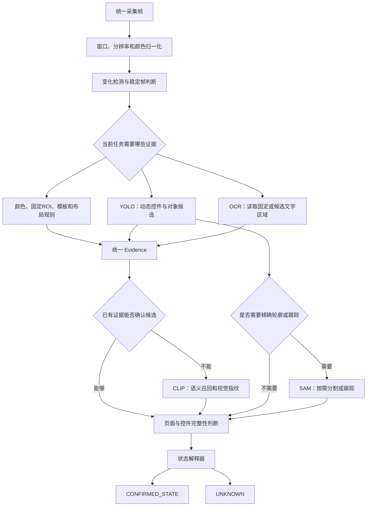

# 游戏 AI 图像处理模块概念

> 文档性质：OCR、YOLO、CLIP、SAM 在关系网驱动游戏 AI 中的职责划分与组合原则
>
> 分析日期：2026-07-18
>
> 关联总方案：[总体架构与关键问题分析](01-总体架构与关键问题分析.md)
>
> Whimbox 实现参考：[截图、预处理、识别与输出](03-Whimbox图像处理参考.md)
>
> 核心原则：各视觉模型只产生带来源的观测证据，最终界面状态由状态解释器确定；证据不足或冲突时返回 `UNKNOWN`
>
> 后续设计关联：[界面与交互要素发现](../interface_discovery/基于用户游玩监控的界面与交互要素发现构想.md) · [瞬态故障与控件缺失](../interface_discovery/游戏瞬态故障判读与置信度隔离构想.md) · [动态控件绑定](../interface_discovery/角色能力切换与动态控件绑定构想.md) · [ALAS 分层识别参考](../../references/alas/AzurLaneAutoScript可借鉴机制与设计思想.md)

## 1. 模块定位

本系统不要求某一个通用模型独立理解整张游戏画面。更合适的方法是让不同模块只完成自己最擅长的工作：

| 模块 | 最直接的问题 | 主要输出 |
| --- | --- | --- |
| OCR | 画面上写了什么 | 文本、文字区域、识别分数 |
| YOLO | 画面里有什么、在哪里 | 类别、目标框、检测分数 |
| CLIP | 画面在语义上像什么 | 图像向量、候选标签、相似度 |
| SAM | 目标精确占据哪些像素 | 掩码、轮廓、跟踪对象 |

四个模块不是上下位替代关系：

- OCR 不负责理解没有文字的图标；
- YOLO 不适合逐字读取按钮文案；
- CLIP 不提供稳定的精确坐标；
- SAM 不负责决定对象的业务含义；
- 任何一个模型都不能单独决定关系图中的状态身份。

## 2. 总体视觉链路



推荐默认成本路由是：

```text
变化、稳定性、颜色和固定ROI规则
-> 已知固定UI优先使用模板或局部布局
-> 需要读取文字时按ROI调用OCR
-> 需要发现动态控件或世界对象时调用YOLO
-> 候选语义仍不明确时低频调用CLIP
-> 需要精确轮廓、跟踪或制作素材时调用SAM
```

YOLO 可以在需要动态对象检测的控制环中常驻，但不应成为所有已知页面的默认第一步。这不是固定串行流水线；调度器应根据当前 `StateSnapshot`、Capability 前置条件、已有证据、调用成本和任务目标决定模块。

## 3. 统一观测与证据

不同模型的原始输出格式和分数含义不同。进入状态解释器前，应统一为 `Observation` 和 `EvidenceItem`。

每条证据至少记录：

```text
run_id
frame_id
frame_seq
capture_time
window_instance_id
focus_epoch
control_schema_epoch
source
model_id
model_version
weight_sha256
label_set_version
region
raw_score
normalized_value
latency_ms
device
evidence_polarity
visibility_state
context_tags
```

其中：

- `source` 表示 OCR、YOLO、CLIP、SAM、模板或规则；
- `raw_score` 保留模型原始结果；
- `normalized_value` 是经过本项目样本校准后的值；
- `region` 使用归一化坐标，避免和固定分辨率耦合；
- `frame_id` 必须来自采集层，推理模块不能用完成时间重新生成帧身份。
- `evidence_polarity` 区分正向命中、明确缺失和无法观察；
- `visibility_state` 至少区分 `PRESENT/ABSENT/OCCLUDED/LAYOUT_MOVED/UNKNOWN`；
- `focus_epoch` 和 `control_schema_epoch` 不改变视觉模型本身，但决定该证据能否用于当前输入事务和动态控件绑定。

OCR 分数、YOLO 置信度、CLIP 相似度和 SAM 掩码分数不能直接相加。状态解释器需要按证据类型分别设置条件和阈值。

“没有检测到图标”不能直接解释为“页面不存在”或“关系失效”。状态解释器还应独立输出页面完整性和控件完整性，例如图标缺失、文字缺失、遮挡、布局移动或疑似游戏瞬态Bug；这些结果进入 `FailureAttribution` 和 `SampleDisposition`，不能直接污染转换关系指标。

视觉模块内部可以返回 `MATCH/NO_MATCH/UNKNOWN` 等判定，但不能自行宣布一次业务能力成功。只有 `CapabilityRun` 汇总前置状态、输入事实和后置证据后，才能输出统一的 `SUCCEEDED/FAILED/UNKNOWN/CANCELLED/BLOCKED + reason_code + FailureAttribution + SampleDisposition`。

## 4. OCR：文字证据模块

### 4.1 拿手能力

OCR 最擅长：

- 读取按钮文案；
- 读取菜单标题和页面名称；
- 读取数量、等级、坐标和倒计时；
- 判断提示语、确认框和错误信息；
- 返回文字所在区域，为后续点击或状态判断提供位置证据。

OCR 回答的是“写了什么”，不是“这个按钮在业务上能做什么”。

### 4.2 输入与输出

输入可以是：

- 整张稳定截图；
- 固定文本 ROI；
- YOLO 检测出的文字或按钮区域；
- 状态定义中声明的局部区域。

建议输出：

```json
{
  "source": "ocr",
  "text": "背包",
  "score": 0.96,
  "bbox": [0.82, 0.08, 0.91, 0.14],
  "language": "zh"
}
```

### 4.3 最快使用方式

OCR 最快的路径通常不是每帧全屏检测：

```text
YOLO或页面规则提供文字区域
-> 裁剪ROI
-> OCR只做文字识别
```

如果文字位置固定，也可以直接保存归一化 ROI，跳过文本检测阶段。

### 4.4 CPU 与 GPU 定位

| 场景 | 推荐 |
| --- | --- |
| 少量固定 ROI、低调用频率 | CPU + ONNX Runtime/OpenVINO |
| 常驻轻量识别 | `PP-OCRv6_tiny` 或 `small` |
| 多区域、批量截图、全屏识别 | GPU |
| 高精度复核、离线标注 | `PP-OCRv6_medium` + GPU |

PP-OCRv6 官方提供 tiny、small、medium 三档。官方端到端基准中 tiny 是各平台最快档：A100 PaddlePaddle 约 `0.13 s/image`，Xeon OpenVINO 约 `0.20 s/image`。这些数字只用于理解模型档位，不能直接外推到本机游戏截图。[PP-OCRv6 官方说明](https://www.paddleocr.ai/latest/en/version3.x/algorithm/PP-OCRv6/PP-OCRv6.html)

### 4.5 第一阶段模型选择

| 档位 | 用途 |
| --- | --- |
| `PP-OCRv6_tiny` | 高频、低延迟、资源受限；不作为精度上限 |
| `PP-OCRv6_small` | 游戏 UI 默认基线 |
| `PP-OCRv6_medium` | 低频复核和离线高精度对照 |

第一阶段优先使用 `small`，同时保留 `tiny` 和 `medium` 的相同样本对照结果。

## 5. YOLO：目标与控件定位模块

### 5.1 拿手能力

YOLO 最擅长闭集、实时目标检测：

- 检测按钮、图标、标签、弹窗和面板；
- 检测游戏人物、物品、交互点和特定目标；
- 返回目标类别、位置和检测分数；
- 在连续帧中提供相对稳定的布局证据；
- 为 OCR、SAM 和点击动作提供 ROI。

YOLO 回答的是“发现了什么对象、对象在哪里”。它最适合已经定义好类别的任务。

### 5.2 输入与输出

建议输出：

```json
{
  "source": "yolo",
  "label": "inventory_button",
  "score": 0.92,
  "bbox": [0.86, 0.77, 0.94, 0.89]
}
```

模型类别必须由游戏截图数据集训练或微调。COCO 预训练模型不会天然认识游戏中的背包按钮、任务面板或自定义图标。

### 5.3 最快使用方式

YOLO 的低延迟路径是：

```text
检测模型
+ n或s档
+ 固定输入尺寸
+ 只保留所需类别
+ GPU TensorRT或CPU ONNX/OpenVINO
```

如果只需要目标框，不应启用实例分割、姿态或语义分割头。

### 5.4 CPU 与 GPU 定位

| 场景 | 推荐 |
| --- | --- |
| CPU 回放、开发验证 | `YOLO26n` + ONNX/OpenVINO |
| GPU 常驻实时检测 | `YOLO26n` 或 `YOLO26s` |
| 精度优先、低频检测 | `YOLO26m` |
| 极小图标 | 先使用 ROI/切片和更高有效分辨率，再考虑 P2 架构 |

YOLO26 官方 T4 TensorRT 基准中，检测模型从 n 到 x 约为 `1.7–11.8 ms/image`；官方部署建议 CPU 优先 ONNX/OpenVINO、GPU 优先 TensorRT。该基准不能替代本机游戏样本测试。[YOLO26 官方说明](https://docs.ultralytics.com/models/yolo26/)、[Ultralytics Benchmark](https://docs.ultralytics.com/modes/benchmark)

### 5.5 第一阶段模型选择

| 档位 | 用途 |
| --- | --- |
| `YOLO26n` | 最小延迟和采集链验证 |
| `YOLO26s` | 游戏 UI 默认训练基线 |
| `YOLO26m` | 离线精度上限和教师对照 |

第一阶段同时测试 n 和 s。只有 s 在真实样本上显著提高关键类别召回时，才接受额外耗时。

## 6. CLIP：语义召回与视觉指纹模块

### 6.1 拿手能力

CLIP/OpenCLIP 最擅长图像与文本之间的语义匹配：

- 判断整屏更像游戏主界面、菜单、地图还是背包；
- 根据自然语言召回候选状态；
- 生成整屏或 ROI 的视觉向量；
- 搜索与当前画面最相似的历史状态；
- 在没有专门训练 YOLO 类别时提供弱语义先验。

CLIP 回答的是“语义上更像什么”，而不是精确证明状态是什么。

### 6.2 输入与输出

建议输出 top-k，而不是只保存最高标签：

```json
{
  "source": "clip",
  "embedding_id": "emb_123",
  "candidates": [
    {"label": "inventory", "similarity": 0.81},
    {"label": "equipment", "similarity": 0.76},
    {"label": "main_menu", "similarity": 0.31}
  ]
}
```

相似度必须在本项目的真实游戏样本上校准。不能把一次 softmax 或余弦相似度直接当成状态置信度。

### 6.3 最快使用方式

CLIP 最快的使用方式是：

```text
提前计算并缓存所有文本标签向量
-> 每张稳定画面只计算一次图像向量
-> 用向量索引搜索候选状态
```

同一帧的图像向量应复用于状态召回、历史检索和相似度比较，避免重复编码。

### 6.4 CPU 与 GPU 定位

| 场景 | 推荐 |
| --- | --- |
| CPU 或低功耗常驻 | `MobileCLIP2-S0` 或 `S2` |
| GPU 常驻低频语义辅助 | `MobileCLIP2-S2` 或较小 ViT |
| 中文/多语言、高质量召回 | `ViT-L-16-SigLIP2-256` + GPU |
| 离线精度对照 | 更大的 SigLIP2 模型，但不进入实时主链 |

OpenCLIP 支持多种 CLIP、MobileCLIP 和 SigLIP2 模型。官方结果中的 ImageNet 分数不能代表游戏 UI 状态区分能力，因此最终仍需使用本项目数据选择模型。[OpenCLIP 官方仓库](https://github.com/mlfoundations/open_clip)、[MobileCLIP2 官方仓库](https://github.com/apple/ml-mobileclip)

### 6.5 第一阶段模型选择

第一阶段建议对比：

1. `MobileCLIP2-S2`：观察是否足以区分少量页面状态；
2. `ViT-L-16-SigLIP2-256`：作为多语言和高质量语义对照；
3. UIAgent 当前 `ViT-B-32/laion2b`：只作为历史基线，不继续把原始 softmax 当置信度。

CLIP 默认低频调用，只在已有 OCR、YOLO 和确定性规则不能明确区分候选状态时启动。

## 7. SAM：精确分割与跟踪模块

### 7.1 拿手能力

SAM 最擅长提示驱动的精确分割：

- 根据点、框或文本得到精确目标掩码；
- 从背景中分离图标、物品、人物和交互对象；
- 制作模板、透明素材和标注数据；
- 在视频中持续跟踪已确认目标；
- 为目标区域变化、遮挡和轮廓提供证据。

SAM 回答的是“目标具体占据哪些像素”。它不应该独立负责页面状态分类。

### 7.2 输入与输出

最常见输入来自 YOLO：

```text
YOLO目标框
-> SAM框提示
-> 精确mask
-> 保存轮廓、面积、中心点或透明素材
```

建议输出：

```json
{
  "source": "sam",
  "prompt_source": "yolo:inventory_icon",
  "mask_id": "mask_456",
  "score": 0.94,
  "bbox": [0.31, 0.20, 0.47, 0.61],
  "area_ratio": 0.061
}
```

掩码本体可以独立存储，Observation 中只保存引用和摘要，避免在事件总线上传输大数组。

### 7.3 最快使用方式

SAM 不适合每帧全屏运行。推荐路径是：

```text
已有目标框或候选区域
-> 裁剪ROI或降低输入分辨率
-> 单次按需分割
-> 缓存结果或生成轻量模板
```

已经生成稳定模板后，后续实时识别应优先使用模板或 YOLO，而不是反复调用 SAM。

### 7.4 CPU 与 GPU 定位

| 场景 | 推荐 |
| --- | --- |
| CPU 实时 | 不推荐 |
| 单图、人工确认、素材制作 | GPU 按需运行 SAM 3.0 |
| 视频多目标跟踪 | SAM 3.1 + GPU，优先 Linux/WSL2 独立服务 |
| 实时基础页面判断 | 不使用 SAM |

SAM 3 官方模型约 848M 参数，没有官方 tiny/small/base/large 档位。最新 SAM 3.1 的主要优势是 Object Multiplex 多目标视频跟踪；官方报告在单张 H100、128 个对象时相对初版 SAM 3 约 7 倍加速。这个结果不代表消费级 GPU 的单图速度。[Meta SAM 3](https://github.com/facebookresearch/sam3)、[SAM 3.1 发布说明](https://github.com/facebookresearch/sam3/blob/main/RELEASE_SAM3p1.md)

### 7.5 第一阶段模型选择

第一阶段只接：

```text
SAM 3.0
+ 单张图片
+ box prompt
+ GPU
+ 按需调用
```

只有真实样本证明视频多目标跟踪对计划执行有价值后，才引入 SAM 3.1。

## 8. 三种调用模式

### 8.1 实时执行模式

目标是低延迟和低误报：

```text
稳定帧
-> 当前Capability声明的颜色、模板和固定ROI规则
-> 需要动态目标时运行YOLO26n/s
-> 需要文本时只对关键ROI运行PP-OCRv6 small
-> 状态解释器
```

CLIP 低频调用，SAM 默认关闭。

### 8.2 疑难状态确认模式

目标是解决相似页面和证据冲突：

```text
YOLO与OCR证据冲突
-> CLIP召回候选状态
-> 必要时OCR medium复核
-> 仍不明确则UNKNOWN并请求用户确认
```

SAM 只有在需要确认局部目标轮廓时调用。

### 8.3 离线学习与素材制作模式

目标是提高后续轻量识别精度：

```text
保存截图
-> YOLO高精度模型生成候选框
-> OCR medium生成文本候选
-> SAM制作mask和透明素材
-> 用户校正
-> 形成标注集、模板和状态定义
```

在这个模式中可以接受较高延迟，因为结果会转化为实时层可复用的轻量资产。

## 9. 初步 CPU/GPU 分工

结合当前本机两张 16 GB GPU，初步调度方向是：

| 设备 | 初步职责 |
| --- | --- |
| CPU | 截图归一化、变化检测、ROI裁剪、规则融合、状态解释、离线轻量回放 |
| GPU 0：RTX 4070 Ti SUPER | YOLO、CLIP；SAM 按需运行时应暂停或卸载非必要常驻模型 |
| GPU 1：RTX 5060 Ti | PaddleOCR；也可作为批量 OCR 和模型对照设备 |

该分配不是最终结论。需要记录每个模型的：

- 冷启动时间；
- 单张和批量延迟；
- P50/P95 延迟；
- 峰值显存；
- GPU 利用率；
- 对其他常驻模型的影响。

资源调度器必须控制同一 GPU 上的并发，不能让 OCR、YOLO、CLIP、SAM 自行争抢显存。

## 10. 模型配置档位

模型不应硬编码在 `StateDefinition`、`TransitionDefinition` 或业务任务中。建议由配置选择视觉档位：

| 配置档 | OCR | YOLO | CLIP | SAM |
| --- | --- | --- | --- | --- |
| `fast` | PP-OCRv6 tiny | YOLO26n | MobileCLIP2-S0，低频 | 关闭 |
| `balanced` | PP-OCRv6 small | YOLO26s | MobileCLIP2-S2，按需 | 关闭或单图按需 |
| `accurate` | PP-OCRv6 medium | YOLO26m | SigLIP2-L-256 | SAM 3.0 按需 |
| `offline` | medium | n/s/m 全量对照 | 多模型对照 | SAM 3.0/3.1 |

状态定义只声明需要哪些证据，例如：

```yaml
state_definition: inventory
evidence:
  required:
    - template: inventory_panel_anchor
  optional:
    - yolo: inventory_panel
    - ocr: 背包
    - clip: inventory_screen
  integrity_checks:
    - control_slot: close_button
```

实际使用哪个 OCR、YOLO 或 CLIP 模型，由当前运行档位和设备资源决定。

## 11. 第一阶段验证顺序

按单模块逐项完成：

1. 固定统一截图、`frame_id` 和真实回放样本；
2. 单独验证 OCR tiny/small/medium；
3. 单独训练并验证 YOLO26n/s；
4. 单独验证 MobileCLIP2-S2 和 SigLIP2；
5. 只在明确用例中验证 SAM 3 单图分割；
6. 将各模型结果转换为统一 Evidence；
7. 使用正常、图标缺失、文字缺失、遮挡、布局移动和控件变灰样本测试UI完整性；
8. 使用角色或能力切换前后的 `control_schema_epoch` 测试动态控件证据失效；
9. 最后测试状态解释器的证据组合与故障归因。

每个模块至少统计：

```text
准确率或召回率
误报率
UNKNOWN比例
连续帧抖动
P50/P95延迟
冷启动时间
CPU占用
GPU显存
失败和超时行为
缺失、遮挡与布局变化区分能力
FailureAttribution与SampleDisposition
```

模型是否进入实时链，取决于真实游戏样本，而不是通用数据集排行榜。

## 12. 当前明确不做的事情

- 不让四个模型每帧全部运行；
- 不直接相加不同模型的原始分数；
- 不让 CLIP 最高标签直接成为状态节点；
- 不让 SAM 进入基础页面识别主链；
- 不使用通用 COCO YOLO 权重直接决定游戏 UI 状态；
- 不根据官方 A100、H100、T4 基准推断本机速度；
- 不自动下载“最新版”覆盖已验证权重；
- 不忽略模型权重、数据集和框架许可证。

## 13. 许可边界

| 模块 | 当前主要许可注意点 |
| --- | --- |
| PaddleOCR | Apache-2.0；仍需检查具体模型和数据集 |
| Ultralytics YOLO | AGPL-3.0 或 Enterprise；闭源和商业使用需要重点审查 |
| OpenCLIP | 框架为 MIT；每个 checkpoint 许可可能不同 |
| Meta SAM 3 | 自定义 SAM License，权重需要申请访问 |

模型注册表必须记录来源链接和许可，避免后续无法确认某个权重是否能够分发。

## 14. 结论

四个模块在本系统中的最佳分工是：

```text
YOLO：实时发现目标并提供位置
OCR：读取文字并提供文本证据
CLIP：语义召回、相似度和视觉指纹
SAM：按需生成精确轮廓、跟踪和标注素材
```

已知固定UI的实时主链以变化检测、颜色、模板和局部规则为主；OCR和YOLO根据Capability需要调用。动态对象控制环可以常驻轻量YOLO，CLIP只在语义不明确时介入，SAM主要服务于离线数据制作和少量按需精细分割。

最终输出不是某个模型的标签，而是带帧身份、窗口实例、epoch、模型版本、来源、正负极性和可见性状态的 Evidence。状态解释器在多个证据之间做确定性判断，无法确认时返回 `UNKNOWN`；页面或控件缺失另外形成UI完整性和故障归因结果。这样可以避免视觉模型的偶然误判、游戏瞬态Bug或旧动态绑定直接改变状态图、能力指标和执行计划。
