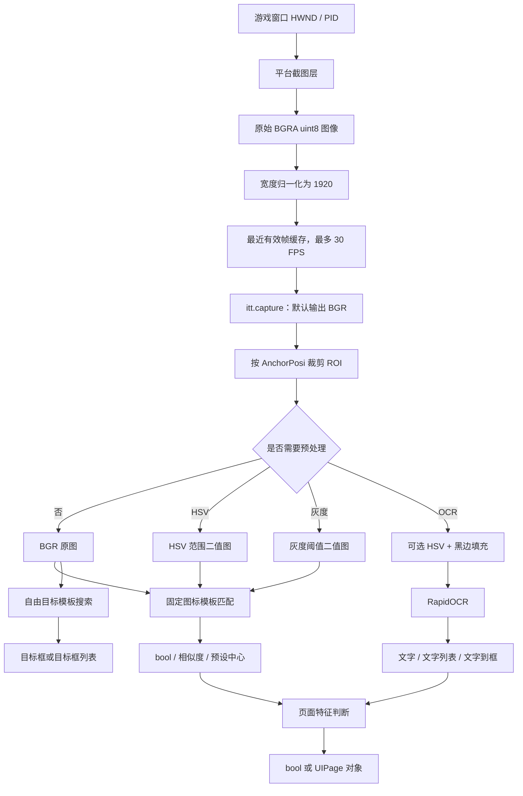

# Whimbox 图像处理参考

> 文档性质：Whimbox 2.5.4 截图、图像预处理、模板匹配、OCR 与页面判断实现参考
>
> 分析基线：`2.5.4`，提交 `a10fa3059f7a47cd26ba65a562184c8735562320`
>
> 分析日期：2026-07-18
>
> 关联方案：[总体架构与关键问题分析](01-总体架构与关键问题分析.md)
>
> 关联概念：[OCR、YOLO、CLIP、SAM 模块概念](02-图像处理模块概念.md)
>
> 界面状态专题：[页面特征、导航与主界面恢复](04-Whimbox界面状态判断.md)
>
> 新系统感知方案：[OCR、YOLO、CLIP、SAM模块概念](02-图像处理模块概念.md) · [界面与交互要素发现构想](../interface_discovery/基于用户游玩监控的界面与交互要素发现构想.md)
>
> 外部执行参考：[AzurLaneAutoScript可借鉴机制与设计思想](../../references/alas/AzurLaneAutoScript可借鉴机制与设计思想.md)

## 1. 文档范围

本文只分析 Whimbox 的图像处理链：

```text
游戏窗口
-> 获取截图
-> 分辨率和颜色归一化
-> 区域裁剪与预处理
-> 模板匹配、OCR 或专用视觉算法
-> 输出文字、坐标、相似度或页面状态
```

本文不展开任务调度、Agent 对话、键鼠执行和自动寻路控制逻辑。

Whimbox 当前实时视觉主链是经典 OpenCV 加 RapidOCR，没有接入 YOLO、CLIP 或 SAM。仓库中的多模态 Agent 截图分析是独立的按需分支，不属于基础实时识别链。

## 2. 总体图像处理流程



## 3. 游戏窗口截图

### 3.1 截图调用链

业务层统一通过 [`InteractionBGD.capture()`](../../../../reference_repos/whimbox/whimbox/interaction/interaction_core.py#L47) 获取图像：

```text
itt.capture()
-> InteractionBGD.capture()
-> PrintWindowCapture.capture()
-> PrintWindowCapture._get_capture()
-> CaptureManager.capture_window(HWND, PID)
-> 操作系统截图接口
```

[`PrintWindowCapture`](../../../../reference_repos/whimbox/whimbox/interaction/capture.py#L89) 不直接包含 Windows 或 macOS 代码，而是通过 [`platform/factory.py`](../../../../reference_repos/whimbox/whimbox/platform/factory.py#L27) 选择当前平台的截图管理器。

### 3.2 Windows 截图方式

Windows 主链位于 [`WindowsCaptureManager.capture_window()`](../../../../reference_repos/whimbox/whimbox/platform/windows/capture.py#L17)：

1. 根据窗口句柄调用 `GetClientRect()` 获取游戏客户区宽高；
2. 创建窗口 DC、兼容 DC 和兼容位图；
3. 调用 `PrintWindow(hwnd, ..., 3)` 请求游戏窗口绘制客户区；
4. 读取位图字节；
5. 构造成 `(height, width, 4)` 的 `uint8` NumPy 数组。

因此，Windows 下所谓的“完整截图”是整个游戏窗口客户区，而不是整个显示器桌面。按代码意图，截图不包含窗口标题栏和边框，代码也没有额外叠加鼠标指针。

仓库中的 [`winsdk_capture.py`](../../../../reference_repos/whimbox/whimbox/interaction/winsdk_capture.py#L1) 是 Windows Graphics Capture/D3D 实验实现，文件开头明确标注“暂时不使用”，不属于当前生产截图链。

### 3.3 macOS 截图方式

macOS 实现在 [`MacOSCaptureManager.capture_window()`](../../../../reference_repos/whimbox/whimbox/platform/macos/capture.py#L34)：

1. 通过 Quartz 按 PID 查找屏幕上的目标窗口边界；
2. 使用 `mss.grab()` 截取对应屏幕矩形；
3. 转成 NumPy 数组；
4. 找不到窗口时回退到主显示器截图。

该回退行为意味着，macOS 窗口失效时可能得到桌面画面，而不是明确的截图失败结果。

## 4. 截图格式与分辨率

### 4.1 分层图像格式

| 处理层 | 主要输出 |
| --- | --- |
| Windows/macOS 平台层 | 原始尺寸、四通道 BGRA、`uint8` |
| `Capture` 缓存层 | `(归一化高度, 1920, 4)`、BGRA、`uint8` |
| `itt.capture()` 默认输出 | `(归一化高度, 1920, 3)`、BGR、`uint8` |
| `itt.capture(..., FOUR_CHANNELS)` | 四通道 BGRA |
| ROI 裁剪输出 | 默认三通道 BGR 的局部 NumPy 数组 |
| HSV/灰度阈值输出 | 二维 `uint8` 二值图 |

[`InteractionBGD.capture()`](../../../../reference_repos/whimbox/whimbox/interaction/interaction_core.py#L61) 默认删除 Alpha 通道。参数名 `jpgmode` 是历史命名，函数不会直接编码或返回 JPEG 文件。

### 4.2 归一化规则

[`Capture._normalize_shape()`](../../../../reference_repos/whimbox/whimbox/interaction/capture.py#L33) 始终把有效截图缩放到宽度 1920：

```text
归一化宽度 = 1920
归一化高度 = int(1920 / 原始宽度 * 原始高度)
```

缩放使用 `cv2.INTER_NEAREST`，保持原始宽高比：

| 原始客户区 | 默认完整截图输出 |
| --- | --- |
| 1920×1080 | 1920×1080×3 |
| 2560×1440 | 1920×1080×3 |
| 1920×1200 | 1920×1200×3 |
| 2560×1600 | 1920×1200×3 |

16:10 画面不会被压缩成 16:9，而是保留额外的垂直区域。截图宽高比只有位于 `1.55 < width / height < 1.80` 时才被接受，见 [`PrintWindowCapture._check_shape()`](../../../../reference_repos/whimbox/whimbox/interaction/capture.py#L101)。

原始客户区尺寸另外保存在 `capture_obj.resolution` 中，格式是 `(原始高度, 原始宽度)`；业务视觉算法主要使用归一化后的 1920 逻辑坐标。

## 5. 帧缓存与失败行为

[`Capture.capture()`](../../../../reference_repos/whimbox/whimbox/interaction/capture.py#L57) 使用线程锁保护图像缓存，并向调用方返回缓存副本，避免调用者直接修改共享帧。

截图刷新上限为 30 FPS：

- 两次调用间隔不足约 33 毫秒时，返回同一缓存帧；
- 新截图有效时才替换缓存；
- 平台返回 `None` 或宽高比不合法时，保留上一张有效帧；
- 程序首次截图就失败时，返回初始化的 1920×1080 全黑缓存。

因此，基础截图接口通常不会把“截图断流”明确输出为 `None`：

```text
首次失败 -> 黑图
运行中失败 -> 上一张有效图
```

这提高了短暂截图失败时的稳定性，但也可能把断流误判为“画面没有变化”。当前输出中没有 `frame_id`、采集时间、是否复用缓存或截图有效性字段。

## 6. ROI 裁剪与坐标体系

[`crop()`](../../../../reference_repos/whimbox/whimbox/common/utils/img_utils.py#L47) 使用 1920×1080 作为基础逻辑坐标。视觉资产通过 `AnchorPosi(x1, y1, x2, y2, anchor, expand)` 描述区域，定义见 [`asset_utils.py`](../../../../reference_repos/whimbox/whimbox/common/utils/asset_utils.py#L33)。

处理规则如下：

- 1920×1080 图像直接使用逻辑坐标；
- 16:10 等更高画面根据左上、右上、底部、中心等锚点调整区域；
- `expand=True` 时可吸收超出基础1080高度的区域；
- 裁剪区域超出图像时使用黑色补边；
- 默认返回独立的数组副本；
- 输入图宽度小于1920时，被视为已经裁好的局部图，不再进行锚点适配。

这套方式让固定UI区域可以同时适配16:9和16:10，但所有资产仍然依赖1920×1080逻辑坐标与正确锚点。

## 7. 图像预处理

### 7.1 原始颜色图

未配置过滤条件时，模板匹配和OCR直接使用BGR截图或ROI。

### 7.2 HSV范围过滤

[`process_with_hsv_limit()`](../../../../reference_repos/whimbox/whimbox/common/utils/img_utils.py#L533) 执行：

```text
BGR图像
-> cv2.COLOR_BGR2HSV
-> cv2.inRange(lower, upper)
-> 二值掩膜
```

该分支适合白色文字、特定颜色按钮、方向箭头等颜色相对固定的视觉特征。

### 7.3 灰度阈值

图标配置 `gray_limit` 时，截图和模板会转为灰度，再按上下阈值生成二值图。模板初始化和预处理位于 [`ImgIcon._ensure_loaded()`](../../../../reference_repos/whimbox/whimbox/ui/template/img_manager.py#L65)。

### 7.4 OCR黑边填充

OCR入口通常会在ROI四周补固定宽度黑边，避免贴近边缘的文字检测不完整，见 [`add_padding()`](../../../../reference_repos/whimbox/whimbox/common/utils/img_utils.py#L530)。文字定位完成后再从坐标中减去padding。

## 8. 固定UI图标模板匹配

固定UI资产使用 [`ImgIcon`](../../../../reference_repos/whimbox/whimbox/ui/template/img_manager.py#L10) 表示，包含：

- 模板图片；
- 预设截图区域 `cap_posi`；
- 匹配阈值；
- 可选 HSV 或灰度过滤；
- 区域锚点；
- 日志策略。

处理流程：

```text
按 cap_posi 裁剪截图
-> 可选 HSV/灰度预处理
-> cv2.matchTemplate(TM_CCORR_NORMED)
-> 取得最高匹配度
-> 与 ImgIcon.threshold 比较
```

模板匹配原语 [`similar_img()`](../../../../reference_repos/whimbox/whimbox/common/utils/img_utils.py#L411) 可以输出最高分，或最高分与实际峰值位置。

上层 [`get_img_existence()`](../../../../reference_repos/whimbox/whimbox/interaction/interaction_core.py#L134) 根据模式输出：

| 模式 | 输出 |
| --- | --- |
| 默认 | 命中为 `True`，未命中为 `False` |
| `IMG_RATE` | 最高匹配度 `float` |
| `IMG_BOOLRATE` | 命中返回匹配度，未命中返回 `False` |
| `IMG_POSI` | 命中返回预设检测区域中心，未命中返回 `None` |

需要特别注意：`IMG_POSI` 返回的是资产预设ROI的中心，不是 `matchTemplate` 找到的实际峰值位置。固定检测区域必须足够准确，才能安全地把识别结果直接转换成点击位置。

## 9. 自由目标模板搜索

非固定UI目标使用 [`GameImg`](../../../../reference_repos/whimbox/whimbox/ui/template/img_manager.py#L155) 和 [`find_game_img()`](../../../../reference_repos/whimbox/whimbox/common/utils/ui_utils.py#L17)：

```text
载入保留Alpha的模板
-> Alpha生成匹配掩膜
-> 可选缩放模板
-> TM_CCOEFF_NORMED模板匹配
-> 阈值过滤
-> 多目标时执行简单重叠抑制
```

输出格式：

| 情况 | 输出 |
| --- | --- |
| 单目标命中 | `[x1, y1, x2, y2]` |
| 单目标未命中 | `None` |
| 多目标命中 | `[[x1,y1,x2,y2], ...]` |
| 多目标未命中 | `None` |

坐标相对于传入图像：输入完整截图时是完整逻辑画面坐标；输入ROI时是ROI局部坐标。多目标搜索内部使用匹配分数排序，但最终目标框中不保留分数。

## 10. RapidOCR识别

### 10.1 当前接入方式

[`interaction_core.py`](../../../../reference_repos/whimbox/whimbox/interaction/interaction_core.py#L20) 只接受 `General.ocr=rapid`。仓库虽然存在PaddleOCR文件，但没有接入当前OCR选择主链。

[`RapidOcr`](../../../../reference_repos/whimbox/whimbox/api/ocr_rapid.py#L15) 是进程内单例，并使用线程锁串行调用RapidOCR，避免同一OCR对象被并发执行。

OCR处理流程：

```text
裁剪文字区域
-> 可选HSV二值化
-> 四周补黑边
-> RapidOCR检测和识别
-> 固定错字替换
-> 简化成业务输出
```

### 10.2 OCR输出

| 接口 | 输出 |
| --- | --- |
| `ocr_single_line()` | 所有识别文字直接拼接成 `str` |
| `ocr_multiple_lines()` | `list[str]` |
| `ocr_and_detect_posi()` | `{文字: [x1,y1,x2,y2]}` |

对应实现见 [`InteractionBGD` OCR接口](../../../../reference_repos/whimbox/whimbox/interaction/interaction_core.py#L82) 和 [`ocr_rapid.py`](../../../../reference_repos/whimbox/whimbox/api/ocr_rapid.py#L50)。

`detect_and_ocr()` 会把OCR四点框简化为轴对齐外接矩形，输出坐标相对于原ROI。当前简化结果会丢弃：

- OCR置信度；
- 原始四点多边形；
- 长度小于等于1的文字；
- 同一文字的多个候选框，后出现的结果会覆盖先出现的结果。

没有识别结果时，三个接口分别输出空字符串、空列表或空字典，而不是统一错误对象。

## 11. 页面状态识别

页面判断不是独立模型，而是对图标和文字证据的简单组合。

普通 [`UIPage.is_current_page()`](../../../../reference_repos/whimbox/whimbox/ui/page.py#L38)：

```text
依次检查页面特征图标或文字
-> 任意一个特征命中
-> 返回 True
-> 全部未命中返回 False
```

[`TitlePage`](../../../../reference_repos/whimbox/whimbox/ui/page.py#L52) 则对固定标题区域做HSV过滤和单行OCR，要求识别文字与预设标题完全相等。

[`UI.get_current_page()`](../../../../reference_repos/whimbox/whimbox/ui/ui.py#L41) 遍历页面表：

- 返回第一个命中的 `UIPage` 或 `TitlePage` 对象；
- 全部页面都不匹配时抛出“无法识别当前页面”。

页面层没有输出候选页面列表、综合置信度或命中证据详情。

## 12. 专用视觉分支

除通用UI识别外，同一张归一化截图还会进入若干专用OpenCV算法，例如：

- 小地图局部模板匹配；
- 大地图全局模板匹配；
- 人物方向箭头识别；
- 镜头旋转估计；
- HSV像素计数；
- 圆检测；
- 画面相似度和稳定状态判断。

以 [`MiniMap`](../../../../reference_repos/whimbox/whimbox/map/detection/minimap.py#L11) 为例，图像处理结果保存在：

```text
position                  地图坐标
position_similarity       位置匹配分数
position_similarity_local 局部峰值分数
direction                 人物方向角度
direction_similarity      方向匹配分数
rotation                  镜头旋转角度
rotation_confidence       旋转估计置信值
```

这些输出属于各业务模块自己的状态，没有被转换为统一视觉结果结构。

## 13. 图像是否保存到文件

### 13.1 常规CV与OCR流程

常规模板识别和OCR只处理内存中的NumPy数组，不会自动保存原图或标注图。

[`save_snapshot()`](../../../../reference_repos/whimbox/whimbox/interaction/interaction_core.py#L469) 可以手动把当前帧保存到日志目录下的时间戳JPG，但当前仓库没有生产调用。调试模式主要通过 `cv2.imshow()` 显示中间结果。

### 13.2 Agent多模态截图分析

Agent工具的 `analyze_image(mode="screenshot")` 是独立分支，见 [`agent_workspace/tools.py`](../../../../reference_repos/whimbox/whimbox/agent_workspace/tools.py#L204)：

```text
itt.capture()
-> 保存 logs/screenshot/<session_id>_<uuid>.png
-> 必要时把最长边缩小到1000像素
-> 交给支持图片输入的LLM
-> 返回自然语言分析JSON
```

图片缩放见 [`agent_workspace/session.py`](../../../../reference_repos/whimbox/whimbox/agent_workspace/session.py#L183)，模型调用和结果格式见 [`Agent._analyze_image()`](../../../../reference_repos/whimbox/whimbox/agent.py#L425)。成功输出包含：

```text
status
message
analysis
image_source
source_mode
session_id
```

该分支是按需、落盘、多模态模型分析，不参与模板识别和OCR实时主链。

## 14. 输出内容汇总

| 层级 | 主要输出 | 未包含的信息 |
| --- | --- | --- |
| 截图层 | BGR/BGRA `numpy.ndarray` | `frame_id`、时间戳、是否旧帧、有效性 |
| ROI层 | 固定尺寸局部数组 | 原图身份、全局坐标变换记录 |
| 固定模板 | `bool`、相似度、预设中心 | 实际目标框、统一证据对象 |
| 自由模板 | 单个或多个目标框 | 最终框的匹配分数 |
| OCR | 字符串、字符串列表、文字到框字典 | 置信度、原始多边形、重复候选 |
| 页面层 | `bool` 或 `UIPage`对象 | 候选页面、综合置信度、命中证据 |
| 地图视觉 | 位置、方向、旋转及局部分数 | 统一帧身份和证据格式 |
| Agent视觉 | 自然语言分析JSON | 可供执行层直接验证的结构化状态 |

Whimbox面向任务执行层简化了视觉输出，因此业务代码使用方便；但截图、模板、OCR、页面和地图结果之间没有统一的 `Observation` 或 `Evidence` 对象。

## 15. 对新方案的参考价值

### 15.1 可以直接借鉴的思路

- 用单一截图门面隔离Windows和macOS平台实现；
- 统一逻辑分辨率，避免每项识别自行适配屏幕尺寸；
- 用锚点描述固定UI区域；
- 截图缓存加锁并返回副本；
- 先裁ROI，再运行轻量模板或OCR；
- 将固定图标、文字区域和阈值定义为可复用资产；
- 用简单、快速的模板和OCR完成确定性页面判断；
- 把耗时多模态分析放在独立按需路径。

### 15.2 不应直接照搬的部分

- 截图失败时静默复用旧帧；
- 没有统一 `frame_id`、时间戳和截图有效性；
- 不同识别接口分别返回 `False`、`None`、空列表、空字典或异常；
- OCR结果丢弃置信度和重复候选；
- 固定图标位置可能是预设区域中心，而非实际检测位置；
- 页面判断缺少候选集、证据详情和综合置信度；
- 调试数据默认不落盘，难以进行稳定离线回放；
- 视觉结果没有模型版本、阈值版本和输入帧身份。

本篇只记录Whimbox 2.5.4的视觉实现事实，不负责定义新系统的统一证据协议。后续系统中的帧身份、控件完整性、多模型成本路由和结果归因，以图像处理概念、交互发现及故障规范文档为准，避免在Whimbox参考文档中维护第二套规范。

面向关系网驱动的新系统，可以保留Whimbox“统一截图门面、ROI优先、轻量识别、页面收束”的工程结构，同时把输出升级为带帧身份、来源、置信度、候选和失败原因的统一证据。

## 16. 结论

Whimbox图像处理链可以概括为：

```text
获取游戏窗口客户区
-> 归一化为1920逻辑宽度
-> 缓存最近有效帧
-> 按固定锚点裁剪ROI
-> OpenCV模板、HSV/灰度规则或RapidOCR识别
-> 输出布尔值、分数、文字、坐标框或页面对象
```

它的优势是轻量、直接、适合已知UI和确定性任务；主要不足是缺少统一帧身份、结构化证据、完整置信度和明确失败状态。

后续新系统不需要抛弃这条链，而应把它作为高速基础视觉层，再按实际验证结果接入YOLO、CLIP和SAM，并把所有模块输出统一收束为可回放、可校准、可追踪的 `Observation/Evidence`。
