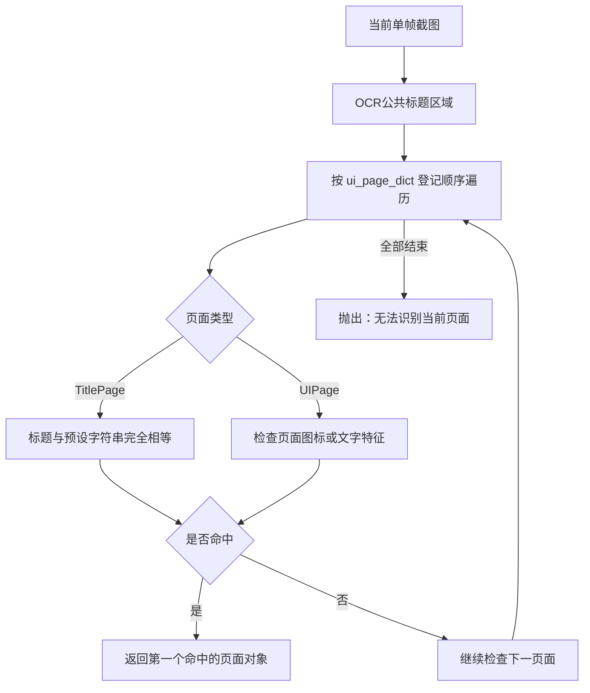

# Whimbox 界面状态判断

> 文档性质：Whimbox 2.5.4 页面特征、当前页面识别、页面导航与主界面恢复机制参考
>
> 分析基线：`2.5.4`，提交 `a10fa3059f7a47cd26ba65a562184c8735562320`
>
> 分析日期：2026-07-18
>
> 关联方案：[总体架构与关键问题分析](01-总体架构与关键问题分析.md)
>
> 图像基础：[Whimbox 图像处理参考](03-Whimbox图像处理参考.md)
>
> 键鼠执行专题：[输入适配、视觉闭环、宏与跑图控制](05-Whimbox键鼠执行.md)
>
> 新系统状态模型：[界面与交互要素发现构想](../interface_discovery/基于用户游玩监控的界面与交互要素发现构想.md) · [分层关系网与复合能力子图构想](../interface_discovery/分层关系网与复合能力子图构想.md) · [瞬态故障与置信度隔离](../interface_discovery/游戏瞬态故障判读与置信度隔离构想.md)

## 1. 核心结论

Whimbox 同时使用图标和文字判断界面状态，但当前实际实现主要是：

```text
一个已登记页面
-> 对应一个预先选定的特征图标
或
-> 对应一个固定标题文字
```

它不是通过“当前画面与基础主界面有什么差异”来推导页面，也没有根据上一页面、历史转换或多帧概率判断当前状态。

主界面承担的是另一项职责：

> 主界面是页面导航无法识别或执行失败时的安全恢复锚点，不是所有页面识别的初始视觉基准。

这里的“主界面”是角色正常游戏HUD页面 `page_main`；ESC菜单是独立页面 `page_esc`，不能把二者视为同一个基础菜单。

## 2. 页面状态的三个层次

Whimbox 中与界面状态有关的代码可以分成三层：

| 层次 | 主要职责 | 主要输出 |
| --- | --- | --- |
| 视觉特征层 | 判断图标或文字是否出现 | `bool`、相似度、文字 |
| 页面状态层 | 把特征绑定为命名页面 | `UIPage`、`TitlePage` |
| 页面导航层 | 根据页面之间的连接执行按键或点击 | 页面路径与执行结果 |

此外，奖励弹窗、确认框、跳过提示等临时状态通常不登记为完整页面，而是在任务代码中直接检测图标或文字。

## 3. 页面判定使用哪些元素

### 3.1 固定图标

普通页面使用 [`UIPage`](../../../../reference_repos/whimbox/whimbox/ui/page.py#L8)，其 `check_icon_list` 可以保存 `ImgIcon` 或 `Text` 特征。

当前实际页面表中的普通页面主要使用固定图标，例如 [`page_assets.py`](../../../../reference_repos/whimbox/whimbox/ui/page_assets.py#L8)：

```python
page_loading = UIPage(check_icon=IconUILoading)
page_main = UIPage(check_icon=IconPageMainFeature)
page_chat = UIPage(check_icon=IconPageChatFeature)
page_bigmap = UIPage(check_icon=IconUIBigmap)
page_dress = UIPage(check_icon=IconWardrobeFeature)
page_shop = UIPage(check_icon=IconShopFeature)
```

每个 `ImgIcon` 自身包含：

- 模板图片；
- 固定检测区域；
- 匹配阈值；
- 区域锚点；
- 可选HSV或灰度过滤。

页面判断调用 `itt.get_img_existence()`，在固定ROI内做模板匹配并输出是否超过阈值。

### 3.2 标题文字

具有公共标题栏的页面使用 [`TitlePage`](../../../../reference_repos/whimbox/whimbox/ui/page.py#L52)。它会：

```text
截取 AreaPageTitleFeature
-> HSV过滤亮色标题文字
-> RapidOCR单行识别
-> 与预设标题完全比较
```

例如：

```python
page_esc = TitlePage("美鸭梨")
page_daily_task = TitlePage("奇想日历")
page_huanjing = TitlePage("幻境挑战")
page_event = TitlePage("活动大厅")
page_setting = TitlePage("设置")
```

标题页面使用的是完全相等判断，不是模糊匹配或语义匹配。

### 3.3 接口支持文字特征，但当前页面表很少使用

`UIPage` 接口可以直接接受 `Text`，通过 `itt.get_text_existence()` 判断包含或精确匹配文字，见 [`UIPage.is_current_page()`](../../../../reference_repos/whimbox/whimbox/ui/page.py#L38)。

但当前 `page_assets.py` 中：

- 普通 `UIPage` 使用图标；
- 标题文字页面使用 `TitlePage`；
- 没有配置“图标与多个文字联合确认”的正式页面。

因此当前页面识别的实际主体可以概括为：

```text
普通页面 -> 单个特征图标
标题页面 -> 单个标题OCR结果
```

## 4. 多个特征如何组合

[`UIPage.is_current_page()`](../../../../reference_repos/whimbox/whimbox/ui/page.py#L38) 会依次检查 `check_icon_list`：

```text
特征A命中
OR 特征B命中
OR 特征C命中
-> 页面成立
```

它采用任意一个特征命中即成功的OR规则，不要求多个特征同时满足。

伪代码如下：

```python
for feature in page.check_icon_list:
    if feature_is_visible(feature):
        return True
return False
```

当前大多数页面只登记一个特征，因此实际上不存在多证据融合、投票或冲突处理。

## 5. 当前页面识别流程

[`UI.get_current_page()`](../../../../reference_repos/whimbox/whimbox/ui/ui.py#L41) 的完整流程是：



该流程有几个明确特点：

1. 每次根据当前截图独立判断；
2. 标题区域只预先OCR一次；
3. 按 `ui_page_dict` 插入顺序检查；
4. 多个页面同时误命中时返回第一个；
5. 所有页面均未命中时抛异常；
6. 不输出候选页面列表或综合置信度。

## 6. 没有参与页面判定的内容

当前 `get_current_page()` 没有使用：

- 上一次识别出的页面；
- 页面转换历史；
- 当前任务期望的页面范围；
- 主界面基准截图；
- 整屏差异或布局结构；
- 多帧连续投票；
- 页面先验概率；
- 图标与文字的联合权重；
- 候选页面排序；
- `UNKNOWN`状态对象。

识别失败以异常表示，而不是返回带原因的未知状态。

## 7. 画面稳定不等于状态识别

Whimbox 会在切换页面后调用 [`wait_until_stable()`](../../../../reference_repos/whimbox/whimbox/interaction/interaction_core.py#L236)，不断比较前后截图相似度，等待画面连续一段时间不再明显变化。

它只能回答：

```text
画面现在是否停止变化？
```

不能回答：

```text
这是什么页面？
```

页面切换流程通常是：

```text
执行按键或点击
-> 等待画面稳定
-> 等待加载图标消失
-> 再用图标或标题验证目标页面
```

因此，稳定帧检测是页面识别前的时序辅助，不是页面身份特征。

## 8. 页面关系图与状态识别的区别

[`page_assets.py`](../../../../reference_repos/whimbox/whimbox/ui/page_assets.py#L60) 使用 `page.link(button, destination)` 定义页面之间的有向连接，例如：

```text
主界面 --按地图键--> 地图
主界面 --按ESC--> 美鸭梨菜单
主界面 --按奇想日历键--> 奇想日历
奇想日历 --点击入口--> 幻境挑战
幻境挑战 --点击文字--> 素材激化幻境
```

页面关系图只描述：

- 从哪个页面可以到哪个页面；
- 需要按什么键或点击哪个按钮。

它不参与当前页面的视觉分类。程序仍然必须先通过图标或OCR识别当前页面，才能选择关系图中的起点。

## 9. 正常导航是否必须从主界面开始

不需要。

[`UI.goto_page()`](../../../../reference_repos/whimbox/whimbox/ui/ui.py#L61) 首先调用 `get_current_page()`：

```text
识别当前页面
-> 以当前页面为起点
-> BFS搜索到目标页面的路径
-> 逐步执行按键或点击
-> 每一步验证是否到达预期页面
```

例如，当前已经在“奇想日历”时，前往“幻境挑战”可以直接点击入口，不必先退回主界面。

执行每条页面边后，程序会：

1. 等待画面稳定；
2. 处理加载页面；
3. 把鼠标移到左上角，减少悬停样式影响；
4. 调用目标页面的 `is_current_page()` 再次验证。

所以正常流程是“从当前已识别页面开始导航”，而不是“每次从主界面重新开始”。

## 10. 主界面何时成为恢复锚点

主界面主要在两种情况下介入。

### 10.1 当前页面无法识别

`goto_page()` 捕获“无法识别当前页面”异常后，会调用 [`back_to_page_main()`](../../../../reference_repos/whimbox/whimbox/common/utils/ui_utils.py#L311)：

```text
无法识别当前页面
-> 尝试不断退出当前菜单或特殊场景
-> 检测 IconPageMainFeature
-> 确认回到游戏主界面
-> 将当前页面设为 page_main
-> 从主界面重新规划路径
```

### 10.2 页面切换验证失败

如果按键或点击后没有识别到预期页面，`goto_page()`会在允许重试时：

```text
返回主界面
-> 重新调用 goto_page(target)
```

对应恢复逻辑见 [`ui.py`](../../../../reference_repos/whimbox/whimbox/ui/ui.py#L162)。

因此主界面的准确定位是：

> 页面导航系统中容易检测、容易返回、连接较多的安全根节点。

它不是视觉分类的零点，也不是所有页面都必须经过的固定起点。

## 11. 主界面与ESC菜单不是同一个状态

页面表明确区分：

```python
page_main = UIPage(check_icon=IconPageMainFeature)
page_esc = TitlePage("美鸭梨")
```

两者的关系是：

```text
page_main --ESC--> page_esc
page_esc --ESC--> page_main
```

所以如果“基础界面菜单”指ESC菜单，那么答案是否定的：Whimbox不会以ESC菜单作为所有状态的初始值。

它用于恢复的基础状态是正常游戏主界面 `page_main`，程序可能通过多次ESC返回这个状态。

## 12. 临时弹窗和局部状态

并非所有可见界面都被定义为 `UIPage`。

奖励领取、退出确认、跳过对话、按钮禁用、加载提示等临时状态，通常由业务任务直接调用：

```text
itt.get_img_existence(icon)
itt.get_text_existence(text)
itt.ocr_single_line(area)
wait_until_appear(icon)
appear_then_click(button)
```

这些状态具有以下特点：

- 只在相关任务内部有意义；
- 不一定进入全局 `ui_page_dict`；
- 不一定具有页面关系边；
- 输出通常是 `bool`、文字或局部坐标；
- 任务结束后不会保留为长期页面状态。

因此，Whimbox实际采用两级界面模型：

```text
主要页面状态 -> UIPage / TitlePage + 页面关系图
临时局部状态 -> 任务内部直接检测图标或文字
```

## 13. 当前输出形式

| 判定层 | 成功输出 | 失败输出 |
| --- | --- | --- |
| 图标是否存在 | `True`或相似度 | `False`、`None` |
| 文字是否存在 | `True` | `False` |
| OCR标题 | `str` | 空字符串或错误文字 |
| 单页面验证 | `True` | `False` |
| 当前页面识别 | `UIPage`/`TitlePage`对象 | 抛出异常 |
| 页面切换 | 到达目标后返回 | 重试或抛出异常 |

当前没有统一输出：

```text
frame_id
page_id
candidate_pages
matched_evidence
confidence
previous_page
transition_id
failure_reason
```

## 14. 优点与局限

### 14.1 优点

- 已知页面判断速度快；
- 页面资产定义简单；
- 图标和标题容易人工调试；
- 页面关系与视觉识别相互分离；
- BFS可以从当前页面直接寻找目标；
- 主界面恢复路径降低未知状态下继续乱点的风险；
- 页面切换后会重新验证，不只相信输入已经生效。

### 14.2 局限

- 多数页面只有单个视觉特征，误报会直接成为页面结论；
- 多特征采用OR规则，无法要求关键证据同时成立；
- 标题OCR要求完全相等，对错字和遮挡敏感；
- 页面同时命中时按登记顺序返回第一个；
- 没有多帧稳定投票和状态连续性约束；
- 没有候选页面、置信度和证据详情；
- 临时弹窗与主要页面缺少统一状态模型；
- 截图层可能返回旧帧，页面层无法判断证据是否过期；
- 未登记的新页面只能表现为识别异常。

## 15. 对关系网驱动新方案的参考

Whimbox可以提供一个很好的初始工程结构：

```text
视觉特征
-> 命名页面
-> 页面连接
-> 路径搜索
-> 逐步执行与验证
-> 未知时回到安全锚点
```

但新方案不应把单个图标命中直接升级成稳定关系图节点。更稳妥的界面状态判断可以在Whimbox基础上增加：

1. 每帧携带 `frame_id` 和采集时间；
2. 同一页面支持必需证据与可选证据；
3. 图标、OCR、YOLO、CLIP分别保留原始分数；
4. 对候选页面进行排序，而不是首个命中即结束；
5. 使用连续多帧确认状态进入与退出；
6. 结合上一状态和允许转换边限制候选范围；
7. 无法确认时输出 `UNKNOWN`，而不是强制猜测；
8. 把弹窗、遮罩、加载、对话等建模为可叠加状态；
9. 保留实际命中的证据区域，支持用户确认和离线回放；
10. 把“回主界面”保留为恢复策略，而不是识别前置条件。

推荐的新方案判断关系是：

```text
当前帧视觉证据
+ 上一稳定状态
+ 关系图允许的转换
+ 连续帧确认
-> CONFIRMED_STATE 或 UNKNOWN
```

### 15.1 页面身份不能承载全部运行状态

新系统需要把Whimbox当前混在页面判断或业务分支中的信息拆成正交维度：

| 维度 | 回答的问题 |
| --- | --- |
| `page_identity` | 当前主要页面是什么 |
| `overlay_state` | 是否叠加弹窗、遮罩、加载或对话 |
| `ui_integrity` | 预期控件是否完整、缺失、遮挡或发生布局迁移 |
| `availability_state` | 目标能力当前是否可用或变灰 |
| `control_context` | 当前角色、能力、槽位和绑定版本是什么 |
| `environment_health` | 截图、窗口、输入和游戏进程是否健康 |

这些维度共同形成一次`StateSnapshot`。单帧检测产生的只是`ObservationState`候选，只有连续帧、上下文约束和否定证据均通过后，才成为执行器可以使用的运行事实。

### 15.2 页面图与能力图保持分工

Whimbox的`UIPage.links`仍可作为固定页面导航的参考，但新系统统一表达为：

```text
StateDefinition节点
-> TransitionDefinition边
-> 边引用CapabilitySpec
-> 每次执行后重新生成StateSnapshot
```

页面图提供候选下一跳，观察结果决定真实落点。弹窗等通用中断由独立处理器优先处理；恢复到主界面属于`RecoveryRun`，不能覆盖原始执行尝试的结果。

## 16. 结论

Whimbox的界面状态判断可以概括为：

```text
图标模板或标题OCR
-> 判断已登记的主要页面
-> 返回第一个命中的页面对象
-> 根据页面关系图导航
-> 每一步重新验证
-> 无法识别或切换失败时回到主界面恢复
```

因此，对最初问题的准确回答是：

- Whimbox依靠图标和文字判定页面；
- 当前实际配置以单图标或单标题为主；
- 不以基础主界面截图作为所有状态比较基准；
- 正常导航可以从任何已识别页面开始；
- 游戏主界面只在未知状态或失败重试时充当安全根节点；
- ESC菜单本身也是一个需要识别和导航的普通页面。
