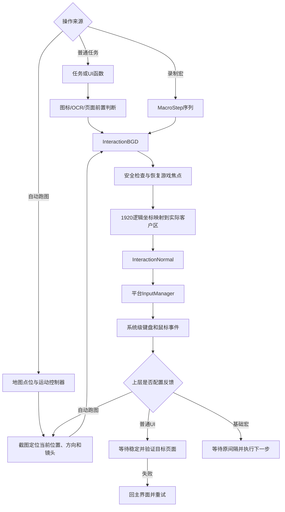

# Whimbox 键鼠执行

> 文档性质：Whimbox 2.5.4 鼠标、键盘、宏回放与视觉反馈纠错机制参考
>
> 分析基线：`2.5.4`，提交 `a10fa3059f7a47cd26ba65a562184c8735562320`
>
> 分析日期：2026-07-18
>
> 关联方案：[总体架构与关键问题分析](01-总体架构与关键问题分析.md)
>
> 图像基础：[Whimbox 图像处理参考](03-Whimbox图像处理参考.md)
>
> 状态基础：[Whimbox 界面状态判断](04-Whimbox界面状态判断.md)
>
> 新系统输入边界：[多窗口输入归属与游戏视角异常恢复构想](../interface_discovery/多窗口输入归属与游戏视角异常恢复构想.md) · [鼠标滚轮缩放与视口控制构想](../interface_discovery/鼠标滚轮缩放与视口控制构想.md)
>
> 连续控制源码参考：[Whimbox鼠标拖拽与镜头旋转机制](../../references/whimbox/interaction_control/Whimbox鼠标拖拽与镜头旋转机制.md)

## 1. 核心结论

Whimbox 同时具有录制宏和函数化键鼠操作，但两者不是同一种执行方式：

| 执行类型 | 操作来源 | 反馈与纠错 |
| --- | --- | --- |
| 普通UI任务 | 程序预先编写的函数与页面关系 | 通常包含识别、等待、验证和重试 |
| 用户录制宏 | 录制的键鼠事件、坐标和时间间隔 | 主要是开环回放，只有有限适配 |
| 增强宏 | 人工加入页面等待或页面导航步骤 | 局部使用页面识别，但录制器不会自动生成 |
| 自动跑图 | 录制的地图点位和动作参数 | 持续截图定位，属于视觉闭环控制 |

因此，不能把 Whimbox 概括成纯宏工具，也不能认为每一次点击函数都自带完整纠错。

更准确的分层是：

```text
底层输入函数
-> 只负责发送鼠标和键盘事件

交互门面
-> 负责焦点恢复、坐标适配、延迟和部分安全保护

UI与任务层
-> 负责识别目标、操作后验证、失败重试

宏层
-> 默认按录制的时间和坐标开环回放

跑图层
-> 持续视觉定位并修正运动方向
```

## 2. 键鼠执行总体链路



## 3. 底层输入不是后台定向消息

Windows平台输入实现在 [`WindowsInputManager`](../../../../reference_repos/whimbox/whimbox/platform/windows/input.py#L18)：

- 鼠标按下和抬起使用 `win32api.mouse_event()`；
- 鼠标绝对移动使用 `SetCursorPos()`；
- 鼠标相对移动使用 `MOUSEEVENTF_MOVE`；
- 键盘使用 `keybd_event()`；
- 普通字符通过 `VkKeyScanA` 转换为虚拟键码；
- 其他按键使用项目维护的 `VK_CODE`。

这些是系统级输入事件，不是把鼠标或键盘消息直接投递给某个后台窗口。

因此，输入函数本身不知道：

- 当前光标下是不是目标按钮；
- 游戏是否收到事件；
- 点击后页面是否切换；
- 当前画面是否卡住；
- 其他窗口是否抢走输入；
- 录制坐标对应的控件是否已经移动。

这也是 Whimbox 每次操作前需要恢复游戏焦点的原因。

## 4. 基础点击与按键行为

跨平台输入包装位于 [`InteractionNormal`](../../../../reference_repos/whimbox/whimbox/interaction/interaction_normal.py#L14)。

### 4.1 鼠标点击

普通左键点击执行：

```text
mouse_down(left)
-> 等待0.1秒
-> mouse_up(left)
```

右键和中键采用同样的按下、等待、抬起方式，见 [`interaction_normal.py`](../../../../reference_repos/whimbox/whimbox/interaction/interaction_normal.py#L23)。

双击只是连续执行两次单击，中间加入可配置短间隔。

### 4.2 键盘点击

[`key_press()`](../../../../reference_repos/whimbox/whimbox/interaction/interaction_normal.py#L70) 执行：

```text
key_down(key)
-> 等待0.1秒
-> key_up(key)
```

上层还允许把 `mouse_left`、`mouse_right` 和 `mouse_middle` 作为特殊键名交给 `key_down()`、`key_up()` 或 `key_press()`，见 [`interaction_core.py`](../../../../reference_repos/whimbox/whimbox/interaction/interaction_core.py#L374)。

这些固定延迟用于提高游戏接受输入的稳定性，但不验证输入结果。

## 5. 操作前安全检查与焦点恢复

大多数上层输入函数都由 [`before_operation()`](../../../../reference_repos/whimbox/whimbox/interaction/interaction_core.py#L295) 装饰。

执行顺序为：

```text
检查该函数当前是否允许交互
-> 检查游戏窗口是否在前台
-> 不在前台则强制前置游戏
-> 执行真实输入函数
```

### 5.1 前台窗口恢复

如果游戏失去焦点，输入门面调用 `hwnd_handler.set_foreground()`，恢复后立即继续执行操作。

任务插件入口还会在任务开始前检查：

- 游戏进程是否存活；
- 句柄是否需要刷新；
- 游戏窗口能否前置；
- 游戏宽高比是否为16:9或16:10。

入口检查见 [`plugins/game_nikki/main.py`](../../../../reference_repos/whimbox/whimbox/plugins/game_nikki/main.py#L37)。

### 5.2 商城与抽卡保护

[`_can_interact()`](../../../../reference_repos/whimbox/whimbox/interaction/interaction_core.py#L287) 在部分左键函数执行前检测商城和抽卡页面特征，命中时抛出异常，防止继续点击。

该保护只按被调用函数名覆盖：

```text
left_click
left_down
left_double_click
move_and_click
```

它不覆盖所有输入形式。宏回放鼠标步骤通过 `key_down("mouse_left")` 和 `key_up("mouse_left")` 执行，因此不能把这项保护理解为对所有宏点击都有效。

## 6. 逻辑坐标与实际窗口坐标

Whimbox视觉资产和宏坐标主要基于宽度1920的逻辑坐标。

[`InteractionNormal.move_to()`](../../../../reference_repos/whimbox/whimbox/interaction/interaction_normal.py#L103) 的转换过程是：

```text
逻辑坐标(x, y)
-> 根据原始客户区宽度计算scale
-> 根据TOP/BOTTOM/CENTER锚点修正16:10纵向偏移
-> 乘以scale得到真实客户区坐标
-> client_to_screen转换为桌面坐标
-> SetCursorPos移动系统光标
```

近似比例为：

```text
scale = 原始客户区宽度 / 1920
```

相对移动只进行比例缩放，不执行绝对客户区到屏幕坐标转换。

该层能够适配：

- 1920×1080与2560×1440；
- 1920×1200与2560×1600；
- 窗口在桌面上的不同位置；
- UI区域在16:10画面中的顶部、底部或中心锚点。

它不能修正：

- 控件自身位置发生变化；
- 游戏UI缩放设置改变；
- 弹窗遮挡目标；
- 录制时与回放时页面不同；
- 模板配置区域不准确。

## 7. 移动、点击与并发边界

[`move_to()`](../../../../reference_repos/whimbox/whimbox/interaction/interaction_core.py#L422) 和 [`move_and_click()`](../../../../reference_repos/whimbox/whimbox/interaction/interaction_core.py#L442) 使用 `operation_lock` 包围鼠标移动阶段。

`move_and_click()`的实际顺序是：

```text
取得移动锁
-> 把鼠标移动到目标坐标
-> 释放移动锁
-> 等待默认0.3秒
-> 执行鼠标点击
```

中键滚动也使用这把锁，但普通点击和键盘事件没有全部纳入同一串行队列。

所以当前锁主要减少同时移动鼠标造成的冲突，不是完整的全局输入事务锁。多个任务若并发发送键盘和点击事件，仍需要由更上层任务调度避免冲突。

## 8. 普通任务的视觉驱动操作

普通任务通常不是回放一段用户录制的坐标，而是显式编写：

```text
检测目标
-> 目标存在才操作
-> 等待画面变化
-> 验证目标状态
```

### 8.1 出现后点击

[`appear_then_click()`](../../../../reference_repos/whimbox/whimbox/interaction/interaction_core.py#L200) 接收图标、文字或按钮资产：

1. 截取目标预设区域；
2. 通过模板或OCR判断目标是否存在；
3. 命中时取得预设点击位置；
4. 移动并点击；
5. 未命中时返回 `False`，不执行点击。

这比盲点固定坐标安全，但需要注意：固定 `ImgIcon` 的位置通常是预设检测区域中心，不是模板匹配的真实峰值坐标。

### 8.2 页面导航闭环

[`UI.goto_page()`](../../../../reference_repos/whimbox/whimbox/ui/ui.py#L61) 是较完整的UI操作闭环：

```text
识别当前页面
-> BFS搜索到目标页面的路径
-> 按键或识别按钮后点击
-> 等待画面稳定
-> 等待加载状态结束
-> 验证是否到达下一页面
-> 失败时回到主界面并重试
```

页面切换成功不是由“已经发送输入”决定，而是由目标页面的图标或标题重新识别确认。

这类“操作后重新截图验证”才是Whimbox主要的函数化纠错方式。

## 9. 纠错不在每个函数中自动发生

需要区分两类函数：

### 9.1 纯执行函数

```text
left_click
key_press
move_to
move_and_click
middle_scroll
```

它们只负责适配坐标、恢复焦点和发送输入，不知道业务结果是否正确。

### 9.2 带视觉条件的业务函数

```text
appear_then_click
wait_until_appear
goto_page
ensure_page
任务内部的截图检测循环
```

这些函数才可能具有：

- 操作前检查；
- 页面等待；
- 超时；
- 结果验证；
- 返回主界面；
- 重试或停止。

不同业务任务的纠错程度并不完全一致，不能因为 `goto_page()` 有闭环，就认为所有键鼠动作都自动重试。

## 10. 宏录制内容

[`RecordMacroTask`](../../../../reference_repos/whimbox/whimbox/task/macro_task/record_macro_task.py#L15) 使用 `pynput` 启动键盘和鼠标监听器。

### 10.1 键盘事件

键盘记录：

- 按键名称；
- `press`或`release`；
- 与上一事件的时间间隔；
- 当前仍处于按下状态的键集合。

长按产生的重复 `press` 会被过滤。相邻事件时间差超过10毫秒时，录制器插入一个 `gap`步骤，见 [`_on_keyboard_press()`](../../../../reference_repos/whimbox/whimbox/task/macro_task/record_macro_task.py#L61)。

### 10.2 鼠标事件

鼠标监听器只注册 `on_click`，不记录连续 `move`事件，见 [`RecordMacroTask.step1()`](../../../../reference_repos/whimbox/whimbox/task/macro_task/record_macro_task.py#L206)。

每次鼠标按下或松开记录：

```text
type = mouse
key = mouse_left / mouse_right / mouse_middle
action = press / release
position = 窗口内逻辑坐标
```

屏幕坐标先减去窗口左上角，再按窗口宽度归一化到1920，见 [`_screen_to_window_position()`](../../../../reference_repos/whimbox/whimbox/task/macro_task/record_macro_task.py#L37)。

因为不记录连续鼠标移动，录制界面明确提示“不支持录制视角转动操作”。

### 10.3 保存格式

录制结果保存为版本3.0的JSON宏，包含：

- 宏名称和更新时间；
- 宏类型；
- 有鼠标事件时的16:9或16:10宽高比；
- 有序 `MacroStep`列表。

基础录制器主要生成：

```text
gap
keyboard
mouse
```

## 11. 基础宏回放

[`RunMacroTask._execute_step()`](../../../../reference_repos/whimbox/whimbox/task/macro_task/run_macro_task.py#L101) 对基础步骤执行：

```text
gap      -> 按录制时长sleep
keyboard -> key_down或key_up
mouse    -> move_to录制坐标，再mouse down或up
```

因此基础宏的核心是：

> 按录制时间和窗口逻辑坐标顺序重放输入事件。

### 11.1 回放前检查

[`execute_macro()`](../../../../reference_repos/whimbox/whimbox/task/macro_task/run_macro_task.py#L174) 会检查：

- 宏版本是否为3.0；
- 普通鼠标宏的宽高比是否与录制时一致；
- 乐谱宏是否已经处于演奏页面；
- 调用方是否要求停止。

这些检查能够避免部分明显不兼容情况，但不会确认普通宏当前是否处于录制时的起始页面。

### 11.2 拖拽回放优化

录制器虽然不记录连续move，但能记录鼠标按下点和释放点。

[`_find_drag_release_step()`](../../../../reference_repos/whimbox/whimbox/task/macro_task/run_macro_task.py#L36) 会识别：

```text
mouse press(A)
-> 一个或多个gap
-> 同一鼠标键release(B)
```

当持续时间至少0.08秒且A、B距离至少10像素时，执行器把它转换为从A到B的平滑拖拽。

这属于回放轨迹优化，不是根据当前画面寻找正确拖拽目标。

### 11.3 停止清理

[`handle_finally()`](../../../../reference_repos/whimbox/whimbox/task/macro_task/run_macro_task.py#L251) 会释放 `pressing_keys` 中仍处于按下状态的键，减少宏被停止后角色持续移动或鼠标保持按下的风险。

宏结束后刻意不自动返回主界面。

## 12. 增强宏步骤

[`MacroStep`](../../../../reference_repos/whimbox/whimbox/common/scripts_manager.py#L43) 除基础输入外还支持：

| 步骤类型 | 行为 |
| --- | --- |
| `loop` | 循环执行后续若干步骤 |
| `wait_game_page` | 等待指定页面出现 |
| `wait_not_game_page` | 等待指定页面消失 |
| `goto_game_page` | 调用页面关系图导航到指定页面 |

运行器对页面等待使用20秒默认超时；`goto_game_page` 调用 `ui_control.goto_page(..., max_retry=2)`，见 [`run_macro_task.py`](../../../../reference_repos/whimbox/whimbox/task/macro_task/run_macro_task.py#L131)。

但基础录制器不会自动生成这些高级步骤。它们需要：

- 人工编辑JSON；
- 外部宏制作工具；
- 下载的预制宏；
- 后续更高层步骤编辑器。

所以不能因为宏格式支持页面条件，就认为所有用户录制宏天然具有页面纠错。

## 13. 宏纠错能力的边界

普通录制宏默认没有：

- 回放前识别起始页面；
- 每次点击前重新寻找图标或文字；
- 控件位置变化后的动态定位；
- 每次点击后验证预期结果；
- 失败步骤自动重放；
- 根据当前画面跳过已经完成的步骤；
- 根据错误状态重新规划后续步骤。

当前实现还有两个需要注意的失败语义：

1. `wait_game_page`和`wait_not_game_page`超时后记录错误日志，但仍可能继续执行后续宏步骤；
2. `_execute_step()`捕获单步异常后只写日志，没有统一把整个宏任务标为失败。

因此宏可能出现“部分步骤失败，但宏序列继续并最终显示执行结束”的情况。

如果调用方传入 `check_stop_func`，宏可以在外部条件成立时提前停止，但这仍不是通用的步骤纠错机制。

## 14. 自动跑图不是原始键鼠宏

Whimbox的路线录制保存的是地图点位、移动模式和动作参数，不是原始WASD时间序列。

执行时 [`AutoPathTask`](../../../../reference_repos/whimbox/whimbox/task/navigation_task/auto_path_task.py#L276) 会反复：

```text
截图小地图
-> 识别当前位置
-> 读取目标点
-> 计算距离和目标方向
-> 识别镜头旋转
-> 调整视角
-> 控制前进、跳跃或停止
-> 再次截图获取反馈
```

地图位置、人物方向和镜头旋转分别通过 [`Map.get_position()`](../../../../reference_repos/whimbox/whimbox/map/map.py#L70)、[`get_direction()`](../../../../reference_repos/whimbox/whimbox/map/map.py#L173) 和 `get_rotation()`更新。

这属于视觉反馈闭环：执行器不会只相信“已经按住W足够长时间”，而是持续根据截图估计实际位置并调整。

因此，路线脚本与键鼠宏应明确区分：

```text
键鼠宏 -> 记录输入事件，主要开环回放
路线脚本 -> 记录目标点，执行时闭环控制
```

## 15. 四个层次的纠错能力

| 层次 | 已有处理 | 不具备的能力 |
| --- | --- | --- |
| 平台输入层 | 虚拟键码、系统鼠标事件 | 不知道业务目标和执行结果 |
| 交互门面层 | 焦点恢复、坐标缩放、锚点、延迟、部分保护 | 不自动验证按钮和页面 |
| UI/任务层 | 图标/OCR前置判断、稳定等待、页面验证、重试 | 覆盖程度取决于具体任务实现 |
| 基础宏层 | 宽高比检查、坐标适配、拖拽优化、残留键释放 | 没有通用视觉闭环和失败重规划 |
| 跑图控制层 | 位置、方向、旋转持续反馈 | 依赖小地图模板和定位质量 |

## 16. 对关系网驱动新方案的参考

Whimbox值得保留的设计包括：

- 平台输入接口与业务任务分离；
- 使用统一1920逻辑坐标；
- 操作前恢复目标窗口焦点；
- 点击动作包含明确按下和抬起；
- 维护当前按下键集合并在停止时释放；
- 视觉识别成功后才点击目标；
- 页面切换后重新截图验证；
- 失败时返回已知安全页面；
- 路线执行采用持续视觉反馈，而不是WASD定时回放。

新方案需要进一步统一：

1. 所有输入动作生成唯一 `action_id`；
2. 记录动作前后 `frame_id`；
3. 明确前置状态、目标状态和超时；
4. 每一步使用公共`ExecutionOutcome`：`SUCCEEDED/FAILED/UNKNOWN/CANCELLED/BLOCKED`；
5. 单步异常不能只写日志后继续；
6. 超时策略明确为停止、重试、恢复或询问用户；
7. 鼠标目标优先绑定检测结果，而不是固定绝对坐标；
8. 宏录制自动识别并插入稳定页面检查点；
9. 执行前确认当前状态与录制前置状态兼容；
10. 所有物理输入通过桌面级`GlobalInputArbiter`串行提交，避免不同窗口和任务争夺键鼠；
11. 安全页面保护覆盖所有鼠标输入路径；
12. 失败后保留截图、证据、实际输入和恢复过程用于回放。

操作前把游戏窗口前置只能证明系统执行过一次焦点恢复，不能证明输入一定由目标游戏消费。完整输入事务还需要：

```text
取得desktop_physical_input
-> WindowRegistry确认目标窗口代次
-> FocusBroker取得FocusLease并生成focus_epoch
-> 输入前核验前台窗口和桌面状态
-> 提交一个带action_id的输入
-> 通过目标窗口视觉响应验证真实接收者
-> 后置状态验证完成后释放租约
```

计划排队期间如果焦点、窗口代次或`control_schema_epoch`变化，旧输入必须失效并重新执行前置检查，不能沿用排队前的坐标和控件绑定。

### 16.1 离散输入与连续控制分开

点击和短按可作为原子Capability；拖拽、长按、滚轮、镜头和角色移动应使用`ContinuousController`。连续控制保存目标条件、观察器、控制律、`CalibrationProfile`、超时和清理策略，不保存一条长期开放循环或原始鼠标轨迹。

### 16.2 结果和故障归因分开

一次输入结果应拆成：

```text
ExecutionOutcome
+ reason_code
+ FailureAttribution
+ SampleDisposition
```

输入错投、截图失败、游戏瞬态Bug和能力定义错误不能统一降低关系可靠性。领域证据进入公共`StepAttempt`，恢复过程另建`RecoveryRun`。

推荐把一个可验证输入步骤定义为：

```text
前置状态与视觉证据
-> 目标控件或按键
-> 具体输入事件
-> 等待条件
-> 成功后置状态
-> 超时与失败策略
```

这比只保存“坐标+按键+时间间隔”更适合进入关系网并长期维护。

## 17. 结论

Whimbox键鼠执行可以概括为：

```text
底层函数负责发送系统级输入
-> 交互层负责焦点、坐标和基础保护
-> 普通任务通过视觉判断和页面验证形成局部闭环
-> 录制宏按事件、坐标和时间开环回放
-> 增强宏可人工加入页面等待与导航
-> 自动跑图通过持续截图形成运动闭环
```

因此，对“鼠标点击、键盘操作是录制宏还是有函数纠错”的准确回答是：

- 两种方式都存在；
- 主要业务任务不是录制宏，而是程序函数驱动；
- 真正纠错主要发生在UI、任务和导航层，而不是底层点击函数；
- 普通录制宏只有分辨率、坐标、焦点和按键清理等有限适配；
- 宏默认不会逐步识别和验证界面；
- 跑图则属于持续视觉反馈控制，纠错能力明显强于普通宏。
