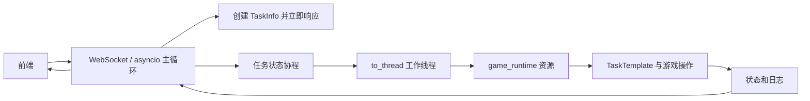
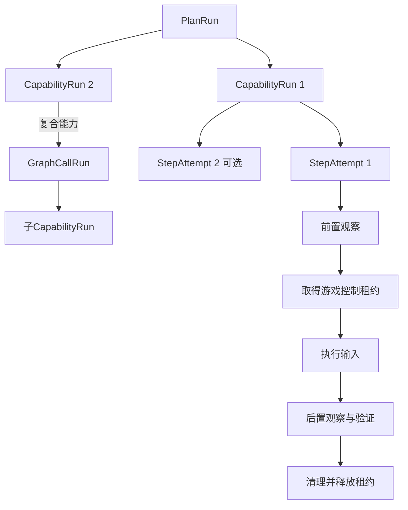
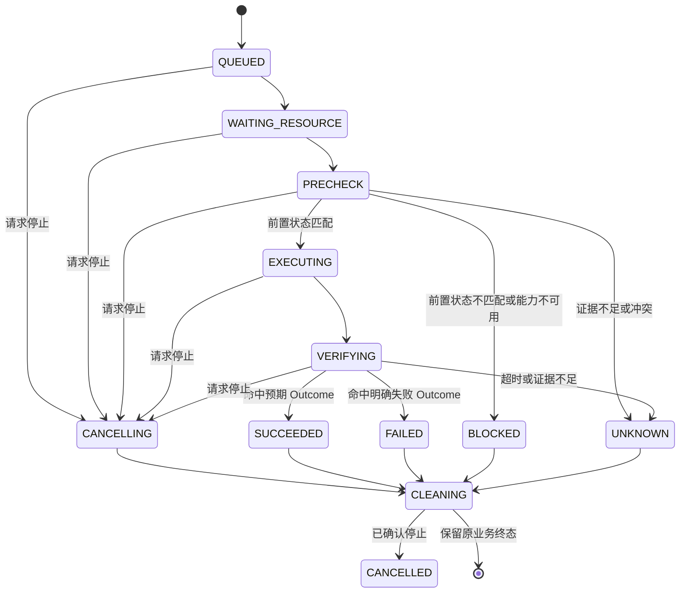

# Whimbox 任务调度、停止与资源互斥

> 文档性质：面向关系网 Step 执行方案的 Whimbox 2.5.4 实现参考
>
> Whimbox 基线：`2.5.4`，提交 `a10fa3059f7a47cd26ba65a562184c8735562320`
>
> 上位方案：[总体架构与关键问题分析](01-总体架构与关键问题分析.md)
>
> 相邻专题：[键鼠执行](05-Whimbox键鼠执行.md) · [运行事件与前后端解耦](07-Whimbox运行事件与前后端解耦.md) · [插件能力注册与调用边界](09-Whimbox插件能力注册与调用边界.md) · [错误恢复与执行证据](10-Whimbox错误恢复与执行证据.md)
>
> 桌面输入边界：[多窗口输入归属与游戏视角异常恢复构想](../interface_discovery/多窗口输入归属与游戏视角异常恢复构想.md) · [分层关系网与复合能力子图构想](../interface_discovery/分层关系网与复合能力子图构想.md)

## 1. 核心结论

Whimbox 的任务调度不是“前端调用一个函数，然后一直等待函数结束”，而是分成控制面和执行面：

```text
前端提交 task.run
-> 后端立即创建 TaskInfo 并返回 task_id
-> asyncio 协程维护外层任务状态
-> 同步游戏任务进入工作线程
-> 工作线程等待并持有 game_runtime 资源
-> TaskTemplate 顺序运行具体步骤
-> 状态和日志异步广播给前端
```

这使截图、OCR、`time.sleep()` 和键鼠操作不会直接阻塞 WebSocket 主事件循环。前端能够继续响应查询和停止按钮，但这不等于后台任务可以被强制立即终止。

Whimbox 当前机制可以概括为：

| 关注点 | 当前做法 | 主要边界 |
| --- | --- | --- |
| 异步启动 | 创建后台 `asyncio.Task`，立即返回 `task_id` | 只解耦前端等待，不会把同步任务变成可抢占协程 |
| 同步执行 | `asyncio.to_thread()` 把插件和任务放入线程池 | 取消外层协程不保证停止底层线程 |
| 业务步骤 | `TaskTemplate` 按注册顺序执行函数，可返回下一步骤名 | 不是通用 Plan/Step 数据模型 |
| 任务停止 | 整条父子任务链共享 `threading.Event` | 必须由执行代码主动检查 |
| 游戏互斥 | `screen/input` 工具统一占用 `game_runtime` | 单槽、无 FIFO、无锁等待超时 |
| 清理 | 每次任务尝试都进入 `handle_finally()` | 默认回主界面可能不适合所有原子 Step |
| 自动重试 | `error` 状态从头再运行一次 | 复用同一对象，可能携带第一次的脏状态 |

对关系网系统而言，值得借鉴的是“控制面与执行面分离、整个观察—输入—验证过程持有独占游戏资源、停止事件向子执行单元传播、终止时统一清理”。不应直接照搬的是隐式父子关系、默认成功、同对象自动重试和只有一个全局游戏资源组。

## 2. Whimbox 的任务分层

Whimbox 并不存在一个对象独自完成全部调度。一次任务跨越以下层次：

| 层次 | 核心对象 | 主要职责 |
| --- | --- | --- |
| RPC 控制层 | [`_start_registered_task()`](../../../../reference_repos/whimbox/whimbox/rpc_server.py#L511) | 校验会话、创建任务、安排后台协程、立即返回 ID |
| 外层任务记录 | [`TaskInfo`](../../../../reference_repos/whimbox/whimbox/task_manager.py#L9) | 保存任务状态、时间、结果、错误和停止事件 |
| 异步状态协程 | [`_run_registered_task()`](../../../../reference_repos/whimbox/whimbox/rpc_server.py#L326) | 发送状态、卸载同步执行、映射结果、完成会话收尾 |
| 能力注册层 | [`PluginRegistry.invoke()`](../../../../reference_repos/whimbox/whimbox/plugins/registry.py#L84) | 找到工具、解析资源组、等待互斥资源、调用 handler |
| 上下文适配层 | [`TaskAdapter.run()`](../../../../reference_repos/whimbox/whimbox/task_adapter.py#L9) | 注入 session、run 和 stop 上下文，构造业务任务 |
| 业务步骤层 | [`TaskTemplate`](../../../../reference_repos/whimbox/whimbox/task/task_template.py#L60) | 注册步骤、运行、跳转、重试、停止和 finally |
| 输入与视觉层 | [`InteractionBGD`](../../../../reference_repos/whimbox/whimbox/interaction/interaction_core.py#L28) | 截图、识别、坐标换算和实际键鼠输入 |

因此，“任务正在运行”在不同层有不同含义：它可能正在等待资源锁，也可能已经进入业务步骤，还可能处在清理阶段。当前前端状态没有把这些阶段全部显式区分。

## 3. 从前端提交到任务完成

### 3.1 创建阶段

前端调用 `task.run` 后，[`_start_registered_task()`](../../../../reference_repos/whimbox/whimbox/rpc_server.py#L511) 会：

1. 检查 Runtime Session 是否存在；
2. 通过 `TaskManager.create()` 创建 `TaskInfo`；
3. 将会话状态改为 `RUNNING`；
4. 用 `asyncio.create_task()` 调度 `_run_registered_task()`；
5. 保存该 asyncio task 的引用；
6. 立即返回 `task_id`。

此时返回成功只表示“任务已经登记并被安排”，不表示：

- 已经取得游戏控制权；
- 已经构造具体业务任务；
- 已经执行第一步；
- 输入参数一定正确；
- 游戏最终能够完成操作。

### 3.2 执行阶段

后台协程进入 [`_run_registered_task()`](../../../../reference_repos/whimbox/whimbox/rpc_server.py#L326) 后，先把外层状态设为 `RUNNING`，然后执行：

```text
await asyncio.to_thread(
    registry.invoke,
    tool_id,
    session_id,
    input_data,
    context
)
```

传入的 context 包含：

- `stop_event`：本次 RPC 任务的停止事件；
- `run_id`：当前 `task_id`；
- `invocation_source=task`；
- `wait_policy=wait`；
- `on_wait`：第一次等待资源时发送状态。

同步 handler、`TaskTemplate`、截图、OCR 和键鼠执行都在工作线程中运行，RPC 主循环只等待线程结果并继续处理其他连接和事件。

### 3.3 完成阶段

工作线程返回字典后，RPC 层按 `status` 映射外层终态，见 [`rpc_server.py`](../../../../reference_repos/whimbox/whimbox/rpc_server.py#L378)：

| handler 结果 | `TaskInfo.state` | 对前端广播的 phase |
| --- | --- | --- |
| `stop` | `CANCELLED` | `cancelled` |
| `error` | `ERROR` | `error` |
| `failed` | `ERROR` | `error` |
| 其他值或没有 status | `SUCCESS` | `completed` |

最后会把 Runtime Session 设回 `IDLE`。这套映射让前端只需要关注少量终态，但也会把未知的新状态落入成功分支；新系统不应保留这种兜底规则。

## 4. 为什么前端不容易被执行层卡住

Whimbox 的关键不是“所有模块都是异步函数”，而是明确设置了一条线程边界：



主循环继续负责：

- 接收新的 RPC 请求；
- 查询任务状态；
- 接收停止请求；
- 广播任务日志；
- 维持 WebSocket 连接。

工作线程负责可能长时间阻塞的同步代码。

这种设计的直接好处是：执行层即使在 OCR、页面等待或游戏动画中停留，通常也不会冻结整个前端。但是如果工作线程永远不返回，前端只能继续显示状态和请求协作停止，不能依靠 asyncio 强杀该线程。

## 5. 两套任务状态

### 5.1 外层 `TaskInfo` 状态

[`TaskInfo`](../../../../reference_repos/whimbox/whimbox/task_manager.py#L9) 保存：

```text
PENDING -> RUNNING -> SUCCESS / ERROR / CANCELLED
```

同时记录：

- `created_at`；
- `started_at`；
- `finished_at`；
- `error`；
- `result`；
- 内部 `stop_event`；
- 内部 `asyncio_task`。

[`TaskManager.set_state()`](../../../../reference_repos/whimbox/whimbox/task_manager.py#L53) 只是赋值和更新时间，没有校验状态迁移是否合法。

### 5.2 内层 `TaskResult` 状态

[`task_template.py`](../../../../reference_repos/whimbox/whimbox/task/task_template.py#L16) 定义：

| 状态 | Whimbox 含义 | 是否框架自动重试 |
| --- | --- | --- |
| `success` | 正常完成 | 否 |
| `error` | 异常型错误 | 是，最多一次 |
| `failed` | 已知业务失败 | 否 |
| `stop` | 手动或协作停止 | 否 |

`TaskResult` 默认构造值就是 `success`，见 [`TaskResult`](../../../../reference_repos/whimbox/whimbox/task/task_template.py#L48)。因此步骤没有显式更新失败结果时，框架最终可能仍返回成功。

### 5.3 状态与执行位置不是一回事

Whimbox 没有单独表示以下阶段：

- 等待游戏资源；
- 前置状态验证；
- 正在发送输入；
- 等待页面稳定；
- 后置状态验证；
- 请求取消；
- 正在清理；
- 结果未知。

这些信息有时出现在日志或 `detail=waiting_for_lock` 中，但没有进入统一状态机。关系网 Step 执行需要把它们显式化，否则前端无法准确解释“RUNNING”究竟卡在何处。

## 6. `TaskTemplate` 如何调度业务步骤

### 6.1 步骤注册

业务方法使用 [`@register_step()`](../../../../reference_repos/whimbox/whimbox/task/task_template.py#L39) 标记。装饰器在类定义时记录注册序号，实例构造时沿 MRO 收集步骤并生成：

```text
steps_dict: step_name -> TaskStep
step_order: [step_name, ...]
```

这使一个业务任务可以把多个函数按固定顺序组合起来，也允许子类覆盖基类方法。

### 6.2 步骤推进

[`_task_run()`](../../../../reference_repos/whimbox/whimbox/task/task_template.py#L209) 默认从 `step_order[0]` 开始：

- 步骤返回空值：执行顺序表中的下一项；
- 返回某个步骤名：跳转到该步骤；
- 返回 `step_finish`：提前结束；
- 返回不存在的步骤名：下一轮转成异常。

每个步骤后固定休眠 `step_sleep`。它是面向手写 Python 任务的轻量状态机，不保存可持久化的 Step 定义、Attempt、前后状态证据或独立版本。

### 6.3 结果更新不自动终止

[`update_task_result()`](../../../../reference_repos/whimbox/whimbox/task/task_template.py#L339) 只替换结果对象。业务代码即使把结果改成 `failed`，如果没有同时返回 `step_finish` 或触发停止，后续步骤仍可能继续。

这对手写任务足够灵活，但不适合直接作为关系网 Step 的执行契约。新系统需要由执行器根据结果状态统一决定是否允许进入下一节点。

## 7. 父子任务与停止传播

### 7.1 隐式父子关系

[`TaskTemplate.__init__()`](../../../../reference_repos/whimbox/whimbox/task/task_template.py#L60) 从 `current_stop_flag` 读取停止事件：

- 当前上下文没有事件：创建新事件，并把自己视为顶层任务；
- 已有事件：复用该事件，并把自己视为子任务。

[`TaskAdapter.run()`](../../../../reference_repos/whimbox/whimbox/task_adapter.py#L15) 构造 RPC 顶层任务后，再使用 `TaskInfo.stop_event` 覆盖任务的本地事件并写回 ContextVar。此后在同一工作线程上下文中创建的子任务会取得同一个事件。

```text
TaskInfo.stop_event E
-> 顶层 TaskTemplate.stop_flag = E
-> current_stop_flag = E
-> 子 TaskTemplate.stop_flag = E
-> 更深层子任务继续复用 E
```

因此任意一层调用 `task_stop()` 都会停止整条任务链，而不是只停止当前子任务。

### 7.2 停止入口

Whimbox 主要有四类停止入口：

| 入口 | 实际动作 | 范围 |
| --- | --- | --- |
| RPC `task.stop` | [`TaskManager.stop()`](../../../../reference_repos/whimbox/whimbox/task_manager.py#L79) 设置事件 | 指定任务 |
| 通道停止 | 按 session 设置 Agent 和活动任务事件 | 指定会话 |
| Overlay 热键 | [`_request_global_stop()`](../../../../reference_repos/whimbox/whimbox/rpc_server.py#L247) 停止所有前台工作 | 进程中的前台任务 |
| 业务内部停止 | [`TaskTemplate.task_stop()`](../../../../reference_repos/whimbox/whimbox/task/task_template.py#L277) 设置共享事件 | 当前父子任务链 |

### 7.3 停止是协作式的

[`need_stop()`](../../../../reference_repos/whimbox/whimbox/task/task_template.py#L291) 检查事件并把任务结果改为 `stop`。资源锁等待循环也每 0.1 秒检查一次停止事件，见 [`acquire_sync()`](../../../../reference_repos/whimbox/whimbox/tool_invocation_coordinator.py#L39)。

但事件不会自动中断：

- 长时间 `time.sleep()`；
- OCR 或模型推理；
- Win32 输入调用；
- 第三方库内部阻塞；
- 没有调用 `need_stop()` 的循环；
- 已经发出的键盘或鼠标按下事件。

所以“前端已经请求停止”和“执行器已经停止产生输入”是两个不同时间点。

## 8. 清理阶段

### 8.1 `finally` 的位置

每次 [`_task_run()`](../../../../reference_repos/whimbox/whimbox/task/task_template.py#L209) 无论成功、异常还是停止，都会调用 `handle_finally()`。顶层 [`task_run()`](../../../../reference_repos/whimbox/whimbox/task/task_template.py#L177) 的外层 finally 还会：

- 清空并停止 pynput listener；
- 等待 listener 退出；
- 清除全局前台任务标志；
- 清空 `current_stop_flag`。

默认 [`handle_finally()`](../../../../reference_repos/whimbox/whimbox/task/task_template.py#L269) 调用 `back_to_page_main()`，试图把游戏恢复到安全主界面。

### 8.2 不同任务的清理不同

- 普通业务任务通常使用默认回主界面；
- 宏任务覆盖 `handle_finally()`，释放仍被按住的键，但不回主界面，见 [`RunMacroTask.handle_finally()`](../../../../reference_repos/whimbox/whimbox/task/macro_task/run_macro_task.py#L251)；
- 自动跑图会回主界面并停止、`join()` 移动和跳跃线程，见 [`AutoPathTask.clear_all()`](../../../../reference_repos/whimbox/whimbox/task/navigation_task/auto_path_task.py#L526)；
- 部分原子 action 覆盖清理，以保留父任务需要的页面。

这说明清理不是统一的“按一下 ESC”，而是必须由能力声明自己持有哪些输入和子资源。

### 8.3 自动重试也会先清理

`error` 触发第二次运行前，第一次 `_task_run()` 已经执行过 `handle_finally()`。第二次又从首步骤开始，结束后再次清理。

这有助于回到已知页面，但也意味着一个原子子任务如果错误地使用默认清理，会破坏父任务原本希望保留的 UI 上下文。

## 9. 游戏资源互斥

### 9.1 资源组解析

[`PluginRegistry._resolve_resource_group()`](../../../../reference_repos/whimbox/whimbox/plugins/registry.py#L127) 按工具权限分成两组：

| 权限 | 资源组 |
| --- | --- |
| 包含 `screen` 或 `input` | `game_runtime` |
| 其他权限或无权限 | `default` |

`game_nikki` 在插件级声明 `screen/input`，因此其工具通常会占用同一个 `game_runtime`，从 handler 开始直到整个任务返回才释放。

这把“观察当前游戏状态 → 发送输入 → 验证结果”包在同一个独占区间内，避免另一个受协调任务在验证前改变游戏画面。这个范围比只给单次鼠标点击加锁更符合事务语义。

### 9.2 获取资源

[`ToolInvocationCoordinator.acquire_sync()`](../../../../reference_repos/whimbox/whimbox/tool_invocation_coordinator.py#L39) 使用每资源组一个 `Condition`：

```text
资源空闲
-> 写入 active=True 与 owner
-> 执行工具
-> finally 释放并 notify_all
```

资源忙时：

- `skip_if_busy`：立即返回 `busy`；
- 其他策略：每 0.1 秒等待并重新检查；
- 等待期间 stop event 被设置：返回 `stopped`；
- 第一次进入等待：可通过 `on_wait` 通知前端。

[`hold_sync()`](../../../../reference_repos/whimbox/whimbox/tool_invocation_coordinator.py#L79) 用 context manager 保证 handler 抛异常时仍释放已经取得的资源。

### 9.3 锁能解决什么

`game_runtime` 能防止经过注册表的两个游戏工具同时：

- 改变同一个游戏窗口；
- 争抢鼠标和键盘；
- 在另一任务操作中间读取并验证画面；
- 让前后状态证据被其他任务污染。

这比交互层的鼠标移动锁更完整。交互层锁只覆盖部分移动和滚轮片段，见[键鼠执行](05-Whimbox键鼠执行.md)第7节。

### 9.4 锁不能解决什么

当前协调器具有以下边界：

1. 没有 FIFO 队列，`notify_all()` 后由线程竞争；
2. 没有等待超时；
3. 不是可重入锁，同一执行链再次申请同组可能等待自己；
4. owner 不匹配的释放会静默失败；
5. `default` 把无关的非游戏工具也全部串行化；
6. 只保护经过 Coordinator 的调用，直接使用全局 `itt` 的代码不自动受保护；
7. 资源标识不是按游戏窗口或设备实例划分；
8. 没有把“等待资源”和“已经控制游戏”建模为两个正式状态。

## 10. 前台任务与后台小工具

Whimbox 还有常驻后台检测线程。它通过两种方式减少与前台任务冲突：

1. 顶层任务运行时设置进程级 `_foreground_task_running`，后台轮询看到后暂停；
2. 真正启动自动钓鱼或自动对话前，以 `skip_if_busy` 尝试取得 `game_runtime`，见 [`BackgroundTask._try_enter_background_tool()`](../../../../reference_repos/whimbox/whimbox/task/background_task/background_task.py#L320)。

这是“快速提示 + 最终资源锁”的双层保护。不过前台标志只是一个 bool，不是引用计数；如果意外并发多个顶层任务，任意一个结束都可能过早把它清为 false，见 [`set_foreground_task_running()`](../../../../reference_repos/whimbox/whimbox/common/cvars.py#L63)。后台持续截图和部分直接 `itt` 操作也不是天然都在资源锁内。

新系统不应依赖一个进程全局布尔值表达资源占用，应以资源租约和活动 Run 集合作为权威状态。

## 11. 当前最明显的调度问题

### 11.1 同一 Session 可以提交多个直接任务

`task.run` 不拒绝同 session 的第二个任务。`game_runtime` 通常会让它们排队，但任一任务完成时都会把 Runtime Session 设为 `IDLE`，即使另一任务仍在运行或等待资源。

### 11.2 终态任务仍能收到停止请求

[`TaskManager.stop()`](../../../../reference_repos/whimbox/whimbox/task_manager.py#L79) 只检查 ID 是否存在，不检查当前 state。已经 `SUCCESS/ERROR/CANCELLED` 的历史任务仍会返回停止成功并产生伪 `stopping` 事件。

### 11.3 停止完成时点不严格

外层协程取消不终止 `to_thread` 工作线程；停止事件被设置后，也没有一个统一阶段证明：

- 所有按键已经释放；
- 所有子线程已经退出；
- 不会再发出新输入；
- 最终证据已经保存；
- 资源锁已经释放。

### 11.4 重试复用任务对象

框架只重置 `TaskResult`，不会重建业务任务。计数器、缓存、步骤索引、已消费资源和已修改 UI 都可能延续到第二次尝试。

### 11.5 任务记录不回收

[`TaskManager`](../../../../reference_repos/whimbox/whimbox/task_manager.py#L36) 的字典只增不减。结束的 `TaskInfo` 和 asyncio task 引用没有过期策略。

### 11.6 父子关系依赖隐式上下文

ContextVar 很适合透传当前运行信息，但它不等于可查询的执行树。前端无法直接看到某个父任务下面有哪些子任务、各自处于什么阶段，以及哪个子任务阻碍停止。

## 12. 对关系网Capability执行的对应关系

Whimbox 的对象不能直接一一等同于新系统概念。建议对应如下：

| 新系统对象 | Whimbox 最接近实现 | 需要补充的内容 |
| --- | --- | --- |
| `PlanRun` | RPC `TaskInfo` + 顶层业务 Task | 计划版本、用户批准记录、CapabilityRun列表 |
| `CapabilityRun` | 一个TaskTemplate步骤、子任务或工具调用 | 能力与图版本、前后条件、独立终态和证据 |
| `StepAttempt` | `error` 后的第二次 `_task_run()` | 独立 attempt ID、新实例、重试原因和策略 |
| `GraphCallRun` | 隐式父子Task调用 | 子图版本、调用栈、ReturnContext和异常上浮 |
| `RecoveryRun` | `retry`或回主界面等恢复代码 | 独立恢复事实、前后状态、预算和结果 |
| `CancellationToken` | 共享 `threading.Event` | 请求时间、观察时间、取消原因和层级 |
| `ResourceLease` | `game_runtime` slot | FIFO、超时、窗口级资源、租约状态和诊断 |
| `CleanupStack` | 各任务 `handle_finally()` | 中央登记、逆序执行、逐项结果和幂等性 |
| `RunEvent` | `event.run.status/log` | 可持久化序号、重放和证据引用 |

关系图中的`TransitionDefinition`引用可复用的`CapabilitySpec`；`CapabilityRun`是能力在某次计划或子图调用中的运行实例；`StepAttempt`是该运行的一次执行尝试。定义、运行和尝试必须分开，不能像当前TaskTemplate一样把定义、运行字段和重试状态放在同一个Python对象中。

## 13. 推荐的新执行层级



建议职责为：

### 13.1 `PlanRun`

- 保存用户批准的不可变计划快照；
- 顺序选择下一`CapabilityRun`；
- 处理计划级取消；
- 不直接发送键鼠输入；
- 只在上一步明确 `SUCCEEDED` 后推进图边。

### 13.2 `CapabilityRun`

- 固定`capability_id + capability_revision`及其图、检测器和校准版本；
- 保存本次前置状态和预期 Outcome；
- 生成一个或多个 `StepAttempt`；
- 复合能力创建`GraphCallRun`并维护调用栈与`ReturnContext`；
- 根据明确策略决定重试、暂停、失败或请求用户；
- 汇总但不覆盖各 Attempt 原始记录。

### 13.3 `StepAttempt`

- 使用新的运行实例执行一次；
- 取得资源后重新确认前置状态；
- 记录实际输入；
- 验证后置状态；
- 无论结果如何执行清理；
- 生成不可变的 Attempt 证据清单。

`StepAttempt`是跨领域公共执行记录。原子输入、连续控制、窗口归属和动态绑定只增加专业payload，不再各自定义一套互不兼容的结果枚举。恢复动作创建独立`RecoveryRun`，恢复成功只表示具备继续条件，不能把原Attempt改写为成功。

## 14. 推荐的CapabilityRun状态机



`CANCELLED` 只能在真实 worker 停止、残留输入释放、子执行单元收尾并释放资源后发布。前端点击停止时先进入 `CANCELLING`，不能立即伪装成已经取消。

## 15. 推荐的资源模型

### 15.1 最小资源集合

MVP 可以先定义：

```text
game_control:<window_instance_id> 独占：该窗口的前置观察、操作和后置验证
desktop_physical_input             独占：整个桌面的真实键盘和鼠标注入
focus_lease:<window_instance_id>   独占：带focus_epoch的短期焦点所有权
frame_stream:<window_instance_id>  共享读：统一截图帧总线
artifact_store                     短时写锁：保存证据与索引
gpu:<device_id>                    有界并发：OCR/YOLO/CLIP/SAM推理
```

对于单游戏MVP，`game_control`、`desktop_physical_input`和`focus_lease`可以由同一个调度器一次取得，但资源ID和租约语义仍需分开。窗口截图可并行，不代表物理输入可以按窗口并行。

### 15.2 为什么锁要覆盖验证

推荐持锁区间是：

```text
取得 game_control
-> 取得desktop_physical_input和FocusLease
-> 记录window_instance_id与focus_epoch
-> 获取并确认前置帧
-> 执行输入
-> 等待稳定
-> 获取并确认后置帧
-> 保存关键证据
-> 确认没有残留按键
-> 释放 game_control
```

如果在键鼠事件发出后立刻释放锁，另一个任务可能在后置验证前改变页面，导致本 Step 把别人的结果当成自己的 Outcome。

### 15.3 队列要求

资源队列至少需要：

- FIFO 或明确优先级；
- 可查询排队位置；
- 排队超时；
- 排队期间可取消；
- owner、申请时间和持有时间；
- 超时诊断；
- 禁止同一 owner 意外重入，或提供显式可重入语义；
- 进程退出时的资源和输入清理。

## 16. 推荐的停止与清理协议

新方案应把停止拆成可观察阶段：

```text
STOP_REQUESTED
-> worker 观察到 token
-> 禁止产生新的输入事件
-> 结束或中断当前可中断等待
-> 释放所有按下键和鼠标按钮
-> 停止并 join 子线程/子任务
-> 保存最终画面和清理结果
-> 释放资源租约
-> CANCELLED
```

每个输入能力注册清理项，例如：

```text
press W       -> cleanup: release W
mouse down    -> cleanup: mouse up
start worker  -> cleanup: stop + join worker
acquire lease -> cleanup: release lease
```

清理栈应逆序执行、幂等，并对每一项记录成功或失败。即使一个清理项失败，也要继续尝试剩余清理项，最后把任务标记为“已停止但清理不完整”，而不是简单丢失错误。

## 17. 推荐的重试规则

Whimbox 的“一切 `error` 自动再试一次”不适合关系网执行。建议重试必须同时满足：

1. Capability明确声明`retry_policy`；
2. 当前失败类型允许重试；
3. 输入具有幂等性，或恢复过程能证明可以安全重放；
4. 已经重新识别到允许的前置状态；
5. 没有停止请求；
6. 重试次数和总耗时未超限；
7. 用户风险策略允许自动重试。

每次重试创建新的`StepAttempt`，不能只清空结果后复用原实例；需要恢复时先完成独立`RecoveryRun`，再创建新Attempt。

例如：

| 场景 | 默认策略 |
| --- | --- |
| OCR 短暂不清晰 | 重新观察，不重复输入 |
| 按键后仍处于原前置状态 | 低风险Capability可按策略重试一次 |
| 已进入未知页面 | 暂停并请求用户，不盲目重复输入 |
| 购买、删除等高风险动作 | 禁止自动重试 |
| 输入已发出但后置证据丢失 | `UNKNOWN`，不能假定失败后再点一次 |

## 18. 可借鉴与不应照搬

| Whimbox 做法 | 新方案判断 | 原因 |
| --- | --- | --- |
| RPC 立即返回 run ID | 借鉴 | 前端与执行层解耦 |
| 同步游戏任务进入 worker | 借鉴 | 避免阻塞主事件循环 |
| 屏幕和输入能力整段互斥 | 借鉴 | 保证观察—输入—验证的一致性 |
| 等锁期间检查停止事件 | 借鉴 | 未执行输入前可以快速取消 |
| context manager 保证释放锁 | 借鉴 | 异常路径也能释放资源 |
| 父子任务共享停止信号 | 借鉴思想 | 需要改成显式执行树和 token 继承 |
| finally 统一清理 | 借鉴思想 | 清理项应声明化、可记录、可重入 |
| 默认结果为 success | 不照搬 | 漏更新结果会产生假成功 |
| 未知 handler 状态映射成功 | 不照搬 | 新状态必须显式拒绝或标为 UNKNOWN |
| 同一对象自动完整重试 | 不照搬 | 会携带脏状态且可能重复危险输入 |
| 默认所有任务回主界面 | 不照搬 | 原子 Step 可能必须保留目标状态 |
| 单个全局 `game_runtime` | 先借鉴再细化 | MVP 可用，后续应按窗口和设备建模 |
| 无 FIFO、无超时的 Condition | 不照搬 | 排队不可解释，可能饥饿或无限等待 |
| ContextVar 代表父子结构 | 不照搬 | 无法查询、持久化和定位阻塞节点 |
| 进程级前台 bool | 不照搬 | 并发时会提前失真 |

## 19. 分阶段验证方向

按照“基础模块先独立测试”的开发原则，调度模块可以按以下顺序验证：

### 19.1 单Capability执行器

- 模拟前置状态；
- 执行一个无风险虚拟输入；
- 验证后置状态；
- 检查状态迁移和 Attempt 记录。

### 19.2 停止与残留输入

- 在等待资源时停止；
- 在长等待中停止；
- 在按住按键时停止；
- 在后置验证中停止；
- 验证最终不再产生输入且按键全部释放。

### 19.3 资源互斥

- 两个Capability同时申请同一游戏窗口；
- 两个窗口同时申请`desktop_physical_input`；
- 验证严格串行和 FIFO；
- 验证第二个 Step 取得锁后重新检查前置状态；
- 验证等待超时和排队取消。

### 19.4 父子执行树

- Plan取消能传播到当前CapabilityRun、GraphCallRun和StepAttempt；
- 子执行单元失败不会丢失父级上下文；
- 子图普通返回恢复`ReturnContext`，异常上浮不伪装为普通返回；
- 清理完成前 Plan 不发布最终取消；
- 前端能查询阻塞在具体哪个子节点。

## 20. 结论

Whimbox 的任务调度主线是：

```text
RPC创建任务并立即返回
-> asyncio维护控制状态
-> 工作线程运行同步游戏能力
-> game_runtime串行化整段操作
-> TaskTemplate执行手写步骤
-> 共享Event协作停止父子任务链
-> finally进行页面和输入清理
-> 状态与日志回传前端
```

它已经证明了前后端解耦、游戏操作互斥和协作停止在实际自动化项目中的必要性，但它仍是面向手写业务 Task 的运行框架。

关系网系统应在此基础上建立显式的：

```text
PlanRun
-> CapabilityRun
-> 可选GraphCallRun
-> StepAttempt
-> 可选RecoveryRun
-> ResourceLease
-> CancellationToken
-> CleanupStack
```

只有当每个Attempt的前置验证、实际输入、后置验证、停止观察、资源释放和清理结果都可查询时，关系图中的Capability才能安全地组成用户确认后的完整计划。
