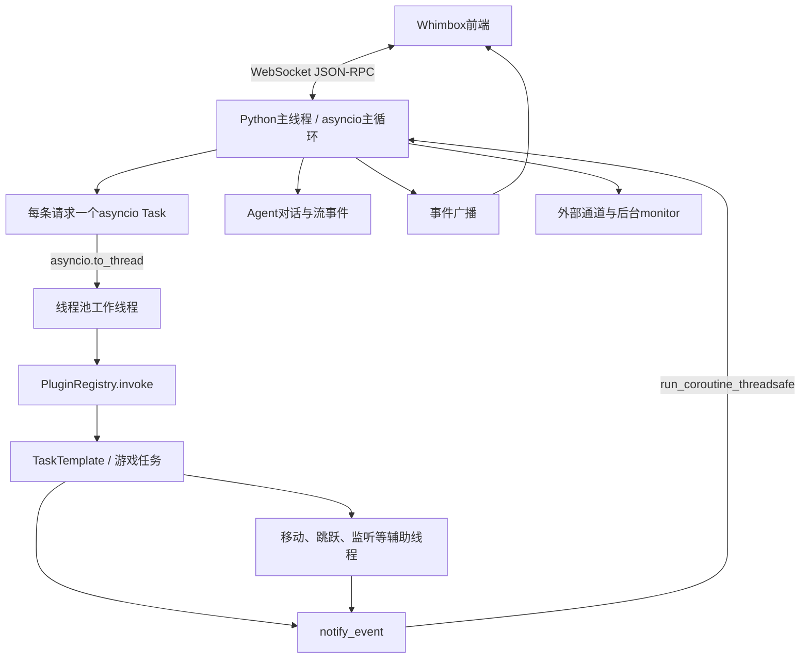
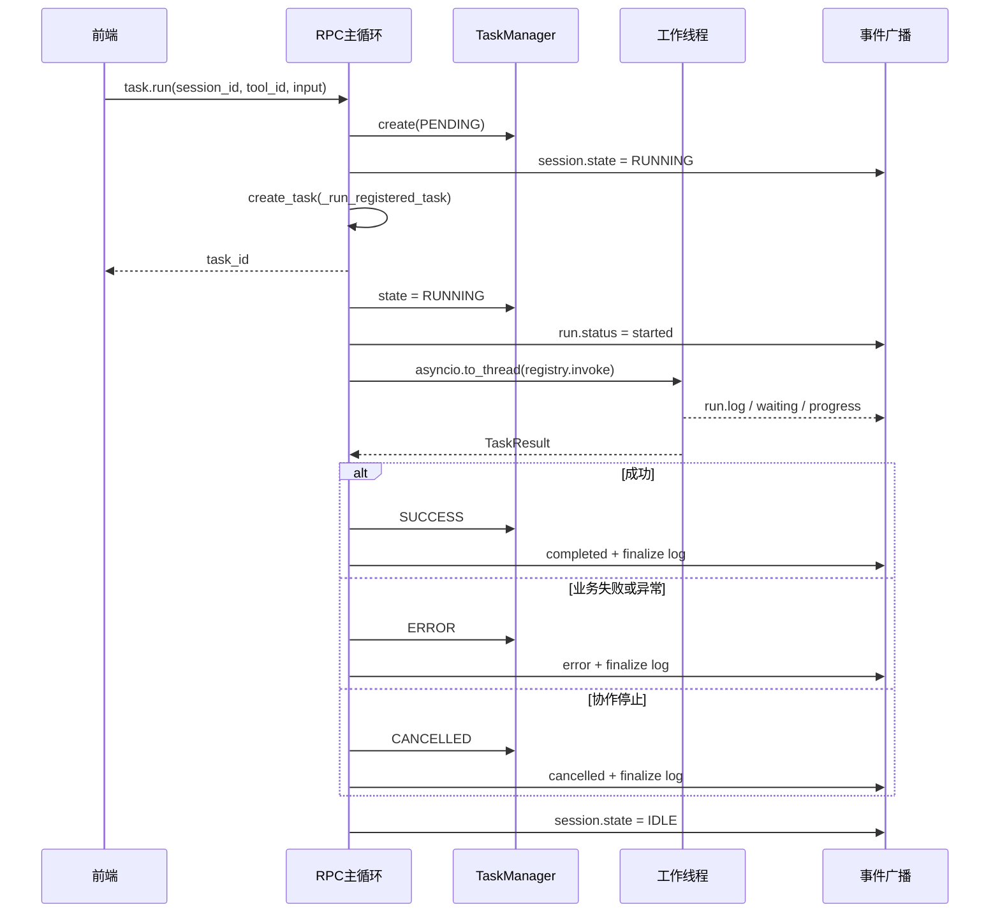
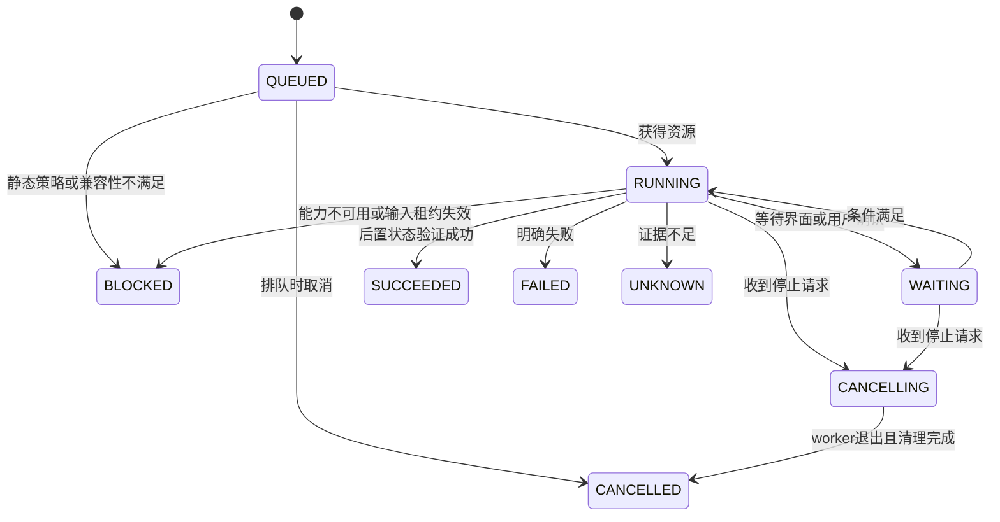

# Whimbox 运行事件与前后端解耦

> 文档性质：Whimbox 2.5.4 RPC、Session、后台执行、运行事件与界面解耦机制参考
>
> 分析基线：`2.5.4`，提交 `a10fa3059f7a47cd26ba65a562184c8735562320`
>
> 分析日期：2026-07-18
>
> 关联方案：[总体架构与关键问题分析](01-总体架构与关键问题分析.md)
>
> 运行基础：[任务调度、停止与资源互斥](06-Whimbox任务调度停止与资源互斥.md) · [错误恢复与执行证据](10-Whimbox错误恢复与执行证据.md)
>
> Agent边界：[Whimbox Agent语义层与工具边界](11-Whimbox-Agent语义层与工具边界.md)
>
> 新系统运行树：[分层关系网与复合能力子图构想](../interface_discovery/分层关系网与复合能力子图构想.md) · [多窗口输入归属与游戏视角异常恢复构想](../interface_discovery/多窗口输入归属与游戏视角异常恢复构想.md)

## 1. 核心结论

Whimbox让耗时游戏任务不直接卡住用户界面的关键，不是把全部代码都写成`async`，而是把职责分成了四层：

```text
前端应用
-> 通过WebSocket发送命令、接收通知

后端asyncio主事件循环
-> 快速接收请求、创建任务、广播状态

工作线程
-> 执行同步插件、视觉识别和游戏自动化

事件桥
-> 将工作线程中的进度重新投递到主事件循环
-> 再广播给前端
```

前端因此可以在后台任务执行期间继续：

- 响应点击和窗口操作；
- 展示任务排队、执行、停止、成功或失败状态；
- 接收逐步日志和Agent文本；
- 发出停止命令；
- 查询其他配置和状态。

但要准确理解两个边界：

1. 后端提供了非阻塞通信和后台执行条件，前端本身仍需采用异步WebSocket客户端，不能在UI线程同步等待最终结果；
2. `task.run`返回`task_id`只表示任务已被后端受理，不表示任务已经执行成功。

## 2. 后端运行拓扑

Whimbox主要运行在一个Python进程中，但进程内同时存在主线程、线程池工作线程和少量独立监听/控制线程。



服务启动时，主线程通过`asyncio.run()`建立总事件循环；插件先同步初始化，Agent初始化被放到工作线程，RPC Server则在主循环中持续运行，见[`main.py`](../../../../reference_repos/whimbox/whimbox/main.py#L38)和[`main.py`](../../../../reference_repos/whimbox/whimbox/main.py#L48)。

### 2.1 主事件循环负责什么

RPC启动后，主事件循环主要承载：

- WebSocket连接、接收和发送；
- JSON-RPC方法分派；
- Agent查询与模型流事件；
- Runtime Session状态变更；
- 后台任务的调度协程；
- 运行事件广播；
- 外部通道monitor和消息处理。

启动逻辑保存当前事件循环，接入全局事件notifier，然后永久等待，见[`rpc_server.py`](../../../../reference_repos/whimbox/whimbox/rpc_server.py#L952)。

### 2.2 工作线程负责什么

前端直接启动游戏任务后，RPC协程使用`asyncio.to_thread()`执行同步的插件调用，见[`rpc_server.py`](../../../../reference_repos/whimbox/whimbox/rpc_server.py#L326)和[`rpc_server.py`](../../../../reference_repos/whimbox/whimbox/rpc_server.py#L360)。

工作线程内的典型调用链是：

```text
PluginRegistry.invoke
-> 获取game_runtime资源
-> 插件handler
-> TaskAdapter
-> TaskTemplate
-> 截图、OCR、模板匹配、键鼠输入
```

这些代码可以继续采用普通同步函数和循环，不必为了前端响应性全部改造成协程。

## 3. `async`、线程和进程应怎样理解

三者在Whimbox中的角色不同：

| 机制 | 当前作用 | 是否并行执行Python业务代码 |
| --- | --- | --- |
| `asyncio` | 管理WebSocket、网络等待、事件和大量轻量任务 | 通常不是；协程在同一线程轮流让出执行权 |
| 工作线程 | 承载同步插件和长时间游戏任务 | 可以与主循环并行等待/运行；仍受Python和底层库特性影响 |
| 独立进程 | 当前核心RPC与任务链没有采用进程隔离 | 不适用 |

因此，`async`不是“自动新建线程”。如果在主事件循环中直接执行长时间`time.sleep()`、OCR或同步网络请求，它仍会卡住所有WebSocket和广播。

Whimbox的关键处理是：

```text
适合等待网络、消息和事件的逻辑
-> 留在asyncio主循环

长时间同步任务
-> asyncio.to_thread移入工作线程
```

Agent初始化也采用`to_thread()`，但在线程内又通过`asyncio.run()`建立临时事件循环；初始化结束后该临时循环关闭，后续Agent查询仍在RPC主循环运行，见[`main.py`](../../../../reference_repos/whimbox/whimbox/main.py#L52)。这是一种特殊初始化边界，不应理解为Agent始终运行在独立线程。

## 4. WebSocket请求为什么不会互相完全阻塞

每个WebSocket连接收到一条消息后，都会创建一个独立的`asyncio.Task`处理该请求，见[`rpc_server.py`](../../../../reference_repos/whimbox/whimbox/rpc_server.py#L924)。

```text
收到请求A
-> create_task(process A)

收到请求B
-> create_task(process B)

A等待网络或工作线程
-> 主循环可以继续推进B和事件广播
```

这带来两个结果：

- 同一客户端的多个请求可以并发推进；
- 响应顺序取决于完成顺序，不保证与请求到达顺序一致。

每个连接拥有一个`asyncio.Lock`保护`send()`，避免响应和通知同时写入同一WebSocket帧；这个锁只保证发送动作不重叠，并不保证业务请求按顺序完成。

## 5. 直接任务的完整调度时序

前端调用`task.run`时，需要提供已有`session_id`、`tool_id`和输入参数，入口见[`rpc_server.py`](../../../../reference_repos/whimbox/whimbox/rpc_server.py#L824)。



任务创建与后台调度发生在[`_start_registered_task()`](../../../../reference_repos/whimbox/whimbox/rpc_server.py#L511)。它先创建`TaskInfo`，把Session设为`RUNNING`，然后调度后台协程并立即返回`task_id`。

真正的结果映射发生在[`_run_registered_task()`](../../../../reference_repos/whimbox/whimbox/rpc_server.py#L326)：

| 工具返回`status` | TaskManager终态 | 前端运行阶段 |
| --- | --- | --- |
| `success`或其他非失败值 | `SUCCESS` | `completed` |
| `error`或`failed` | `ERROR` | `error` |
| `stop` | `CANCELLED` | `cancelled` |
| 未捕获异常 | `ERROR` | `error`，并额外发`event.error` |

## 6. Agent调用与直接任务的不同

`agent.send_message`并不像`task.run`那样立即返回一个后台任务ID。RPC处理函数会等待整轮`query_agent()`结束后才返回最终JSON-RPC响应，见[`rpc_server.py`](../../../../reference_repos/whimbox/whimbox/rpc_server.py#L586)。

但界面仍可持续更新，因为：

- 当前请求本身是独立`asyncio.Task`；
- Agent通过`astream_events()`异步产生模型和工具事件；
- 文本片段立即广播为`event.agent.message`；
- 工具开始、结束、失败和停止被转换成`event.run.status`与`event.run.log`；
- 其他WebSocket请求仍能在主循环中推进。

Agent本身监听的流事件位于[`Agent.query_agent()`](../../../../reference_repos/whimbox/whimbox/agent.py#L168)。因此用户看到的是“请求仍未最终返回，但运行通知和文本已不断到达”。

## 7. 工作线程的事件怎样回到前端

业务模块不直接持有WebSocket连接，但当前存在两条事件入口。`TaskTemplate.log_to_gui()`直接调用`rpc_server.notify_event()`；Agent、Channel等模块可以调用全局`event_bus.emit_event()`，再由已注册的RPC notifier转发。两条路径最终都汇合到RPC广播层。

```text
TaskTemplate.log_to_gui
-> rpc_server.notify_event

Agent / Channel / 其他事件源
-> event_bus.emit_event(method, params)
-> 已注册的rpc_server.notify_event

两条入口汇合
-> rpc_server._notify
-> rpc_server._broadcast
-> 所有WebSocket客户端
```

直接任务日志入口见[`TaskTemplate.log_to_gui()`](../../../../reference_repos/whimbox/whimbox/task/task_template.py#L304)。[`event_bus.py`](../../../../reference_repos/whimbox/whimbox/event_bus.py#L11)只保存一个全局notifier，因此它只是部分业务事件使用的最小同步桥，不是覆盖所有事件的完整总线。

[`_notify()`](../../../../reference_repos/whimbox/whimbox/rpc_server.py#L63)根据调用位置选择调度方式：

| 调用来源 | 进入广播的方式 |
| --- | --- |
| 已在RPC主循环 | `asyncio.create_task(_broadcast(...))` |
| 工作线程或其他事件循环 | `asyncio.run_coroutine_threadsafe(..., _loop)` |
| RPC循环尚未建立且当前线程无loop | 事件直接丢失 |

这样，工作线程无需直接操作异步WebSocket，也不会因为“没有当前事件循环”而自行创建错误的广播循环。

## 8. 事件向前端输出什么

当前关键事件如下：

| 事件 | 主要内容 | 前端用途 |
| --- | --- | --- |
| `event.agent.status` | `ready/status/message` | 展示Agent初始化和可用性 |
| `event.agent.message` | `session_id`与assistant文本 | 流式展示模型回答 |
| `event.conversation.user_message` | 通道、发送者、用户文本 | 同步显示外部通道输入 |
| `event.run.status` | Session、Run、来源、阶段和结果 | 驱动运行状态和按钮 |
| `event.run.log` | 展示文本、原始文本、级别、类型 | 进度列表和最终提示 |
| `event.session.state` | Runtime Session快照 | 更新会话级`IDLE/RUNNING/CLOSED` |
| `event.overlay.show` | 热键和原因 | 打开停止/控制浮层 |
| `event.error` | 错误码、消息和detail | 展示或记录未捕获错误 |

RPC中的部分运行状态和日志由[`_notify_run_status()`](../../../../reference_repos/whimbox/whimbox/rpc_server.py#L93)及[`_notify_run_log()`](../../../../reference_repos/whimbox/whimbox/rpc_server.py#L126)组装；它们不是所有事件的唯一序列化入口。`TaskTemplate.log_to_gui()`以及直接任务的部分最终日志会按相同字段手工构造payload，再调用`notify_event()`，见[`task_template.py`](../../../../reference_repos/whimbox/whimbox/task/task_template.py#L304)。

### 8.1 四类关联ID

不能只依靠Session状态还原一次执行。至少要区分：

| 标识 | 含义 |
| --- | --- |
| `session_id` | 会话和用户交互上下文 |
| `run_id` | 本次执行关联键；直接任务通常等于`task_id` |
| `task_id` | TaskManager创建的直接任务ID |
| `tool_call_id` | Agent一轮中某次工具调用的关联ID |

Agent工具调用ID由RPC在收到`on_tool_start`时生成并排队，再把工作线程中的任务日志关联到当前工具，见[`rpc_server.py`](../../../../reference_repos/whimbox/whimbox/rpc_server.py#L151)。

## 9. Session状态不是完整任务状态

Runtime Session只保存一个粗粒度的`state`，以及窗口句柄、名称、profile和metadata，见[`session_manager.py`](../../../../reference_repos/whimbox/whimbox/session_manager.py#L15)。

项目实际存在多套状态：

```text
Runtime Session
-> IDLE / RUNNING / CLOSED

TaskInfo
-> PENDING / RUNNING / SUCCESS / ERROR / CANCELLED

event.run.status
-> started / running / stopping / completed / error / cancelled

Agent
-> starting / ready / thinking / generating / tool状态
```

这些状态没有被一个中央状态机统一管理。前端若只看到`session.state=IDLE`，不能证明：

- 所有工作线程都已经退出；
- 当前Session没有另一项任务仍在执行；
- 键盘和鼠标状态已经完成清理；
- Agent没有处于纯思考阶段。

## 10. 停止为什么不是立即终止

`task.stop`和`agent.stop`的主要动作是设置`threading.Event`，不是强行杀掉线程，见[`rpc_server.py`](../../../../reference_repos/whimbox/whimbox/rpc_server.py#L751)和[`rpc_server.py`](../../../../reference_repos/whimbox/whimbox/rpc_server.py#L839)。

```text
用户点击停止
-> 后端设置stop_event
-> 广播stopping
-> 等待任务循环观察到stop_event
-> 任务执行finally并释放按键、锁和其他资源
-> 返回status=stop
-> 广播cancelled
```

停止延迟取决于任务是否主动检查事件。长时间`sleep`、OCR、系统调用或未检查stop的循环不能被立即中断。

此外，取消一个等待`asyncio.to_thread()`的协程不会强制结束底层工作线程。因此，前端不能把“已发送停止”或“协程已取消”直接显示成“游戏操作已经完全停止”。

## 11. 这种解耦方式的好处

### 11.1 UI不会跟着游戏任务同步阻塞

耗时同步任务离开主事件循环后，WebSocket仍可处理停止、查询和界面事件。

### 11.2 同一套业务代码可保持同步写法

截图、模板匹配、键鼠和TaskTemplate不需要全部改成异步函数，降低游戏自动化代码复杂度。

### 11.3 执行层和展示层不直接依赖

任务只发结构化事件，不需要知道前端使用何种框架、页面或组件。

### 11.4 多入口复用统一状态

前端直接任务、Agent工具和外部文本通道都可以向同一WebSocket前端发送运行事件。

### 11.5 停止可以穿过调用层级

同一`stop_event`可以从RPC传入资源锁、插件、TaskAdapter和具体任务，使排队阶段和执行阶段都具备协作停止入口。

## 12. 当前实现的主要局限

### 12.1 EventBus不可靠投递

`event_bus`没有缓存、队列、重放、多订阅者或异常隔离；RPC启动前的事件会丢失，广播失败也不会反馈给业务任务，见[`event_bus.py`](../../../../reference_repos/whimbox/whimbox/event_bus.py#L16)。

### 12.2 广播给全部客户端

事件没有服务端Session订阅过滤。所有连接都收到广播，需要前端自己按`session_id`过滤。

### 12.3 慢客户端可能拖延广播

[`_broadcast()`](../../../../reference_repos/whimbox/whimbox/rpc_server.py#L42)顺序等待每个客户端发送。一个慢客户端可能延迟后续客户端；遍历期间连接集合变化也存在竞态。

### 12.4 同一Session多任务状态会错位

`task.run`没有禁止同一Session启动多项任务。任一任务结束都会在`finally`中把Session设回`IDLE`，即使另一任务仍在运行或等待资源锁，见[`rpc_server.py`](../../../../reference_repos/whimbox/whimbox/rpc_server.py#L504)。

### 12.5 跨线程关联表无锁

Agent工具ID的字典和队列可能同时由主循环回调和工作线程日志访问，当前没有统一锁保护。

### 12.6 本地RPC没有身份认证

服务虽然默认绑定回环地址，但WebSocket入口没有token、Origin白名单或客户端身份校验，见[`rpc_server.py`](../../../../reference_repos/whimbox/whimbox/rpc_server.py#L924)。未来允许执行键鼠和高风险计划时，回环地址不能视为完整安全边界。

## 13. 对关系网方案的直接借鉴

新方案应保留Whimbox的总体分层：

```text
前端只负责提交意图和展示状态
-> 调度器创建PlanRun / CapabilityRun
-> 后台执行器运行确定性Capability
-> 执行器只输出事件和证据
-> 前端通过事件更新界面
```

但运行模型应进一步统一。

### 13.1 建议的运行实体

| 实体 | 作用 |
| --- | --- |
| `Session` | 用户、窗口、会话配置和权限边界 |
| `PlanRun` | 用户点击执行后产生的一次计划实例 |
| `CapabilityRun` | 原子、复合或连续能力在计划中的调用实例 |
| `GraphCallRun` | 复合能力对子图的版本固定调用和返回上下文 |
| `StepAttempt` | 一次前置观察、动作、后置验证和清理事务 |
| `RecoveryRun` | 不覆盖原Attempt的独立恢复过程 |
| `ActionRun` | Attempt内部一次实际键鼠或其他原子输出 |
| `Evidence` | 动作前后帧、识别结果、模型版本和日志 |

定义和运行实例必须分开：`StateDefinition`、`TransitionDefinition`和`CapabilitySpec`不能直接承载某次执行的临时状态。

### 13.2 建议的统一状态机



`CANCELLED`只能在执行器真正退出、输入资源释放、按键清理完成后产生。

### 13.3 建议的事件格式

```json
{
  "event_id": "evt_...",
  "sequence": 128,
  "timestamp": "2026-07-18T12:34:56.123Z",
  "session_id": "sess_...",
  "plan_run_id": "planrun_...",
  "capability_run_id": "caprun_...",
  "graph_call_run_id": null,
  "attempt_id": "attempt_...",
  "recovery_run_id": null,
  "action_run_id": "actionrun_...",
  "type": "capability.state_changed",
  "phase": "RUNNING",
  "detail": "waiting_for_postcondition",
  "definition_id": "capability.open_inventory",
  "definition_version": 3,
  "window_instance_id": "gamewin_...",
  "focus_epoch": 108,
  "control_schema_epoch": 42,
  "evidence_ids": ["evidence_..."]
}
```

相比Whimbox，还应增加：

- 单调递增`sequence`，让前端拒绝乱序旧事件；
- 服务端时间戳；
- 定义版本和执行器版本；
- 明确父子运行ID；
- 证据引用；
- 可机器处理的错误码；
- 用户展示文本与诊断detail分离。

事件还应区分业务进度与健康信号。截图旧帧、焦点租约失效、输入归属不明、模型服务降级、重复点击和双节点振荡应发布结构化健康事件，不能伪装成普通业务失败。

### 13.4 采用快照加事件流

前端首次连接或重连时：

```text
读取当前运行快照
-> 从快照sequence之后订阅增量事件
-> 本地reducer更新UI
```

这样即使前端断开、事件短暂丢失或重新打开，也能恢复真实状态。不能只依赖不持久化的实时广播。

### 13.5 前端交互规则

前端应遵循：

1. 提交命令后先展示`QUEUED`或“已受理”；
2. 不把RPC成功响应当成计划成功；
3. 根据`run_id`与`sequence`处理事件；
4. 停止按钮进入`CANCELLING`，等待最终`CANCELLED`；
5. `UNKNOWN`状态展示证据并允许用户确认；
6. 同一游戏窗口只允许一个控制事务，整个桌面的物理输入同一时刻也只允许一个实际执行者；
7. 页面刷新后从服务端快照恢复，不依赖前端内存。

## 14. 建议的模块边界

```text
Command API
-> 校验请求并创建运行实例

Run Controller
-> 管理状态机、队列、停止和父子关系

Resource Scheduler
-> 管理game_control、desktop_physical_input、focus lease、capture和gpu等资源

Capability Executor
-> 执行确定性识别与键鼠函数

Event Journal
-> 持久保存状态变化和证据索引

WebSocket Projection
-> 将事件投影给有权限的前端Session
```

执行器不应直接修改前端状态；前端也不应绕过Run Controller直接调用键鼠函数。

### 14.1 线程响应性与进程隔离不是同一问题

Whimbox使用工作线程避免同步任务阻塞RPC事件循环，解决的是前端响应性。ALAS采用每实例独立进程，解决的是游戏实例之间的故障和状态隔离。新系统可以组合两者：

```text
控制面事件循环保持轻量
-> 同一游戏实例内计划串行
-> OCR、YOLO、CLIP等感知服务按资源并行
-> 不同游戏实例可使用独立工作进程
-> 物理输入仍由桌面级仲裁器统一串行
```

进程隔离不能绕过桌面输入独占；线程下沉也不能替代模型崩溃、显存泄漏和实例状态污染的隔离策略。

## 15. 优先验证清单

在关系网核心功能组装前，建议先验证：

| 测试 | 需要证明的结果 |
| --- | --- |
| UI启动一个10秒同步Step | UI持续响应，停止按钮可点击 |
| Step等待资源时停止 | 排队项快速进入取消流程 |
| Step执行长阻塞函数时停止 | 量化真实停止延迟，不提前报终态 |
| 同Session连续提交两个Plan | 明确排队或拒绝，不发生状态覆盖 |
| 前端断开后重连 | 可由快照与事件序号恢复运行状态 |
| 两个客户端订阅不同Session | 事件不会跨Session泄露 |
| Worker异常退出 | Run进入FAILED并保存最后证据 |
| 取消后检查键盘 | 所有按下键均已释放 |
| 子图调用和返回 | 调用栈、GraphCallRun和ReturnContext可查询 |
| focus_epoch中途失效 | 旧Attempt停止输入并发布健康事件 |
| 恢复后继续 | RecoveryRun与新Attempt分别展示且不覆盖原结果 |

## 16. 结论

Whimbox的前后端解耦可以概括为：

```text
WebSocket异步接收命令
-> 主循环快速创建后台运行
-> 同步游戏任务移入工作线程
-> 工作线程通过事件桥报告进度
-> 主循环继续响应前端并广播状态
```

这套方向值得关系网方案复用，尤其是：

- 控制面和执行面分离；
- 同步任务下沉到工作线程；
- 用Session和Run ID关联事件；
- 任务进度通过事件推送，而非UI同步等待；
- 停止使用贯穿调用链的协作事件。

新方案需要在此基础上补齐统一状态机、可靠事件日志、重连快照、Session订阅、严格终态和执行证据。这样才能确保“前端没有卡住”不仅是界面体验，也对应一个可恢复、可追踪且不会误报完成的运行系统。
