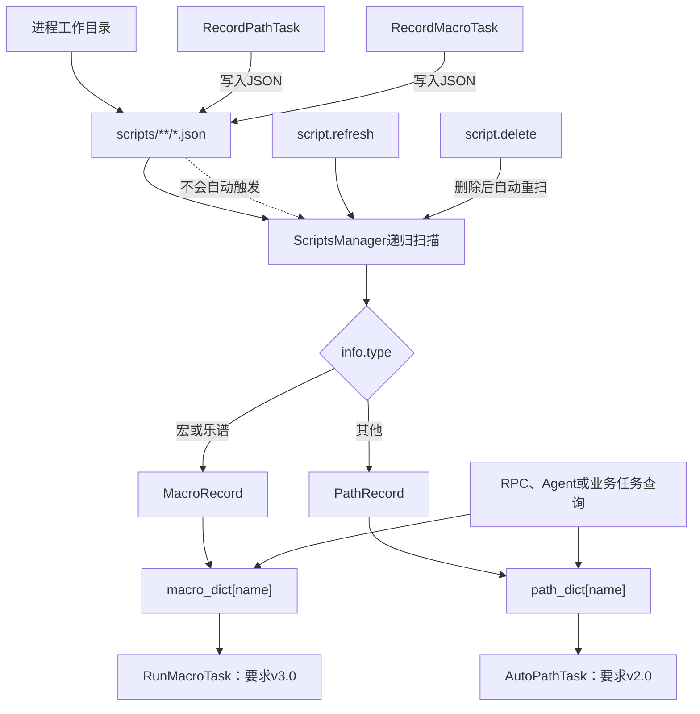

# Whimbox 脚本资源与版本管理

> 文档性质：Whimbox 2.5.4 路线、宏、乐谱及其版本机制参考
>
> 分析基线：`2.5.4`，提交 `a10fa3059f7a47cd26ba65a562184c8735562320`
>
> 分析日期：2026-07-18
>
> 关联方案：[总体架构与关键问题分析](01-总体架构与关键问题分析.md)
>
> 执行基础：[Whimbox 键鼠执行](05-Whimbox键鼠执行.md)
>
> 使用边界：[插件能力注册与调用边界](09-Whimbox插件能力注册与调用边界.md) · [自动跑图视觉闭环](12-Whimbox自动跑图视觉闭环.md)
>
> 后续统一设计：[分层关系网与复合能力子图](../interface_discovery/分层关系网与复合能力子图构想.md) · [连续滚轮与视口控制](../interface_discovery/鼠标滚轮缩放与视口控制构想.md) · [动态控件绑定](../interface_discovery/角色能力切换与动态控件绑定构想.md) · [瞬态故障与指标隔离](../interface_discovery/游戏瞬态故障判读与置信度隔离构想.md) · [ALAS 配置与运行事实分离参考](../../references/alas/AzurLaneAutoScript可借鉴机制与设计思想.md)

## 1. 核心结论

Whimbox 把路线、宏和乐谱保存为 `scripts/` 下的 JSON 文件，再由一个进程内单例扫描成内存索引。运行任务查询的是内存模型，不是每次重新读取文件。

它已经解决了几个基础问题：

- 用 Pydantic 模型约束路线点和宏步骤的基本字段；
- 用逻辑名称查询资产，调用方不需要知道文件路径；
- 录制结果可以落盘并被不同业务任务复用；
- 路线和宏执行器分别拒绝不支持的主版本；
- 同名资产可以按更新时间选出一个内存版本。

但它还不是完整的版本化资产系统：

- `version` 只是一条执行前的硬编码相等判断；
- 没有迁移器、兼容矩阵、依赖版本或回滚版本；
- 同名资源依赖 `update_time` 字符串决定谁胜出；
- 内存索引不保留来源文件和历史版本；
- 录制完成后不会自动刷新索引；
- 路线动作参数仍是一个复用字符串，缺少按动作类型区分的 Schema；
- 执行计划不会固定到某一个不可变资产修订版。

因此，新方案可以借鉴 Whimbox 的“结构化资产 + 内存查询 + 执行前兼容检查”，但应把状态、转换、能力、复合子图、Adapter、连续校准、验证证据和运行实例分别版本化。定义依赖应是可检查的 DAG；GraphModule 内部需要循环时，必须声明进度、次数和总超时边界。

## 2. Whimbox 中的脚本指什么

本文的“脚本资源”只包括：

| 类别 | 主要内容 | 执行器 |
| --- | --- | --- |
| 路线 | 地图点位、移动模式、点位动作和动作参数 | `AutoPathTask` |
| 宏 | 键鼠事件、时间间隔和增强页面步骤 | `RunMacroTask` |
| 乐谱 | 与宏共用数据模型的按键序列 | `RunMacroTask` |

它们不是：

- Python 业务任务源码；
- Agent Skill；
- 插件 manifest；
- 状态节点定义；
- 一次具体运行的日志和截图证据。

这个区分对新方案很重要：可复用的机器定义、不可变修订和一次实际运行记录是不同对象；Whimbox 的路线或宏也不能直接等同于 `StateDefinition`、`TransitionDefinition`、`CapabilitySpec` 或 GraphModule。

## 3. 资源生命周期



这里实际存在三层状态：

```text
磁盘文件
-> 资源的持久化事实

ScriptsManager内存索引
-> 当前进程认为可查询的资源

任务实例中的深拷贝或步骤列表
-> 本次执行正在使用的运行快照
```

文件已经保存，不代表当前内存索引马上可见；内存索引发生刷新，也不代表正在执行的任务自动切换到新版本。

## 4. 存储位置与工作目录契约

脚本目录由 [`SCRIPT_PATH`](../../../../reference_repos/whimbox/whimbox/common/path_lib.py#L18) 定义：

```python
SCRIPT_PATH = os.path.join(os.getcwd(), "scripts")
```

这表示它不是相对于 Python 包位置，也不是相对于仓库根目录，而是相对于进程启动时的当前工作目录。

实际影响包括：

- PyCharm 的 Working Directory 不同，会扫描到另一套脚本；
- 从其他目录启动，会生成新的 `scripts/`；
- 录制文件可能保存成功，但用户在预期目录中找不到；
- 源码仓库本身不能代表用户机器上的完整脚本资产。

对新方案而言，资产根目录应来自显式配置或项目级数据目录，并在日志、管理界面和运行记录中暴露绝对解析结果。工作目录不应成为隐藏契约。

## 5. Pydantic 数据模型

所有脚本模型定义在 [`scripts_manager.py`](../../../../reference_repos/whimbox/whimbox/common/scripts_manager.py#L10)。Pydantic 负责在加载 JSON 时验证字段类型。

### 5.1 公共信息

[`ScriptInfo`](../../../../reference_repos/whimbox/whimbox/common/scripts_manager.py#L10) 包含：

| 字段 | 用途 | 当前边界 |
| --- | --- | --- |
| `name` | 逻辑名称和索引键 | 同名资源不能同时保留在索引中 |
| `type` | 区分宏、乐谱和路线类别 | 除宏、乐谱外的值都按路线处理 |
| `update_time` | 同名候选比较 | 可空，且按字符串比较 |
| `version` | 执行器兼容检查 | 模型本身不限制可用版本 |

这里的 `name` 同时承担展示名、查询键和去重键。新方案应拆成：

```text
asset_kind     状态、转换、能力、子图、Adapter或校准类型
definition_id  稳定机器身份
display_name   可修改的人类名称
revision_id    不可变修订身份
aliases        LLM或搜索使用的别名
```

### 5.2 路线模型

[`PathRecord`](../../../../reference_repos/whimbox/whimbox/common/scripts_manager.py#L34) 由 `PathInfo + PathPoint[]` 组成。

`PathInfo` 增加：

- `target`：目标素材；
- `count`：声明数量；
- `region`：区域；
- `map`：地图标识；
- `test_mode`：采集测试开关。

[`PathPoint`](../../../../reference_repos/whimbox/whimbox/common/scripts_manager.py#L25) 包含：

- `id`；
- `move_mode`；
- `point_type`；
- `action`；
- `action_params`；
- `position`。

路线把两类信息放在一个点上：

```text
移动几何
+
到达后执行的业务动作
```

其中 `action_params` 是可空字符串，可以代表秒数、按键名、数量、宏名等不同含义。Pydantic 只知道它是字符串，无法根据 `action` 校验组合语义。

### 5.3 宏模型

[`MacroRecord`](../../../../reference_repos/whimbox/whimbox/common/scripts_manager.py#L54) 由 `MacroInfo + MacroStep[]` 组成。

`MacroInfo.aspect_ratio` 只允许：

- `16:9`；
- `16:10`；
- 空值。

[`MacroStep`](../../../../reference_repos/whimbox/whimbox/common/scripts_manager.py#L43) 支持：

| `type` | 含义 |
| --- | --- |
| `gap` | 等待一段时间 |
| `keyboard` | 键盘按下或抬起 |
| `mouse` | 鼠标按下或抬起 |
| `loop` | 循环后续若干步骤 |
| `wait_game_page` | 等待进入页面 |
| `wait_not_game_page` | 等待离开页面 |
| `goto_game_page` | 调用页面导航 |

模型允许所有可选字段同时为空。例如 `type=keyboard` 时，模型层不强制 `key/action` 必须存在。这说明当前是“字段类型模型”，还不是完整的判别联合模型。

新方案中的 Step 操作应按动作类型建立独立结构，例如：

```text
KeyPressAction
MouseClickAction
ClickDetectedTargetAction
WaitStateAction
NavigateStateAction
```

每种动作只允许自己的必填字段，避免执行到现场才发现参数缺失。

## 6. 发现、解析与索引

### 6.1 单例首次扫描

[`ScriptsManager`](../../../../reference_repos/whimbox/whimbox/common/scripts_manager.py#L59) 是进程单例。首次初始化会调用 [`init_scripts_dict()`](../../../../reference_repos/whimbox/whimbox/common/scripts_manager.py#L79)，递归扫描 `scripts/` 下的所有 `.json`。

扫描顺序为：

1. 读取文本；
2. 先用普通 JSON 读取 `info.type`；
3. `宏/乐谱` 用 `MacroRecord.model_validate_json()`；
4. 其他类型用 `PathRecord.model_validate_json()`；
5. 按 `info.name` 写入对应字典；
6. 单个文件失败时记录日志并跳过。

这种方式的优点是坏文件不会阻断所有资源；问题是未知 `type` 会被默认尝试解析成路线，不能明确区分“新类别”和“错误类别”。

### 6.2 同名资源选择

同名候选通过以下条件选择：

```text
旧资源.update_time < 新资源.update_time
-> 新资源覆盖内存索引
```

对应逻辑见 [`init_scripts_dict()`](../../../../reference_repos/whimbox/whimbox/common/scripts_manager.py#L94)。

它不是语义版本比较，也不是文件修改时间比较。只有当所有时间字符串均使用统一、可排序格式时，字符串顺序才等价于真实时间顺序。

索引最终只保存：

```text
逻辑名称 -> Pydantic模型
```

没有保存：

- 来源文件路径；
- 被淘汰的候选；
- 文件哈希；
- 签名或作者；
- 解析警告；
- 资产依赖；
- 验证状态。

因此，从内存索引无法回答“当前运行的是哪个文件版本”。

## 7. 查询、搜索与删除

### 7.1 路线查询

[`query_path()`](../../../../reference_repos/whimbox/whimbox/common/scripts_manager.py#L115) 支持：

- `path_name` 精确逻辑名；
- 名称包含；
- 目标素材包含；
- 类型精确匹配；
- 声明数量大于等于要求；
- 是否显示内部默认路线。

[`search_path_items()`](../../../../reference_repos/whimbox/whimbox/common/scripts_manager.py#L158) 再把结果按名称排序，并默认限制为最多五项。

精确名称面向内部任务；模糊搜索面向用户或 Agent。两种查询服务同一个内存索引。

### 7.2 宏和乐谱查询

[`query_macro()`](../../../../reference_repos/whimbox/whimbox/common/scripts_manager.py#L314) 用 `is_play_music` 区分宏和乐谱，并支持精确名和名称包含。

但精确名称命中时直接返回字典内容，没有再次检查 `is_play_music`。这意味着类别约束在精确路径和模糊路径中的行为不完全一致。

### 7.3 管理RPC

脚本管理接口位于 [`handle_script_method()`](../../../../reference_repos/whimbox/whimbox/rpc_method_groups.py#L21)：

| RPC | 行为 |
| --- | --- |
| `script.query_path` | 返回路线 `info`，不返回全部点位 |
| `script.query_macro` | 返回宏 `info`，不返回全部步骤 |
| `script.delete` | 按逻辑名删除路线；`macro`与`music`实际共用同一删除函数 |
| `script.refresh` | 清空并重建两个内存索引 |

删除并不是删除索引当前胜出的一个文件。路线删除会重新遍历所有 JSON，删除同名且不属于宏/乐谱的文件，见[`delete_path()`](../../../../reference_repos/whimbox/whimbox/common/scripts_manager.py#L262)。但RPC的`category=macro`和`category=music`都会调用同一个[`delete_macro()`](../../../../reference_repos/whimbox/whimbox/common/scripts_manager.py#L380)，而它同时匹配类型为“宏”或“乐谱”的同名文件，见[`_find_script_files_by_name()`](../../../../reference_repos/whimbox/whimbox/common/scripts_manager.py#L221)。因此同名宏和乐谱可能被一起删除，传入的类别并没有形成二者之间的删除隔离。

宏和乐谱还共用`macro_dict[name]`；扫描时同名资源按`update_time`只保留一个内存记录。因此类别冲突不仅影响删除，也可能在加载和精确查询阶段互相覆盖。

这适合清理重复逻辑资源，但不支持“仅回滚或删除某个修订版”。

## 8. 保存与刷新不是一个事务

路线录制完成后，[`RecordPathTask.save_path()`](../../../../reference_repos/whimbox/whimbox/task/navigation_task/record_path_task.py#L102) 创建 `PathRecord` 并保存为 JSON。

它写入：

```text
version = 2.0
update_time = 当前时间
name = 我的路线_时间戳
```

宏录制完成后，[`RecordMacroTask.step2()`](../../../../reference_repos/whimbox/whimbox/task/macro_task/record_macro_task.py#L243) 创建 `MacroRecord`，写入：

```text
version = 3.0
update_time = 当前时间
name = 我的宏_时间戳
```

两个保存函数中原本可能用于刷新的调用均被注释：

- 路线：[`record_path_task.py`](../../../../reference_repos/whimbox/whimbox/task/navigation_task/record_path_task.py#L133)；
- 宏：[`record_macro_task.py`](../../../../reference_repos/whimbox/whimbox/task/macro_task/record_macro_task.py#L270)。

因此会出现：

```text
文件已经存在于磁盘
但是当前进程查询不到
直到调用script.refresh或重启
```

新方案的资产发布不应把“写文件”和“刷新索引”暴露成两个松散操作。更稳妥的流程是：

```text
写入临时修订
-> 完整Schema校验
-> 计算哈希和依赖
-> 原子替换或提交数据库事务
-> 构建新索引快照
-> 原子切换活动快照
-> 返回已发布revision_id
```

## 9. 当前版本兼容机制

### 9.1 路线版本

[`AutoPathTask.__init__()`](../../../../reference_repos/whimbox/whimbox/task/navigation_task/auto_path_task.py#L43) 要求：

```python
path_info.version == "2.0"
```

不等于 `2.0` 就直接抛出版本不匹配异常，见 [`auto_path_task.py`](../../../../reference_repos/whimbox/whimbox/task/navigation_task/auto_path_task.py#L60)。

### 9.2 宏版本

[`RunMacroTask.__init__()`](../../../../reference_repos/whimbox/whimbox/task/macro_task/run_macro_task.py#L20) 要求：

```python
macro_record.info.version == "3.0"
```

检查见 [`run_macro_task.py`](../../../../reference_repos/whimbox/whimbox/task/macro_task/run_macro_task.py#L27)。

### 9.3 这个版本号实际表达什么

它表达的是：

> 当前执行器只认识一个精确格式版本。

它不表达：

- 哪些小版本向后兼容；
- 是否允许自动升级；
- 图像模板版本是否匹配；
- 页面状态定义是否匹配；
- OCR、YOLO、CLIP或SAM模型是否变化；
- 该资产最近一次在哪个游戏版本验证；
- 该版本的成功率；
- 上一版本能否回滚。

Pydantic 加载阶段也不拒绝旧版本。资源可以成功进入索引，直到构造执行任务时才失败。

## 10. 路线与宏的持久化坐标

路线录制时，内存中使用地图图片像素坐标；保存前转换回游戏原生坐标，见 [`RecordPathTask.save_path()`](../../../../reference_repos/whimbox/whimbox/task/navigation_task/record_path_task.py#L115)。运行时再按地图资产转换成当前地图图片坐标。

这是一项值得借鉴的设计：持久化使用更稳定的领域坐标，而不是绑定某一张图片的像素大小。

宏鼠标位置则以窗口宽度归一化到 1920，并记录宽高比。它提高了分辨率适配能力，但仍绑定录制时的页面布局和绝对位置。

新方案可把动作目标分级保存：

```text
优先：语义目标或检测目标ID
其次：目标框内相对坐标
再次：锚点区域内相对坐标
最后：窗口归一化绝对坐标
```

版本中还应记录生成该坐标的检测器、页面定义和坐标系版本。

## 11. 当前资源管理的主要边界

| 问题 | 直接结果 |
| --- | --- |
| 工作目录决定资源根目录 | 不同启动方式可能看到不同资产 |
| 首次导入即扫描 | 模块导入具有I/O副作用 |
| 刷新时先换成空字典再逐项重建 | 并发查询可能看到空或部分索引 |
| 不保存来源路径 | 无法说明当前胜出文件来自哪里 |
| 同名按时间字符串覆盖 | 无法可靠表示版本和发布优先级 |
| 录制后不自动刷新 | 已保存资源不能立即执行 |
| 精确宏查询绕过类别过滤 | 宏与乐谱存在拿错类别的可能 |
| 路线只认2.0、宏只认3.0 | 没有兼容和迁移通道 |
| 删除同名全部文件 | 不能只撤销某一修订 |
| `action_params`复用字符串 | 错误只能在执行时暴露 |
| `test_mode`不是无副作用沙箱 | 测试路线仍可能发真实输入 |
| 运行计划不固定版本 | 刷新后再次运行可能取得另一资产 |

这些问题不妨碍 Whimbox 作为个人自动化工具使用，但不足以支撑自动生成、反复验证和逐步发布大量状态、转换、能力与图模块的新系统。

## 12. 新方案的资产应如何分层

### 12.1 状态与转换定义

状态图由两类定义组成：

```text
StateDefinition       状态节点，定义可机器判断的事实
TransitionDefinition  有向边，引用CapabilitySpec完成转换
```

`TransitionDefinition` 只保存起点、结果映射、守卫和 `capability_id + capability_revision`，不复制能力实现。截图属于 `FrameEvidence`，运行时事实属于 `StateSnapshot`，二者不写入状态定义本体。

### 12.2 CapabilitySpec：稳定能力契约

三类能力使用同一个稳定身份和版本化契约：

```yaml
capability_id: nikki.open_backpack
revision_id: caprev_20260718_003
kind: composite
display_name: 打开背包
aliases: [背包, inventory]
preconditions:
  ui.page: GAME_HUD
outcomes: [SUCCEEDED, FAILED, UNKNOWN, CANCELLED, BLOCKED]
resources:
  exclusive:
    - game_control:${window_instance_id}
    - desktop_physical_input
implementation_ref:
  graph_id: nikki.ui.open_backpack
  graph_revision: graphrev_012
release_status: ACTIVE
```

`kind` 只能是：

- `atomic`：引用确定性 Python 执行器；
- `composite`：引用 `GraphModule + Adapter`；
- `continuous`：引用参数化反馈控制器和可选 `ControlCalibration`。

修改中文名称不改变能力 ID、转换边或历史计划。

### 12.3 GraphModule、GraphBinding 与 Adapter

GraphModule 封装可独立验证和复用的复合能力：

```text
GraphModule
├── graph_id + graph_revision
├── context_schema
├── entry_ports / outcome_ports
├── preserved_facts / effects
├── internal_state_graph
├── dependencies
└── exported_capabilities
```

多个调用者通过 `GraphBinding` 引用同一个 GraphModule，局部差异由 Adapter 处理。定义依赖必须是 DAG，不能通过子图反向调用父图模拟返回；某次运行使用 `GraphCallRun + ReturnContext` 返回具体调用者。

GraphModule 内部可以有“滚动直到目标出现”等受控循环，但每个循环必须固定：

```text
进度判定
最大次数
总超时
取消检查
边界或无推进检测
```

### 12.4 ArtifactBundle 与 ControlCalibration

将大文件和外部依赖从机器定义中分离：

- 图标模板、识别区域和安全点击区域；
- OCR词表；
- YOLO权重和类别表；
- CLIP向量或文本原型；
- SAM提示模板；
- 示例截图和掩码；
- 坐标系与页面布局定义；
- 动态控件 `ControlSlot/ContextualBinding`；
- 滑块、滚轮、镜头和移动的校准曲线。

`ControlCalibration` 需要记录适用游戏设置、窗口、分辨率、输入设备、标定时间和失效条件。`focus_epoch` 与 `control_schema_epoch` 是运行时上下文版本，不是资产修订；epoch变化会让旧绑定或排队输入失效。

每个依赖使用内容哈希或不可变ID固定，不能只写“使用最新版模型”。

### 12.5 语义确认、ValidationRecord 与发布状态

三类信息分别保存：

```text
SemanticConfirmationRecord  用户确认名称、说明和别名
ValidationRecord            某修订在特定样本和环境中的验证事实
release_status              是否允许进入正式计划
```

验证记录不是修订号，不等于发布状态，也不能被累计成功率代替。一个名字已经确认的能力仍可能是 `CANDIDATE`；一个拥有验证记录的能力仍需要明确发布才能进入 `ACTIVE`。

### 12.6 运行记录与统计

统一运行层级为：

```text
PlanRun
-> CapabilityRun
-> StepAttempt
```

复合调用另外生成 `GraphCallRun`；恢复另外生成 `RecoveryRun`。每个 StepAttempt 保存：

```text
固定的能力、子图、Adapter、检测器和校准修订
window_instance_id / focus_epoch / control_schema_epoch
前置Frame与StateDecision
实际输入事实
后置Frame与StateDecision
SUCCEEDED / FAILED / UNKNOWN / CANCELLED / BLOCKED
reason_code
FailureAttribution
SampleDisposition
清理结果与证据引用
```

聚合指标只能从允许学习的样本派生。游戏瞬态Bug、感知失败、输入错投和用户取消不能直接降低关系正确性；运行统计也不能悄悄修改机器定义。

## 13. 版本和发布状态建议

### 13.1 版本维度不要混用

| 版本 | 表达内容 | 示例 |
| --- | --- | --- |
| `schema_version` | JSON结构格式 | `1.0` |
| `revision_id` | 一次不可变机器定义 | `rev_...`或内容哈希 |
| `compatibility` | 可运行环境范围 | 游戏版本、模型、平台、分辨率 |
| 运行时 epoch | 当前焦点或动态控件上下文 | `focus_epoch`、`control_schema_epoch` |

`update_time` 只是时间信息，不承担版本排序。运行时 epoch 变化不会创建资产修订，但会使旧输入计划、绑定或证据失效。

### 13.2 发布状态

建议最少采用：

```text
DRAFT
-> CANDIDATE
-> SHADOW
-> ACTIVE
-> DEGRADED
-> RETIRED
```

含义为：

- `DRAFT`：刚从演示或人工编辑生成，契约尚可能不完整；
- `CANDIDATE`：结构、Schema和依赖完整，可以进入测试；
- `SHADOW`：只观察、模拟或受控验证，不进入正式自动计划；
- `ACTIVE`：允许规划器和用户计划使用；
- `DEGRADED`：近期证据显示可靠性下降，停止自动选用；
- `RETIRED`：不再允许新计划使用，但保留历史可追溯性。

只有 `ACTIVE` 修订应进入规划器的默认可用能力投影。语义确认和 `ValidationRecord` 另行保存，不再把 `CONFIRMED` 或 `VALIDATED` 混入发布状态。

### 13.3 计划固定修订

LLM只输出高层 `AbstractPlan`。确定性编译器生成 `ExecutablePlan` 时必须固定：

```text
state_graph_revision
transition_revisions
capability_revisions
graph_module_revisions
adapter_revisions
detector_bundle_revisions
control_calibration_revisions
application_profile_revision
```

不能只输出中文步骤名或“使用最新版”。计划经用户确认后，即使后台发布了新修订，本次 `PlanRun` 仍运行已固定版本；需要升级时必须重新编译和确认。

## 14. 索引与刷新建议

可以保留 Whimbox 的“启动时构建内存索引”思路，但改为不可变快照：

```text
扫描或读取数据库
-> 在旁路构建完整候选索引
-> 校验重复ID、依赖和状态
-> 生成snapshot_id
-> 一次原子交换活动索引引用
```

查询至少应返回：

```text
asset_kind
definition_id
display_name
revision_id
release_status
source
content_hash
compatibility
semantic_confirmation_ref
validation_record_refs
dependencies
```

刷新失败时继续使用上一份有效快照，不能像当前插件重载或脚本重扫那样先破坏活动集合。

## 15. 可以借鉴与不应照搬

| Whimbox做法 | 是否借鉴 | 新方案调整 |
| --- | --- | --- |
| JSON结构化保存路线和宏 | 借鉴 | 使用判别Schema和不可变修订 |
| Pydantic加载校验 | 借鉴 | 增加跨字段、依赖和兼容校验 |
| 逻辑名称查询 | 部分借鉴 | 改成稳定ID查询，名称只负责展示和搜索 |
| 运行前检查资源版本 | 借鉴 | 使用兼容矩阵，不只做字符串相等 |
| 地图原生坐标持久化 | 借鉴 | 所有坐标声明坐标系版本和来源 |
| 内存索引提高查询速度 | 借鉴 | 构建不可变快照并原子切换 |
| `update_time`选同名版本 | 不照搬 | 用revision、发布状态和显式优先级 |
| 录制保存后手动刷新 | 不照搬 | 发布事务成功后立即切换索引 |
| 索引不保留来源文件 | 不照搬 | 保存来源、哈希和依赖 |
| 单一字符串`action_params` | 不照搬 | 每种动作使用独立Schema |
| 执行器只接受一个精确版本 | 不直接照搬 | 解析器、迁移器和执行器能力分层 |
| 删除全部同名文件 | 不照搬 | 退役修订，物理清理另设保留策略 |
| 配置、任务和运行状态混放 | 不照搬 | 借鉴ALAS教训，定义资产、配置、运行事实和证据分别存储 |

## 16. 第一阶段实现建议

当前无需先实现复杂分布式资产仓库。最小方向可以是：

1. 定义 `StateDefinition`、`TransitionDefinition` 和 `CapabilitySpec`，先支持 `atomic` 键盘能力；
2. 定义最小 GraphModule、GraphBinding 和 Adapter Schema，但第一阶段只允许一层复合调用；
3. 为 `continuous` 预留 `ControlCalibration` 引用，暂不实现复杂控制器；
4. 每个机器定义使用稳定ID，每次修改生成不可变 `revision_id`；
5. 建立 `DRAFT/CANDIDATE/SHADOW/ACTIVE/DEGRADED/RETIRED` 发布轴；
6. 语义确认与 `ValidationRecord` 分开保存；
7. 编译器生成并固定版本清单，索引构建完成后原子替换；
8. 保存 `PlanRun/CapabilityRun/StepAttempt`，复合与恢复分别预留 `GraphCallRun/RecoveryRun`；
9. 用 `FailureAttribution + SampleDisposition` 决定哪些分项指标更新，不自动改写定义。

当基础模块逐个验证完成后，再考虑数据库、签名、远程同步和复杂迁移工具。

## 17. 结论

Whimbox 的资源模型适合回答：

> 本地有哪些路线和宏，怎样按名称找到并交给执行器？

新方案还需要回答：

> 当前状态图引用哪个能力、能力是原子/复合/连续中的哪一种、复合子图和Adapter如何复用、依赖哪些检测器和校准、在哪些环境验证过、ExecutablePlan实际固定了哪些版本、失败样本应该更新哪项指标？

推荐保留的主干是：

```text
结构化资产
-> 加载校验
-> 内存索引
-> 执行前兼容检查
```

需要补上的主干是：

```text
稳定ID
-> 不可变修订
-> State/Transition/Capability分层
-> GraphModule DAG与Adapter
-> 连续控制校准
-> 依赖与兼容矩阵
-> 语义确认与验证记录分轴
-> 统一发布状态
-> ExecutablePlan固定版本
-> 运行证据、故障归因与分项指标
```
