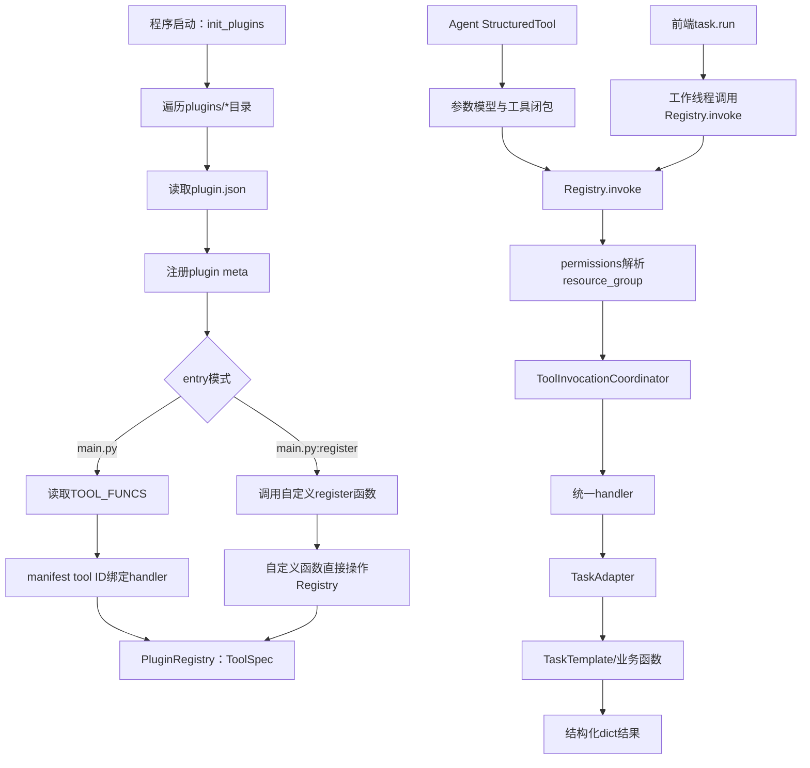
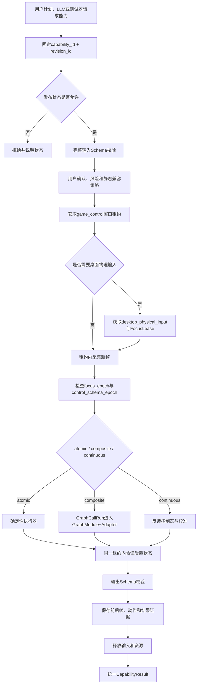

# Whimbox 插件能力注册与调用边界

> 文档性质：Whimbox 2.5.4 插件、工具注册、资源声明和统一调用边界参考
>
> 分析基线：`2.5.4`，提交 `a10fa3059f7a47cd26ba65a562184c8735562320`
>
> 分析日期：2026-07-18
>
> 关联方案：[总体架构与关键问题分析](01-总体架构与关键问题分析.md)
>
> 资产基础：[Whimbox 脚本资源与版本管理](08-Whimbox脚本资源与版本管理.md)
>
> 调用上下文：[任务调度、停止与资源互斥](06-Whimbox任务调度停止与资源互斥.md) · [Agent语义层与工具边界](11-Whimbox-Agent语义层与工具边界.md)
>
> 后续统一设计：[分层关系网与复合能力子图](../interface_discovery/分层关系网与复合能力子图构想.md) · [多窗口输入归属](../interface_discovery/多窗口输入归属与游戏视角异常恢复构想.md) · [动态控件绑定](../interface_discovery/角色能力切换与动态控件绑定构想.md) · [ALAS 确定性执行参考](../../references/alas/AzurLaneAutoScript可借鉴机制与设计思想.md)

## 1. 核心结论

Whimbox 的插件系统把“可被前端或 Agent 调用的业务能力”从具体任务类中抽出，形成一条统一链路：

```text
plugin.json声明工具
-> main.py提供handler
-> Loader动态加载
-> PluginRegistry注册ToolSpec
-> Agent或前端直接调用
-> PluginRegistry.invoke统一占用资源
-> handler选择TaskTemplate并执行
```

它最值得参考的地方不是动态加载本身，而是：

> Agent调用和前端直接调用最终汇合到同一个注册表入口、同一个handler和同一套资源互斥规则。

这使 LLM 不是另一套可以绕开执行规则的入口。

但当前实现仍有明显边界：

- manifest 的权限不是安全权限，只用于资源组选择；
- 注册表不执行输入和输出 Schema 校验；
- Agent 只转换一部分顶层 JSON Schema；
- 插件级权限过粗，同一插件全部工具占用相同资源；
- 动态入口与核心进程同权限执行，没有进程隔离；
- `api_version`、`min_core_version` 和插件版本没有兼容检查；
- 重载先清空旧注册表，失败时不能继续使用上一份有效快照；
- 已注册不等于已验证可靠，也不等于应该暴露给 LLM。

新方案可以借鉴“注册表作为统一执行门”，但状态图中的 `TransitionDefinition` 只引用 `CapabilitySpec`；能力明确分为 `atomic/composite/continuous`，并增加完整的状态契约、风险、资源、故障归因、模型依赖和不可变版本。注册成功、语义确认、拥有验证记录和正式发布是不同事实。

## 2. 插件、工具、Handler和Task的区别

Whimbox 中四个概念的边界如下：

| 层次 | 代表 | 责任 |
| --- | --- | --- |
| 插件 | `game_nikki` | 组织一组相关工具和公共元数据 |
| 工具 | `nikki.load_path` | 对前端或Agent公开的稳定调用入口 |
| Handler | `run_load_path()` | 检查和转换参数，选择实际任务 |
| Task | `AutoPathTask` | 执行步骤、识别、键鼠、停止和结果 |

插件工具不是 Task 类的自动反射。一个 Task 是否存在，不代表它已经成为公开能力。内置插件采用自动注册模式，只有在manifest中声明并绑定handler后才会进入注册表；手动`entry`模式则由自定义注册函数直接决定写入哪些ToolSpec。

同样，一个 handler 可以：

- 直接查询资源；
- 调用系统服务；
- 构造一个 Task；
- 根据输入选择不同 Task；
- 对 TaskResult 做结果转换。

新方案也应保持“内部模块存在”和“能力正式发布”之间的明确边界。

## 3. 总体加载与调用流程



运行中的关键边界是：

```text
声明边界：manifest
发现边界：loader
目录边界：registry
资源边界：coordinator
业务适配边界：handler
执行生命周期边界：TaskTemplate
```

## 4. Manifest声明了什么

内置插件 manifest 位于 [`game_nikki/plugin.json`](../../../../reference_repos/whimbox/whimbox/plugins/game_nikki/plugin.json#L1)。

### 4.1 插件级字段

| 字段 | 当前内容 | 加载器实际用途 |
| --- | --- | --- |
| `id` | `game_nikki` | 插件唯一键、模块名和ToolSpec归属 |
| `name` | 展示名称 | 保留供展示 |
| `version` | `0.1.0` | 当前不参与兼容判断 |
| `author/description` | 作者和说明 | 保留供展示 |
| `entry` | `main.py` | 选择动态入口及注册模式 |
| `api_version` | `1.0` | 当前未校验 |
| `min_core_version` | `0.0.0` | 当前未校验 |
| `permissions` | `screen,input` | 传播给插件全部工具，决定资源组 |
| `tools` | 工具声明数组 | 自动注册的权威清单 |

这里虽然出现了版本和权限字段，但不能仅凭字段名称推断系统已经执行了对应语义。

### 4.2 工具级字段

每个工具通常声明：

```yaml
id: nikki.load_path
name: 运行指定跑图路线
description: 运行指定的跑图路线
input_schema:
  type: object
  properties:
    path_name:
      type: string
  required: [path_name]
output_schema:
  type: object
```

例如路线执行工具见 [`plugin.json`](../../../../reference_repos/whimbox/whimbox/plugins/game_nikki/plugin.json#L101)。

其中：

- `id` 是注册表中的机器身份；
- `name/description` 会提供给 Agent；
- `input_schema` 用于构造 Agent 参数模型；
- `output_schema` 当前只被保存和列出，没有运行时验证；
- 权限来自插件级字段，不支持同一插件内按工具细分。

## 5. 动态加载机制

加载逻辑位于 [`plugins/loader.py`](../../../../reference_repos/whimbox/whimbox/plugins/loader.py#L38)。

### 5.1 发现规则

加载器只遍历插件目录的直接子目录：

- 跳过普通文件；
- 跳过名称以 `_` 开头的目录；
- 每个目录要求存在 `plugin.json`；
- 不执行安装、依赖解析或签名验证。

### 5.2 Python入口执行

[`_load_module_from_path()`](../../../../reference_repos/whimbox/whimbox/plugins/loader.py#L14) 使用 `importlib.util.spec_from_file_location()` 和 `exec_module()` 执行入口。

这意味着入口模块：

- 在核心进程内运行；
- 可以执行模块顶层代码；
- 具有与核心进程相同的文件、网络和系统权限；
- manifest 中的 permissions 不能阻止它直接导入截图或键鼠模块。

所以当前插件机制是扩展接口，不是安全沙箱。

### 5.3 两种注册方式

[`_parse_entry()`](../../../../reference_repos/whimbox/whimbox/plugins/loader.py#L23) 支持：

| `entry` | 注册方式 |
| --- | --- |
| `main.py` | 自动模式：按manifest tools遍历 `TOOL_FUNCS` |
| `main.py:register` | 手动模式：调用指定函数自行注册 |

自动模式中，manifest 是公开工具的权威清单。加载器对每个 `tool.id` 查找相同键的 handler，找不到就报错，见 [`loader.py`](../../../../reference_repos/whimbox/whimbox/plugins/loader.py#L69)。

因此：

- 只在 `TOOL_FUNCS` 中增加函数，不会公开工具；
- 只在 manifest 中增加声明，但没有同名handler，插件会加载失败；
- 两处必须一致。

这些约束只适用于自动模式。`main.py:register`模式仅把`registry`和`meta`交给自定义函数，Loader不会再次按manifest的`tools`核对ID或handler；该函数理论上可以忽略manifest工具清单，或注册清单之外的ToolSpec。

内置映射集中在 [`TOOL_FUNCS`](../../../../reference_repos/whimbox/whimbox/plugins/game_nikki/main.py#L322)。

### 5.4 加载失败边界

加载器只捕获 `PluginLoadError` 和 `ToolRegistryError`，见 [`loader.py`](../../../../reference_repos/whimbox/whimbox/plugins/loader.py#L95)。

普通 JSON 解析异常、入口导入异常和模块顶层异常可能中断整轮加载。并且插件元数据先注册，工具再逐项注册；后续失败时没有回滚已经写入的部分状态。

## 6. Registry中的能力数据模型

[`ToolSpec`](../../../../reference_repos/whimbox/whimbox/plugins/registry.py#L12) 保存：

```text
tool_id
name
description
input_schema
output_schema
func(session_id, input, context)
plugin_id
permissions
```

[`PluginRegistry`](../../../../reference_repos/whimbox/whimbox/plugins/registry.py#L24) 内部使用两个字典：

```text
plugin_id -> plugin_meta
tool_id -> ToolSpec
```

### 6.1 注册规则

[`register_plugin()`](../../../../reference_repos/whimbox/whimbox/plugins/registry.py#L33) 检查：

- 插件ID非空；
- 插件ID没有重复。

[`register()`](../../../../reference_repos/whimbox/whimbox/plugins/registry.py#L41) 检查：

- 工具ID没有重复；
- `plugin_id`非空。

它没有进一步检查：

- `plugin_id` 是否已经注册；
- Schema是否合法；
- handler签名是否正确；
- output是否符合声明；
- 权限是否属于允许集合；
- 工具是否通过测试；
- 工具版本是否兼容核心。

### 6.2 列举与调用

[`list_tools()`](../../../../reference_repos/whimbox/whimbox/plugins/registry.py#L68) 返回不含handler的元数据，当前直接供Agent工具适配和Channel Gateway能力描述使用。前端RPC的`plugin.list`并不调用它，而是返回`get_loaded_plugins()`保存的manifest加载结果，见[`rpc_server.py`](../../../../reference_repos/whimbox/whimbox/rpc_server.py#L861)。

[`invoke()`](../../../../reference_repos/whimbox/whimbox/plugins/registry.py#L84) 才是统一执行入口。它负责：

1. 按 `tool_id` 取得ToolSpec；
2. 读取 stop event、调用来源和等待策略；
3. 根据权限计算资源组；
4. 生成锁owner；
5. 等待或跳过资源锁；
6. 把资源组写入context；
7. 同步调用handler。

注册表不根据 `input_schema` 校验 `input_data`，也不根据 `output_schema` 校验返回值。

## 7. JSON Schema实际覆盖范围

Agent适配位于 [`plugin_tools.py`](../../../../reference_repos/whimbox/whimbox/plugin_tools.py#L11)。

### 7.1 已支持的顶层类型

| JSON类型 | Python类型 |
| --- | --- |
| `string` | `str` |
| `integer` | `int` |
| `number` | `float` |
| `boolean` | `bool` |
| `object` | `dict` |
| `array` | `list` |
| `enum` | 动态 `Literal` |
| 未知 | `Any` |

[`_build_args_schema()`](../../../../reference_repos/whimbox/whimbox/plugin_tools.py#L30) 只遍历顶层 `properties`，把 required 字段设为必填，其余字段默认 `None`。

### 7.2 当前没有完整执行的约束

当前转换器没有递归实现：

- object内部属性；
- array items；
- `oneOf/anyOf/allOf`；
- 数值范围；
- 字符串长度和pattern；
- format；
- 条件Schema；
- 输出Schema。

因此，manifest 是描述性契约，不是完整的强制执行边界。

### 7.3 Agent与直接调用的参数差异

```text
Agent调用
-> StructuredTool Pydantic模型
-> 有限的顶层类型与必填校验

前端task.run
-> input字典
-> Registry.invoke
-> 不执行manifest输入校验
```

这两条路径虽然在执行层汇合，但进入汇合点前的参数校验并不一致。关键参数通常由handler再次手工检查，例如 [`run_load_path()`](../../../../reference_repos/whimbox/whimbox/plugins/game_nikki/main.py#L223) 会检查 `path_name` 是否为空。

新方案必须在统一的 `CapabilityRegistry.invoke()` 内执行完整输入和输出校验，调用来源不能改变核心契约。

## 8. 权限与资源声明

### 8.1 当前权限的实际作用

资源组解析位于 [`_resolve_resource_group()`](../../../../reference_repos/whimbox/whimbox/plugins/registry.py#L127)：

| permissions | resource group |
| --- | --- |
| 含 `screen` 或 `input` | `game_runtime` |
| 其他或空 | `default` |

`game_nikki` 在插件级声明 `screen/input`，所以它的全部工具都进入 `game_runtime`，包括只查询脚本索引的搜索工具和只打开文件夹的工具。

这是一种保守的互斥策略：不容易让两个游戏工具同时输入，但并发粒度较粗。

### 8.2 资源协调器行为

[`ToolInvocationCoordinator`](../../../../reference_repos/whimbox/whimbox/tool_invocation_coordinator.py#L26) 为每个资源组保存单槽状态：

```text
active
owner
Condition
```

[`acquire_sync()`](../../../../reference_repos/whimbox/whimbox/tool_invocation_coordinator.py#L39) 支持：

- `wait`：每0.1秒检查资源和停止事件；
- `skip_if_busy`：资源忙时立即返回busy；
- `on_wait`：首次等待时通知前端；
- 等待中响应协作停止。

[`hold_sync()`](../../../../reference_repos/whimbox/whimbox/tool_invocation_coordinator.py#L79) 在finally释放已经取得的资源。

### 8.3 它不是安全权限

当前 `permissions` 没有阻止插件：

- 直接读写文件；
- 直接访问网络；
- 绕过注册表调用输入对象；
- 启动线程或进程；
- 读取截图；
- 动态导入任意Python模块。

因此名称更准确的含义是“资源协调标签”，而不是“授权能力”。

## 9. Agent与前端直接调用怎样汇合

### 9.1 前端直接任务

前端调用 `task.run` 后，[`rpc_server.py`](../../../../reference_repos/whimbox/whimbox/rpc_server.py#L824) 创建后台任务。执行协程通过 [`asyncio.to_thread()`](../../../../reference_repos/whimbox/whimbox/rpc_server.py#L360) 调用：

```text
PluginRegistry.invoke(
  tool_id,
  session_id,
  input_data,
  stop_event/run_id/source/wait_policy
)
```

同步游戏任务因此进入工作线程，不阻塞RPC主事件循环。

### 9.2 Agent工具

[`build_tools()`](../../../../reference_repos/whimbox/whimbox/plugin_tools.py#L46) 为每个ToolSpec创建LangChain `StructuredTool`。调用闭包取得当前session和stop event，再调用同一个 `registry.invoke()`。

Agent重建工具的位置见 [`Agent._rebuild_tools()`](../../../../reference_repos/whimbox/whimbox/agent.py#L329)。

### 9.3 汇合后的共同规则

两条入口汇合后共同使用：

- 同一个 `tool_id`；
- 同一个ToolSpec；
- 同一个资源组解析；
- 同一个互斥协调器；
- 同一个handler；
- 同一个TaskAdapter和业务Task；
- 同一种结果字典。

差别主要保留在context：

| 信息 | 前端直接任务 | Agent |
| --- | --- | --- |
| `invocation_source` | `task` | `agent` |
| `run_id` | TaskInfo ID | 当前工具闭包未显式注入，锁owner回退为来源、session和tool组合 |
| 参数预校验 | RPC层很少 | StructuredTool有限校验 |
| 前端状态映射 | TaskManager | Agent stream/tool事件 |

### 9.4 内部子任务不经过Registry

业务Task内部直接构造子Task，例如路线触发原子动作时，不会重新调用插件注册表。它们依赖父任务已经占用的 `game_runtime`，并通过共享stop event形成任务链。

这是合理的内部调用边界，但需要遵守一条规则：

> 持有某资源的handler内部，不要再同步调用需要取得同一资源组的公开工具。

当前协调器不可重入，即使owner相同也会等待自身释放。

## 10. Handler到Task的职责边界

内置handler签名统一为：

```python
(session_id, input, context) -> dict
```

确定性任务大多调用 [`TaskAdapter.run()`](../../../../reference_repos/whimbox/whimbox/task_adapter.py#L9)。适配器负责：

- 构造Task；
- 注入外部stop event；
- 设置session和run上下文；
- 同步执行 `task.task_run()`；
- 把TaskResult转换成字典。

Handler适合负责：

- 参数归一化；
- 业务前置检查；
- 查询脚本或模型资产；
- 选择具体执行器；
- 标准化输出。

Task适合负责：

- 步骤状态机；
- 截图和识别；
- 键鼠操作；
- 超时和重试；
- 父子任务；
- 停止检查；
- finally清理。

例如 [`run_load_path()`](../../../../reference_repos/whimbox/whimbox/plugins/game_nikki/main.py#L223) 只检查并查询路线，然后把 `PathRecord` 交给 `AutoPathTask`。handler不负责逐点移动。

## 11. 插件重载与能力可见性

[`init_plugins()`](../../../../reference_repos/whimbox/whimbox/plugin_runtime.py#L15) 保存进程级：

- Registry；
- 成功或失败的插件列表；
- 是否初始化；
- 每次加载递增的版本计数。

强制重载时先调用 `registry.clear()`，再重新扫描，见 [`plugin_runtime.py`](../../../../reference_repos/whimbox/whimbox/plugin_runtime.py#L27)。

RPC `plugin.reload` 随后调用 Agent `reload_tools()`，见 [`rpc_server.py`](../../../../reference_repos/whimbox/whimbox/rpc_server.py#L853)。

这里的 `get_plugins_version()` 只是进程内重载次数，不是能力语义版本。

当前重载边界有四个问题：

1. 先清空活动注册表，加载失败时没有回退；
2. 加载和调用之间没有注册表快照锁；
3. 插件成功加载只证明代码被注册，不证明能力通过实机验证。
4. `Agent.reload_tools()`只替换`self.tools`，没有重新调用`create_agent()`；直接Registry调用会看到新集合，但现有LangChain Agent是否更新工具名称、Schema和可见集合没有得到保证，见[`Agent.reload_tools()`](../../../../reference_repos/whimbox/whimbox/agent.py#L318)。

## 12. 当前调用边界的主要风险

| 风险 | 影响 |
| --- | --- |
| 动态入口与核心同权限 | 第三方插件不是安全隔离代码 |
| permissions只决定互斥 | 无法作为文件、网络和输入授权 |
| 插件级权限粒度 | 纯查询工具也阻塞游戏资源 |
| Registry不校验Schema | Agent和直接调用契约不一致 |
| output_schema不执行 | 声明与实际返回可长期漂移 |
| api/core版本不检查 | 不兼容插件可能仍被加载 |
| 部分注册失败无回滚 | 注册表可能留下半成品 |
| 重载先清空 | 新版本失败会失去旧能力集合 |
| Agent重载未重建执行图 | 对话Agent未必真正看到新工具集合和Schema |
| Registry无发布状态 | 未验证工具也会立即暴露给Agent |
| 协调器不可重入 | handler嵌套同组公开工具可能自锁 |
| `default`也是全局单槽 | 无屏幕工具仍被无差别串行化 |
| Agent活动session为共享字段 | 多session工具上下文可能串线 |

其中最后一项不是注册表设计的必然问题，而是当前 Agent wrapper 在调用时读取共享 `_active_session_id` 的实现风险，见 [`Agent._rebuild_tools()`](../../../../reference_repos/whimbox/whimbox/agent.py#L329)。新方案应在一次PlanRun或AgentRun上下文中固定session，而不是临时读取全局活动值。

## 13. 新方案的CapabilitySpec建议

Whimbox `ToolSpec` 可以作为起点，但关系网驱动系统需要更完整的能力契约。

```yaml
capability_id: nikki.open_backpack
revision_id: caprev_20260718_004
kind: composite
display_name: 打开背包
description: 从游戏HUD打开背包并验证背包页

input_schema:
  type: object
  properties: {}
output_schema:
  type: object
  required: [outcome, reason_code, failure_attribution, sample_disposition, evidence_ids]

preconditions:
  ui.page: GAME_HUD
  desktop.input_ready: true
outcomes:
  SUCCEEDED:
    ui.page: INVENTORY
  FAILED: {}
  UNKNOWN: {}
  CANCELLED: {}
  BLOCKED: {}

resources:
  exclusive:
    - game_control:${window_instance_id}
    - desktop_physical_input
risk_level: LOW
requires_user_confirmation: false
timeout_ms: 5000
stop_policy: cooperative_with_input_cleanup
recovery_policy: recover_to_main_hud
idempotency: safe_if_already_in_target

implementation_ref:
  graph_id: nikki.ui.open_backpack
  graph_revision: graphrev_012
  adapter_id: nikki.ui.default_adapter
  adapter_revision: adapterrev_003

dependencies:
  detector_bundle: detector_bundle_007
  platform: windows
  game_version: ">=2.x,<3"

release_status: ACTIVE
semantic_confirmation_ref: semantic_003
validation_record_refs: [validation_009]
```

`kind` 的统一取值为：

- `atomic`：`implementation_ref` 指向确定性执行器；
- `composite`：指向 `GraphModule + Adapter`；
- `continuous`：指向连续控制器和可选校准Profile。

复合能力之间的定义依赖必须形成DAG；GraphModule内部允许有受控循环，但必须声明进度检测、最大次数、总超时和取消检查。

关键不是字段越多越好，而是把下面几件事从handler源码中提取成可校验契约：

- 能力从什么状态开始；
- 可能到达哪些状态；
- 会占用什么资源；
- 是否具有副作用和风险；
- 能否停止以及怎样清理输入；
- 依赖哪个执行器、GraphModule、Adapter、检测器或连续校准修订；
- 是否允许被规划器和LLM看到。

## 14. 新系统的统一调用门

建议所有外部入口都调用同一个：

```text
CapabilityRegistry.invoke(capability_id, revision_id, input, RunContext)
```

调用顺序至少应为：



模型、平台和定义版本等静态兼容检查可以在排队前完成，但依赖实时画面的前置状态必须在取得 `game_control:<window_instance_id>` 后重新采集和判定。物理输入还必须持有桌面全局唯一的 `desktop_physical_input + FocusLease`，并让租约连续覆盖“前置观察—输入—后置验证”。`focus_epoch` 或 `control_schema_epoch` 变化时，当前解析坐标、动态绑定和排队输入立即失效，必须重新观察。

统一运行记录为 `PlanRun -> CapabilityRun -> StepAttempt`。复合能力每次调用生成 `GraphCallRun` 和 `ReturnContext`；恢复生成独立 `RecoveryRun`，不能覆盖原 StepAttempt 的Outcome与证据。

LLM、前端按钮、回归测试和计划执行器只应在请求来源、权限和展示方式上不同，不能拥有不同的核心执行规则。

## 15. 能力发布边界

### 15.1 已实现不等于已发布

推荐状态：

```text
DRAFT
-> CANDIDATE
-> SHADOW
-> ACTIVE
-> DEGRADED
-> RETIRED
```

- `DRAFT`：能力定义尚未完整；
- `CANDIDATE`：Schema和依赖完整，可以单模块测试；
- `SHADOW`：只做判断或模拟，不发真实输入；
- `ACTIVE`：允许进入正式计划；
- `DEGRADED`：可靠性或依赖发生异常，停止自动选用；
- `RETIRED`：仅保留历史追溯。

名称和说明是否由用户确认，记录在 `SemanticConfirmationRecord`；某修订通过过哪些离线或实机验证，记录在 `ValidationRecord`。二者都不是发布状态，不能再引入 `CONFIRMED` 或 `VALIDATED` 作为另一套发布轴。

### 15.2 不同消费者看到不同投影

完整CapabilitySpec不必全部暴露给LLM。

| 消费者 | 应看到的内容 |
| --- | --- |
| 后端校验器 | 完整前后条件、依赖、风险、资源和版本 |
| 规划器 | `ACTIVE`能力及状态边、成本和风险 |
| LLM | 名称、用途、必要参数、主要限制，不含内部执行细节 |
| 前端用户 | 计划步骤、影响、风险、版本和是否需要确认 |
| 测试器 | `CANDIDATE/SHADOW`能力及验证矩阵 |

LLM不应通过工具列表自动发现候选或未验证能力。

### 15.3 发布门槛

一个能力进入 `ACTIVE` 至少要求：

1. 输入和输出Schema通过；
2. 执行器、GraphModule、Adapter、检测器和校准依赖均固定版本；
3. 前置和后置状态有机器可执行定义；
4. 停止后没有残留按键；
5. 所有路径都能映射为统一Outcome、原因码、故障归因和样本处置；
6. 单模块回归集通过；
7. 实机受控测试达到门槛；
8. 风险等级和用户确认策略明确；
9. 运行证据可以追溯到修订；
10. 上一活动版本可回滚。

## 16. 资源声明建议

不要只使用插件级 `screen/input` 两个标签。能力级资源可以分为：

| 资源 | 模式 | 示例 |
| --- | --- | --- |
| `game_control:<window_instance_id>` | 独占事务 | 同一窗口的前置观察、输入和后置验证 |
| `desktop_physical_input` | 桌面级独占 | 系统级物理键鼠注入 |
| `frame_stream:<window_instance_id>` | 共享读 | OCR、YOLO、状态判断和只读观察 |
| `gpu_inference` | 配额或队列 | YOLO、CLIP、SAM |
| `ocr_engine` | 按实现决定共享/独占 | OCR推理 |
| `asset_registry` | 共享读/短暂独占写 | 查询或发布机器定义 |
| `plan_run:<session>` | 独占 | 防止同session重入 |
| `workspace_fs` | 路径范围授权 | 证据和资源读写 |

资源声明还要与真实授权分开：

```text
resource requirement
-> 为并发调度服务

permission grant
-> 决定调用方和执行器是否允许执行副作用
```

不能继续把一个字符串同时当作两种概念。

取得 `desktop_physical_input` 时还必须取得绑定目标窗口的 `FocusLease` 并记录 `focus_epoch`。焦点变化、窗口实例重建或租约撤销会使尚未发送的输入失效。动态HUD操作还必须记录 `control_schema_epoch`；角色或能力切换导致epoch变化时，旧 `ContextualBinding` 和排队动作全部重新解析。

## 17. Schema和结果建议

### 17.1 判别式输入

对于多种动作，不使用一个通用 `action_params` 字符串，而采用明确联合：

```yaml
oneOf:
  - type: key_press
    required: [key]
  - type: click_target
    required: [detector_id, target_class]
  - type: wait_state
    required: [state_id, timeout_ms]
```

### 17.2 统一结果

能力对外只使用五种终态：

```text
SUCCEEDED
FAILED
UNKNOWN
CANCELLED
BLOCKED
```

`ALREADY_DONE` 可以表达为 `SUCCEEDED + reason_code=ALREADY_SATISFIED`；资源忙、版本不兼容、前置条件不满足或控件当前不可用表达为 `BLOCKED + reason_code`；`STOP_REQUESTED` 是运行阶段，不是终态。

并返回：

```text
capability_id + revision_id
plan_run_id + capability_run_id + attempt_id
可选graph_call_run_id / recovery_run_id
前置状态证据
后置状态证据
实际动作摘要
focus_epoch / control_schema_epoch
耗时
reason_code
FailureAttribution
SampleDisposition
evidence_ids
```

输出Schema必须在统一调用门校验，不能只作为Agent提示信息。

## 18. 可以借鉴与不应照搬

| Whimbox做法 | 是否借鉴 | 新方案调整 |
| --- | --- | --- |
| manifest声明工具元数据 | 借鉴 | 增加版本、状态边、风险、资源和依赖 |
| Tool ID与展示名分离 | 借鉴 | ID永久稳定，展示名可演化 |
| manifest和handler双向对齐 | 借鉴 | 发布时做静态和启动自检 |
| Registry作为统一调用入口 | 重点借鉴 | 所有来源在此做强校验和策略执行 |
| Agent与直接调用复用handler | 重点借鉴 | 再统一参数、权限和结果契约 |
| handler与Task分层 | 借鉴 | handler保持薄，执行逻辑进入版本化Capability或GraphModule |
| 资源锁等待可响应停止 | 借鉴 | 增加公平队列、共享/独占模式和可观察状态 |
| 动态模块入口 | 谨慎借鉴 | 内置信任代码可用；第三方需签名、隔离或明确授信 |
| permissions作为资源组标签 | 不直接照搬 | 资源需求和安全授权分离 |
| 插件级权限传播到全部工具 | 不照搬 | 每个能力单独声明资源和风险 |
| Registry绕过Schema校验 | 不照搬 | 输入输出在统一入口强制校验 |
| 注册成功即暴露给Agent | 不照搬 | 只有ACTIVE能力进入LLM工具投影 |
| 重载前清空旧集合 | 不照搬 | 构建新快照成功后原子切换 |
| 进程内递增重载计数当版本 | 不照搬 | 使用不可变能力修订和快照ID |
| 逐次观察后再推进下一动作 | 借鉴ALAS思想 | 原子、复合和连续能力均由统一调用门验证，不复制ALAS游戏结构 |

## 19. 第一阶段实现建议

无需一开始就实现通用第三方插件平台。可以按以下最小顺序推进：

1. 定义 `CapabilitySpec`、统一Outcome、`CapabilityResult` 和 `RunContext`；
2. 先用静态Python注册表，不急于支持任意动态入口；
3. 让前端、测试器和未来LLM统一调用 `CapabilityRegistry.invoke()`；
4. 在Registry内强制输入、输出和发布状态校验；
5. 为 `game_control:<window_instance_id>`、`desktop_physical_input` 和 `FocusLease` 建立资源声明；
6. 只发布一个 `atomic` 基础能力，并用一个最小 `composite` 能力引用它；
7. 加入前置HUD判断、后置背包判断、`focus_epoch`、停止清理和运行证据；
8. 先以 `CANDIDATE -> SHADOW -> ACTIVE` 人工审批发布；
9. 后续再把OCR、YOLO、CLIP、SAM检测器注册为可版本化依赖；
10. 再加入一个带校准引用的 `continuous` 测试能力；
11. 最后才开放LLM高层能力投影和多能力计划。

这样可以先验证统一调用边界是否可靠，再扩展动态插件和自动发布。

## 20. 结论

Whimbox 已经给出了一个很有价值的模块管理答案：

```text
工具声明
-> 动态绑定
-> 注册表
-> 统一资源互斥
-> handler
-> 确定性任务
```

对新方案最重要的继承原则是：

> LLM只负责选择已发布能力；所有真实执行都必须经过与前端直接运行相同的注册、校验、资源和证据边界。

需要在 Whimbox 基础上补足的是：

```text
完整Schema校验
+ 能力级资源与真实授权
+ 前置/后置状态契约
+ atomic/composite/continuous统一契约
+ GraphModule DAG、Adapter和运行调用栈
+ FocusLease/focus_epoch与动态控件epoch
+ 风险和用户确认
+ 不可变版本与依赖
+ DRAFT/CANDIDATE/SHADOW/ACTIVE/DEGRADED/RETIRED发布轴
+ 原子注册表快照
+ 统一Outcome、故障归因与可追溯执行证据
```

这能避免“某个函数存在就直接给LLM调用”，也能保证后续新增OCR、YOLO、CLIP、SAM或复杂Step时，能力边界仍然清晰。
