# Whimbox 错误恢复与执行证据

> 文档性质：面向关系网 Step 执行方案的 Whimbox 2.5.4 实现参考
>
> Whimbox 基线：`2.5.4`，提交 `a10fa3059f7a47cd26ba65a562184c8735562320`
>
> 上位方案：[总体架构与关键问题分析](01-总体架构与关键问题分析.md)
>
> 调度前置：[任务调度、停止与资源互斥](06-Whimbox任务调度停止与资源互斥.md)
>
> 视觉证据前置：[图像处理参考](03-Whimbox图像处理参考.md) · [界面状态判断](04-Whimbox界面状态判断.md)
>
> 运行案例：[运行事件与前后端解耦](07-Whimbox运行事件与前后端解耦.md) · [自动跑图视觉闭环](12-Whimbox自动跑图视觉闭环.md)
>
> 后续统一设计：[瞬态故障、控件缺失与指标隔离](../interface_discovery/游戏瞬态故障判读与置信度隔离构想.md) · [多窗口输入归属与恢复](../interface_discovery/多窗口输入归属与游戏视角异常恢复构想.md) · [动态控件绑定](../interface_discovery/角色能力切换与动态控件绑定构想.md) · [ALAS 看门狗与错误证据参考](../../references/alas/AzurLaneAutoScript可借鉴机制与设计思想.md)

## 1. 核心结论

Whimbox 已经包含多种实用恢复方式：

- 普通任务异常后从头自动重试一次；
- 每次任务尝试结束后执行 `finally`；
- 默认尝试返回游戏主界面；
- UI 导航失败时回主界面后重新导航；
- 自动跑图卡住时先跳跃脱困，持续卡住再报错；
- 宏停止时释放仍处于按下状态的键；
- 外层任务保存状态、时间、错误和最终结果；
- 前端实时接收运行状态与文本日志；
- 本地 Loguru 文件保存更完整的调试日志。

但它还没有形成适合关系网学习系统的“可审计执行证据链”。普通任务通常不会保存：

- 本 Step 操作前后的原始帧；
- 帧的唯一身份和采集时间；
- 状态判定使用了哪些图标、OCR 或模型证据；
- 实际发出了哪些键鼠事件；
- 每个事件的实际时间和目标；
- 第几次 Attempt 失败；
- 恢复动作本身做了什么；
- 清理是否完整；
- 模型、检测器、Step 和图的版本。

因此，Whimbox 当前更适合回答“任务大致成功还是失败、日志里发生了什么”，不能稳定回答：

> 这一次 Step 为什么被判成功，它读取的是哪一帧，输入是否真的发送，失败后恢复改变了什么，当前统计能否用于自动晋级或降级节点？

关系网系统可以参考 Whimbox 的分层错误、有限重试、安全页面恢复和 finally 清理，并借鉴 ALAS 的逐步观察、重复行为看门狗、最近截图缓冲和错误现场打包思想。但必须新增统一Outcome、不可变 Attempt 记录、前后帧关联、输入归属、故障归因、样本处置和独立恢复事实。

## 2. Whimbox 的错误分层

一次失败可能发生在不同层，不能只看一个 `ERROR` 字符串。

| 层次 | 当前表示 | 示例 |
| --- | --- | --- |
| JSON-RPC 协议 | JSON-RPC error code | 参数格式错误、方法不存在、内部异常 |
| 外层任务记录 | `PENDING/RUNNING/SUCCESS/ERROR/CANCELLED` | 前端查询的一次 TaskInfo 终态 |
| 业务任务结果 | `success/error/failed/stop` | 任务异常、已知失败、手动停止 |
| 资源协调 | `acquired/busy/stopped` | 游戏资源占用或排队期间停止 |
| UI 导航 | 返回、`False`、异常和重试 | 找不到页面、按钮或验证失败 |
| 视觉识别 | 布尔、分数、空文本、异常 | 图标未命中、OCR 空结果 |
| 宏步骤 | 文本日志，部分异常被吞掉 | 单步失败后序列继续 |
| 运行日志 | Loguru 与 `event.run.log` | 人类可读过程信息 |

这些状态没有被统一成一份结构化错误对象。相同的“没有找到按钮”可能表现为：

- 一个函数返回 `False`；
- 上层转成异常；
- 上层只写 warning；
- 最终任务仍然是 `success`；
- 或被 RPC 映射为 `ERROR`。

## 3. 协议错误与业务错误不是一回事

[`_handle_message()`](../../../../reference_repos/whimbox/whimbox/rpc_server.py#L886) 把 RPC 错误映射为：

| code | 含义 |
| --- | --- |
| `-32700` | JSON 解析失败 |
| `-32600` | 请求结构无效 |
| `-32602` | 参数无效或业务抛出 `ValueError` |
| `-32601` | 方法不存在 |
| `-32603` | 未分类内部异常 |

这些错误说明“请求没有被正确接受或分派”，通常还没有进入游戏 Step。

相反，`task.run` 正常返回 `task_id` 后，任务仍可能在资源等待、任务构造、截图、UI 导航或输入阶段失败。此时失败通过 `TaskInfo`、运行事件和最终结果报告，而不是原 RPC response。

关系网系统必须保留这种边界：

```text
提交请求失败
!=
PlanRun 执行失败
!=
CapabilityRun或StepAttempt结果未知
!=
用户请求取消
```

## 4. `TaskResult` 的当前错误语义

[`task_template.py`](../../../../reference_repos/whimbox/whimbox/task/task_template.py#L16) 定义四种内部状态：

| 状态 | 语义 | 当前后续行为 |
| --- | --- | --- |
| `success` | 任务成功 | 结束并映射为外层 SUCCESS |
| `error` | 异常型错误 | 未停止时完整自动重试一次 |
| `failed` | 已知业务失败 | 不自动重试，映射为外层 ERROR |
| `stop` | 手动或协作停止 | 不自动重试，映射为 CANCELLED |

这个区分比单一布尔值更有价值：程序异常和明确业务失败具有不同重试风险。

但仍存在三个重要缺口。

### 4.1 没有 `UNKNOWN`

如果输入已经发出，但截图失败、识别证据冲突或超时，系统不能证明成功，也不能证明失败。这种情况不应归为 `failed`，更不能继续使用默认 `success`。

### 4.2 默认结果是成功

[`TaskResult`](../../../../reference_repos/whimbox/whimbox/task/task_template.py#L48) 默认初始化为 `success`。只写错误日志但没有调用 `update_task_result()` 的代码，最终可能仍然被认为成功。

### 4.3 未知状态被外层映射为成功

[`_run_registered_task()`](../../../../reference_repos/whimbox/whimbox/rpc_server.py#L378) 只对 `stop/error/failed` 特判，其他 status 都落入 `SUCCESS`。以后新增状态但忘记同步 RPC 映射时，会产生假成功。

## 5. 普通任务异常后的恢复链

### 5.1 异常转换

[`TaskTemplate._task_run()`](../../../../reference_repos/whimbox/whimbox/task/task_template.py#L209) 捕获步骤抛出的所有 `Exception`：

```text
步骤抛异常
-> 调用 handle_exception()
-> stop event 已设置：结果设为 stop
-> 否则：结果设为 error
-> 记录 traceback
-> 进入 handle_finally()
```

`on_error()` 虽然可以登记一个 `error_step`，但当前异常路径只把它写入 `current_step`，不会真正调用该步骤的 `run()`，见 [`on_error()`](../../../../reference_repos/whimbox/whimbox/task/task_template.py#L170)。因此它目前不是可执行的恢复工作流。

### 5.2 一次完整自动重试

[`TaskTemplate.task_run()`](../../../../reference_repos/whimbox/whimbox/task/task_template.py#L177) 第一次得到 `error` 且没有停止请求时：

1. 写入“自动重试一次”日志；
2. 把 `task_result` 重置成默认成功；
3. 再次调用 `_task_run()`；
4. 从首步骤重新开始。

`failed` 和 `stop` 不重试。

### 5.3 重试前已经清理

第一次 `_task_run()` 的 `finally` 已经调用 `handle_finally()`。因此默认顺序是：

```text
第一次步骤异常
-> 默认返回主界面
-> 重置 TaskResult
-> 同一个任务对象从第一步再运行
```

这为大量 UI 任务提供了简单有效的恢复锚点，但不是严格事务回滚。

### 5.4 同对象重试的风险

第二次尝试会复用：

- 子类计数器；
- 当前索引；
- 已修改的列表和字典；
- 缓存的检测结果；
- 已经消耗的游戏资源；
- 第一次输入造成的实际页面或账号状态。

框架只重置 `TaskResult`，没有重新构造任务，也没有生成 attempt ID。因此事后无法区分两次尝试的独立证据。

## 6. 回主界面的恢复锚点

默认 [`handle_finally()`](../../../../reference_repos/whimbox/whimbox/task/task_template.py#L269) 调用 [`back_to_page_main()`](../../../../reference_repos/whimbox/whimbox/common/utils/ui_utils.py#L311)。后者循环执行：

```text
等待画面稳定
-> 地牢界面：按返回并确认退出
-> 已是游戏主界面：结束
-> 其他界面：按 ESC
-> 再次检查
```

停止事件被设置后循环退出。

### 6.1 这种做法的价值

- 主界面特征稳定、容易检测；
- 大多数任务可以从相同起点重新导航；
- 避免为每一个未知弹窗单独写恢复路径；
- 自动重试前能够减少第一次失败遗留的页面状态。

### 6.2 这种做法的限制

1. `back_to_page_main()` 没有自己的总超时；
2. 持续无法识别主界面时可能反复发送 ESC；
3. 返回主界面不是撤销第一次操作；
4. 购买、领取、账号切换等副作用不会回滚；
5. 清理本身抛异常时可能覆盖原任务错误；
6. 子任务默认回主界面可能破坏父任务希望保留的页面；
7. 恢复过程没有保存逐步输入和画面证据。

因此主界面适合作为“已知安全锚点”，不能被视为数据库式事务回滚。

## 7. UI 导航的局部恢复

[`UI.goto_page()`](../../../../reference_repos/whimbox/whimbox/ui/ui.py#L61) 在普通页面导航中形成局部闭环：

```text
识别当前页面
-> 无法识别则回主界面
-> BFS查找页面路径
-> 执行一条页面边
-> 等待稳定和加载
-> 验证目标页面
-> 失败时回主界面后重新导航
```

默认 `max_retry=1`，即初次失败后最多再尝试一次；部分调用方会传入更高但仍有限的值。

这是一种值得借鉴的恢复思想：

> 操作失败后不直接重复最后一次点击，而是重新建立已知状态，再重新规划确定性路径。

但当前导航只保存日志，不保存本次识别候选、匹配分数、点击前后帧、实际路径 Attempt 和恢复路径证据。

## 8. 自动跑图的连续闭环恢复

自动跑图不是单纯页面导航。它会持续观察位置并调用 [`check_stuck()`](../../../../reference_repos/whimbox/whimbox/task/navigation_task/auto_path_task.py#L224)：

- 位置在小范围内保持 5 秒：停止当前移动并尝试跳跃脱困；
- 持续卡住超过 15 秒：抛出异常；
- 位置重新变化：清除卡住状态。

发生框架级 `error` 后，[`AutoPathTask.clear_all()`](../../../../reference_repos/whimbox/whimbox/task/navigation_task/auto_path_task.py#L526) 会：

- 把路线索引恢复到最近传送点；
- 清除当前位置和移动模式；
- 停止并等待跳过、移动和跳跃线程；
- 为第二次完整任务尝试建立较明确的恢复点。

这比普通任务的“只回主界面”更接近领域化恢复。不过它仍没有独立记录：

- 卡住位置的截图序列；
- 5 秒脱困动作的实际输入；
- 脱困前后坐标置信度；
- 15 秒失败对应的帧和路线点；
- 第一次与第二次 Attempt 的独立结果。

## 9. 宏执行暴露出的错误语义缺口

[`RunMacroTask._execute_step()`](../../../../reference_repos/whimbox/whimbox/task/macro_task/run_macro_task.py#L101) 用一个大 `try/except` 包住单步执行。捕获异常后只写：

```text
执行步骤失败: ...
```

随后返回外层循环，继续执行后续宏步骤，见 [`run_macro_task.py`](../../../../reference_repos/whimbox/whimbox/task/macro_task/run_macro_task.py#L171)。

此外：

- `wait_game_page` 超时只写错误日志；
- `wait_not_game_page` 超时也只写错误日志；
- 宏仍可能继续执行并记录“宏执行结束”；
- 没有统一把超时转换为 `failed` 或 `unknown`。

这说明“日志中出现错误”不等于“任务结果是失败”。

对关系网 Step 而言，单步异常或后置状态超时必须结束当前 Attempt，不能仅写日志后继续进入下一图节点。否则图统计会把错误路径当作成功样本。

## 10. 清理错误与原始错误

Whimbox 把 `handle_finally()` 放在 `_task_run()` 的 finally 中，方向是正确的，但当前没有单独保护和汇总清理错误。

可能出现：

```text
业务步骤先失败
-> handle_finally() 再失败
-> 调用方最终只看到清理异常
-> 原始业务错误和部分清理结果难以还原
```

同样，停止 listener、释放按键、停止子线程、返回主界面和释放资源是不同清理项。当前通常由各任务手写成一个函数，无法知道具体哪一项成功、哪一项失败。

新方案需要同时保留：

- `primary_error`：导致 Step 终止的原始问题；
- `cleanup_errors[]`：清理期间的独立问题；
- `cleanup_complete`：是否确认没有残留输入和 worker；
- `resource_release_complete`：资源租约是否释放；
- 最终安全级别，例如 `CANCELLED_CLEAN` 或取消结果加 `cleanup_incomplete=true`。

## 11. 当前已有的执行记录

### 11.1 `TaskInfo`

[`TaskInfo`](../../../../reference_repos/whimbox/whimbox/task_manager.py#L9) 保存：

- `task_id`、`session_id`、`tool_id`；
- 外层 state；
- 创建、开始和结束时间；
- error 字符串；
- handler 最终 result。

这些字段可以回答“谁运行了什么工具、何时开始结束、最终大致状态是什么”。

### 11.2 实时状态事件

[`_notify_run_status()`](../../../../reference_repos/whimbox/whimbox/rpc_server.py#L93) 发送：

- `session_id`；
- `run_id`；
- `source`；
- `phase`；
- 可选 `tool_id/detail/tool_call_id/result/error`。

任务开始、等待资源、完成、失败和取消可以通过 `event.run.status` 呈现给前端。

### 11.3 实时任务日志

[`TaskTemplate.log_to_gui()`](../../../../reference_repos/whimbox/whimbox/task/task_template.py#L304) 发送：

- `session_id`；
- `run_id`；
- `source=task`；
- 带图标的 message；
- raw message；
- level；
- 展示 type。

RPC 最终还会发送 `finalize_ai_message` 类型的完成、错误或停止日志。

### 11.4 本地日志文件

[`common/logger.py`](../../../../reference_repos/whimbox/whimbox/common/logger.py#L39) 使用 Loguru：

- 按日期写入 `whimbox-YYYY-MM-DD.log`；
- 最低保留 TRACE；
- `enqueue=True` 异步写入；
- 启动时删除超过 7 天的同前缀日志。

本地日志比前端事件更适合调试堆栈，但仍主要是非结构化文本。

## 12. 当前事件不是持久化证据总线

[`event_bus.emit_event()`](../../../../reference_repos/whimbox/whimbox/event_bus.py#L16) 只是调用唯一 notifier：

- notifier 尚未设置时直接丢弃；
- 不保存历史；
- 没有事件序号；
- 不支持重放；
- 没有多订阅者隔离；
- 业务调用方不等待广播结果。

RPC 的 [`_notify()`](../../../../reference_repos/whimbox/whimbox/rpc_server.py#L63) 只负责把事件调度回主 asyncio loop，广播失败不会反馈给任务执行。

因此前端实时日志适合用户观察，但不能作为关系网节点晋级、可靠性统计或事故复盘的唯一数据源。

## 13. 截图证据的当前边界

普通模板匹配、OCR、页面验证和任务执行通常只在内存中消费截图。识别函数返回布尔、分数、文字或页面对象后，原始帧和裁剪区域不会自动保存。

Whimbox 确实有独立的 Agent 图片分析工具：

```text
itt.capture()
-> 保存 logs/screenshot/<session>_<uuid>.png
-> 交给多模态模型分析
-> 返回 analysis 与 image_source
```

见 [`agent_workspace/tools.py`](../../../../reference_repos/whimbox/whimbox/agent_workspace/tools.py#L204) 和 [`agent.py`](../../../../reference_repos/whimbox/whimbox/agent.py#L425)。

但这不是普通 TaskTemplate 的统一运行证据，而且启动时会清空截图临时目录，见 [`main._clear_temp_file()`](../../../../reference_repos/whimbox/whimbox/main.py#L10)。它不能替代持久化 Step Attempt 证据。

截图层还有一项重要事实：[`Capture`](../../../../reference_repos/whimbox/whimbox/interaction/capture.py#L18) 缓存最近有效帧；本次抓取失败或不满足刷新间隔时会返回缓存副本。返回数组没有 `frame_id`、新鲜度或采集错误标志。因此上层无法仅凭图像数组证明它是本次输入后的新帧。

## 14. 当前缺少哪些执行证据

### 14.1 缺少帧身份

- 没有统一 `frame_id/frame_seq`；
- 没有采集单调时间；
- 没有“新帧、缓存帧、抓取失败”标志；
- 没有原始分辨率、窗口句柄和画面区域的统一元数据；
- OCR、模板和输入日志无法证明来自同一帧。

### 14.2 缺少识别证据

- 页面命中通常只留下 `True/False`；
- 未统一保存模板分数与阈值；
- OCR 结果缺少统一的原框、置信度和模型版本；
- 没有保存必需证据、可选证据、否定证据和冲突；
- 没有候选状态列表与最终解释原因。

### 14.3 缺少输入事实

- 没有统一 `action_id`；
- 没有计划时间与实际注入时间；
- 没有记录最终换算后的屏幕坐标；
- 没有记录目标控件证据；
- 没有完整记录按下、移动、释放和残留键清理；
- 无法证明停止请求后是否还产生过输入。

### 14.4 缺少 Attempt 边界

- 自动重试没有 attempt ID；
- 第一次和第二次日志共用同一个 run ID；
- 没有保存每次尝试的前置状态和 Outcome；
- 恢复动作没有独立记录；
- 清理结果没有逐项记录。

### 14.5 缺少定义版本

- 没有统一关联 State、Transition、Capability、GraphModule、Adapter 和校准修订；
- 没有状态检测器版本；
- 没有 OCR、YOLO、CLIP、SAM 或模板资产版本；
- 没有状态图快照、`ExecutablePlan`版本清单或计划 hash；
- 后续算法升级后无法准确比较历史统计。

## 15. 关系网系统需要的证据链

推荐形成以下链条：

```mermaid
flowchart LR
    APPROVAL["用户批准的 ExecutablePlan 快照"] --> PLAN["PlanRun"]
    PLAN --> CAP["CapabilityRun"]
    CAP --> ATTEMPT["StepAttempt"]
    CAP --> GRAPH["可选 GraphCallRun"]
    ATTEMPT --> PRE["前置 Frame + StateDecision"]
    PRE --> ACTION["ActionEvent 序列"]
    ACTION --> POST["后置 Frame + StateDecision"]
    POST --> OUTCOME["OutcomeDecision"]
    OUTCOME --> RECOVERY["可选 RecoveryRun"]
    ATTEMPT --> CLEANUP["CleanupRecord"]
    GRAPH --> ATTEMPT
    RECOVERY --> CLEANUP
```



`atomic` 和 `continuous` 能力直接产生 StepAttempt；`composite` 能力通过 `GraphCallRun` 记录被调用 GraphModule、Adapter、`ReturnContext` 和返回后的重新观察。定义依赖是DAG，运行实例仍然是一棵调用树。恢复始终是独立 `RecoveryRun`，不覆盖原 StepAttempt。

这条证据链必须是执行器自动生成的机器事实。LLM 可以解释证据和提出疑问，但不能补写不存在的输入事件、帧、故障归因或成功结果。

## 16. 推荐的记录对象

### 16.1 `PlanRunRecord`

```text
plan_run_id
session_id
graph_snapshot_id
plan_hash
executable_plan_revision_manifest
approved_by
approved_at
ordered_capability_ids
started_at / finished_at
terminal_status
```

它证明用户批准的是哪一份不可变计划，而不是执行期间被修改后的图。

### 16.2 `CapabilityRunRecord` 与 `StepAttemptRecord`

```text
capability_run_id
plan_run_id
capability_id / capability_revision
kind = atomic / composite / continuous
parent_capability_run_id
graph_call_run_ids[]
attempt_ids[]
terminal_outcome
```

```text
capability_run_id
attempt_id
attempt_index
window_instance_id
focus_lease_id / focus_epoch
control_schema_epoch
phase timestamps
pre_state_decision_id
action_ids[]
post_state_decision_id
outcome
reason_code
failure_attribution
sample_disposition
retry_reason
recovery_run_id
cleanup_record_id
```

每次重试创建新记录，不覆盖第一次失败。

### 16.3 `GraphCallRunRecord` 与 `RecoveryRunRecord`

`GraphCallRunRecord` 保存：

```text
graph_call_run_id
caller_capability_run_id / callee_capability_run_id
graph_id / graph_revision
adapter_id / adapter_revision
return_context
entry_state_decision_id
outcome
observed_return_state_decision_id
resume_decision
```

`RecoveryRunRecord` 保存故障签名、恢复策略修订、恢复前后状态、实际输入、结果和是否允许重新尝试原能力。恢复成功只增加恢复指标，不把原 Attempt 改成成功。

### 16.4 `FrameRecord`

```text
frame_id / frame_seq
window_instance_id
capture_wall_time
capture_monotonic_ns
is_fresh / capture_error
source_resolution
normalized_resolution
pixel_format
image_hash
artifact_path
desktop_witness_frame_id
```

如果因缓存返回旧帧，必须继承原帧 ID，而不是生成“看起来更新了”的新 ID。

### 16.5 `StateDecisionRecord`

```text
decision_id
frame_id
state_id / detector_version
result = MATCH / NO_MATCH / UNKNOWN
confidence
evidence_ids[]
conflicts[]
reason_code
ui_integrity
control_availability
```

置信度必须注明来源和标定方式，不能把 OCR、YOLO、CLIP 和模板原始分数直接相加。

### 16.6 `ActionEventRecord`

```text
action_id
attempt_id
event_type
logical_target
resolved_coordinates
key_or_button
planned_time
injected_time
source_frame_id
focus_lease_id / focus_epoch
control_schema_epoch
result
```

拖拽、长按等复合动作还应记录其内部按下、移动和释放事件。清理阶段补发的释放动作也必须标记为 `source=cleanup`。

### 16.7 `CleanupRecord`

```text
cleanup_record_id
stop_new_input_result
released_keys[]
released_mouse_buttons[]
stopped_workers[]
worker_join_results[]
resource_release_results[]
final_frame_id
errors[]
complete
```

它证明 CANCELLED 或 FAILED 后执行层是否真的安全停止，而不只是前端状态变了。

## 17. 推荐的终态与原因码

所有 Capability 对外统一使用：

```text
SUCCEEDED / FAILED / UNKNOWN / CANCELLED / BLOCKED
```

具体问题放入正交的 `reason_code + FailureAttribution + SampleDisposition`，避免状态枚举无限膨胀。

| Outcome | 判定条件 |
| --- | --- |
| `SUCCEEDED` | 有新鲜后置证据，明确命中预期 Outcome |
| `FAILED` | 有充分证据证明能力已执行并命中明确失败结果；是否影响关系指标由归因和样本处置决定 |
| `UNKNOWN` | 输入可能已生效，但证据不足、冲突、过期或超时，无法判断结果 |
| `CANCELLED` | 收到取消，worker 已停止且进入过清理；清理完整性另设字段 |
| `BLOCKED` | 前置条件、资源、兼容性、可用性或安全门明确不允许执行，且业务输入未发送 |

原因码可以包括：

```text
PRECONDITION_MISMATCH
PRECONDITION_UNKNOWN
RESOURCE_TIMEOUT
FOCUS_LEASE_INVALID
FOCUS_EPOCH_CHANGED
CONTROL_SCHEMA_EPOCH_CHANGED
CAPTURE_FAILED
STALE_FRAME
DETECTOR_ERROR
INPUT_INJECTION_ERROR
INPUT_ROUTED_TO_OTHER_WINDOW
CONTROL_DISABLED_EXPECTED
CONTROL_DISABLED_SUSPECTED_BUG
CONTROL_VISUAL_MISSING
UI_INTEGRITY_DEGRADED
GAME_CLIENT_TRANSIENT
POSTCONDITION_TIMEOUT
POSTCONDITION_CONFLICT
KNOWN_FAILURE_OUTCOME
USER_CANCELLED
WORKER_ERROR
RECOVERY_ERROR
CLEANUP_INCOMPLETE
```

`FailureAttribution` 至少区分：

```text
EXPECTED_UNAVAILABLE
EXPECTED_INTERRUPTION
GAME_CLIENT_TRANSIENT
GAME_SERVER_OR_RULE
AUTOMATION_ENVIRONMENT
INPUT_ROUTING
PERCEPTION_FAILURE
EXECUTOR_FAILURE
CAPABILITY_DEFINITION_ERROR
GAME_VERSION_INCOMPATIBLE
UNKNOWN
```

`SampleDisposition` 至少区分：

```text
VALID_SUCCESS
VALID_CAPABILITY_FAILURE
EXPECTED_UNAVAILABLE
INTERRUPTION_HANDLED
TRANSIENT_ENVIRONMENT_FAULT
PERCEPTION_INVALID
INPUT_ROUTING_INVALID
USER_CANCELLED
ATTRIBUTION_UNKNOWN
QUARANTINED
```

“代码抛异常”不应自动等于“游戏操作失败”。如果输入已经发送而后续代码异常，最终 Outcome 很可能是 `UNKNOWN`，同时记录 `FailureAttribution=EXECUTOR_FAILURE`。控件变灰、图标缺失或其他游戏Bug也不能只靠一次截图直接归因，疑似样本先进入隔离或待恢复对照。

## 18. 推荐的恢复动作

恢复必须是明确策略，不应隐藏在 `finally` 中当作普通清理。

| 恢复动作 | 是否再次输入 | 适用场景 | 默认风险 |
| --- | ---: | --- | --- |
| `REOBSERVE` | 否 | 帧过期、短暂动画、OCR不清 | 低 |
| `WAIT_STABLE` | 否 | 页面仍在过渡 | 低 |
| `RETRY_DETECTOR` | 否 | 推理服务短暂失败 | 低 |
| `REACQUIRE_FOCUS` | 是 | FocusLease失效或输入归属不明确 | 中 |
| `REBUILD_CONTROL_BINDING` | 否 | `control_schema_epoch` 变化 | 低 |
| `RETRY_CAPABILITY` | 是 | 低风险、可证明幂等且仍处前置状态 | 中 |
| `RETURN_TO_ANCHOR` | 是 | 已知页面导航恢复 | 中 |
| `RELOAD_GAME_CONTEXT` | 是 | 已确认游戏客户端瞬态故障 | 高 |
| `ASK_USER` | 否 | 未知状态、高风险或证据冲突 | 低 |
| `ABORT_PLAN` | 否 | 安全边界不满足 | 低 |

每个恢复动作应生成 `RecoveryRun`，包含：

- 触发原因；
- 恢复策略版本；
- 恢复前状态；
- 实际输入；
- 恢复后状态；
- 是否成功；
- 是否允许创建新的 StepAttempt 重新执行原能力。

恢复成功只表示“到达允许继续的位置”，不能覆盖原 Attempt 的失败或未知结果。

## 19. MVP 的恢复边界

总体方案明确暂不追求自动失败恢复和无限重新规划。首个 MVP 建议只支持：

1. 不发送输入的重新观察；
2. 等待画面稳定；
3. 对检测器进行有限重试；
4. 用户明确批准的低风险 Capability 单次重试；
5. `UNKNOWN` 默认暂停并请求用户；
6. 用户选择后再执行“回主界面”等恢复；
7. 任何购买、删除、消耗资源动作禁止自动重放；
8. 恢复次数和总耗时均有硬上限。

Whimbox 的自动回主界面可以作为后续恢复能力参考，但第一版不应在所有错误后自动执行，避免恢复动作本身改变用户希望保留的未知状态。

## 20. 证据存储方向

在尚未决定数据库前，可以先使用“结构化元数据 + 内容寻址文件”的简单布局：

```text
runs/
└── <plan_run_id>/
    ├── manifest.json
    ├── events.jsonl
    ├── rolling-frames/
    ├── recoveries/
    └── capabilities/
        └── <capability_run_id>/
            ├── capability-run.json
            ├── graph-calls/
            └── attempts/
                └── <attempt_id>/
                    ├── attempt.json
                    ├── pre.png
                    ├── post.png
                    ├── state-decisions.json
                    ├── actions.jsonl
                    └── cleanup.json
```

实现时应满足：

- 元数据追加写或原子替换；
- 图片使用 hash 校验；
- 事件含单调递增序号；
- 保存失败不能静默伪造成功证据；
- 明确磁盘配额和保留期限；
- 用户可以删除包含画面的运行记录；
- 统计系统只读取完整并通过校验的 Attempt；
- 日志文本只用于说明，不作为状态判定的权威事实。

### 20.1 最近帧环形缓冲与错误证据包

借鉴 ALAS 的思想，每个活动窗口维持有界的最近帧和运行摘要环形缓冲。正常运行只保留内存或低成本压缩记录；发生错误、看门狗触发或用户请求保存时，冻结故障前后窗口并生成证据包：

```text
最近若干帧目标窗口截图
可选桌面见证截图与其他窗口响应
StateDecision、UI完整性和控件可用性
ActionEvent序列
focus_lease_id / focus_epoch
control_schema_epoch
当前ExecutablePlan和运行调用树
看门狗命中的行为模式
原始Outcome、原因码、归因和样本处置
后续RecoveryRun及结果
```

证据包用于诊断“识别错、输入错投、游戏未响应、控件缺失还是能力定义错误”，不能被恢复结果反向改写。

## 21. 行为看门狗

超时只是看门狗的一种输入。还应监控：

- 同一个按钮或按键在没有有效推进时重复触发；
- 两个状态或控件之间来回振荡；
- 操作次数持续增加但 `StateSnapshot` 和计划游标没有推进；
- 截图长期复用旧帧或画面无可信变化；
- 目标窗口没有响应，而其他窗口出现与输入一致的变化；
- 连续控制误差不下降、反向增大或反复触碰边界；
- 同一恢复策略在一个预算内重复调用原失败能力。

看门狗命中后先禁止新业务输入、冻结证据并输出结构化 `reason_code`。它可以触发重新观察、停止或 `RecoveryRun`，但不能仅凭行为模式直接降低关系正确性。

## 22. 分项指标更新规则

关系、能力和环境指标不能直接按“RPC SUCCESS 数量”统计，也不能使用一个总成功率。至少分别维护：

```text
state_confidence
transition_confidence
availability_confidence
conditional_reliability
perception_confidence
input_routing_confidence
environment_health
recovery_reliability
```

更新顺序是：

```text
完整证据
-> 确定Outcome
-> 确定FailureAttribution
-> 确定SampleDisposition
-> 在同一事务中只更新允许的指标
```

主要样本处置规则：

- `VALID_SUCCESS`：可更新条件执行可靠性和转换证据；
- `VALID_CAPABILITY_FAILURE`：只有前置条件、感知、输入路由和环境均有效时，才降低相应能力/关系指标；
- `EXPECTED_UNAVAILABLE`：更新当前可用性，不降低关系正确性；
- `INTERRUPTION_HANDLED`：通用弹窗或预期中断已由中断处理器解决，只更新中断处理指标；
- `TRANSIENT_ENVIRONMENT_FAULT`：更新环境健康和故障率，不降低能力关系；
- `PERCEPTION_INVALID`：更新感知指标，不评价能力执行；
- `INPUT_ROUTING_INVALID`：更新输入路由指标，不评价目标游戏能力；
- `USER_CANCELLED`：记录停止与清理，不计能力成功率；
- `ATTRIBUTION_UNKNOWN/QUARANTINED`：只保留样本，等待更多证据。

`RecoveryRun` 只更新恢复可靠性；恢复后原能力的新尝试使用新的 StepAttempt。只有证据完整、版本一致且样本处置允许的 Attempt 才能参与能力发布、降级和路径权重计算。

## 23. 可借鉴与不应照搬

| Whimbox 做法 | 新方案判断 | 原因 |
| --- | --- | --- |
| 区分 `error/failed/stop` | 借鉴 | 不同失败具有不同重试和统计意义 |
| 异常后执行 finally | 借鉴 | 必须保证残留输入和资源清理 |
| UI 失败回已知主界面 | 借鉴为显式恢复能力 | 已知锚点有助于重新建立状态 |
| 导航每条边后验证页面 | 借鉴 | Capability 必须验证后置 Outcome |
| 跑图先局部脱困再失败 | 借鉴思想 | 连续控制需要领域化恢复 |
| 记录 run/session/tool 与时间 | 借鉴 | 是证据关联的最小骨架 |
| 实时 status/log 事件 | 借鉴为用户反馈 | 不能替代持久化证据流 |
| 所有 `error` 自动完整重试一次 | 不照搬 | 未检查幂等性和副作用 |
| 重试复用同一任务对象 | 不照搬 | Attempt 之间状态和证据混杂 |
| 默认 TaskResult 为成功 | 不照搬 | 易产生静默假成功 |
| 未知 status 映射成功 | 不照搬 | 新状态必须显式处理 |
| 宏单步异常只写日志后继续 | 不照搬 | 会污染关系图成功统计 |
| 普通任务不保存前后帧 | 不照搬 | 无法复盘状态转换 |
| 事件总线无持久化和重放 | 不照搬 | 不能支持审计和可靠性学习 |
| Agent 临时截图目录 | 只作调试参考 | 启动清空且未绑定普通 Step Attempt |
| ALAS最近截图与错误现场 | 借鉴思想 | 建立窗口级环形缓冲和结构化证据包，不复制游戏资源 |
| ALAS重复点击与振荡检测 | 借鉴思想 | 扩展为按状态、动作、计划进度和窗口响应判断的看门狗 |
| ALAS实例内串行执行 | 借鉴思想 | 由窗口控制租约和桌面物理输入租约强制执行 |

## 24. 验证矩阵

### 24.1 错误语义

| 测试 | 预期结果 |
| --- | --- |
| 前置状态明确不匹配 | `BLOCKED + PRECONDITION_MISMATCH`，不发送输入 |
| 前置截图为缓存旧帧 | `UNKNOWN + STALE_FRAME`，不发送输入 |
| 输入前注入函数抛错 | `FAILED + INPUT_INJECTION_ERROR` |
| 输入已发出，后置截图失败 | `UNKNOWN + CAPTURE_FAILED`，禁止盲目重试 |
| 命中已定义失败页面 | `FAILED + KNOWN_FAILURE_OUTCOME` |
| 用户请求停止 | 清理完成后才发布 `CANCELLED` |
| 控件按规则禁用 | `BLOCKED + EXPECTED_UNAVAILABLE`，只更新可用性 |
| 控件图标缺失且原因不明 | `UNKNOWN`或`BLOCKED`并隔离样本，不降低关系可靠性 |
| `focus_epoch`在输入前变化 | `BLOCKED + FOCUS_EPOCH_CHANGED`，旧动作失效 |
| 输入后其他窗口响应 | `UNKNOWN + INPUT_ROUTED_TO_OTHER_WINDOW`，归因为输入路由 |

### 24.2 Attempt 与重试

| 测试 | 预期结果 |
| --- | --- |
| 同一 Capability 重试一次 | 生成两个不同 attempt ID |
| 第一次失败、第二次成功 | 两份记录均保留，CapabilityRun汇总但不覆盖第一次 |
| 高风险 Capability 请求重试 | 策略拒绝并请求用户 |
| 恢复到主界面后重试 | RecoveryRun 与新 Attempt 分开记录 |
| 重试时定义版本已变化 | 拒绝继续，要求重新编译或创建新 CapabilityRun |
| 复合能力调用 | GraphCallRun保存callee、Adapter、ReturnContext和返回观察 |

### 24.3 执行证据

| 测试 | 预期结果 |
| --- | --- |
| 快捷键打开背包 | 前帧、键盘事件、后帧和状态证据可串联 |
| 鼠标点击按钮 | 保存目标框、换算坐标、按下与释放时间 |
| 模板与OCR冲突 | StateDecision 为 UNKNOWN，并保留双方证据 |
| 截图缓存回退 | 继承旧 frame ID，不能伪造新采集时间 |
| 证据文件写入失败 | Attempt 不能进入可学习的完整状态 |
| 重复点击无推进 | 看门狗冻结最近帧并阻止继续输入 |
| A/B状态振荡 | 证据包保留状态、动作和计划游标序列 |

### 24.4 清理

| 测试 | 预期结果 |
| --- | --- |
| 按住 W 时停止 | cleanup 记录 W 已释放 |
| 鼠标按下时异常 | cleanup 记录 mouse up |
| 子 worker 不退出 | `cleanup_incomplete=true`，资源和前端明确告警 |
| 返回主界面失败 | 保留原错误，同时追加 recovery/cleanup error |
| 清理过程中再次停止 | 幂等，不重复产生危险输入 |

## 25. 结论

Whimbox 当前的错误恢复链可以概括为：

```text
步骤异常
-> 转成 error
-> finally默认回主界面
-> 同一个任务对象从头重试一次
-> 再次失败则映射外层 ERROR
-> 状态和文本日志通知前端
```

此外，UI 导航和自动跑图各自实现了局部、领域化的反馈恢复。这些机制对实际游戏自动化很有参考价值。

但关系网驱动系统的目标不仅是“尽量把任务跑完”，还要让每次运行可以反向证明或否定一个状态转换。因此执行器必须补齐：

```text
不可变 Plan 快照
-> PlanRun和CapabilityRun
-> 可选GraphCallRun
-> 独立StepAttempt
-> 新鲜前置帧与状态证据
-> 实际 ActionEvent
-> 新鲜后置帧与 Outcome 证据
-> 独立 RecoveryRun
-> 可验证 CleanupRecord
```

只有证据完整且 `SampleDisposition` 允许学习的 `SUCCEEDED` 才能强化转换或能力；`FAILED`、`UNKNOWN`、`CANCELLED` 和 `BLOCKED` 必须分别处理。错误日志不能自动等于失败，执行结束不能自动等于成功，游戏Bug、感知失败和输入错投不能自动降低关系正确性，恢复完成更不能覆盖原始 Attempt 的事实。
