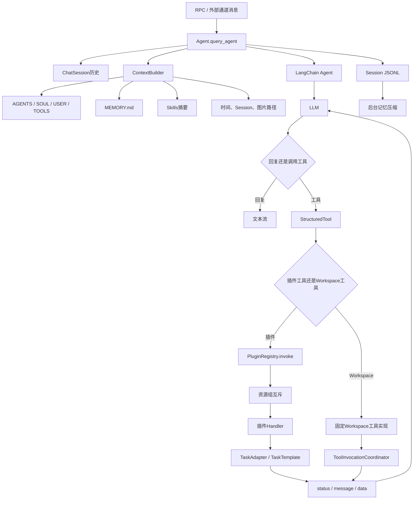
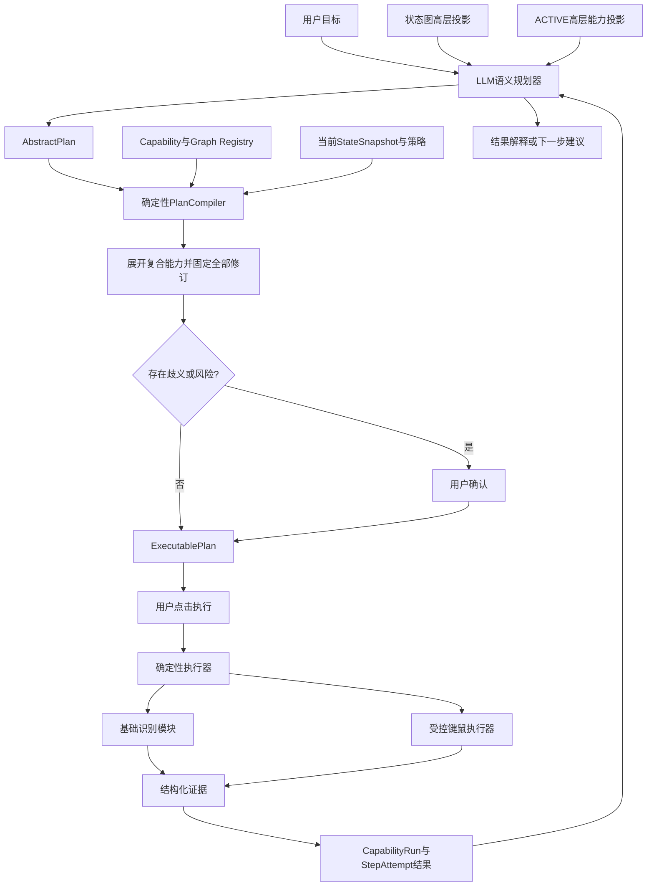

# Whimbox Agent语义层与工具边界

> 文档性质：Whimbox 2.5.4 Agent上下文、Skills、工具调用、记忆及LLM权限边界参考
>
> 分析基线：`2.5.4`，提交 `a10fa3059f7a47cd26ba65a562184c8735562320`
>
> 分析日期：2026-07-18
>
> 关联方案：[总体架构与关键问题分析](01-总体架构与关键问题分析.md)
>
> 运行基础：[Whimbox运行事件与前后端解耦](07-Whimbox运行事件与前后端解耦.md)
>
> 工具与结果边界：[插件能力注册与调用边界](09-Whimbox插件能力注册与调用边界.md) · [错误恢复与执行证据](10-Whimbox错误恢复与执行证据.md)
>
> 后续统一设计：[分层关系网与复合能力子图](../interface_discovery/分层关系网与复合能力子图构想.md) · [瞬态故障与指标隔离](../interface_discovery/游戏瞬态故障判读与置信度隔离构想.md) · [动态控件绑定](../interface_discovery/角色能力切换与动态控件绑定构想.md) · [ALAS 确定性执行参考](../../references/alas/AzurLaneAutoScript可借鉴机制与设计思想.md)

## 1. 核心结论

Whimbox中的Agent不是另一套游戏自动化执行器。它更接近一个自然语言语义入口：

```text
用户自然语言
-> LLM理解意图并选择工具
-> StructuredTool校验部分参数
-> PluginRegistry统一调用
-> 资源锁
-> 已编写的确定性Task
-> 结构化执行结果
-> LLM整理为自然语言回复
```

真正负责截图、页面判断、键鼠输入、停止和任务结果的仍是插件与Task层。LLM主要负责：

- 理解用户想做什么；
- 从已注册能力中选择合适工具；
- 填写工具参数；
- 在工具返回后解释结果；
- 使用聊天历史、长期记忆和Skills补充语义上下文。

这与关系网方案的目标高度一致，但新方案应把边界收得更严格：

> LLM可以提出名称、澄清问题和高层 `AbstractPlan`，但不能决定底层界面状态、动态控件绑定、故障归因或执行结果，也不能绕过确定性编译器和已发布能力操作键鼠。

## 2. Agent总体调用链



Agent是进程级单例，主要状态定义在[`Agent`](../../../../reference_repos/whimbox/whimbox/agent.py#L20)。模型、工具集合、当前活动Session、停止事件、流任务和记忆压缩任务都保存在这个对象中。

## 3. Agent初始化与可用性

[`Agent.start()`](../../../../reference_repos/whimbox/whimbox/agent.py#L72)依次完成：

1. 初始化Agent Workspace；
2. 创建上下文、记忆和聊天Session管理器；
3. 从配置读取provider、model、base URL和API key；
4. 创建LLM客户端；
5. 从插件注册表构建插件工具；
6. 构建Workspace工具；
7. 调用LangChain `create_agent()`；
8. 广播`event.agent.status`。

状态接口返回：

```json
{
  "ready": true,
  "status": "ready",
  "message": ""
}
```

缺少API key时，模型不会创建，但插件工具仍会扫描和构建。这说明“工具已经发现”和“Agent能够对话”是两个不同能力状态。

初始化本身在工作线程和临时事件循环中完成，后续查询则回到RPC主循环，见[`main.py`](../../../../reference_repos/whimbox/whimbox/main.py#L48)。这种跨线程/事件循环创建和使用模型对象的方式需要按provider实测兼容性。

## 4. 每轮上下文由什么组成

[`ContextBuilder.build_system_prompt()`](../../../../reference_repos/whimbox/whimbox/agent_workspace/context.py#L21)按固定顺序组装：

```text
内置身份和行为准则
---
AGENTS.md
SOUL.md
USER.md
TOOLS.md
---
MEMORY.md
---
Skills摘要
```

每轮请求都会重新读取这些文件，因此用户修改Workspace内容后，下一轮即可生效。

### 4.1 Bootstrap文件职责

| 文件 | 适合存放的内容 |
| --- | --- |
| `AGENTS.md` | 总体行为、流程和约束 |
| `SOUL.md` | 助手身份与表达风格 |
| `USER.md` | 用户偏好和相对稳定的信息 |
| `TOOLS.md` | 工具使用说明和约定 |

这些内容进入system prompt，但仍是提示词约束，不是代码级权限控制。

### 4.2 Runtime Context

当前消息还会追加：

- 当前时间；
- `session_id`；
- 当前上传图片的本地路径。

运行时上下文由[`_runtime_context()`](../../../../reference_repos/whimbox/whimbox/agent_workspace/context.py#L95)生成，并明确标记为metadata而非指令。

### 4.3 历史消息

[`build_messages()`](../../../../reference_repos/whimbox/whimbox/agent_workspace/context.py#L42)生成：

```text
system message
-> 尚未压缩的历史消息
-> 当前user message与Runtime Context
```

Agent每轮最多读取64条未压缩消息。历史可以帮助理解代词、连续命令和用户偏好，但不应被用作游戏当前状态的权威来源。

## 5. Skills怎样工作

Skills位于：

```text
configs/agent_workspace/skills/<skill_name>/SKILL.md
```

[`SkillsLoader.list_skills()`](../../../../reference_repos/whimbox/whimbox/agent_workspace/skills.py#L12)扫描每个子目录，只读取：

- 目录名；
- `SKILL.md`路径；
- frontmatter中的第一条`description`。

随后[`build_skills_summary()`](../../../../reference_repos/whimbox/whimbox/agent_workspace/skills.py#L31)把摘要写入system prompt：

```xml
<skills>
  <skill>
    <name>...</name>
    <description>...</description>
    <location>...</location>
  </skill>
</skills>
```

完整Skill不会常驻上下文。模型判断相关后，需要调用`read_file`读取全文，再按其中说明行动。

这种“摘要常驻、全文按需读取”有两个优点：

- 减少system prompt长度；
- 允许新增领域知识而不修改核心代码。

但必须明确：

- loader只解析`description`；
- 不会强制执行Skill声明的权限、依赖或适用范围；
- 模型是否读取、理解和遵守全文仍依赖提示词；
- Skill不能代替执行器中的参数校验和安全策略。

## 6. LLM能看到怎样的工具

插件在manifest中声明：

```text
tool_id
name
description
input_schema
output_schema
permissions
```

Agent适配层遍历注册表，将每个工具转换为LangChain `StructuredTool`，见[`plugin_tools.py`](../../../../reference_repos/whimbox/whimbox/plugin_tools.py#L46)。

模型主要看到：

- 工具展示名称；
- 工具描述；
- 参数名称；
- 参数类型；
- required字段；
- enum与字段description。

### 6.1 参数Schema当前支持程度

[`_json_type_to_py()`](../../../../reference_repos/whimbox/whimbox/plugin_tools.py#L11)支持顶层：

| JSON Schema | Python类型 |
| --- | --- |
| `string` | `str` |
| `integer` | `int` |
| `number` | `float` |
| `boolean` | `bool` |
| `object` | `dict` |
| `array` | `list` |
| `enum` | `Literal[...]` |

当前不会递归实现嵌套对象、数组item、范围、格式、`oneOf`等完整约束。

更重要的是：

- Agent路径会经过这层Pydantic参数模型；
- 前端直接`task.run`调用注册表时，不经过同一Pydantic模型；
- `PluginRegistry.invoke()`不验证输入Schema；
- 注册表也不验证handler输出是否符合`output_schema`。

因此manifest目前更接近工具描述和Agent参数提示，不能视为完整运行时契约。

## 7. 工具调用真正在哪里落地

对于插件工具，Agent构建工具时创建闭包，执行时获取当前Session和stop event，再调用[`PluginRegistry.invoke()`](../../../../reference_repos/whimbox/whimbox/plugins/registry.py#L84)。

```text
LLM tool call
-> StructuredTool参数模型
-> build_tools闭包
-> PluginRegistry.invoke
-> 权限映射到资源组
-> ToolInvocationCoordinator
-> 插件handler
-> 确定性Task
```

[`plugin_tools.py`](../../../../reference_repos/whimbox/whimbox/plugin_tools.py#L63)注入的调用上下文包括：

```json
{
  "session_id": "...",
  "invocation_source": "agent",
  "wait_policy": "wait",
  "stop_event": "threading.Event"
}
```

含`screen`或`input`权限的工具进入`game_runtime`资源组，其他插件工具进入`default`组，见[`registry.py`](../../../../reference_repos/whimbox/whimbox/plugins/registry.py#L127)。因此Agent和前端直接任务最终争用同一个游戏资源，不会因为入口不同而天然同时控制键鼠。

## 8. LLM没有直接获得Python函数或键鼠权限

从正常调用链看，模型只能选择Agent构建时交给LangChain的StructuredTool：一类来自插件Registry，另一类是固定的Workspace工具。它不会直接：

- import任意游戏模块；
- 调用Windows键鼠API；
- 自由执行未注册的Task；
- 绕过插件Registry或Workspace工具封装中的资源协调规则；
- 修改TaskTemplate内部状态。

这是值得保留的能力白名单设计。

但它不是完整安全沙箱：

- 插件入口本身在核心Python进程中执行；
- manifest的`permissions`目前主要用于资源组选择；
- Workspace工具允许Agent读写自己的工作区；
- 图片路径分析可以读取Workspace外的已存在图片；
- RPC控制面没有完整客户端认证。

因此“LLM不能直接访问”与“整个插件系统已安全隔离”是两回事。

## 9. Workspace工具带来的第二类能力

除游戏插件外，Agent还具有六个Workspace工具，构建入口见[`agent_workspace/tools.py`](../../../../reference_repos/whimbox/whimbox/agent_workspace/tools.py#L82)：

| 工具 | 作用 |
| --- | --- |
| `read_file` | 读取Workspace文本 |
| `write_file` | 写入完整文件 |
| `edit_file` | 唯一精确替换 |
| `list_dir` | 列举Workspace目录 |
| `grep_history` | 搜索历史归档 |
| `analyze_image` | 分析本地图片或实时游戏截图 |

文件工具通过路径解析限制在Workspace内，并使用`workspace_fs`资源组串行化。

### 9.1 LLM图片分析的角色

`analyze_image(mode="screenshot")`会先取得`game_runtime`，抓取当前游戏画面并保存临时PNG，再调用视觉模型。模型输出是自然语言分析和少量元数据，见[`Agent._analyze_image()`](../../../../reference_repos/whimbox/whimbox/agent.py#L425)。

它适合：

- 解释未知界面；
- 辅助用户确认；
- 为新状态或节点提出名称；
- 在基础识别失败时给出诊断建议。

它不适合作为基础执行闭环的唯一判定器，因为输出：

- 非确定性；
- 没有稳定的检测器版本契约；
- 没有统一边界框或置信度；
- 受provider和模型能力影响；
- 成本和延迟高于模板、OCR或目标检测。

## 10. Agent查询和工具事件

[`Agent.query_agent()`](../../../../reference_repos/whimbox/whimbox/agent.py#L168)执行：

1. 取得或创建ChatSession；
2. 构建system、history和当前消息；
3. 创建本轮`threading.Event`；
4. 调用LangChain `astream_events()`；
5. 流式处理模型文本和工具事件；
6. 保存用户消息、助手回复和`tools_used`；
7. 按需调度长期记忆压缩。

主要事件如下：

| LangChain事件 | Whimbox动作 |
| --- | --- |
| `on_chat_model_start` | 通知`generating` |
| `on_chat_model_stream` | 累加并推送文本 |
| `on_tool_start` | 标记Session工具运行，记录工具名 |
| `on_tool_end` | 清理工具运行状态，传出结构化结果 |
| `on_tool_error` | 清理状态并通知失败 |
| `on_chain_end` | 必要时提取最终回答 |

工具运行期间，Whimbox抑制模型中间文本片段进入最终回复，避免内部推理式文本与用户可见回答混杂，见[`agent.py`](../../../../reference_repos/whimbox/whimbox/agent.py#L216)。

## 11. 停止边界

每轮Agent查询创建一个`threading.Event`并按`session_id`保存，见[`agent.py`](../../../../reference_repos/whimbox/whimbox/agent.py#L197)。

停止请求会：

```text
设置当前Session stop_event
-> Agent文本流在下一次chunk时观察
-> 工具wrapper把event传给资源锁和任务链
-> 任务循环主动检查并退出
```

[`request_stop()`](../../../../reference_repos/whimbox/whimbox/agent.py#L130)不会直接取消stream task，也不会强杀工具线程。因此：

- 模型长时间无新chunk时，停止可能延迟；
- 工具不检查event时，仍可能继续；
- 只有实际任务返回并完成清理后，才能确认停止完成。

## 12. Chat Session与长期记忆

Whimbox有两种不同Session：

| Session | 保存内容 |
| --- | --- |
| Runtime Session | 窗口、`IDLE/RUNNING`和前端运行关联 |
| Agent ChatSession | 消息、时间、工具使用和压缩位置 |

两者只通过相同`session_id`关联。

ChatSession每轮保存为JSONL；消息模型和持久化位于[`agent_workspace/session.py`](../../../../reference_repos/whimbox/whimbox/agent_workspace/session.py#L228)。长期记忆则由LLM把旧对话压缩到Workspace共享的`MEMORY.md`和`HISTORY.md`，入口见[`memory.py`](../../../../reference_repos/whimbox/whimbox/agent_workspace/memory.py#L28)。

### 12.1 记忆不能作为执行事实库

记忆内容是LLM摘要，存在遗漏、改写和覆盖风险。它适合保存：

- 用户偏好；
- 长期目标；
- 解释性背景；
- 非关键工作习惯。

它不适合保存：

- 当前游戏界面状态；
- 节点是否仍然有效；
- 检测器和模型版本；
- 某次执行是否真实成功；
- 节点运行统计和置信度；
- 权限与安全策略。

这些内容必须进入结构化数据库和证据系统。

## 13. 当前Agent的关键风险

### 13.1 `_active_session_id`是共享字段

每轮查询会覆盖单例字段`_active_session_id`，见[`agent.py`](../../../../reference_repos/whimbox/whimbox/agent.py#L186)。工具闭包真正执行时才读取该字段，见[`agent.py`](../../../../reference_repos/whimbox/whimbox/agent.py#L329)。

两个Session并发查询时，工具可能取得另一个Session的：

- `session_id`；
- stop event；
- Workspace owner标识；
- 任务和日志关联。

更稳妥的设计是为每次Agent run绑定不可变调用上下文，或使用`ContextVar`，不能依赖进程单例中的“当前Session”。

### 13.2 同Session可以重入

第二次同Session查询会覆盖前一轮的stop event和stream task映射。Channel Gateway的busy判断只覆盖工具执行期，纯模型思考阶段可能接受第二条消息。

### 13.3 并行工具状态使用单值记录

LangChain如果在同一轮并行发出多个工具调用，局部`active_tool_calls`会正确计数并继续抑制中间文本，但Session级状态只使用一个集合成员和一个`session_id -> tool_name`映射。任意一个`on_tool_end`或`on_tool_error`都会直接清除这两项，即使另一个工具仍在运行，见[`Agent.query_agent()`](../../../../reference_repos/whimbox/whimbox/agent.py#L204)。

因此`is_tool_running()`、停止响应中的`tool_running`、Channel busy判断和当前工具展示都可能提前变成空闲。新方案应按`agent_run_id + tool_call_id`记录活动调用集合，再由集合是否为空派生Session状态。

### 13.4 长期记忆跨Session共享

压缩锁按Session建立，但`MEMORY.md`和`HISTORY.md`是Workspace全局文件。不同Session可能并发基于旧内容生成更新并覆盖写入。

### 13.5 工具热重载未重建Agent图

[`reload_tools()`](../../../../reference_repos/whimbox/whimbox/agent.py#L318)替换`self.tools`，但没有重新调用`create_agent()`。现有LangChain图是否采用新工具集合需要运行验证。

### 13.6 多模态能力判断恒为真

[`supports_multimodal_input()`](../../../../reference_repos/whimbox/whimbox/agent.py#L483)当前无条件返回`True`。实际模型不支持图片时，错误只能推迟到调用阶段出现。

### 13.7 Skill和提示词不是权限系统

模型可能误读、漏读或忽略Skill；任何“必须”规则若只存在Markdown中，都不能视为强制执行。

## 14. 对关系网方案的LLM职责划分

关系网方案建议把LLM明确放在语义层和规划建议层。

### 14.1 LLM适合承担

| 职责 | 输出 |
| --- | --- |
| 状态、转换与能力命名 | 人类可读名称、别名和说明 |
| 状态解释 | 对截图或检测结果的语言说明 |
| 疑问生成 | 需要用户确认的歧义点 |
| 意图理解 | 用户目标到候选能力集合 |
| 高层计划组合 | 基于已发布能力投影生成 `AbstractPlan` |
| 结果解释 | 把结构化成功、失败和证据转成人类语言 |
| 未知状态诊断 | 提出可能类别和下一项采集建议 |

### 14.2 LLM不应承担

| 禁止职责 | 原因 |
| --- | --- |
| 直接发送任意键鼠事件 | 绕过节点、资源锁和审计 |
| 仅凭语言判断当前页面 | 缺少确定性视觉证据 |
| 自行声明Capability成功 | 执行成功必须由后置条件验证 |
| 修改已激活节点定义 | 会让同一版本行为漂移 |
| 将候选节点自动提升为ACTIVE | 验证和发布必须由确定性流程或用户批准完成 |
| 绕过用户点击直接执行计划 | 超出“生成计划、用户确认后执行”的边界 |
| 根据记忆推断当前实时状态 | 记忆可能陈旧和不准确 |
| 选择未获授权的高风险能力 | 需要独立策略和权限系统 |
| 选择具体GraphModule、Adapter或底层修订 | 这是确定性编译器职责 |
| 决定动态控件绑定或`control_schema_epoch` | 必须由机器上下文和视觉证据确定 |
| 判断输入究竟投递给哪个窗口 | 必须由FocusLease、epoch和视觉响应验证 |
| 决定 `FailureAttribution/SampleDisposition` | 故障归因和指标更新属于证据处理层 |

## 15. 推荐的新方案调用链



关键点是：LLM输出的只是 `AbstractPlan`，不能选择底层实现或直接交给键鼠层。PlanCompiler 根据 `TransitionDefinition` 和 `CapabilitySpec` 延迟展开复合能力，固定主图、能力、GraphModule、Adapter、检测器、连续校准和应用Profile修订后，才生成 `ExecutablePlan`。

## 16. AbstractPlan建议格式

LLM只能引用系统提供的稳定高层能力ID，不固定底层修订：

```json
{
  "goal": "打开背包并查看材料",
  "target_facts": {"ui.page": "INVENTORY"},
  "capabilities": [
    {
      "capability_id": "nikki.open_inventory",
      "parameters": {},
      "expected_effect": {"ui.page": "INVENTORY"},
      "reason": "该已发布高层能力可以满足目标页面"
    }
  ],
  "questions": [],
  "assumptions": ["当前角色处于可打开菜单的正常游戏状态"],
  "risk_level": "low"
}
```

确定性编译器必须：

- 确认能力存在且发布状态为 `ACTIVE`；
- 根据当前 `StateSnapshot` 选择有效的 `TransitionDefinition`；
- 根据 `kind=atomic/composite/continuous` 解析实现；
- 为复合能力选择GraphModule与Adapter并检查定义依赖DAG；
- 只允许GraphModule内部具有进度、次数和超时边界的受控循环；
- 参数符合完整Schema；
- 固定状态图、转换、能力、GraphModule、Adapter、检测器、连续校准和应用Profile修订；
- 用户权限满足；
- 风险等级是否需要确认；
- 计划没有越过禁止状态，且资源契约包含正确的窗口控制与物理输入要求；
- 运行时会重新验证 `FocusLease/focus_epoch` 和 `control_schema_epoch`。

编译输出是带完整版本清单、调用深度、恢复预算和证据策略的不可变 `ExecutablePlan`。用户批准的是其高层投影和风险；执行层保存完整展开调用树。

## 17. LLM能力投影与执行结果

暴露给LLM的每个能力至少应包含：

```text
capability_id
display_name
description
release_status: ACTIVE
kind: atomic / composite / continuous
input_schema
precondition_summary
effect_summary
risk_level
estimated_duration
supports_cancel
```

LLM通常不需要看到 `implementation_ref`、GraphModule内部节点、Adapter、检测器阈值、资源锁细节和连续控制周期。

执行结果统一为：

```json
{
  "outcome": "SUCCEEDED",
  "reason_code": "POSTCONDITION_CONFIRMED",
  "failure_attribution": null,
  "sample_disposition": "VALID_SUCCESS",
  "capability_run_id": "caprun_...",
  "attempt_id": "attempt_...",
  "actual_from_state": "state.gameplay",
  "actual_to_state": "state.inventory",
  "evidence_ids": ["evidence_before", "evidence_after"],
  "detector_versions": {
    "inventory_state": "2.1.0"
  },
  "message": "背包页面已验证"
}
```

统一Outcome只有 `SUCCEEDED/FAILED/UNKNOWN/CANCELLED/BLOCKED`。资源忙、版本不兼容、控件当前不可用等差异使用 `BLOCKED + reason_code`；LLM只能根据结构化结果解释，不能把空响应、无异常、“已经发送按键”或恢复成功推断为原能力成功。

## 18. Skills在新方案中的位置

Skills适合描述：

- 某类游戏界面的语义；
- 用户沟通方式；
- 计划组织规则；
- 何时提出澄清问题；
- 常见失败的解释方法；
- 如何阅读节点和证据。

Skills不应负责：

- 注册底层能力；
- 授予输入权限；
- 改变节点版本；
- 修改状态机；
- 决定任务终态；
- 绕过用户确认。

每个Skill建议记录版本和适用的Planner版本，但真正的权限检查仍由代码执行。

## 19. 记忆、关系网和运行证据应分开

建议划分为：

| 数据层 | 内容 | 是否允许LLM直接覆盖 |
| --- | --- | --- |
| 用户记忆 | 偏好、称呼、长期目标 | 可提出更新，最好审计 |
| 机器定义 | StateDefinition、TransitionDefinition、CapabilitySpec、GraphModule、Adapter和版本 | 不允许 |
| 运行记录 | PlanRun、CapabilityRun、StepAttempt、GraphCallRun、RecoveryRun | 不允许 |
| 视觉证据 | 帧、检测结果、模型版本 | 不允许 |
| 动态上下文 | FocusLease、`focus_epoch`、ControlContext和`control_schema_epoch` | 不允许 |
| Skill | 语义与工作流程指导 | 受版本管理的人工内容 |
| 对话历史 | 用户和Agent消息 | 由Session服务追加 |

LLM压缩记忆不能修改关系网事实，也不能覆盖运行证据。

## 20. 用户疑问与确认机制

当LLM发现以下情况时，应生成问题而不是自行猜测：

- 两个状态候选接近；
- 新状态、转换或能力名称不明确；
- 用户操作意图有多种解释；
- 计划包含不可逆或高风险操作；
- 当前状态不在关系网中；
- 所需能力没有 `ACTIVE` 修订，或当前只存在 `DEGRADED` 实现；
- 控件图标缺失、变灰或动态绑定冲突，需要用户提供语义或现场信息；
- 结构化故障归因为 `UNKNOWN`，需要用户补充事实；
- 参数无法从用户目标可靠推断。

问题输出应引用具体证据和选项：

```json
{
  "question_id": "q_...",
  "reason": "OCR与图标证据冲突",
  "evidence_ids": ["e1", "e2"],
  "choices": [
    {"id": "inventory", "label": "背包页面"},
    {"id": "wardrobe", "label": "换装页面"}
  ],
  "blocks_execution": true
}
```

用户确认可以补充语义标签或一次性选择，但不能直接修改 `FailureAttribution/SampleDisposition`，也不能把未经测试的能力提升为 `ACTIVE`。

## 21. 分阶段实现建议

### 阶段一：无LLM执行链

先完成：

```text
基础检测器
-> StateDefinition与TransitionDefinition
-> 手工定义atomic CapabilitySpec
-> 前置/后置验证
-> PlanRun/CapabilityRun/StepAttempt记录
```

保证不接入LLM也能稳定执行和验证一个基础能力，并能输出五种统一Outcome。

### 阶段二：只让LLM命名和提问

LLM读取状态证据，输出：

- 建议名称；
- 候选语义标签；
- 疑问；
- 需要追加采集的建议。

不允许调用键鼠能力。

### 阶段三：AbstractPlan生成与编译

LLM只能从 `ACTIVE` 高层能力投影中组合 `AbstractPlan`；PlanCompiler选择Transition、展开GraphModule、固定全部修订并生成 `ExecutablePlan`，用户确认后才可执行。

### 阶段四：结果解释和异常协助

基础执行器返回`UNKNOWN`时，LLM可以分析截图、日志和关系网邻居，提出恢复或询问用户，但仍不能伪造成功状态。

## 22. 优先验证清单

| 测试 | 需要证明的结果 |
| --- | --- |
| 两个Session同时请求规划 | 工具和上下文不串Session |
| 同Session连续发送两条消息 | 第二轮排队或明确拒绝 |
| LLM提供不存在的能力ID | 编译器拒绝，不进入执行器 |
| LLM尝试指定底层修订 | Schema拒绝或忽略，由编译器固定版本 |
| 复合能力依赖形成循环 | 编译器拒绝；内部受控循环按预算校验 |
| 工具返回`FAILED` | LLM不得描述为完成 |
| 工具返回`UNKNOWN` | Agent展示证据并询问或给出恢复建议 |
| 工具返回`BLOCKED` | Agent说明当前条件，不描述为能力定义失败 |
| RecoveryRun成功 | Agent不能把原StepAttempt改述为成功 |
| `focus_epoch`或`control_schema_epoch`变化 | 执行器使旧绑定失效，LLM不能猜测新输入 |
| Skill要求绕过权限 | 代码策略拒绝 |
| 关系网运行中更新 | 当前Plan继续使用固定revision或安全终止 |
| 多模态模型不可用 | 基础识别链仍可工作 |
| Agent服务完全关闭 | 用户仍可手工选择并执行已验证Capability |

## 23. 结论

Whimbox的Agent边界可以概括为：

```text
上下文和Skills帮助LLM理解用户
-> manifest与StructuredTool限制可选能力和参数
-> PluginRegistry统一进入资源锁和确定性Task
-> Task返回结构化结果
-> Agent只负责解释和继续对话
```

值得关系网方案保留的部分包括：

- Agent不重复实现游戏自动化；
- 模型只能调用注册工具；
- 工具参数使用Schema描述；
- Agent工具和直接任务复用同一注册表；
- Skills采用渐进加载；
- Session、停止事件和运行事件贯穿工具链。

需要进一步收紧的部分包括：

- 每次Agent run绑定独立上下文，消除共享活动Session；
- Schema在所有入口统一执行，并验证输出；
- 权限由代码策略强制，不能依赖Skill和提示词；
- LLM只输出 `AbstractPlan`，执行前必须编译成固定版本的 `ExecutablePlan`；
- 关系网、版本、运行事实和证据不进入可覆盖的自然语言记忆；
- 基础视觉检测和后置状态决定执行结果，证据层决定故障归因和样本处置，LLM只处理语义和未知情况；
- atomic/composite/continuous三类能力使用同一调用边界，GraphModule、Adapter、FocusLease和动态绑定不暴露为LLM自由选择项；
- ALAS只作为逐步验证、看门狗和错误现场的非规范经验来源，不改变以上权限边界。

最终边界应保持为：

> LLM负责理解、命名、提问、组合高层能力和解释；状态图负责限定可达路径；PlanCompiler负责展开并固定实现；检测器负责观察；执行器负责操作；验证器和证据层负责Outcome、故障归因与样本处置；用户负责批准计划和高风险选择。
