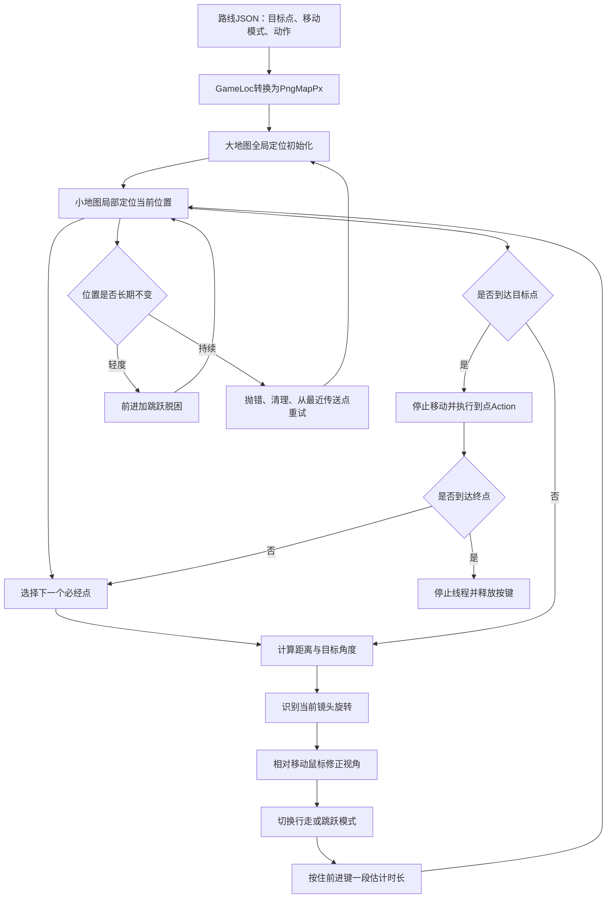

# Whimbox 自动跑图视觉闭环

> 文档性质：Whimbox 2.5.4 地图定位、路线点、视角控制、移动反馈、卡住恢复与连续执行参考
>
> 分析基线：`2.5.4`，提交 `a10fa3059f7a47cd26ba65a562184c8735562320`
>
> 分析日期：2026-07-18
>
> 关联方案：[总体架构与关键问题分析](01-总体架构与关键问题分析.md)
>
> 图像基础：[Whimbox 图像处理参考](03-Whimbox图像处理参考.md)
>
> 键鼠基础：[Whimbox 键鼠执行](05-Whimbox键鼠执行.md)
>
> 资产与恢复：[脚本资源与版本管理](08-Whimbox脚本资源与版本管理.md) · [错误恢复与执行证据](10-Whimbox错误恢复与执行证据.md)
>
> 连续控制构想：[鼠标滚轮缩放与视口控制构想](../interface_discovery/鼠标滚轮缩放与视口控制构想.md) · [Whimbox鼠标拖拽与镜头旋转机制](../../references/whimbox/interaction_control/Whimbox鼠标拖拽与镜头旋转机制.md)
>
> ALAS对照：[AzurLaneAutoScript可借鉴机制与设计思想](../../references/alas/AzurLaneAutoScript可借鉴机制与设计思想.md)

## 1. 核心结论

Whimbox 自动跑图不是按照录制时长回放 `W/A/S/D` 的键鼠宏，也没有调用游戏内部导航网格或寻路API。

它采用的是视觉反馈闭环：

```text
截图定位当前位置
-> 读取下一个路线目标点
-> 计算目标方向
-> 从小地图估计镜头旋转
-> 相对移动鼠标修正视角
-> 控制前进和跳跃
-> 再次截图定位
-> 根据新位置继续修正
```

路线脚本记录的是目标点、移动模式和到点动作；实际键鼠时长由运行时位置反馈和移动控制器决定。

对关系网方案而言，这一模块最有价值的不是地图模板本身，而是以下思想：

> 连续动作不能只依赖一次状态判断，而要把长动作拆成短控制周期，在每一周期重新观测、估计误差并修正。

## 2. 分析范围

本文覆盖：

- 地图聚合与传送：[`map/map.py`](../../../../reference_repos/whimbox/whimbox/map/map.py#L23)；
- 坐标转换：[`map/convert.py`](../../../../reference_repos/whimbox/whimbox/map/convert.py#L7)；
- 地图资产与参数：[`map/detection/map_assets.py`](../../../../reference_repos/whimbox/whimbox/map/detection/map_assets.py#L8)、[`cvars.py`](../../../../reference_repos/whimbox/whimbox/map/detection/cvars.py#L1)；
- 小地图定位：[`MiniMap`](../../../../reference_repos/whimbox/whimbox/map/detection/minimap.py#L11)；
- 大地图定位：[`BigMap`](../../../../reference_repos/whimbox/whimbox/map/detection/bigmap.py#L11)；
- 视角与移动：[`view.py`](../../../../reference_repos/whimbox/whimbox/view_and_move/view.py#L9)、[`move.py`](../../../../reference_repos/whimbox/whimbox/view_and_move/move.py#L34)；
- 自动跑图主任务：[`AutoPathTask`](../../../../reference_repos/whimbox/whimbox/task/navigation_task/auto_path_task.py#L42)；
- 路线录制与优化：[`RecordPathTask`](../../../../reference_repos/whimbox/whimbox/task/navigation_task/record_path_task.py#L22)、[`rdp.py`](../../../../reference_repos/whimbox/whimbox/task/navigation_task/rdp.py#L54)；
- 路线数据结构：[`scripts_manager.py`](../../../../reference_repos/whimbox/whimbox/common/scripts_manager.py#L17)。

本文不展开每个采集、钓鱼、清洁、战斗等到点业务动作的细节。

## 3. 总体视觉控制闭环



闭环中的观察、决策和执行分别由不同模块负责：

| 层次 | 主要模块 | 输出或动作 |
| --- | --- | --- |
| 全局定位 | `BigMap`、`Map.reinit_smallmap()` | 当前大地图中心和初始位置 |
| 局部跟踪 | `MiniMap.update_position()` | 当前地图像素坐标 |
| 姿态估计 | `update_direction()`、`update_rotation()` | 人物方向和镜头方向 |
| 目标计算 | `AutoPathTask`、角度工具 | 距离、目标角、下一必经点 |
| 执行控制 | `MoveController`、`JumpController`、`view.py` | 鼠标、前进键、跳跃键 |
| 恢复与清理 | `AutoPathTask`、任务框架 | 重定位、重试、线程停止、按键释放 |

## 4. 路线脚本记录什么

### 4.1 路线不是输入事件序列

路线模型由 [`PathInfo`](../../../../reference_repos/whimbox/whimbox/common/scripts_manager.py#L17)、[`PathPoint`](../../../../reference_repos/whimbox/whimbox/common/scripts_manager.py#L25) 和 `PathRecord` 组成。

每个点主要包含：

```text
id
move_mode
point_type
action
action_params
position
```

其中：

- `position`是游戏世界位置，而不是屏幕鼠标坐标；
- `move_mode`描述该段需要行走或跳跃；
- `point_type`区分必经点和途径点；
- `action`描述到点后执行的业务动作；
- `action_params`保存动作参数。

路线没有直接保存：

```text
W键需要按多少秒
鼠标向右移动多少次
每一帧的镜头角度
录制时的真实输入时序
```

这些内容由运行时根据视觉反馈重新计算。

### 4.2 必经点与途径点

`point_type=TARGET`的必经点会成为自动控制目标；`PASS`途径点主要保留录制轨迹形状和后续优化信息。

[`AutoPathTask._update_next_target_point()`](../../../../reference_repos/whimbox/whimbox/task/navigation_task/auto_path_task.py#L107) 只选择后续必经点，因此路线并不是要求角色精确经过录制产生的每个采样点。

这种设计减少了定位噪声和控制频率，但必经点过稀时可能跨过弯道或障碍。

## 5. 四类坐标

Whimbox 跑图同时使用多套坐标：

| 坐标系 | 含义 | 主要用途 |
| --- | --- | --- |
| `GameLoc` | 游戏原生世界坐标 | 路线JSON持久化 |
| `PngMapPx` | 全尺寸地图PNG像素坐标 | 运行时位置、距离和目标点 |
| 缩放地图像素 | 0.5x或0.125x地图坐标 | OpenCV模板匹配内部 |
| `LogicalScreenPx` | 宽度1920的屏幕逻辑坐标 | 大地图拖动、点击和鼠标控制 |

[`convert_GameLoc_to_PngMapPx()`](../../../../reference_repos/whimbox/whimbox/map/convert.py#L19) 使用地图专属偏移和固定比例，把路线世界坐标转换为运行时地图像素坐标。

路线录制结束时从 `PngMapPx` 转回 `GameLoc` 保存；执行时再按路线中的地图名称转换回来。

这一做法的参考价值是：

> 持久化坐标、视觉算法内部坐标和实际屏幕坐标必须显式区分，不能让同一个二维数组在不同模块里隐含不同含义。

新系统的坐标对象至少应携带 `space`、`frame_id`、`transform_version` 和单位。

## 6. 大地图全局定位

### 6.1 为什么需要全局定位

小地图定位只在上一次位置附近搜索，因此启动、传送或定位漂移后必须先得到一个全局近似位置。

[`Map.reinit_smallmap()`](../../../../reference_repos/whimbox/whimbox/map/map.py#L120) 的流程是：

```text
进入大地图页面
-> OCR当前区域名称
-> 区域名称映射为地图资产名称
-> 把大地图缩放到固定最大比例
-> 截取当前大地图
-> 在整张地图模板上全局匹配
-> 得到当前大地图中心PngMapPx
-> 初始化小地图局部定位中心
```

### 6.2 大地图匹配

[`BigMap._predict_bigmap()`](../../../../reference_repos/whimbox/whimbox/map/detection/bigmap.py#L22) 会：

1. 把截图转为亮度图；
2. 按地图比例缩小；
3. 与整张0.125倍地图执行模板匹配；
4. 使用地图mask排除不可匹配区域；
5. 对相关矩阵做局部峰增强；
6. 在峰值附近插值提高坐标精度；
7. 换算回全尺寸地图像素坐标。

输出包括：

```text
bigmap_position
bigmap_similarity
bigmap_similarity_local
```

当前相似度主要用于记录，没有形成统一的最低接受门槛。这意味着算法即使得到较差峰值，也可能继续初始化小地图。

### 6.3 区域名称风险

[`trans_region_name_to_map_name()`](../../../../reference_repos/whimbox/whimbox/map/detection/utils.py#L6) 会把已知OCR区域映射到地图资产；对未知文本当前默认返回 `home`。

因此OCR失败或游戏新增区域时，系统可能加载错误地图，而不是明确输出 `UNKNOWN_MAP`。

新系统应把未知区域作为显式失败状态，禁止静默使用默认地图继续控制角色。

## 7. 小地图局部位置跟踪

### 7.1 输入和依赖

[`MiniMap._predict_position()`](../../../../reference_repos/whimbox/whimbox/map/detection/minimap.py#L43) 依赖：

- 当前完整游戏截图；
- 固定小地图区域；
- 当前地图的灰度资产；
- 上一次接受的位置；
- 地图缩放比例；
- 排除中心方向箭头的圆环mask。

它不是每一帧都在整张地图上搜索，而是以上次位置为中心裁出局部搜索区域。

### 7.2 定位算法

```text
裁剪固定小地图区域
-> 转亮度图并按地图比例缩放
-> 用圆环mask排除中心人物箭头
-> 从全图资产裁剪上次位置附近的搜索窗口
-> masked template matching
-> 高斯差分突出局部峰
-> 峰值邻域插值
-> 换算回PngMapPx
```

输出保存在：

```text
position
position_similarity
position_similarity_local
```

### 7.3 跳变过滤

[`MiniMap.verify_position()`](../../../../reference_repos/whimbox/whimbox/map/detection/minimap.py#L131) 根据上一次有效位置经过的时间估算最大允许移动距离：

```text
允许距离 < MOVE_SPEED * dt + 1
```

不合理跳变会被拒绝并保留旧位置；但时间间隔超过20秒时会无条件接受一次候选，用于长暂停后的恢复。

这种速度门槛是一种轻量状态连续性约束，比只使用模板最高分更稳健；同时也可能在长暂停后的第一帧接受错误峰值。

### 7.4 缓存语义

[`Map._upd_smallmap()`](../../../../reference_repos/whimbox/whimbox/map/map.py#L47) 只有检测到游戏主界面时才从新截图更新小地图位置。

不在主界面或显式 `use_cache=True` 时，调用方可能得到旧位置。因此位置值本身不能证明它来自当前帧。

新系统应为位置观测附加：

```text
frame_id
capture_time
update_time
is_cached
source_detector
raw_score
accepted_or_rejected
```

## 8. 人物方向与镜头旋转

### 8.1 两种角度不是同一对象

Whimbox分别识别：

- `direction`：角色中心方向箭头指向；
- `rotation`：镜头在地图上的朝向。

自动跑图主要根据 `rotation`修正镜头，而不是直接使用人物箭头方向。

### 8.2 人物方向

[`MiniMap.update_direction()`](../../../../reference_repos/whimbox/whimbox/map/detection/minimap.py#L145) 裁剪小地图中心箭头，使用目标颜色相似度和预生成旋转图集匹配方向。

输出：

```text
direction
direction_similarity
```

### 8.3 镜头旋转

镜头视野在小地图上表现为半透明扇区。系统先根据当前位置从静态地图裁出背景，再与当前小地图对齐和相减，突出视野扇区。

[`MiniMap._predict_rotation()`](../../../../reference_repos/whimbox/whimbox/map/detection/minimap.py#L265) 把圆形区域展开成按角度排列的矩形，寻找视野扇区左右边缘峰值，最终输出：

```text
rotation
rotation_confidence
```

当前 `rotation_confidence`主要记录日志，没有作为自动转向的硬拒绝条件。低置信角度仍可能驱动鼠标移动。

这对新系统的启示是：估计值和置信度必须一起进入控制器；低于阈值时应重新采样、减小动作、重定位或停止，而不是继续执行完整控制量。

## 9. 视角控制

[`change_view_to_angle()`](../../../../reference_repos/whimbox/whimbox/view_and_move/view.py#L69) 的基本流程是：

```text
安全采样当前rotation
-> 计算目标角与当前角的最短差值
-> 根据校准比例换算成水平鼠标像素
-> 相对移动鼠标
```

该函数内部没有移动后的截图或角度验证；后置效果要等下一次外层控制周期重新定位和取角度时才能观察。因此它是“采样后开环发出一次修正，外层循环再闭环”，不是单次函数内部的即时闭环。

角度计算使用 [`calculate_posi2degree()`](../../../../reference_repos/whimbox/whimbox/view_and_move/utils.py#L13) 和 `calculate_delta_angle()`，避免跨越正负180度时选择错误旋转方向。

[`calibrate_view_rotation_ratio()`](../../../../reference_repos/whimbox/whimbox/view_and_move/view.py#L51) 通过实际移动鼠标和重新识别镜头角度，估计“角度变化对应多少鼠标像素”。

这是一种在线系统标定：它承认不同游戏设置、灵敏度和分辨率下，同一鼠标位移不一定产生相同角度变化。

但当前标定失败主要依赖停止标志退出，没有统一最大尝试次数和失败结果。

## 10. 移动与跳跃控制

### 10.1 前进控制器

[`MoveController`](../../../../reference_repos/whimbox/whimbox/view_and_move/move.py#L105) 不直接负责地图识别。它接收当前点、目标点和控制循环时间，估计本轮应该按住前进键多久。

它维护近期移动速度和循环耗时估计，用于减少接近目标时的过冲：

```text
距离较远 -> 允许前进更久
距离变近 -> 缩短前进保持时间
到达目标 -> 释放前进键
```

### 10.2 跳跃状态机

[`JumpController`](../../../../reference_repos/whimbox/whimbox/view_and_move/move.py#L34) 使用计时器和内部状态管理普通跳跃、二段跳准备、二段跳和停止。

`AutoPathTask`根据路线点的 `move_mode`切换行走或跳跃模式，见 [`inner_step_control_move()`](../../../../reference_repos/whimbox/whimbox/task/navigation_task/auto_path_task.py#L509)。

这些控制器运行在线程中，主跑图任务持续负责位置更新、目标选择和模式切换。

### 10.3 为什么需要短周期反馈

如果只按固定时长前进，会受到以下因素影响：

- 地形和碰撞；
- 游戏帧率；
- 动画状态；
- 跳跃与落地；
- 网络或加载停顿；
- 摄像机方向误差；
- 角色速度变化。

Whimbox通过短周期重新定位降低这些不确定性。新方案中的长按、拖拽、连续战斗或角色移动也应采用相同思想，而不是把它们当成一个不可观察的长Step。

## 11. AutoPathTask每轮执行顺序

[`AutoPathTask.step1()`](../../../../reference_repos/whimbox/whimbox/task/navigation_task/auto_path_task.py#L201) 的主循环可以概括为：

```text
更新当前位置和目标点
-> 判断到点、越点或需要传送
-> 到点时执行Action并选择下一必经点
-> 未到点时计算并修正视角
-> 根据路线切换行走或跳跃
-> 启动本轮前进
-> 检查页面中断
-> 进入下一控制周期
```

当前位置更新见 [`inner_step_update_target()`](../../../../reference_repos/whimbox/whimbox/task/navigation_task/auto_path_task.py#L276)，视角修正见 [`inner_step_change_view()`](../../../../reference_repos/whimbox/whimbox/task/navigation_task/auto_path_task.py#L495)，移动控制见 [`inner_step_control_move()`](../../../../reference_repos/whimbox/whimbox/task/navigation_task/auto_path_task.py#L509)。

每轮都使用新位置重新计算，而不是沿用录制时的控制输入。

## 12. 到点动作与连续控制分离

到达必经点后，`AutoPathTask`停止移动，再根据 `PathPoint.action`分派动作或子任务。

典型动作包括：

- 采集；
- 巡游；
- 化万相；
- 捕虫、清洁、钓鱼；
- 键盘点击；
- 执行宏；
- 等待；
- 传送。

地图控制器只负责“到达目标点”，具体业务动作由Action或Task处理。

这种分层值得参考：

```text
连续导航能力
-> 到达已验证位置
-> 暂停导航输入
-> 调用离散业务Step
-> 根据业务结果决定继续、停止或恢复
```

但当前各动作的成功标准和 `test_mode`覆盖并不统一，不能把所有到点动作视为同样可靠。

## 13. 大地图传送闭环

[`Map.bigmap_tp()`](../../../../reference_repos/whimbox/whimbox/map/map.py#L333) 不是一次固定点击，而是组合：

```text
进入大地图
-> 确认区域和地图资产
-> 定位当前大地图中心
-> 必要时拖动地图
-> 找到目标附近传送点
-> 点击传送点
-> OCR判断“传送”或“追踪”
-> 执行对应按钮
-> 等待回到游戏主界面
-> 重新初始化位置
```

地图拖动由 [`Map._move_bigmap()`](../../../../reference_repos/whimbox/whimbox/map/map.py#L201) 根据目标点与当前大地图中心的差值计算。

该链证明连续系统中可以组合多种反馈：大地图模板定位、OCR文字、按钮图标和主界面状态共同决定传送是否完成。

当前部分等待和递归路径缺少统一总超时，失败时可能长时间停留或递归过深。

## 14. 卡住检测与恢复

[`AutoPathTask.check_stuck()`](../../../../reference_repos/whimbox/whimbox/task/navigation_task/auto_path_task.py#L224) 根据当前位置长期不变化判断卡住：

```text
短时间位置不变
-> 继续观察

约5秒未移动
-> 尝试一次前进加跳跃脱困

持续约15秒未移动
-> 抛出异常
```

异常进入任务框架后：

```text
进入AutoPathTask.handle_finally
-> 先调用父类handle_finally尝试回到主界面
-> 再调用clear_all重置到最近传送点索引
-> 停止并等待跳过、移动和跳跃线程
-> 框架决定是否进行一次完整自动重试
-> 重试时重新初始化地图并从该索引继续
```

`last_teleport_point_id`提供了一个粗粒度恢复检查点，避免失败后必须从整条路线起点重新执行。

这一设计可以映射到关系网执行：

```text
PlanRun
-> 每完成一个高成本安全Step记录checkpoint
-> 后续Step失败
-> 清理真实输入
-> 重新识别当前状态
-> 只在状态兼容时从checkpoint恢复
```

需要注意，Whimbox重试主要依赖预定逻辑和最近传送点，不会重新规划任意路线。

## 15. 线程与按键清理

自动跑图会创建移动、跳跃和跳过按钮监控线程。

[`AutoPathTask.handle_finally()`](../../../../reference_repos/whimbox/whimbox/task/navigation_task/auto_path_task.py#L564) 和 [`clear_all()`](../../../../reference_repos/whimbox/whimbox/task/navigation_task/auto_path_task.py#L526) 负责：

- 把`curr_target_point_id`恢复到最近传送点索引；
- 清空当前位置、目标点和本轮移动状态；
- 停止并等待跳过按钮监控线程；
- 通过`stop_move()`显式释放前进键，并通过`change_to_walk()`尝试结束跳跃状态；
- 停止并等待移动、跳跃控制线程。

连续控制最危险的失败不是返回值错误，而是任务结束后真实输入仍然保持按下。因此任何新执行器都必须把“释放所有输入”作为不可跳过的终结动作。

当前顺序尤其值得注意：`handle_finally()`先尝试回主界面，随后才执行`clear_all()`。回主界面期间移动或跳跃线程仍可能活动；而且跳跃释放依赖当前画面模式和控制器内部状态，并不是无条件`key_up`。这构成明确的输入竞态窗口，需要通过故障注入验证半初始化、异常和手动停止场景。

## 16. 路线录制与优化

[`RecordPathTask`](../../../../reference_repos/whimbox/whimbox/task/navigation_task/record_path_task.py#L22) 在用户真实移动时持续从小地图取得当前位置，并生成途径点。

用户按指定热键时，录制器把当前位置标记为必经点，并可附加动作信息。

录制主循环只在当前位置与上一个已记录点距离达到`min_gap`时追加点；距离过近的观测在采样阶段就不会进入列表，见[`RecordPathTask.step2()`](../../../../reference_repos/whimbox/whimbox/task/navigation_task/record_path_task.py#L79)。

保存前[`optimize_path()`](../../../../reference_repos/whimbox/whimbox/task/navigation_task/record_path_task.py#L141)不会删除点或重新编号。它实际会：

- 修正二段跳序列中偶发的一帧`WALK`移动模式；
- 在相邻必经点之间用RDP式递归查找偏离直线较大的已有`PASS`点，并把这些点提升为`TARGET`，见[`rdp_optimize()`](../../../../reference_repos/whimbox/whimbox/task/navigation_task/rdp.py#L54)；
- 调整“步行转跳跃”附近两个点的必经/途经类型和移动模式。

优化完成后，`save_path()`才逐点把地图像素坐标转换为游戏世界坐标并序列化。现有RDP函数不压缩列表，它只改变点类型。

这种“按距离门槛记录观测，再离线把大转折点提升为控制目标”的方法与用户演示收束小Step有相似之处。

但Whimbox路线优化只处理几何点，不处理：

- 前后界面状态；
- 输入片段语义；
- 多次演示聚类；
- 条件分支；
- 成功概率；
- 节点版本。

因此只能参考其采样、关键点保留和回放验证思路，不能直接作为关系图Step收束算法。

## 17. 当前输出和缺失证据

### 17.1 已有运行状态

自动跑图内部能够观察：

```text
curr_position
last_position
target_point
target_dist
position_similarity
position_similarity_local
rotation
rotation_confidence
need_move_mode
curr_target_point_id
last_teleport_point_id
材料计数
线程状态
任务结果
```

### 17.2 尚未形成统一证据

这些值分散在地图对象、控制器和任务对象中，没有统一绑定：

```text
control_cycle_id
frame_id
输入开始和结束时间
本轮目标状态
候选位置
候选被接受或拒绝的原因
实际鼠标位移
实际按键保持时间
恢复动作
模型与资产版本
```

因此当前日志可以辅助调试，但不足以完整离线重放某一控制周期为什么做出某次输入。

新系统可把每轮闭环记录为：

```text
ControlCycle
  observation_before
  estimated_state
  target_state
  error_vector
  chosen_action
  action_parameters
  observation_after
  acceptance_result
  recovery_decision
```

## 18. 可以借鉴的设计

- 路线保存目标点而不是原始按键时序；
- 全局定位负责初始化，局部定位负责高频跟踪；
- 位置候选要经过速度与历史连续性检查；
- 人物方向和镜头方向使用不同状态变量；
- 鼠标像素与角度关系需要在线校准；
- 接近目标时缩短控制动作，减少过冲；
- 连续移动与离散到点动作分层；
- 到点后暂停运动输入再执行子任务；
- 卡住恢复分为轻度脱困和任务级重试；
- 高成本阶段保留恢复检查点；
- 正常、异常和停止路径都必须释放按键；
- 按距离门槛采样路线点，并把偏离直线较大的途径点提升为必经点。

## 19. 不应直接照搬的部分

- 未知区域默认使用 `home`地图，而不是显式未知；
- 大地图和部分小地图分数没有统一拒绝阈值；
- 长暂停后首次位置候选可能被无条件接受；
- 位置值可能来自缓存，但没有帧身份和过期标记；
- 镜头置信度不直接阻止低可信转向；
- 地图中心、半径、颜色和比例包含大量经验常量；
- 视角校准缺少统一最大重试与结构化失败；
- 大地图拖动递归和部分传送等待缺少总超时；
- 页面中断恢复与停止检查并不处处一致；
- 控制线程清理顺序存在竞态风险；
- `test_mode`不是完整无输入dry-run；
- 地图视觉缺少带真值的独立自动回归集；
- 路线格式不能表达视觉前置状态、分支和后置验证。

## 20. 对关系网方案的适用阶段

### 20.1 UI关系图MVP阶段

当前阶段不需要复制地图资产、人物方向识别或多控制线程。

只需要借鉴：

```text
短动作
-> 重新观察
-> 检查是否接近目标状态
-> 决定继续、减小动作或停止
```

### 20.2 长按、滚动和拖拽阶段

当Step包含长按、连续滚动或拖拽时，可以采用类似控制周期：

```text
执行少量输入
-> 截图
-> 估计进度
-> 未完成则继续
-> 达到目标立即释放输入
```

### 20.3 角色移动阶段

进入开放世界导航后，再参考：

- 全局定位与局部跟踪；
- 地图坐标转换；
- 视角反馈；
- 速度估计；
- 卡住检测；
- checkpoint恢复；
- 多线程输入清理。

### 20.4 新方案推荐结构

```text
ContinuousController
  capability_id
  pre_state
  target_condition
  observer
  controller
  max_action_chunk
  confidence_gate
  timeout
  stuck_policy
  checkpoint_policy
  cleanup_actions
  calibration_profile_ref
  focus_requirement
```

`ContinuousController`是`CapabilitySpec`的一种执行类型，不是第二套关系图节点。它的内部控制周期可以输出领域决策：

```text
CONTINUE
REACHED
RELOCALIZE
RECOVER
FAILED
CANCELLED
```

这些领域决策最终必须映射到公共执行结果：

| 控制器决策 | 公共结果或后续动作 |
| --- | --- |
| `CONTINUE` | Attempt仍处于执行中 |
| `REACHED` | 后置验证通过后为`SUCCEEDED` |
| `RELOCALIZE` | 重新观察；无法定位时为`UNKNOWN` |
| `RECOVER` | 结束当前Attempt并创建独立`RecoveryRun` |
| `FAILED` | `FAILED + reason_code` |
| `CANCELLED` | 清理完成后为`CANCELLED` |

只有后置条件验证完成的`SUCCEEDED`才能沿`TransitionDefinition`进入下一`StateDefinition`。

### 20.5 连续控制校准契约

Whimbox镜头试转和拖后重新定位可作为在线校准起点。通用滑块、滚动条、滚轮缩放、地图拖动和视角旋转统一采用：

```text
在低风险状态执行微量探测
-> 测量输入量与实际视觉变化量
-> 拟合线性、乘法、离散或分段模型
-> 保存CalibrationProfile和环境指纹
-> 正式执行后逐次验证
-> 偏差、边界或滞回异常时使校准失效
-> 有限重校准或返回UNKNOWN
```

`CalibrationProfile`至少绑定游戏版本、窗口尺寸、DPI、UI缩放、输入后端、控制设置、目标区域和观察器版本。校准结果属于环境运行资产，不直接写入Capability定义，也不因一次游戏Bug永久降低能力关系可信度。

连续控制提交物理输入前还必须持有`desktop_physical_input`和有效`focus_epoch`。焦点或`control_schema_epoch`变化时，旧控制周期立即停止并释放全部按键。

## 21. 验证顺序

建议按照风险从低到高验证：

1. 固定截图离线验证坐标转换；
2. 固定截图离线验证大地图定位；
3. 连续录制帧离线验证小地图跟踪；
4. 原地验证镜头角度估计；
5. 小角度鼠标移动验证校准比例；
6. 注入灵敏度、DPI和窗口尺寸变化，验证旧CalibrationProfile失效；
7. 短距离、无障碍路线验证前进控制；
8. 验证手动停止和focus_epoch失效后所有键均释放；
9. 注入错误位置和低置信角度验证拒绝策略；
10. 注入无推进和往返振荡，验证看门狗停止；
11. 再验证跳跃、传送和卡住恢复；
12. 最后组合采集、钓鱼等到点业务动作。

每次动态验证至少记录：

```text
输入帧
当前位置与匹配分数
目标点和距离
镜头角度与置信度
本轮鼠标/键盘动作
动作后帧
线程和按键清理结果
```

## 22. 结论

Whimbox自动跑图的核心不是“录好一段路再播放”，而是：

```text
路线只提供目标
-> 视觉系统持续估计真实状态
-> 控制器根据目标误差生成短输入
-> 再次观察并修正
-> 到点后切换到离散业务动作
-> 失败时脱困、重定位或从检查点重试
```

这套闭环比普通键鼠宏更适合不确定游戏环境，也揭示了关系网执行中的一个关键边界：

> 离散菜单Step可以用前后状态验证；连续移动Step必须内含观察器、控制器、置信门槛、超时、恢复和清理，不能只表示为一条长时间按键记录。
