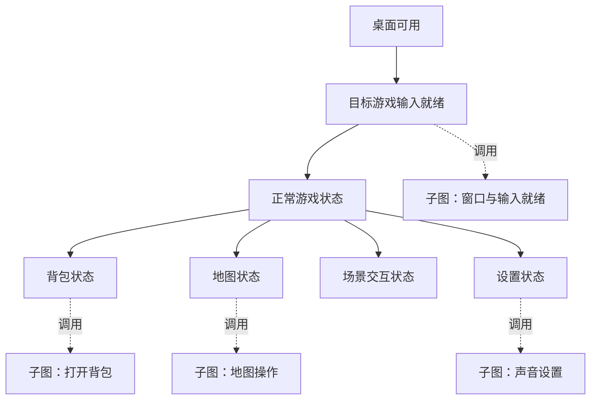

# 分层关系网与复合能力子图构想

> 文档性质：面向大型游戏操作系统的分层关系网、复合能力与子图管理构想
>
> 上位方案：[总体架构与关键问题分析](../game_ai_planning/01-总体架构与关键问题分析.md)
>
> 交互发现：[基于用户游玩监控的界面与交互要素发现构想](基于用户游玩监控的界面与交互要素发现构想.md)
>
> 桌面边界：[多窗口输入归属与游戏视角异常恢复构想](多窗口输入归属与游戏视角异常恢复构想.md)
>
> 故障与统计规范：[游戏瞬态故障判读与置信度隔离构想](游戏瞬态故障判读与置信度隔离构想.md)
>
> 确定性执行参考：[AzurLaneAutoScript可借鉴机制与设计思想](../../references/alas/AzurLaneAutoScript可借鉴机制与设计思想.md)

## 1. 核心问题

如果把所有游戏状态和操作都放入一张扁平关系网，图规模会迅速失控。

可能参与状态组合的因素包括：

```text
桌面前台窗口
× 游戏运行模式
× 当前页面
× 覆盖弹窗
× 输入焦点
× 视角健康状态
× 玩家位置
× NPC或目标对象
× 音量等设置值
× 地图缩放级别
× 当前任务和资源状态
```

如果为每一种完整组合建立独立节点，将形成状态组合爆炸：

```text
背包页面 + 音量50% + 原神后台 + 视角正常
背包页面 + 音量60% + 原神后台 + 视角正常
背包页面 + 音量60% + 原神前台 + 视角异常
...
```

这类图即使能够存储，也很难搜索、维护、验证、版本化和向LLM展示。

## 2. 推荐方向

采用：

```text
因子化状态
+ 主能力图
+ 可版本化复合能力子图
+ 原子能力
+ 参数化连续控制器
```

整体调用链：

```text
用户目标
-> 高层能力目录
-> 主关系网规划
-> 复合能力
-> 延迟展开子关系网
-> 原子能力
-> 确定性识别、键鼠或连续控制器
```

主图不保存每个鼠标移动、截图和重试细节，只保存高层状态与能力契约。具体执行过程由子图和原子执行器承担。

## 3. 先区分状态图、能力分解图和模块调用图

“节点”一词不能同时指页面状态、执行动作和子图。系统至少包含三种不同结构：

| 结构 | 节点 | 边 | 主要用途 |
| --- | --- | --- | --- |
| 状态关系图 | `StateDefinition` | `TransitionDefinition` | 表达哪些状态可以通过能力互相到达 |
| 能力分解图 | `CapabilitySpec`或任务步骤 | 分解、顺序和条件关系 | 把高层目标展开为可执行能力 |
| 模块调用图 | `GraphModule` | `calls`或`GraphBinding` | 管理复用、依赖、版本和返回 |

状态关系图中的转换边引用能力，而不是把状态和能力塞进同一种节点：

```text
StateDefinition A
-> TransitionDefinition(capability_ref=X)
-> StateDefinition B
```

能力本身可以统一抽象成：

```text
Capability
├── AtomicCapability
└── CompositeCapability
```

### 3.1 原子能力

直接调用确定性模块：

```text
截图
模板匹配
OCR
YOLO检测
发送单个按键
单击一个已验证目标
读取窗口焦点
释放所有输入
```

### 3.2 复合能力

引用一个可独立执行和验证的子关系网：

```text
打开背包
进入设置页面
设置主音量
在地图中找到目标
恢复游戏视角
重新进入游戏世界
```

两者对规划器提供相同的能力契约，状态关系图只在`TransitionDefinition`中引用该契约，不需要根据内部实现方式使用两套规划逻辑。

推荐的状态与转换定义为：

```text
StateDefinition
├── state_id
├── revision_id
├── fact_predicate
├── stability_policy
├── verifier_ref
└── evidence_requirements
```

```text
TransitionDefinition
├── transition_id
├── revision_id
├── from_state_ref
├── capability_ref
├── to_state_candidates
├── guard
├── verification_policy
├── interruption_policy
└── reliability_refs
```

`TransitionDefinition`表达可达关系，`CapabilitySpec`表达怎样尝试完成该转换；两者可以分别版本化和统计。

## 4. 统一能力契约

```text
CapabilitySpec
├── capability_id
├── revision_id
├── kind
├── namespace
├── parameters
├── preconditions
├── postconditions
├── outcomes
├── verifier_ref
├── verification_window
├── interruption_policy
├── required_resources
├── risk_level
├── estimated_cost
├── supports_cancel
├── recovery_policy
└── implementation_ref
```

其中动作执行器只能证明“尝试已经提交”。只有`verifier_ref`在新鲜后置观测中确认`postconditions`成立，能力运行才可以返回成功。

其中：

```text
kind: atomic
implementation_ref: Python执行器或控制模块
```

或者：

```text
kind: composite
implementation_ref: graph_id + graph_revision
```

例如：

```yaml
capability_id: nikki.open_inventory
revision_id: caprev_007
kind: composite
namespace: nikki.ui.base_menu

parameters: {}

preconditions:
  - app.nikki.mode == GAMEPLAY
  - desktop.input_ready == true

outcomes:
  SUCCEEDED:
    ui.page: INVENTORY
  UNKNOWN: {}
  FAILED: {}
  CANCELLED: {}
  BLOCKED: {}

success_reason_codes:
  - TARGET_REACHED
  - ALREADY_DONE

required_resources:
  exclusive:
    - desktop_physical_input
    - game_control:nikki

implementation_ref:
  graph_id: nikki.ui.open_inventory
  graph_revision: graphrev_012
```

## 5. 主关系网更像高层路由图



主图负责回答：

```text
当前高层状态是什么
目标高层状态是什么
有哪些已发布能力能够完成转换
应该按照什么顺序调用这些能力
```

子图负责回答：

```text
这个能力具体怎样执行
每一步怎样取得资源
怎样观察和验证
失败后能否局部恢复
怎样清理输入和线程
最终返回哪个结构化结果
```

## 6. 子图必须通过引用复用

复合能力只保存：

```text
graph_id + graph_revision
```

不能把子图全部复制到主图，也不能在多个调用点复制相同子图。

否则会出现：

- 子图修改后所有复制位置都要同步更新；
- 同一能力被多个任务使用时产生大量重复节点；
- 历史计划无法确定当时使用的是哪一份实现；
- 不同副本逐渐产生行为漂移；
- 图统计无法可靠聚合到同一个能力。

引用方式可以是：

```text
CompositeCapability
  capability_id: nikki.open_inventory
  graph_ref:
    graph_id: nikki.ui.open_inventory
    revision_id: graphrev_012
```

## 7. 因子化状态避免组合爆炸

不要把每个完整世界快照都建成一个不可分割节点。

推荐状态：

```text
StateSnapshot
├── desktop
├── application
├── game
├── ui
├── input
├── health
├── continuous_variables
└── context_objects
```

示例：

```yaml
desktop:
  foreground_app: infinity_nikki
  focus_epoch: 108
  input_ready: true

application:
  lifecycle: RUNNING
  window_state: VISIBLE

game:
  mode: GAMEPLAY
  world_state: NORMAL

ui:
  page: INVENTORY
  overlay_stack: []

input:
  focus_mode: CURSOR_UI

health:
  view_control: HEALTHY

continuous_variables:
  master_volume: 0.60
  map_zoom: level_3
```

能力只读取和修改自己关心的状态字段。

例如“打开背包”只关心：

```text
desktop.input_ready
game.mode
ui.page
ui.overlay_stack
```

它不关心：

```text
master_volume
map_zoom
无关的后台应用状态
```

这些无关变量不会让图增加新的页面节点。

## 8. 状态不是一张截图

截图是状态证据，不是状态本身。

```text
StateDefinition
-> 定义需要满足的机器事实

StateSnapshot
-> 某个时间点观测到的事实集合

FrameEvidence
-> 支撑这次状态判断的画面
```

同一个`ui.page=INVENTORY`可以在不同分辨率、物品内容、角色背景和鼠标位置下成立，而不需要为每张截图建立新节点。

## 9. 连续变量不能枚举成节点

以下内容不应为每个值建立关系节点：

- 音量百分比；
- 亮度；
- 鼠标灵敏度；
- 页面滚动位置；
- 地图缩放倍率；
- 镜头角度；
- 连续地图坐标。

应使用参数化能力：

```text
set_slider_value(control_id, target)
scroll_until_visible(target_element)
set_map_zoom(target)
rotate_view_to_angle(target_angle)
move_to_world_position(target_position)
```

关系图只描述该能力在哪些状态下可用、可能产生什么结果；具体数值由`ContinuousController`和运行状态管理。

连续控制定义与环境校准必须分开：

```text
ContinuousController
├── controller_id + revision_id
├── state_observer_ref
├── actuator_ref
├── target_schema
├── safety_policy
├── verification_policy
└── calibration_profile_ref

CalibrationProfile
├── calibration_id + revision_id
├── controller_ref
├── environment_fingerprint
├── response_model
├── valid_range
├── invalidation_conditions
├── evidence_ids
└── validation_status
```

`ContinuousController`是可版本化能力定义，`CalibrationProfile`是特定分辨率、输入后端、游戏版本或控制模式下的经验参数。计划固定两者的修订，但校准失效时不能静默沿用旧参数。

## 10. 推荐的图域划分

```text
主能力图
├── 桌面与应用生命周期图
├── 游戏主模式图
├── UI导航图
├── 世界交互图
├── 设置控制图
├── 连续控制图
└── 异常恢复图
```

### 10.1 桌面与应用生命周期图

```text
发现窗口
-> 激活窗口
-> 验证输入归属
-> 应用输入就绪
```

### 10.2 游戏主模式图

```text
启动器
-> 标题界面
-> 登录
-> 加载
-> 游戏世界
-> 副本或特殊模式
```

### 10.3 UI导航图

```text
游戏世界
-> 基础菜单
-> 背包、地图、角色或任务
-> 设置
```

### 10.4 世界交互图

```text
接近对象
-> 交互提示
-> 对话、商店、任务或制作
```

### 10.5 设置控制图

```text
进入设置
-> 选择分类
-> 调整参数
-> 验证或应用
-> 返回游戏
```

### 10.6 连续控制图

```text
观察当前连续状态
-> 必要时校准
-> 执行连续控制
-> 验证目标值
```

### 10.7 异常恢复图

```text
重新观察
-> 重新聚焦
-> 切换控制模式
-> 游戏内传送
-> 重新登录
-> 重启客户端
```

## 11. 子图需要明确入口和出口

```text
GraphModule
├── graph_id
├── revision_id
├── parameters
├── entry_ports
├── internal_nodes
├── outcome_ports
├── resource_contract
├── timeout_policy
├── recovery_contract
└── exported_capabilities
```

例如声音设置子图：

```text
Inputs:
  target_volume

Entry Preconditions:
  设置页面已打开
  声音标签页可识别
  输入焦点有效

Outcomes:
  SUCCEEDED
  UNKNOWN
  FAILED
  CANCELLED

ReasonCodes:
  ALREADY_DONE
  FOCUS_LOST
  CALIBRATION_INVALID
```

内部流程：

```text
检测声音标签页
-> 检测主音量滑块
-> 检查活动校准
-> 必要时微量自检
-> 设置目标音量
-> 视觉验证结果
-> 返回结构化Outcome
```

上层只处理结果，不需要知道内部拖动了多少像素。

## 12. 子图不是普通文件夹

子图边界不应只根据代码目录划分。一个子图应满足：

- 具有明确业务目标；
- 有可机器判断的前置条件；
- 有有限且明确的结果集合；
- 能独立执行和测试；
- 有自己的超时和取消边界；
- 有清晰资源需求；
- 内部失败可以转换为结构化结果；
- 可以被多个高层计划复用；
- 版本变化可以独立发布。

不满足这些条件的任意步骤集合，不应仅因为代码很多就提升成复合能力。

## 13. 抽象计划与可执行计划分开

### 13.1 抽象计划

用户看到：

```text
1. 激活无限暖暖
2. 打开设置
3. 将主音量设置为65%
4. 返回游戏
```

它由高层能力组成，适合用户理解和批准。

### 13.2 可执行计划

用户确认后，确定性编译器固定能力和子图版本：

```text
ensure_input_ready@rev_4
open_pause_menu@rev_7
goto_settings@rev_3
goto_audio_settings@rev_2
set_continuous_control@rev_9
return_to_gameplay@rev_5
```

随后只展开本次计划实际使用的子图。

用户不需要看到全部底层识别和输入步骤，但运行证据仍需保存完整调用树。

## 14. 延迟展开子图

不要在系统启动时把所有游戏、所有页面和所有底层节点加载成一张巨型内存图。

```text
高层规划只查询主图和能力目录
-> 选中一个CompositeCapability
-> 编译时加载该能力引用的子图
-> 固定graph_revision
-> 检查入口、资源和依赖
-> 执行到子图出口
-> 把结构化结果返回上层
```

延迟展开带来：

- 规划搜索空间更小；
- LLM上下文更小；
- 不相关游戏模块无需加载；
- 子图可以独立缓存；
- 版本依赖更容易固定；
- 错误更容易限制在局部能力内。

## 15. LLM只看高层能力投影

LLM可以看到：

```text
打开背包
设置音量
在地图中查找目标
与NPC交互
恢复游戏视角
```

通常不需要看到：

```text
移动鼠标12像素
等待300毫秒
裁剪截图区域
匹配某个图标模板
发送key_up
更新内部计数器
```

底层节点由确定性编译器和执行器处理。

LLM输出：

```text
AbstractPlan
```

后端编译为：

```text
ExecutablePlan
```

只有编译成功、版本固定、资源无冲突并获得用户批准后，才进入真实执行。

## 16. 不把所有结构都强行做成关系网

推荐使用混合系统。

| 问题 | 更适合的结构 |
| --- | --- |
| 当前页面、覆盖层和并行状态 | 分层状态机或Statechart |
| 哪些状态可以互相到达 | 关系图 |
| 高层任务怎样拆分 | HTN或复合能力子图 |
| 执行中的条件、停止和清理 | 任务状态机 |
| 滑动条、滚轮、镜头和移动 | 连续控制器 |
| 跨模块能力查询 | Capability Registry |
| 异常升级与恢复选择 | Recovery Policy |
| 历史执行与可靠性统计 | 运行记录和证据数据库 |

### 16.1 Statechart

适合表达同时存在的正交状态：

```text
游戏模式：GAMEPLAY
UI页面：INVENTORY
输入焦点：CURSOR_UI
窗口健康：INPUT_READY
```

### 16.2 HTN

层次任务网络适合表达：

```text
高层任务
-> 分解为多个子任务
-> 子任务继续分解
-> 最终落到原子能力
```

### 16.3 关系图

适合表达：

```text
状态A通过能力X可以到达状态B
```

### 16.4 连续控制器

适合表达无法枚举的值和反馈闭环，不应被硬塞成大量离散图节点。

## 17. Graph Registry

```text
GraphRegistry
├── graph_id
├── graph_revision
├── namespace
├── entry_contract
├── outcome_contract
├── dependencies
├── exported_capabilities
├── validation_status
└── release_status
```

推荐发布状态：

```text
DRAFT
-> CANDIDATE
-> SHADOW
-> ACTIVE
-> DEGRADED
-> RETIRED
```

主图和计划只能默认引用`ACTIVE`子图。`DEGRADED`子图可以保留历史运行，但不能继续被规划器自动优先选择。

发布状态不能同时承担“抽象程度”和“验证成熟度”。建议分轴保存：

```text
abstraction_status:
  FRAGMENT / LOCAL_MODULE / REUSABLE_MODULE / SYSTEM_MODULE

validation_status:
  UNVALIDATED / OFFLINE_VALIDATED / SHADOW_VALIDATED / LIVE_VALIDATED

release_status:
  DRAFT / CANDIDATE / SHADOW / ACTIVE / DEGRADED / RETIRED
```

例如一个`SYSTEM_MODULE`仍可能只完成离线验证并处于`CANDIDATE`；抽象层级高不代表可以进入真实执行。

## 18. 版本固定

一次计划需要固定：

```text
main_graph_revision
capability_revisions
subgraph_revisions
detector_revisions
continuous_controller_revisions
calibration_profile_revisions
application_profile_revisions
```

运行过程中，即使Registry发布了新版本，当前PlanRun也不能悄悄切换实现。

可以选择：

```text
继续使用已固定版本
```

或者在旧版本失效时：

```text
安全停止当前PlanRun
-> 基于新版本重新编译和批准
```

## 19. 调用树和运行实例

统一运行层级为：

```text
PlanRun
-> CapabilityRun
-> StepAttempt
```

- `PlanRun`固定本次计划、版本、用户批准和总预算；
- `CapabilityRun`表示某项语义能力的一次调用；
- `StepAttempt`表示一次可单独观察、执行和验证的受控尝试；
- `GraphCallRun`记录复合能力跨模块调用、返回上下文和修订固定；
- `RecoveryRun`是独立运行记录，不属于原失败`StepAttempt`，也不能覆盖其结果。

```text
StepAttempt
├── attempt_id
├── capability_run_id
├── step_definition_ref
├── state_before
├── precondition_evidence
├── required_resources
├── validity_tokens
│   ├── focus_epoch
│   └── control_schema_epoch
├── action_submission
├── professional_payload
├── observation_after
├── verification_result
├── outcome
├── reason_code
└── evidence_ids
```

滚轮缩放、输入归属、动态绑定等领域对象只作为`professional_payload`，不能各自替代公共`StepAttempt`。

公共结果封套只表达本次运行发生了什么：

```text
ExecutionOutcome
├── outcome: SUCCEEDED / FAILED / UNKNOWN / CANCELLED / BLOCKED
├── reason_code
├── failure_attribution_ref
├── sample_disposition_ref
└── evidence_package_ref
```

`reason_code`由专业模块提供；`FailureAttribution`和`SampleDisposition`由故障归因流程在证据验证后生成，其规范归属《游戏瞬态故障判读与置信度隔离构想》。

```text
PlanRun
└── CapabilityRun: 配置声音
    ├── CapabilityRun: 激活窗口
    ├── CapabilityRun: 打开设置
    ├── CapabilityRun: 进入声音页面
    ├── CapabilityRun: 设置主音量
    │   ├── AtomicRun: 检测滑块
    │   ├── AtomicRun: 拖动滑块
    │   └── AtomicRun: 验证数值
    └── CapabilityRun: 返回游戏
```

定义和运行实例必须分开：

```text
CapabilitySpec
-> 稳定、可版本化的能力定义

CapabilityRun
-> 某次计划中的具体调用
```

子调用失败时，应保留完整调用树和证据，不能只在顶层留下“配置声音失败”。

恢复后继续执行时必须创建新的`StepAttempt`。恢复成功只能说明环境或控制健康已经恢复，不能把原失败尝试改写为成功。

## 20. 局部恢复和错误上浮

子图可以先执行有限的局部恢复：

```text
识别结果过期
-> 重新截图

滑块校准轻微偏差
-> 进行一次局部纠偏

按钮动画未结束
-> 等待稳定后重新识别
```

无法局部解决时，把结构化结果上浮：

```text
FOCUS_LOST
CALIBRATION_INVALID
PRECONDITION_MISMATCH
UNKNOWN
FAILED
```

上层RecoverySupervisor再决定是否：

- 重新聚焦窗口；
- 重新进入页面；
- 替换高层路径；
- 暂停并询问用户；
- 结束计划。

恢复图不应复制到每一个业务子图中。

## 21. 循环依赖和递归边界

子图引用允许复用，但会引入递归风险。

例如：

```text
恢复视角
-> 调用返回游戏
-> 返回游戏失败后调用恢复视角
```

需要限制：

- 发布前检查子图调用图；
- 禁止无条件循环依赖；
- 设置最大调用深度；
- 设置单能力最大重复次数；
- 设置PlanRun总时间和总恢复预算；
- 每次递归调用记录调用链；
- 恢复能力不能无限重新调用原失败能力；
- 循环必须具有可机器验证的退出条件。

子图内部可以存在有限循环，例如“滚动直到目标出现”，但必须有：

```text
最大次数
总超时
进度检测
边界检测
取消检查
```

## 22. 子图可靠性统计

主图可以使用子图的聚合指标：

```text
成功率
UNKNOWN率
平均耗时
P95耗时
取消响应时间
资源等待时间
常见失败原因
最近验证时间
环境兼容范围
```

但聚合结果不能覆盖内部证据。

例如：

```text
open_inventory成功率98%
```

只是高层规划成本信息。发生故障时，仍需追溯到：

```text
窗口焦点验证
-> 按B
-> 背包图标识别
-> 页面稳定判断
```

## 23. 子图划分原则

适合提升为子图的内容：

- 能独立描述一个用户可理解目标；
- 被多个计划复用；
- 内部包含多个步骤和结果分支；
- 有自己的风险和资源边界；
- 可以独立验证；
- 可以独立版本化；
- 内部实现可能变化，但对外契约相对稳定。

不适合提升为子图的内容：

- 单次截图；
- 单个键盘按下；
- 没有明确结果的任意代码片段；
- 只被使用一次且没有业务边界的包装；
- 无法判断完成或失败的过程；
- 纯粹为了减少代码行数而创建的抽象。

## 24. 命名空间

```text
desktop.*
application.*
shared.capture.*
shared.input.*
nikki.lifecycle.*
nikki.world.*
nikki.ui.base.*
nikki.ui.settings.*
nikki.interaction.*
nikki.recovery.*
controls.slider.*
controls.scroll.*
controls.zoom.*
```

命名空间帮助：

- 按应用和领域加载相关能力；
- 避免不同游戏出现同名节点；
- 控制LLM可见能力范围；
- 分配维护和发布权限；
- 按领域执行验证和回归测试。

## 25. 示例：设置无限暖暖主音量

### 25.1 主图

```text
NIKKI_GAMEPLAY
-> configure_audio(target=0.65)
-> NIKKI_GAMEPLAY
```

### 25.2 `configure_audio`子图

```text
ensure_nikki_input_ready
-> open_pause_menu
-> goto_settings
-> goto_audio_settings
-> set_master_volume(target)
-> return_to_gameplay
```

### 25.3 `set_master_volume`子图

```text
detect_master_volume_control
-> observe_current_value
-> ensure_calibration
-> execute_continuous_control
-> verify_target_value
```

### 25.4 原子层

```text
capture_frame
detect_slider_track
detect_slider_thumb
mouse_down
mouse_move
mouse_up
read_volume_value
```

主图始终只看到一个高层能力，但底层仍保留完整可验证执行链。

## 26. 示例：多窗口视角异常恢复

### 26.1 主图

```text
NIKKI_INPUT_UNHEALTHY
-> recover_nikki_view_control
-> NIKKI_INPUT_READY
```

### 26.2 恢复子图

```text
release_all_inputs
-> verify_desktop_state
-> activate_nikki_window
-> verify_input_owner
-> probe_view_control
```

如果仍失败：

```text
toggle_menu_and_return
-> probe_view_control
-> teleport_to_safe_anchor
-> probe_view_control
-> request_relogin_confirmation
```

主图不需要展开原神窗口、焦点epoch、桌面截图和鼠标探测的每一项细节。

## 27. 推荐的系统边界

```text
StateStore
-> 保存因子化当前状态

CapabilityRegistry
-> 保存原子与复合能力契约

GraphRegistry
-> 保存子图定义、版本和依赖

Planner
-> 在高层能力图中生成AbstractPlan

PlanCompiler
-> 固定版本并展开所需子图

Executor
-> 执行CapabilityRun调用树

ContinuousControllers
-> 处理滑块、滚轮、镜头和移动

RecoverySupervisor
-> 处理跨能力异常升级

EvidenceStore
-> 保存每层运行证据
```

## 28. 第一阶段可以保持简单

第一版不需要实现任意深度的通用图编程语言。

可以先支持：

```text
一层主图
+ 一层CompositeCapability子图
+ AtomicCapability叶子节点
```

并限制：

- 子图暂不互相递归；
- 循环只允许使用固定的有限重试节点；
- 每个子图只有明确入口和有限结果；
- 连续控制器作为叶子能力；
- 恢复先由统一Supervisor处理；
- 所有版本在PlanRun开始时固定。

等基础执行、证据和版本模型稳定后，再增加更深层复合能力。

## 29. 增量层级与通用系统子图

前面的主图和子图结构不能被理解为一棵固定的目录树。实际发现过程很可能是自底向上的：

```text
先观察到一小段稳定操作
-> 形成局部GraphFragment
-> 后续发现它属于某个页面系统
-> 再发现该系统可在多个区域复用
-> 最后把它提升为游戏级通用系统模块
```

因此，子图先于父图存在、同一个子图拥有多个调用者、后续才发现更高抽象层，都是正常情况。

### 29.1 层级不应使用固定所有权树

不推荐：

```text
主图
└── 花愿镇
    └── 背包子图
```

如果背包也能在祈愿森林、小石树田村和其他区域使用，固定树会迫使系统复制：

```text
花愿镇背包子图
祈愿森林背包子图
小石树田村背包子图
```

更合适的是模块引用DAG：

```text
花愿镇图 ─────┐
祈愿森林图 ───┼─> nikki.system.inventory
小石树田村图 ─┘
```

其中：

- 区域图不拥有背包系统的内部节点；
- 多个区域图可以引用同一系统模块；
- 背包系统不需要预先知道所有调用者；
- 新区域出现时只增加绑定，不复制系统图；
- 背包系统升级时可以独立发布新修订。

### 29.2 定义层是DAG，运行层是调用树

图定义层允许：

```text
多个调用者
-> 引用同一个GraphModule
```

因此定义关系是有向无环图或受约束的模块调用图。

某次实际运行中，一个子图调用仍然只有一个具体调用者：

```text
PlanRun
└── RegionCapabilityRun
    └── InventoryCapabilityRun
```

所以运行实例可以使用普通调用栈或调用树管理返回位置，不会因为定义层多父引用而失去上下文。

### 29.3 子图返回上层使用调用栈

不要在背包子图中建立：

```text
关闭背包
-> 返回花愿镇
-> 返回祈愿森林
-> 返回区域A
-> 返回副本B
```

这些静态返回边会随着调用场景数量增长。

应像函数调用一样：

```text
调用者进入背包系统
-> 执行器压入ReturnContext
-> 背包系统运行
-> 背包系统返回CLOSED或SUCCESS
-> 执行器弹出调用栈
-> 重新观察调用者状态
-> 验证后恢复到resume_node
```

调用上下文可以保存：

```text
ReturnContext
├── caller_graph_id
├── caller_graph_revision
├── caller_run_id
├── resume_node_id
├── state_snapshot_before_call
├── expected_preserved_facts
├── allowed_return_variants
└── evidence_before_call
```

不能只依赖调用前的旧快照直接恢复，因为子图运行期间可能出现：

- 掉线；
- 传送；
- 弹窗；
- 游戏模式变化；
- 窗口焦点丢失；
- 角色位置或世界状态变化。

返回时必须重新截图和识别，再决定原调用栈是否仍然有效。

### 29.4 通用系统子图使用上下文契约

背包系统不需要枚举每个区域。它可以声明：

```yaml
graph_id: nikki.system.inventory

preconditions:
  application: infinity_nikki
  game_mode: GAMEPLAY
  base_menu_allowed: true
  input_ready: true

context:
  region: ANY
  player_position: ANY

preserves:
  - world.region
  - world.player_position
  - account.character

outcomes:
  SUCCEEDED: {}
  UNKNOWN: {}
  FAILED: {}
  CANCELLED: {}
  BLOCKED: {}

successful_effects:
  OPENED:
    ui.page: INVENTORY
  CLOSED:
    ui.page: CLOSED
```

这意味着它对区域不敏感，但仍要求：

- 游戏处于允许打开基础菜单的模式；
- 当前不是过场或输入锁定状态；
- 桌面输入已经分配给目标游戏；
- 页面和覆盖层满足入口条件。

### 29.5 使用适用条件，不为每个上下文复制图

```text
applicability_predicate:
  game.mode == GAMEPLAY
  AND ui.overlay_stack allows BASE_MENU
  AND input.ready == true
  AND game.cutscene == false
```

区域、玩家坐标和当前任务只有在确实影响行为时才进入守卫。

例如：

```text
正常世界：背包可用
战斗锁定：背包不可用
过场动画：背包不可用
特殊副本：需要额外验证
游泳状态：待验证
载具状态：可能使用专用变体
```

这些差异通常应通过适用条件或Adapter表达，而不是复制整个系统子图。

### 29.6 通用系统与本地Adapter分开

```text
LocalContext
-> ContextAdapter
-> SystemGraph
-> OutcomeAdapter
-> LocalContext
```

Adapter可以负责：

- 把区域本地状态映射为系统入口；
- 进入前退出特殊控制模式；
- 注入局部参数；
- 处理区域特有弹窗；
- 映射系统Outcome；
- 验证关闭后应该恢复的控制模式。

例如：

```text
nikki.region.normal.inventory_adapter
nikki.dungeon.inventory_adapter
nikki.vehicle.inventory_adapter
```

它们都可以调用：

```text
nikki.system.inventory
```

如果副本背包的页面、入口、资源或结果语义已经明显不同，则不应强行套用Adapter，可以保留独立变体：

```text
nikki.system.inventory.normal
nikki.system.inventory.dungeon
```

### 29.7 图关系不能只有父子关系

建议至少区分：

| 关系 | 含义 |
| --- | --- |
| `contains` | GraphModule内部拥有哪些节点 |
| `calls` | 一个复合能力调用另一个GraphModule |
| `applies_in` | GraphModule适用于哪些上下文 |
| `adapts` | Adapter怎样连接本地状态与通用系统 |
| `generalizes` | 新模块抽象自哪些局部Fragment |
| `specializes` | 某个模块是通用系统的特殊变体 |
| `supersedes` | 新修订替代哪个旧修订 |
| `aliases` | 旧机器ID怎样映射到新规范ID |
| `returns_to` | 运行实例返回调用者，由调用栈表达 |

静态定义中的`returns_to`不应变成指向所有父图的硬编码边，它只声明该模块具有返回调用者的语义。

### 29.8 子图成长状态

```text
FRAGMENT
-> LOCAL_MODULE
-> REUSABLE_MODULE
-> SYSTEM_MODULE
```

#### `FRAGMENT`

刚从少量用户操作中切分出来：

- 入口可能不完整；
- 尚不知道所属系统；
- 只在当前场景出现；
- `outcome_ports`仍可能是候选；
- 不允许进入正式计划。

#### `LOCAL_MODULE`

已在某个局部上下文中重复验证：

```text
scope: nikki.region.flowerwish
```

#### `REUSABLE_MODULE`

多个场景出现相同内部结构，差异可以参数化或由Adapter处理：

```text
scope: nikki.gameplay.multiple_regions
```

#### `SYSTEM_MODULE`

被确认属于某个游戏的通用系统：

```text
scope: nikki.system.inventory
region: ANY
```

图的抽象层级、验证成熟度和发布状态必须分开：

```text
abstraction_status:
  FRAGMENT / LOCAL_MODULE / REUSABLE_MODULE / SYSTEM_MODULE

validation_status:
  UNVALIDATED / OFFLINE_VALIDATED / SHADOW_VALIDATED / LIVE_VALIDATED

release_status:
  DRAFT / CANDIDATE / SHADOW / ACTIVE / DEGRADED / RETIRED
```

一个系统级模块也可能仍处于`CANDIDATE`，不能因为层级高就直接用于正式执行。

### 29.9 自底向上的通用化流程

初期可能存在：

```text
local_inventory_flowerwish
local_inventory_forest
local_inventory_dungeon
```

系统先生成：

```text
GeneralizationCandidate
```

比较内容包括：

- 前置状态结构；
- 输入事件及顺序；
- 页面检测器和视觉指纹；
- 内部节点与转换边；
- 入口和Outcome；
- 哪些状态变量保持不变；
- 哪些差异可以参数化；
- 哪些差异需要Adapter；
- 是否存在不可兼容行为。

确认后新建：

```text
nikki.system.inventory@graphrev_001
```

旧局部图不会被破坏性删除，而是：

- 保留历史定义；
- 建立`generalizes`关系；
- 生成到新模块的Adapter或Alias；
- 继续支撑旧PlanRun的版本追溯；
- 新计划逐步切换到通用模块。

### 29.10 不做破坏性搬迁

后续发现上层结构时，不应直接：

```text
从旧图删除节点
-> 移动到新父图
-> 修改所有历史边
```

应创建新定义和迁移关系：

```text
old_fragment_id
-> generalized_by
-> new_system_graph_id
```

历史运行仍固定旧修订；新计划使用新模块。只有确认不再需要兼容时，旧模块才进入`RETIRED`。

### 29.11 主图可以是动态投影视图

系统不一定需要一张永久保存、包含所有游戏和系统的唯一主图。

根据当前上下文：

```text
当前应用：无限暖暖
当前状态：正常游戏世界
用户目标：调整音量
```

Graph Registry可以动态返回：

```text
桌面输入就绪
-> 无限暖暖基础菜单
-> 设置系统
-> 声音设置系统
-> 连续滑块控制
```

地图、NPC、战斗、跑图和其他游戏模块不进入本次高层搜索。

所以“主图”更准确地说是：

> Graph Registry根据当前StateSnapshot、目标和抽象层级生成的高层能力投影。

### 29.12 可变展开层级

同一个能力可以提供不同粒度视图：

```text
Level 0：配置声音

Level 1：打开设置 -> 声音页面 -> 设置音量

Level 2：识别按钮 -> 点击 -> 等待 -> 验证页面

Level 3：截图、检测、坐标换算和键鼠原子动作
```

不同消费者可以看到不同层级：

| 消费者 | 适合的层级 |
| --- | --- |
| 用户 | Level 0至1 |
| LLM规划器 | 发布后的Level 0至1能力 |
| 确定性PlanCompiler | Level 1至2 |
| Executor | Level 2至3 |
| 调试器 | 全部层级和运行证据 |

### 29.13 子图先于父图存在

完整成长过程可以是：

```text
第一次发现局部操作
-> 创建孤立GraphFragment

重复出现
-> 建立稳定入口、出口和Outcome

在其他区域发现相似结构
-> 创建GeneralizationCandidate

确认可复用
-> 生成ReusableModule

发现它属于游戏通用菜单
-> 提升为SystemModule

后来发现标题界面也能进入同一设置系统
-> 增加新的Adapter和调用者

原始Fragment和历史运行继续保留
```

所以系统允许“孤立模块”存在，不要求所有发现必须立刻挂到主图。

### 29.14 普通返回与异常上浮分开

普通完成：

```text
子图返回SUCCESS或CLOSED
-> 恢复调用者
-> 重新验证保留事实
-> 从resume_node继续
```

局部未知：

```text
子图返回UNKNOWN
-> 调用者选择暂停、询问用户或更换局部路径
```

桌面级故障：

```text
子图返回FOCUS_LOST
-> 不直接恢复区域图
-> 上浮RecoverySupervisor
-> 恢复输入健康
-> 再判断调用栈是否有效
```

应用上下文已经丢失：

```text
游戏回到登录界面
-> 返回APPLICATION_CONTEXT_LOST
-> 原区域调用栈失效
-> 回到应用生命周期图重新规划
```

因此“返回调用者”和“升级到更高层恢复”是两套不同机制。

### 29.15 推荐的数据对象

```text
GraphModule
├── graph_id
├── revision_id
├── namespace
├── abstraction_status
├── validation_status
├── release_status
├── entry_ports
├── outcome_ports
├── context_schema
├── applicability_predicate
├── preserved_facts
├── effects
├── dependencies
├── internal_nodes
└── exported_capabilities
```

```text
GraphBinding
├── binding_id
├── caller_graph_id
├── callee_graph_id
├── adapter_id
├── parameter_mapping
├── context_mapping
├── outcome_mapping
├── guard
└── binding_revision
```

```text
GraphCallRun
├── caller_run_id
├── callee_run_id
├── return_context
├── pinned_revisions
├── entry_state
├── entry_evidence
├── outcome
├── observed_return_state
└── resume_decision
```

```text
GeneralizationRecord
├── candidate_id
├── source_fragment_ids
├── structural_similarity
├── parameterized_differences
├── incompatible_differences
├── proposed_system_graph
├── validation_runs
├── user_decision
└── published_revision
```

### 29.16 规划器如何找到通用系统

规划器不需要先沿固定父子树找到子图。它可以向Capability Registry查询：

```text
当前StateSnapshot满足哪些已发布能力的preconditions
+ 哪些能力的effects接近用户目标
+ 哪些能力的applicability_predicate为真
```

例如当前区域图没有显式画出背包边，只要：

```text
nikki.system.inventory.open
```

的适用条件满足，规划器仍可以使用它。

这使通用系统更像按上下文注册的能力，而不是必须复制到每个局部图中的静态边。

### 29.17 防止错误通用化

外观相似不代表内部语义相同。

以下情况不应自动合并：

- 普通背包和副本临时背包存在不同物品规则；
- 标题界面设置和游戏内设置具有不同返回行为；
- 相同按钮在战斗中产生不同副作用；
- 页面外观相同但资源、风险或权限不同；
- 同一快捷键在不同控制模式下含义不同。

通用化至少需要验证：

- 前置契约能够统一；
- 主要成功效果和失败语义一致；
- 差异可以参数化或通过Adapter隔离；
- 保留事实在多个上下文中成立；
- 失败和恢复语义没有冲突；
- 多个环境的独立实机测试通过。

无法满足时应保持多个专用GraphModule，而不是强制追求一个万能子图。

### 29.18 循环和上层回跳边界

子图完成后返回调用者，不应通过“子图调用父图”实现，否则容易形成：

```text
ParentGraph calls ChildGraph
ChildGraph calls ParentGraph
```

普通返回使用调用栈；真正需要跨层恢复时返回结构化`ExecutionOutcome`给Supervisor。

模块调用图仍需：

- 发布前检查循环依赖；
- 禁止无条件父子互调；
- 限制最大调用深度；
- 限制同一模块在一次PlanRun中的调用次数；
- 为有限循环声明进度和退出条件；
- 为恢复设置独立预算。

### 29.19 推荐的最终结构

```text
局部GraphFragment
-> 允许先独立发现和验证

GraphModule
-> 封装稳定局部能力

SystemGraph
-> 表达游戏内跨区域通用系统

Adapter
-> 处理区域、模式和入口差异

GraphRegistry
-> 管理模块、引用、版本和适用条件

RuntimeCallStack
-> 管理某次运行的调用和返回

DynamicMainView
-> 根据当前目标投影相关高层能力
```

这种结构允许层级从局部向上逐步生长，而不要求系统最初就知道完整游戏架构。

## 30. 逐边执行与重新定位

关系图只提供导航建议，不代表运行时事实。每条`TransitionDefinition`都按照同一闭环执行：

```text
从新鲜观察确认from_state和守卫
-> 固定Capability与验证器修订
-> 取得desktop_physical_input等资源
-> 固定focus_epoch和control_schema_epoch
-> 创建StepAttempt并提交一个受控动作
-> 重新观察并等待稳定窗口
-> 验证to_state候选和后置条件
-> 成功则提交新的StateSnapshot
-> 不一致则以真实观察重新定位、改道或停止
```

输入已经发送不等于状态已经变化。未取得新鲜后置证据时只能返回`UNKNOWN`或专业`reason_code`，不能沿计划继续猜测。

## 31. 中断处理与行为看门狗

奖励弹窗、网络提示、登录失效等通用中断应由运行时中断处理器优先处理，而不是复制进每个业务子图：

```text
观察到高优先级中断
-> 暂停当前CapabilityRun
-> 使尚未提交的旧StepAttempt失效
-> 按权限和风险调用中断处理能力
-> 重新观察并验证调用栈
-> 可恢复则创建新StepAttempt，否则重新规划
```

看门狗同时观察时间、次数、状态推进和动作模式，至少识别：

- 同一动作反复执行但没有状态推进；
- 两个状态或按钮之间振荡；
- 画面、截图链路或游戏进程长时间停滞；
- 恢复能力反复调用原失败能力；
- 计划消耗资源但没有接近目标。

看门狗触发后保存统一证据包，并交给故障归因流程。业务子图只能做有预算的局部恢复，不能自行无限循环。

模块调用依赖应保持DAG或通过发布检查限制循环；模块内部状态转换图可以存在返回、翻页等有限循环，但必须声明进度、最大次数和退出条件。

## 32. 最小验证计划

第一阶段使用人工定义的小型图验证运行契约，不先追求自动生成完整关系网：

| 实验 | 场景 | 验收重点 |
| --- | --- | --- |
| 类型边界 | 背包状态、打开背包能力、背包子图 | State、Transition、Capability和GraphModule不会混用ID或版本 |
| 多父复用 | 两个区域调用同一背包系统 | 只发布一份模块，通过GraphBinding适配入口 |
| 返回上下文 | 子图关闭后返回不同调用者 | GraphCallRun能恢复正确ReturnContext并重新验证保留事实 |
| 版本固定 | 运行中发布新检测器或子图 | 旧PlanRun不静默切换，新计划使用新修订 |
| 通用中断 | 打开背包途中插入奖励弹窗 | 先处理中断，旧StepAttempt不续跑，按真实状态恢复 |
| 振荡看门狗 | 人工构造A/B循环 | 在预算内停止并生成可归因证据包 |
| 图规模 | 同一目标分别使用扁平图和动态投影 | 记录搜索节点数、编译时间和实际加载模块数 |

每项实验保存固定版本、调用树、StepAttempt、GraphCallRun、独立RecoveryRun和最终证据包，确保可以离线回放。

## 33. 总结

面对不断扩大的游戏操作范围，不应建立一张包罗所有页面、输入和连续值的巨型扁平关系网。

推荐结构：

```text
因子化StateSnapshot
-> 避免完整状态组合爆炸

状态关系图
-> 使用StateDefinition和TransitionDefinition保存高层可达关系

CompositeCapability
-> 以稳定契约引用可版本化子图

模块DAG与Adapter
-> 让通用系统被多个区域和上层图复用

RuntimeCallStack
-> 让子图完成后返回具体调用者，而不是复制返回边

AtomicCapability
-> 落到确定性识别和输入模块

ContinuousController
-> 配合CalibrationProfile处理无法枚举的滑块、滚轮、镜头和移动

延迟展开与版本固定
-> 只加载本次计划真正需要的执行图
```

最终原则是：

> 状态图用`StateDefinition`和`TransitionDefinition`表达可达关系，规划器通过`CapabilitySpec`选择实现，子图负责局部流程，原子能力负责真实动作；连续值交给`ContinuousController`和`CalibrationProfile`。子图可以先于父图发现，并通过模块DAG、上下文契约和Adapter逐步提升为通用系统；运行时以`PlanRun -> CapabilityRun -> StepAttempt`执行并逐边验证，使用`GraphCallRun`和调用栈返回上层，恢复则始终另建`RecoveryRun`。
