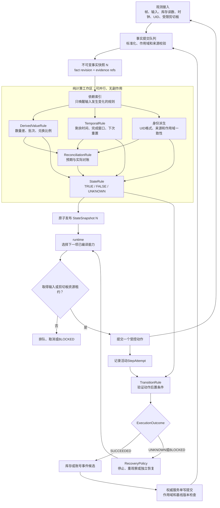

# 确定性派生、状态求值与冲突安全调度构想

> 文档性质：说明数量、比例、时间、状态、运行调度和权威账本怎样高效协作，并补充游戏UID与受限剪切板读取的账号作用域识别构想
>
> 当前状态：`HYPOTHESIS`
>
> 前置分析：[多领域小图、动态规划投影与声明式收束构想](多领域小图、动态规划投影与声明式收束构想.md) · [关系网规划优化与视觉反馈闭环分析](关系网规划优化与视觉反馈闭环分析.md)
>
> 架构依据：[当前架构共识](../../architecture/当前架构共识.md) · [项目初始目标与阶段路线](../../architecture/项目初始目标与阶段路线.md) · [目录与模块边界规则](../../architecture/目录与模块边界规则.md)
>
> 相关设计：[证据驱动的规则生成、实验验证与运行编译构想](../rule_synthesis/证据驱动的规则生成、实验验证与运行编译构想.md) · [物品知识、实例账本与时效规则构想](../item_system/物品知识、实例账本与时效规则构想.md) · [材料规划、资源预算与公式知识构想](../resource_planning/材料规划、资源预算与公式知识构想.md) · [数值单位、误差容限与按需AI分析构想](../resource_planning/数值单位、误差容限与按需AI分析构想.md)

## 1. 核心问题

数量变化、兑换比例、生产时长、活动窗口和完成时间都需要确定性计算，但这些计算不能直接改写游戏状态、库存或计划。

与此同时，连续截图、时间推进、库存读数和UI变化可能高频到达。如果所有规则都在每帧重新执行，系统会产生大量无效计算；如果多个模块同时写状态、库存或发送输入，又会出现竞态和错误归因。

因此需要同时解决：

- 数量、比例和时间怎样形成可复用派生事实；
- 派生事实怎样与状态规则组合；
- 哪些计算可以并行；
- 哪些副作用必须串行；
- 怎样拒绝迟到或过期结果；
- 时间规则怎样避免每帧轮询；
- 库存变化怎样经过账号作用域对账；
- 游戏UID和玩家信息怎样绑定当前账号或角色；
- 游戏复制按钮和系统剪切板怎样在不监控用户隐私的情况下提供直接证据。

## 2. 核心结论

> 性能主要来自只计算受影响的规则，而不是同时运行更多线程。

> 安全主要来自纯计算可并行、权威写入和物理输入必须串行。

> 状态规则消费派生事实，不直接调用OCR、时钟、剪切板、库存服务或输入执行器。

> 每轮计算基于不可变事实快照，旧结果不能覆盖新快照。

数量、比例、时间和状态之间推荐采用：

```text
原始观测和程序事实
-> 标准化事实
-> DerivedValueRule（派生值规则）
-> TemporalRule（时间规则）
-> ReconciliationRule（对账规则）
-> StateRule（状态规则）
-> StateSnapshot（状态快照）
-> TransitionRule（转换规则）
-> ExecutionOutcome（执行结果）
```

库存、账号映射和其他权威事实仍由各自服务在确定性校验后追加事件或生成新版本。

## 3. 推荐模块边界

| 逻辑边界 | 主要职责 | 调度方式 | 禁止事项 |
| --- | --- | --- | --- |
| 观测接入 | 接收帧、输入、数值、窗口、时钟、UID和受限剪切板事件 | 高频生产、有界缓冲 | 直接宣布业务状态 |
| 事实提交与快照装配 | 标准化来源、作用域、单位、时间和版本 | 按作用域串行提交 | 原地修改旧快照 |
| 依赖调度 | 根据变化字段选择需要重算的规则 | 事件驱动 | 每帧唤醒全部规则 |
| 派生规则求值 | 数量差、比例、批次、时间窗口和对账 | 纯函数，可并行 | 输入、网络、账本写入 |
| 状态求值 | 将基础与派生事实组合成三值状态 | 纯函数，可并行 | 修改事实以证明自身成立 |
| 状态发布 | 生成一致的状态快照版本 | 原子发布，单写 | 混合不同快照的结果 |
| `runtime`（运行调度） | 选择下一能力、处理停止、中断和恢复 | 按优先级协调 | 绕过资源租约直接输入 |
| 输入执行 | 提交一个受控动作并记录尝试 | 每个物理输入资源串行 | 多个计划同时控制桌面 |
| 库存服务 | 验证账号作用域和数量差量，追加库存事件 | 每个账号和角色作用域单写 | 根据奖励动画直接改数量 |
| 账号身份服务 | 验证UID候选并绑定账号或角色作用域 | 单写映射、版本化 | 把UID当成登录凭据 |
| 恢复调度 | 根据归因选择有限恢复 | 原尝试结束后运行 | 用恢复成功覆盖原失败 |

这些边界是逻辑所有权，不要求第一版全部拆成独立进程或微服务。

## 4. 总体运行流程



这张图存在受控循环：

```text
快照N
-> 派生和状态N
-> 执行一个动作
-> 产生新证据
-> 快照N+1
-> 验证动作结果
```

旧快照永远不修改。任何库存、账号映射或状态变化都通过新事实和下一版快照体现。

## 5. 快照和结果版本隔离

每项规则求值至少绑定：

```text
scope_id
snapshot_revision
rule_revision
input_fact_revisions
evaluated_at
valid_until
```

其中：

- `scope_id`区分游戏、窗口、账号、角色和区服；
- `snapshot_revision`说明计算基于哪一版事实；
- `rule_revision`固定使用的计算逻辑；
- `input_fact_revisions`用于检查依赖是否仍然相同；
- `valid_until`说明结果可以复用到什么时候。

工作线程完成计算后，提交端重新检查这些版本。如果当前事实已经变化，旧结果直接丢弃或保留为调试记录，不能写入当前状态。

推荐循环：

```text
StateSnapshot N
-> 计算派生值N
-> 计算状态N
-> 提交动作
-> 收集新观测
-> 生成StateSnapshot N+1
-> 计算派生值N+1
-> 对账和验证
```

不能在计算快照N时一边读取、一边把结果写回快照N，否则容易形成状态自证和循环依赖。

## 6. 依赖驱动调度

每条规则在编译时声明输入事实。调度器建立反向依赖索引：

```text
inventory.coin
-> usable_coin
-> exchange_available
-> material_shortage

clock.server
-> source_available
-> production_due_for_check

account.player_uid
-> account_scope_matches
-> inventory_write_allowed
```

某个事实变化时，只标记其传递依赖为失效。

例如：

```text
ui.page变化
-> 不重算所有库存配方

coin数量变化
-> 不重算无关的音量设置状态

服务器时间跨过每日重置点
-> 只重算依赖该重置规则的来源和状态
```

性能首先来自减少无效工作，其次才是并行执行。

## 7. 并行和串行边界

### 7.1 可以并行

满足以下条件的规则可以进入普通工作池：

- 输入来自固定快照；
- 不访问网络、设备、剪切板或可变缓存；
- 不发送输入；
- 不写库存、账号映射或活动状态；
- 同一输入和规则版本产生相同输出。

例如：

```text
数量差
兑换批次
比例换算
剩余时间
完成时间范围
UID格式归一化
状态谓词
```

第一版即使采用单线程事件循环，也应保持这些纯函数边界。以后根据性能分析增加工作线程，不需要改变规则契约。

### 7.2 必须串行

以下操作必须通过单写服务或资源租约：

- 物理键鼠输入；
- 点击游戏内复制按钮；
- 在限定窗口读取系统剪切板；
- 追加库存账本事件；
- 修改账号或角色作用域映射；
- 发布当前状态快照；
- 停止、释放按键和恢复输入归属；
- 执行购买、删除、消耗等不可逆动作。

串行不表示整个系统只能处理一件事。纯计算和无关观测仍可并行，只是同一个受保护资源在同一时刻只能有一个所有者。

## 8. 数量和兑换比例

### 8.1 数值类型

```text
物品数量、货币和次数
-> integer

精确兑换比例
-> Decimal、定点数或有理数

随机产出
-> range或distribution
```

精确兑换不应使用普通二进制`float`。批量兑换和制作还需要显式取整规则。

### 8.2 兑换示例

```text
兑换前：
coin = 100
token = 2

ExchangeRule（兑换规则）：
4 coin -> 1 token
本次兑换5批

兑换后：
coin = 80
token = 7
```

派生规则计算：

```text
coin_delta = -20
token_delta = +5
expected_coin_delta = -20
expected_token_delta = +5
```

状态规则可以判断兑换是否可用：

```text
EXCHANGE_AVAILABLE
=
source_available
+ usable_coin >= 20
+ remaining_limit >= 5
+ account_scope_matches
```

转换规则判断本次兑换是否成立：

```text
EXCHANGE_CONFIRMED
=
input_delivery_confirmed
+ coin_delta == -20
+ token_delta == +5
+ item_identity_matches
+ account_scope_matches
+ inventory_scan_complete
```

奖励动画或按钮消失只能成为支持证据。无法读取操作后库存时，结果保持`UNKNOWN`，不能直接向`InventoryLedger`（库存实例账本）写入代币增加事件。

## 9. 时间处理和状态结合

### 9.1 时钟域

时间事实必须绑定`ClockDomain`（时钟域）：

```text
WALL_CLOCK
-> 现实时间

SERVER_CLOCK
-> 服务器重置时间

GAME_WORLD_CLOCK
-> 游戏内部昼夜时间

EVENT_PHASE
-> 活动阶段

ACQUISITION_ELAPSED
-> 获得物品后的经过时间

ACTIVATION_ELAPSED
-> 激活或生产开始后的经过时间
```

不同时钟域不能直接相减。服务器重置不能默认使用电脑本地时间，游戏内昼夜也不能用现实时间替代。

### 9.2 时间结果使用范围

生产或派遣时间更适合输出：

```text
completion_window
=
[start_time + minimum_duration,
 start_time + conservative_duration]
```

状态规则随后判断：

```text
now < earliest_completion
-> RUNNING

now进入completion_window
-> DUE_FOR_CHECK

出现可领取后置证据
-> READY_TO_COLLECT

领取后库存对账通过
-> COLLECTED

时钟来源、暂停规则或开始时间不确定
-> UNKNOWN
```

时间达到预计终点不等于任务已经完成。服务器延迟、离线暂停、加速、容量阻塞和需要手动领取都可能改变结果。

### 9.3 避免逐帧倒计时

时间规则输出：

```text
remaining_range
valid_until
next_evaluation_at
```

调度器直接安排在下一个关键阈值重新求值。只有时钟同步、加速、暂停或其他依赖事实变化时，才提前使缓存失效。

## 10. 状态规则怎样消费派生事实

状态规则不应写成直接调用业务函数：

```text
StateRule
-> calc_exchange()
-> check_timer()
-> read_clipboard()
```

推荐通过带版本的派生事实连接：

```text
derived.exchange.token_delta = +5
derived.exchange.reconciliation = MATCHED
derived.production.remaining_range = [0s, 30s]
derived.production.due_for_check = TRUE
identity.current_scope_match = TRUE
```

状态规则只声明依赖：

```text
state.production_ready
=
all_of(
  derived.production.due_for_check,
  ui.ready_marker == TRUE,
  identity.current_scope_match == TRUE
)
```

规则编译器按照依赖DAG先求基础事实，再求派生事实，最后求状态和转换结果。状态规则没有权限反向修改数量、时钟或身份事实。

## 11. 账号和角色作用域

### 11.1 UID可以提供稳定身份候选

许多二次元游戏会在右下角、左下角或玩家信息页显示UID、玩家ID或其他稳定唯一值。这些信息适合用于区分账号或角色作用域，但不能直接等同于外部登录凭据。

候选来源包括：

```text
本人常驻HUD角落中的UID
本人玩家信息页中的UID
本人信息页复制按钮得到的UID
账号、区服或角色选择页面中的稳定标识
```

昵称、头像、角色名和等级通常不唯一，只能作为支持证据。

### 11.2 UID可能属于不同层级

不同游戏中的UID可能代表：

- 整个游戏账号；
- 某个区服中的角色；
- 某个平台账号下的游戏档案；
- 某个服务器或分区中的玩家编号。

因此不能提前假定一个UID全局唯一。建议使用组合身份候选：

```text
game_profile_id
+ platform_or_channel
+ server_or_region
+ observed_player_uid
+ optional_character_slot
```

UID能否推导区服、渠道或账号层级，必须由经过验证的游戏规则决定，不能只根据数字前缀猜测。

### 11.3 不能识别其他玩家的UID为当前账号

游戏可能在好友页、联机队伍、排行榜、聊天名片或其他玩家信息页显示UID。任何UID观测都必须携带界面语义和ROI上下文：

```text
identity_surface
├── SELF_HUD
├── SELF_PROFILE
├── ACCOUNT_SELECTION
├── OTHER_PLAYER_PROFILE
├── PARTY_MEMBER
└── UNKNOWN
```

只有`SELF_HUD`、`SELF_PROFILE`或经过验证的账号选择界面证据才能参与当前作用域绑定。其他玩家页面中的UID必须明确隔离。

### 11.4 身份证据强度

以下排序只是实验假设，不是固定全局等级：

```text
在已验证本人信息页点击复制后读取到的UID
-> 较强直接候选

本人信息页中稳定OCR得到的UID
-> 强视觉候选

常驻HUD固定ROI连续多帧一致的UID
-> 稳定运行候选

昵称、头像或角色等级
-> 支持候选
```

复制结果和OCR结果一致时可以提高身份候选强度；其中任一来源缺失不等于账号已经变化。

### 11.5 UID变化处理

如果新鲜证据显示当前UID与活动作用域不一致：

```text
停止新的库存和高风险写入
-> 结束或阻塞依赖旧账号的StepAttempt
-> 固化窗口、UID来源和相关证据
-> 使旧库存视图、计划、缓存和授权失效
-> 解析已有账号档案或创建待确认候选
-> 重新确认账号、角色和区服作用域
-> 基于新作用域重新规划
```

UID暂时不可见、被遮挡或OCR失败时应返回`UNKNOWN`，不能自动解释为账号切换。

UID是个人或账号标识信息。它通常不是认证秘密，但本地日志、截图导出、训练数据和共享报告仍应遵守脱敏、访问和保留策略。普通运行记录尽量引用本地不透明`scope_id`，而不是到处复制原始UID。

## 12. 受限剪切板读取

### 12.1 不做持续剪切板监听

剪切板可能包含密码、令牌、聊天内容、文件路径和其他与游戏无关的信息。因此系统不能：

- 在后台持续读取每次剪切板变化；
- 启动时读取并记录现有剪切板内容；
- 把原始剪切板送入日志、模型、遥测或普通证据包；
- 为了恢复用户剪切板而默认保存原有敏感内容；
- 允许任意声明规则调用系统剪切板。

剪切板读取只能由受信、明确注册的能力在限定上下文中执行。

### 12.2 推荐读取流程

```text
确认目标游戏窗口和窗口代次
-> 确认当前是本人信息页
-> 确认目标是该页面的UID复制按钮
-> 获取物理输入和clipboard_read资源租约
-> 只读取剪切板变化序号，不读取原内容
-> 点击经过验证的复制按钮
-> 在短时间窗口内等待剪切板序号变化
-> 一次性读取新文本
-> 按该游戏已验证格式解析UID候选
-> 保存提取后的UID候选和最小来源元数据
-> 清除内存中的无关原始文本
-> 释放资源租约
```

这里的`clipboard_read`只是说明性资源名，不是已经确定的公共契约。

### 12.3 读取有效性门禁

剪切板UID候选成立至少需要：

- 点击前后剪切板变化序号不同；
- 变化发生在当前`StepAttempt`的限定时间窗内；
- 当前窗口、页面和按钮身份仍然有效；
- 内容满足当前游戏的长度、字符集和格式规则；
- 内容能够解析为单一UID候选；
- 没有并发程序在同一时间修改剪切板；
- 游戏、服务器和角色上下文与候选档案兼容。

不满足时返回`UNKNOWN`并丢弃原始文本，不能把用户之前剪切板中的数字误认为游戏UID。

### 12.4 剪切板冲突

剪切板是桌面级共享资源，可能与用户或其他应用冲突。应采取：

- 只在用户启用该功能或当前受控能力需要时读取；
- 一个时刻只允许一个剪切板能力持有租约；
- 不在长时间窗口中等待；
- 检测到外部变化时结束当前读取并返回`UNKNOWN`；
- 剪切板被锁定或API失败时有限重试，不重复点击复制按钮；
- 默认不读取和恢复点击前的原内容，避免为了“恢复”而持久化用户秘密；
- 明确告知复制按钮会由游戏覆盖当前剪切板。

若未来需要恢复用户原剪切板，必须单独设计仅存在于内存、短生命周期、禁止日志和崩溃转储的敏感数据路径，不能沿用普通事实或证据存储。

## 13. UID、剪切板和状态规则的连接

UID相关处理仍然遵循派生事实链：

```text
HUD或本人信息页图像
-> UID文本候选

复制按钮操作
-> 受限剪切板文本候选

候选归一化
+ 游戏、区服和页面上下文
+ 历史账号映射
-> identity_candidate

OCR和剪切板候选一致
-> identity_match_evidence

账号身份服务确定性校验
-> active_scope_revision更新

新事实快照
-> account_scope_matches状态重新求值
```

状态输出可以暂时使用以下说明性候选：

```text
MATCHED
-> 当前UID与活动账号或角色作用域一致

CANDIDATE
-> 发现稳定新UID，但尚未完成绑定

CONFLICT
-> 新鲜直接证据与活动作用域冲突

UNKNOWN
-> UID不可见、被遮挡、来源不属于本人或证据不足
```

这些是账号身份专业状态，不扩展公共`ExecutionOutcome`。

依赖账号和库存的高风险能力应要求：

```text
identity.current_scope_status == MATCHED
```

普通低风险观察可以在`UNKNOWN`下继续，但不能提交库存消费、购买、删除、账号切换或其他不可逆操作。

## 14. 完整兑换运行例子

```text
事实快照42：
window_instance = game_a
account_scope = scope_17
identity_status = MATCHED
coin = 100
token = 2
server_time = 12:00
exchange_window = OPEN

并行派生：
usable_coin = 100
maximum_batches = 25
source_available = TRUE
account_scope_matches = TRUE

状态：
EXCHANGE_AVAILABLE = TRUE

runtime取得输入租约：
执行“兑换5批”

事实快照43：
coin = 80
token = 7

并行派生：
coin_delta = -20
token_delta = +5
expected_delta = (-20, +5)

对账：
MATCHED

转换结果：
SUCCEEDED

库存服务：
校验window_instance、account_scope和快照基线
-> 追加两条正式库存变化事件
-> 生成事实快照44
```

如果兑换期间检测到UID与`scope_17`冲突：

```text
identity_status = CONFLICT
-> 禁止向scope_17追加库存事件
-> 当前兑换结果保持UNKNOWN或进入归因
-> 固化前后数量和身份冲突证据
-> 重新确认账号作用域
```

不能把新账号中的数量变化写入旧账号账本。

## 15. 优先级和过载处理

推荐优先级：

```text
P0
停止、释放按键、窗口身份和账号冲突

P1
活动StepAttempt的后置验证和输入归属

P2
当前目标依赖的数量、时间、身份和状态规则

P3
后台统计、关系发现、候选规则和非关键派生
```

过载时：

- 可以合并未被动作引用的中间帧；
- 可以延迟后台统计和候选规则分析；
- 可以取消基于旧快照的未完成求值；
- 可以复用仍在`valid_until`内的派生事实；
- 不能丢失原始输入事件；
- 不能丢失活动尝试的前后证据；
- 不能丢失权威账本提交；
- 不能延迟停止和按键释放；
- 不能把账号冲突降级为普通后台任务。

## 16. 最小验证方案

### 16.1 数量和比例

固定手工数据验证：

- `100 coin + 2 token`经过`4:1`兑换5批后得到`80 coin + 7 token`；
- OCR数量候选不唯一时返回`UNKNOWN`；
- 批次不足和兑换上限不足时状态为不可用；
- 随机额外产出使用范围而不是严格等值。

### 16.2 时间

验证：

- 正常30分钟生产；
- 离线暂停；
- 时间已到但没有领取标记；
- 服务器重置时间与本地时间不同；
- 加速事实变化后旧时间缓存失效。

### 16.3 UID

使用录制或人工构造样本验证：

- HUD固定ROI连续显示同一UID；
- 本人信息页与HUD UID一致；
- 好友页显示另一UID但不得切换当前作用域；
- UID被遮挡或隐藏时返回`UNKNOWN`；
- 切换测试账号后旧库存、计划和缓存失效。

### 16.4 剪切板

使用模拟剪切板适配器验证：

- 点击已验证复制按钮后得到符合格式的UID；
- 点击前已有数字内容但剪切板未变化，不得误读；
- 其他程序并发修改剪切板时返回`UNKNOWN`；
- 内容不符合当前游戏格式时立即丢弃；
- 原始无关剪切板内容不进入日志、证据或模型；
- 剪切板被锁定时不重复点击复制按钮。

## 17. 与当前阶段的关系

当前第一阶段仍只建设`Trace Core`（轨迹核心）：

```text
连续截图
+ 键鼠记录
+ 窗口身份
+ 统一单调时间线
+ 帧缓冲
+ 证据保存
+ 离线回放
```

本构想不要求第一阶段接入OCR、数量识别、UID解析、剪切板读取、规则工作池、库存服务或自动兑换。持续截图中可能已经包含角落UID，因此UID应按个人标识信息管理；导出、共享或训练数据需要脱敏，但这不把UID识别提升为首期验收项。

后续推荐顺序：

```text
Trace Core可靠记录
-> 离线数量差和时间规则
-> 不可变快照与依赖索引
-> 单线程确定性状态求值
-> 一个安全兑换回放
-> UID视觉候选实验
-> 模拟剪切板适配器
-> 账号作用域对账
-> 必要时并行纯计算工作池
```

先通过性能测量确认瓶颈，再决定线程、进程或缓存策略。不要在没有数据时提前拆成复杂分布式系统。

## 18. 当前结论

数量、比例、时间和UID识别都可以通过确定性派生规则进入状态系统，但它们只能提供带来源、作用域、版本和有效期的事实。

```text
纯计算规则
-> 可以并行和缓存

状态发布、库存提交和账号绑定
-> 单写、版本检查和原子发布

物理输入和剪切板读取
-> 资源租约和限定时间窗

迟到结果
-> 因快照或规则版本不匹配而丢弃

账号冲突
-> 优先停止写入并重新确认作用域
```

最终结构的重点不是让模块互相直接调用，而是让它们通过不可变事实快照和事件候选产生影响。这样既能按依赖并行计算，又能把真实副作用集中到少数可审计、可停止、不会互相覆盖的入口。

> 运行速度依赖少算、缓存和按阈值唤醒；一致性依赖不可变快照、作用域隔离、单写服务和资源租约。UID与剪切板只能增强账号绑定证据，不能替代登录、授权或库存对账。
