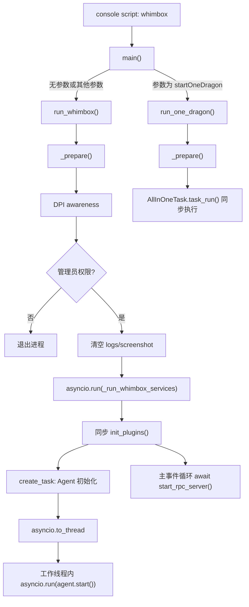

# Whimbox 2.5.4 启动、配置与运行时分析

> 基线：Whimbox `2.5.4`。本文只陈述当前源码可以确认的行为；“待验证”项不作为既成事实。

## 1. 分析范围

本文覆盖：

- Python 包元数据、依赖、命令行入口和包资源声明；
- 后端服务模式与 `startOneDragon` 直跑模式的启动链；
- 运行目录、包目录、资源目录之间的路径边界；
- 默认配置加载、用户配置迁移、内存读写与持久化；
- 启动过程中的同步、异步与工作线程边界。

主要源码：[`pyproject.toml`](../../../../../reference_repos/whimbox/pyproject.toml#L1)、[`main.py`](../../../../../reference_repos/whimbox/whimbox/main.py#L1)、[`path_lib.py`](../../../../../reference_repos/whimbox/whimbox/common/path_lib.py#L1)、[`config.py`](../../../../../reference_repos/whimbox/whimbox/config/config.py#L1)、[`default_config.py`](../../../../../reference_repos/whimbox/whimbox/config/default_config.py#L1) 和 [`assets/default_config.json`](../../../../../reference_repos/whimbox/whimbox/assets/default_config.json#L1)。

## 2. 核心结论

1. Whimbox 的正式入口是 `whimbox.main:main`，运行时严格要求 Python `3.12.8`；当前版本号由包元数据给出，而不是源码常量。[`pyproject.toml`](../../../../../reference_repos/whimbox/pyproject.toml#L5)
2. 服务模式先执行 DPI、管理员权限和临时截图清理，再加载插件；随后 RPC 常驻主事件循环，Agent 初始化被放入工作线程，并在该线程中建立独立事件循环。[`main.py`](../../../../../reference_repos/whimbox/whimbox/main.py#L24)
3. `configs/`、`logs/`、`scripts/` 和 `dev_mode` 都以**进程当前工作目录**为基准；内置 `assets/`、`plugins/` 则以安装包目录为基准。因此 PyCharm 的 Working Directory 会直接改变用户数据位置。[`path_lib.py`](../../../../../reference_repos/whimbox/whimbox/common/path_lib.py#L10)
4. `global_config` 在导入 `config.py` 时立即构造。首次构造会创建/复制配置；已有配置会按默认配置迁移、删除未知项并立即重写磁盘。[`config.py`](../../../../../reference_repos/whimbox/whimbox/config/config.py#L225)
5. 默认 JSON 既是默认值源，也是配置结构白名单和描述元数据源。运行时用户配置仍保存 `{value, description}`，并非扁平键值表。[`default_config.json`](../../../../../reference_repos/whimbox/whimbox/assets/default_config.json#L1)

## 3. 启动架构



## 4. 模块职责表

| 模块 | 核心对象/函数 | 运行时职责 | 直接副作用 |
|---|---|---|---|
| [`pyproject.toml`](../../../../../reference_repos/whimbox/pyproject.toml#L1) | `[project]`、`[project.scripts]` | 固定版本、Python 版本、依赖、入口和包资源 | 安装时决定哪些资源进入发行包 |
| [`main.py`](../../../../../reference_repos/whimbox/whimbox/main.py#L10) | `_clear_temp_file`、`_prepare`、`run_whimbox`、`_run_whimbox_services`、`run_one_dragon`、`main` | 进程准备、模式分派、服务生命周期 | 清理截图、启动线程/事件循环、可能退出进程 |
| [`path_lib.py`](../../../../../reference_repos/whimbox/whimbox/common/path_lib.py#L10) | 路径常量、`find_game_*` | 划分包内资源和工作目录数据；委托平台路径实现 | 模块导入时冻结当前工作目录对应的路径常量 |
| [`default_config.py`](../../../../../reference_repos/whimbox/whimbox/config/default_config.py#L10) | `DEFAULT_CONFIG`、`get_default_value`、`get_config_description` | 读取默认配置及类型转换 | 导入时打开并解析内置 JSON |
| [`config.py`](../../../../../reference_repos/whimbox/whimbox/config/config.py#L10) | `GlobalConfig`、`global_config` | 单例配置迁移、读写、保存、重载 | 导入时创建/迁移/重写 `configs/config.json` |
| [`default_config.json`](../../../../../reference_repos/whimbox/whimbox/assets/default_config.json#L1) | 10 个 section、72 个配置项 | 默认值、描述、允许存在的 section/key 集合 | 被复制为首份用户配置 |

## 5. 包、依赖与发行边界

### 5.1 包约束

[`pyproject.toml`](../../../../../reference_repos/whimbox/pyproject.toml#L5) 声明：

- 包名和版本为 `whimbox 2.5.4`；
- `requires-python = "==3.12.8"`，不是宽松的 `>=3.12`；
- 控制台命令 `whimbox` 映射到 `whimbox.main:main`；
- 运行依赖分为键鼠控制、LangChain/LangGraph、日志、OCR/推理、科学计算和平台专用依赖。[`pyproject.toml`](../../../../../reference_repos/whimbox/pyproject.toml#L25)

平台依赖使用环境标记：Windows 安装 `win10toast`，macOS 安装 `mss` 和 Cocoa/Quartz 绑定。项目分类同时声明 Windows 与 macOS，但 `_prepare()` 的管理员权限语义仍需在两个平台分别验证。

### 5.2 包资源

Setuptools 只发现 `whimbox*` 包。[`pyproject.toml`](../../../../../reference_repos/whimbox/pyproject.toml#L55) 包资源显式包含：

- `whimbox.assets` 下的 JSON、TXT、YAML、Markdown、ICO、PNG、JPG；
- `whimbox.plugins` 下的 JSON，即插件清单；
- 排除日志、字节码和四张开发用原始大地图，但保留运行所需的派生地图图像。[`pyproject.toml`](../../../../../reference_repos/whimbox/pyproject.toml#L59)

这意味着新增非上述后缀的运行资源，或在其他包下新增资源文件时，源码环境可能正常，安装包却可能缺文件。

## 6. 启动链逐函数分析

### 6.1 `main()`：模式分派

[`main()`](../../../../../reference_repos/whimbox/whimbox/main.py#L83) 只识别一个特殊参数 `startOneDragon`：

- 命中时进入 `run_one_dragon()`；
- 无参数或传入任意其他参数都进入 `run_whimbox()`。

因此它不是完整的参数解析器；拼错参数不会报错，而会启动常驻服务。

### 6.2 `_prepare()`：所有模式共享的前置条件

[`_prepare()`](../../../../../reference_repos/whimbox/whimbox/main.py#L24) 顺序执行：

1. 启用 DPI awareness；
2. 动态导入并调用 `is_admin()`；失败时记录错误并调用 `exit()`；
3. 通过 `importlib.metadata.version("whimbox")` 输出安装版本，源码未安装时显示 `dev`；
4. 调用 `_clear_temp_file()`。

[`_clear_temp_file()`](../../../../../reference_repos/whimbox/whimbox/main.py#L10) 创建 `logs/screenshot/`，删除其全部直接子项；目录递归删除，文件直接删除，单项 `OSError` 被忽略。因此截图目录每次启动不是历史存档，而是临时区。

### 6.3 `run_whimbox()`：服务模式

[`run_whimbox()`](../../../../../reference_repos/whimbox/whimbox/main.py#L38) 在准备完成后才导入插件运行时、Agent 单例和 RPC Server，最后用 `asyncio.run()` 建立进程主事件循环。

[`_run_whimbox_services()`](../../../../../reference_repos/whimbox/whimbox/main.py#L48) 的实际顺序是：

1. 在主事件循环线程中同步执行 `init_plugins()`；
2. 创建 `_start_agent_background()` 的异步任务；
3. 立即 `await start_rpc_server()`，RPC 可以在 Agent 尚未 ready 时接收请求；
4. Agent 初始化通过 `asyncio.to_thread()` 进入工作线程；工作线程函数又通过 `asyncio.run(whimbox_agent.start())` 建立第二个事件循环；
5. RPC 返回或抛错时，取消尚未完成的 Agent 初始化任务并 `gather(..., return_exceptions=True)`。

线程/异步边界如下：

| 边界 | 承载内容 | 说明 |
|---|---|---|
| 主线程、主事件循环 | 插件加载、RPC 监听、WebSocket 请求与广播 | 插件加载是同步阶段；RPC 服务常驻 |
| `agent_task` | 等待 Agent 后台初始化 | 与 RPC 并发启动 |
| `asyncio.to_thread` 工作线程 | `_run_agent_start` | 避免 Agent 初始化阻塞 RPC 主循环 |
| 工作线程内事件循环 | `whimbox_agent.start()` | 与 RPC 主事件循环是两个不同 loop |

### 6.4 `run_one_dragon()`：直跑模式

[`run_one_dragon()`](../../../../../reference_repos/whimbox/whimbox/main.py#L72) 完成 `_prepare()` 后直接构造 `AllInOneTask(session_id="default")` 并同步调用 `task_run()`。它不初始化插件、不启动 Agent、不启动 RPC，也没有服务生命周期管理，适合分析确定性一条龙任务本身。

## 7. 路径模型

[`path_lib.py`](../../../../../reference_repos/whimbox/whimbox/common/path_lib.py#L10) 在模块导入时计算并保存：

| 常量 | 基准 | 典型位置/意义 |
|---|---|---|
| `ROOT_PATH` | `path_lib.py` 的上两级目录 | `whimbox/` 包目录 |
| `ASSETS_PATH` | `ROOT_PATH` | 包内 `whimbox/assets/` |
| `PLUGINS_PATH` | `ROOT_PATH` | 包内 `whimbox/plugins/` |
| `CONFIG_PATH` | `os.getcwd()` | `<工作目录>/configs/` |
| `LOG_PATH` | `os.getcwd()` | `<工作目录>/logs/` |
| `SCRIPT_PATH` | `os.getcwd()` | `<工作目录>/scripts/` |
| `IS_DEV_MODE` | `os.getcwd()` | 导入时检查 `<工作目录>/dev_mode` 是否存在 |

`find_game_launcher_folder()` 与 `find_game_folder()` 不包含平台判断细节，而是委托 `platform.factory.get_path_manager()` 返回的平台实现。[`path_lib.py`](../../../../../reference_repos/whimbox/whimbox/common/path_lib.py#L22)

路径常量只在导入时求值。运行中再调用 `os.chdir()` 不会同步更新这些常量，会形成“当前目录已变、配置路径未变”的混合状态。

## 8. 默认配置结构

[`assets/default_config.json`](../../../../../reference_repos/whimbox/whimbox/assets/default_config.json#L1) 的统一叶节点形态是：

```json
{
  "Section": {
    "key": {
      "value": "运行值或数组",
      "description": "面向设置界面的说明"
    }
  }
}
```

当前结构：

| Section | 数量 | 用途 |
|---|---:|---|
| [`General`](../../../../../reference_repos/whimbox/whimbox/assets/default_config.json#L2) | 3 | 通用、CV、OCR 调试开关 |
| [`Whimbox`](../../../../../reference_repos/whimbox/whimbox/assets/default_config.json#L16) | 4 | 停止热键、启动器、高性能和通知 |
| [`BackgroundTask`](../../../../../reference_repos/whimbox/whimbox/assets/default_config.json#L34) | 6 | 后台自动功能 |
| [`Agent`](../../../../../reference_repos/whimbox/whimbox/assets/default_config.json#L60) | 4 | 模型、供应商、Base URL、API Key |
| [`OneDragon`](../../../../../reference_repos/whimbox/whimbox/assets/default_config.json#L78) | 17 | 一条龙业务参数 |
| [`OneDragonDefaultSteps`](../../../../../reference_repos/whimbox/whimbox/assets/default_config.json#L154) | 8 | 内置步骤启停 |
| 三个自定义步骤 section | 3 | 旧版、前置、后置步骤列表 |
| [`Keybinds`](../../../../../reference_repos/whimbox/whimbox/assets/default_config.json#L206) | 27 | 游戏按键映射 |

布尔和部分数字默认值使用字符串表达，而自定义步骤、周本目标等可使用数组。因此调用者必须使用合适的读取方法，不能假设 `value` 永远是字符串。

## 9. 配置系统逐函数分析

### 9.1 默认值模块

[`default_config.py`](../../../../../reference_repos/whimbox/whimbox/config/default_config.py#L7) 在导入时直接解析内置 JSON，形成进程级 `DEFAULT_CONFIG`。

- [`get_default_value()`](../../../../../reference_repos/whimbox/whimbox/config/default_config.py#L14) 按请求的 `bool/int/float/str` 转换；任何异常都返回该类型的零值。
- [`get_config_description()`](../../../../../reference_repos/whimbox/whimbox/config/default_config.py#L51) 缺键时返回空字符串。

这种容错使缺项不会立刻失败，但也会把 JSON 结构损坏、类型错误和真正缺项统一折叠成零值。

### 9.2 `GlobalConfig` 单例和初始化

[`GlobalConfig`](../../../../../reference_repos/whimbox/whimbox/config/config.py#L10) 用 `__new__` 保存 `_instance`，用类属性 `_initialized` 避免重复初始化。[`__init__`](../../../../../reference_repos/whimbox/whimbox/config/config.py#L25) 设置 `configs/config.json` 后依次迁移、加载，并最终标记已初始化。

模块尾部立即执行 `global_config = GlobalConfig()`。[`config.py`](../../../../../reference_repos/whimbox/whimbox/config/config.py#L225) 因此任何间接导入都可能创建目录和写配置文件。

### 9.3 `_update_user_config()`：迁移与白名单同步

[`_update_user_config()`](../../../../../reference_repos/whimbox/whimbox/config/config.py#L38) 有两条路径：

- 文件不存在：创建 `configs/`，把内置默认 JSON完整复制为用户配置；
- 文件存在：解析用户 JSON，补齐新增 section/key，刷新已有项的 `description`，迁移旧鼠标按键中文名，迁移旧版 `realm_target` 字符串为数组，删除默认配置中已不存在的 section/key，最后无条件重写 JSON。

迁移规则的实质是：默认配置决定结构，用户配置只保留仍被默认结构承认的值。自定义私有键会在下次进程启动时被删除。

### 9.4 读取 API

[`get()`](../../../../../reference_repos/whimbox/whimbox/config/config.py#L109) 返回内存中原始 `value`；虽然签名标注 `str`，实际可能是列表或其他 JSON 类型。缺键且显式传入 `default` 时会 `str(default)`，与原值路径的类型行为不同。

[`get_int()`](../../../../../reference_repos/whimbox/whimbox/config/config.py#L129)、[`get_float()`](../../../../../reference_repos/whimbox/whimbox/config/config.py#L149)、[`get_bool()`](../../../../../reference_repos/whimbox/whimbox/config/config.py#L169) 执行类型转换，失败后优先返回调用者默认值，否则转向内置默认值。`get_bool()` 假设值支持 `.lower()`；若内存值为真正的 JSON boolean，会进入异常回退路径。

### 9.5 写入、保存与重载

- [`set()`](../../../../../reference_repos/whimbox/whimbox/config/config.py#L190) 只更新内存，保留已有或默认描述；修改 `Keybinds` 时立即调用全局 `keybind.update_keybind()`，但不会自动保存。
- [`save()`](../../../../../reference_repos/whimbox/whimbox/config/config.py#L211) 把整个内存对象覆盖写回 JSON，异常只返回 `False`。
- [`reload()`](../../../../../reference_repos/whimbox/whimbox/config/config.py#L220) 只重新读取文件，不重新执行结构迁移。

没有内部锁、事务或原子替换文件机制；其设计前提更接近单进程、低并发配置更新。

## 10. 配置副作用与扩展方式

### 10.1 已确认副作用

1. 导入 `config.py` 即可能创建、迁移和重写用户配置。
2. 已有配置每次首次初始化都会被格式化为四空格 JSON，并刷新全部描述。
3. 删除默认项等同于在用户下次启动时删除对应用户值。
4. 修改 Keybinds 的内存值会立即刷新运行时键位，即使之后保存失败。
5. 工作目录改变会产生另一套 `configs/logs/scripts`，看起来像“配置丢失”。

### 10.2 新增配置项

推荐流程：

1. 在 [`default_config.json`](../../../../../reference_repos/whimbox/whimbox/assets/default_config.json#L1) 的合适 section 新增 `{value, description}`；
2. 使用 `get/get_int/get_float/get_bool` 中与数据形态相符的方法；
3. 若前端需要选项，补充设置选项资源和对应 RPC 元数据逻辑；
4. 测试“全新配置复制”和“旧配置迁移”两条路径；
5. 数组/对象值不要通过字符串读取假设传播到业务层。

新增配置 section/key 后，迁移器会自动补齐；但重命名不是自动迁移，必须在 `_update_user_config()` 中增加显式兼容规则，否则旧值会被删、新值回到默认。

## 11. 调试入口

建议断点：

| 目标 | 断点 |
|---|---|
| 确认模式分派 | [`main()`](../../../../../reference_repos/whimbox/whimbox/main.py#L83) |
| 确认权限/清理失败 | [`_prepare()`](../../../../../reference_repos/whimbox/whimbox/main.py#L24)、[`_clear_temp_file()`](../../../../../reference_repos/whimbox/whimbox/main.py#L10) |
| 确认插件、Agent、RPC 顺序 | [`_run_whimbox_services()`](../../../../../reference_repos/whimbox/whimbox/main.py#L48) |
| 确认工作目录影响 | [`path_lib.py` 路径常量](../../../../../reference_repos/whimbox/whimbox/common/path_lib.py#L10) |
| 观察启动迁移 | [`GlobalConfig._update_user_config()`](../../../../../reference_repos/whimbox/whimbox/config/config.py#L38) |
| 观察实际内存配置 | [`GlobalConfig._load_config()`](../../../../../reference_repos/whimbox/whimbox/config/config.py#L97) |
| 跟踪设置写入与键位刷新 | [`GlobalConfig.set()`](../../../../../reference_repos/whimbox/whimbox/config/config.py#L190) |

PyCharm 调试前先检查：解释器是 Python 3.12.8；Working Directory 是仓库根目录；不要把断点只设在 `whimbox_agent.start()` 后面，因为它运行于另一个线程的事件循环。

## 12. 风险与待验证点

### 12.1 源码已确认的风险

- **配置迁移是破坏性白名单同步**：未知 section/key 会被删除，且没有迁移前备份。[`config.py`](../../../../../reference_repos/whimbox/whimbox/config/config.py#L83)
- **损坏配置可阻断导入**：已有 JSON 的读取发生在 `_update_user_config()`，此处没有异常恢复；`_load_config()` 的容错来不及执行。[`config.py`](../../../../../reference_repos/whimbox/whimbox/config/config.py#L48)
- **配置写入不是原子操作**：进程中断可能留下部分文件；并发更新没有锁或版本检查。[`config.py`](../../../../../reference_repos/whimbox/whimbox/config/config.py#L211)
- **路径依赖 CWD 且在导入时冻结**：IDE、快捷方式和安装命令从不同目录启动会使用不同数据目录。[`path_lib.py`](../../../../../reference_repos/whimbox/whimbox/common/path_lib.py#L13)
- **启动清理静默忽略失败**：无法删除的截图不会阻止启动，也没有具体文件日志。[`main.py`](../../../../../reference_repos/whimbox/whimbox/main.py#L15)
- **完成后异常的 Agent 初始化任务未被显式取回**：`finally` 只在 `agent_task` 未完成时 `gather`；若其已失败而 RPC 继续常驻，异常观测依赖 asyncio 的任务告警。[`main.py`](../../../../../reference_repos/whimbox/whimbox/main.py#L63)
- **参数解析过于宽松**：未知 CLI 参数会启动服务而不是报错。[`main.py`](../../../../../reference_repos/whimbox/whimbox/main.py#L83)
- **类型契约不一致**：`get()` 的注解和显式默认值转换都暗示字符串，但真实配置允许列表等类型。[`config.py`](../../../../../reference_repos/whimbox/whimbox/config/config.py#L109)

### 12.2 待运行验证

- macOS 下 `enable_dpi_awareness()` 与 `is_admin()` 的真实行为及是否会误退出；
- 发行包安装后，插件动态入口和全部地图/模型资源是否都包含在 wheel 中；
- Agent 在工作线程初始化、之后从 RPC 主循环调用时，各依赖对象是否存在事件循环亲和性问题；
- Windows 下截图目录存在被占用文件时的清理结果和后续截图命名冲突；
- 配置保存过程中强制终止进程后的恢复策略。

## 13. 关联文档

- [项目架构梳理](../项目架构梳理.md)
- [RPC 会话、事件与通道](02-RPC会话事件与通道.md)
- [插件与工具系统](03-插件与工具系统.md)
- [任务框架、调度与停止](04-任务框架调度与停止.md)
- [平台抽象与交互核心](07-平台抽象与交互核心.md)
- [并发模型、错误恢复与风险](12-并发模型错误恢复与风险.md)
