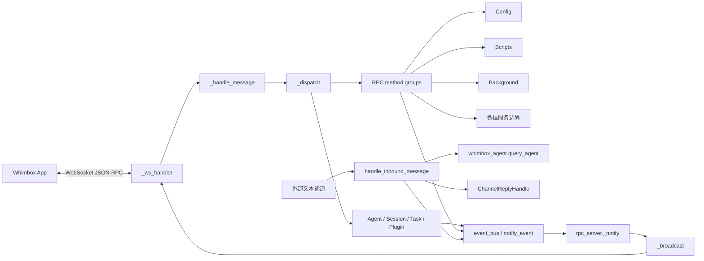
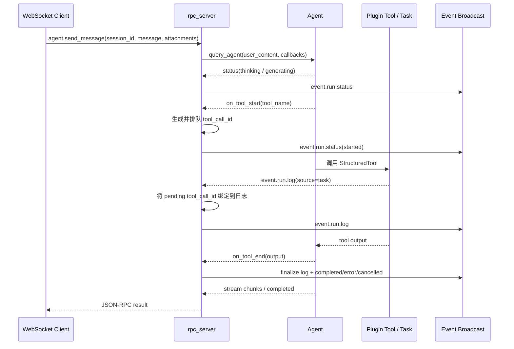

# Whimbox 2.5.4 RPC、会话、事件与通道分析

> 基线：Whimbox `2.5.4`。微信登录、协议和监控实现不在本文展开；这里只分析它接入通用通道和 RPC 分组的边界。

## 1. 分析范围

本文覆盖：

- WebSocket JSON-RPC 2.0 请求解析、方法分派、并发处理和错误映射；
- RPC 触发 Agent、任务、配置、脚本、后台功能和插件重载的入口；
- 运行时会话的创建、恢复、状态更新与关闭；
- 任务/Agent 状态、日志和消息如何跨线程进入 WebSocket 广播；
- `ChannelInboundMessage`、回复抽象、停止指令、忙碌判断和 Agent 回调；
- 全局停止热键及其与事件系统的关系。

主要源码：[`rpc_server.py`](../../../../../reference_repos/whimbox/whimbox/rpc_server.py#L1)、[`rpc_method_groups.py`](../../../../../reference_repos/whimbox/whimbox/rpc_method_groups.py#L1)、[`session_manager.py`](../../../../../reference_repos/whimbox/whimbox/session_manager.py#L1)、[`event_bus.py`](../../../../../reference_repos/whimbox/whimbox/event_bus.py#L1) 和 [`channel_gateway.py`](../../../../../reference_repos/whimbox/whimbox/channel_gateway.py#L1)。任务与 Agent 内部实现只在接口边界处引用。

## 2. 核心结论

1. RPC Server 是进程的控制中枢，不只处理协议：它还启动任务、维护运行状态关联、接收跨线程事件、管理停止热键并广播给所有 WebSocket 客户端。[`rpc_server.py`](../../../../../reference_repos/whimbox/whimbox/rpc_server.py#L30)
2. WebSocket 层为每条入站消息创建独立异步任务，同一连接上的请求可并发执行；发送锁保证帧不会并发写入，但不保证响应按请求到达顺序返回。[`rpc_server.py`](../../../../../reference_repos/whimbox/whimbox/rpc_server.py#L924)
3. `event_bus` 是单 notifier 的同步桥，不保存历史、不排队、不隔离异常。RPC 启动前发出的事件会被直接丢弃。[`event_bus.py`](../../../../../reference_repos/whimbox/whimbox/event_bus.py#L8)
4. RPC 主循环通过 `_notify()` 同时接收本 loop、其他事件循环和普通工作线程的事件；跨线程路径使用 `asyncio.run_coroutine_threadsafe()`。[`rpc_server.py`](../../../../../reference_repos/whimbox/whimbox/rpc_server.py#L63)
5. 运行时会话主要存在内存中；“恢复默认会话”只从 Agent JSONL 首行恢复一个 `session_id`，不恢复原运行状态、窗口句柄或 metadata。[`session_manager.py`](../../../../../reference_repos/whimbox/whimbox/session_manager.py#L89)
6. 通用通道层把外部文本统一转为 Agent 查询，并通过 `ChannelReplyHandle` 回写；同时把用户消息、Agent 消息和运行状态送入同一事件总线。[`channel_gateway.py`](../../../../../reference_repos/whimbox/whimbox/channel_gateway.py#L19)

## 3. 总体架构



## 4. 模块职责表

| 模块 | 核心对象/函数 | 职责 | 并发模型 |
|---|---|---|---|
| [`rpc_server.py`](../../../../../reference_repos/whimbox/whimbox/rpc_server.py#L42) | `_broadcast`、`_notify`、`_dispatch`、`_handle_message`、`_ws_handler`、`start_rpc_server` | JSON-RPC、连接、广播、任务入口、热键和事件归一 | 主 asyncio loop；任务执行转工作线程；热键来自 listener 线程 |
| [`rpc_method_groups.py`](../../../../../reference_repos/whimbox/whimbox/rpc_method_groups.py#L21) | 四组 `handle_*_method` 及配置辅助函数 | 将次级方法族从主分派器拆出 | 大部分同步运行于 RPC loop；微信方法为 async |
| [`session_manager.py`](../../../../../reference_repos/whimbox/whimbox/session_manager.py#L15) | `RuntimeSession`、`RuntimeSessionManager` | 内存运行会话及默认会话恢复 | `threading.Lock` 保护会话字典 |
| [`event_bus.py`](../../../../../reference_repos/whimbox/whimbox/event_bus.py#L6) | `set_notifier`、`emit_event` | 业务模块到 RPC notifier 的最小桥 | 同步函数；全局引用无锁 |
| [`channel_gateway.py`](../../../../../reference_repos/whimbox/whimbox/channel_gateway.py#L19) | 回复接口、入站消息模型、`handle_inbound_message` | 文本通道标准化、停止/忙碌控制、Agent 查询、回复和事件 | asyncio；回调中创建回复任务 |

## 5. RPC 启动与连接生命周期

### 5.1 `start_rpc_server()`

[`start_rpc_server()`](../../../../../reference_repos/whimbox/whimbox/rpc_server.py#L952) 执行：

1. 从 `RPC_CONFIG` 读取 host/port；
2. 保存当前运行 loop 到模块全局 `_loop`；
3. 通过 `set_notifier(notify_event)` 把进程事件总线接到 RPC 广播；
4. 后台调度微信服务自动恢复，不等待其完成；
5. 启动全局键盘监听器；
6. 以 10 MiB 单消息上限启动 `websockets.serve`；
7. 永久等待一个永不完成的 `Future`。

服务没有在本函数中提供显式 shutdown API；退出依赖外部取消、事件循环结束或异常。

### 5.2 `_ws_handler()`

[`_ws_handler()`](../../../../../reference_repos/whimbox/whimbox/rpc_server.py#L924) 在连接建立时：

- 把 websocket 加入 `_clients`；
- 为该连接建立一个 `asyncio.Lock`，统一保护响应和广播发送；
- 每收到一条文本消息就 `create_task(_process_and_reply(message))`；
- 保存 pending task，连接断开时取消并 `gather`；
- 最后移除客户端和发送锁。

请求任务并行意味着耗时请求不会阻塞同连接下一请求。发送锁只决定“某一时刻一个 send”，哪个请求先完成就可能先响应。

接入边界仅靠 [`RPC_CONFIG`](../../../../../reference_repos/whimbox/whimbox/common/cvars.py#L13) 将服务绑定到 `127.0.0.1:8350`。`websockets.serve()` 没有 bearer token、Origin allowlist 或客户端身份校验，`_ws_handler()` 也会直接接纳连接并开放全部方法；因此回环地址只能阻止远端 TCP 直连，不能阻止本机其他进程或浏览器页面发起的跨站 WebSocket。

### 5.3 `_handle_message()`：协议与错误映射

[`_handle_message()`](../../../../../reference_repos/whimbox/whimbox/rpc_server.py#L886) 支持单个 JSON 对象，不支持 JSON-RPC batch 数组。处理规则：

| 条件 | 结果 |
|---|---|
| JSON 解析失败 | `-32700 Parse error` |
| 非对象或 `jsonrpc != "2.0"` | `-32600 Invalid Request` |
| 缺少 `method` | `-32600 Invalid Request` |
| 请求 params 非空且非对象 | `-32602 Invalid params` |
| `_dispatch` 抛 `ValueError` | `-32602`，detail 带异常文本 |
| 抛 `NotImplementedError` | `-32601 Method not found` |
| 其他异常 | 记录堆栈并返回 `-32603 Internal error` |

无 `id` 被视为 notification：仍执行 `_dispatch`，但不回包；异常只记 warning。`params` 为空或 falsy 时归一为 `{}`。

## 6. 方法分派全景

[`_dispatch()`](../../../../../reference_repos/whimbox/whimbox/rpc_server.py#L582) 先处理核心方法，再按固定顺序询问脚本、配置、后台功能和微信方法组；方法组用唯一哨兵 `UNHANDLED` 区分“未匹配”和合法的 `None` 返回值。[`rpc_method_groups.py`](../../../../../reference_repos/whimbox/whimbox/rpc_method_groups.py#L15)

| 方法族 | 方法 | 主要行为 |
|---|---|---|
| Agent | `agent.status` | 返回 Agent ready/status/message |
| Agent | `agent.send_message` | 组合文本/附件，注册流式与工具状态回调，等待完整 Agent 查询 |
| Agent | `agent.stop` | 设置会话 stop event；工具运行时广播 stopping |
| Session | `session.create/list/get/attach_window/close` | 管理内存会话并广播 `event.session.state` |
| Task | `task.run` | 创建 `TaskInfo`，异步调度注册工具 |
| Task | `task.stop` | 设置任务 stop event，并广播 stopping |
| Runtime | `health` | 返回 `{"status":"ok"}`，不检查 Agent/插件/游戏状态 |
| Plugin | `plugin.list/reload` | 返回加载结果与版本；reload 后重建 Agent 工具 |
| Script | `script.query_path/query_macro/delete/refresh` | 查询、删除、刷新脚本索引 |
| Config | `config.get/meta/update` | 读取结构、生成设置元数据、批量或单项更新 |
| OneDragon | `one_dragon.flow.get/update` | 读取/更新默认与前后自定义步骤 |
| Background | `background.get/set` | 获取功能状态，启停功能及后台任务 |
| 微信边界 | `weixin.login.start/poll`、`status.get`、`monitor.start/stop`、`disconnect` | 原样委托微信服务；实现留给专项文档 |

## 7. Agent RPC 调用与事件关联

### 7.1 时序



### 7.2 消息与状态回调

[`agent.send_message`](../../../../../reference_repos/whimbox/whimbox/rpc_server.py#L586) 先用 `compose_user_content` 组合附件，空内容抛参数错误。Agent 未 ready 时返回普通 result `{"message": ...}`，不是 JSON-RPC error。

- `stream_callback` 把片段广播为 `event.agent.message`；
- `status_callback` 把 Agent 状态映射到统一的 `event.run.status`；
- `on_tool_start` 调用 `_bind_agent_tool_call_id()`；
- `on_tool_end` 尝试把 LangChain ToolMessage 的字符串 `content` 解析为 JSON，据 `status` 生成完成、失败或停止日志；
- `on_tool_error/error` 生成 error 状态和 finalize 日志。[`rpc_server.py`](../../../../../reference_repos/whimbox/whimbox/rpc_server.py#L606)

### 7.3 `tool_call_id` 状态机

模块为每个 session 保存一个 active ID 和一个 pending `deque`。[`rpc_server.py`](../../../../../reference_repos/whimbox/whimbox/rpc_server.py#L35)

```text
on_tool_start
  -> _bind_agent_tool_call_id: 创建 tool_<uuid>，放入 pending
首条 task 日志 / on_tool_end
  -> _resolve_agent_tool_call_id(activate_pending=True): 队首成为 active
on_tool_end / error
  -> _complete_agent_tool_call_id: 清 active 并移除队列项
Agent completed / cancelled
  -> _clear_agent_tool_call_id: 清空该 session 全部关联
```

[`notify_event()`](../../../../../reference_repos/whimbox/whimbox/rpc_server.py#L82) 只对 `source == "task"` 且缺少 ID 的 `event.run.log` 自动补关联，其他事件不会自动补。

## 8. 注册任务调用链

[`task.run`](../../../../../reference_repos/whimbox/whimbox/rpc_server.py#L824) 要求已有 session 和 tool ID，进入 [`_start_registered_task()`](../../../../../reference_repos/whimbox/whimbox/rpc_server.py#L511)：

1. `task_manager.create()` 生成 `task_<uuid>`；
2. 把 session 状态设为 `RUNNING` 并广播；
3. 创建 `_run_registered_task()` 的 asyncio task；
4. 把 asyncio task 引用附到 `TaskInfo`；
5. RPC 立即返回 `task_id`。

[`_run_registered_task()`](../../../../../reference_repos/whimbox/whimbox/rpc_server.py#L326) 随后：

1. 标记任务 `RUNNING`，广播 started；
2. 通过 `asyncio.to_thread(registry.invoke, ...)` 在工作线程执行同步插件工具；
3. context 带 `stop_event`、`run_id`、`invocation_source=task`、`wait_policy=wait`；
4. 等待资源锁时只广播一次 `running/waiting_for_lock`；
5. 把结果 `status=stop` 映射为 CANCELLED，`error/failed` 映射为 ERROR，其他结果映射为 SUCCESS；
6. 广播状态与 finalize 日志；异常时额外广播 `event.error` code `1201`；
7. finally 中把 session 状态设回 `IDLE`。

`task.stop` 只设置 `threading.Event`，不会强制终止 `to_thread` 中的 Python 调用；真正停止依赖工具/任务代码轮询该事件。[`rpc_server.py`](../../../../../reference_repos/whimbox/whimbox/rpc_server.py#L839)

## 9. 运行时会话

### 9.1 数据结构

[`RuntimeSession`](../../../../../reference_repos/whimbox/whimbox/session_manager.py#L15) 包含：

| 字段 | 默认/来源 | 含义 |
|---|---|---|
| `session_id` | 调用者指定或 `sess_<uuid>` | RPC、Agent、Task 的关联键 |
| `state` | `IDLE` | RPC 任务层状态 |
| `created_at` | UTC ISO 时间 | 进程内会话创建时间 |
| `name` | 空串 | 展示/默认会话识别 |
| `profile` | `default` | 会话配置档标识，目前管理器不解释 |
| `window_handle` | `None` | 前端附加的窗口句柄 |
| `metadata` | 新字典 | 任意附加元数据 |

管理器用普通 `Lock` 保护 `_sessions`；`list/get/update` 返回 `asdict` 快照，调用者修改返回字典不会改内部对象。[`session_manager.py`](../../../../../reference_repos/whimbox/whimbox/session_manager.py#L26)

### 9.2 创建、查询与关闭

- [`create()`](../../../../../reference_repos/whimbox/whimbox/session_manager.py#L34) 接受可选显式 ID，并直接覆盖同 ID 的旧对象；
- `list/get` 返回快照；
- `update_window/set_state` 原地更新后返回快照；
- `close` 只从字典删除，不负责停止 Agent 或 Task。[`session_manager.py`](../../../../../reference_repos/whimbox/whimbox/session_manager.py#L60)

RPC `session.create` 对“默认/default”尝试复用；创建或复用后可能按 `OneDragon.auto_start` 自动启动一条龙。[`rpc_server.py`](../../../../../reference_repos/whimbox/whimbox/rpc_server.py#L760) 自动启动由进程级布尔值限制为一次，不因任务完成而重置。[`rpc_server.py`](../../../../../reference_repos/whimbox/whimbox/rpc_server.py#L541)

### 9.3 默认会话恢复

[`find_default_session()`](../../../../../reference_repos/whimbox/whimbox/session_manager.py#L52) 先找内存中 `name == profile == "default"` 的会话；没有时扫描 `configs/agent_workspace/sessions/*.jsonl`，读取每个文件首行 metadata，按 `updated_at/created_at` 选择最新项。[`session_manager.py`](../../../../../reference_repos/whimbox/whimbox/session_manager.py#L105)

恢复只建立一个新的 `RuntimeSession(session_id=..., name="default", profile="default")`。Chat history 仍由 Agent 自己的会话存储读取；运行时管理器不加载历史正文。

## 10. 事件系统

### 10.1 `event_bus`

[`set_notifier()`](../../../../../reference_repos/whimbox/whimbox/event_bus.py#L11) 替换唯一全局回调；[`emit_event()`](../../../../../reference_repos/whimbox/whimbox/event_bus.py#L16) 在 notifier 缺失时直接返回，否则同步调用。它不是发布订阅总线：没有多订阅者、缓存、队列、重放、异常保护或线程切换。

### 10.2 `_notify()` 的 loop 桥接

[`_notify()`](../../../../../reference_repos/whimbox/whimbox/rpc_server.py#L63) 的分支：

- `_loop` 尚未保存时，尝试采用当前 running loop；普通线程且 RPC 未启动时直接丢弃；
- 当前调用就在 RPC loop：`create_task(_broadcast(...))`；
- 当前无 loop 或处于另一个 loop/线程：`run_coroutine_threadsafe(..., _loop)`。

调用方不保存返回 task/future，因此广播失败不会反馈给业务操作。

### 10.3 广播负载

[`_notify_run_status()`](../../../../../reference_repos/whimbox/whimbox/rpc_server.py#L93) 统一字段为 `session_id/run_id/source/phase`，可选 `task_id/tool_id/detail/tool_call_id/result/error`。[`_notify_run_log()`](../../../../../reference_repos/whimbox/whimbox/rpc_server.py#L126) 统一字段为 `message/raw_message/level/type` 及关联 ID。

当前可确认的重要事件：

| 事件 | 生产入口 | 负载重点 |
|---|---|---|
| `event.agent.status` | Agent 经 event bus | ready/status/message |
| `event.agent.message` | RPC 或通道回调 | session + assistant message |
| `event.conversation.user_message` | 通道入口 | channel/sender/message |
| `event.run.status` | Agent、Task、通道 | source/phase/关联 ID |
| `event.run.log` | Task/插件/RPC | 展示文本、原文、级别、类型 |
| `event.session.state` | session RPC、任务状态 | RuntimeSession 快照 |
| `event.overlay.show` | 全局热键 | reason/hotkey |
| `event.error` | 任务未捕获异常 | code/message/detail |

[`_broadcast()`](../../../../../reference_repos/whimbox/whimbox/rpc_server.py#L42) 把事件包装成无 `id` 的 JSON-RPC notification，顺序遍历所有客户端；发送失败的连接在本轮末尾清理。

## 11. RPC 方法组

### 11.1 脚本方法

[`handle_script_method()`](../../../../../reference_repos/whimbox/whimbox/rpc_method_groups.py#L21) 提供：

- 路线查询：支持 name、target、type、count、show_default；字符串 count 转 int；
- 宏/乐谱查询：用 `is_play_music` 区分；
- 删除：category 仅允许 path/macro/music；
- 刷新：重新初始化脚本字典。

返回时 `_serialize_script_info()` 只接受含 `.info` 且支持 `model_dump()` 的记录，异常折叠为空对象。[`rpc_method_groups.py`](../../../../../reference_repos/whimbox/whimbox/rpc_method_groups.py#L236)

### 11.2 配置与一条龙流程

[`handle_config_method()`](../../../../../reference_repos/whimbox/whimbox/rpc_method_groups.py#L75) 的关键语义：

- `config.get` 返回 section 或 key 的完整配置对象，不是自动解包的 `value`，也没有对 `Agent.api_key` 等敏感项脱敏；
- `config.meta` 以默认配置生成 key、description、推断类型和可选 options；
- `config.update` 可单项或批量调用 `global_config.set()`，最后整体保存；
- `one_dragon.flow.get/update` 管理默认步骤开关和前/后自定义步骤。

选项资源首次读取后进程内缓存；读取异常被静默降级为空。[`rpc_method_groups.py`](../../../../../reference_repos/whimbox/whimbox/rpc_method_groups.py#L192) 自定义步骤只允许 `path/macro/close_game`，规范化为 `id/enabled/type/script_name`。[`rpc_method_groups.py`](../../../../../reference_repos/whimbox/whimbox/rpc_method_groups.py#L340)

更新前后自定义步骤时会清空旧 `OneDragonCustomSteps.items`，完成旧结构迁移。[`rpc_method_groups.py`](../../../../../reference_repos/whimbox/whimbox/rpc_method_groups.py#L389)

### 11.3 后台功能

[`handle_background_method()`](../../../../../reference_repos/whimbox/whimbox/rpc_method_groups.py#L146) 读取功能开关和后台任务运行态；设置时把 key 转为 `BackgroundFeature`，启用任一功能则启动后台任务，全部关闭则停止。[`rpc_method_groups.py`](../../../../../reference_repos/whimbox/whimbox/rpc_method_groups.py#L246)

### 11.4 微信 RPC 边界

[`handle_weixin_method()`](../../../../../reference_repos/whimbox/whimbox/rpc_method_groups.py#L170) 只做方法名到 `weixin_service` 的一对一委托。登录、轮询、监控、断开协议及持久状态属于微信专项分析范围。

## 12. 通用 Channel Gateway

### 12.1 抽象和数据模型

[`ChannelReplyHandle`](../../../../../reference_repos/whimbox/whimbox/channel_gateway.py#L19) 要求通道实现三个异步动作：发送文本、发送工具开始提示、发送错误。

[`ChannelInboundMessage`](../../../../../reference_repos/whimbox/whimbox/channel_gateway.py#L30) 统一承载 channel、sender_id、text、reply、session_id、sender_name 和 attachments。网关不依赖具体平台消息对象。

### 12.2 会话、忙碌与停止

- [`resolve_channel_session_id()`](../../../../../reference_repos/whimbox/whimbox/channel_gateway.py#L41)：显式非 `default` ID 原样接受；默认值则查找/恢复默认会话，仍无结果才创建；
- [`is_session_busy()`](../../../../../reference_repos/whimbox/whimbox/channel_gateway.py#L55)：只检查 Agent 是否正在运行工具或 TaskManager 是否有活跃任务；
- [`describe_session_activity()`](../../../../../reference_repos/whimbox/whimbox/channel_gateway.py#L73)：优先报告 task 工具显示名，其次 Agent 当前工具；
- [`stop_session_work()`](../../../../../reference_repos/whimbox/whimbox/channel_gateway.py#L92)：同时请求停止 Agent 和该 session 的所有活跃任务。

停止识别先压缩空白、转小写，再检查是否包含任一 `STOP_KEYWORDS` 子串。[`channel_gateway.py`](../../../../../reference_repos/whimbox/whimbox/channel_gateway.py#L103)

### 12.3 `handle_inbound_message()` 时序

[`handle_inbound_message()`](../../../../../reference_repos/whimbox/whimbox/channel_gateway.py#L158) 执行：

1. 解析 session 并回写 message；
2. 空文本通过 reply 返回不支持；
3. 广播 `event.conversation.user_message`；
4. 停止指令同时停止 Agent/Task并立即回复；
5. busy 时返回活动描述；
6. 生成通道本次 `tool_call_id`，广播 Agent started/thinking；
7. 调用 `whimbox_agent.query_agent()`；
8. 流片段广播到 WebSocket；模型 turn 通过 reply 回发原通道；工具开始通过 reply 提示；
9. 若没有 model turn，则把最终 response 同时广播并回复；
10. 最后等待已排队的异步回复任务，单项失败不向上抛。

通道本身不执行插件；它始终通过 Agent 的工具选择链进入统一注册表。

## 13. 全局停止热键

[`_start_overlay_hotkey_listener()`](../../../../../reference_repos/whimbox/whimbox/rpc_server.py#L289) 用 pynput 启动 daemon listener 线程。按键来自配置 `Whimbox.stop_key`，空值/读取异常回退 `/`；单字符匹配 `key.char`，长名称匹配 `keyboard.Key` 属性。[`rpc_server.py`](../../../../../reference_repos/whimbox/whimbox/rpc_server.py#L265)

命中后：

1. 以 `time.monotonic()` 做 0.2 秒防抖；
2. 若 `has_foreground_task()`，调用 `_request_global_stop()` 停止所有 Agent 工具与 Task；
3. 无论是否有任务，都广播 `event.overlay.show`；
4. listener 线程通过 `_notify()` 安全调度回 RPC loop。

停止仍是 cooperative event，不是线程强杀。

## 14. 数据与状态清单

### 14.1 RPC 模块全局状态

[`rpc_server.py`](../../../../../reference_repos/whimbox/whimbox/rpc_server.py#L30) 保存：

- `_clients`、`_client_send_locks`：连接和逐连接发送锁；
- `_loop`：RPC 主事件循环；
- `_overlay_hotkey_listener`、`_last_overlay_hotkey_ts`：监听器和防抖；
- `_agent_stopping_sessions`、`_task_stopping_run_ids`：停止事件去重；
- `_agent_active_tool_call_ids`、`_agent_pending_tool_call_ids`：Agent 工具调用与日志关联；
- `_one_dragon_auto_start_scheduled`：全进程一次性自动启动闩锁。

### 14.2 Session 与 Run 是不同状态域

- RuntimeSession：`IDLE/RUNNING/CLOSED` 等前端会话视图；
- TaskInfo：`PENDING/RUNNING/SUCCESS/ERROR/CANCELLED`；
- event.run.status：`started/running/stopping/completed/error/cancelled`；
- Agent 自身还有 ready/status/message。

这些状态不是同一个枚举，也没有中央状态机。分析问题时必须同时携带 `source`、`session_id`、`run_id/task_id/tool_call_id`。

## 15. 扩展方式

### 15.1 新增 RPC 方法

- 核心生命周期方法可加到 [`_dispatch()`](../../../../../reference_repos/whimbox/whimbox/rpc_server.py#L582)；
- 同类业务方法优先放入新的/现有 `handle_*_method`；未匹配必须返回 `UNHANDLED`；
- 参数错误抛 `ValueError`，未知方法最终抛 `NotImplementedError`；
- 耗时同步逻辑必须显式 `asyncio.to_thread()`，否则会阻塞所有连接和广播；
- 状态事件使用统一 run status/log 负载，避免前端增加特殊分支。

### 15.2 新增文本通道

实现 `ChannelReplyHandle`，把平台消息转换为 `ChannelInboundMessage`，再 `await handle_inbound_message()`。通道适配器负责平台协议、鉴权和消息发送；网关负责会话、Agent、停止、忙碌与通用事件。

### 15.3 新增事件生产者

业务层可调用 [`emit_event()`](../../../../../reference_repos/whimbox/whimbox/event_bus.py#L16) 以避免直接依赖 RPC；但应接受 RPC 尚未设置 notifier 时事件丢失的语义。需要可靠投递、重放或多消费者时，当前 event_bus 不够用。

## 16. 调试入口

| 目标 | 推荐断点/观察点 |
|---|---|
| 原始协议和错误码 | [`_handle_message()`](../../../../../reference_repos/whimbox/whimbox/rpc_server.py#L886) |
| 方法路由 | [`_dispatch()`](../../../../../reference_repos/whimbox/whimbox/rpc_server.py#L582) |
| 同连接并发和断开取消 | [`_ws_handler()`](../../../../../reference_repos/whimbox/whimbox/rpc_server.py#L924) |
| 跨线程事件 | [`_notify()`](../../../../../reference_repos/whimbox/whimbox/rpc_server.py#L63)，观察当前线程和 loop |
| Task 从 RPC 到工作线程 | [`_start_registered_task()`](../../../../../reference_repos/whimbox/whimbox/rpc_server.py#L511)、[`_run_registered_task()`](../../../../../reference_repos/whimbox/whimbox/rpc_server.py#L326) |
| Agent 工具日志关联 | [`_bind_agent_tool_call_id()`](../../../../../reference_repos/whimbox/whimbox/rpc_server.py#L151)、[`notify_event()`](../../../../../reference_repos/whimbox/whimbox/rpc_server.py#L82) |
| 默认会话恢复 | [`find_default_session()`](../../../../../reference_repos/whimbox/whimbox/session_manager.py#L52) |
| 通道消息分支 | [`handle_inbound_message()`](../../../../../reference_repos/whimbox/whimbox/channel_gateway.py#L158) |
| 配置/脚本方法分派 | [`handle_config_method()`](../../../../../reference_repos/whimbox/whimbox/rpc_method_groups.py#L75)、[`handle_script_method()`](../../../../../reference_repos/whimbox/whimbox/rpc_method_groups.py#L21) |

建议抓包时同时记录请求 `id` 和事件中的四类 ID。只看 WebSocket 响应无法还原后台 task 的后续状态。

## 17. 风险与待验证点

### 17.1 源码已确认的风险

- **同连接响应可乱序**：每条消息独立 task，发送锁不维持接收顺序。[`rpc_server.py`](../../../../../reference_repos/whimbox/whimbox/rpc_server.py#L939)
- **本地 RPC 控制面无鉴权**：任一本机客户端或能连接回环 WebSocket 的浏览器页面都可调用配置修改、任务执行、Agent 和微信方法；`config.get` 还会原样返回 `Agent.api_key`。应至少使用启动时随机 bearer token，并校验 Origin/客户端身份；若改为本地 IPC，还需设置操作系统 ACL。[`rpc_server.py`](../../../../../reference_repos/whimbox/whimbox/rpc_server.py#L924) [`rpc_method_groups.py`](../../../../../reference_repos/whimbox/whimbox/rpc_method_groups.py#L75)
- **广播受慢客户端串行拖延**：`_broadcast` 顺序 await 每个客户端，没有并行发送或单客户端队列。[`rpc_server.py`](../../../../../reference_repos/whimbox/whimbox/rpc_server.py#L48)
- **广播遍历可被连接变更打断**：`_broadcast` 直接迭代 `_clients`，并在循环内 `await send()`；让出主 loop 后，连接建立/关闭可修改同一 set，触发 `RuntimeError: Set changed size during iteration`。应遍历快照，或用连接表锁/独立广播队列串行管理连接变更。[`rpc_server.py`](../../../../../reference_repos/whimbox/whimbox/rpc_server.py#L42)
- **任务停止不是强取消**：只设置 event；不检查 event 的工具仍会继续运行。[`rpc_server.py`](../../../../../reference_repos/whimbox/whimbox/rpc_server.py#L839)
- **已结束任务仍可伪造 `stopping`**：单任务 `TaskManager.stop()` 不检查 state，RPC 对 `SUCCESS/ERROR/CANCELLED` 的历史任务仍返回成功并广播 `stopping`；终态之后不会再进入 finally 清理 `_task_stopping_run_ids`。停止应只接受 `PENDING/RUNNING`，或对终态幂等返回且不广播。[`task_manager.py`](../../../../../reference_repos/whimbox/whimbox/task_manager.py#L79) [`rpc_server.py`](../../../../../reference_repos/whimbox/whimbox/rpc_server.py#L839)
- **同 session 可启动多个 RPC task**：`task.run` 未检查已有活动任务；资源锁可能让它们排队，但任一任务结束都会把 session 设回 IDLE，可能与另一任务实际状态不一致。[`rpc_server.py`](../../../../../reference_repos/whimbox/whimbox/rpc_server.py#L824)
- **关闭会话不停止工作**：`session.close` 删除会话，但不调用 Agent/Task stop。[`rpc_server.py`](../../../../../reference_repos/whimbox/whimbox/rpc_server.py#L811)
- **默认会话创建存在名称不一致**：RPC 用空 `name` 判断为默认，却把原始空串传给 manager；创建结果的 `name` 仍为空，后续 `find_default_session()` 不把它视为默认，可能重复创建。[`rpc_server.py`](../../../../../reference_repos/whimbox/whimbox/rpc_server.py#L760)
- **显式 session ID 可覆盖旧会话**：manager 的 `create(session_id=...)` 没有重复检查。[`session_manager.py`](../../../../../reference_repos/whimbox/whimbox/session_manager.py#L41)
- **恢复时间可能混用 naive/aware datetime**：`fromisoformat` 的结果取决于元数据是否含时区，而文件时间回退是 UTC aware；混合比较存在 `TypeError` 可能。[`session_manager.py`](../../../../../reference_repos/whimbox/whimbox/session_manager.py#L116)
- **事件总线不可靠投递**：notifier 未设置时丢弃，notifier 异常会同步穿透调用者，且全局替换无锁。[`event_bus.py`](../../../../../reference_repos/whimbox/whimbox/event_bus.py#L11)
- **工具调用关联表存在已确认的跨线程无锁访问**：`query_agent()` 的事件流在 RPC 主 loop 中同步调用 `status_callback`，由它绑定和完成 dict/deque 中的工具 ID；同步工具在工作线程执行时，任务日志又会经 `notify_event()` 读取并激活同一批结构。当前没有锁保护，存在竞态窗口。[`agent.py`](../../../../../reference_repos/whimbox/whimbox/agent.py#L209) [`rpc_server.py`](../../../../../reference_repos/whimbox/whimbox/rpc_server.py#L82)
- **批量配置更新无事务**：前面项目已经改入内存，后面项目校验失败时不会自动回滚；本次不保存但后续 save 可能带出半批修改。[`rpc_method_groups.py`](../../../../../reference_repos/whimbox/whimbox/rpc_method_groups.py#L102)
- **后台 bool 参数转换有歧义**：`bool("false")` 为 `True`，字符串形式的 false 会被启用。[`rpc_method_groups.py`](../../../../../reference_repos/whimbox/whimbox/rpc_method_groups.py#L150)
- **停止关键词按子串命中**：“不要停止”等包含关键词的句子也会进入停止分支。[`channel_gateway.py`](../../../../../reference_repos/whimbox/whimbox/channel_gateway.py#L107)
- **通道 busy 判断不覆盖纯思考阶段**：它只检查 Agent 工具和 Task；同 session 在 Agent 尚未调用工具时可能接受第二条查询。[`channel_gateway.py`](../../../../../reference_repos/whimbox/whimbox/channel_gateway.py#L55)
- **`health` 只代表分派器可响应**：不证明 Agent ready、插件成功、游戏存活或后台服务健康。[`rpc_server.py`](../../../../../reference_repos/whimbox/whimbox/rpc_server.py#L850)

### 17.2 待运行验证

- websockets 当前版本在大消息、客户端半关闭和发送超时时的实际行为；
- 连接断开取消 `agent.send_message` handler 后，Agent 内部 stream task 和工具是否完整收尾；
- 两个客户端同时调用 `plugin.reload` 与 `task.run` 时注册表/Agent 工具重建的一致性；
- 大量慢客户端对任务日志延迟和内存中 pending broadcast task 的影响；
- RuntimeSession 的 `window_handle` 在下游是否被实际消费，以及跨平台句柄类型要求。

## 18. 关联文档

- [项目架构梳理](../项目架构梳理.md)
- [启动、配置与运行时](01-启动配置与运行时.md)
- [插件与工具系统](03-插件与工具系统.md)
- [任务框架、调度与停止](04-任务框架调度与停止.md)
- [Agent 上下文、记忆与 Skills](10-Agent上下文记忆与Skills.md)
- [微信通道与远程控制](11-微信通道与远程控制.md)
- [并发模型、错误恢复与风险](12-并发模型错误恢复与风险.md)
