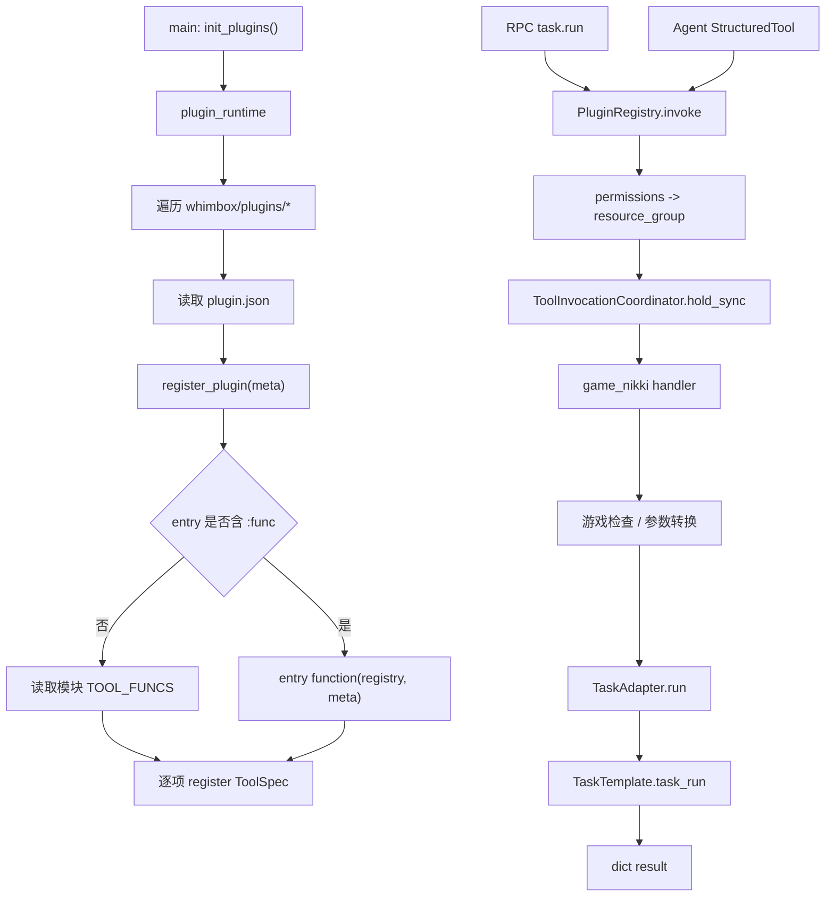
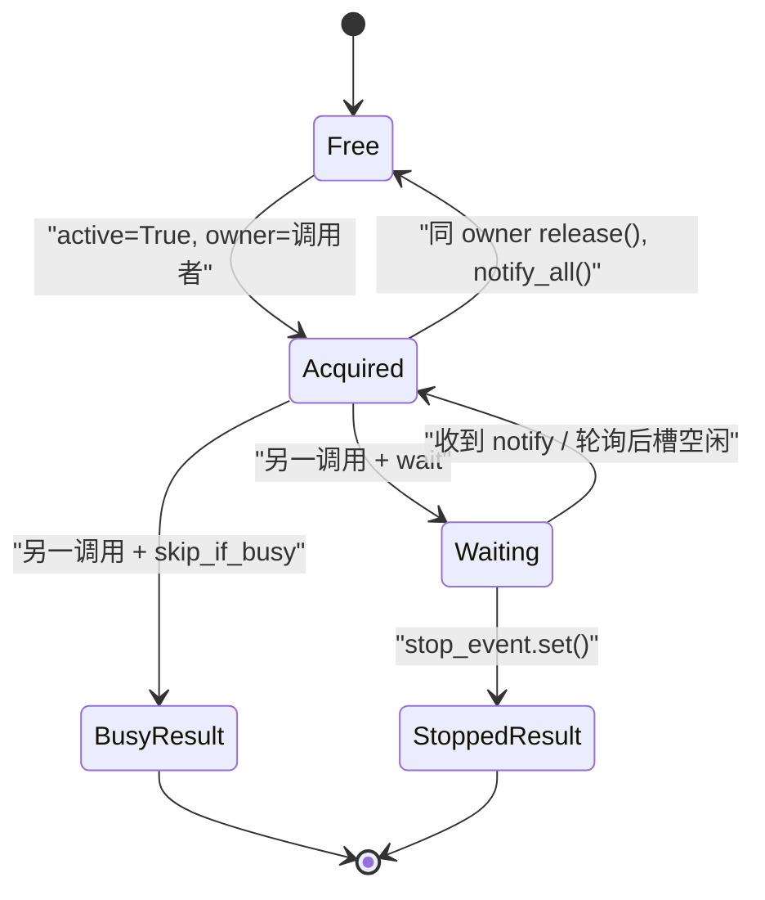

# Whimbox 2.5.4 插件与工具系统分析

> 基线：Whimbox `2.5.4`。本文分析插件发现、动态加载、注册、Agent 工具适配、互斥协调及内置 `game_nikki` 插件；具体 TaskTemplate 状态机见 [任务框架、调度与停止](04-任务框架调度与停止.md)。

## 1. 分析范围

本文覆盖：

- 插件运行时的全局注册表、初始化、重载和版本计数；
- `plugin.json` 的元数据、工具 Schema、入口模式和权限传播；
- 动态模块加载、自动/手动注册协议和失败行为；
- 注册表的工具数据模型、调用 context 和资源组解析；
- JSON Schema 到 LangChain `StructuredTool`/Pydantic 模型的适配；
- `ToolInvocationCoordinator` 的跨线程互斥、等待、停止和释放；
- `game_nikki` 的 21 个工具、前置检查、输入转换和任务适配链。

主要源码：[`plugin_runtime.py`](../../../../../reference_repos/whimbox/whimbox/plugin_runtime.py#L1)、[`plugins/loader.py`](../../../../../reference_repos/whimbox/whimbox/plugins/loader.py#L1)、[`plugins/registry.py`](../../../../../reference_repos/whimbox/whimbox/plugins/registry.py#L1)、[`plugin_tools.py`](../../../../../reference_repos/whimbox/whimbox/plugin_tools.py#L1)、[`tool_invocation_coordinator.py`](../../../../../reference_repos/whimbox/whimbox/tool_invocation_coordinator.py#L1)、[`game_nikki/plugin.json`](../../../../../reference_repos/whimbox/whimbox/plugins/game_nikki/plugin.json#L1) 和 [`game_nikki/main.py`](../../../../../reference_repos/whimbox/whimbox/plugins/game_nikki/main.py#L1)。

## 2. 核心结论

1. 插件系统是“目录清单 + 动态 Python 入口 + 进程内注册表”，不是隔离进程或沙箱。加载入口会以核心进程权限执行任意模块顶层代码。[`loader.py`](../../../../../reference_repos/whimbox/whimbox/plugins/loader.py#L14)
2. `plugin.json` 描述工具，`main.py` 提供 handler；默认自动注册要求每个 manifest tool ID 都能在 `TOOL_FUNCS` 中找到同名函数。[`loader.py`](../../../../../reference_repos/whimbox/whimbox/plugins/loader.py#L69)
3. 注册表不执行 JSON Schema 输入验证，也不验证输出 Schema。Schema 的主要实际消费者是 Agent 适配层；RPC `task.run` 直接进入注册表时绕过 Pydantic 参数模型。[`registry.py`](../../../../../reference_repos/whimbox/whimbox/plugins/registry.py#L84)
4. 所有调用在 handler 前进入同步资源协调器。只要权限含 `screen` 或 `input` 就归入全局 `game_runtime`；其他工具统一归入 `default`，两个组各自单槽互斥。[`registry.py`](../../../../../reference_repos/whimbox/whimbox/plugins/registry.py#L127)
5. `game_nikki` 在插件级声明 `screen/input`，因此它的 21 个工具全部占用 `game_runtime`，包括纯脚本搜索和打开目录等不直接操作游戏的 handler。[`plugin.json`](../../../../../reference_repos/whimbox/whimbox/plugins/game_nikki/plugin.json#L10)
6. 确定性任务 handler 统一签名为 `(session_id, input, context) -> dict`；大多数通过 `TaskAdapter.run()` 构造 TaskTemplate 子类并同步执行。[`main.py`](../../../../../reference_repos/whimbox/whimbox/plugins/game_nikki/main.py#L97)
7. Agent 工具是启动/重载时一次性生成的闭包，执行时再从 Agent 全局 getter 获取活动 session 与 stop event。并发 Agent 会话的正确隔离因此依赖 Agent 的全局活动 session 不被另一个查询覆盖。[`plugin_tools.py`](../../../../../reference_repos/whimbox/whimbox/plugin_tools.py#L46)

## 3. 加载与调用架构



## 4. 模块职责表

| 模块 | 核心对象/函数 | 职责 | 关键状态 |
|---|---|---|---|
| [`plugin_runtime.py`](../../../../../reference_repos/whimbox/whimbox/plugin_runtime.py#L9) | `init_plugins`、`get_registry`、`get_loaded_plugins`、`get_plugins_version` | 全局插件生命周期 | `_registry/_loaded_plugins/_initialized/_version` |
| [`plugins/loader.py`](../../../../../reference_repos/whimbox/whimbox/plugins/loader.py#L10) | `PluginLoadError`、`load_plugins`、动态加载辅助函数 | 发现目录、读取清单、执行入口、注册工具 | 每次调用局部 `loaded` 列表 |
| [`plugins/registry.py`](../../../../../reference_repos/whimbox/whimbox/plugins/registry.py#L12) | `ToolSpec`、`PluginRegistry` | 保存插件/工具、列出工具、统一调用 | `_plugins/_tools` |
| [`plugin_tools.py`](../../../../../reference_repos/whimbox/whimbox/plugin_tools.py#L11) | Schema 转换、`build_tools` | 生成 LangChain/Pydantic Agent 工具 | 每次构建返回新 `StructuredTool` 列表 |
| [`tool_invocation_coordinator.py`](../../../../../reference_repos/whimbox/whimbox/tool_invocation_coordinator.py#L13) | `AcquireResult`、`ToolInvocationCoordinator` | 资源组级同步互斥与 cooperative stop | `_slots`，每槽 `active/owner/Condition` |
| [`game_nikki/plugin.json`](../../../../../reference_repos/whimbox/whimbox/plugins/game_nikki/plugin.json#L1) | 插件元数据和 21 个 tool schema | 声明对外工具契约 | 插件级 `screen/input` 权限 |
| [`game_nikki/main.py`](../../../../../reference_repos/whimbox/whimbox/plugins/game_nikki/main.py#L33) | 检查/通知装饰器、21 个 handler、`TOOL_FUNCS` | 游戏插件业务入口 | 无注册表状态；依赖全局游戏句柄/脚本管理器 |

## 5. 插件运行时

### 5.1 全局状态

[`plugin_runtime.py`](../../../../../reference_repos/whimbox/whimbox/plugin_runtime.py#L9) 在导入时创建：

- `_registry = PluginRegistry()`：进程唯一核心注册表；
- `_loaded_plugins`：成功 manifest 或失败摘要列表；
- `_initialized`：是否至少完成过一次 `init_plugins`；
- `_version`：每次实际初始化/重载后加一。

### 5.2 `init_plugins()`

[`init_plugins()`](../../../../../reference_repos/whimbox/whimbox/plugin_runtime.py#L15) 的语义：

1. 已初始化且未请求 `force_reload`：返回 `_loaded_plugins` 的浅列表副本，不重新扫描；
2. 未指定目录：使用包内 `PLUGINS_PATH`；
3. 强制重载：先 `registry.clear()`；
4. 调用 `load_plugins()`；
5. 按每项是否含 `error` 记录成功/失败日志；
6. 无论列表是否含失败项，设置 `_initialized=True`，`_version += 1`。

[`get_registry()`](../../../../../reference_repos/whimbox/whimbox/plugin_runtime.py#L42) 返回可变注册表本身；[`get_loaded_plugins()`](../../../../../reference_repos/whimbox/whimbox/plugin_runtime.py#L46) 只复制外层列表，内部 manifest 字典仍是共享引用；[`get_plugins_version()`](../../../../../reference_repos/whimbox/whimbox/plugin_runtime.py#L50) 返回进程内递增计数，不是插件版本号。

RPC `plugin.reload` 在强制重载注册表后调用 Agent `reload_tools()`，从新注册表重建 StructuredTool。[`rpc_server.py`](../../../../../reference_repos/whimbox/whimbox/rpc_server.py#L853)

## 6. 动态加载器逐函数分析

### 6.1 `_read_plugin_meta()`

[`_read_plugin_meta()`](../../../../../reference_repos/whimbox/whimbox/plugins/loader.py#L30) 要求插件目录根部存在 `plugin.json`，使用 UTF-8 `json.load()` 返回原始字典。它不执行 JSON Schema、版本或字段完整性验证。

### 6.2 `_parse_entry()`

[`_parse_entry()`](../../../../../reference_repos/whimbox/whimbox/plugins/loader.py#L23) 支持两种 entry：

- `main.py`：自动注册，要求模块提供 `TOOL_FUNCS`；
- `main.py:register`：手动注册，加载后调用指定函数 `register(registry, meta)`。

只按第一个 `:` 拆分，不解释 Python module dotted path。

### 6.3 `_load_module_from_path()`

[`_load_module_from_path()`](../../../../../reference_repos/whimbox/whimbox/plugins/loader.py#L14) 用 `spec_from_file_location` 和 `exec_module` 执行入口文件。模块名为 `whimbox_plugin_<plugin id>`。[`loader.py`](../../../../../reference_repos/whimbox/whimbox/plugins/loader.py#L57)

该机制没有 API 隔离、导入白名单或权限拦截；manifest 的 permissions 不是安全沙箱授权。

### 6.4 `load_plugins()`

[`load_plugins()`](../../../../../reference_repos/whimbox/whimbox/plugins/loader.py#L38) 按 `Path.iterdir()` 顺序遍历直接子目录，跳过文件和 `_` 开头目录。每个插件的顺序：

1. 读取 meta；
2. 先 `registry.register_plugin(meta)`；
3. 校验 entry、加载模块；
4. 手动模式调用注册函数，或自动模式遍历 `meta["tools"]`；
5. 自动模式按 tool ID 查 `TOOL_FUNCS` handler；
6. 把 Schema、展示名、描述、plugin ID 和**插件级 permissions**写入 `ToolSpec`；
7. 成功时把完整 meta 加入 loaded。

单插件只捕获 `PluginLoadError` 和 `ToolRegistryError`，转为 `{"id": 目录名, "error": ...}`。JSON 解析错误、入口模块自身异常等其他异常会直接中断整个 `load_plugins()`。

## 7. Manifest 契约

[`game_nikki/plugin.json`](../../../../../reference_repos/whimbox/whimbox/plugins/game_nikki/plugin.json#L1) 当前元数据：

| 字段 | 值 | 当前加载器实际用途 |
|---|---|---|
| `id` | `game_nikki` | 插件唯一键、动态模块名、ToolSpec plugin_id |
| `name/version/author/description` | 展示元数据 | 保留在 loaded manifest；加载器不解释版本语义 |
| `entry` | `main.py` | 选择并加载入口文件 |
| `api_version` | `1.0` | 当前加载器未校验 |
| `min_core_version` | `0.0.0` | 当前加载器未校验 |
| `permissions` | `screen, input` | 原样传播给所有工具，并用于资源组解析 |
| `tools` | 21 项 | 自动注册的权威工具清单 |

每个 tool 至少声明 `id/name/description/input_schema/output_schema`。加载器只强制检查 tool ID 及对应 handler；其他字段允许缺省。[`loader.py`](../../../../../reference_repos/whimbox/whimbox/plugins/loader.py#L75)

## 8. 注册表与调用契约

### 8.1 `ToolSpec`

[`ToolSpec`](../../../../../reference_repos/whimbox/whimbox/plugins/registry.py#L12) 保存：

```text
tool_id, name, description,
input_schema, output_schema,
func(session_id, input, context),
plugin_id, permissions
```

Schema 和 permissions 都是普通可变 Python 容器；注册时没有深拷贝。

### 8.2 注册与列举

- [`register_plugin()`](../../../../../reference_repos/whimbox/whimbox/plugins/registry.py#L33) 要求非空、未重复 plugin ID；
- [`register()`](../../../../../reference_repos/whimbox/whimbox/plugins/registry.py#L41) 要求 tool ID 未重复且 plugin ID 非空，但不验证 plugin ID 已在 `_plugins`；
- [`list_tools()`](../../../../../reference_repos/whimbox/whimbox/plugins/registry.py#L68) 返回不含 handler 的展示字典列表，保持字典插入顺序；
- [`clear()`](../../../../../reference_repos/whimbox/whimbox/plugins/registry.py#L29) 同时清空插件和工具，不保留旧版本快照。

### 8.3 `invoke()`

[`invoke()`](../../../../../reference_repos/whimbox/whimbox/plugins/registry.py#L84) 是 RPC 与 Agent 共用的同步调用入口：

1. 查找 ToolSpec，不存在抛 `ToolRegistryError`；
2. 从 context 提取 `stop_event`，仅接受 `threading.Event`；
3. 解析 `invocation_source`，默认 `agent`；
4. 解析 `wait_policy`，默认 `wait`；
5. 解析可调用的 `on_wait`；
6. 由 permissions 决定资源组；
7. owner 优先取 `run_id`，其次 `tool_call_id`，最后使用 `source:session:tool`；
8. 进入 `hold_sync()`；停止返回 `status=stop`，忙碌返回 `status=busy`；
9. 获锁后把 `resource_group` 注入一份新 context，并同步调用 handler。

注册表没有在第 1 至 9 步之间根据 `input_schema` 校验 `input_data`，也没有对 handler 返回值应用 `output_schema`。

### 8.4 资源组

[`_resolve_resource_group()`](../../../../../reference_repos/whimbox/whimbox/plugins/registry.py#L127) 只有两种结果：

| permissions | resource group |
|---|---|
| 含 `screen` 或 `input` | `game_runtime` |
| 其他任意组合或空 | `default` |

因此不是“无权限就不加锁”，而是所有注册表工具都进入某个全局单槽组。

## 9. 资源互斥协调器

### 9.1 状态模型

[`_ResourceSlot`](../../../../../reference_repos/whimbox/whimbox/tool_invocation_coordinator.py#L19) 每个资源组保存独立 `threading.Condition`、`active` 和 `owner`。[`ToolInvocationCoordinator`](../../../../../reference_repos/whimbox/whimbox/tool_invocation_coordinator.py#L26) 用 `_slots_lock` 保护资源组到 slot 的延迟创建。



### 9.2 `acquire_sync()`

[`acquire_sync()`](../../../../../reference_repos/whimbox/whimbox/tool_invocation_coordinator.py#L39) 在 Condition 内循环：

- busy 且 policy 恰为 `skip_if_busy`：立即返回 `AcquireResult(False, "busy")`；
- stop event 已置位：返回 `stopped`；
- 首次等待前调用一次 `on_wait()`；
- 每 0.1 秒超时唤醒，重新检查槽和停止；
- 槽空闲且未停止时写 active/owner 并返回成功。

任何不是精确 `skip_if_busy` 的 policy 字符串都表现为等待。

### 9.3 `release()` 与 `hold_sync()`

[`release()`](../../../../../reference_repos/whimbox/whimbox/tool_invocation_coordinator.py#L67) 仅在槽 active 且 owner 完全匹配时释放并 `notify_all()`；不匹配时静默返回。

[`hold_sync()`](../../../../../reference_repos/whimbox/whimbox/tool_invocation_coordinator.py#L79) 用 contextmanager 保证已成功获取的槽在 finally 释放。当前 `PluginRegistry.invoke()` 正确使用这一入口，因此 handler 正常返回或抛异常都会释放资源。

## 10. Agent 工具适配

### 10.1 JSON 类型映射

[`_json_type_to_py()`](../../../../../reference_repos/whimbox/whimbox/plugin_tools.py#L11) 只映射顶层：

| JSON Schema | Python 类型 |
|---|---|
| string/integer/number/boolean | `str/int/float/bool` |
| object/array | `dict/list` |
| enum | 动态 `Literal` |
| 未知类型 | `Any` |

若 `type` 是含 `null` 的数组，选择第一个非 null 类型。它不递归处理 object properties 或 array items，也不映射 pattern、范围、长度、format、oneOf 等约束。

### 10.2 动态参数模型

[`_build_args_schema()`](../../../../../reference_repos/whimbox/whimbox/plugin_tools.py#L30) 遍历 `input_schema.properties`，把 required 字段默认值设为 `...`，可选字段默认 `None`，并保留字段 description；随后 `create_model()` 生成 `Args_<tool_id>` Pydantic 模型。

### 10.3 `build_tools()`

[`build_tools()`](../../../../../reference_repos/whimbox/whimbox/plugin_tools.py#L46) 对注册表每个工具生成一个闭包：

1. 调用时从 `session_id_getter()` 读取 session，空值回退 `default`；
2. 构造 `invocation_source=agent`、`wait_policy=wait` 的 context；
3. 可选读取当前 stop event；
4. 调用同一 `registry.invoke()`；
5. 用 manifest 的**展示名**作为 LangChain tool name，description 和动态 args schema 作为模型可见契约。

闭包工厂 `_make_tool_func(target_tool_id)` 避免 Python 循环变量晚绑定问题。[`plugin_tools.py`](../../../../../reference_repos/whimbox/whimbox/plugin_tools.py#L63)

Agent `_rebuild_tools()` 把这些插件工具与 workspace tools 合并；`tools_ready` 只取决于是否存在插件工具。[`agent.py`](../../../../../reference_repos/whimbox/whimbox/agent.py#L329)

## 11. `game_nikki` 插件入口

### 11.1 统一结果和游戏检查

[`_error()`](../../../../../reference_repos/whimbox/whimbox/plugins/game_nikki/main.py#L33) 用 `TaskResult(error, message).to_dict()` 生成统一错误。

[`_check_game_ok()`](../../../../../reference_repos/whimbox/whimbox/plugins/game_nikki/main.py#L37) 顺序检查：

1. 游戏句柄是否存活；失败先 refresh，再失败返回“游戏未启动”；
2. 固定 `sleep(1)` 后前置游戏窗口，规避前端最小化时窗口抢占；
3. 检查画面是否 16:9 或 16:10；
4. 记录分辨率；宽度不在 1920 至 2560 范围时发 `event.run.log` 提示推荐分辨率，但不阻止任务。

[`_with_game_check`](../../../../../reference_repos/whimbox/whimbox/plugins/game_nikki/main.py#L72) 在 handler 前执行上述检查；返回非空错误就短路。

### 11.2 Windows 通知包装

[`_with_windows_notify`](../../../../../reference_repos/whimbox/whimbox/plugins/game_nikki/main.py#L81) 在 handler 返回后读取 status/message，成功使用“任务完成”标题，其他状态使用“任务失败”，通知异常只记 debug。当前只包装 `run_all_in_one()`。[`main.py`](../../../../../reference_repos/whimbox/whimbox/plugins/game_nikki/main.py#L283)

### 11.3 21 个工具完整映射

| Tool ID | Manifest/Handler | 游戏检查 | 关键输入与行为 |
|---|---|---:|---|
| `nikki.jihua` | [声明](../../../../../reference_repos/whimbox/whimbox/plugins/game_nikki/plugin.json#L13) / [handler](../../../../../reference_repos/whimbox/whimbox/plugins/game_nikki/main.py#L97) | 是 | 输入原样交给 `JihuaTask` |
| `nikki.bless` | [声明](../../../../../reference_repos/whimbox/whimbox/plugins/game_nikki/plugin.json#L33) / [handler](../../../../../reference_repos/whimbox/whimbox/plugins/game_nikki/main.py#L102) | 是 | 可选 level_name，交给 `BlessTask` |
| `nikki.monster` | [声明](../../../../../reference_repos/whimbox/whimbox/plugins/game_nikki/plugin.json#L44) / [handler](../../../../../reference_repos/whimbox/whimbox/plugins/game_nikki/main.py#L107) | 是 | level_name 长于 2 字直接错误 |
| `nikki.dig` | [声明](../../../../../reference_repos/whimbox/whimbox/plugins/game_nikki/plugin.json#L55) / [handler](../../../../../reference_repos/whimbox/whimbox/plugins/game_nikki/main.py#L115) | 是 | 使用 `DigTaskV2` |
| `nikki.zhaoxi` | [声明](../../../../../reference_repos/whimbox/whimbox/plugins/game_nikki/plugin.json#L62) / [handler](../../../../../reference_repos/whimbox/whimbox/plugins/game_nikki/main.py#L120) | 是 | 执行 `ZhaoxiTask` |
| `nikki.search_path` | [声明](../../../../../reference_repos/whimbox/whimbox/plugins/game_nikki/plugin.json#L69) / [handler](../../../../../reference_repos/whimbox/whimbox/plugins/game_nikki/main.py#L125) | 否 | 搜路线/宏/乐谱；严格无结果时交叉放宽 name/target，路线最多补 5 条 |
| `nikki.load_path` | [声明](../../../../../reference_repos/whimbox/whimbox/plugins/game_nikki/plugin.json#L101) / [handler](../../../../../reference_repos/whimbox/whimbox/plugins/game_nikki/main.py#L222) | 是 | path_name 必填；查记录后传 `path_record` 给 `AutoPathTask` |
| `nikki.record_path` | [声明](../../../../../reference_repos/whimbox/whimbox/plugins/game_nikki/plugin.json#L112) / [handler](../../../../../reference_repos/whimbox/whimbox/plugins/game_nikki/main.py#L238) | 是 | 忽略传入 input，执行 `RecordPathTask` |
| `nikki.record_macro` | [声明](../../../../../reference_repos/whimbox/whimbox/plugins/game_nikki/plugin.json#L119) / [handler](../../../../../reference_repos/whimbox/whimbox/plugins/game_nikki/main.py#L243) | 是 | 忽略传入 input，执行 `RecordMacroTask` |
| `nikki.run_macro` | [声明](../../../../../reference_repos/whimbox/whimbox/plugins/game_nikki/plugin.json#L126) / [handler](../../../../../reference_repos/whimbox/whimbox/plugins/game_nikki/main.py#L248) | 是 | macro_name 必填；只查非乐谱宏，传实际文件名 |
| `nikki.play_music` | [声明](../../../../../reference_repos/whimbox/whimbox/plugins/game_nikki/plugin.json#L137) / [handler](../../../../../reference_repos/whimbox/whimbox/plugins/game_nikki/main.py#L259) | 是 | manifest 参数名为 macro_name；handler 也兼容 music_name；只查乐谱宏 |
| `nikki.open_path_folder` | [声明](../../../../../reference_repos/whimbox/whimbox/plugins/game_nikki/plugin.json#L148) / [handler](../../../../../reference_repos/whimbox/whimbox/plugins/game_nikki/main.py#L270) | 否 | 调用脚本管理器打开目录，布尔结果转 success/error |
| `nikki.daily_photo` | [声明](../../../../../reference_repos/whimbox/whimbox/plugins/game_nikki/plugin.json#L155) / [handler](../../../../../reference_repos/whimbox/whimbox/plugins/game_nikki/main.py#L278) | 是 | 执行 `DailyPhotoTask` |
| `nikki.all_in_one` | [声明](../../../../../reference_repos/whimbox/whimbox/plugins/game_nikki/plugin.json#L162) / [handler](../../../../../reference_repos/whimbox/whimbox/plugins/game_nikki/main.py#L283) | 否 | 执行 `AllInOneTask`，结束后走通知包装 |
| `nikki.start_game` | [声明](../../../../../reference_repos/whimbox/whimbox/plugins/game_nikki/plugin.json#L169) / [handler](../../../../../reference_repos/whimbox/whimbox/plugins/game_nikki/main.py#L288) | 否 | 游戏未启动场景入口，执行 `StartGameTask` |
| `nikki.goto_ui` | [声明](../../../../../reference_repos/whimbox/whimbox/plugins/game_nikki/plugin.json#L176) / [handler](../../../../../reference_repos/whimbox/whimbox/plugins/game_nikki/main.py#L292) | 是 | page_name 为 manifest 必填，交给 `GotoUITask` |
| `nikki.monthly_pass` | [声明](../../../../../reference_repos/whimbox/whimbox/plugins/game_nikki/plugin.json#L187) / [handler](../../../../../reference_repos/whimbox/whimbox/plugins/game_nikki/main.py#L297) | 是 | 执行 `MonthlyPassTask` |
| `nikki.weekly_realm` | [声明](../../../../../reference_repos/whimbox/whimbox/plugins/game_nikki/plugin.json#L194) / [handler](../../../../../reference_repos/whimbox/whimbox/plugins/game_nikki/main.py#L302) | 是 | 执行 `WeeklyRealmTask` |
| `nikki.xinghai` | [声明](../../../../../reference_repos/whimbox/whimbox/plugins/game_nikki/plugin.json#L201) / [handler](../../../../../reference_repos/whimbox/whimbox/plugins/game_nikki/main.py#L307) | 是 | 执行 `XinghaiTask` |
| `nikki.mira_crown` | [声明](../../../../../reference_repos/whimbox/whimbox/plugins/game_nikki/plugin.json#L208) / [handler](../../../../../reference_repos/whimbox/whimbox/plugins/game_nikki/main.py#L312) | 是 | 忽略调用输入，强制传 `force_start=True` |
| `nikki.xinghai_run` | [声明](../../../../../reference_repos/whimbox/whimbox/plugins/game_nikki/plugin.json#L215) / [handler](../../../../../reference_repos/whimbox/whimbox/plugins/game_nikki/main.py#L317) | 是 | 执行 `XinghaiRunTask` |

[`TOOL_FUNCS`](../../../../../reference_repos/whimbox/whimbox/plugins/game_nikki/main.py#L322) 是 manifest ID 到上述 handler 的最终自动注册映射。

### 11.4 搜索工具的宽松回退

[`run_search_path()`](../../../../../reference_repos/whimbox/whimbox/plugins/game_nikki/main.py#L125) 值得单独理解：

- 首轮严格按 name/target 搜路线；有 name 时同时搜普通宏和乐谱；
- 严格路线无结果时，把 name 和 target 去重为关键词，分别尝试匹配路线名和素材名；
- 放宽路线累计最多 5 条并按 path_name 去重；
- target 也可能被 LLM 错放为宏名，严格路线失败后会补查宏/乐谱；
- 返回项用 `item_type=path/macro/music` 统一，并在 message 标记是否放宽。

这是对 LLM 参数槽位误判的业务容错，不是注册表 Schema 校验。

## 12. Handler 到任务的边界

大多数 handler 调用 `TaskAdapter.run(TaskClass, session_id, transformed_input, context)`。适配器负责把 context 中的 stop event、session ID 和 run ID注入任务运行上下文，再同步执行 `task.task_run()` 并标准化为字典结果。[`task_adapter.py`](../../../../../reference_repos/whimbox/whimbox/task_adapter.py#L7)

因此插件层职责集中在：

- 面向工具调用的参数检查/转换；
- 游戏句柄和分辨率前置检查；
- 选择具体 TaskTemplate 子类；
- 把脚本名称解析为内部 record/filename；
- 将 TaskResult 暴露为插件输出。

步骤重试、停止轮询、子任务和 UI 自动化属于 TaskTemplate/具体任务，而不是 PluginRegistry。

## 13. 两条调用路径的差异

### 13.1 RPC `task.run`

```text
RPC params.input
 -> PluginRegistry.invoke（无 Schema 验证）
 -> game_runtime 锁
 -> handler
 -> TaskAdapter / Task
```

RPC 层只检查 session_id/tool_id 存在，不验证 input 是符合 manifest 的对象内容。[`rpc_server.py`](../../../../../reference_repos/whimbox/whimbox/rpc_server.py#L824)

### 13.2 Agent 工具

```text
LLM tool arguments
 -> StructuredTool 的 Pydantic args_schema
 -> build_tools 闭包
 -> PluginRegistry.invoke
 -> 同一 game_runtime 锁
 -> 同一 handler
```

Agent 路径多了一层有限的顶层类型/required 校验，但最终执行和资源互斥完全复用注册表。

## 14. 扩展方式

### 14.1 在现有插件新增工具

1. 在 [`game_nikki/plugin.json`](../../../../../reference_repos/whimbox/whimbox/plugins/game_nikki/plugin.json#L11) 增加唯一 tool ID、展示名、描述、输入/输出 Schema；
2. 在入口实现签名严格兼容 `(session_id, input, context) -> dict` 的 handler；
3. 需要游戏前置时加 `_with_game_check`；
4. 在 [`TOOL_FUNCS`](../../../../../reference_repos/whimbox/whimbox/plugins/game_nikki/main.py#L322) 增加相同 ID 映射；
5. 对 Agent 路径测试 Pydantic 参数，对 RPC 路径在 handler 内补齐必要校验；
6. 用 `plugin.reload` 或重启重建注册表和 Agent tools。

只改 manifest 会加载失败；只改 `TOOL_FUNCS` 不会对外注册，因为 manifest 是遍历权威源。

### 14.2 新建插件

最小目录：

```text
whimbox/plugins/<plugin_dir>/
├── plugin.json
└── main.py
```

自动模式提供 `TOOL_FUNCS`；需要自定义注册逻辑时使用 `entry: "main.py:register"` 并由函数自行调用 registry。若工具不触碰屏幕/输入，不要声明这两个权限，否则会占用 `game_runtime`。

### 14.3 扩充 Schema 支持

若要支持嵌套对象、数组 item、默认值或更多约束，应扩展 [`_json_type_to_py()`](../../../../../reference_repos/whimbox/whimbox/plugin_tools.py#L11) 和 [`_build_args_schema()`](../../../../../reference_repos/whimbox/whimbox/plugin_tools.py#L30)，并补充注册表侧验证，使 RPC 与 Agent 的契约一致。只扩 Agent 适配会继续留下直接调用绕过。

### 14.4 新增资源组

当前 `_resolve_resource_group()` 是硬编码二分。新增并发域需要同时明确：permissions 到 group 的映射、组内是否单槽、跨组是否可并发、前端 busy 语义和停止行为。仅新增 permission 字符串不会自动产生新资源组。

## 15. 调试入口

| 目标 | 推荐断点/观察点 |
|---|---|
| 首次加载/重载是否扫描 | [`init_plugins()`](../../../../../reference_repos/whimbox/whimbox/plugin_runtime.py#L15) |
| 定位某插件加载失败 | [`load_plugins()`](../../../../../reference_repos/whimbox/whimbox/plugins/loader.py#L38)、[`_load_module_from_path()`](../../../../../reference_repos/whimbox/whimbox/plugins/loader.py#L14) |
| 核对 manifest-handler 对齐 | [`loader.py` 自动注册循环](../../../../../reference_repos/whimbox/whimbox/plugins/loader.py#L75) |
| 查看注册表真实工具 | [`PluginRegistry.list_tools()`](../../../../../reference_repos/whimbox/whimbox/plugins/registry.py#L68) |
| 跟踪 RPC/Agent 汇合点 | [`PluginRegistry.invoke()`](../../../../../reference_repos/whimbox/whimbox/plugins/registry.py#L84) |
| 观察锁 owner/group/wait | [`acquire_sync()`](../../../../../reference_repos/whimbox/whimbox/tool_invocation_coordinator.py#L39) |
| 调试 Agent 参数模型 | [`build_tools()`](../../../../../reference_repos/whimbox/whimbox/plugin_tools.py#L46) |
| 游戏前置检查失败 | [`_check_game_ok()`](../../../../../reference_repos/whimbox/whimbox/plugins/game_nikki/main.py#L37) |
| 具体工具选择任务 | [`TOOL_FUNCS`](../../../../../reference_repos/whimbox/whimbox/plugins/game_nikki/main.py#L322) 和对应 handler |

并发问题建议同时记录：线程 ID、session_id、run_id、tool ID、resource_group、owner、stop event 是否 set。只看任务日志无法判断是在业务代码中运行还是在等锁。

## 16. 风险与待验证点

### 16.1 源码已确认的风险

- **兼容字段未执行**：`api_version` 和 `min_core_version` 被保留但没有校验，不兼容插件不会被主动拒绝。[`plugin.json`](../../../../../reference_repos/whimbox/whimbox/plugins/game_nikki/plugin.json#L8)
- **权限不是安全边界**：动态入口以核心进程权限执行；permissions 目前只影响资源组，不限制文件、网络、输入或截图 API。[`loader.py`](../../../../../reference_repos/whimbox/whimbox/plugins/loader.py#L14)
- **加载失败可能留下半注册状态**：plugin meta 在入口加载前注册，自动注册又逐工具写入；后续出现可捕获错误时没有回滚已注册内容。[`loader.py`](../../../../../reference_repos/whimbox/whimbox/plugins/loader.py#L49)
- **异常覆盖不完整**：入口模块运行异常、JSONDecodeError 等不属于两个捕获类型，会中断整轮扫描而非产生单插件错误项。[`loader.py`](../../../../../reference_repos/whimbox/whimbox/plugins/loader.py#L95)
- **重载先清空旧注册表**：新插件加载失败时没有回退到上一份可用快照。[`plugin_runtime.py`](../../../../../reference_repos/whimbox/whimbox/plugin_runtime.py#L27)
- **运行时和注册表无同步锁**：并发 `plugin.reload`、`list_tools` 和 `invoke` 可能观察清空或部分加载状态。[`plugin_runtime.py`](../../../../../reference_repos/whimbox/whimbox/plugin_runtime.py#L15)
- **Schema 契约不对称**：Agent 只校验支持的顶层子集，RPC 直接调用完全不校验，output_schema 始终未执行。[`plugin_tools.py`](../../../../../reference_repos/whimbox/whimbox/plugin_tools.py#L11)
- **插件级权限粒度过粗**：`game_nikki` 的搜索和打开目录也占用 `game_runtime`，可能无必要地等待长游戏任务。[`loader.py`](../../../../../reference_repos/whimbox/whimbox/plugins/loader.py#L84)
- **无权限工具仍全局串行**：它们全部进入单一 `default` 组，不会天然并行。[`registry.py`](../../../../../reference_repos/whimbox/whimbox/plugins/registry.py#L127)
- **互斥无公平队列**：Condition `notify_all` 后由线程竞争，不能保证 FIFO；长时间高频调用可能让等待顺序不可预测。[`tool_invocation_coordinator.py`](../../../../../reference_repos/whimbox/whimbox/tool_invocation_coordinator.py#L60)
- **协调器不可重入**：同一执行链持有组后再同步调用同组工具，会等待自身释放；owner 相同不会被识别为重入。[`tool_invocation_coordinator.py`](../../../../../reference_repos/whimbox/whimbox/tool_invocation_coordinator.py#L51)
- **错误 owner 释放静默失败**：若未来绕过 contextmanager 手工管理且 owner 不匹配，slot 会保持 active，没有诊断日志。[`tool_invocation_coordinator.py`](../../../../../reference_repos/whimbox/whimbox/tool_invocation_coordinator.py#L67)
- **Agent session getter 是共享活动值**：构建后的工具闭包不绑定发起查询的 session，而在执行时读取 Agent `_active_session_id`；并发会话可能把工具和 stop event 关联到后写入的 session。[`agent.py`](../../../../../reference_repos/whimbox/whimbox/agent.py#L329)
- **游戏检查含固定阻塞等待和窗口抢占**：每个被装饰 handler 都 sleep 1 秒并前置窗口，批量/排队任务会重复该动作。[`main.py`](../../../../../reference_repos/whimbox/whimbox/plugins/game_nikki/main.py#L37)
- **插件入口直接依赖 RPC 模块**：`game_nikki` 为发日志导入 `rpc_server.notify_event`，降低 handler 在无 RPC 环境下的独立性，并使加载顺序成为隐含约束。[`main.py`](../../../../../reference_repos/whimbox/whimbox/plugins/game_nikki/main.py#L7)
- **工具展示名作为 LangChain name**：唯一性只按 tool ID 检查；两个工具可有相同展示名，注册表允许，Agent 层是否能稳定区分取决于 LangChain/模型约束。[`plugin_tools.py`](../../../../../reference_repos/whimbox/whimbox/plugin_tools.py#L57)

### 16.2 待运行验证

- 当前 LangChain/Pydantic 版本对动态 `Literal` enum、中文工具名和重复展示名的实际处理；
- 插件入口抛普通异常时，进程启动是否整体失败，以及前端可见错误；
- `plugin.reload` 与正在执行的旧 handler 并发时，旧 ToolSpec/函数引用是否完整收尾；
- 两个 Agent session 并发调用工具时 session/stop event 是否发生串线；
- 高频短任务下 Condition 竞争的等待公平性；
- macOS 平台上 `_check_game_ok` 的窗口前置、分辨率检查和插件级 `screen/input` 行为；
- 21 个 manifest output_schema 与每个 TaskResult 实际返回结构的一致性。

## 17. 关联文档

- [项目架构梳理](../项目架构梳理.md)
- [启动、配置与运行时](01-启动配置与运行时.md)
- [RPC、会话、事件与通道](02-RPC会话事件与通道.md)
- [任务框架、调度与停止](04-任务框架调度与停止.md)
- [Agent 上下文、记忆与 Skills](10-Agent上下文记忆与Skills.md)
- [并发模型、错误恢复与风险](12-并发模型错误恢复与风险.md)
- [脚本、宏与资源管理](06-脚本宏与资源管理.md)
