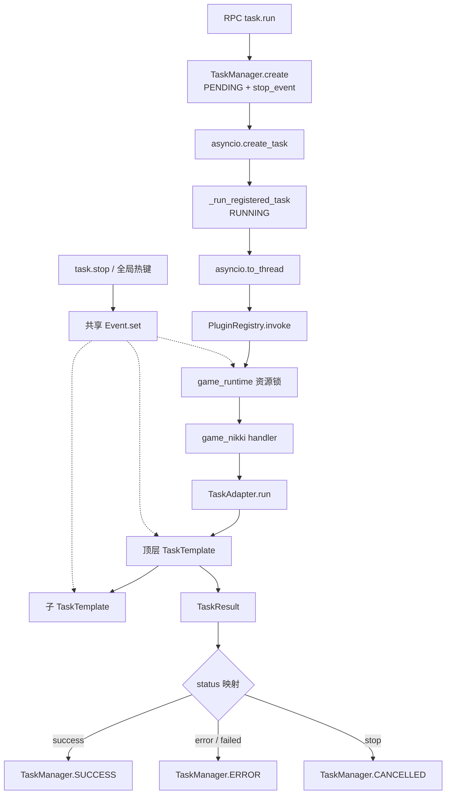
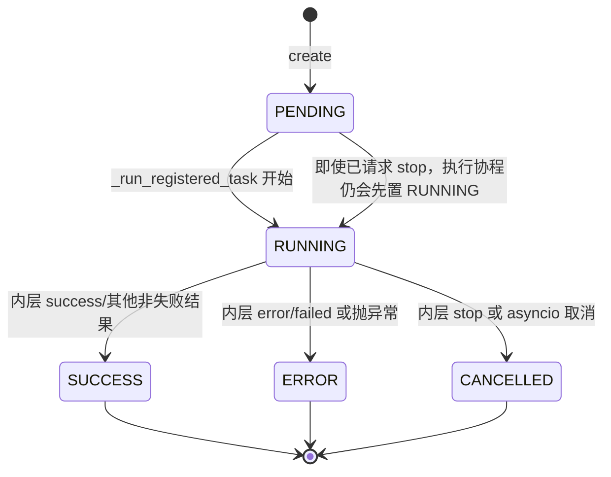
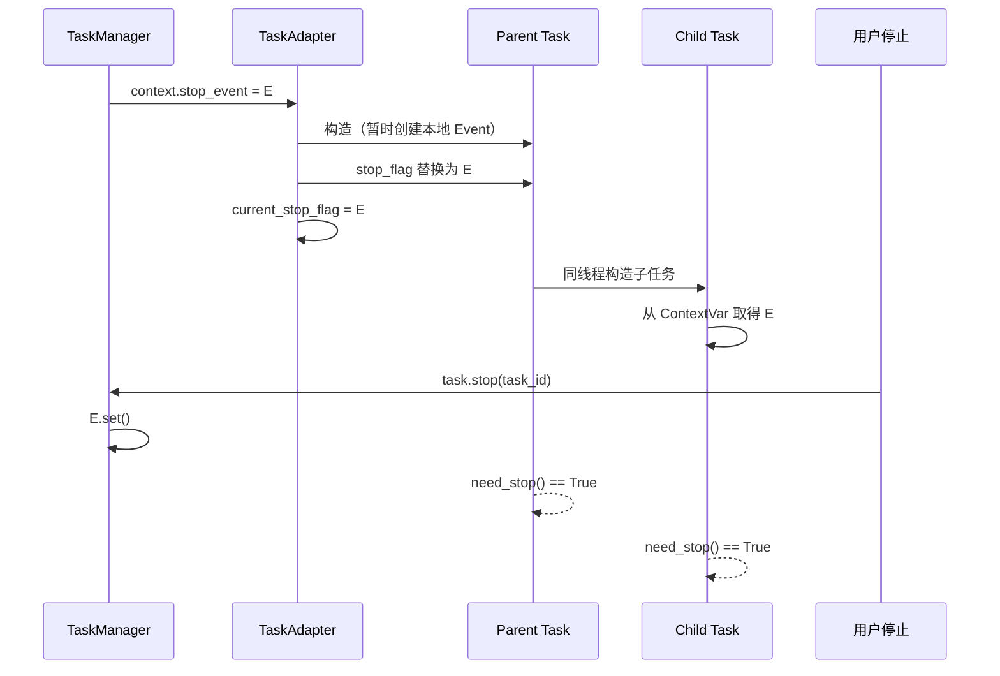
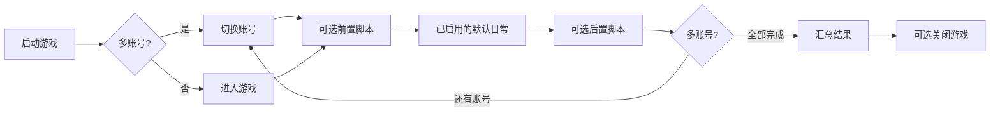

# Whimbox 2.5.4 任务框架、调度与停止机制

> 基线：`2.5.4`，提交 `a10fa3059f7a47cd26ba65a562184c8735562320`。
>
> 本文只描述当前源码已经实现的行为；“风险与待验证点”用于区分设计事实和需要运行验证的推断。

## 1. 分析范围

本文覆盖从 RPC 创建任务到业务任务结束的完整生命周期，重点包括：

- [`task_manager.py`](../../../../../reference_repos/whimbox/whimbox/task_manager.py#L8)：RPC 任务记录、外层状态和停止事件；
- [`rpc_server.py`](../../../../../reference_repos/whimbox/whimbox/rpc_server.py#L326)：异步启动、线程卸载、结果映射和事件通知；
- [`plugins/registry.py`](../../../../../reference_repos/whimbox/whimbox/plugins/registry.py#L84)：工具资源锁及停止前检查；
- [`task_adapter.py`](../../../../../reference_repos/whimbox/whimbox/task_adapter.py#L7)：插件 handler 到 `TaskTemplate` 的上下文适配；
- [`task/task_template.py`](../../../../../reference_repos/whimbox/whimbox/task/task_template.py#L39)：步骤注册、跳转、重试、父子任务和清理；
- [`common/cvars.py`](../../../../../reference_repos/whimbox/whimbox/common/cvars.py#L20)：停止、会话、运行 ID 以及前台任务标志；
- [`daily_task/all_in_one_task.py`](../../../../../reference_repos/whimbox/whimbox/task/daily_task/all_in_one_task.py#L38)：动态步骤编排、多账号循环与汇总；
- [`background_task/background_task.py`](../../../../../reference_repos/whimbox/whimbox/task/background_task/background_task.py#L62)：后台检测任务与前台任务的协作关系。

业务任务、动作和能力的逐项矩阵见 [05-业务任务动作与能力.md](./05-业务任务动作与能力.md)，路线和宏的持久化与执行见 [06-脚本宏与资源管理.md](./06-脚本宏与资源管理.md)。

## 2. 核心结论

1. Whimbox 有两层任务状态。`TaskManager` 管 RPC 可观察的 `PENDING/RUNNING/SUCCESS/ERROR/CANCELLED`，`TaskTemplate` 管业务内部的 `success/error/stop/failed`；二者由 `rpc_server._run_registered_task()` 映射，而不是同一个状态机。
2. `task.stop` 是协作式停止。它只设置 `threading.Event`，不会直接取消工作线程；实际退出速度取决于业务循环多久调用一次 `need_stop()`。
3. 父子任务没有显式对象树。它们依靠 `ContextVar` 中的同一个 `Event` 建立“任务链”，因此子任务调用 `task_stop()` 会停止整条父子链。
4. 步骤由装饰器在类定义时编号，实例化时沿 MRO 收集；正常流程按 `step_order` 顺序走，步骤返回字符串时可跳转，返回 `step_finish` 时提前结束。
5. `error` 是唯一会触发框架自动重试的业务状态，且最多再跑一次。`failed` 和 `stop` 都不会重试；重试复用同一任务对象，不会恢复子类字段的初始值。
6. 每次 `_task_run()` 都执行 `handle_finally()`，包括第一次失败后准备重试的时刻。默认清理会回到主界面；保留当前 UI 的任务必须显式覆盖它。
7. `AllInOneTask` 并非固定步骤表。它先由基类注册全部装饰步骤，再根据配置重写 `step_order`，并通过步骤返回值实现多账号循环。
8. 后台小工具不是 `TaskTemplate` 的普通子类。它有独立线程与停止事件，通过全局“前台任务运行”标志暂停检测，并通过 `game_runtime` 资源锁避免与前台工具同时操作游戏。

## 3. 总体调用与停止链



资源锁等待也参与协作停止：`PluginRegistry.invoke()` 将 `stop_event` 交给协调器；任务在等待锁时被停止，会直接返回 `{"status": "stop"}`，甚至无需构造业务任务，见 [`registry.py`](../../../../../reference_repos/whimbox/whimbox/plugins/registry.py#L95) 和 [`tool_invocation_coordinator.py`](../../../../../reference_repos/whimbox/whimbox/tool_invocation_coordinator.py#L28)。

## 4. 职责与覆盖矩阵

| 层次 | 核心对象/函数 | 输入 | 输出或状态 | 主要职责 |
| --- | --- | --- | --- | --- |
| RPC 记录 | [`TaskInfo`](../../../../../reference_repos/whimbox/whimbox/task_manager.py#L8) | `session_id`、`tool_id` | 时间戳、外层状态、结果、`stop_event` | 保存一次 `task.run` 的可查询记录 |
| RPC 管理 | [`TaskManager`](../../../../../reference_repos/whimbox/whimbox/task_manager.py#L36) | 创建、查询、停止请求 | `PENDING/RUNNING/...` | 线程安全地管理任务字典 |
| 异步调度 | [`_start_registered_task`](../../../../../reference_repos/whimbox/whimbox/rpc_server.py#L511) | RPC 参数 | `task_id` | 创建 `asyncio.Task`，立即向前端返回 |
| 执行与映射 | [`_run_registered_task`](../../../../../reference_repos/whimbox/whimbox/rpc_server.py#L326) | `TaskInfo` | 状态事件、日志、最终外层状态 | 把同步工具调用放入工作线程 |
| 互斥 | [`PluginRegistry.invoke`](../../../../../reference_repos/whimbox/whimbox/plugins/registry.py#L84) | 工具、权限、上下文 | 工具结果或 `busy/stop` | 统一占用 `game_runtime/default` 资源组 |
| 适配 | [`TaskAdapter.run`](../../../../../reference_repos/whimbox/whimbox/task_adapter.py#L9) | 任务类、输入、context | 字典结果 | 构造任务并注入 stop/session/run 上下文 |
| 业务状态机 | [`TaskTemplate`](../../../../../reference_repos/whimbox/whimbox/task/task_template.py#L60) | `session_id`、子类参数 | `TaskResult` | 注册与运行步骤、重试、清理、日志 |
| 运行上下文 | [`current_stop_flag`](../../../../../reference_repos/whimbox/whimbox/common/cvars.py#L20) 等 | 当前线程上下文 | `Event/session_id/run_id` | 隐式向子任务传播运行信息 |
| 前后台协调 | [`set_foreground_task_running`](../../../../../reference_repos/whimbox/whimbox/common/cvars.py#L63) | 布尔值 | 全局前台标志 | 让后台小工具暂停/恢复 |
| 动态编排 | [`AllInOneTask`](../../../../../reference_repos/whimbox/whimbox/task/daily_task/all_in_one_task.py#L38) | 配置和脚本索引 | 单账号或多账号汇总 | 组合启动、日常、自定义脚本、换号、关游戏 |
| 后台检测 | [`BackgroundTask`](../../../../../reference_repos/whimbox/whimbox/task/background_task/background_task.py#L189) | 后台配置、连续截图 | 自动拾取/跳过/钓鱼/对话等 | 独立于 RPC 任务的常驻轮询 |

## 5. 外层任务状态机

### 5.1 数据模型

`TaskManager.create()` 生成 `task_<uuid>`，初始状态为 `PENDING`，并创建该任务专用的 `threading.Event`，见 [`task_manager.py`](../../../../../reference_repos/whimbox/whimbox/task_manager.py#L41)。`TaskInfo.to_dict()` 不暴露 `stop_event` 和 `asyncio_task`，前端只能看到身份、状态、时间、错误和结果。



`set_state()` 只负责赋值和时间戳，不校验状态迁移合法性；进入 `RUNNING` 写 `started_at`，进入三个终态写 `finished_at`，见 [`task_manager.py`](../../../../../reference_repos/whimbox/whimbox/task_manager.py#L53)。

### 5.2 异步边界

`task.run` 调用 [`_start_registered_task()`](../../../../../reference_repos/whimbox/whimbox/rpc_server.py#L511) 后只返回 `task_id`。真正的同步游戏操作由 `asyncio.to_thread(registry.invoke, ...)` 执行，因此 WebSocket 事件循环不会被 OCR、截图和 `time.sleep()` 阻塞，见 [`rpc_server.py`](../../../../../reference_repos/whimbox/whimbox/rpc_server.py#L360)。

创建的 `asyncio.Task` 会存入 `TaskInfo.asyncio_task`，但当前 `TaskManager.stop()` 不调用其 `cancel()`；停止路径仍以 `Event` 为准。

### 5.3 内外状态映射

| `TaskResult.status` | RPC 外层状态 | 是否自动重试 | 含义 |
| --- | --- | --- | --- |
| `success` | `SUCCESS` | 否 | 正常完成；默认初始值也是 success |
| `error` | `ERROR`（重试仍失败后） | 是，最多一次 | 通常由未捕获步骤异常转换而来 |
| `failed` | `ERROR` | 否 | 已知业务失败，调用者不应自动重复操作 |
| `stop` | `CANCELLED` | 否 | 手动或协作停止 |
| 其他/缺省 | `SUCCESS` | 否 | RPC 映射的兜底分支，见 [`rpc_server.py`](../../../../../reference_repos/whimbox/whimbox/rpc_server.py#L374) |

外层同时发送 `event.run.status` 和最终 `event.run.log`；任务步骤自己的 `log_to_gui()` 使用相同 `session_id/run_id` 关联日志，见 [`task_template.py`](../../../../../reference_repos/whimbox/whimbox/task/task_template.py#L304)。

## 6. 步骤注册、MRO 与跳转

### 6.1 装饰器注册

`@register_step()` 在类定义时给函数写入三个属性：注册标记、状态消息和全局递增序号，见 [`task_template.py`](../../../../../reference_repos/whimbox/whimbox/task/task_template.py#L39)。实例初始化时，`__auto_register_steps()`：

1. 按 `self.__class__.__mro__` 从子类向基类扫描；
2. 同名方法只接受最先看到的版本，因此子类覆盖优先；
3. 只收集带 `_register_step` 的可调用对象；
4. 最后按装饰器的全局序号排序，写入 `steps_dict` 和 `step_order`。

实现位于 [`task_template.py`](../../../../../reference_repos/whimbox/whimbox/task/task_template.py#L144)。需要注意，同名方法会在检查装饰标记之前加入 `seen_method_names`；因此子类即使以未装饰方法覆盖，也会屏蔽基类的装饰步骤。

当前真正使用继承步骤的业务族是 `CatchInsectTask/CleanAnimalTask -> MaterialTrackBaseTask`，子类只覆盖前后摇钩子，没有覆盖三个已注册步骤，见 [`material_track_base.py`](../../../../../reference_repos/whimbox/whimbox/action/material_track_base.py#L13)。

### 6.2 默认顺序和显式跳转

`_task_run()` 从 `step_order[0]` 开始。步骤：

- 返回空值：执行 `step_order` 中下一个步骤；
- 返回某个步骤名：直接跳到 `steps_dict` 中对应步骤；
- 返回 `STEP_NAME_FINISH`（值为 `step_finish`）：退出循环；
- 返回不存在的名字：下一轮抛出“步骤不存在”，并转成 `error`。

核心循环见 [`task_template.py`](../../../../../reference_repos/whimbox/whimbox/task/task_template.py#L209)。典型跳转包括：

- `EnterGameTask.step_loading_game -> step_enter_game`：异常退出登录后重新进入，见 [`enter_game_task.py`](../../../../../reference_repos/whimbox/whimbox/task/common_task/enter_game_task.py#L27)；
- `MinigameTask.step3 -> step2/step4`：失败重玩或结束，见 [`minigame_task.py`](../../../../../reference_repos/whimbox/whimbox/task/minigame_task/minigame_task.py#L50)；
- `MiraCrownTask.step5 -> step4`：一关结束后继续下一关，见 [`mira_crown_task.py`](../../../../../reference_repos/whimbox/whimbox/task/mira_crown_task/mira_crown_task.py#L87)；
- `AllInOneTask.step_finish_account -> step_change_account`：构造多账号循环，见 [`all_in_one_task.py`](../../../../../reference_repos/whimbox/whimbox/task/daily_task/all_in_one_task.py#L430)。

### 6.3 结果并不等于流程控制

`update_task_result()` 只替换结果对象，不自动终止步骤；要提前结束还必须 `return STEP_NAME_FINISH` 或让循环检测到停止事件，见 [`task_template.py`](../../../../../reference_repos/whimbox/whimbox/task/task_template.py#L339)。因此阅读任务时要同时追踪“结果状态”和“返回的下一步骤”。

若结果已经是 `stop`，普通更新会被忽略；`force_update=True` 可以覆盖停止结果。录制路线和录制宏正是利用这一点实现“按停止键结束录制，但最终返回保存成功”。

## 7. 异常、自动重试与清理

### 7.1 异常转换

步骤抛出的异常由 `_task_run()` 捕获：

- 若共享停止事件已设置，结果变成 `stop`；
- 否则把 `current_step` 指向 `error_step`，结果变成 `error` 并记录堆栈。

见 [`task_template.py`](../../../../../reference_repos/whimbox/whimbox/task/task_template.py#L247)。当前 `on_error()` 没有业务调用点，而且异常分支只设置 `error_step`，并不会执行 `error_step.run()`；它目前不是一个实际的错误恢复步骤。

### 7.2 一次自动重试

`task_run()` 首次得到 `error` 时，如果 `need_stop()` 为假，会重置 `task_result` 并再次调用 `_task_run()`，见 [`task_template.py`](../../../../../reference_repos/whimbox/whimbox/task/task_template.py#L177)。重试具有以下语义：

- 从 `step_order[0]` 重新开始；
- 仍是同一个 Python 对象；
- 子类的计数器、列表、缓存、已经点击过的 UI 状态不会自动重置；
- 第一次 `_task_run()` 的 `handle_finally()` 已经执行；
- 第二次无论成功失败，也会再次执行 `handle_finally()`。

`AutoPathTask.clear_all()` 会主动把目标点恢复到最近一次传送点，并停止三个控制线程，因此它对框架重试做了局部适配，见 [`auto_path_task.py`](../../../../../reference_repos/whimbox/whimbox/task/navigation_task/auto_path_task.py#L526)。其他任务通常依赖“回主界面后从头再做”恢复。

### 7.3 清理策略

默认 [`handle_finally()`](../../../../../reference_repos/whimbox/whimbox/task/task_template.py#L269) 调用 `back_to_page_main()`。常见覆盖分为三类：

| 清理类型 | 代表任务 | 行为 |
| --- | --- | --- |
| 默认回主界面 | 大多数日常任务 | 每次完成、失败或重试前都尝试恢复主界面 |
| 保留当前界面 | `RunMacroTask`、`RecordMacroTask`、多数原子 action | 不调用父类，避免破坏调用方后续流程 |
| 资源清理后回主界面 | `AutoPathTask` | 先走父类，再停止/等待移动、跳跃、跳过监控线程 |
| 条件回主界面 | `AllInOneTask` | 游戏句柄仍存在才调用父类，兼容最后关闭游戏 |

顶层 `task_run()` 的外层 `finally` 还会停止热键 listener、清除前台任务标志，并把 `current_stop_flag` 设回 `None`，见 [`task_template.py`](../../../../../reference_repos/whimbox/whimbox/task/task_template.py#L195)。子任务不会做这组顶层清理。

## 8. 父子任务与协作停止

### 8.1 上下文注入顺序

`TaskAdapter.run()` 的实际顺序是：

1. 构造顶层任务；此时 `TaskTemplate.__init__()` 从 `current_stop_flag` 读取事件，没有则新建一个并标记 `is_top_level_task=True`；
2. 若 RPC context 带 `stop_event`，用 `TaskInfo.stop_event` 覆盖任务实例的 `stop_flag`，同时写回 `current_stop_flag`；
3. 写入 `current_session_id` 和 `current_run_id`；
4. 调用 `task.task_run()`。

见 [`task_adapter.py`](../../../../../reference_repos/whimbox/whimbox/task_adapter.py#L15) 和 [`task_template.py`](../../../../../reference_repos/whimbox/whimbox/task/task_template.py#L68)。之后在同一工作线程中构造的子任务会读到 RPC 的那个事件，标记为子任务并复用它。



### 8.2 停止入口

| 入口 | 实现 | 作用域 |
| --- | --- | --- |
| RPC `task.stop` | [`rpc_server.py`](../../../../../reference_repos/whimbox/whimbox/rpc_server.py#L839) | 单个 `TaskInfo` |
| Overlay 全局热键 | [`_request_global_stop`](../../../../../reference_repos/whimbox/whimbox/rpc_server.py#L247) | 所有前台 RPC 任务和 Agent 工具 |
| 通道会话停止 | [`channel_gateway.py`](../../../../../reference_repos/whimbox/whimbox/channel_gateway.py#L68) | 指定 session 的活动任务 |
| 任务内部 `task_stop()` | [`task_template.py`](../../../../../reference_repos/whimbox/whimbox/task/task_template.py#L277) | 共享同一 Event 的整条父子链 |

`TaskTemplate.task_stop()` 还会把结果设为 `stop`，重置视角旋转比例并记录日志。`need_stop()` 则在发现事件已设置时补写 `stop` 结果，见 [`task_template.py`](../../../../../reference_repos/whimbox/whimbox/task/task_template.py#L291)。

停止不是异常注入。任何不检查 `need_stop()` 的长时间 OCR、UI 等待、单次 `time.sleep()` 或平台调用，都必须自行结束后，状态机才有机会退出。

单任务入口还有不同于 `stop_all()` 的边界：[`TaskManager.stop()`](../../../../../reference_repos/whimbox/whimbox/task_manager.py#L79) 只检查 ID 是否存在，不检查 state。因此对已是 `SUCCESS/ERROR/CANCELLED` 的历史任务调用 `task.stop` 仍会返回成功，RPC 随后广播新的 `stopping`；该任务已经没有后续执行路径将状态推进或清理停止去重 ID。

## 9. AllInOne 动态编排

### 9.1 步骤来源

默认任务表位于 [`DEFAULT_STEP_CONFIG`](../../../../../reference_repos/whimbox/whimbox/task/daily_task/all_in_one_task.py#L22)：美鸭梨挖掘、家园日常、每周幻境、朝夕心愿、星光结晶、星海拾光、奇迹之冠、奇迹之旅。

构造函数先调用基类注册所有装饰步骤，再读取：

- `OneDragonDefaultSteps`：逐个启用/禁用默认步骤；
- `OneDragonPreCustomSteps.items`：前置路线或宏；
- `OneDragonPostCustomSteps.items`：后置路线或宏；
- 旧配置 `OneDragonCustomSteps.items`：仅在没有新式前置/后置配置时作为后置兼容；
- `OneDragon.change_account`：是否启用多账号；
- `OneDragon.auto_close_game`：结束后是否关闭游戏。

随后 `_rebuild_step_order()` 直接替换基类生成的顺序，见 [`all_in_one_task.py`](../../../../../reference_repos/whimbox/whimbox/task/daily_task/all_in_one_task.py#L100)。



### 9.2 自定义步骤

自定义项只接受 `type=path|macro`、非空 `id` 和 `script_name`，见 [`all_in_one_task.py`](../../../../../reference_repos/whimbox/whimbox/task/daily_task/all_in_one_task.py#L66)。运行时分别查询 `ScriptsManager`，构造 `AutoPathTask` 或 `RunMacroTask`。单个自定义步骤失败只记入结果并继续；返回 `stop` 才停止整条一条龙，见 [`all_in_one_task.py`](../../../../../reference_repos/whimbox/whimbox/task/daily_task/all_in_one_task.py#L261)。

### 9.3 多账号循环

多账号不是为每个账号创建新的 `AllInOneTask`，而是在同一实例内循环：

1. 首次 `ChangeAccountTask` 通过 OCR 和滚动收集登录账号；
2. 当前账号完成后 `_snapshot_current_account_result()` 保存默认步骤、自定义步骤和巨陨星状态；
3. `finished_account_list` 追加当前账号；
4. 若仍有账号，退出到登录页并返回 `step_change_account`；
5. 全部完成后跳到 `step8` 汇总。

关键代码见 [`all_in_one_task.py`](../../../../../reference_repos/whimbox/whimbox/task/daily_task/all_in_one_task.py#L410) 和 [`change_account_task.py`](../../../../../reference_repos/whimbox/whimbox/task/common_task/change_account_task.py#L99)。每个账号结束都会重置步骤结果容器，但共享同一个停止事件、任务实例和 `account_results`。

## 10. 后台任务的并行模型

`BackgroundTaskManager` 是单例；模块加载末尾会创建实例并尝试启动后台线程，见 [`background_task.py`](../../../../../reference_repos/whimbox/whimbox/task/background_task/background_task.py#L613)。线程先等待游戏窗口和支持的分辨率，再进入截图轮询。

后台与前台有两道协调：

1. 顶层 `TaskTemplate.task_run()` 设置全局 `_foreground_task_running=True`；后台循环在看到它后暂停并停止鼠标 listener，见 [`background_task.py`](../../../../../reference_repos/whimbox/whimbox/task/background_task/background_task.py#L343)。
2. 自动钓鱼和自动对话真正启动子任务前，以 `skip_if_busy` 尝试获取 `game_runtime`；若前台仍占用，直接跳过，见 [`background_task.py`](../../../../../reference_repos/whimbox/whimbox/task/background_task/background_task.py#L320)。

后台自己的 `stop_event` 只终止常驻线程，不等于某个 RPC `TaskInfo.stop_event`。自动对话走完整 `SkipDialogTask.task_run()`；自动钓鱼则只调用 `FishingTask.step2()`，刻意绕过切能力步骤和完整状态机，见 [`background_task.py`](../../../../../reference_repos/whimbox/whimbox/task/background_task/background_task.py#L469)。

## 11. 代表性纵向调用链

### 11.1 前端直接运行月卡任务

```text
RPC task.run
→ _start_registered_task
→ TaskManager.create
→ _run_registered_task
→ PluginRegistry.invoke("nikki.monthly_pass")
→ game_nikki.run_monthly_pass
→ TaskAdapter.run(MonthlyPassTask)
→ TaskTemplate.task_run
→ step1 → step2 → step3
→ TaskResult.to_dict
→ TaskManager.SUCCESS / ERROR / CANCELLED
```

入口与 handler 分别见 [`rpc_server.py`](../../../../../reference_repos/whimbox/whimbox/rpc_server.py#L824) 和 [`plugins/game_nikki/main.py`](../../../../../reference_repos/whimbox/whimbox/plugins/game_nikki/main.py#L297)。

### 11.2 一条龙中的子任务

```text
AllInOneTask.step3
→ ZhaoxiTask.task_run
→ ZhaoxiTask.step3
→ 按 OCR 结果选择 AutoPathTask / BlessTask / JihuaTask / ...
→ 子任务从 current_stop_flag 取得同一个 Event
→ 子任务结果写入一条龙步骤汇总
```

编排点见 [`all_in_one_task.py`](../../../../../reference_repos/whimbox/whimbox/task/daily_task/all_in_one_task.py#L354) 和 [`zhaoxi_task.py`](../../../../../reference_repos/whimbox/whimbox/task/daily_task/zhaoxi_task.py#L167)。

### 11.3 停止正在等待资源锁的任务

```text
task.run → TaskInfo(PENDING) → _run_registered_task(RUNNING)
→ PluginRegistry.invoke → game_runtime 正忙，Condition.wait
→ task.stop → TaskInfo.stop_event.set
→ acquire_sync 检测到 Event → AcquireResult(stopped)
→ registry 返回 {status: stop}
→ TaskManager.CANCELLED
```

## 12. 状态与数据清单

| 数据 | 所有者 | 生命周期 | 消费者 |
| --- | --- | --- | --- |
| `TaskInfo.stop_event` | `TaskManager` | 一次 RPC 任务，记录目前不回收 | Registry、TaskAdapter、整条任务链 |
| `current_stop_flag` | ContextVar | 当前执行上下文 | 新构造的子任务 |
| `current_session_id` | ContextVar | 当前执行上下文 | 任务日志、后台日志归属 |
| `current_run_id` | ContextVar | 当前执行上下文 | `event.run.log` 关联 RPC 任务 |
| `is_top_level_task` | `TaskTemplate` 实例 | 实例生命周期 | 热键 listener、前台标志、上下文清理 |
| `step_order` | `TaskTemplate` 实例 | 构造后，可被编排器改写 | `_task_run()` |
| `task_result` | `TaskTemplate` 实例 | 每次运行；error 重试前重置 | 父任务、handler、RPC 映射 |
| `_foreground_task_running` | 进程全局 | 顶层 `task_run()` 期间 | 后台小工具暂停判断 |
| `account_results` | `AllInOneTask` | 一次一条龙 | 最终多账号汇总 |

## 13. 调试入口

建议按以下顺序打断点：

1. [`rpc_server._start_registered_task`](../../../../../reference_repos/whimbox/whimbox/rpc_server.py#L511)：确认 `task_id/session_id/tool_id/input`；
2. [`rpc_server._run_registered_task`](../../../../../reference_repos/whimbox/whimbox/rpc_server.py#L326)：观察外层状态和 context；
3. [`PluginRegistry.invoke`](../../../../../reference_repos/whimbox/whimbox/plugins/registry.py#L84)：检查资源组、owner 和等待策略；
4. [`TaskAdapter.run`](../../../../../reference_repos/whimbox/whimbox/task_adapter.py#L9)：比较构造后的 `is_top_level_task` 与被覆盖的 `stop_flag`；
5. [`TaskTemplate.__auto_register_steps`](../../../../../reference_repos/whimbox/whimbox/task/task_template.py#L144)：查看最终 `step_order`；
6. [`TaskTemplate._task_run`](../../../../../reference_repos/whimbox/whimbox/task/task_template.py#L209)：观察 `current_step_name/next_step_name/task_result`；
7. [`TaskTemplate.task_stop`](../../../../../reference_repos/whimbox/whimbox/task/task_template.py#L277)：确认父子任务是否共享同一个 Event；
8. [`AllInOneTask._rebuild_step_order`](../../../../../reference_repos/whimbox/whimbox/task/daily_task/all_in_one_task.py#L100)：核对配置生成的实际流程；
9. [`AllInOneTask.step_finish_account`](../../../../../reference_repos/whimbox/whimbox/task/daily_task/all_in_one_task.py#L430)：检查多账号回环；
10. [`BackgroundTask.run`](../../../../../reference_repos/whimbox/whimbox/task/background_task/background_task.py#L343)：观察前后台暂停和恢复。

调试停止时不要只盯 `TaskManager.state`。停止请求发出后它仍可能暂时是 `RUNNING`，应同时观察 `task.stop_event.is_set()`、当前业务循环以及 `event.run.status` 的 `stopping -> cancelled` 过程。

## 14. 风险与待验证点

1. **停止延迟不可统一保证。** `TaskManager.stop()` 只设置事件；长 `sleep`、没有停止检查的 UI 等待或平台调用会推迟退出。需要对高风险任务实测最大停止延迟。
2. **终态任务可回退出伪 `stopping`。** 单任务 stop 不校验 state，历史任务仍返回成功并广播停止中，且 `_task_stopping_run_ids` 此后不会由任务 finally 清理。应只允许停止 `PENDING/RUNNING`，终态调用保持幂等且不广播。
3. **任务记录没有回收。** `_tasks` 字典只增不减，完成任务仍保留 `TaskInfo` 和 `asyncio_task` 引用，长时间运行是否造成可见内存增长需要压测，见 [`task_manager.py`](../../../../../reference_repos/whimbox/whimbox/task_manager.py#L36)。
4. **`asyncio_task` 目前只保存不取消。** `asyncio.CancelledError` 分支存在，但普通 `task.stop` 不触发 `cancel()`；该分支当前主要供外部协程取消或进程收尾使用。
5. **重试复用脏状态。** 框架只重置 `TaskResult`，不重建任务。任何“一次性计数、已消费资源、已推进索引”都可能影响第二次执行。
6. **默认清理可能改变父任务预期 UI。** 每个子任务的 `_task_run()` 都执行清理；若新增原子任务需要留在当前页面，必须像 action 和宏任务一样覆盖 `handle_finally()`。
7. **`on_error()` 当前未形成恢复链。** 源码没有调用方，异常时也不执行注册函数。若未来把它当作可运行错误步骤，需要先补执行语义和测试。
8. **ContextVar 没有成对 reset。** `TaskAdapter` 使用 `set()` 写入三个上下文变量但不保存 token/reset；顶层清理只把停止变量设为 `None`。在当前 `asyncio.to_thread` 使用方式下通常由复制上下文隔离，但直接同步调用 Registry、复用同一上下文或异常构造失败时仍需验证是否串号。
9. **子类构造失败会泄漏 listener。** `TaskTemplate.__init__()` 在基类构造阶段就启动顶层 pynput listener；`TaskAdapter` 随后才完成构造并进入 `task_run()`。若 `AutoPathTask`、`RunMacroTask` 等在 `super().__init__()` 后因资源缺失或版本校验抛错，没有任何 finally 执行 stop/join，listener 的绑定回调会继续持有任务实例。标准 `asyncio.to_thread()` 的复制 Context 通常随本次调用丢弃，但清理分支确实没有运行；直接同步复用 Context 的风险见上一条。应把 listener 启动延后到 `task_run()` 的受保护作用域，见 [`task_adapter.py`](../../../../../reference_repos/whimbox/whimbox/task_adapter.py#L19) 和 [`task_template.py`](../../../../../reference_repos/whimbox/whimbox/task/task_template.py#L93)。
10. **后台自动钓鱼会泄漏 `pynput` listener。** 构造顶层 `FishingTask` 时 `TaskTemplate.__init__()` 已立即启动 listener，随后却只调用 `step2()`，不会进入 `task_run()` finally 的 stop/join；后台代码只手动清空 `current_stop_flag`。listener 的绑定回调持有任务实例，因此局部变量退出也不能回收它，每次触发都会留下一个活动 listener，见 [`task_template.py`](../../../../../reference_repos/whimbox/whimbox/task/task_template.py#L93) 和 [`background_task.py`](../../../../../reference_repos/whimbox/whimbox/task/background_task/background_task.py#L490)。
11. **前台标志是进程级布尔值，不是引用计数。** 资源锁通常阻止两个游戏任务并发，但若将来出现多个顶层非互斥任务，一个任务结束就可能过早把标志清为 false。
12. **外层兜底把未知状态视为成功。** 新增 `TaskResult.status` 时若忘记同步 RPC 映射，会落入 `SUCCESS` 分支。
13. **多账号依赖 OCR 账号键。** 账号归一化只保留 ASCII 字母、数字、`@.` 并去掉域名；OCR 合并、滚动顺序和截断可能影响去重与完成列表，需用真实多账号列表验证，见 [`change_account_task.py`](../../../../../reference_repos/whimbox/whimbox/task/common_task/change_account_task.py#L21)。

## 15. 关联文档

- [项目架构梳理](../项目架构梳理.md)
- [05-业务任务动作与能力](./05-业务任务动作与能力.md)
- [06-脚本宏与资源管理](./06-脚本宏与资源管理.md)
- [07-平台抽象与交互核心](./07-平台抽象与交互核心.md)
- [08-UI视觉识别与页面导航](./08-UI视觉识别与页面导航.md)
