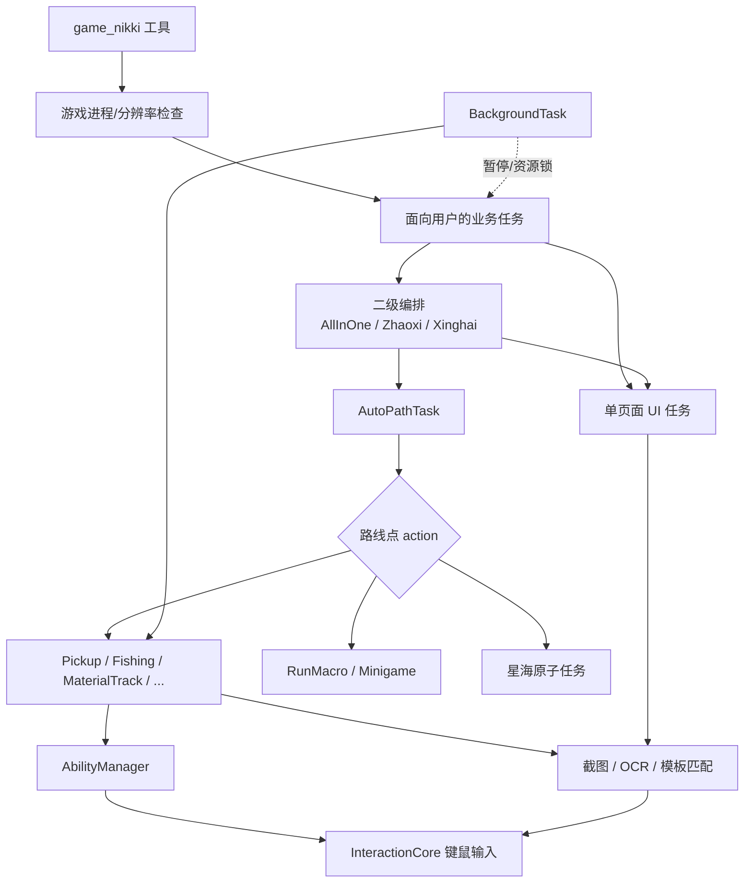
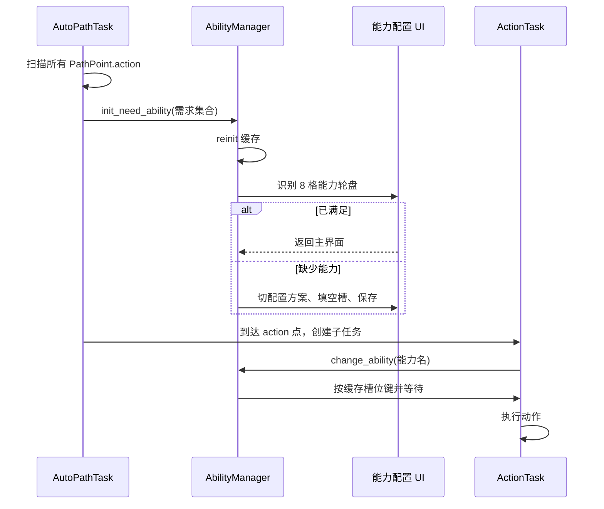
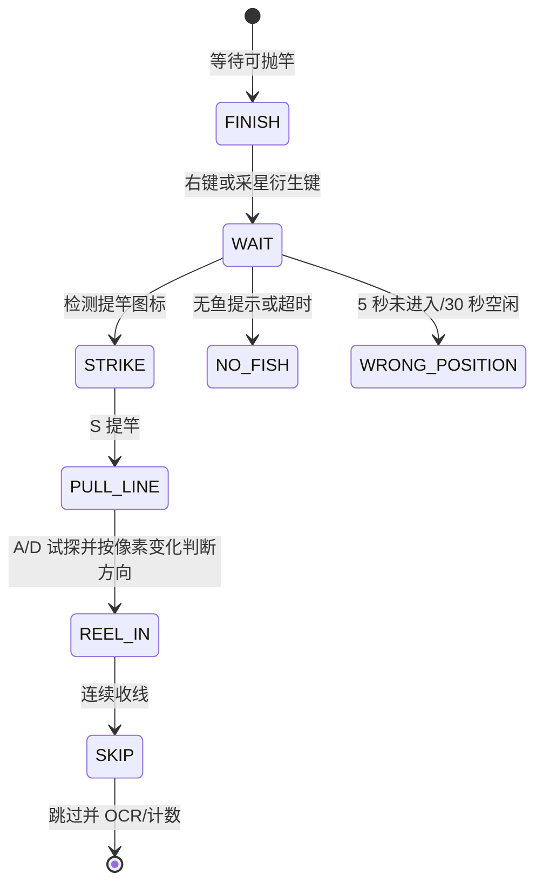

# Whimbox 2.5.4 业务任务、动作与能力

> 基线：`2.5.4`，提交 `a10fa3059f7a47cd26ba65a562184c8735562320`。
>
> 本文以“插件入口 -> 业务任务 -> 路线动作 -> 能力与键鼠”为主线，覆盖当前 `task/`、`action/`、`ability/` 和 `game_nikki` handler。

## 1. 分析范围

本文覆盖：

- [`plugins/game_nikki/main.py`](../../../../../reference_repos/whimbox/whimbox/plugins/game_nikki/main.py#L35) 的游戏检查、通知包装器和 21 个业务 handler；
- `task/common_task`、`task/daily_task`、`task/background_task`、`task/navigation_task`、`task/macro_task`、`task/photo_task`、`task/event_task`、`task/mira_crown_task`、`task/minigame_task` 和测试任务；
- [`action/`](../../../../../reference_repos/whimbox/whimbox/action/material_track_base.py#L13) 中采集、钓鱼、能力动作和跳过对话任务；
- [`ability/ability.py`](../../../../../reference_repos/whimbox/whimbox/ability/ability.py#L15) 的能力识别、能力轮盘初始化与切换；
- 任务如何依赖 UI、OCR、地图、路线、宏、输入和全局配置。

任务框架本身见 [04-任务框架调度与停止.md](./04-任务框架调度与停止.md)，路线/宏数据结构见 [06-脚本宏与资源管理.md](./06-脚本宏与资源管理.md)。

## 2. 核心结论

1. 业务层不是统一“命令对象”集合，而是三种构件组合：面向用户的插件 handler、可编排的 `TaskTemplate`、只由路线或后台任务触发的原子 action。
2. 大多数日常任务属于确定性的 UI 状态机：导航到页面、OCR/模板判断、点击、等待视觉反馈、更新 `TaskResult`。LLM 只选择入口，不参与任务内部决策。
3. `ZhaoxiTask` 和 `XinghaiTask` 是“识别任务文本 -> 归类 -> 按优先级选择已实现子任务 -> 再验证积分”的二级编排器；`AllInOneTask` 是更上一层的日常编排器。
4. `AutoPathTask` 是业务动作的主要汇合点。路线点的 `action` 会实例化拾取、捕虫、清洁、钓鱼、宏、小游戏、星海交互等子任务。
5. 能力管理分两阶段：`init_need_ability()` 先保证需求能力存在于 8 格能力轮盘，`change_ability()` 再按已缓存键位切换。原子 action 通常只做第二阶段，依赖调用方事先初始化。
6. 钓鱼不是一次点击，而是基于视觉图标的状态循环；材料追踪也不是坐标路线，而是“小地图追踪角度 + 能力按钮激活”的闭环控制。
7. 后台小工具是独立常驻轮询，自动拾取/跳过直接发输入，自动钓鱼/对话才复用任务类。
8. 当前任务目录包含未暴露给插件的内部或历史任务，例如旧 `DigTask`、`RollDiceTask`、`MinigameTask` 和 `TestTask`；不能把“存在类”理解为“用户可直接调用”。

## 3. 业务分层



## 4. 插件 handler 覆盖矩阵

插件声明整体拥有 `screen` 和 `input` 权限，因此所有工具调用都进入 `game_runtime` 资源组，见 [`plugin.json`](../../../../../reference_repos/whimbox/whimbox/plugins/game_nikki/plugin.json#L10)。handler 映射表位于 [`TOOL_FUNCS`](../../../../../reference_repos/whimbox/whimbox/plugins/game_nikki/main.py#L322)。

| 工具 ID | Handler | 游戏检查 | 实际目标 | 额外逻辑 |
| --- | --- | --- | --- | --- |
| `nikki.jihua` | [`run_jihua`](../../../../../reference_repos/whimbox/whimbox/plugins/game_nikki/main.py#L98) | 是 | `JihuaTask` | 原样传入工具参数 |
| `nikki.bless` | [`run_bless`](../../../../../reference_repos/whimbox/whimbox/plugins/game_nikki/main.py#L103) | 是 | `BlessTask` | 原样传参 |
| `nikki.monster` | [`run_monster`](../../../../../reference_repos/whimbox/whimbox/plugins/game_nikki/main.py#L108) | 是 | `MonsterTask` | 关卡名超过 2 字直接报错 |
| `nikki.dig` | [`run_dig`](../../../../../reference_repos/whimbox/whimbox/plugins/game_nikki/main.py#L116) | 是 | `DigTaskV2` | 不使用旧 `DigTask` |
| `nikki.zhaoxi` | [`run_zhaoxi`](../../../../../reference_repos/whimbox/whimbox/plugins/game_nikki/main.py#L121) | 是 | `ZhaoxiTask` | 日常二级编排 |
| `nikki.search_path` | [`run_search_path`](../../../../../reference_repos/whimbox/whimbox/plugins/game_nikki/main.py#L125) | 否 | `ScriptsManager` | 同时搜索路线、宏、乐谱；无结果时放宽字段 |
| `nikki.load_path` | [`run_load_path`](../../../../../reference_repos/whimbox/whimbox/plugins/game_nikki/main.py#L223) | 是 | `AutoPathTask` | 先精确查路线名 |
| `nikki.record_path` | [`run_record_path`](../../../../../reference_repos/whimbox/whimbox/plugins/game_nikki/main.py#L239) | 是 | `RecordPathTask` | 忽略输入，进入交互录制 |
| `nikki.record_macro` | [`run_record_macro`](../../../../../reference_repos/whimbox/whimbox/plugins/game_nikki/main.py#L244) | 是 | `RecordMacroTask` | 忽略输入，监听全局键鼠 |
| `nikki.run_macro` | [`run_run_macro`](../../../../../reference_repos/whimbox/whimbox/plugins/game_nikki/main.py#L249) | 是 | `RunMacroTask` | 先查询非乐谱宏 |
| `nikki.play_music` | [`run_play_music`](../../../../../reference_repos/whimbox/whimbox/plugins/game_nikki/main.py#L260) | 是 | `RunMacroTask` | 兼容 `music_name/macro_name` |
| `nikki.open_path_folder` | [`run_open_path_folder`](../../../../../reference_repos/whimbox/whimbox/plugins/game_nikki/main.py#L270) | 否 | `ScriptsManager.open_path_folder` | 直接打开本地脚本目录 |
| `nikki.daily_photo` | [`run_daily_photo`](../../../../../reference_repos/whimbox/whimbox/plugins/game_nikki/main.py#L279) | 是 | `DailyPhotoTask` | 拍照后删除任务照片 |
| `nikki.all_in_one` | [`run_all_in_one`](../../../../../reference_repos/whimbox/whimbox/plugins/game_nikki/main.py#L284) | 否 | `AllInOneTask` | 完成后发 Windows 通知；任务自行启动游戏 |
| `nikki.start_game` | [`run_start_game`](../../../../../reference_repos/whimbox/whimbox/plugins/game_nikki/main.py#L288) | 否 | `StartGameTask` | 允许游戏尚未启动 |
| `nikki.goto_ui` | [`run_goto_ui`](../../../../../reference_repos/whimbox/whimbox/plugins/game_nikki/main.py#L293) | 是 | `GotoUITask` | 页面名必须在 `ui_page_dict` |
| `nikki.monthly_pass` | [`run_monthly_pass`](../../../../../reference_repos/whimbox/whimbox/plugins/game_nikki/main.py#L298) | 是 | `MonthlyPassTask` | 领取奇迹之旅奖励 |
| `nikki.weekly_realm` | [`run_weekly_realm`](../../../../../reference_repos/whimbox/whimbox/plugins/game_nikki/main.py#L303) | 是 | `WeeklyRealmTask` | 目标来自全局配置 |
| `nikki.xinghai` | [`run_xinghai`](../../../../../reference_repos/whimbox/whimbox/plugins/game_nikki/main.py#L308) | 是 | `XinghaiTask` | 星海日常二级编排 |
| `nikki.mira_crown` | [`run_mira_crown`](../../../../../reference_repos/whimbox/whimbox/plugins/game_nikki/main.py#L313) | 是 | `MiraCrownTask` | 当前传入 `force_start=True` |
| `nikki.xinghai_run` | [`run_xinghai_run`](../../../../../reference_repos/whimbox/whimbox/plugins/game_nikki/main.py#L318) | 是 | `XinghaiRunTask` | 识别今日结晶位置并选固定路线 |

`_check_game_ok()` 会刷新句柄、前置游戏窗口、检查 16:9/16:10，并对不在推荐宽度范围的分辨率发警告，但仍允许继续，见 [`main.py`](../../../../../reference_repos/whimbox/whimbox/plugins/game_nikki/main.py#L35)。

## 5. `task/` 完整覆盖矩阵

### 5.1 通用任务 `common_task`

| 文件/类 | 步骤与职责 | 主要依赖 | 调用方 |
| --- | --- | --- | --- |
| [`StartGameTask`](../../../../../reference_repos/whimbox/whimbox/task/common_task/start_game_task.py#L15) | 查找/启动叠纸启动器，点击登录流程，等待游戏窗口和受支持分辨率，必要时处理登录文本 | 进程句柄、OCR、启动器配置 | 直接工具、`AllInOneTask` |
| [`EnterGameTask`](../../../../../reference_repos/whimbox/whimbox/task/common_task/enter_game_task.py#L9) | 点击“进入游戏”，等待 Loading 消失，处理异常弹窗和月卡遮罩，确认主界面 | OCR、页面特征 | `StartGameTask`、换号、一条龙 |
| [`ChangeAccountTask`](../../../../../reference_repos/whimbox/whimbox/task/common_task/change_account_task.py#L11) | 退出登录，OCR/合并/滚动账号列表，选择未完成账号，再进入游戏 | 登录 UI、账号列表 OCR | 多账号一条龙 |
| [`CloseGameTask`](../../../../../reference_repos/whimbox/whimbox/task/common_task/close_game_task.py#L5) | 关闭游戏句柄和 `xstarter.exe` | `ProcessHandler` | 一条龙可选尾步骤 |
| [`GotoUITask`](../../../../../reference_repos/whimbox/whimbox/task/common_task/goto_ui_task.py#L5) | 用页面字典导航到指定页面 | `ui_page_dict`、`ui_control` | 直接工具 |

这些任务中除默认需要回主界面的情况外，多数覆盖 `handle_finally()` 为 no-op，避免在启动、登录、关闭或通用导航流程结束时强行操作不存在/不合适的主界面。

### 5.2 日常与编排任务 `daily_task`

| 文件/类 | 核心流程 | 子任务/数据来源 | 当前入口 |
| --- | --- | --- | --- |
| [`AllInOneTask`](../../../../../reference_repos/whimbox/whimbox/task/daily_task/all_in_one_task.py#L38) | 动态组合启动、默认日常、自定义脚本、多账号、汇总、关游戏 | 配置、`ScriptsManager`、下列任务 | `nikki.all_in_one` |
| [`JihuaTask`](../../../../../reference_repos/whimbox/whimbox/task/daily_task/jihua_task.py#L17) | 进入素材激化幻境，选择产物/消耗素材/数量，领取结果 | `material_icon_dict`、体力配置 | 直接、朝夕、一条龙 |
| [`BlessTask`](../../../../../reference_repos/whimbox/whimbox/task/daily_task/bless_task.py#L11) | 选择祝福闪光试炼和难度，快速挑战，领取结果 | 关卡配置、体力配置 | 直接、朝夕、一条龙 |
| [`MonsterTask`](../../../../../reference_repos/whimbox/whimbox/task/daily_task/monster_task.py#L9) | 选择魔物试炼，快速挑战，领取结果 | 关卡配置、体力配置 | 直接、朝夕、一条龙 |
| [`DigTaskV2`](../../../../../reference_repos/whimbox/whimbox/task/daily_task/dig_task_v2.py#L11) | 从 ESC 入口检查是否可收获，一键收获并再次挖掘 | UI/OCR | 直接、一条龙 |
| [`DigTask`](../../../../../reference_repos/whimbox/whimbox/task/daily_task/dig_task.py#L39) | 旧版挖掘流程，还可选择目标产物 | 配置/UI | 当前插件和一条龙不使用 |
| [`CheckEnergyTask`](../../../../../reference_repos/whimbox/whimbox/task/daily_task/check_energy_task.py#L6) | OCR 当前体力并与朝夕所需消耗比较 | 朝夕解析出的 `need_cost_energy` | `ZhaoxiTask` 内部 |
| [`MonthlyPassTask`](../../../../../reference_repos/whimbox/whimbox/task/daily_task/monthly_pass_task.py#L8) | 打开奇迹之旅、领取可用奖励、退出 | UI | 直接、一条龙 |
| [`WeeklyRealmTask`](../../../../../reference_repos/whimbox/whimbox/task/daily_task/weekly_realm_task.py#L36) | OCR 周本进度，逐个快速挑战配置目标 | `setting_options.json`、配置 | 直接、一条龙 |
| [`ZhaoxiTask`](../../../../../reference_repos/whimbox/whimbox/task/daily_task/zhaoxi_task.py#L94) | 识别 5 个朝夕任务、排序、执行已支持项、消耗剩余体力、验证 500 分并领奖 | `zxxy_task_info_list`、路线/日常/拍照子任务 | 直接、一条龙 |
| [`XinghaiRunTask`](../../../../../reference_repos/whimbox/whimbox/task/daily_task/xinghai_run_task.py#L12) | 进入星海地图，识别结晶图标位置，匹配到 8 条固定路线之一并执行 | 大地图视觉、`AutoPathTask` | 直接、一条龙 |
| [`XinghaiTask`](../../../../../reference_repos/whimbox/whimbox/task/daily_task/xinghai_task.py#L136) | 识别 5 个星海任务、排序、执行已支持项、验证 500 分、领奖并传送挂机点 | `xhsg_task_info_list`、路线/拍照/点赞任务 | 直接、一条龙 |
| [`daily_task/cvar.py`](../../../../../reference_repos/whimbox/whimbox/task/daily_task/cvar.py#L1) | 朝夕/星海点击坐标和任务名常量 | 无 | 两个日常编排器 |

`daily_task/__init__.py` 只导出当前主流程需要的十个类；`DigTask`、`XinghaiRunTask` 和星海原子任务使用显式导入，见 [`__init__.py`](../../../../../reference_repos/whimbox/whimbox/task/daily_task/__init__.py#L1)。

### 5.3 星海原子任务 `daily_task/starsea_task`

| 类 | 路线 action | 行为 |
| --- | --- | --- |
| [`LookbookLikeTask`](../../../../../reference_repos/whimbox/whimbox/task/daily_task/starsea_task/lookbook_like_task.py#L11) | 无，`XinghaiTask` 直接调用 | 打开星绘图册并随机点赞 |
| [`GroupChatTask`](../../../../../reference_repos/whimbox/whimbox/task/daily_task/starsea_task/group_chat_task.py#L9) | `GROUP_CHAT` | 坐下、进入聚会聊天、发 `1`、退出座位 |
| [`PlaceItemTask`](../../../../../reference_repos/whimbox/whimbox/task/daily_task/starsea_task/place_item_task.py#L7) | `PLACE_ITEM` | 选择、放置并尝试收回摆饰；河灯不可收回 |
| [`ChangeMusicTask`](../../../../../reference_repos/whimbox/whimbox/task/daily_task/starsea_task/change_music_task.py#L6) | `CHANGE_MUSIC` | 触发留声机交互后回主界面 |
| [`PickupBottleTask`](../../../../../reference_repos/whimbox/whimbox/task/daily_task/starsea_task/pickup_bottle_task.py#L6) | `PICKUP_BOTTLE` | 拾取并计数漂流瓶 |
| [`DeliveryBottleTask`](../../../../../reference_repos/whimbox/whimbox/task/daily_task/starsea_task/delivery_bottle_task.py#L6) | `DELIVERY_BOTTLE` | 交互、确认投递、二次确认 |
| [`TransAnimalTask`](../../../../../reference_repos/whimbox/whimbox/task/daily_task/starsea_task/trans_animal_task.py#L6) | `TRANS_ANIMAL` | 变身指定次数，再退出并确认 |

拍照、漂流瓶合影、星芒之翼合影等任务不是各自独立类，而是由相应路线在点位上触发 `DailyPhotoTask`。

### 5.4 导航、宏、照片、活动、小游戏和测试

| 模块/类 | 职责 | 可达方式 |
| --- | --- | --- |
| [`AutoPathTask`](../../../../../reference_repos/whimbox/whimbox/task/navigation_task/auto_path_task.py#L42) | 读取路线点、初始化地图/能力/控制线程、定位与移动、触发 action、聚合材料 | 工具、日常、一条龙、路线 action |
| [`AutoPathClickSkipMonitor`](../../../../../reference_repos/whimbox/whimbox/task/navigation_task/auto_path_task.py#L26) | 跑图时后台检测 `IconClickSkip` 并按交互键 | `AutoPathTask.step0` |
| [`RecordPathTask`](../../../../../reference_repos/whimbox/whimbox/task/navigation_task/record_path_task.py#L22) | 采样坐标、分号标特殊点、优化、保存路线 | `nikki.record_path` |
| [`RunMacroTask`](../../../../../reference_repos/whimbox/whimbox/task/macro_task/run_macro_task.py#L17) | 回放宏/乐谱，支持循环、拖拽和页面等待/跳转 | 工具、一条龙、路线、小游戏 |
| [`RecordMacroTask`](../../../../../reference_repos/whimbox/whimbox/task/macro_task/record_macro_task.py#L15) | 监听键鼠并保存宏 | `nikki.record_macro` |
| [`DailyPhotoTask`](../../../../../reference_repos/whimbox/whimbox/task/photo_task/daily_photo_task.py#L7) | 进入相机、拍照、确认并删除照片、退出 | 工具、朝夕、星海路线 |
| [`MiraCrownTask`](../../../../../reference_repos/whimbox/whimbox/task/mira_crown_task/mira_crown_task.py#L11) | 检查巅峰赛进度、循环挑战、推荐搭配、可选领奖兑换 | 工具、一条龙 |
| [`MinigameTask`](../../../../../reference_repos/whimbox/whimbox/task/minigame_task/minigame_task.py#L13) | NPC 对话、运行小游戏宏、失败重试一次、领奖退出 | 路线 `MINIGAME` action |
| [`RollDiceTask`](../../../../../reference_repos/whimbox/whimbox/task/event_task/roll_dice_task.py#L126) | 旧 1.11 大富翁活动：识别骰子、路线/事件、答题/刮奖/玩趣箱循环 | 当前未注册插件 handler |
| [`TestTask`](../../../../../reference_repos/whimbox/whimbox/task/test_task.py#L7) | 仅打印若干测试循环 | 本地调试，不在插件表 |
| [`navigation_task/rdp.py`](../../../../../reference_repos/whimbox/whimbox/task/navigation_task/rdp.py#L55) | 录制路线的 RDP 式转折点标记 | `RecordPathTask.optimize_path` |

### 5.5 后台任务

后台模块不继承 `TaskTemplate`，覆盖如下：

| 对象 | 责任 | 状态/触发 |
| --- | --- | --- |
| [`BackgroundFeature`](../../../../../reference_repos/whimbox/whimbox/task/background_task/background_task.py#L25) | 六个功能枚举 | 钓鱼、对话、拾取、清洁跳过、芳间巡游、花套捕虫 |
| [`FeatureConfig`](../../../../../reference_repos/whimbox/whimbox/task/background_task/background_task.py#L35) | 开关、轮询间隔计数 | `should_execute()` 每 N 轮触发 |
| [`BackgroundTaskManager`](../../../../../reference_repos/whimbox/whimbox/task/background_task/background_task.py#L62) | 单例、配置持久化、线程启停 | `background.get/set` RPC |
| [`BackgroundTask`](../../../../../reference_repos/whimbox/whimbox/task/background_task/background_task.py#L189) | 截图轮询、鼠标 listener、机会检测、执行子任务 | 模块加载后常驻线程 |

自动拾取和清洁跳过直接发送按键；芳间巡游/花套功能根据用户右键建立意图标志，再自动补右键；钓鱼和对话分别复用 `FishingTask` 和 `SkipDialogTask`，见 [`BackgroundTask.run`](../../../../../reference_repos/whimbox/whimbox/task/background_task/background_task.py#L343)。

## 6. Action 完整覆盖矩阵

| Action 类 | 能力依赖 | 感知/控制核心 | 上游 |
| --- | --- | --- | --- |
| [`PickupTask`](../../../../../reference_repos/whimbox/whimbox/action/pickup.py#L9) | 无 | 连续检测拾取图标、按交互键、OCR 物品文本并计数 | 路线 `PICK_UP` |
| [`MaterialTrackBaseTask`](../../../../../reference_repos/whimbox/whimbox/action/material_track_base.py#L13) | 按素材类型映射到清洁/捕虫 | 开精确追踪、读小地图材料角度、转向前进、以能力按钮发光判定可交互 | 捕虫/清洁基类 |
| [`CatchInsectTask`](../../../../../reference_repos/whimbox/whimbox/action/catch_insect.py#L5) | 捕虫 | 继承材料追踪，动作后等待 0.8 秒 | 路线 `CATCH_INSECT` |
| [`CleanAnimalTask`](../../../../../reference_repos/whimbox/whimbox/action/clean_animal.py#L6) | 动物清洁 | 继承材料追踪，无额外后摇 | 路线 `CLEAN_ANIMAL` |
| [`FloralInsectTask`](../../../../../reference_repos/whimbox/whimbox/action/floral_insect.py#L7) | 捕虫 | 切能力、右键、等待 1 秒 | 路线 `FLORAL_INSECT` |
| [`FairyAnimalTask`](../../../../../reference_repos/whimbox/whimbox/action/fairy_animal.py#L7) | 动物清洁 | 切能力、右键、等待 1 秒 | 路线 `FAIRY_ANIMAL` |
| [`FishingTask`](../../../../../reference_repos/whimbox/whimbox/action/fishing.py#L47) | 钓鱼；可选万物交响；家园为采星 | 视觉状态机处理提竿、拉线、收线、跳过和计数 | 路线、后台 |
| [`BigTask`](../../../../../reference_repos/whimbox/whimbox/action/big.py#L7) | 变大 | 切能力后右键 | 路线 `BIG` |
| [`FlourishTask`](../../../../../reference_repos/whimbox/whimbox/action/flourish.py#L7) | 芳间巡游 | 右键启动、衍生键、等待、右键结束 | 路线 `FLOURISH` |
| [`MagnetTask`](../../../../../reference_repos/whimbox/whimbox/action/magnet.py#L7) | 化万相 | 比较衍生能力启用前后像素数，维护 `is_shapeshifting` 缓存 | 路线 `SHAPESHIFTING`、跑图传送后 |
| [`SkipDialogTask`](../../../../../reference_repos/whimbox/whimbox/action/skip_dialog.py#L7) | 无 | 只要跳过对话图标存在就循环按交互键 | 后台自动对话 |

这些 action 多数覆盖 `handle_finally()` 为 no-op，因为它们位于路线中间，返回主界面应由 `AutoPathTask` 或调用方决定。

## 7. AbilityManager 原理与依赖

### 7.1 状态模型

`AbilityManager` 是进程单例，缓存：

| 字段 | 含义 | 写入位置 |
| --- | --- | --- |
| `current_ability` | 框架认为当前选中的能力 | 视觉识别或 `change_ability()` |
| `ability_keymap` | 能力名到 1..8 槽位 | `_check_ability_keymap()` / `_set_ability()` |
| `jump_ability`、`battle_ability` | 跳跃/战斗能力缓存 | 当前仅部分识别逻辑使用 |
| `is_shapeshifting` | 化万相衍生技能是否已开启 | `MagnetTask` |

能力名称和图标映射位于 [`ability/cvar.py`](../../../../../reference_repos/whimbox/whimbox/ability/cvar.py#L28)，包含清洁、捕虫、钓鱼、万物交响、滑翔、变小/变大、黏黏爪、芳间巡游、化万相、采星以及两类跳跃能力。

### 7.2 两阶段调用



路线预扫描映射见 [`AutoPathTask.get_need_ability_list`](../../../../../reference_repos/whimbox/whimbox/task/navigation_task/auto_path_task.py#L156)：

| 路线 action | 初始化能力 |
| --- | --- |
| `FLOURISH` | 芳间巡游 |
| `CATCH_INSECT`、`FLORAL_INSECT` | 捕虫 |
| `CLEAN_ANIMAL`、`FAIRY_ANIMAL` | 动物清洁（后者由 action 使用，预扫描表目前只列 `CLEAN_ANIMAL`） |
| `FISHING` | 钓鱼；配置允许时附加万物交响 |
| `FISHING_STAR` | 采星 |
| `BIG` | 变大 |
| `SHAPESHIFTING` 或 `should_magnet=True` | 化万相 |

`init_need_ability()` 最多接受 8 项；若当前能力已满足单项需求可直接返回，否则进入能力配置页识别槽位。缺能力时按 `OneDragon.ability_plan` 切换方案，将缺少能力放入剩余槽位并保存，见 [`ability.py`](../../../../../reference_repos/whimbox/whimbox/ability/ability.py#L178)。

`change_ability()` 本身不打开配置页；若 `ability_keymap` 尚未初始化会抛异常，见 [`ability.py`](../../../../../reference_repos/whimbox/whimbox/ability/ability.py#L229)。这就是 action 与路线初始化之间的关键前置契约。

## 8. 两个闭环动作

### 8.1 材料追踪

`MaterialTrackBaseTask` 只支持 `material.json` 中存在且 `track=true` 的素材。它根据类型取得能力，随后：

```text
切能力
→ 大地图选择素材并开启精确追踪
→ 小地图 HoughCircles 找附近追踪圆
→ 计算圆心相对玩家的角度
→ 转视角并按住前进
→ 能力按钮外圈连续发光两次
→ 松开移动/右键，跳过动作，OCR 获得文本
→ 清追踪缓存并继续，直到数量/60 秒/附近无素材
```

任务主循环见 [`material_track_base.py`](../../../../../reference_repos/whimbox/whimbox/action/material_track_base.py#L35)，追踪视觉算法见 [`map/track.py`](../../../../../reference_repos/whimbox/whimbox/map/track.py#L94)。

### 8.2 钓鱼

`FishingTask` 将当前画面映射为 `FINISH/STRIKE/PULL_LINE/REEL_IN/SKIP/UNKNOWN`，见 [`fishing.py`](../../../../../reference_repos/whimbox/whimbox/action/fishing.py#L26)。核心循环：



大世界最多成功钓 3 次，家园采星最多 5 次。家园先切采星并检查子技能；大世界可先启用万物交响再切钓鱼，见 [`FishingTask.step1`](../../../../../reference_repos/whimbox/whimbox/action/fishing.py#L169)。后台自动钓鱼已经处于抛竿画面，因此直接调用 `step2()`。

## 9. 日常二级编排

### 9.1 朝夕心愿

`ZhaoxiTask` 用关键词表 [`zxxy_task_info_list`](../../../../../reference_repos/whimbox/whimbox/task/daily_task/zhaoxi_task.py#L17) 给任务分配名称、分数和优先级。它点击五个任务位、跳过已完成项、OCR 描述，按 `(priority, score)` 降序执行。

已实现映射：

| 识别类别 | 执行对象 |
| --- | --- |
| 消耗活跃能量 | `CheckEnergyTask`（只检查是否可能足够） |
| 采集植物 | 固定路线 `朝夕心愿_采集`，目标 5 |
| 捕虫 | 固定路线 `朝夕心愿_捕虫`，目标 3 |
| 打怪 | 固定路线 `朝夕心愿_战斗` |
| 祝福闪光/素材激化/魔物试炼 | 对应幻境任务 |
| 拍照 | `DailyPhotoTask` |

小游戏、挖掘、升级祝福、制作服装能被识别但当前不在 `task_dict`，会记录“暂不支持”并继续，见 [`ZhaoxiTask.step3`](../../../../../reference_repos/whimbox/whimbox/task/daily_task/zhaoxi_task.py#L167)。执行后还会按配置选择一种幻境消耗剩余体力，最后重新 OCR 500 分并领奖。

### 9.2 星海拾光

`XinghaiTask` 同样用 [`xhsg_task_info_list`](../../../../../reference_repos/whimbox/whimbox/task/daily_task/xinghai_task.py#L17) 分类和排序。当前直接实现点赞、聊天、泡泡制造、摆饰、音乐、漂流瓶拾取/投递、多种拍照和动物变身路线；椰果、碎片、结晶、流星、泡泡合影等部分识别项不在映射中，会跳过。

任务完成后不仅领奖，还传送到星海无界枢纽挂机坐标，见 [`XinghaiTask.step6`](../../../../../reference_repos/whimbox/whimbox/task/daily_task/xinghai_task.py#L251)。星光结晶收集由独立的 `XinghaiRunTask` 在一条龙里先执行，不属于 `XinghaiTask.task_dict`。

## 10. 代表性纵向调用链

### 10.1 直接素材激化

```text
nikki.jihua
→ _with_game_check
→ TaskAdapter.run(JihuaTask)
→ page_huanjing_jihua
→ 找入口并进入幻境
→ 选择目标产物/消耗素材/次数
→ 确认、跳过、领奖
→ back_to_page_main
```

入口见 [`run_jihua`](../../../../../reference_repos/whimbox/whimbox/plugins/game_nikki/main.py#L98)，业务步骤见 [`jihua_task.py`](../../../../../reference_repos/whimbox/whimbox/task/daily_task/jihua_task.py#L34)。

### 10.2 朝夕任务触发路线采集

```text
ZhaoxiTask.step2 OCR “植物”
→ 排序后选择 DAILY_TASK_PICKUP
→ AutoPathTask("朝夕心愿_采集", excepted_num=5)
→ 预扫描路线能力
→ 移动到 PICK_UP 点
→ PickupTask.task_run
→ OCR 材料并合并 material_count_dict
→ 达到期望数量，结束路线
→ 朝夕积分内存值 +200
→ 重新打开朝夕页验证真实积分
```

### 10.3 路线触发钓鱼

```text
AutoPathTask.step0
→ get_need_ability_list: FISHING -> 钓鱼（可附加万物交响）
→ AbilityManager.init_need_ability
→ 到达 FISHING 目标点
→ FishingTask.step1 切能力
→ FishingTask.step2/fishing_loop
→ 视觉状态机完成最多三条鱼
→ material_count_dict 合并回 AutoPathTask
```

action 分派见 [`AutoPathTask.inner_step_update_target`](../../../../../reference_repos/whimbox/whimbox/task/navigation_task/auto_path_task.py#L276)。

### 10.4 后台自动对话

```text
BackgroundTask 截图发现 IconSkipDialog
→ skip_if_busy 获取 game_runtime
→ 建立 background run.status
→ SkipDialogTask.task_run
→ 循环按交互键直到图标消失
→ completed/cancelled/error 状态
→ 释放资源锁
```

实现见 [`BackgroundTask._execute_dialogue`](../../../../../reference_repos/whimbox/whimbox/task/background_task/background_task.py#L543)。

## 11. 状态与数据

| 数据 | 产生者 | 消费者 | 说明 |
| --- | --- | --- | --- |
| `TaskResult.data` | 原子/日常任务 | 父任务、RPC | 常用于材料计数、账号结果、布尔结果 |
| `material_count_dict` | Pickup/Fishing/MaterialTrack | `AutoPathTask.merge_material_count_dict` | 按素材名累加 |
| `current_score` | 朝夕/星海 OCR | 任务选择循环 | 内存值用于提前停止，最终仍以 OCR 复核 |
| `unfinished_tasks` | 日常文本识别 | `step3/step4` | 每项含 `task_name/score/priority` |
| `ability_keymap` | 能力配置页视觉识别 | 所有 action 的 `change_ability` | 进程单例缓存，跑图开始时重建 |
| `is_shapeshifting` | `MagnetTask` | 后续传送点 | 避免重复打开衍生技能 |
| `FishingState` | UI 图标匹配 | `fishing_loop` | 单帧状态；UNKNOWN 连续多次才视作结束 |
| `BackgroundTask.need_flourish/need_floral` | 用户右键 listener | 后台轮询 | 表示需要自动续按，不是能力真实状态 |

## 12. 调试入口

1. [`game_nikki._check_game_ok`](../../../../../reference_repos/whimbox/whimbox/plugins/game_nikki/main.py#L35)：确认窗口、分辨率和前置行为；
2. 任一 [`run_* handler`](../../../../../reference_repos/whimbox/whimbox/plugins/game_nikki/main.py#L98)：核对工具输入是否与任务构造函数一致；
3. [`ZhaoxiTask.step2`](../../../../../reference_repos/whimbox/whimbox/task/daily_task/zhaoxi_task.py#L116) / [`XinghaiTask.step3`](../../../../../reference_repos/whimbox/whimbox/task/daily_task/xinghai_task.py#L155)：查看 OCR 文本、匹配分类和排序结果；
4. [`AutoPathTask.get_need_ability_list`](../../../../../reference_repos/whimbox/whimbox/task/navigation_task/auto_path_task.py#L156)：查看路线能力需求；
5. [`AbilityManager._check_ability_keymap`](../../../../../reference_repos/whimbox/whimbox/ability/ability.py#L96)：检查每个槽位的模板相似度；
6. [`AbilityManager.change_ability`](../../../../../reference_repos/whimbox/whimbox/ability/ability.py#L229)：确认缓存槽位与实际按键；
7. [`AutoPathTask.inner_step_update_target`](../../../../../reference_repos/whimbox/whimbox/task/navigation_task/auto_path_task.py#L276)：观察 action 参数和子任务结果；
8. [`MaterialTrackBaseTask.step3`](../../../../../reference_repos/whimbox/whimbox/action/material_track_base.py#L46)：观察角度、连续识别失败和能力激活计数；
9. [`FishingTask.get_current_state`](../../../../../reference_repos/whimbox/whimbox/action/fishing.py#L62)：逐帧核对钓鱼状态模板；
10. [`BackgroundTask.run`](../../../../../reference_repos/whimbox/whimbox/task/background_task/background_task.py#L343)：确认轮询节流、前台暂停和触发机会。

调试业务任务时，建议同时记录“当前页面、关键模板匹配结果、OCR 原文、发出的键鼠动作、`TaskResult`”五项，单看日志中的步骤文案无法判断是识别失败还是输入后游戏未响应。

## 13. 风险与待验证点

1. **奇迹之冠直接工具参数不匹配。** handler 固定传 `{"force_start": True}`，但 [`MiraCrownTask.__init__`](../../../../../reference_repos/whimbox/whimbox/task/mira_crown_task/mira_crown_task.py#L12) 只接受 `session_id`。按当前代码，直接调用 `nikki.mira_crown` 会在构造时产生 `TypeError`；一条龙直接构造类，不受影响。
2. **能力 action 依赖隐式前置条件。** `change_ability()` 在 `ability_keymap` 为空时直接抛异常。通过 `AutoPathTask` 调用通常安全，单独调试 action 或未来新增直接 handler 时必须先 `init_need_ability()`。
3. **路线能力预扫描不完全对称。** `FAIRY_ANIMAL` 实际使用动物清洁能力，但当前 `action_to_ability_map` 没列它；若路线只有该 action，初始化阶段可能不准备清洁能力。
4. **AbilityManager 是视觉状态的缓存，不是事实源。** 用户手动换能力或衍生技能被游戏关闭后，`current_ability/is_shapeshifting` 可能过期；跑图开始会 `reinit()`，但同一路线中间的外部操作仍需验证。
5. **日常会提前构造全部候选子任务。** `ZhaoxiTask` 和 `XinghaiTask` 在执行循环前建立 `task_dict`，其中多个 `AutoPathTask` 会立刻查询脚本并校验版本。任一默认脚本缺失可能使整个识别步骤异常，即使当天未抽到那类任务。
6. **识别表大于实现表。** 朝夕和星海都能识别若干当前不支持的类别。优先级组合是否始终能靠已支持任务凑到 500 分，需要跟随游戏每日任务池持续验证。
7. **“成功”有时只代表流程走完。** 例如部分星海原子任务没有显式成功结果，沿用 `TaskResult` 默认 success；需要靠父任务最终积分 OCR 才能确认游戏侧结果。
8. **动作清理不统一。** 多数 action 不回主界面是为了路线连续性，但若动作异常停在弹窗或特殊姿态，父 `AutoPathTask` 的后续定位可能先进入中断等待；应为高频异常画面补回归测试。
9. **后台自动钓鱼绕过 `FishingTask.step1/task_run` 并泄漏 listener。** “玩家已经抛竿”使跳过 `step1` 合理，但顶层任务构造时已经启动 pynput listener；只执行 `step2()` 不会进入统一 finally 的 stop/join，listener 回调又持有任务实例，因此每次触发都会残留活动 listener。详见任务框架文档的风险列表。
10. **后台功能在模块导入时启动线程。** 即使所有开关关闭，线程也会等待游戏并轮询；单元测试或只读工具导入 `rpc_method_groups` 时应注意这个副作用。
11. **活动任务具有明显版本时效。** `RollDiceTask` 文件注释写明面向 1.11 活动，且没有当前插件入口；页面资产或题库不可假设仍有效。
12. **OCR 规则高度依赖中文文案。** 朝夕/星海关键词、账号归一化、关卡文本和领奖判断都可能受游戏文案、字体、缩放和 OCR 错字影响，应以截图样本建立回归集。

## 14. 关联文档

- [项目架构梳理](../项目架构梳理.md)
- [04-任务框架调度与停止](./04-任务框架调度与停止.md)
- [06-脚本宏与资源管理](./06-脚本宏与资源管理.md)
- 地图定位、UI 页面图、InteractionCore 和视觉资产的细节应在对应专题文档展开；本文只保留它们与业务任务的契约。
