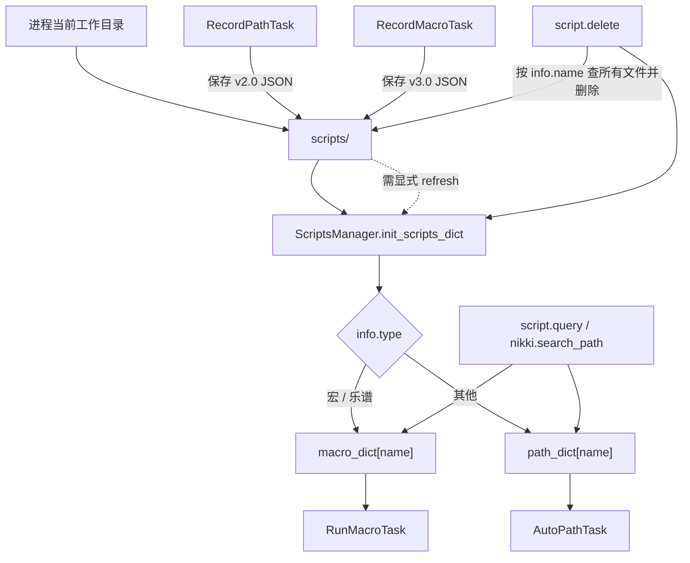
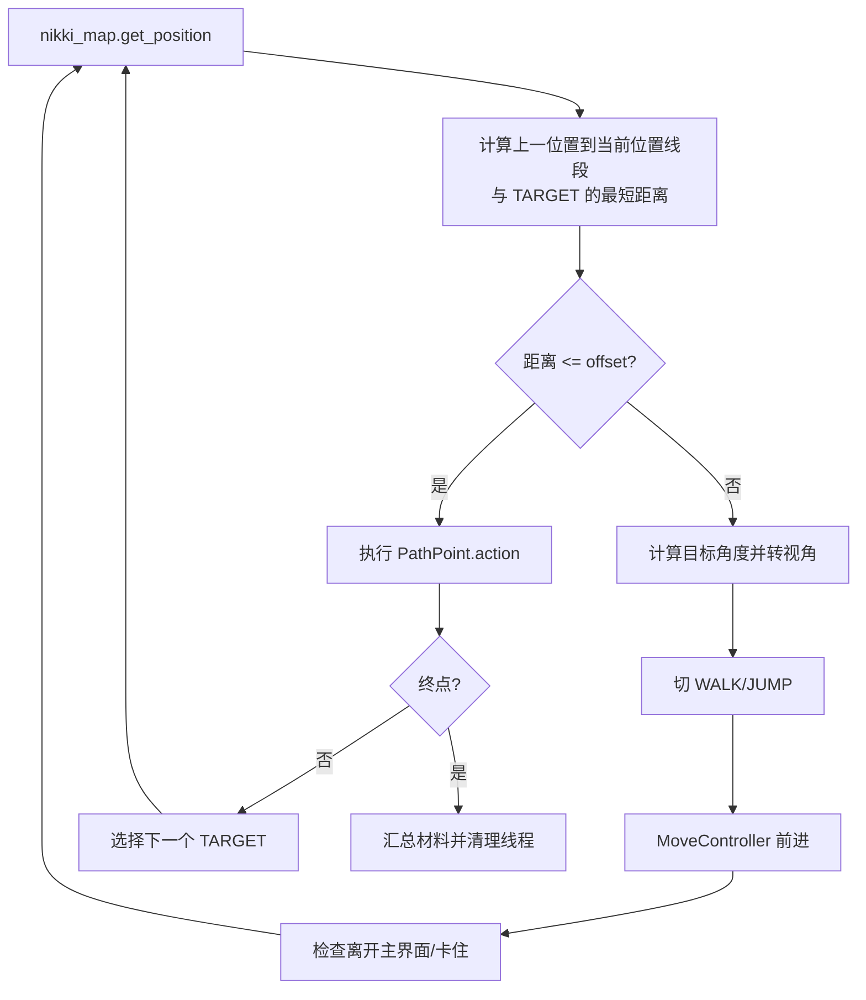

# Whimbox 2.5.4 脚本、宏与资源管理

> 基线：`2.5.4`，提交 `a10fa3059f7a47cd26ba65a562184c8735562320`。
>
> 本文中的“脚本”专指 `scripts/` 下的路线 JSON、宏 JSON 和乐谱 JSON，不是 Agent Skill 或 Python 源文件。

## 1. 分析范围

本文覆盖：

- [`common/path_lib.py`](../../../../../reference_repos/whimbox/whimbox/common/path_lib.py#L18) 中脚本目录的解析；
- [`common/scripts_manager.py`](../../../../../reference_repos/whimbox/whimbox/common/scripts_manager.py#L10) 中 Pydantic 数据模型、扫描索引、搜索、删除和打开目录；
- [`rpc_method_groups.py`](../../../../../reference_repos/whimbox/whimbox/rpc_method_groups.py#L21) 中脚本查询、删除和刷新 RPC；
- [`plugins/game_nikki/main.py`](../../../../../reference_repos/whimbox/whimbox/plugins/game_nikki/main.py#L125) 中搜索、加载路线、录制/运行宏、演奏和打开目录 handler；
- [`navigation_task/record_path_task.py`](../../../../../reference_repos/whimbox/whimbox/task/navigation_task/record_path_task.py#L22) 的路线录制与优化；
- [`navigation_task/auto_path_task.py`](../../../../../reference_repos/whimbox/whimbox/task/navigation_task/auto_path_task.py#L42) 的路线加载、坐标转换、移动和 action 分派；
- [`macro_task/record_macro_task.py`](../../../../../reference_repos/whimbox/whimbox/task/macro_task/record_macro_task.py#L15) 的键鼠录制；
- [`macro_task/run_macro_task.py`](../../../../../reference_repos/whimbox/whimbox/task/macro_task/run_macro_task.py#L17) 的宏/乐谱回放；
- `AllInOneTask`、`ZhaoxiTask`、`XinghaiTask` 和 `MinigameTask` 对脚本资源的消费方式。

## 2. 核心结论

1. 路线、宏和乐谱共享同一个运行目录 `os.getcwd()/scripts`，并共享一个 `ScriptsManager` 单例索引；工作目录因此是运行时契约，不只是 IDE 设置。
2. JSON 的 `info.type` 决定分类：`宏`、`乐谱` 解析成 `MacroRecord`，其他值都按 `PathRecord` 解析。
3. 索引在 `ScriptsManager` 首次导入时全量递归扫描。重复逻辑名称按 `update_time` 字符串选较新版本，而不是按文件名或文件版本号。
4. 路线当前严格要求 `version == "2.0"`，宏/乐谱严格要求 `version == "3.0"`。版本迁移不在执行器中做。
5. 路线记录保存游戏原生坐标；路线运行时把它们转成地图图片像素坐标。这样 JSON 不绑定某一张地图图片的像素尺寸。
6. 路线点既描述移动几何，也可以携带业务动作；`AutoPathTask` 因而同时是导航执行器和动作编排器。
7. 宏录制只记录键盘按下/松开、鼠标按下/松开以及事件间隔，不记录连续鼠标移动；回放器通过“鼠标按下 + gap + 同键释放”推导平滑拖拽。
8. 宏模式比单纯键鼠录像更丰富：模型还支持循环、等待进入页面、等待离开页面、导航到页面。录制器本身不会生成这些高级步骤，它们来自外部编辑或下载脚本。
9. 路线/宏录制完成后，源码没有自动刷新 `ScriptsManager` 缓存；前端需调用 `script.refresh` 或重启/触发其他刷新路径，才能立即搜索和运行新文件。
10. 当前 Git 工作树没有受版本控制的 `scripts/` 内容，且 `.gitignore` 明确忽略它；默认日常路线必须由安装包、下载流程或用户本地数据提供，不能从本仓库源码推断实际点位。

## 3. 资源生命周期



## 4. 数据模型覆盖矩阵

模型全部定义在 [`scripts_manager.py`](../../../../../reference_repos/whimbox/whimbox/common/scripts_manager.py#L10)，由 Pydantic 在加载时校验。

### 4.1 公共和路线模型

| 模型 | 字段 | 必填性/语义 | 使用方 |
| --- | --- | --- | --- |
| `ScriptInfo` | `name` | 必填，逻辑主键 | 两类索引字典的 key |
| `ScriptInfo` | `type` | 可空；`宏/乐谱` 决定宏分类，其他视为路线 | 扫描分类、搜索过滤 |
| `ScriptInfo` | `update_time` | 可空字符串；重复逻辑名时用于比较 | `init_scripts_dict()` |
| `ScriptInfo` | `version` | 可空；执行器再做严格版本判断 | `AutoPathTask/RunMacroTask` |
| `PathInfo` | `target` | 目标素材名 | 路线搜索、期望数量判断、采集 action |
| `PathInfo` | `count` | 声明可获得数量 | `query_path(count>=要求)` |
| `PathInfo` | `region/map` | 地区和地图标识 | 坐标转换、地图定位 |
| `PathInfo` | `test_mode` | 是否测试路线 | 部分 action 禁止实际采集 |
| `PathPoint` | `id` | 点序号 | 日志与当前索引 |
| `PathPoint` | `move_mode` | 当前为 `WALK/JUMP` | 跳跃/移动控制器 |
| `PathPoint` | `point_type` | `PASS/TARGET` | 只有 `TARGET` 被选作导航目标 |
| `PathPoint` | `action` | 可选动作常量 | 到达点位后分派子任务 |
| `PathPoint` | `action_params` | 可选字符串 | 等待秒数、按键、数量、宏名等重载参数 |
| `PathPoint` | `position` | 两个浮点数，保存时为游戏坐标 | 运行时转换为地图像素 |
| `PathRecord` | `info/points` | 路线头和有序点列表 | 录制、搜索、执行 |

移动和 action 字符串常量定义在 [`view_and_move/cvars.py`](../../../../../reference_repos/whimbox/whimbox/view_and_move/cvars.py#L1)，传送距离阈值定义在 [`navigation_task/common.py`](../../../../../reference_repos/whimbox/whimbox/task/navigation_task/common.py#L1)。

### 4.2 宏模型

| 模型 | 字段 | 语义 |
| --- | --- | --- |
| `MacroInfo` | 公共 `ScriptInfo` 字段 | `type=宏` 为普通回放，`type=乐谱` 为演奏 |
| `MacroInfo.aspect_ratio` | `16:9`、`16:10` 或空 | 有鼠标事件的普通宏用于回放前分辨率校验 |
| `MacroRecord.steps` | `MacroStep[]` | 有序操作流 |
| `MacroStep.type` | `gap/keyboard/mouse/loop/wait_game_page/wait_not_game_page/goto_game_page` | 操作判别字段 |
| `key/action` | 键名 + `press/release` | 键盘和鼠标按键事件 |
| `position` | `(x, y)` | 窗口内坐标，按窗口宽度归一化到 1920 |
| `duration` | 秒 | `gap`，也用于推导拖拽持续时间 |
| `loop_count/loop_steps` | 次数 + 后续步骤数 | `loop` 控制范围 |
| `target_game_page` | 页面字典键 | 页面等待和导航步骤的目标 |

字段类型约束只保证结构，不保证组合语义。例如 `type=keyboard` 仍可缺少 `key/action`；这类错误由执行器行为决定。

## 5. ScriptsManager 职责与 API 矩阵

### 5.1 单例与扫描

`ScriptsManager.__new__()` 保证进程单例，`__init__()` 只运行一次并立即扫描，见 [`scripts_manager.py`](../../../../../reference_repos/whimbox/whimbox/common/scripts_manager.py#L59)。`init_scripts_dict()` 每次都会先清空两个字典，再用 `os.walk()` 递归读所有 `.json`。

分类和去重规则：

1. 先用 `json.loads()` 读取 `info.type`；
2. `宏/乐谱` 用 `MacroRecord.model_validate_json()`；其他用 `PathRecord.model_validate_json()`；
3. 以 `info.name` 为索引键；
4. 同名时用 `existing.info.update_time < candidate.info.update_time` 选更晚者；
5. 单文件异常只记日志并跳过，不阻断其余文件。

实现见 [`init_scripts_dict`](../../../../../reference_repos/whimbox/whimbox/common/scripts_manager.py#L79)。索引只保存模型，不保存来源路径；需要删除时会重新扫描文件内容寻找同名文件。

### 5.2 查询、搜索和管理

| 方法 | 匹配语义 | 默认隐藏 | 返回 |
| --- | --- | --- | --- |
| [`query_path(path_name=...)`](../../../../../reference_repos/whimbox/whimbox/common/scripts_manager.py#L115) | 逻辑名精确字典查找 | 不隐藏 | 单个 `PathRecord` 或 `None` |
| `query_path(name=...)` | 路线名不区分大小写包含 | 隐藏内部前缀 | 列表/首项 |
| `query_path(target=...)` | 目标素材不区分大小写包含 | 隐藏内部前缀 | 列表/首项 |
| `query_path(type=...)` | 类型精确匹配 | 隐藏内部前缀 | 列表/首项 |
| `query_path(count=N)` | 声明数量 `>= N` | 隐藏内部前缀 | 列表/首项 |
| [`search_path_items`](../../../../../reference_repos/whimbox/whimbox/common/scripts_manager.py#L158) | 包装组合查询、按名称排序 | 同上 | 最多 5 个 `{path_name}` |
| [`query_macro`](../../../../../reference_repos/whimbox/whimbox/common/scripts_manager.py#L314) | 先精确名，再名称包含；用 `is_play_music` 区分类别 | 模糊/全量查询时隐藏内部前缀 | 模型列表或首项 |
| [`search_macro_items`](../../../../../reference_repos/whimbox/whimbox/common/scripts_manager.py#L193) | 包装宏查询、排序 | 同上 | 最多 5 个 `{macro_name,type}` |
| [`delete_path`](../../../../../reference_repos/whimbox/whimbox/common/scripts_manager.py#L262) | 按 JSON 内 `info.name` 找所有非宏文件 | 无 | 删除文件数，并刷新索引 |
| [`delete_macro`](../../../../../reference_repos/whimbox/whimbox/common/scripts_manager.py#L380) | 按 `info.name` 找所有宏/乐谱文件 | 无 | 删除文件数，并刷新索引 |
| [`open_path_folder`](../../../../../reference_repos/whimbox/whimbox/common/scripts_manager.py#L301) | Windows `os.startfile(SCRIPT_PATH)` | 不适用 | 成功布尔与消息 |
| [`init_scripts_dict`](../../../../../reference_repos/whimbox/whimbox/common/scripts_manager.py#L79) | 全量重建缓存 | 不适用 | 无 |

“内部前缀”是 `朝夕心愿_`、`星海拾光_`、`家园日常`。默认搜索隐藏它们，避免用户或 Agent 把一条龙内部实现路线当作通用路线；`show_default=True` 可显示，精确 `path_name` 查询不受影响。

### 5.3 两组外部接口

RPC 管理接口位于 [`handle_script_method`](../../../../../reference_repos/whimbox/whimbox/rpc_method_groups.py#L21)：

| RPC | 行为 |
| --- | --- |
| `script.query_path` | 返回序列化后的 `info`，不返回全部点位 |
| `script.query_macro` | 返回序列化后的 `info`，不返回操作步骤 |
| `script.delete` | 按 `category=path/macro/music` 删除；music 也走 `delete_macro` |
| `script.refresh` | 显式调用 `init_scripts_dict()` |

游戏插件接口则偏执行：

- [`run_search_path`](../../../../../reference_repos/whimbox/whimbox/plugins/game_nikki/main.py#L125) 同时搜路线、宏和乐谱；严格查询无结果时，把 `name/target` 逐个当作路线名和素材名重试，也会用 `target` 补查宏/乐谱；
- [`run_load_path`](../../../../../reference_repos/whimbox/whimbox/plugins/game_nikki/main.py#L223) 精确取路线并交给 `AutoPathTask`；
- [`run_run_macro`](../../../../../reference_repos/whimbox/whimbox/plugins/game_nikki/main.py#L249) 和 [`run_play_music`](../../../../../reference_repos/whimbox/whimbox/plugins/game_nikki/main.py#L260) 查询后都交给 `RunMacroTask`；
- [`run_record_path`](../../../../../reference_repos/whimbox/whimbox/plugins/game_nikki/main.py#L239) 和 [`run_record_macro`](../../../../../reference_repos/whimbox/whimbox/plugins/game_nikki/main.py#L244) 启动交互式录制；
- [`run_open_path_folder`](../../../../../reference_repos/whimbox/whimbox/plugins/game_nikki/main.py#L270) 打开共享目录。

## 6. 路线录制

### 6.1 采样与特殊点

`RecordPathTask` 在构造时把分号热键绑定到 `recognize()`，按下后记录一个 `TARGET + WALK + PICK_UP` 特殊点，见 [`record_path_task.py`](../../../../../reference_repos/whimbox/whimbox/task/navigation_task/record_path_task.py#L22)。录制过程：

1. 初始化小地图，确认当前区域支持定位；
2. 要求起点距离最近传送点小于 30 像素，并把起点记为 `TARGET + TELEPORT`；
3. 主界面中每 0.1 秒取位置，与上个点距离至少 2 时追加 `PASS` 点；
4. 移动模式变化时强制把新点设为 `TARGET`；
5. 用户停止后补终点并保存。

入口见 [`RecordPathTask.step1`](../../../../../reference_repos/whimbox/whimbox/task/navigation_task/record_path_task.py#L65) 和 [`step2`](../../../../../reference_repos/whimbox/whimbox/task/navigation_task/record_path_task.py#L80)。

### 6.2 优化与坐标持久化

`optimize_path()` 做三类修正，见 [`record_path_task.py`](../../../../../reference_repos/whimbox/whimbox/task/navigation_task/record_path_task.py#L141)：

- 修正二段跳瞬间被误识别为单帧 `WALK` 的点；
- 对两个 TARGET 之间的点调用 `rdp_optimize(..., epsilon=1)`，把偏离线段最大的转折点递归标为 TARGET；
- `WALK -> JUMP` 切换时，把跳跃前一个点改为跳跃 TARGET，把后一个点改为 PASS。

保存前，所有地图图片像素坐标通过 `convert_PngMapPx_to_GameLoc()` 转回游戏原生坐标，写入：

```json
{
  "info": {
    "name": "我的路线_YYYYMMDDhhmmss",
    "type": "",
    "target": "",
    "region": "...",
    "map": "...",
    "update_time": "YYYY-MM-DD hh:mm:ss",
    "version": "2.0",
    "test_mode": false
  },
  "points": []
}
```

保存实现见 [`save_path`](../../../../../reference_repos/whimbox/whimbox/task/navigation_task/record_path_task.py#L99)。路线停止键同时是“结束并保存”：`task_stop()` 先产生 stop，`save_path()` 最后用 `force_update=True` 改成成功结果。

## 7. 路线运行

### 7.1 加载和初始化

`AutoPathTask` 接受已经解析的 `path_record` 或逻辑 `path_name`，二者必须至少有一个。构造时：

- 深拷贝 `points`，避免把运行时坐标改回索引缓存；
- 严格检查 `info.version == "2.0"`；
- 按 `info.map` 把每个游戏坐标转换成地图图片像素；
- 初始化位置、目标点、移动模式、卡住状态、材料计数和线程引用。

见 [`AutoPathTask.__init__`](../../../../../reference_repos/whimbox/whimbox/task/navigation_task/auto_path_task.py#L43)。`step0` 启动 `JumpController`、`MoveController` 和跳过监控线程，扫描 action 需求并配置能力轮盘，再初始化小地图位置，见 [`auto_path_task.py`](../../../../../reference_repos/whimbox/whimbox/task/navigation_task/auto_path_task.py#L178)。

### 7.2 导航闭环



到达判断不是只看当前帧距离，而是在 `last_position -> curr_position` 之间插值，计算整段到目标的最小距离，避免走过目标后永远越来越远，见 [`inner_step_update_target`](../../../../../reference_repos/whimbox/whimbox/task/navigation_task/auto_path_task.py#L276)。

卡住处理位于 [`check_stuck`](../../../../../reference_repos/whimbox/whimbox/task/navigation_task/auto_path_task.py#L224)：位置 5 秒不变会尝试停止、前进和跳跃，15 秒仍不变则抛异常；框架重试时从最近记录的传送点索引恢复。

### 7.3 路线 action 完整矩阵

分派代码位于 [`auto_path_task.py`](../../../../../reference_repos/whimbox/whimbox/task/navigation_task/auto_path_task.py#L298)，常量位于 [`view_and_move/cvars.py`](../../../../../reference_repos/whimbox/whimbox/view_and_move/cvars.py#L7)。

| `action` | `action_params` | 执行行为 | 结果处理 |
| --- | --- | --- | --- |
| `TELEPORT` | 无 | 距离足够远时传送到附近流转之柱，校准视角 | 记录最近传送点供重试 |
| `PICK_UP` | 无 | `PickupTask` | 合并物品计数 |
| `FLOURISH` | 无 | `FlourishTask` | 检查子任务状态 |
| `SHAPESHIFTING` | 无 | `MagnetTask` | 维护化万相开启状态 |
| `CATCH_INSECT` | 期望数量，默认 1 | `CatchInsectTask(target, count)` | 合并目标素材计数 |
| `FLORAL_INSECT` | 无 | `FloralInsectTask` | 检查状态 |
| `CLEAN_ANIMAL` | 期望数量，默认 1 | `CleanAnimalTask(target, count)` | 合并目标素材计数 |
| `FAIRY_ANIMAL` | 无 | `FairyAnimalTask` | 检查状态 |
| `FISHING` | 无 | 大世界 `FishingTask` | 合并鱼计数 |
| `FISHING_STAR` | 无 | 家园采星 `FishingTask` | 合并陨星计数，避免重复完成 |
| `BIG` | 无 | `BigTask` | 检查状态 |
| `WAIT` | 秒，缺省为 `jump2walk_stop_time` | `time.sleep(float(...))` | 无子任务 |
| `KEY_CLICK` | 键名 | `itt.key_press` | 无子任务 |
| `MINIGAME` | 宏名 | `MinigameTask` | 检查状态 |
| `MACRO` | 宏名 | `RunMacroTask` | 检查状态 |
| `PLACE_ITEM` | 无 | `PlaceItemTask` | 检查状态 |
| `GROUP_CHAT` | 无 | `GroupChatTask` | 检查状态 |
| `CHANGE_MUSIC` | 无 | `ChangeMusicTask` | 检查状态 |
| `PICKUP_BOTTLE` | 无 | `PickupBottleTask` | 合并漂流瓶计数 |
| `DELIVERY_BOTTLE` | 无 | `DeliveryBottleTask` | 检查状态 |
| `TAKE_PHOTO` | 无 | `DailyPhotoTask` | 检查状态 |
| `TRANS_ANIMAL` | 次数，默认 1 | `TransAnimalTask` | 检查状态 |

任一子任务结果不是 `success` 时，`AutoPathTask` 把自身结果更新为 `failed`，但没有立即结束路线；之后仍会推进目标点，见 [`auto_path_task.py`](../../../../../reference_repos/whimbox/whimbox/task/navigation_task/auto_path_task.py#L450)。最终 `step2` 只在有材料时更新成功消息，也不会自动覆盖先前 failed。

`test_mode` 会跳过多种采集和宏动作，但不是对所有 action 的统一禁用：例如 `BIG`、`WAIT`、`KEY_CLICK`、`MINIGAME` 和若干星海交互仍按当前分支执行。它更像“主要采集动作测试开关”，不是安全沙箱。

## 8. 宏录制

### 8.1 事件模型

`RecordMacroTask` 同时启动 `pynput.keyboard.Listener` 和 `pynput.mouse.Listener`。它维护两个按下集合，避免按键长按产生重复 press，并在相邻事件相隔超过 10ms 时插入 `gap`，见 [`record_macro_task.py`](../../../../../reference_repos/whimbox/whimbox/task/macro_task/record_macro_task.py#L61)。

鼠标监听只接收 click，不接收 move。坐标转换规则位于 [`_screen_to_window_position`](../../../../../reference_repos/whimbox/whimbox/task/macro_task/record_macro_task.py#L37)：

```text
window_x = screen_x - window_left
window_y = screen_y - window_top
normalized_x = window_x * 1920 / window_width
normalized_y = window_y * 1920 / window_width
```

也就是说 x、y 使用同一个“按窗口宽度缩放”的比例，保持几何比例；不是分别归一化到 1920x1080。

### 8.2 保存规则

开始录制时先检查窗口宽高比。若有任意鼠标事件，保存 `aspect_ratio=16:9/16:10/其他` 中的识别结果；但模型只允许前两者或空，当前游戏入口已经限制支持的比例，所以正常路径不会保存“其他”。没有鼠标事件时不保存比例。

停止后创建：

```json
{
  "info": {
    "name": "我的宏_YYYYMMDDhhmmss",
    "type": "宏",
    "version": "3.0",
    "update_time": "YYYY-MM-DD hh:mm:ss",
    "aspect_ratio": "16:9"
  },
  "steps": []
}
```

实际写入 `steps=self.steps[:-2]`，见 [`RecordMacroTask.step2`](../../../../../reference_repos/whimbox/whimbox/task/macro_task/record_macro_task.py#L243)。这是为了排除结束录制热键对应的末尾事件，但源码没有验证最后两个事件具体是什么。和路线录制一样，保存成功使用 `force_update=True` 把手动停止结果改成 success。

## 9. 宏与乐谱回放

### 9.1 加载前置检查

`RunMacroTask.__init__()` 通过逻辑名称查询缓存，要求存在且 `version == "3.0"`，并用 `info.type == 乐谱` 设置 `is_play_music`，见 [`run_macro_task.py`](../../../../../reference_repos/whimbox/whimbox/task/macro_task/run_macro_task.py#L20)。

执行前：

- 乐谱要求当前正是 `page_play_music`；
- 普通宏若声明 `aspect_ratio`，要求当前窗口匹配相应范围；
- 可选 `delay` 先做一次普通 `time.sleep()`；
- 可选 `check_stop_func` 为小游戏等调用者提供额外停止条件。

见 [`execute_macro`](../../../../../reference_repos/whimbox/whimbox/task/macro_task/run_macro_task.py#L174)。

### 9.2 步骤执行矩阵

| 类型 | 执行语义 | 停止特征 |
| --- | --- | --- |
| `gap` | `time.sleep(duration)` | 单次 sleep 内不检查停止 |
| `keyboard` | `itt.key_down/up(key)`，同步更新 `pressing_keys` | 步骤间检查 |
| `mouse` | 移到归一化窗口坐标后按下/松开鼠标键 | 步骤间检查 |
| `loop` | 将后续 `loop_steps` 个步骤重复 `loop_count` 次，然后跳过原序列的这段 | 每轮及子步骤间检查 |
| `wait_game_page` | 最多 20 秒轮询页面出现 | 循环只看超时，不看 `need_stop` |
| `wait_not_game_page` | 最多 20 秒轮询页面消失 | 同上 |
| `goto_game_page` | `ui_control.goto_page(..., max_retry=2)` | 由 UI 导航内部决定 |

单步实现见 [`_execute_step`](../../../../../reference_repos/whimbox/whimbox/task/macro_task/run_macro_task.py#L101)，循环实现在 [`execute_macro`](../../../../../reference_repos/whimbox/whimbox/task/macro_task/run_macro_task.py#L199)。

### 9.3 平滑拖拽推导

回放器会向前查找：

```text
mouse press(position A)
→ 0..N 个 gap（累加 duration）
→ 同一个 mouse key 的 release(position B)
```

若持续时间至少 0.08 秒且 A/B 距离至少 10 像素，就不逐项执行，而是按下后调用 `itt.move_to(..., smooth=True, smooth_duration=...)` 平滑移动再释放，见 [`_find_drag_release_step`](../../../../../reference_repos/whimbox/whimbox/task/macro_task/run_macro_task.py#L36)。遇到任何其他步骤就放弃拖拽推导。

`handle_finally()` 会释放 `pressing_keys` 中所有未释放按键，但刻意不回主界面，见 [`run_macro_task.py`](../../../../../reference_repos/whimbox/whimbox/task/macro_task/run_macro_task.py#L251)。

## 10. 脚本在业务编排中的使用

### 10.1 一条龙自定义步骤

`AllInOneTask` 从配置读取前置和后置项目，只接受 `path/macro`。运行路线时精确查询并构造 `AutoPathTask`，运行宏时精确查询并构造 `RunMacroTask`；失败会记录到自定义步骤摘要，停止会终止一条龙，见 [`all_in_one_task.py`](../../../../../reference_repos/whimbox/whimbox/task/daily_task/all_in_one_task.py#L190)。

### 10.2 内置日常路线

| 编排器 | 固定脚本依赖 |
| --- | --- |
| `AllInOneTask` | `家园日常` |
| `ZhaoxiTask` | `朝夕心愿_采集`、`朝夕心愿_捕虫`、`朝夕心愿_战斗` |
| `XinghaiTask` | 聚会聊天、泡泡制造、放置摆饰、更改音乐、漂流瓶、合影、动物变身等 `星海拾光_*` 路线 |
| `XinghaiRunTask` | 8 个特定结晶位置对应的 `星海拾光_星光结晶收集_*` 路线 |
| `MinigameTask` | 路线 action 参数提供的宏名 |

这些内部名称被默认搜索隐藏，但业务使用 `path_name` 精确查询，不受隐藏规则影响。

## 11. 代表性纵向调用链

### 11.1 Agent 搜索并运行路线

```text
nikki.search_path(name/target)
→ ScriptsManager.search_path_items
→ 若无结果，handler 放宽 name/target 字段
→ 返回 item_type=path/macro/music 候选
→ nikki.load_path(path_name)
→ ScriptsManager.query_path(path_name=精确名)
→ TaskAdapter.run(AutoPathTask, path_record)
→ v2.0 校验、坐标转换、能力初始化
→ 导航闭环 + action 子任务
```

### 11.2 录制路线后刷新

```text
nikki.record_path
→ RecordPathTask
→ 自动采样 + 分号特殊点
→ 停止键
→ optimize_path / 坐标转回游戏坐标
→ scripts/我的路线_*.json
→ script.refresh
→ ScriptsManager 重建 path_dict
→ 新路线可被 search/load
```

### 11.3 路线中的小游戏宏

```text
AutoPathTask 到达 action=MINIGAME, action_params=宏名
→ MinigameTask 与 NPC 对话
→ RunMacroTask(check_stop_func=不再是主界面)
→ 回放键鼠直到游戏画面状态改变
→ MinigameTask 判断成功/失败
→ 最多重试一次并领奖退出
```

调用点见 [`auto_path_task.py`](../../../../../reference_repos/whimbox/whimbox/task/navigation_task/auto_path_task.py#L397) 和 [`minigame_task.py`](../../../../../reference_repos/whimbox/whimbox/task/minigame_task/minigame_task.py#L35)。

### 11.4 乐谱回放

```text
nikki.play_music(music_name)
→ query_macro(is_play_music=True)
→ RunMacroTask
→ info.type 判定 is_play_music
→ 验证 page_play_music
→ 按 v3.0 steps 回放
→ finally 释放仍按下的键，保留演奏页面
```

## 12. 状态与数据清单

| 数据 | 内存/磁盘 | 所有者 | 更新时机 |
| --- | --- | --- | --- |
| `SCRIPT_PATH` | 路径常量 | `path_lib` | 模块导入时按 CWD 计算 |
| `path_dict` | 内存 | `ScriptsManager` | 初始化、显式刷新、删除后刷新 |
| `macro_dict` | 内存 | `ScriptsManager` | 同上 |
| 路线 JSON | 磁盘 | 用户/下载器/`RecordPathTask` | 录制或外部安装 |
| 宏/乐谱 JSON | 磁盘 | 用户/下载器/`RecordMacroTask` | 录制或外部安装 |
| `path_points` | 内存深拷贝 | `AutoPathTask` | 构造时坐标转换，运行时索引推进 |
| `last_teleport_point_id` | 内存 | `AutoPathTask` | 遇到 `TELEPORT` 点时，重试恢复使用 |
| `material_count_dict` | 内存 | `AutoPathTask` | action 子任务结果合并 |
| `steps` | 内存 | `RecordMacroTask/RunMacroTask` | 录制追加，回放只读 |
| `pressing_keys` | 内存 | `RunMacroTask` | key/mouse press/release；finally 兜底释放 |
| `current_step_index` | 内存 | `RunMacroTask` | 回放主序列时更新，供调试观察 |

## 13. 调试入口

1. [`path_lib.SCRIPT_PATH`](../../../../../reference_repos/whimbox/whimbox/common/path_lib.py#L18)：先确认 PyCharm Working Directory；
2. [`ScriptsManager.init_scripts_dict`](../../../../../reference_repos/whimbox/whimbox/common/scripts_manager.py#L79)：检查扫描到的文件、分类异常和同名选择；
3. [`ScriptsManager.query_path`](../../../../../reference_repos/whimbox/whimbox/common/scripts_manager.py#L115) / [`query_macro`](../../../../../reference_repos/whimbox/whimbox/common/scripts_manager.py#L314)：确认精确、模糊、默认隐藏和类别过滤；
4. [`run_search_path`](../../../../../reference_repos/whimbox/whimbox/plugins/game_nikki/main.py#L125)：观察严格搜索与放宽搜索的差异；
5. [`RecordPathTask._add_point`](../../../../../reference_repos/whimbox/whimbox/task/navigation_task/record_path_task.py#L45)：检查移动模式、点类型和位置采样；
6. [`optimize_path`](../../../../../reference_repos/whimbox/whimbox/task/navigation_task/record_path_task.py#L141)：对比优化前后点列表；
7. [`AutoPathTask.__init__`](../../../../../reference_repos/whimbox/whimbox/task/navigation_task/auto_path_task.py#L43)：检查版本、地图名和坐标转换；
8. [`AutoPathTask.inner_step_update_target`](../../../../../reference_repos/whimbox/whimbox/task/navigation_task/auto_path_task.py#L276)：查看目标距离、action 和材料合并；
9. [`RecordMacroTask._on_keyboard_press`](../../../../../reference_repos/whimbox/whimbox/task/macro_task/record_macro_task.py#L61) / [`_on_mouse_click`](../../../../../reference_repos/whimbox/whimbox/task/macro_task/record_macro_task.py#L155)：确认事件去重与 gap；
10. [`RunMacroTask._find_drag_release_step`](../../../../../reference_repos/whimbox/whimbox/task/macro_task/run_macro_task.py#L36)：核对拖拽是否被识别；
11. [`RunMacroTask._execute_step`](../../../../../reference_repos/whimbox/whimbox/task/macro_task/run_macro_task.py#L101)：逐步查看页面等待、坐标和按键状态；
12. [`RunMacroTask.handle_finally`](../../../../../reference_repos/whimbox/whimbox/task/macro_task/run_macro_task.py#L251)：确认异常/停止后没有残留按键。

建议调试脚本时保留原 JSON 副本，并记录当前窗口分辨率、地图名、脚本版本、逻辑名称和实际来源文件。索引不保存来源路径，同名资源问题仅看 `path_dict/macro_dict` 无法反查哪一个文件获胜。

## 14. 风险与待验证点

1. **工作目录决定脚本目录。** `SCRIPT_PATH=os.path.join(os.getcwd(), "scripts")`；从错误目录启动会得到另一套空索引，且录制文件也写到错误位置。
2. **源码仓库不携带运行路线。** `.gitignore` 忽略 `scripts/*`，当前工作树也没有该目录。默认日常任务在纯源码克隆后能否运行，取决于外部资源下发流程；该流程不在本分析范围内。
3. **录制后缓存不自动刷新。** 两个录制任务中的 `scripts_manager.init_scripts_dict()` 都被注释，见 [`record_path_task.py`](../../../../../reference_repos/whimbox/whimbox/task/navigation_task/record_path_task.py#L136) 和 [`record_macro_task.py`](../../../../../reference_repos/whimbox/whimbox/task/macro_task/record_macro_task.py#L275)。用户立即运行新录制脚本前需调用 `script.refresh`。
4. **同名版本比较依赖可比较的时间字符串。** `update_time` 在模型中可空，但扫描同名文件时直接使用 `<`；空值或非统一格式可能导致该候选文件被异常分支跳过。即便都是字符串，也只在统一 `YYYY-MM-DD HH:MM:SS` 格式下等价于时间顺序。
5. **精确宏查询绕过类别过滤。** `query_macro()` 命中 `macro_dict[name]` 时直接返回，没有检查 `is_play_music`。如果普通宏与请求类型不符但名称精确，`run_macro/play_music` 可能拿到另一类别，最终行为由 `info.type` 决定。
6. **新录制宏无高级语义。** 录制器不会生成 loop 或页面步骤；这些步骤需要可信的外部编辑工具。Pydantic 只校验字段类型，未校验每种 type 的必需字段组合。
7. **单个宏步骤异常被吞掉。** `_execute_step()` 捕获所有异常后只写日志，不把任务结果设为 failed；宏可能在部分步骤失败或页面操作不支持时仍返回 success。需要决定是否属于容错设计，并用业务宏验证。
8. **页面等待的停止响应最多延迟到超时。** `wait_game_page/wait_not_game_page` 的 20 秒循环不检查 `need_stop()`；`gap` 也在完整 sleep 后才响应。
9. **嵌套 loop 不会递归解释。** 主循环识别 `loop`，但 `_execute_steps()` 对循环片段只调用 `_execute_step()`；片段内若再含 `loop`，当前执行器没有对应分支，等同忽略。
10. **`steps[:-2]` 假定停止键恰好产生两个末尾事件。** 若 listener 顺序、鼠标事件或特殊键事件不同，可能误删用户最后操作或保留停止键。需要用字符键和特殊键两种 stop 配置录制验证。
11. **路线 `action_params` 缺少判别类型。** 同一可空字符串承载数量、秒数、按键、宏名；转换失败会在运行时才暴露。建议脚本生成端按 action 做 schema 校验。
12. **路线测试模式不是完整隔离。** 部分 action 仍会真实发键、运行小游戏或操作星海 UI；不要把 `test_mode=true` 当成无副作用预览。
13. **子 action 失败后路线继续。** `AutoPathTask` 记 failed 但仍推进，适合尽量跑完的采集路线；对于必须成功才能继续的交互链，脚本作者需要认识到这个语义。
14. **版本检查是硬失败。** 路线只认 2.0、宏只认 3.0，没有兼容层；下载器或迁移工具必须保证资源升级先于执行器调用。
15. **删除按逻辑名删除全部同名文件。** 这能清掉重复版本，但也意味着用户无法通过当前 API 只删某个来源文件；操作前应在 UI 明确展示删除数量。
16. **索引不是线程安全结构。** `script.refresh/delete` 会原地清空并重建字典，若与任务查询并发执行，当前没有锁保护；资源管理 RPC 与游戏任务并发时需要压力验证。

## 15. 关联文档

- [项目架构梳理](../项目架构梳理.md)
- [04-任务框架调度与停止](./04-任务框架调度与停止.md)
- [05-业务任务动作与能力](./05-业务任务动作与能力.md)
- [09-地图定位与自动跑图](./09-地图定位与自动跑图.md)：继续展开坐标转换、小地图定位、视角与移动控制；本文只分析脚本契约和调用边界。
