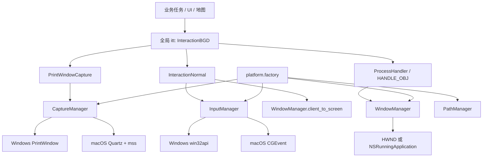
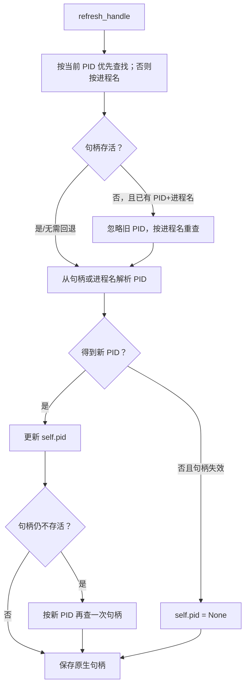
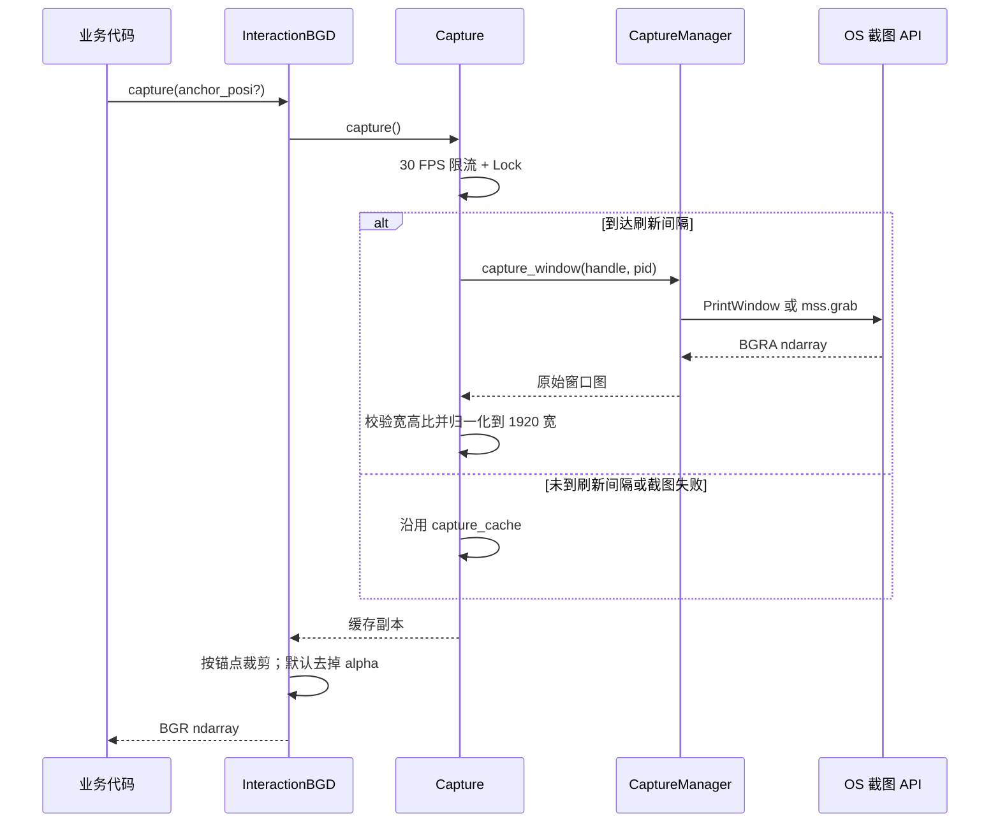

# 07 平台抽象与交互核心

> 分析基线：Whimbox 2.5.4。本文只描述当前仓库中的实现；实验代码和未接入主链的实现会单独标注。

## 1. 分析范围

本文覆盖以下模块：

- 平台抽象接口：[`core/interfaces.py`](../../../../../reference_repos/whimbox/whimbox/core/interfaces.py#L14)；
- 平台选择工厂：[`platform/factory.py`](../../../../../reference_repos/whimbox/whimbox/platform/factory.py#L14)；
- Windows 实现：[`platform/windows/window.py`](../../../../../reference_repos/whimbox/whimbox/platform/windows/window.py#L17)、[`capture.py`](../../../../../reference_repos/whimbox/whimbox/platform/windows/capture.py#L14)、[`input.py`](../../../../../reference_repos/whimbox/whimbox/platform/windows/input.py#L18)、[`path.py`](../../../../../reference_repos/whimbox/whimbox/platform/windows/path.py#L15)；
- macOS 实现：[`platform/macos/window.py`](../../../../../reference_repos/whimbox/whimbox/platform/macos/window.py#L16)、[`capture.py`](../../../../../reference_repos/whimbox/whimbox/platform/macos/capture.py#L13)、[`input.py`](../../../../../reference_repos/whimbox/whimbox/platform/macos/input.py#L47)、[`path.py`](../../../../../reference_repos/whimbox/whimbox/platform/macos/path.py#L8)；
- 句柄与 DPI：[`common/handle_lib.py`](../../../../../reference_repos/whimbox/whimbox/common/handle_lib.py#L15)、[`common/windows_dpi.py`](../../../../../reference_repos/whimbox/whimbox/common/windows_dpi.py#L14)；
- 截图与输入门面：[`interaction/capture.py`](../../../../../reference_repos/whimbox/whimbox/interaction/capture.py#L18)、[`interaction_normal.py`](../../../../../reference_repos/whimbox/whimbox/interaction/interaction_normal.py#L14)、[`interaction_core.py`](../../../../../reference_repos/whimbox/whimbox/interaction/interaction_core.py#L28)；
- 辅助或旁路实现：[`interaction_template.py`](../../../../../reference_repos/whimbox/whimbox/interaction/interaction_template.py#L5)、[`keyboard_listener.py`](../../../../../reference_repos/whimbox/whimbox/interaction/keyboard_listener.py#L18)、[`winsdk_capture.py`](../../../../../reference_repos/whimbox/whimbox/interaction/winsdk_capture.py#L49)、[`vkcode.py`](../../../../../reference_repos/whimbox/whimbox/interaction/vkcode.py#L1)。

图像识别、资产对象和页面导航详见 [08-UI视觉识别与页面导航](08-UI视觉识别与页面导航.md)，本文只解释它们依赖的截图、坐标和输入基础。

## 2. 核心结论

1. `core/interfaces.py` 定义能力边界，`platform/factory.py` 是现行生产主链统一的操作系统分派点；四类管理器均通过 `lru_cache(maxsize=1)` 形成进程内单例。未启用的 WinRT 实验截图模块仍有直接平台判断。
2. `ProcessHandler` 持有“进程名 + PID + 原生句柄”三元状态。Windows 的句柄是 `HWND`，macOS 的句柄是 `NSRunningApplication`；句柄不会在每次截图或输入前自动刷新。
3. 当前主截图链是 `InteractionBGD -> PrintWindowCapture -> CaptureManager`。Windows 使用 `PrintWindow`，macOS 使用 Quartz 查窗口边界后由 `mss` 截屏。
4. 所有视觉坐标都建立在“宽度归一化为 1920”的逻辑画布上。输入前再按真实窗口宽度缩放，并把客户区坐标转换为屏幕坐标。
5. 16:10 不是压缩成 1920x1080，而是归一化成 1920x1200；纵向差异由锚点处理。DPI 感知必须在导入大量平台和交互对象之前开启。
6. 输入事件是系统级注入，不是向后台窗口发送定向消息。因此 `InteractionBGD.before_operation()` 会先恢复游戏焦点；窗口不在前台时仍直接操作会有误触风险。
7. `WindowsGraphicsCapture`、`NikkiKeyboardListener` 当前均标明未使用，且存在与现行接口不一致之处，不能视为可切换的生产实现。

## 3. 分层结构



这里有两层门面：

- `ProcessHandler` 把不透明的原生句柄包装成稳定的游戏窗口对象；
- `InteractionBGD` 把截图、识别前处理、焦点恢复和键鼠动作组合成业务层统一入口。

## 4. 接口与实现职责

| 层 | 类型/对象 | 主要职责 | 明确不负责的内容 |
|---|---|---|---|
| 抽象层 | [`WindowManager`](../../../../../reference_repos/whimbox/whimbox/core/interfaces.py#L14) | 查找进程、前台/最小化/存活判断、关闭、窗口几何 | 不保存当前游戏句柄 |
| 抽象层 | [`CaptureManager`](../../../../../reference_repos/whimbox/whimbox/core/interfaces.py#L63) | 给定原生句柄和 PID 返回 BGRA 数组 | 不做分辨率归一化或缓存 |
| 抽象层 | [`InputManager`](../../../../../reference_repos/whimbox/whimbox/core/interfaces.py#L71) | 鼠标和键盘的原始注入 | 不做焦点检查、坐标缩放 |
| 抽象层 | [`PathManager`](../../../../../reference_repos/whimbox/whimbox/core/interfaces.py#L109) | 游戏路径、进程名、DPI、权限 | 不管理运行中句柄 |
| 选择层 | [`get_*_manager()`](../../../../../reference_repos/whimbox/whimbox/platform/factory.py#L14) | 按 `sys.platform` 延迟导入并缓存实现 | 不提供 Linux 实现 |
| 状态层 | [`ProcessHandler`](../../../../../reference_repos/whimbox/whimbox/common/handle_lib.py#L15) | 保存并刷新 `process_name/pid/_native_handle` | 不在每个调用前自动自愈 |
| 截图层 | [`Capture`](../../../../../reference_repos/whimbox/whimbox/interaction/capture.py#L18) | 限帧、加锁、缓存、1920 宽归一化 | 不判断游戏页面 |
| 输入层 | [`InteractionNormal`](../../../../../reference_repos/whimbox/whimbox/interaction/interaction_normal.py#L14) | 缩放逻辑坐标、客户区转屏幕坐标、组合按下/抬起 | 不做业务安全检查 |
| 交互层 | [`InteractionBGD`](../../../../../reference_repos/whimbox/whimbox/interaction/interaction_core.py#L28) | 统一截图/输入入口、恢复焦点、操作锁、误入商城保护 | 不拥有任务停止状态 |

## 5. 平台工厂与初始化顺序

### 5.1 工厂是生产主链的统一分派点

四个工厂函数只支持 `win32` 和 `darwin`，其他平台直接抛出 `RuntimeError`。每个函数都独立缓存一个实现对象，因此窗口、截图、输入、路径管理器分别是单例，而不是共享一个总平台对象，见 [`platform/factory.py`](../../../../../reference_repos/whimbox/whimbox/platform/factory.py#L14)。

延迟导入有两个作用：

- Windows 不会导入 AppKit/Quartz，macOS 不会导入 pywin32；
- 现行上层生产模块只依赖抽象接口，不需要散布 `sys.platform` 判断。

仓库级例外是明确标注“暂时不使用”的 [`winsdk_capture.py`](../../../../../reference_repos/whimbox/whimbox/interaction/winsdk_capture.py#L1)：它在模块顶层直接检查 `sys.platform == "win32"`。因此“统一分派点”描述的是当前接入的生产主链，不代表全仓库不存在实验性平台分支。

### 5.2 DPI 必须早于窗口几何

正常入口在 `_prepare()` 的第一步调用 `enable_dpi_awareness()`，随后才检查权限、清理文件和导入插件/Agent/RPC，见 [`main.py`](../../../../../reference_repos/whimbox/whimbox/main.py#L24)。Windows 实现依次尝试：

1. Per-Monitor V2：`SetProcessDpiAwarenessContext(-4)`；
2. Per-Monitor：`SetProcessDpiAwareness(2)`；
3. System DPI：`SetProcessDPIAware()`。

成功后用模块级 `_dpi_awareness_initialized` 防止重复设置，见 [`windows_dpi.py`](../../../../../reference_repos/whimbox/whimbox/common/windows_dpi.py#L11)。macOS 路径管理器只记录 Retina 自动处理的日志，见 [`platform/macos/path.py`](../../../../../reference_repos/whimbox/whimbox/platform/macos/path.py#L20)。

这一步直接影响 `GetClientRect`、`ClientToScreen` 和系统鼠标坐标是否处于同一像素语义。若绕过 `main.py` 直接运行某个任务脚本，DPI 初始化不一定发生，动态分析时必须留意。

## 6. 窗口句柄生命周期

### 6.1 全局对象何时创建

[`HANDLE_OBJ`](../../../../../reference_repos/whimbox/whimbox/common/handle_lib.py#L161) 在导入 `handle_lib` 时立即构造，进程名由平台 `PathManager` 提供：

- Windows：`X6Game-Win64-Shipping.exe`，见 [`WindowsPathManager.PROCESS_NAME`](../../../../../reference_repos/whimbox/whimbox/platform/windows/path.py#L18)；
- macOS：`com.infoldgames.infinitynikkien`，见 [`MacOSPathManager.PROCESS_NAME`](../../../../../reference_repos/whimbox/whimbox/platform/macos/path.py#L11)。

构造函数只要收到进程名或 PID，就立即调用 `refresh_handle()`。因此“导入交互核心”本身就会尝试查找游戏进程。

### 6.2 刷新状态机



具体代码在 [`ProcessHandler.refresh_handle()`](../../../../../reference_repos/whimbox/whimbox/common/handle_lib.py#L40)。其关键语义是：

- PID 是缓存，也是优先查询条件；
- 游戏重启导致旧 PID 失效时，进程名是恢复入口；
- Windows “没找到窗口”可能返回 `0`，macOS 返回 `None`，上层统一通过 `is_alive()` 判断；
- 刷新是显式动作。截图链只读取当前句柄，不会发现失效后主动调用 `refresh_handle()`。

多数需要游戏的插件工具由 `_with_game_check` 包装：先检测存活，失败时刷新，再前置窗口并检查宽高比，见 [`plugins/game_nikki/main.py`](../../../../../reference_repos/whimbox/whimbox/plugins/game_nikki/main.py#L37) 和 [`_with_game_check`](../../../../../reference_repos/whimbox/whimbox/plugins/game_nikki/main.py#L72)。启动任务等待窗口时也会周期性刷新，见 [`start_game_task.py`](../../../../../reference_repos/whimbox/whimbox/task/common_task/start_game_task.py#L99)。但直接调用 `itt`、地图对象或开发脚本时没有这层保证。

### 6.3 Windows 句柄获取与前置

Windows 按 PID 枚举顶层可见窗口，取第一个“进程 PID 相同、可见、无父窗口”的 `HWND`，见 [`_get_hwnd_for_pid()`](../../../../../reference_repos/whimbox/whimbox/platform/windows/window.py#L30)。若同一进程存在多个符合条件的顶层窗口，当前代码没有标题、尺寸或类名筛选。

前置窗口时：

1. 最小化则 `SW_RESTORE`；
2. 临时把当前线程输入队列附着到前台线程和目标线程；
3. 调用 `SetForegroundWindow`；
4. 在 `finally` 中解除两次线程附着；
5. 再次验证目标确实成为前台窗口。

实现见 [`WindowsWindowManager.set_foreground()`](../../../../../reference_repos/whimbox/whimbox/platform/windows/window.py#L63)。这种做法是为了绕过 Windows 的前台窗口限制，但失败会统一转换成“游戏窗口前置失败”。

### 6.4 macOS 句柄获取与前置

macOS 遍历 `NSWorkspace.runningApplications()`，按 PID、bundle identifier 或本地化应用名匹配，见 [`MacOSWindowManager.find_process()`](../../../../../reference_repos/whimbox/whimbox/platform/macos/window.py#L19)。前置先调用 `activateWithOptions_`，失败时再用 AppleScript 激活 bundle/name，并通过前台应用和 Quartz 顶层窗口复核，见 [`set_foreground()`](../../../../../reference_repos/whimbox/whimbox/platform/macos/window.py#L60)。

当前 macOS 的 `is_minimized()` 固定返回 `False`，不是完整的最小化检测，见 [`window.py`](../../../../../reference_repos/whimbox/whimbox/platform/macos/window.py#L56)。

### 6.5 关闭与失效

`ProcessHandler.close_handle()` 先请求窗口正常关闭，然后最多等待约 2 秒；仍未退出时用 `psutil.Process.terminate()`，再超时则 `kill()`，最终刷新句柄，见 [`handle_lib.py`](../../../../../reference_repos/whimbox/whimbox/common/handle_lib.py#L89)。

- Windows 的正常关闭是投递 `WM_CLOSE`，见 [`WindowsWindowManager.close()`](../../../../../reference_repos/whimbox/whimbox/platform/windows/window.py#L114)；
- macOS 调用 `NSRunningApplication.terminate()`，见 [`MacOSWindowManager.close()`](../../../../../reference_repos/whimbox/whimbox/platform/macos/window.py#L87)。

`check_shape()` 只接受宽高比在 `(1.55, 1.80)` 内且宽度大于零的客户区，覆盖 16:10 与 16:9，见 [`handle_lib.py`](../../../../../reference_repos/whimbox/whimbox/common/handle_lib.py#L147)。插件层另外对宽度小于 1920 或大于 2560给出建议，但不会因此拒绝执行，见 [`game_nikki/main.py`](../../../../../reference_repos/whimbox/whimbox/plugins/game_nikki/main.py#L46)。

## 7. 截图链路

### 7.1 主数据流



[`Capture.capture()`](../../../../../reference_repos/whimbox/whimbox/interaction/capture.py#L57) 在锁内刷新缓存并复制返回，避免调用方改写共享帧。最大刷新率为 30 FPS；没有达到时间间隔时仍会返回最近一帧。

### 7.2 分辨率归一化

[`Capture._normalize_shape()`](../../../../../reference_repos/whimbox/whimbox/interaction/capture.py#L33) 保存原始 `img.shape[:2]` 为 `(height, width)`，然后始终把有效截图缩放到宽度 1920：

```text
logical_width  = 1920
logical_height = 1920 / physical_width * physical_height
input_scale    = physical_width / 1920
```

| 原始客户区 | 归一化视觉画布 | 输入缩放系数 |
|---|---:|---:|
| 1920x1080 | 1920x1080 | 1.0 |
| 1920x1200 | 1920x1200 | 1.0 |
| 2560x1440 | 1920x1080 | 1.333... |
| 2560x1600 | 1920x1200 | 1.333... |

这解释了为什么资产以 1920x1080 为基准、却仍能覆盖 16:10：横向统一，纵向保留额外 120 个逻辑像素；UI 区域再用顶部、底部或中心锚点偏移。锚点裁剪细节见 [08 文档的坐标章节](08-UI视觉识别与页面导航.md#5-坐标锚点与分辨率适配)。

插值使用 `INTER_NEAREST`，优点是快且不会引入额外模糊，代价是缩放后的细线和 OCR 字形可能出现锯齿。

### 7.3 失败时的缓存语义

只有新图非空且宽高比校验通过时才覆盖缓存，见 [`Capture._capture()`](../../../../../reference_repos/whimbox/whimbox/interaction/capture.py#L80)。因此：

- 截图 API 暂时失败；
- 窗口最小化返回异常图；
- 句柄已经失效；
- macOS 窗口查找失败后得到不合规画面；

都可能使业务层继续拿到上一张有效帧，而不是 `None`。这提高短暂失败时的稳定性，但也会把“截图断流”伪装成“画面一直没变化”。调试卡死时应同时观察 `capture_times`、`capture_obj.resolution` 和窗口存活状态，不能只看返回数组。

### 7.4 Windows 与 macOS 截图差异

| 平台 | 获取方式 | 画面范围 | 失败行为 |
|---|---|---|---|
| Windows | `GetClientRect` + GDI 位图 + `PrintWindow(..., 3)` | 按代码意图为目标客户区 | 捕获异常返回 `None` |
| macOS | Quartz 找 PID 对应窗口边界，`mss.grab(bounds)` | 屏幕坐标中的窗口矩形 | 找不到窗口时回退截主显示器 |

Windows 实现在 [`WindowsCaptureManager.capture_window()`](../../../../../reference_repos/whimbox/whimbox/platform/windows/capture.py#L17)，正常路径会删除位图、DC 并释放窗口 DC。异常路径只有总括 `except`，若异常发生在资源创建之后，已创建 GDI 资源未必被释放。

macOS 实现在 [`MacOSCaptureManager.capture_window()`](../../../../../reference_repos/whimbox/whimbox/platform/macos/capture.py#L34)。其“找不到窗口就截主显示器”的回退可能在主显示器恰好是兼容宽高比时通过形状校验，后续视觉识别实际面对的却不是游戏窗口；这是需要实机验证的风险。

### 7.5 未启用的 WinRT 截图

[`winsdk_capture.py`](../../../../../reference_repos/whimbox/whimbox/interaction/winsdk_capture.py#L1) 文件开头明确写着“暂时不使用”。它尝试使用 `Windows.Graphics.Capture`、D3D 设备和帧池，并包含清理 session/frame pool 的代码。但当前 `WindowsGraphicsCapture.__init__()` 调用 `super().__init__()` 时没有传入现行 `Capture` 必需的 `hwnd_handler`，见 [`winsdk_capture.py`](../../../../../reference_repos/whimbox/whimbox/interaction/winsdk_capture.py#L55) 与 [`Capture.__init__()`](../../../../../reference_repos/whimbox/whimbox/interaction/capture.py#L19)。因此它不是可通过配置直接启用的替代后端。

## 8. 输入与坐标转换

### 8.1 逻辑坐标到系统坐标

绝对移动由 [`InteractionNormal.move_to()`](../../../../../reference_repos/whimbox/whimbox/interaction/interaction_normal.py#L103) 完成：

1. 输入坐标以 1920x1080 逻辑画布为基准；
2. 根据 `anchor` 把 16:10 的额外逻辑高度加到 `y`；
3. 乘 `physical_width / 1920` 转成真实客户区像素；
4. `WindowManager.client_to_screen()` 转为屏幕绝对坐标；
5. 平台输入管理器设置系统鼠标位置。

相对移动不做客户区转屏幕坐标，只按真实宽度比例缩放 `(dx, dy)`，用于转动镜头等场景。平滑移动按约每 5 像素一个步长线性插值，见 [`smooth_move_relative()`](../../../../../reference_repos/whimbox/whimbox/interaction/interaction_normal.py#L75) 和 [`smooth_move_absolute()`](../../../../../reference_repos/whimbox/whimbox/interaction/interaction_normal.py#L85)。

Windows 的 `client_to_screen` 直接调用 Win32 API，见 [`window.py`](../../../../../reference_repos/whimbox/whimbox/platform/windows/window.py#L144)；macOS 则把 Quartz 窗口边界左上角加到局部坐标，见 [`window.py`](../../../../../reference_repos/whimbox/whimbox/platform/macos/window.py#L127)。后者对标题栏、Retina 点/像素换算是否完全等价，需要实机验证。

### 8.2 原始输入实现

- Windows 鼠标使用 `win32api.mouse_event`/`SetCursorPos`，键盘使用 `keybd_event`，单字符经 `VkKeyScanA`，其他键查 `VK_CODE`，见 [`WindowsInputManager`](../../../../../reference_repos/whimbox/whimbox/platform/windows/input.py#L18)；
- macOS 使用 Quartz `CGEventCreateMouseEvent`、`CGEventCreateKeyboardEvent` 并投递到 HID event tap，见 [`MacOSInputManager`](../../../../../reference_repos/whimbox/whimbox/platform/macos/input.py#L47)。

两者都是全局输入。`mouse_down()` 的可选 `x/y` 在 Windows 实现中未使用；上层总是先移动鼠标，再发送按下/抬起。

### 8.3 交互前检查

所有被 `before_operation()` 装饰的动作都会：

1. 对点击类操作检查是否误入商城或抽卡页；
2. 若目标窗口不是前台，调用 `ProcessHandler.set_foreground()`；
3. 然后执行实际输入。

实现见 [`InteractionBGD.before_operation()`](../../../../../reference_repos/whimbox/whimbox/interaction/interaction_core.py#L295)。商城/抽卡保护只针对 `left_click`、`left_down`、`left_double_click`、`move_and_click` 这些函数名，键盘、右键和鼠标移动不会被禁止，见 [`_can_interact()`](../../../../../reference_repos/whimbox/whimbox/interaction/interaction_core.py#L287)。

`operation_lock` 只包围滚轮和鼠标移动/定位，普通点击和键盘事件没有共用同一把锁，见 [`middle_scroll()`](../../../../../reference_repos/whimbox/whimbox/interaction/interaction_core.py#L368)、[`move_to()`](../../../../../reference_repos/whimbox/whimbox/interaction/interaction_core.py#L423)。锁使用手工 `acquire/release`，中间若平台调用抛异常，存在锁未释放的可能。

### 8.4 按键组合语义

`InteractionNormal` 把一次点击实现为“按下 -> 休眠 -> 抬起”，默认保持约 0.1 秒，见 [`left_click()`](../../../../../reference_repos/whimbox/whimbox/interaction/interaction_normal.py#L23) 和 [`key_press()`](../../../../../reference_repos/whimbox/whimbox/interaction/interaction_normal.py#L70)。`InteractionBGD.key_down/key_up/key_press` 还把 `mouse_left/right/middle` 解释成鼠标动作，见 [`interaction_core.py`](../../../../../reference_repos/whimbox/whimbox/interaction/interaction_core.py#L374)。

## 9. 代表调用链

### 9.1 开始一个需要游戏的插件任务

```text
game_nikki handler 上的 @_with_game_check
-> _check_game_ok()
-> HANDLE_OBJ.is_alive()
-> 必要时 HANDLE_OBJ.refresh_handle()
-> HANDLE_OBJ.set_foreground()
-> HANDLE_OBJ.check_shape()
-> 进入具体 TaskTemplate
```

关键入口见 [`_check_game_ok()`](../../../../../reference_repos/whimbox/whimbox/plugins/game_nikki/main.py#L37)。

### 9.2 检测一个图标

```text
业务代码
-> itt.get_img_existence()
-> itt.capture(anchor_posi)
-> Capture.capture()
-> PrintWindowCapture._get_capture()
-> CaptureManager.capture_window(handle, pid)
-> 归一化到 1920 宽并裁剪
-> 模板匹配
```

平台部分止于 [`PrintWindowCapture._get_capture()`](../../../../../reference_repos/whimbox/whimbox/interaction/capture.py#L112)，模板匹配部分见 [08 文档](08-UI视觉识别与页面导航.md#6-模板匹配与-ocr)。

### 9.3 点击一个逻辑区域

```text
Area/AnchorPosi.click()
-> itt.move_and_click(logical_position, anchor)
-> before_operation(): 安全页检查 + 恢复焦点
-> InteractionNormal.move_to()
-> 锚点偏移 + 分辨率缩放 + client_to_screen
-> InputManager.mouse_set_pos()
-> InputManager.mouse_down/up()
```

## 10. 调试方法

### 10.1 推荐断点

按一次完整截图加点击链设置：

1. [`ProcessHandler.refresh_handle()`](../../../../../reference_repos/whimbox/whimbox/common/handle_lib.py#L40)：观察 `process_name/pid/_native_handle`；
2. [`Capture._normalize_shape()`](../../../../../reference_repos/whimbox/whimbox/interaction/capture.py#L33)：观察原始和逻辑形状；
3. 平台 [`capture_window()`](../../../../../reference_repos/whimbox/whimbox/platform/windows/capture.py#L17) 或 [`macOS capture_window()`](../../../../../reference_repos/whimbox/whimbox/platform/macos/capture.py#L34)；
4. [`InteractionBGD.before_operation()`](../../../../../reference_repos/whimbox/whimbox/interaction/interaction_core.py#L295)：确认焦点恢复；
5. [`InteractionNormal.move_to()`](../../../../../reference_repos/whimbox/whimbox/interaction/interaction_normal.py#L103)：核对逻辑坐标、锚点、缩放和最终屏幕坐标；
6. 平台 `mouse_set_pos/key_event`。

### 10.2 建议记录的状态

```text
HANDLE_OBJ.pid
HANDLE_OBJ.get_handle()
HANDLE_OBJ.is_alive()/is_foreground()
HANDLE_OBJ.check_shape()
itt.capture_obj.resolution       # 原始 (height, width)
itt.capture_obj.capture_times
itt.capture_obj.capture_cache.shape
归一化坐标、anchor、最终 screen_x/screen_y
```

### 10.3 分辨率矩阵

至少分别验证 1920x1080、1920x1200、2560x1440、2560x1600。每种分辨率检查：

- 截图是否只含客户区；
- 左上、右上、底部、中心锚点是否落在同一 UI 元素；
- 窗口跨不同 DPI 显示器后，截图尺寸与点击位置是否仍一致；
- 截图失败时 `capture_times` 是否继续增长、缓存是否停在旧帧。

## 11. 风险与待验证点

| 项目 | 当前证据 | 影响/验证方式 |
|---|---|---|
| 句柄不会自动刷新 | 截图和输入只读取 `get_handle()` | 绕过插件包装直接调试时，游戏重启后需显式刷新 |
| Windows 多顶层窗口取第一个 | 枚举结果未按标题/尺寸筛选 | 启动器、崩溃窗口或辅助窗存在时检查选中的 HWND |
| 截图失败沿用旧缓存 | 仅在新图有效时覆盖缓存 | 可能把断流误判为 UI 静止或页面未切换 |
| Windows GDI 异常路径无逐项 `finally` | 资源释放只在正常路径 | 压测持续截图并监控 GDI handle 数量 |
| macOS 找不到窗口回退主屏 | `capture_window()` 明确回退 monitors[1] | 可能识别其他应用；建议实机模拟窗口消失 |
| macOS 权限判断固定为真 | [`MacOSPathManager.is_admin()`](../../../../../reference_repos/whimbox/whimbox/platform/macos/path.py#L24) | 未实际验证辅助功能/录屏权限，首启失败信息可能不明确 |
| macOS 最小化固定为假 | [`is_minimized()`](../../../../../reference_repos/whimbox/whimbox/platform/macos/window.py#L56) | 最小化后的截图与恢复路径需要实测 |
| Retina/标题栏坐标语义 | Quartz bounds 直接用于截图和局部转屏幕 | 多倍率显示器上做像素级点击回归 |
| 交互锁范围不完整 | 点击/键盘未与移动共用锁 | 后台线程和主任务可能交叉输入；结合并发文档继续审计 |
| 手工加锁无 `finally` | `move_to`/`middle_scroll` 直接 acquire/release | 注入异常可能永久锁住后续鼠标移动 |
| WinRT 截图不可直接启用 | 构造参数与基类不一致且文件标注未使用 | 若要启用，应先补齐生命周期测试和平台工厂接线 |
| 键盘监听器未接入且键表初始化可疑 | [`keyboard_listener.py`](../../../../../reference_repos/whimbox/whimbox/interaction/keyboard_listener.py#L1) 标注未使用；循环使用 `key_dict.items()` | 不应作为当前停止/热键机制的依据 |
| 没有独立自动化测试目录 | 仓库当前未见平台/坐标回归测试 | 平台修改主要依赖实机矩阵，回归成本较高 |

## 12. 关联文档

- 上位总览：[项目架构梳理](../项目架构梳理.md)
- 视觉、OCR、资产和页面图：[08-UI视觉识别与页面导航](08-UI视觉识别与页面导航.md)
- 地图定位如何消费截图与相对鼠标输入：[09-地图定位与自动跑图](09-地图定位与自动跑图.md)
- 启动阶段为何必须先初始化 DPI：[01-启动配置与运行时](01-启动配置与运行时.md)
