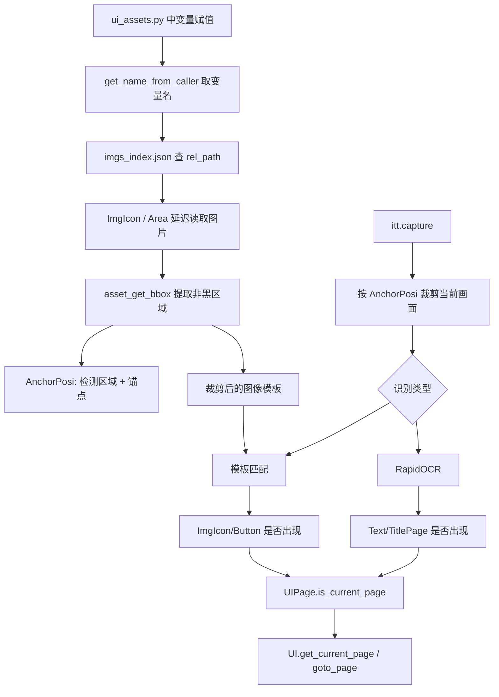
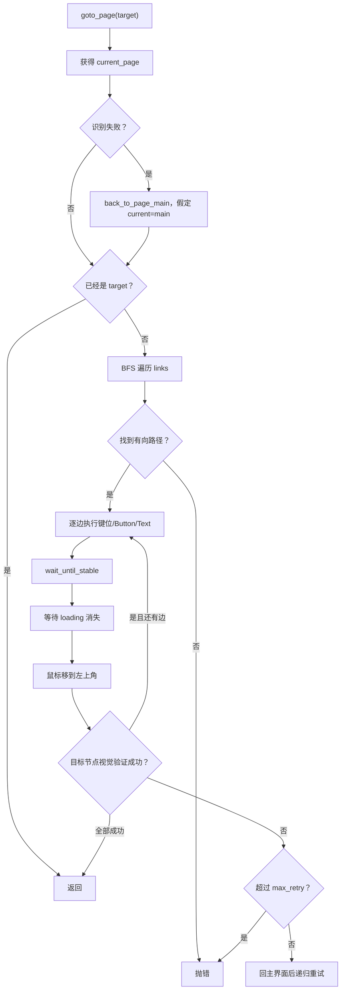

# 08 UI 视觉识别与页面导航

> 分析基线：Whimbox 2.5.4。本文关注“截图如何变成页面判断和可点击目标”，不把资产声明本身等同于识别成功。

## 1. 分析范围

本文覆盖：

- OCR 封装：[`api/ocr_rapid.py`](../../../../../reference_repos/whimbox/whimbox/api/ocr_rapid.py#L15)、[`api/pdocr_new.py`](../../../../../reference_repos/whimbox/whimbox/api/pdocr_new.py#L14)；
- 交互识别入口：[`interaction/interaction_core.py`](../../../../../reference_repos/whimbox/whimbox/interaction/interaction_core.py#L28)；
- UI 资产声明：[`ui/ui_assets.py`](../../../../../reference_repos/whimbox/whimbox/ui/ui_assets.py#L12)、[`ui/material_icon_assets.py`](../../../../../reference_repos/whimbox/whimbox/ui/material_icon_assets.py#L7)；
- 资产对象模板：[`ui/template/img_manager.py`](../../../../../reference_repos/whimbox/whimbox/ui/template/img_manager.py#L10)、[`posi_manager.py`](../../../../../reference_repos/whimbox/whimbox/ui/template/posi_manager.py#L5)、[`text_manager.py`](../../../../../reference_repos/whimbox/whimbox/ui/template/text_manager.py#L6)、[`button_manager.py`](../../../../../reference_repos/whimbox/whimbox/ui/template/button_manager.py#L8)；
- 资产、图像、坐标和 UI 工具：[`common/utils/asset_utils.py`](../../../../../reference_repos/whimbox/whimbox/common/utils/asset_utils.py#L12)、[`img_utils.py`](../../../../../reference_repos/whimbox/whimbox/common/utils/img_utils.py#L47)、[`posi_utils.py`](../../../../../reference_repos/whimbox/whimbox/common/utils/posi_utils.py#L8)、[`ui_utils.py`](../../../../../reference_repos/whimbox/whimbox/common/utils/ui_utils.py#L17)；
- 页面模型与导航：[`ui/page.py`](../../../../../reference_repos/whimbox/whimbox/ui/page.py#L8)、[`ui/page_assets.py`](../../../../../reference_repos/whimbox/whimbox/ui/page_assets.py#L8)、[`ui/ui.py`](../../../../../reference_repos/whimbox/whimbox/ui/ui.py#L14)。

窗口截图、真实分辨率和键鼠注入由 [07-平台抽象与交互核心](07-平台抽象与交互核心.md) 解释。

## 2. 核心结论

1. UI 资产不是通过手工路径逐个绑定，而是从“声明变量名”推导资产名，再查 `imgs_index.json`。这要求声明保持简单的单行赋值形式。
2. 典型 UI 模板资产是一张 1920x1080 黑底标注图。加载时自动取非黑区域的包围盒，同时得到“检测区域”和“模板小图”。
3. UI 坐标统一采用 1920 宽逻辑坐标。16:10 的额外高度不拉伸资产，而是按锚点把区域贴到顶部、底部或中心。
4. `ImgIcon` 的通用检测返回模板分数，但点击位置通常是预定义检测区域的中心，并非 `matchTemplate` 找到的峰值坐标；资产区域必须足够准确。
5. OCR 当前主链只接受 RapidOCR。PaddleOCR 文件存在，但 `InteractionBGD` 没有选择它的分支。
6. 页面被建模为有向图。边上的动作可以是键位、图片按钮或文字目标，`UI.goto_page()` 用 BFS 找最短边数路径，并在每一跳后重新视觉验证。
7. 导航不是事务：每个页面识别、点击、加载和复核都读取不同时间的截图。稳定性依赖资产阈值、页面图完整性、动画等待和焦点控制共同成立。

## 3. 从资产到页面的总数据流



## 4. 资产系统

### 4.1 名称自动映射

模块导入时，[`ASSETS_INDEX_JSON`](../../../../../reference_repos/whimbox/whimbox/common/utils/asset_utils.py#L12) 从 `assets/imgs/imgs_index.json` 一次性加载。`AssetBase.get_img_path()` 先按 `self.name` 查索引，查不到才递归扫描整个资产目录中的同名 `.png/.jpg`，见 [`asset_utils.py`](../../../../../reference_repos/whimbox/whimbox/common/utils/asset_utils.py#L92)。

若构造 `ImgIcon()`、`Area()`、`Text()` 或 `UIPage()` 时没有显式名字，`get_name_from_caller()` 会读取调用帧当前源码行，并取第一个 `=` 左侧文本，见 [`asset_utils.py`](../../../../../reference_repos/whimbox/whimbox/common/utils/asset_utils.py#L20)。例如：

```python
IconPageMainFeature = ImgIcon(...)
AreaPageTitleFeature = Area(...)
```

会分别得到资产名 `IconPageMainFeature` 和 `AreaPageTitleFeature`。这套约定减少了路径重复，但有明确约束：

- 资产声明最好是一行一个简单赋值；
- 重构变量名必须同步更新索引或图片文件名；
- 包装构造、解构赋值或动态生成时，推导出的名字可能变成源码片段或 `filename:line`；
- 索引在模块导入后不会自动热更新。

### 4.2 四类资产对象

| 类型 | 输入 | 延迟加载结果 | 主要用途 |
|---|---|---|---|
| [`ImgIcon`](../../../../../reference_repos/whimbox/whimbox/ui/template/img_manager.py#L10) | 标注图/模板、阈值、颜色过滤、锚点 | `raw_image/image/bbg_posi/cap_posi` | 页面特征和图标存在性 |
| [`Button`](../../../../../reference_repos/whimbox/whimbox/ui/template/button_manager.py#L8) | `ImgIcon` 参数 + 点击偏移 | 图片模板和区域 | 可识别、可点击的图片按钮 |
| [`Area`](../../../../../reference_repos/whimbox/whimbox/ui/template/posi_manager.py#L48) | 黑底区域图、锚点、纵向扩展 | `AnchorPosi` | OCR、截图、固定区域点击 |
| [`Text`](../../../../../reference_repos/whimbox/whimbox/ui/template/text_manager.py#L39) | 目标字符串 + `Area` | 文本规则，不加载文字图 | 页面标题或文字按钮 |
| [`GameImg`](../../../../../reference_repos/whimbox/whimbox/ui/template/img_manager.py#L155) | 原始游戏图标，可含 alpha | 原图 | 在较大动态区域中搜索素材等图标 |

`material_icon_assets.py` 是动态资产的例子：读取 `material.json`，把每个材料的 `game_img` 转成 `GameImg`，并附带类别、挖掘、追踪和激化能力标志，见 [`material_icon_assets.py`](../../../../../reference_repos/whimbox/whimbox/ui/material_icon_assets.py#L9)。

### 4.3 黑底标注图如何变成模板

`ImgIcon._ensure_loaded()` 在第一次访问属性时才调用 `cv2.imread()`，见 [`img_manager.py`](../../../../../reference_repos/whimbox/whimbox/ui/template/img_manager.py#L65)。处理规则为：

1. 若未显式指定 `is_bbg`，只有形状恰好是 `(1080, 1920, 3)` 才视作黑底标注图；
2. 在每个像素通道最大值大于 `black_offset=15` 的区域上计算包围盒；
3. 这个包围盒默认同时成为 `bbg_posi` 和 `cap_posi`；
4. 从原始标注图裁剪包围盒，得到模板 `image`；
5. 若配置 HSV/灰度阈值，再对模板二值化并进一步裁去黑边。

包围盒算法见 [`asset_get_bbox()`](../../../../../reference_repos/whimbox/whimbox/common/utils/asset_utils.py#L65)，模板解析见 [`ImgIcon._ensure_loaded()`](../../../../../reference_repos/whimbox/whimbox/ui/template/img_manager.py#L65)。

`cap_posi` 还支持两个关键字：

- `'bbg'`：显式使用非黑包围盒；
- `'all'`：检测整个 1920x1080 逻辑画布。

如果一个非黑底 `ImgIcon` 既没有 `cap_posi` 又无法生成 `bbg_posi`，代码回退为 `AnchorPosi(0, 0, 1080, 1920)`，见 [`img_manager.py`](../../../../../reference_repos/whimbox/whimbox/ui/template/img_manager.py#L91)。这里的 `x2/y2` 与通常的 1920x1080 顺序相反，是潜在缺陷；当前资产声明不应依赖这个回退。

### 4.4 延迟加载边界

“延迟加载”只针对图片像素和包围盒。`ImgIcon.__init__()`、`PosiTemplate.__init__()` 在没给路径/坐标时仍会立刻解析资产路径，见 [`img_manager.py`](../../../../../reference_repos/whimbox/whimbox/ui/template/img_manager.py#L40) 和 [`posi_manager.py`](../../../../../reference_repos/whimbox/whimbox/ui/template/posi_manager.py#L24)。因此：

- 缺少索引或图片文件通常在导入 `ui_assets.py` 时就暴露；
- 文件存在但损坏，则在第一次访问 `.image/.position` 时暴露；
- `GameImg` 同样延迟读图，并保留 alpha 通道，见 [`img_manager.py`](../../../../../reference_repos/whimbox/whimbox/ui/template/img_manager.py#L169)。

## 5. 坐标、锚点与分辨率适配

### 5.1 `AnchorPosi` 的语义

[`AnchorPosi`](../../../../../reference_repos/whimbox/whimbox/common/utils/asset_utils.py#L33) 保存：

```text
(x1, y1, x2, y2, anchor, expand)
```

它既是逻辑画布上的矩形，又携带适配策略。内部 OCR/模板检测得到局部框后，可用 `trans_inner_box_posi()` 或 `trans_inner_point_posi()` 平移回该区域的逻辑坐标。

`AnchorPosi.click()` 有两种点击方式：

- 没有 `target_box`：点击整个区域中心；
- 有局部 `target_box`：先求局部框中心，再加区域左上角和偏移。

最后把逻辑点和锚点交给 `itt.move_and_click()`，见 [`asset_utils.py`](../../../../../reference_repos/whimbox/whimbox/common/utils/asset_utils.py#L54)。

### 5.2 裁剪锚点

[`crop()`](../../../../../reference_repos/whimbox/whimbox/common/utils/img_utils.py#L47) 以 1920x1080 为基础分辨率。归一化截图是 1920x1080 或 1920x1200 时：

| 锚点 | 横向偏移 | 纵向偏移 |
|---|---:|---:|
| `TOP_LEFT` | 0 | 0 |
| `TOP_RIGHT` | `w-1920` | 0 |
| `BOTTOM_LEFT` | 0 | `h-1080` |
| `BOTTOM_RIGHT` | `w-1920` | `h-1080` |
| `CENTER` | `(w-1920)/2` | `(h-1080)/2` |
| `TOP/BOTTOM_CENTER` | 水平居中 | 贴顶/贴底 |
| `LEFT/RIGHT_CENTER` | 贴左/贴右 | 垂直居中 |
| `NONE` | 不适配 | 不适配 |

当 `expand=True` 时，区域还会沿垂直方向吸收超出 1080 的高度，具体分支见 [`img_utils.py`](../../../../../reference_repos/whimbox/whimbox/common/utils/img_utils.py#L85) 至 [`img_utils.py`](../../../../../reference_repos/whimbox/whimbox/common/utils/img_utils.py#L140)。裁剪超出图像时会补黑边，而不是缩小返回形状，见 [`crop()`](../../../../../reference_repos/whimbox/whimbox/common/utils/img_utils.py#L150)。

若输入图本身宽度小于 1920，`crop()` 认为这是已经手工截取的局部图，不再做锚点适配。这个规则保证二次处理局部 OCR 图时坐标仍是局部坐标。

### 5.3 识别框如何变成点击点

需要区分两条路径：

```text
固定 ImgIcon/Text：
预定义 cap_posi -> 检测是否成功 -> 点击 cap_posi/Area 中心

滚动区域中的动态目标：
OCR/模板得到局部 box -> Area.click(target_box)
-> 局部框中心平移到全局逻辑坐标 -> 点击
```

固定图标检测的 `IMG_POSI` 返回 `imgicon.cap_center_position_xy`，不是 `cv2.matchTemplate` 的 `max_loc`，见 [`get_img_existence()`](../../../../../reference_repos/whimbox/whimbox/interaction/interaction_core.py#L160)。固定文字检测同样返回整个 `cap_area` 的中心，见 [`get_text_existence()`](../../../../../reference_repos/whimbox/whimbox/interaction/interaction_core.py#L176)。因此固定资产的检测区域必须足够紧；否则“识别成功”与“点击到目标”不是同一件事。

`Button.click()` 会使用自身 `click_offset`，见 [`button_manager.py`](../../../../../reference_repos/whimbox/whimbox/ui/template/button_manager.py#L35)；但通用 `itt.appear_then_click(Button)` 走的是 `ImgIcon` 分支，不读取 `Button.click_offset`。需要偏移的按钮应显式调用 `.click()`，或确认资产区域中心本身可点击。

## 6. 模板匹配与 OCR

### 6.1 固定 UI 模板匹配

[`InteractionBGD.get_img_existence()`](../../../../../reference_repos/whimbox/whimbox/interaction/interaction_core.py#L134) 的流程是：

1. 截取 `imgicon.cap_posi`；若调用方传入 `cap`，则假设该图已经是正确区域；
2. 对当前截图应用与资产一致的 HSV 或灰度阈值；
3. 调用 `similar_img()`；
4. 依据 `imgicon.threshold` 返回布尔、分数或预定义中心点。

`similar_img()` 使用 OpenCV `TM_CCORR_NORMED`，取最大相关值，见 [`img_utils.py`](../../../../../reference_repos/whimbox/whimbox/common/utils/img_utils.py#L411)。`is_gray=True` 会把双方转灰度，但常用资产更多通过 `hsv_limit/gray_limit` 预先二值化。

返回模式：

| 模式 | 返回值 |
|---|---|
| `IMG_BOOL` | 是否达到阈值 |
| `IMG_RATE` | 原始最大分数 |
| `IMG_BOOLRATE` | 达标时返回分数，否则 `False` |
| `IMG_POSI` | 达标时返回检测区域中心，否则 `None` |

### 6.2 动态 `GameImg` 搜索

[`find_game_img()`](../../../../../reference_repos/whimbox/whimbox/common/utils/ui_utils.py#L17) 用于在大区域中查找实际游戏图标：

- 保留 `GameImg` alpha，`alpha > 128` 生成匹配 mask；
- 可缩放模板；
- 使用 `TM_CCOEFF_NORMED`；
- 单目标返回最大分数对应框；
- 多目标收集所有过阈值位置，按分数排序，再用“重叠面积占候选框超过 50%”的规则去重。

与固定 `ImgIcon` 不同，它返回的是实际匹配框，适合素材列表、场景目标等位置不固定的对象。

### 6.3 RapidOCR 主链

`InteractionBGD` 在模块导入时读取 `General.ocr`；只有值为 `rapid` 才导入 OCR 单例，其他值直接抛 `ValueError`，见 [`interaction_core.py`](../../../../../reference_repos/whimbox/whimbox/interaction/interaction_core.py#L20)。因此当前主链是唯一选择，不支持运行时热切换。

[`RapidOcr`](../../../../../reference_repos/whimbox/whimbox/api/ocr_rapid.py#L15) 的关键行为：

- 进程内单例，模型配置来自 `assets/rapidocr.yaml`；
- 推理由 `_lock` 串行化，避免多个线程同时调用同一模型；
- 统一修正少量已知错字；
- `mode=0` 返回文字列表，`mode=1` 直接拼接为一行；
- `detect_and_ocr()` 把四点框简化成 `[x1,y1,x2,y2]`。

OCR 前常先：

```text
按 Area 裁剪 -> HSV 二值化（可选） -> 四周补 50px 黑边 -> OCR
```

见 [`ocr_single_line()`](../../../../../reference_repos/whimbox/whimbox/interaction/interaction_core.py#L82)、[`ocr_multiple_lines()`](../../../../../reference_repos/whimbox/whimbox/interaction/interaction_core.py#L91) 和 [`ocr_and_detect_posi()`](../../../../../reference_repos/whimbox/whimbox/interaction/interaction_core.py#L100)。带框 OCR 会在返回前减去 padding，使框重新落回原始 `Area` 的局部坐标。

`detect_and_ocr()` 用识别文本作为字典键；同一画面出现多个相同文本时，后一个框会覆盖前一个，代码中也保留了相应 TODO，见 [`ocr_rapid.py`](../../../../../reference_repos/whimbox/whimbox/api/ocr_rapid.py#L79)。

### 6.4 PaddleOCR 的实际状态

[`NewPaddleOCR`](../../../../../reference_repos/whimbox/whimbox/api/pdocr_new.py#L14) 使用 GPU 和 PP-OCRv5 server 模型，也有线程锁和文字/框接口。但：

- `interaction_core.py` 没有 `paddle` 分支；
- 文件底部会在导入时直接实例化模型，见 [`pdocr_new.py`](../../../../../reference_repos/whimbox/whimbox/api/pdocr_new.py#L91)；
- 因此它目前是旁路/遗留实现，不是可由现有配置启用的后端。

### 6.5 文字匹配规则

`TextTemplate.match_results()` 支持包含匹配和精确匹配，默认是包含匹配，见 [`text_manager.py`](../../../../../reference_repos/whimbox/whimbox/ui/template/text_manager.py#L20)。`Text` 的构造器没有暴露 `match_mode` 参数，所以普通 `Text(...)` 声明实际都使用默认包含匹配。

`TitlePage` 走另一条规则：对统一标题区域 OCR 后与标题字符串做完整相等比较，见 [`page.py`](../../../../../reference_repos/whimbox/whimbox/ui/page.py#L52)。标题多一个空格、OCR 漏字或识别出其他可见文字，都会使页面验证失败。

## 7. 页面模型与有向图

### 7.1 页面节点

[`UIPage`](../../../../../reference_repos/whimbox/whimbox/ui/page.py#L8) 包含：

- 自动推导的 `name`；
- 一个或多个页面特征 `check_icon_list`；
- `links`：以目标页面为键、操作为值的出边字典。

普通页面只要任一图片/文字特征出现就返回真。`TitlePage` 则用标题 OCR 判断。页面相等和哈希只按 `name`，因此 BFS 的访问集合依赖名称唯一。

页面实例和边集中定义在 [`page_assets.py`](../../../../../reference_repos/whimbox/whimbox/ui/page_assets.py#L8)。例如：

```text
page_main --地图键--> page_bigmap
page_main --Esc--> page_esc
page_daily_task --ButtonHuanjingGo--> page_huanjing
page_huanjing --TextHuanjingJihuaEntrace--> page_huanjing_jihua
```

边动作允许三类值：

| 边值 | 执行方式 |
|---|---|
| `str` / 解析后的 `KeybindRef` | `itt.key_press()` |
| `Button` | `itt.appear_then_click()` |
| `Text` | `itt.appear_then_click()` |

页面图是有向图。能从 A 回到 B，不代表自动存在 B 到 A 的边；回退边需要显式声明。

### 7.2 当前页面识别

[`UI.get_current_page()`](../../../../../reference_repos/whimbox/whimbox/ui/ui.py#L41) 先对页面标题区域 OCR 一次，再按 `ui_page_dict.values()` 的声明顺序扫描：

1. `TitlePage` 与这次标题字符串比较；
2. 普通页面逐个调用 `is_current_page()`，每个特征检测可能产生新的截图；
3. 第一个命中的页面立即返回；
4. 全部失败则抛“无法识别当前页面”。

这不是同一帧上的全页面分类：标题、第一页特征和后续页面特征可能来自不同帧。动画或弹窗切换期间，识别结果可能依赖扫描顺序。

### 7.3 BFS 导航算法



BFS 实现在 [`UI.goto_page()`](../../../../../reference_repos/whimbox/whimbox/ui/ui.py#L61)。队列元素同时保存当前节点和完整路径，`visited` 保证每个页面只入队一次，所以找到的是“边数最少”的路径，而不是耗时最短或成功率最高的路径。

执行每条边后会：

1. `wait_until_stable(threshold=0.98)`；
2. `ui_additional()` 等待 loading 图标消失；
3. 把鼠标移到 `(0,0)`，避免悬停样式影响模板；
4. 调用目标页面的视觉判断复核。

默认失败后最多整体重试一次。重试前先 `back_to_page_main()`，释放导航锁，再递归调用 `goto_page()`，见 [`ui.py`](../../../../../reference_repos/whimbox/whimbox/ui/ui.py#L168)。

### 7.4 并发与停止

`switch_ui_lock` 串行化同一进程中的页面切换，见 [`UI.__init__()`](../../../../../reference_repos/whimbox/whimbox/ui/ui.py#L16)。导航每一步会检查当前任务停止标志；loading 等待同样检查，见 [`ui_additional()`](../../../../../reference_repos/whimbox/whimbox/ui/ui.py#L19)。

锁通过多处分支手工释放，异常处理则用 `locked()` 再释放。`threading.Lock.locked()` 只说明锁当前被某线程持有，不验证当前线程所有权，因此现有并发调用就存在竞态：一个分支先 `release()` 再抛异常，在进入 except 之前另一线程可已 acquire，前一线程随后会释放后者的锁。失败重试也先释放锁，再在锁外执行 `back_to_page_main()` 和递归调用，此时第二个 `goto_page()` 可并行操作 UI。应使用 `with self.switch_ui_lock` 或 `try/finally` 建立单一所有权作用域，并明确把失败恢复与递归重试纳入同一串行策略。[`ui.py`](../../../../../reference_repos/whimbox/whimbox/ui/ui.py#L107)

## 8. 通用 UI 操作算法

### 8.1 滚动查找并点击

[`scroll_find_click()`](../../../../../reference_repos/whimbox/whimbox/common/utils/ui_utils.py#L138) 统一处理三种目标：`ImgIcon`、`GameImg`、字符串。算法为：

1. 截取滚动区域；
2. 当前页做模板或 OCR 检测；
3. 第一次失败先 `scroll_to_top()`；
4. 后续把鼠标移到区域右下角并向下滚动；
5. 新旧截图相似度超过 0.99，认为到达底部；
6. 找到局部框后交给 `Area.click(target_box)`。

字符串目标可选完整键匹配或包含匹配；`GameImg` 使用 alpha mask；`ImgIcon` 可覆盖模板缩放和 HSV 参数。

### 8.2 回主界面

[`back_to_page_main()`](../../../../../reference_repos/whimbox/whimbox/common/utils/ui_utils.py#L311) 是导航恢复基础：循环等待画面稳定，副本场景先退出并确认，检测到主界面特征才停止，其他情况持续按 Esc。循环只受当前停止标志约束，没有独立总超时。

`skip_to_page_main()` 和 `skip_dialog()` 则用跳过图标配合交互键，见 [`ui_utils.py`](../../../../../reference_repos/whimbox/whimbox/common/utils/ui_utils.py#L325)。

### 8.3 画面稳定判断

[`wait_until_stable()`](../../../../../reference_repos/whimbox/whimbox/interaction/interaction_core.py#L236) 连续比较整帧 `similar_img()` 分数；画面发生变化就重置稳定计时器，稳定达到条件或总超时 5 秒后返回。它没有返回“稳定/超时”的布尔结果，调用方无法区分正常稳定和超时继续。

## 9. 核心类与函数索引

| 类/函数 | 关键输入 | 关键输出/状态 | 调试关注点 |
|---|---|---|---|
| [`get_name_from_caller()`](../../../../../reference_repos/whimbox/whimbox/common/utils/asset_utils.py#L20) | 调用栈源码行 | 资产名 | 声明是否为简单赋值 |
| [`asset_get_bbox()`](../../../../../reference_repos/whimbox/whimbox/common/utils/asset_utils.py#L65) | 黑底标注图 | `AnchorPosi` 或 `None` | 阈值 15 是否吃掉暗色边缘 |
| [`ImgIcon._ensure_loaded()`](../../../../../reference_repos/whimbox/whimbox/ui/template/img_manager.py#L65) | 资产图、HSV/灰度参数 | 模板、检测区、中心 | 模板和当前截图形状/通道 |
| [`crop()`](../../../../../reference_repos/whimbox/whimbox/common/utils/img_utils.py#L47) | 图、逻辑区域、锚点 | 固定形状局部图 | 16:10 偏移、补黑边 |
| [`similar_img()`](../../../../../reference_repos/whimbox/whimbox/common/utils/img_utils.py#L411) | 当前图、模板 | 最大相关分数/位置 | 方法、阈值、通道一致性 |
| [`RapidOcr.detect_and_ocr()`](../../../../../reference_repos/whimbox/whimbox/api/ocr_rapid.py#L79) | 局部图 | `text -> box` | 重复文本覆盖、错字修正 |
| [`InteractionBGD.appear_then_click()`](../../../../../reference_repos/whimbox/whimbox/interaction/interaction_core.py#L200) | `ImgIcon/Text` | 是否识别并执行点击 | 点击的是区域中心而非峰值 |
| [`UIPage.is_current_page()`](../../../../../reference_repos/whimbox/whimbox/ui/page.py#L38) | `itt` | 任一特征命中 | 特征唯一性与阈值 |
| [`UI.get_current_page()`](../../../../../reference_repos/whimbox/whimbox/ui/ui.py#L41) | 当前动态画面 | 第一个命中页面 | 扫描顺序和跨帧不一致 |
| [`UI.goto_page()`](../../../../../reference_repos/whimbox/whimbox/ui/ui.py#L61) | 目标页面 | 成功返回或抛错 | 图连通性、边动作、逐跳复核 |
| [`scroll_find_click()`](../../../../../reference_repos/whimbox/whimbox/common/utils/ui_utils.py#L138) | 区域和动态目标 | 是否找到并点击 | 滚动终止、局部框坐标 |

## 10. 代表调用链

### 10.1 从变量声明到图标识别

```text
IconPageMainFeature = ImgIcon(...)
-> get_name_from_caller() = "IconPageMainFeature"
-> imgs_index.json -> rel_path
-> 首次访问 cap_posi/image 时读取标注图
-> asset_get_bbox() 得到检测区和模板
-> itt.get_img_existence()
-> 按锚点裁剪当前帧
-> 同样的灰度阈值
-> TM_CCORR_NORMED >= 0.90
```

声明示例见 [`ui_assets.py`](../../../../../reference_repos/whimbox/whimbox/ui/ui_assets.py#L15)。

### 10.2 从 OCR 文字到滚动点击

```text
scroll_find_click(Area, "目标文字")
-> itt.ocr_and_detect_posi(Area)
-> Area 局部截图 + padding + RapidOCR
-> 返回目标局部 box
-> Area.click(target_box)
-> 局部框中心 + Area 左上角 + anchor
-> itt.move_and_click()
```

### 10.3 从任意页到目标页

```text
ui_control.goto_page(target)
-> get_current_page()
-> BFS(page.links)
-> resolve KeybindRef / 识别 Button / 识别 Text
-> 执行动作
-> 等动画和 loading
-> to_page.is_current_page()
-> 下一条边或整体恢复重试
```

## 11. 调试方法

### 11.1 静态检查资产

对一个失败资产依次确认：

```text
asset.name
asset.origin_path
asset.raw_image.shape
asset.is_bbg
asset.bbg_posi / cap_posi / anchor / expand
asset.image.shape
asset.threshold / hsv_limit / gray_limit
```

优先检查资产名是否存在于 `imgs_index.json`，再看标注图非黑区域是否准确。

### 11.2 动态视觉断点

推荐断点顺序：

1. [`ImgIcon._ensure_loaded()`](../../../../../reference_repos/whimbox/whimbox/ui/template/img_manager.py#L65)；
2. [`crop()`](../../../../../reference_repos/whimbox/whimbox/common/utils/img_utils.py#L47)；
3. [`InteractionBGD.get_img_existence()`](../../../../../reference_repos/whimbox/whimbox/interaction/interaction_core.py#L134)；
4. [`similar_img()`](../../../../../reference_repos/whimbox/whimbox/common/utils/img_utils.py#L411)；
5. [`RapidOcr.analyze()`](../../../../../reference_repos/whimbox/whimbox/api/ocr_rapid.py#L44)；
6. [`UI.get_current_page()`](../../../../../reference_repos/whimbox/whimbox/ui/ui.py#L41)；
7. [`UI.goto_page()`](../../../../../reference_repos/whimbox/whimbox/ui/ui.py#L61) 的 BFS、动作执行和逐跳验证三处。

把 `show_res=True` 传给图片/OCR 调试接口会打开 OpenCV 窗口；只应在本地交互调试使用，不能放进无人值守任务。

### 11.3 已有开发工具

- [`dev_tool/snapshot.py`](../../../../../reference_repos/whimbox/whimbox/dev_tool/snapshot.py#L1)：手动保存当前归一化截图；
- [`dev_tool/hsv_tool.py`](../../../../../reference_repos/whimbox/whimbox/dev_tool/hsv_tool.py#L1)：滑块调节 HSV 阈值；
- [`dev_tool/gray_threshold_tool.py`](../../../../../reference_repos/whimbox/whimbox/dev_tool/gray_threshold_tool.py#L1)：调节灰度二值化阈值。

[`dev_tool/assest_tools.py`](../../../../../reference_repos/whimbox/whimbox/dev_tool/assest_tools.py#L6) 仍使用旧的 `itt.capture(posi=...)` 和下标访问区域写法，与当前 `anchor_posi`/`AnchorPosi` API 不一致，不应在未修正前作为资产重采工具。

### 11.4 页面图调试

打印或观察以下数据：

```text
current_page.name
target_page.name
[(next_page.name, type(action).__name__) for next_page, action in page.links.items()]
BFS 生成的 path
每次动作前后的标题 OCR
每个 check_icon 的匹配分数
wait_until_stable 是否实际走到 timeout
```

如果导航总是回主界面，先单独调用 `target_page.is_current_page(itt)`，不要先怀疑 BFS；路径正确但终点特征不稳定是更常见的失效方式。

## 12. 风险与待验证点

| 项目 | 代码证据 | 风险/待验证内容 |
|---|---|---|
| 变量名驱动资产绑定较脆弱 | 名称来自当前源码行 | 自动格式化、包装构造或重命名可能静默换名 |
| 索引与图片缺少自动一致性校验 | 失败时才查索引/递归目录 | 应建立“所有声明均可解析、文件均可读”的离线检查 |
| 暗色模板可能被包围盒阈值裁掉 | `black_offset=15` | 深色 UI 边缘需逐资产验证 |
| 非黑底 `ImgIcon` 默认全屏框疑似宽高颠倒 | 回退为 `(0,0,1080,1920)` | 新增非黑底资产必须显式给 `cap_posi` |
| 固定资产点击不使用匹配峰值 | `IMG_POSI` 返回区域中心 | 大检测区内模板可移动时可能点错位置 |
| `appear_then_click(Button)` 忽略 `click_offset` | 走 `ImgIcon` 通用分支 | 有偏移按钮需使用 `.click()` 或补齐通用逻辑 |
| OCR 重复文本覆盖 | 文本作为字典唯一键 | 列表中同名项无法保留多个框 |
| 只有 RapidOCR 真正接线 | 其他配置直接抛错 | PaddleOCR 不应出现在可用配置说明中 |
| 页面分类跨多帧且第一个命中即返回 | 逐页独立识别 | 动画期可能命中错误页面；特征必须互斥 |
| `ui_page_dict` 有重复中文键 | [`page_assets.py`](../../../../../reference_repos/whimbox/whimbox/ui/page_assets.py#L53) 连续两次使用“小月卡临取1” | 前一个值被后一个覆盖；第一页不会参与当前页面字典扫描 |
| 页面标题使用精确字符串相等 | `TitlePage.is_current_page()` | OCR 空格、异体字、额外文本都会失败 |
| BFS 只优化边数 | 没有权重或失败率 | 最短路径未必是最稳路径 |
| loading/回主界面/滚到顶部缺少统一总超时 | 多处 while 仅看停止标志 | 动画持续变化或页面未知时可能长期阻塞 |
| `wait_until_stable()` 不报告超时 | 无返回值 | 调用方会把超时当成已稳定继续执行 |
| 导航锁手工释放 | 多分支 `release()` | 后续并发改造需改为上下文管理或明确所有权 |
| 视觉资产目录以 Windows 命名 | 多数索引指向 `imgs/Windows/...` | macOS 同画面、Retina 缩放和字体渲染兼容性需实测 |
| 缺少独立视觉回归测试集 | 当前仓库未见 tests 目录 | 游戏 UI 更新后主要靠在线实机发现退化 |

## 13. 关联文档

- 上位总览：[项目架构梳理](../项目架构梳理.md)
- 截图、DPI、真实坐标和输入注入：[07-平台抽象与交互核心](07-平台抽象与交互核心.md)
- 地图定位如何复用裁剪、模板匹配和 OCR：[09-地图定位与自动跑图](09-地图定位与自动跑图.md)
- 启动时资产和全局对象的导入顺序：[01-启动配置与运行时](01-启动配置与运行时.md)
