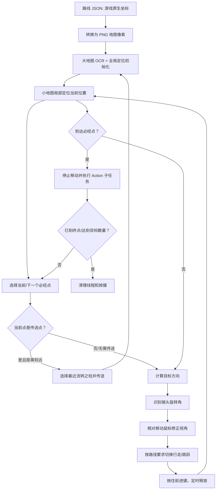
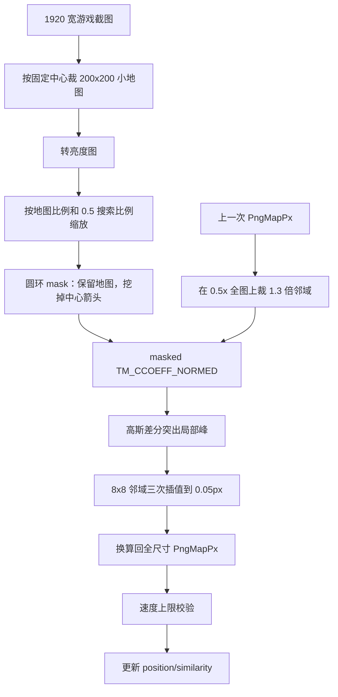
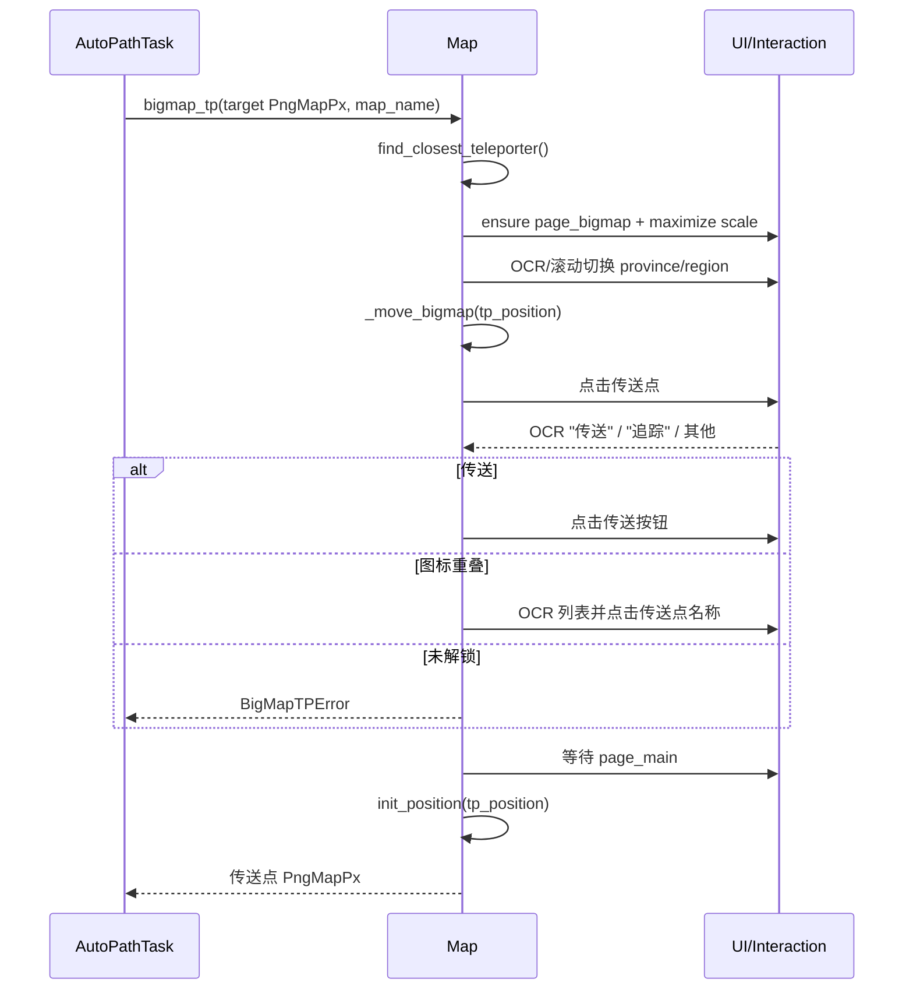
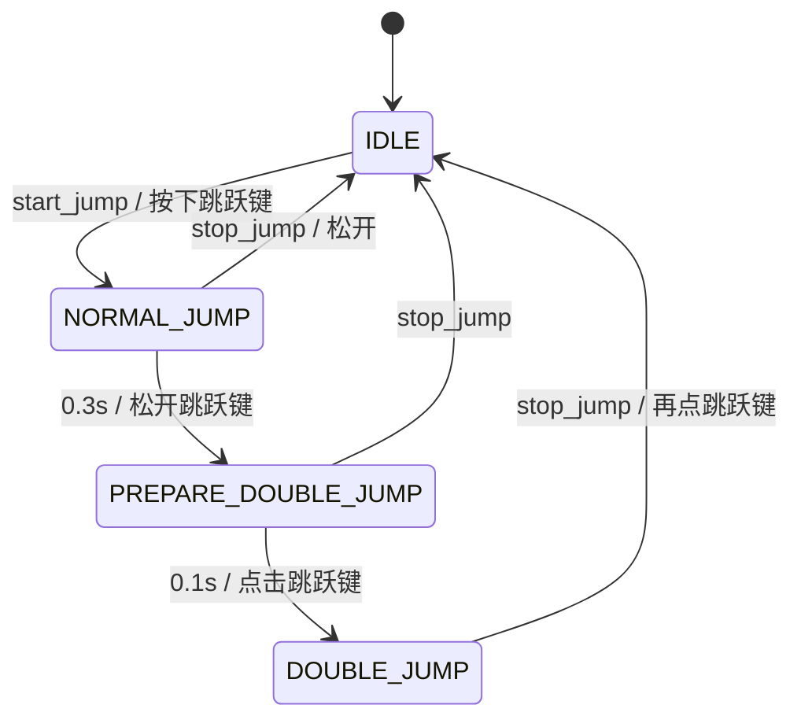

# 09 地图定位与自动跑图

> 分析基线：Whimbox 2.5.4。本文把地图识别、坐标换算、传送、视角控制、移动线程和路径动作作为一个闭环分析。

## 1. 分析范围

本文覆盖：

- 地图聚合与传送：[`map/map.py`](../../../../../reference_repos/whimbox/whimbox/map/map.py#L23)；
- 坐标转换和数据对象：[`map/convert.py`](../../../../../reference_repos/whimbox/whimbox/map/convert.py#L7)、[`map/position.py`](../../../../../reference_repos/whimbox/whimbox/map/position.py#L5)、[`map/data/nikki_teleporter.py`](../../../../../reference_repos/whimbox/whimbox/map/data/nikki_teleporter.py#L10)；
- 地图资产和算法参数：[`map/detection/cvars.py`](../../../../../reference_repos/whimbox/whimbox/map/detection/cvars.py#L1)、[`map_assets.py`](../../../../../reference_repos/whimbox/whimbox/map/detection/map_assets.py#L8)、[`utils.py`](../../../../../reference_repos/whimbox/whimbox/map/detection/utils.py#L6)；
- 小地图/大地图定位：[`map/detection/minimap.py`](../../../../../reference_repos/whimbox/whimbox/map/detection/minimap.py#L11)、[`bigmap.py`](../../../../../reference_repos/whimbox/whimbox/map/detection/bigmap.py#L11)；
- 材料追踪和未启用的时间模块：[`map/track.py`](../../../../../reference_repos/whimbox/whimbox/map/track.py#L27)、[`map/detection/time.py`](../../../../../reference_repos/whimbox/whimbox/map/detection/time.py#L16)；
- 视角和移动控制：[`view_and_move/utils.py`](../../../../../reference_repos/whimbox/whimbox/view_and_move/utils.py#L8)、[`view.py`](../../../../../reference_repos/whimbox/whimbox/view_and_move/view.py#L9)、[`move.py`](../../../../../reference_repos/whimbox/whimbox/view_and_move/move.py#L13)、[`cvars.py`](../../../../../reference_repos/whimbox/whimbox/view_and_move/cvars.py#L1)；
- 自动跑图主任务：[`task/navigation_task/auto_path_task.py`](../../../../../reference_repos/whimbox/whimbox/task/navigation_task/auto_path_task.py#L42)；
- 路线格式与生产过程的必要上下文：[`common/scripts_manager.py`](../../../../../reference_repos/whimbox/whimbox/common/scripts_manager.py#L17)、[`record_path_task.py`](../../../../../reference_repos/whimbox/whimbox/task/navigation_task/record_path_task.py#L22)、[`rdp.py`](../../../../../reference_repos/whimbox/whimbox/task/navigation_task/rdp.py#L54)。

截图归一化和相对鼠标移动见 [07-平台抽象与交互核心](07-平台抽象与交互核心.md)，UI 页面和视觉原语见 [08-UI视觉识别与页面导航](08-UI视觉识别与页面导航.md)。

## 2. 核心结论

1. 跑图不是游戏内部导航网格或寻路 API，而是视觉闭环：截图定位当前位置和镜头角度，计算到下一个必经点的方向，移动鼠标修正镜头，按住前进键，再次截图反馈。
2. 路线 JSON 持久化的是游戏原生坐标；运行时统一转换成全尺寸 PNG 地图像素坐标。小地图定位、传送点和路径距离计算都使用 PNG 坐标。
3. 小地图定位是“以上次位置为中心的局部模板匹配”，不能天然处理任意大跳变；大地图定位负责初始化或传送后的全局定位。
4. 角色方向和镜头方向是两种独立识别：角色方向匹配中心箭头，镜头方向从小地图视野扇区与静态地图的差分中估计。自动跑图实际使用镜头方向。
5. 大地图传送也是视觉闭环：OCR 选择区域、模板定位当前大地图中心、递归拖图、点击最近传送点、OCR 判断“传送/追踪”，最后等待主界面。
6. 正常 v2 路线约定首点为必经点；首点之后，`AutoPathTask` 只选择后续“必经点”。途径点主要保留路线形状和录制信息。到点动作通过子任务扩展，移动控制本身不理解采集、钓鱼或宏逻辑。
7. 卡住 5 秒先执行一次前进加跳跃恢复，持续 15 秒抛异常；任务框架会自动重试一次，并从最近记录的传送点索引重新开始。
8. 跑图同时启动移动、跳跃和跳过按钮三个线程。正常、异常和手动停止都依赖 `handle_finally()` 回收线程并释放按键。

## 3. 总体闭环



## 4. 模块职责与关键算法

| 模块 | 关键职责 | 算法/状态 | 主要输出 |
|---|---|---|---|
| [`detection/map_assets.py`](../../../../../reference_repos/whimbox/whimbox/map/detection/map_assets.py#L31) | 加载地图灰度图、mask、箭头旋转表 | 模块导入时构造 `MapAsset` | 全局地图模板 |
| [`MiniMap`](../../../../../reference_repos/whimbox/whimbox/map/detection/minimap.py#L11) | 当前位置、人物朝向、镜头旋转识别 | 局部模板匹配、箭头图集、极坐标展开/峰值 | `position/direction/rotation` |
| [`BigMap`](../../../../../reference_repos/whimbox/whimbox/map/detection/bigmap.py#L11) | 大地图中心的全局定位 | 缩放截图后与整图模板匹配 | `bigmap_position` |
| [`Map`](../../../../../reference_repos/whimbox/whimbox/map/map.py#L23) | 聚合定位器、初始化地图、拖图和传送 | 页面导航、OCR、缓存、位置校验 | 全局 `nikki_map` |
| [`Track`](../../../../../reference_repos/whimbox/whimbox/map/track.py#L27) | 游戏材料追踪 UI 和小地图标记方向 | HSV + HoughCircles + 最近点连续性 | 附近材料方向 |
| [`view.py`](../../../../../reference_repos/whimbox/whimbox/view_and_move/view.py#L9) | 镜头角度稳定采样、转向和比例校准 | 反馈校准“角度 -> 鼠标像素” | 相对鼠标移动 |
| [`MoveController`](../../../../../reference_repos/whimbox/whimbox/view_and_move/move.py#L105) | 估速、估计一次循环耗时、定时前进 | 5 点去极值平均 + Timer | `W` 按下/释放 |
| [`JumpController`](../../../../../reference_repos/whimbox/whimbox/view_and_move/move.py#L34) | 普通跳和二段跳状态机 | 两个定时器、四态枚举 | 跳跃键序列 |
| [`AutoPathTask`](../../../../../reference_repos/whimbox/whimbox/task/navigation_task/auto_path_task.py#L42) | 路线解释、闭环调度、到点动作、恢复与清理 | TaskTemplate 步骤 + 三个控制线程 | `TaskResult` 和材料计数 |

## 5. 地图资产与支持矩阵

### 5.1 资产加载

`MapAsset` 与 UI 的延迟图片加载不同：构造时立即解析路径并读取图片，见 [`detection/utils.py`](../../../../../reference_repos/whimbox/whimbox/map/detection/utils.py#L16)。导入 `map_assets.py` 会加载：

- 方向箭头粗/精旋转图集；
- 每张支持地图的 `luma_05x`；
- 每张支持地图的 `luma_0125x`；
- 大地图可匹配区域 `mask_0125x`。

映射集中在 [`MAP_ASSETS_DICT`](../../../../../reference_repos/whimbox/whimbox/map/detection/map_assets.py#L69)。这意味着首次导入地图模块有明显的磁盘和内存成本，但后续定位不需要重复读图。

### 5.2 当前支持边界

| `map_name` | 区域 | 小/大地图资产 | 原生坐标偏移 | 当前定位状态 |
|---|---|---|---|---|
| `miraland` | 心愿原野等多个区域 | 有 | 有 | 支持 |
| `starsea` | 星海 | 有 | 有 | 支持 |
| `home` | 家园 | 有 | 有 | 支持 |
| `wanxiang` | 万相境 | 有 | 有 | 支持 |
| `firework` | 花焰群岛 | 无 | 无 | 显式列为不支持 |
| `sernity` | 无忧岛 | 无 | 无 | 显式列为不支持 |
| `danqing` | 丹青屿 | 无 | 无 | 显式列为不支持 |

名称、区域映射和不支持列表见 [`detection/cvars.py`](../../../../../reference_repos/whimbox/whimbox/map/detection/cvars.py#L1)。`trans_region_name_to_map_name()` 对显式不支持区域返回 `unsupported`，对已知区域返回地图名，但对任何未知 OCR 文本默认返回 `home`，见 [`detection/utils.py`](../../../../../reference_repos/whimbox/whimbox/map/detection/utils.py#L6)。因此 OCR 失败或新区域名称可能被误当作家园，而不是明确失败。

## 6. 坐标系与转换

### 6.1 四类坐标

| 坐标系 | 含义 | 使用位置 | 是否持久化 |
|---|---|---|---|
| GameLoc | 游戏原生世界坐标 `(x,y)` | 路线 JSON、`checkpoints.json` | 是 |
| PngMapPx | 全尺寸地图 PNG 像素 | 小地图位置、传送点、路径距离 | 运行时主坐标 |
| DownscaledMapPx | `0.5x/0.125x` 灰度地图像素 | OpenCV 匹配内部 | 否 |
| LogicalScreenPx | 1920 宽 UI/鼠标逻辑坐标 | 大地图拖动和点击 | 否 |

“当前位置”“目标点”“传送点”在大多数运行时代码里都是 `PngMapPx`。不要把它们直接与窗口像素做欧氏距离。

### 6.2 GameLoc 与 PngMapPx

[`convert_GameLoc_to_PngMapPx()`](../../../../../reference_repos/whimbox/whimbox/map/convert.py#L19) 使用每张地图的固定偏移和统一比例：

```text
P.x = G.x * (2 / 90) + offset[map].x
P.y = G.y * (2 / 90) + offset[map].y
```

逆变换见 [`convert_PngMapPx_to_GameLoc()`](../../../../../reference_repos/whimbox/whimbox/map/convert.py#L27)。路线录制结束时把 PNG 坐标转回 GameLoc 保存，见 [`record_path_task.py`](../../../../../reference_repos/whimbox/whimbox/task/navigation_task/record_path_task.py#L115)；跑图构造时再按路线 `map` 转回 PNG 坐标，见 [`AutoPathTask.__init__()`](../../../../../reference_repos/whimbox/whimbox/task/navigation_task/auto_path_task.py#L60)。

传送点加载同样执行这次转换：`checkpoints.json` 保存 GameLoc，模块导入时构造 `TeleporterModel.position` 为 PngMapPx，见 [`nikki_teleporter.py`](../../../../../reference_repos/whimbox/whimbox/map/data/nikki_teleporter.py#L18)。因此路径点和传送点可以直接比较距离。

### 6.3 PNG 坐标与大地图屏幕缩放

`BIGMAP_POSITION_SCALE_DICT` 描述最大缩放状态下，PNG 地图像素到游戏大地图渲染像素的比例，见 [`detection/cvars.py`](../../../../../reference_repos/whimbox/whimbox/map/detection/cvars.py#L62)。函数名 `convert_PngMapPx_to_InGameMapPx()` 中的 “InGameMapPx” 指大地图界面渲染尺度，不是 GameLoc，见 [`convert.py`](../../../../../reference_repos/whimbox/whimbox/map/convert.py#L13)。

它只在拖动大地图和计算可点击传送范围时使用，见 [`Map._move_bigmap()`](../../../../../reference_repos/whimbox/whimbox/map/map.py#L233)。

### 6.4 路线数据模型

[`PathPoint`](../../../../../reference_repos/whimbox/whimbox/common/scripts_manager.py#L25) 包含：

```text
id, move_mode, point_type, action, action_params, position
```

- `point_type=TARGET`：自动跑图真正依次瞄准的必经点；
- `point_type=PASS`：录制的途径点，不会被 `_update_next_target_point()` 选为下一个控制目标；
- `move_mode` 当前支持 `WALK/JUMP`；
- `action` 决定到点后的子任务或特殊控制。

路线版本必须严格等于字符串 `"2.0"`，否则构造任务直接失败，见 [`auto_path_task.py`](../../../../../reference_repos/whimbox/whimbox/task/navigation_task/auto_path_task.py#L60)。

## 7. 小地图位置定位

### 7.1 初始化依赖

小地图定位是局部搜索，必须先有近似位置。`Map.reinit_smallmap()` 的流程是：

```text
goto_page(page_bigmap)
-> OCR 当前 region_name
-> 转成 map_name
-> 若 unsupported：位置置 (0,0)，返回 False
-> 把大地图缩放到最大
-> BigMap 全局匹配得到中心 PngMapPx
-> MiniMap.init_position(bigmap_position)
```

实现见 [`Map.reinit_smallmap()`](../../../../../reference_repos/whimbox/whimbox/map/map.py#L120)。它本身不保证最后回到主界面；普通 `get_position()` 的首次初始化分支会随后 `ensure_page(page_main)`，见 [`Map.get_position()`](../../../../../reference_repos/whimbox/whimbox/map/map.py#L70)。直接调用 `reinit_smallmap()` 的上层应明确负责页面状态。

### 7.2 局部匹配算法



固定小地图中心、半径和比例在 [`detection/cvars.py`](../../../../../reference_repos/whimbox/whimbox/map/detection/cvars.py#L35)。位置模板遮罩是“外圆保留、中心方向箭头圆孔排除”的圆环，见 [`create_minimap_mask()`](../../../../../reference_repos/whimbox/whimbox/map/detection/map_assets.py#L8)。

[`MiniMap._predict_position()`](../../../../../reference_repos/whimbox/whimbox/map/detection/minimap.py#L43) 的关键步骤：

1. 当前小地图按 `MINIMAP_POSITION_SCALE_DICT[map] * 0.5` 缩小；
2. 上次全尺寸位置乘 0.5，作为 `luma_05x` 搜索中心；
3. 搜索窗口约为当前模板的 1.3 倍；
4. 带 mask 执行 `TM_CCOEFF_NORMED`；
5. 对相关矩阵减高斯模糊，取得更突出的局部峰；
6. 在峰附近裁 8x8 结果，用 `INTER_CUBIC` 放大拟合，精细到 0.05 匹配像素；
7. 加回搜索窗口偏移、除以 0.5，并加经验修正 `(0.5,0.5)`。

输出同时保留原相关峰 `position_similarity` 和高斯差分峰 `position_similarity_local`，便于日志判断“整体相似”与“峰是否突出”。

### 7.3 跳变过滤

[`MiniMap.verify_position()`](../../../../../reference_repos/whimbox/whimbox/map/detection/minimap.py#L131) 使用从上次接受位置起的时间 `dt`：

```text
允许距离 < MOVE_SPEED * dt + 1
MOVE_SPEED = 100 PngMapPx/s
```

若间隔超过 20 秒，则无条件接受一次新位置，用于长暂停或大变化后的恢复。拒绝的结果不会更新 `self.position`。

`Map.get_position(is_verify_position=True)` 还有第二层历史过滤：20 个历史点中若大多数与当前相差 150 以上，视为整体位置重置；否则按“基础 20 + 时间 * MOVE_SPEED”限制相对 `last_valid_position` 的迁移，见 [`map.py`](../../../../../reference_repos/whimbox/whimbox/map/map.py#L52)。该参数默认是 `False`，常规跑图主要依赖 `MiniMap.verify_position()`。

### 7.4 缓存语义

`Map._upd_smallmap()` 只有识别到主界面特征时才从新截图更新位置，见 [`map.py`](../../../../../reference_repos/whimbox/whimbox/map/map.py#L47)。不在主界面时，`get_position()` 仍可能返回已有 `self.position`。`use_cache=True` 更是完全跳过更新。

这使动作子任务或地图 UI 阶段不会拿错误画面做小地图匹配，但调用方必须知道返回值可能是旧位置。

## 8. 人物方向与镜头旋转

### 8.1 人物方向箭头

[`MiniMap.update_direction()`](../../../../../reference_repos/whimbox/whimbox/map/detection/minimap.py#L145) 只裁中心半径 13 像素：

1. 计算像素与目标颜色 `(155,255,255)` 的相似度；
2. 取箭头包围盒；
3. 与 `ArrowRotateMap` 做粗匹配，得到 5 度级候选；
4. 在 `ArrowRotateMapAll` 相邻行做精匹配和三次插值；
5. 把角度转换为约 `[-180,180]` 的项目约定。

结果写入 `direction` 和 `direction_similarity`。自动跑图主闭环没有直接使用人物方向，它主要服务调试和其他动作逻辑。

### 8.2 从小地图中分离镜头扇区

镜头旋转识别先调用 [`_get_minimap_subtract()`](../../../../../reference_repos/whimbox/whimbox/map/detection/minimap.py#L211)：

1. 可选先更新当前位置；
2. 按当前位置从静态 PNG 地图裁一块背景；
3. 把背景缩放到当前小地图尺度；
4. 再次模板匹配并用透视变换做亚像素对齐；
5. 用当前小地图与静态背景的亮度关系突出半透明视野区域。

定位误差会直接进入这一步，所以镜头角度异常首先要检查位置匹配，而不是只调旋转参数。

### 8.3 极坐标展开与峰值

[`_predict_rotation()`](../../../../../reference_repos/whimbox/whimbox/map/detection/minimap.py#L265) 用预生成的 `RotationRemapTable` 把圆形小地图按半径/角度展开为矩形：

1. 高斯平滑后 `cv2.remap` 展开圆环；
2. 对角度方向做 Scharr 一阶导数；
3. 分别统计视野区域左边界正峰和右边界负峰；
4. 假设左右边界约相隔四分之一圆，对多组偏移做卷积评分；
5. 峰明显时直接使用最大评分，否则再组合最大/平均/最小结果降噪；
6. 峰位置换算为角度和 `rotation_confidence`，再转为项目的有符号角度。

输出 `rotation` 是自动转向的反馈量，`rotation_confidence` 只记录不参与 `AutoPathTask` 的拒绝判定。

## 9. 大地图全局定位与传送

### 9.1 大地图定位

[`BigMap._predict_bigmap()`](../../../../../reference_repos/whimbox/whimbox/map/detection/bigmap.py#L22) 不依赖上次位置：

1. 当前整帧转亮度；
2. 按 `BIGMAP_POSITION_SCALE_DICT[map] * 0.125` 缩小；
3. 在整张 `luma_0125x` 地图上做 `TM_CCOEFF_NORMED`；
4. 对相关矩阵做高斯差分，并应用 `mask_0125x` 排除不可匹配区域；
5. 在局部峰附近做 0.05 像素三次插值；
6. 加上截图中心偏移并除以 0.125，得到全尺寸 PngMapPx 的大地图中心。

结果保存 `bigmap_similarity`、`bigmap_similarity_local` 和 `bigmap_position`，见 [`bigmap.py`](../../../../../reference_repos/whimbox/whimbox/map/detection/bigmap.py#L50)。当前代码记录分数但不设置最低可信阈值。

### 9.2 最大缩放

`Map.maximize_bigmap_scale()` 先确保在大地图页，最多点击三次缩放按钮，直到检测到最大缩放图标，见 [`map.py`](../../../../../reference_repos/whimbox/whimbox/map/map.py#L184)。三次后即使仍未识别为最大缩放，也会继续后续定位；而大地图比例常量假设已经达到固定缩放状态。

### 9.3 拖动大地图

[`Map._move_bigmap()`](../../../../../reference_repos/whimbox/whimbox/map/map.py#L201) 是递归反馈控制：

```text
定位当前大地图中心 curr
dx/dy = clamp((curr-target) * 0.6, -300, 300)
在屏幕中心按住左键
相对平滑移动 dx/dy
释放左键并重新定位
若目标进入可点击范围：返回目标对应屏幕点
若中心误差 <= 20：返回屏幕中心
否则递归继续拖图
```

`TP_RANGE=200` 使用大地图渲染像素衡量。当目标已进入这个范围，不必把地图中心完全对准目标，而是把 PNG 差值转换成屏幕偏移并返回点击点。

### 9.4 区域切换和传送

[`Map.bigmap_tp()`](../../../../../reference_repos/whimbox/whimbox/map/map.py#L333) 的完整链路：



区域切换见 [`_switch_to_area()`](../../../../../reference_repos/whimbox/whimbox/map/map.py#L276)：家园用图标识别，其他区域用标题 OCR、滚动查找 province/region；部分 province 还需判断下拉组是否已展开。

点击传送点后，右下按钮 OCR 为“追踪”意味着该流转之柱未解锁；按钮文字不明确时，代码认为可能与其他地图图标重叠，转而在候选列表里按传送点名称查找。最后循环等待主界面出现，只有任务停止标志能终止等待，见 [`map.py`](../../../../../reference_repos/whimbox/whimbox/map/map.py#L382)。

## 10. 材料追踪旁路

[`Track.change_tracking_material()`](../../../../../reference_repos/whimbox/whimbox/map/track.py#L32) 操作大地图材料追踪 UI：选择材料类别、材料图标，再 OCR “精确追踪/取消追踪”。它不属于 `AutoPathTask` 的点到点控制，而是捕虫、动物清洁等到点子任务继续接近材料时使用。

[`get_material_track_degree()`](../../../../../reference_repos/whimbox/whimbox/map/track.py#L94) 从小地图识别橙色追踪圆：

1. HSV 二值化；
2. 遮住中心箭头；
3. 高斯模糊后 Hough 圆检测；
4. 初次选离中心最近的圆，后续选离上次追踪位置最近的圆；
5. 只接受距小地图中心不超过 30 像素的目标；
6. 返回中心到追踪圆的项目角度。

这是一条“游戏自带精确追踪 -> 视觉读取小地图标记”的局部闭环，与 PNG 路线坐标闭环互补。

## 11. 视角控制

### 11.1 角度约定

[`calculate_posi2degree()`](../../../../../reference_repos/whimbox/whimbox/view_and_move/utils.py#L13) 调用 `points_angle(..., ANGLE_NEGATIVE_Y)`：先翻转 PNG 的 Y 轴，再把目标向量转换成约 `[-180,180]` 的角度；零度近似指向 PNG 的负 Y 方向。

[`calculate_delta_angle()`](../../../../../reference_repos/whimbox/whimbox/view_and_move/utils.py#L23) 计算 `current-target` 的最短有符号差，避免跨过 `-180/180` 时绕远路。

### 11.2 角度到鼠标像素

`direct_cview(angle)` 把角度乘动态 `view_rotation_ratio`，然后执行水平相对鼠标移动，见 [`view.py`](../../../../../reference_repos/whimbox/whimbox/view_and_move/view.py#L9)。初始比例为 `1 px/degree`，见 [`view_and_move/utils.py`](../../../../../reference_repos/whimbox/whimbox/view_and_move/utils.py#L3)。

[`calibrate_view_rotation_ratio()`](../../../../../reference_repos/whimbox/whimbox/view_and_move/view.py#L51) 做反馈校准：

```text
稳定采样当前镜头角 c
按当前比例请求转 90 度
稳定采样结果 t
观测 d = delta(c, t)
若 |90-d| < 5：完成
否则 ratio = 90/d * ratio，继续
```

`get_safe_rotation()` 在最多 0.4 秒内重复采样，要求连续结果差异足够小，见 [`view.py`](../../../../../reference_repos/whimbox/whimbox/view_and_move/view.py#L14)。校准循环只有任务停止条件，没有最大迭代次数；旋转识别持续为 0 时会一直重试。

### 11.3 自动跑图每轮转向

[`AutoPathTask.inner_step_change_view()`](../../../../../reference_repos/whimbox/whimbox/task/navigation_task/auto_path_task.py#L495)：

1. 更新当前位置；
2. 距目标小于 0.5 PngMapPx 时不转镜头；
3. 计算目标角；
4. 当前镜头与目标相差至少 45 度且正在移动时，先停止；
5. 以 3 度容差调用 `change_view_to_angle()` 做一次修正。

这不是一次性精确转到目标；下一轮会重新截图、重新估角并继续修正，因此形成闭环。

## 12. 移动与跳跃控制线程

### 12.1 前进时间估计

[`MoveController`](../../../../../reference_repos/whimbox/whimbox/view_and_move/move.py#L105) 保存最近 5 个移动速度和 5 个主循环耗时。估计时去掉最大和最小值，取剩余三项平均：

```text
speed     = trimmed_mean(last 5 speed samples)
loop_time = trimmed_mean(last 5 loop durations)
duration  = distance(current,target) / speed - loop_time
duration  = max(duration, 0.05)
```

然后按下前进键并启动 `AdvanceTimer(duration)`；控制线程每 0.02 秒检查，计时到达后释放前进键，见 [`start_move_ahead()`](../../../../../reference_repos/whimbox/whimbox/view_and_move/move.py#L133) 和 [`switch_move()`](../../../../../reference_repos/whimbox/whimbox/view_and_move/move.py#L173)。下一次主循环会基于新位置再次估算并覆盖移动计时。

初始速度样本全为 12 PngMapPx/s，初始循环时间全为 0.2 秒。传入的 `offset` 参数目前没有参与时长公式；真正的到点容差由 `AutoPathTask.offset=2` 在目标判断处执行。

### 12.2 跳跃状态机



状态定义和定时转换见 [`JumpController`](../../../../../reference_repos/whimbox/whimbox/view_and_move/move.py#L28)。`AutoPathTask.change_to_jump()` 还处理两种游戏/控制器状态不一致：

- 游戏图标已回到 WALK，但控制器仍认为二段跳，满足时间条件后清状态再起跳；
- 游戏显示 JUMP、控制器却空闲，认为可能被弹起或下落，直接触发二段跳。

游戏移动模式通过 `IconMovementWalk` 的模板分数判断，分数大于 0.90 为 WALK，否则一律当作 JUMP，见 [`get_move_mode_in_game()`](../../../../../reference_repos/whimbox/whimbox/view_and_move/move.py#L13)。识别失败也会落入 JUMP 分支。

## 13. AutoPathTask 任务流程

### 13.1 构造与状态

任务可直接接收 `PathRecord`，或按名称从 `scripts_manager` 查询；两者都深拷贝路线，避免运行中把全局缓存里的 GameLoc 改成 PngMapPx，见 [`AutoPathTask.__init__()`](../../../../../reference_repos/whimbox/whimbox/task/navigation_task/auto_path_task.py#L43)。

关键状态：

| 状态 | 含义 |
|---|---|
| `curr_position/last_position` | 当前和上一次接受的 PNG 位置 |
| `curr_target_point_id/target_point` | 正在处理的必经点 |
| `last_teleport_point_id` | 异常重试的路线恢复索引 |
| `need_move_mode/last_need_move_mode` | 路线期望的 WALK/JUMP 及前值 |
| `current_game_move_mode` | 视觉识别到的游戏模式 |
| `stuck_time/stuck_position/has_try_break_stuck` | 卡住检测状态 |
| `once_loop_time` | 上一轮闭环耗时，提供给移动估计 |
| `material_count_dict` | 到点子任务累计的材料数量 |

### 13.2 step0：初始化

[`step0()`](../../../../../reference_repos/whimbox/whimbox/task/navigation_task/auto_path_task.py#L178) 启动：

- `JumpController`；
- `MoveController`；
- `AutoPathClickSkipMonitor`。

跳过监控每 0.2 秒检测 `IconClickSkip`，出现后按交互键；它把任务的 `need_stop` 注册为线程停止函数，见 [`AutoPathClickSkipMonitor`](../../../../../reference_repos/whimbox/whimbox/task/navigation_task/auto_path_task.py#L26)。随后根据路线 Action 初始化所需能力盘，再调用 `nikki_map.reinit_smallmap()` 建立地图和初始位置。

### 13.3 step1：每轮控制顺序

[`step1()`](../../../../../reference_repos/whimbox/whimbox/task/navigation_task/auto_path_task.py#L200) 每轮严格按以下顺序：

```text
inner_step_update_target()
-> 检查路线终点/期望材料数量/停止标志
-> inner_step_change_view()
-> inner_step_control_move()
-> check_interruption()
-> sleep(0.01)
-> 记录 once_loop_time
```

地图更新和旋转识别本身通常比 0.01 秒更慢，所以 `step_sleep` 不是实际闭环频率。

### 13.4 到点判断与越点保护

[`inner_step_update_target()`](../../../../../reference_repos/whimbox/whimbox/task/navigation_task/auto_path_task.py#L276) 不只计算“当前点到目标”的距离。若存在上一位置，它在上一位置和当前位置之间插值若干点，再取目标到这段采样线的最小距离，见 [`auto_path_task.py`](../../../../../reference_repos/whimbox/whimbox/task/navigation_task/auto_path_task.py#L284)。这用于处理一帧跨过必经点后距离重新增大的情况。

距离不超过 `offset=2` 时视为到达：先执行 Action，再根据上一个和下一个移动模式决定是否短暂停步，最后 `_update_next_target_point()` 跳到后续第一个 `POINT_TYPE_TARGET`。

### 13.5 传送点的特殊语义

`ACTION_TELEPORT` 在普通“距离 <= 2”分支之外单独处理，见 [`auto_path_task.py`](../../../../../reference_repos/whimbox/whimbox/task/navigation_task/auto_path_task.py#L473)：

- 立刻记录 `last_teleport_point_id`；
- 若当前距离该点至少 30 PngMapPx，传送到其附近最近流转之柱；
- 否则只确保回到主界面；
- 然后校准镜头旋转比例；
- 可选启动化万相磁吸能力。

录制器要求路线起点距离最近传送点小于 30，并把第一点标记为 `TARGET + ACTION_TELEPORT`，见 [`RecordPathTask.step1()`](../../../../../reference_repos/whimbox/whimbox/task/navigation_task/record_path_task.py#L65)。外部制作的路线若不满足“首个必经点可初始化/传送”约定，需要单独验证页面状态和起点位置。

### 13.6 到点 Action 分发表

以下分发都位于 [`inner_step_update_target()`](../../../../../reference_repos/whimbox/whimbox/task/navigation_task/auto_path_task.py#L298)：

| Action | 执行对象/行为 | 计数或参数 |
|---|---|---|
| `TELEPORT` | `nikki_map.bigmap_tp()`，在普通动作分支外处理 | 记录恢复点 |
| `PICK_UP` | `PickupTask` | 合并材料计数 |
| `FLOURISH` | `FlourishTask` | 无计数合并 |
| `SHAPESHIFTING` | `MagnetTask` | 化万相/磁吸 |
| `CATCH_INSECT` | `CatchInsectTask` | `action_params` 为期望数，默认 1；合并计数 |
| `FLORAL_INSECT` | `FloralInsectTask` | 无计数合并 |
| `CLEAN_ANIMAL` | `CleanAnimalTask` | `action_params` 为期望数；合并计数 |
| `FAIRY_ANIMAL` | `FairyAnimalTask` | 无计数合并 |
| `FISHING` | `FishingTask(MIRALAND)` | 合并材料计数 |
| `FISHING_STAR` | `FishingTask(HOME)` | 传入已有计数并合并结果 |
| `BIG` | `BigTask` | 变大能力任务 |
| `WAIT` | `time.sleep(float(action_params))` | 空参数默认 0.2 秒 |
| `KEY_CLICK` | `itt.key_press(action_params)` | 参数为键名 |
| `MINIGAME` | `MinigameTask` | 参数为宏名 |
| `MACRO` | `RunMacroTask` | 参数为宏名 |
| `PLACE_ITEM` | `PlaceItemTask` | 星海摆放 |
| `GROUP_CHAT` | `GroupChatTask` | 星海群聊 |
| `CHANGE_MUSIC` | `ChangeMusicTask` | 星海音乐 |
| `PICKUP_BOTTLE` | `PickupBottleTask` | 合并计数 |
| `DELIVERY_BOTTLE` | `DeliveryBottleTask` | 投递漂流瓶 |
| `TAKE_PHOTO` | `DailyPhotoTask` | 拍照 |
| `TRANS_ANIMAL` | `TransAnimalTask` | `action_params` 为次数，默认 1 |

路线 `test_mode=True` 时，采集、巡游、化万相、捕虫、清洁、钓鱼、宏和拾瓶等若干 Action 会跳过真实操作并等待；并非所有 Action 都受 `test_mode` 保护，例如 `BIG/WAIT/KEY_CLICK` 仍会执行。分析测试路线时不能把 `test_mode` 理解为完全无输入的 dry-run。

子任务返回非成功结果时，主任务把自身结果更新为 `FAILED`，但当前点处理仍继续完成后续状态更新，见 [`auto_path_task.py`](../../../../../reference_repos/whimbox/whimbox/task/navigation_task/auto_path_task.py#L450)。

## 14. 卡住、中断、重试与清理

### 14.1 卡住检测和恢复

[`check_stuck()`](../../../../../reference_repos/whimbox/whimbox/task/navigation_task/auto_path_task.py#L224) 以 2 PngMapPx 为静止阈值：

```text
首次连续位置差 < 2 -> 记录 stuck_time/stuck_position
持续 < 2 达 5 秒 -> 停止跳跃和前进，等 1 秒，前进 1 秒并起跳
持续 < 2 达 15 秒 -> 抛异常
位置离开 2 -> clear_stuck()
```

恢复只尝试一次，由 `has_try_break_stuck` 控制。代码中调用处还有“卡住10秒”的异常文本，但 `check_stuck()` 总是返回 `False`，真实抛错阈值来自内部的 15 秒分支，见 [`auto_path_task.py`](../../../../../reference_repos/whimbox/whimbox/task/navigation_task/auto_path_task.py#L276)。

### 14.2 页面中断恢复

[`check_interruption()`](../../../../../reference_repos/whimbox/whimbox/task/navigation_task/auto_path_task.py#L254) 在每轮末检查主界面特征：

- 连续一次失败先忽略；
- 第二次起记录“意外中断”；
- 循环等待主界面重新出现；
- 返回后重新进行大地图初始化，再回主界面。

这个等待循环没有检查 `need_stop()`，如果主界面一直无法恢复，手动停止未必能立即退出该函数。进入中断时也没有显式先停止移动，但 `MoveController` 的当前定时器通常会自行释放前进键。

### 14.3 自动重试如何回到最近传送点

任务框架的 `_task_run()` 无论成功或异常都会调用 `handle_finally()`；非手动、非 `FAILED/STOP` 的错误会自动重试一次，见 [`task_template.py`](../../../../../reference_repos/whimbox/whimbox/task/task_template.py#L177) 和 [`task_template.py`](../../../../../reference_repos/whimbox/whimbox/task/task_template.py#L254)。

`AutoPathTask.clear_all()` 把 `curr_target_point_id` 重置为 `last_teleport_point_id`，但不清除后者，见 [`auto_path_task.py`](../../../../../reference_repos/whimbox/whimbox/task/navigation_task/auto_path_task.py#L526)。第二次 `_task_run()` 从 `step0` 重新启动线程和地图初始化，再从最近传送点继续解释路线。

### 14.4 线程与按键清理

清理顺序见 [`clear_all()`](../../../../../reference_repos/whimbox/whimbox/task/navigation_task/auto_path_task.py#L526)：

1. 停止并 `join()` 跳过监控；
2. `stop_move()` 释放前进键；
3. `change_to_walk()` 尝试结束跳跃状态；
4. 停止并 `join()` 跳跃/移动线程；
5. 清空控制器引用。

`handle_finally()` 先调用父类的 `back_to_page_main()`，然后才执行 `clear_all()`，见 [`auto_path_task.py`](../../../../../reference_repos/whimbox/whimbox/task/navigation_task/auto_path_task.py#L564)。也就是说回主界面的 UI 操作期间，控制线程尚未全部停止；这是清理顺序上的竞态窗口。

另外，跳跃和移动线程只有在“两者都非空”时才一起停止。若 `step0` 在只创建/启动其中一个后异常，部分初始化状态可能绕过该分支，需要故障注入验证。

## 15. 路线录制与优化

虽然运行入口是 `AutoPathTask`，理解路线为何只追踪 TARGET 需要看录制器：

1. 每 0.1 秒取一次小地图位置；
2. 与上一记录点至少相距 2 才新增 PASS 点；
3. 移动模式变化时强制设为 TARGET；
4. 分号热键可手工记录带动作的 TARGET；
5. 结束点设为 TARGET；
6. 对相邻 TARGET 之间执行 Ramer-Douglas-Peucker 式递归，偏离直线超过 `epsilon=1` 的点升级为 TARGET；
7. 修正二段跳瞬间误识别的 WALK，并调整 WALK->JUMP 转换点；
8. 保存前把 PNG 坐标转换回 GameLoc。

实现见 [`RecordPathTask`](../../../../../reference_repos/whimbox/whimbox/task/navigation_task/record_path_task.py#L22)、[`optimize_path()`](../../../../../reference_repos/whimbox/whimbox/task/navigation_task/record_path_task.py#L141) 和 [`rdp_optimize()`](../../../../../reference_repos/whimbox/whimbox/task/navigation_task/rdp.py#L54)。

因此 PASS 点不是逐点跟随目标；它们主要是高密度录制样本，优化后真正改变方向的点才成为闭环控制目标。

## 16. 核心调用链

### 16.1 初次定位

```text
AutoPathTask.step0
-> nikki_map.reinit_smallmap()
-> ui_control.goto_page(page_bigmap)
-> OCR AreaBigMapRegionName
-> trans_region_name_to_map_name()
-> maximize_bigmap_scale()
-> BigMap.update_bigmap(itt.capture())
-> MiniMap.init_position(bigmap_position)
```

### 16.2 一轮前进闭环

```text
AutoPathTask.inner_step_update_target
-> nikki_map.get_position()
-> MiniMap.update_position()
-> 目标距离/越点判断
-> AutoPathTask.inner_step_change_view
-> nikki_map.get_rotation()
-> MiniMap.update_rotation()
-> calculate_posi2degree + calculate_delta_angle
-> relative mouse move
-> AutoPathTask.inner_step_control_move
-> WALK/JUMP 状态机
-> MoveController.start_move_ahead()
-> 后台计时释放前进键
```

### 16.3 卡住后的框架恢复

```text
位置连续 15 秒不变
-> check_stuck() raise
-> TaskTemplate.handle_exception/update ERROR
-> AutoPathTask.handle_finally()
-> back_to_page_main + clear_all
-> TaskTemplate 自动重试一次
-> step0 重建线程/地图
-> curr_target_point_id = last_teleport_point_id
```

## 17. 调试方法

### 17.1 离线坐标校验

对每个支持地图选至少三个已知点，验证：

```text
GameLoc -> PngMapPx -> GameLoc
```

往返误差应只来自 `decimal` 舍入。必须把 `map_name` 一同记录；同一数值在不同地图偏移下没有可比性。

### 17.2 地图识别断点

推荐依次设置：

1. [`Map.update_region_and_map_name()`](../../../../../reference_repos/whimbox/whimbox/map/map.py#L107)：看 OCR 原文和 `map_name`；
2. [`BigMap._predict_bigmap()`](../../../../../reference_repos/whimbox/whimbox/map/detection/bigmap.py#L22)：看缩放后截图、全局/局部分数和中心；
3. [`MiniMap._predict_position()`](../../../../../reference_repos/whimbox/whimbox/map/detection/minimap.py#L43)：看搜索窗口是否覆盖真实位置；
4. [`MiniMap.verify_position()`](../../../../../reference_repos/whimbox/whimbox/map/detection/minimap.py#L131)：看候选为何被丢弃；
5. [`MiniMap._get_minimap_subtract()`](../../../../../reference_repos/whimbox/whimbox/map/detection/minimap.py#L211)：看背景对齐；
6. [`MiniMap._predict_rotation()`](../../../../../reference_repos/whimbox/whimbox/map/detection/minimap.py#L265)：看展开图、梯度峰和置信度。

开启 `CV_DEBUG_MODE` 后相关模块会显示局部模板、搜索区、梯度和地图邻域。更可复现的方式是先保存完整截图，再用固定的 `map_name + init_position` 离线单步运行，避免角色移动使输入帧变化。

### 17.3 跑图状态观测

每轮重点记录：

```text
curr_target_point_id / target_point.id / target_point.action
last_position -> curr_position
target_dist
nikki_map.position_similarity / position_similarity_local
nikki_map.rotation / rotation_confidence
target_degree / delta_degree
need_move_mode / current_game_move_mode
move_controller._estimate_move_speed()
move_controller._estimate_loop_time()
stuck_time / has_try_break_stuck
last_teleport_point_id
三个线程的 is_alive()/stop_threading_flag
```

### 17.4 安全动态验证顺序

1. 先只验证截图和区域 OCR；
2. 用保存帧离线验证大/小地图定位；
3. 在主界面原地验证 `get_safe_rotation()`；
4. 小角度验证 `direct_cview()` 和校准比例；
5. 使用 `test_mode` 路线验证点位和模式切换，但仍需审查会真实执行的 Action；
6. 最后才测试传送、跳跃和采集动作；
7. 每次异常后确认前进键、跳跃键和三个线程均已释放/退出。

开发和验证整体约定可结合 [13-开发调试与验证指南](13-开发调试与验证指南.md)。

## 18. 风险与待验证点

| 项目 | 当前证据 | 影响/验证方向 |
|---|---|---|
| 未知区域默认映射成 `home` | `trans_region_name_to_map_name()` 的最终返回 | OCR 失败可能加载错误地图资产；应考虑显式 unknown |
| 大地图和小地图没有分数拒绝阈值 | 分数只保存/打印 | 错峰仍可能更新位置；需建立实测阈值分布 |
| 小地图搜索依赖上次位置 | 只裁 1.3 倍局部邻域 | 突然传送、定位漂移后需走 `reinit_smallmap()` |
| 20 秒后候选无条件通过 | `verify_position()` | 长卡顿后的首个错峰可能被接受 |
| 固定中心/半径/颜色均为经验参数 | `detection/cvars.py` 常量 | UI 缩放、地图样式和游戏更新需回归 |
| 镜头置信度不参与控制拒绝 | `rotation_confidence` 只记录 | 低置信角仍驱动鼠标，可能造成视角乱转 |
| 视角校准没有最大重试 | 仅依赖 stop flag | 持续识别失败时可能无限循环 |
| `get_move_mode_in_game` 失败默认 JUMP | WALK 分数不够即 JUMP | 模板失效可能持续触发跳跃 |
| `MoveController.offset` 未使用 | 参数传入但公式忽略 | 到点制动完全依赖上层 2px 判断和循环时延 |
| 拖大地图递归无次数/总超时 | `_move_bigmap()` 自递归 | 无法移动或定位不变时可能递归过深 |
| 最大缩放三次后不验证失败 | 循环结束直接继续 | 缩放状态不正确会破坏大地图比例常量 |
| 传送完成等待无独立超时 | 只看 page_main 或 stop flag | loading/识别失效时可长期等待 |
| 中断等待不检查任务停止 | `check_interruption()` while 内无 `need_stop` | 手动停止响应可能被页面恢复阻塞 |
| 回主界面早于控制线程清理 | `handle_finally()` 先 `super()` | UI 恢复与移动/跳跃线程存在短暂竞态 |
| 部分线程初始化时清理条件过严 | 只有 jump 和 move 同时非空才停止 | 故障注入需验证半初始化资源泄漏 |
| `test_mode` 不是完全 dry-run | 多个 Action 不检查 test_mode | 测试路线仍可能产生键鼠和业务操作 |
| 路线首点隐含传送约定 | 录制器保证，模型未强制 | 外部路线可能从大地图页直接进入移动闭环 |
| `map/position.py` 包装类当前不可用 | 转换调用未传必需 `map_name`，且仓库无调用方 | 属于未完成抽象，不应作为公共位置 API |
| `get_smallmap_from_teleporter()` 是陈旧代码 | 把列表当传送点对象，并调用不存在的转换方法 | 仓库无调用方；不应作为初始化备选链路 |
| `detection/time.py` 标注暂时不用且接口陈旧 | 页面对象导入位置和抛错类型均不匹配现状 | 不属于当前地图/跑图主链，启用前需修复测试 |
| 地图视觉算法无独立自动测试集 | 当前仓库未见 tests 目录 | 资产或 OpenCV 版本变更缺少离线回归保护 |

## 19. 关联文档

- 上位总览：[项目架构梳理](../项目架构梳理.md)
- 截图归一化、焦点和相对鼠标输入：[07-平台抽象与交互核心](07-平台抽象与交互核心.md)
- 地图页 OCR、模板资产、页面切换和滚动查找：[08-UI视觉识别与页面导航](08-UI视觉识别与页面导航.md)
- TaskTemplate 异常、停止与自动重试：[04-任务框架调度与停止](04-任务框架调度与停止.md)
- 到点 Action 对应的动作和能力实现：[05-业务任务动作与能力](05-业务任务动作与能力.md)
- 线程竞态和资源回收的横向审计：[12-并发模型错误恢复与风险](12-并发模型错误恢复与风险.md)
- 动态调试步骤与环境：[13-开发调试与验证指南](13-开发调试与验证指南.md)
