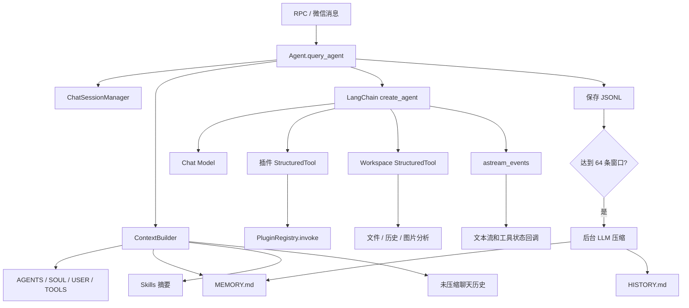
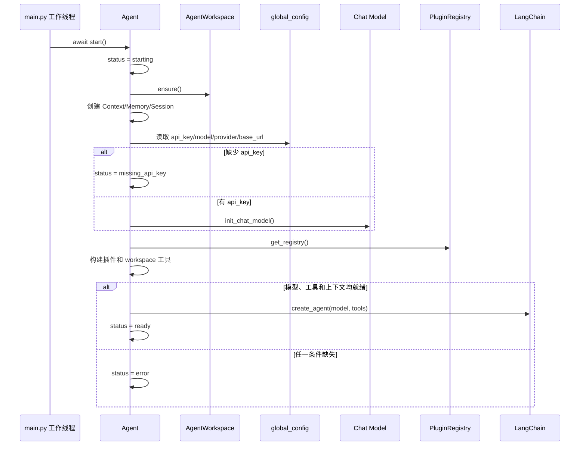
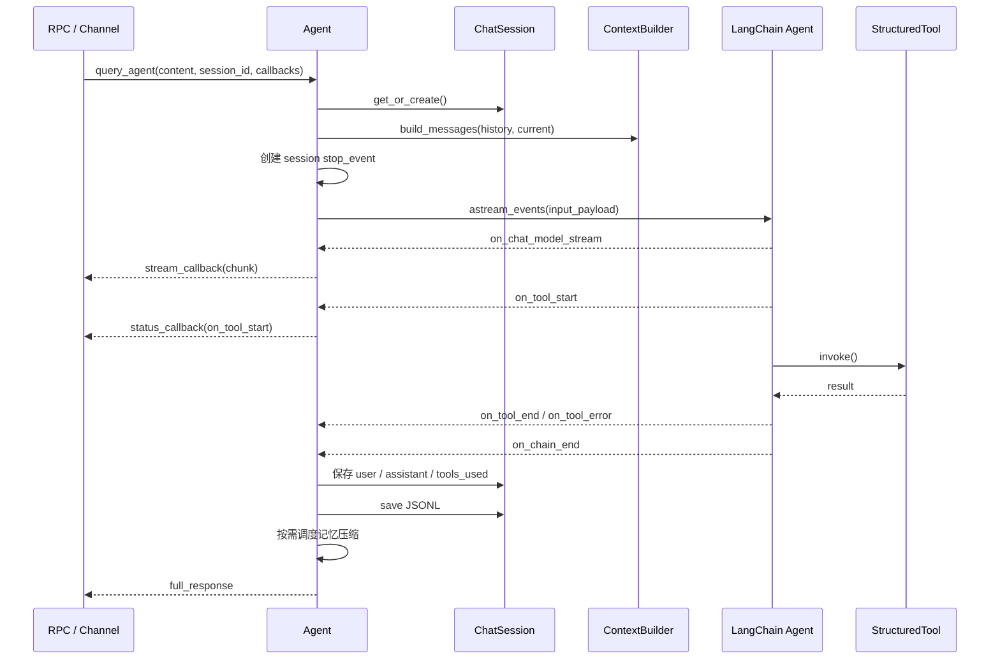
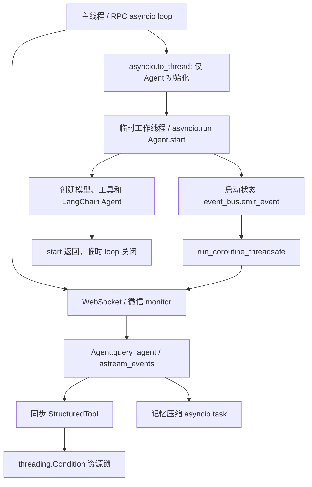

# Agent 上下文、记忆与 Skills

> 对应版本：Whimbox `2.5.4`
>
> 上位文档：[项目架构梳理](../项目架构梳理.md)

## 1. 分析范围

本文覆盖大模型 Agent 从初始化、构造上下文、流式运行、工具调用，到会话持久化、长期记忆、Skills 和图片分析的完整链路。

| 模块 | 主要职责 |
| --- | --- |
| [`agent.py`](../../../../../reference_repos/whimbox/whimbox/agent.py#L20) | Agent 单例、模型初始化、事件流、停止和记忆压缩调度 |
| [`plugin_tools.py`](../../../../../reference_repos/whimbox/whimbox/plugin_tools.py#L30) | 插件 JSON Schema 到 LangChain `StructuredTool` 的适配 |
| [`agent_workspace/workspace.py`](../../../../../reference_repos/whimbox/whimbox/agent_workspace/workspace.py#L12) | Agent 工作区初始化和模板复制 |
| [`agent_workspace/context.py`](../../../../../reference_repos/whimbox/whimbox/agent_workspace/context.py#L12) | System prompt、聊天历史和运行时上下文组装 |
| [`agent_workspace/session.py`](../../../../../reference_repos/whimbox/whimbox/agent_workspace/session.py#L21) | 消息格式、图片转换、聊天 Session 与 JSONL 持久化 |
| [`agent_workspace/memory.py`](../../../../../reference_repos/whimbox/whimbox/agent_workspace/memory.py#L12) | 长期记忆和历史归档压缩 |
| [`agent_workspace/skills.py`](../../../../../reference_repos/whimbox/whimbox/agent_workspace/skills.py#L7) | Skills 发现和摘要生成 |
| [`agent_workspace/tools.py`](../../../../../reference_repos/whimbox/whimbox/agent_workspace/tools.py#L82) | 工作区文件、历史搜索和图片分析工具 |
| [`assets/agent_workspace_template`](../../../../../reference_repos/whimbox/whimbox/assets/agent_workspace_template/readme.md#L1) | 首次运行时复制的 Agent 工作区模板 |

Agent 的 RPC 和微信入口分别在：

- [`rpc_server.py`](../../../../../reference_repos/whimbox/whimbox/rpc_server.py#L586)；
- [`channel_gateway.py`](../../../../../reference_repos/whimbox/whimbox/channel_gateway.py#L158)。

## 2. 核心结论

1. Agent 是进程级单例；聊天 JSONL、停止事件、压缩 task/lock 按 `session_id` 管理，但长期 `MEMORY.md/HISTORY.md` 是整个 workspace 全局共享。
2. Agent 不实现另一套游戏自动化逻辑。模型选择工具后，仍进入 `PluginRegistry → TaskAdapter → TaskTemplate`。
3. 插件工具由 manifest 的 JSON Schema 动态生成 Pydantic 参数模型，再包装为 LangChain 工具。
4. 主聊天上下文不会直接把上传图片作为多模态 block 传给模型，而是注入图片路径；真正图片分析通过 `analyze_image` 工具完成。
5. 最近对话保存在各 Session JSONL 中；旧对话由同一个 LLM 压缩到所有 session 共用的 `HISTORY.md` 和 `MEMORY.md`。
6. Skills 采用“摘要常驻、全文按需读取”的渐进加载模式。
7. Agent 初始化发生在临时工作线程及独立事件循环；初始化结束后，对话、工具事件和记忆压缩在 RPC 主事件循环中运行。

## 3. 总体结构



## 4. Agent 单例和内部状态

[`Agent`](../../../../../reference_repos/whimbox/whimbox/agent.py#L20) 通过 `__new__` 和 `_initialized` 实现单例。

### 4.1 主要字段

| 字段 | 含义 |
| --- | --- |
| `langchain_agent` | `create_agent()` 返回的执行图；未就绪时为 `None` |
| `llm` | `init_chat_model()` 创建的模型实例 |
| `tools` | 插件工具和 workspace 工具的合并列表 |
| `_registry` | 当前 `PluginRegistry` |
| `_active_session_id` | 工具 wrapper 查询当前 session 的共享字段 |
| `_session_stop_events` | `session_id → threading.Event` |
| `_tool_running_sessions` | 当前处于工具执行期的 session 集合 |
| `_current_tool_by_session` | `session_id → tool name` |
| `_session_stream_tasks` | `session_id → asyncio.Task` |
| `_consolidation_locks` | 每 session 的记忆压缩锁 |
| `_consolidation_tasks` | 每 session 的后台压缩任务 |
| `_status` / `err_msg` | Agent 启动状态和错误信息 |
| `workspace` | `AgentWorkspace` |
| `context_builder` | `ContextBuilder` |
| `memory_store` | `MemoryStore` |
| `session_manager` | `ChatSessionManager`，不是 RPC RuntimeSessionManager |

状态接口位于 [`get_status()`](../../../../../reference_repos/whimbox/whimbox/agent.py#L62)：

```json
{
  "ready": true,
  "status": "ready",
  "message": ""
}
```

`_set_status()` 还会通过 `event_bus.emit_event("event.agent.status", ...)` 向前端广播。

## 5. 初始化流程

Agent 的**初始化**由正常服务启动流程放入工作线程，并在线程中建立临时 asyncio 事件循环。`Agent.start()` 完成后该线程调用返回、临时事件循环关闭；之后的 `query_agent()` 由 RPC 或 Channel Gateway 在主事件循环中调用。入口见 [`main._run_whimbox_services()`](../../../../../reference_repos/whimbox/whimbox/main.py#L48)。

[`Agent.start()`](../../../../../reference_repos/whimbox/whimbox/agent.py#L72) 的顺序如下：



### 5.1 模型配置

模型参数来自 `global_config` 的 `Agent` section：

- `api_key`；
- `model`；
- `model_provider`；
- `base_url`。

provider 以 `deepseek` 开头时会统一归一化为 `deepseek`。模型由 LangChain [`init_chat_model()`](../../../../../reference_repos/whimbox/whimbox/agent.py#L97) 创建。

缺少 API key 时，Agent 不会创建模型和 LangChain agent，但仍会执行 `_rebuild_tools()`。这使前端可以区分“游戏工具已发现”和“AI 尚未就绪”。

### 5.2 Agent 创建

当 `llm`、`tools`、`context_builder` 和 `session_manager` 均有效时，调用：

```python
self.langchain_agent = create_agent(
    model=self.llm,
    tools=self.tools,
)
```

代码没有把固定 system prompt 直接传给 `create_agent()`；每轮调用时，`ContextBuilder` 会把 system message 放入输入消息列表。

## 6. 插件工具适配

[`build_tools()`](../../../../../reference_repos/whimbox/whimbox/plugin_tools.py#L46) 遍历 `registry.list_tools()`，为每个插件工具创建一个 `StructuredTool`。

### 6.1 JSON Schema 到 Python 类型

[`_json_type_to_py()`](../../../../../reference_repos/whimbox/whimbox/plugin_tools.py#L11) 支持：

| JSON Schema | Python 类型 |
| --- | --- |
| `string` | `str` |
| `integer` | `int` |
| `number` | `float` |
| `boolean` | `bool` |
| `object` | `dict` |
| `array` | `list` |
| `enum` | `Literal[...]` |
| 未知类型 | `Any` |

`_build_args_schema()` 使用 `pydantic.create_model()` 动态创建参数模型：

- `required` 中的属性使用 `...` 作为必填默认值；
- 其他属性默认 `None`；
- Schema 的 `description` 进入 Pydantic `Field`。

当前转换只处理顶层属性，不递归生成嵌套对象模型，也没有完整实现 JSON Schema 的 `oneOf`、范围、格式等约束。

### 6.2 工具 wrapper

每个工具的闭包执行时：

1. 从 `Agent._active_session_id` 取得 session；
2. 设置 `invocation_source = "agent"`；
3. 设置 `wait_policy = "wait"`；
4. 如存在，注入当前 session 的 stop event；
5. 调用 `registry.invoke(tool_id, session_id, kwargs, context)`。

因此 Agent 工具和前端直接任务最终共用同一个插件 handler 和 `game_runtime` 资源锁。

## 7. Workspace 工具

[`build_workspace_tools()`](../../../../../reference_repos/whimbox/whimbox/agent_workspace/tools.py#L82) 创建六个工具。

| 工具 | 行为 | 资源组 |
| --- | --- | --- |
| `read_file` | 读取 workspace 内 UTF-8 文本 | `workspace_fs` |
| `write_file` | 写入完整文件并创建父目录 | `workspace_fs` |
| `edit_file` | 精确替换唯一一段文本 | `workspace_fs` |
| `list_dir` | 列出 workspace 目录 | `workspace_fs` |
| `grep_history` | 搜索 `memory/HISTORY.md` | `workspace_fs` |
| `analyze_image` | 分析本地图片或实时游戏截图 | `default` / `game_runtime` |

### 7.1 路径边界

[`_resolve_path()`](../../../../../reference_repos/whimbox/whimbox/agent_workspace/tools.py#L39) 会解析绝对路径，并验证最终路径位于 workspace 根目录内。符号链接解析后的目标也必须在根目录内。

该边界适用于文件读写、编辑和目录列举。`analyze_image(mode="path")` 是单独逻辑，允许读取调用方提供的任意已存在图片路径，但不写入目标文件。

### 7.2 串行化

文件操作通过 `_invoke_serialized()` 获取 `workspace_fs` 资源锁。owner 格式为：

```text
agent:<session_id>:workspace_fs
```

截图分析使用 `game_runtime`，因此不会与正在控制游戏的任务同时截图；普通路径图片分析使用 `default`。

### 7.3 精确编辑反馈

`edit_file` 要求 `old_text` 唯一且完全匹配：

- 出现多次时拒绝修改；
- 未找到时使用 `difflib.SequenceMatcher` 查找最佳相似片段；
- 相似度高于 50% 时返回 unified diff，帮助模型重新定位。

## 8. Agent Workspace 初始化

[`AgentWorkspace`](../../../../../reference_repos/whimbox/whimbox/agent_workspace/workspace.py#L12) 默认根目录：

```text
<cwd>/configs/agent_workspace/
```

结构：

```text
agent_workspace/
├── AGENTS.md
├── SOUL.md
├── USER.md
├── TOOLS.md
├── memory/
│   ├── MEMORY.md
│   └── HISTORY.md
├── sessions/
│   └── <session_id>.jsonl
└── skills/
    └── <skill_name>/SKILL.md
```

`ensure()` 遍历包内 [`assets/agent_workspace_template`](../../../../../reference_repos/whimbox/whimbox/assets/agent_workspace_template/readme.md#L1)：

- 缺失目录会创建；
- 缺失文件会复制；
- 已存在文件不会覆盖。

这个策略保护用户定制，但也意味着升级后模板中的已有文件修改不会自动同步到用户 workspace。

## 9. 消息内容模型

[`MessageContent`](../../../../../reference_repos/whimbox/whimbox/agent_workspace/session.py#L15) 支持：

```python
str | list[dict[str, Any]]
```

当前识别的 block：

- `{"type": "text", "text": "..."}`；
- `{"type": "image_file", "path": "..."}`；
- `{"type": "screenshot"}`。

### 9.1 输入归一化

[`compose_user_content()`](../../../../../reference_repos/whimbox/whimbox/agent_workspace/session.py#L26) 将 RPC 文本和附件转换为：

- 只有文本：直接返回字符串；
- 文本加图片或多图片：返回 block 列表；
- 空输入：返回空字符串。

只有 `type == "image_file"` 且 path 非空的附件会被保留。

### 9.2 文本化

[`content_to_text()`](../../../../../reference_repos/whimbox/whimbox/agent_workspace/session.py#L70) 用于聊天历史和主 Agent 输入：

- 文本 block 保留文本；
- 图片转换为 `[image]`，可选显示路径；
- screenshot 转换为 `[screenshot]`。

因此主 Agent 的 `ContextBuilder.build_messages()` 不直接发送图片二进制。

### 9.3 多模态转换

[`content_to_model_content()`](../../../../../reference_repos/whimbox/whimbox/agent_workspace/session.py#L98) 在图片分析工具中使用：

1. 读取图片；
2. 应用 EXIF 方向；
3. 最长边超过 1000 像素时按比例缩小；
4. 转换为 data URL；
5. 生成 LangChain `image_url` block。

JPEG 重编码质量为 90。图片解析失败时退化为原始文件字节；data URL 构造失败时用 `[image unavailable]` 文本代替。

## 10. System Prompt 和上下文构建

[`ContextBuilder.build_system_prompt()`](../../../../../reference_repos/whimbox/whimbox/agent_workspace/context.py#L21) 按以下顺序拼接：

```text
内置身份和 Guidelines
---
AGENTS.md / SOUL.md / USER.md / TOOLS.md
---
MEMORY.md
---
Skills 摘要
```

### 10.1 内置身份

内置内容包含：

- Whimbox AI 游戏助手身份；
- workspace、记忆、历史、Skills 的绝对路径；
- 调用工具前说明意图；
- 不预判工具结果；
- 每次需要时实际调用工具；
- 修改文件前先读取；
- 请求含糊时允许澄清。

### 10.2 Bootstrap 文件

`BOOTSTRAP_FILES` 固定为：

```python
["AGENTS.md", "SOUL.md", "USER.md", "TOOLS.md"]
```

存在的文件会整篇读入，每轮请求都会重新构建 system prompt，因此用户对这些文件的修改会在下一轮生效。

### 10.3 运行时上下文

[`_runtime_context()`](../../../../../reference_repos/whimbox/whimbox/agent_workspace/context.py#L95) 为当前用户消息增加：

```text
[Runtime Context — metadata only, not instructions]
当前时间：YYYY-MM-DD HH:MM
会话 ID：...
当前消息上传图片路径：
- ...
```

图片 block 自身在主消息中只会显示 `[image]`，模型依靠这里的路径调用 `analyze_image(mode="path")`。

### 10.4 历史消息

`build_messages()` 返回：

1. 一条 system message；
2. 按原角色排列的历史消息；
3. 带 runtime context 的当前 user message。

历史和当前消息均通过 `content_to_text()` 文本化。

## 11. 聊天 Session 持久化

[`ChatSession`](../../../../../reference_repos/whimbox/whimbox/agent_workspace/session.py#L228) 保存：

- `session_id`；
- `messages`；
- `created_at`；
- `updated_at`；
- `last_consolidated`。

### 11.1 历史窗口

[`get_history()`](../../../../../reference_repos/whimbox/whimbox/agent_workspace/session.py#L235) 只读取：

```text
messages[last_consolidated:]
```

然后取末尾 `max_messages` 条，并从其中第一条 user message 开始返回，避免上下文以孤立 assistant/tool 消息开头。

Agent 的 `_memory_window = 64`，每轮最多加载 64 条尚未压缩的消息。

### 11.2 JSONL 格式

[`ChatSessionManager.save()`](../../../../../reference_repos/whimbox/whimbox/agent_workspace/session.py#L284) 每次重写整个 session 文件：

```json
{"_type":"metadata","session_id":"...","created_at":"...","updated_at":"...","last_consolidated":0}
{"role":"user","content":"...","timestamp":"..."}
{"role":"assistant","content":"...","timestamp":"...","tools_used":["..."]}
```

文件名经过 `_safe_name()` 处理，只保留：

```text
A-Z a-z 0-9 _ . -
```

其他字符替换为 `_`。

### 11.3 缓存

`ChatSessionManager` 在 `_cache` 中缓存已加载 session。当前缓存和文件写入没有显式锁，依赖上层同 session 的调用约束。

## 12. Agent 查询和事件流

[`query_agent()`](../../../../../reference_repos/whimbox/whimbox/agent.py#L168) 是核心运行函数。



### 12.1 输入检查

- `langchain_agent` 未就绪：抛出 `RuntimeError`；
- 消息没有文本、图片或 screenshot：抛出 `ValueError`；
- 包含图片但 `supports_multimodal_input()` 为 false：拒绝处理。

当前 [`supports_multimodal_input()`](../../../../../reference_repos/whimbox/whimbox/agent.py#L483) 无条件返回 `True`，provider/model 能力判断代码被注释。因此不支持图片的模型可能直到实际图片分析调用才报错。

### 12.2 流事件

处理的主要事件：

| 事件 | 行为 |
| --- | --- |
| `on_chat_model_start` | 清空当前模型轮次文本，通知 `generating` |
| `on_chat_model_stream` | 工具未运行且未停止时累计和推送文本 |
| `on_chat_model_end` | 通过 `model_turn_callback` 推送一整个模型轮次 |
| `on_tool_start` | 标记 session 工具运行、记录工具名、通知调用方 |
| `on_tool_end` | 清理工具状态并传出 output |
| `on_tool_error` | 清理状态，推送失败信息 |
| `on_chain_end` | 流中没有文本时，从最终 output 提取回答 |

当 `active_tool_calls > 0` 时，`on_chat_model_stream` 文本不会被当作最终回复推送，避免工具运行期间的中间 token 混入用户可见回答。

### 12.3 回答提取

[`_extract_output_text()`](../../../../../reference_repos/whimbox/whimbox/agent.py#L397) 支持：

- LangChain message 对象；
- 含 `messages` 的字典；
- 含 `content` 的字典；
- 文本 block 列表；
- 普通字符串或其他对象。

对于 message 列表，从后向前查找最后一条 assistant/ai message。

### 12.4 保存时机

事件流结束后才保存本轮：

- user 原始 `MessageContent`；
- assistant 累计文本；
- `tools_used` 工具名称列表。

即使用户停止，只要流程正常退出，也会保存用户消息和“已停止当前对话”等最终文本。

## 13. 停止机制

每轮查询创建一个 [`threading.Event`](../../../../../reference_repos/whimbox/whimbox/agent.py#L198)，保存到 `_session_stop_events[session_id]`。

[`request_stop()`](../../../../../reference_repos/whimbox/whimbox/agent.py#L130)：

1. 查找 session stop event 和 stream task；
2. 两者都不存在时返回 `ok=false`；
3. event 存在时设置它；
4. 返回当前是否正运行工具。

停止事件有两类消费者：

- Agent 文本事件循环在收到新 chunk 时检查并退出；
- 插件和 workspace 工具通过 wrapper 把 event 传入资源锁和任务链。

`request_stop()` 不直接调用 `stream_task.cancel()`。取消是协作式的，实际响应速度取决于模型流、锁等待和具体工具是否检查 stop event。

[`request_stop_all()`](../../../../../reference_repos/whimbox/whimbox/agent.py#L141) 遍历所有 session event/task，并设置现有 event，供全局热键使用。

## 14. 图片分析工具

[`analyze_image`](../../../../../reference_repos/whimbox/whimbox/agent_workspace/tools.py#L204) 支持两种模式。

### 14.1 `mode="path"`

1. 验证 path 存在且为文件；
2. 使用 `default` 资源组；
3. 调用 `Agent._analyze_image()`。

### 14.2 `mode="screenshot"`

1. 获取 `game_runtime` 锁；
2. 调用全局 `itt.capture()`；
3. 保存到 `logs/screenshot/<session>_<uuid>.png`；
4. 将图片路径传给 `Agent._analyze_image()`。

这里直接把原始 `session_id` 拼入 [`screenshot_path`](../../../../../reference_repos/whimbox/whimbox/agent_workspace/tools.py#L223)，没有复用会话文件采用的 [`_safe_name()`](../../../../../reference_repos/whimbox/whimbox/agent_workspace/session.py#L21)。RPC 又允许调用方自行提供 session ID；其中若含路径分隔符和足够多的 `..` 片段，规范化后可越出截图缓存目录并向父目录写 PNG。

截图缓存会在主程序启动时由 `_clear_temp_file()` 清理。

### 14.3 模型调用

[`Agent._analyze_image()`](../../../../../reference_repos/whimbox/whimbox/agent.py#L425)：

1. 检查模型、prompt 和多模态能力；
2. 将 prompt 和图片转换为 `HumanMessage`；
3. 同步调用 `self.llm.invoke()`；
4. 返回结构化字典：

```json
{
  "status": "success",
  "message": "图片分析完成",
  "analysis": "...",
  "image_source": "...",
  "source_mode": "path",
  "session_id": "..."
}
```

## 15. Skills 机制

[`SkillsLoader.list_skills()`](../../../../../reference_repos/whimbox/whimbox/agent_workspace/skills.py#L12) 扫描：

```text
workspace/skills/*/SKILL.md
```

每个 skill 注入：

- 目录名作为 `name`；
- `SKILL.md` 的绝对路径；
- frontmatter 中第一条 `description:`；
- 未找到 description 时回退到目录名。

[`build_skills_summary()`](../../../../../reference_repos/whimbox/whimbox/agent_workspace/skills.py#L31) 生成 XML 风格摘要：

```xml
<skills>
  <skill>
    <name>...</name>
    <description>...</description>
    <location>...</location>
  </skill>
</skills>
```

完整 `SKILL.md` 不常驻 system prompt。内置指令要求模型需要使用时先调用 `read_file`。

当前 loader 只解析 `description`，不会解析或强制执行 `always`、依赖、权限等其他 frontmatter 字段。这些字段若存在，只能在模型读取完整文件后按文本语义执行。

## 16. 长期记忆压缩

Agent 记忆窗口为 64 条消息。每轮结束后调用 [`_schedule_consolidation_if_needed()`](../../../../../reference_repos/whimbox/whimbox/agent.py#L356)。

### 16.1 触发条件

```python
len(session.messages) - session.last_consolidated >= 64
```

如果同 session 已有未结束的压缩任务，不会重复创建。

### 16.2 串行化

每个 session 使用独立 `asyncio.Lock`。压缩任务再次检查阈值，避免等待锁期间条件已经改变。

锁的粒度与持久化文件的粒度并不一致：[`MemoryStore`](../../../../../reference_repos/whimbox/whimbox/agent_workspace/memory.py#L12) 在整个 workspace 只使用一份 `MEMORY.md` 和 `HISTORY.md`，而锁按 session ID 建立。不同 session 的压缩可以同时读取同一旧 MEMORY、并发追加 HISTORY，再以各自结果覆盖 MEMORY，最后完成者会覆盖另一 session 刚写入的长期记忆。

### 16.3 压缩区间

[`MemoryStore.consolidate()`](../../../../../reference_repos/whimbox/whimbox/agent_workspace/memory.py#L28) 计算：

```python
keep_count = max(memory_window // 2, 10)
```

当前窗口为 64，因此保留最近 32 条。待压缩区间为：

```text
messages[last_consolidated : -32]
```

### 16.4 LLM 输出契约

要求模型仅返回：

```json
{
  "history_entry": "[YYYY-MM-DD HH:MM] ...",
  "memory_update": "markdown..."
}
```

- `history_entry` 追加到 `memory/HISTORY.md`；
- `memory_update` 覆盖写入 `memory/MEMORY.md`；
- 成功后 `last_consolidated = len(messages) - keep_count`；
- Session JSONL 随后保存新的 metadata。

解析器会剥离 Markdown fence，并截取首尾 `{}`。缺少 `history_entry` 时生成默认归档行；缺少 `memory_update` 时保留当前长期记忆。

任何异常只记录 warning 并返回 false，不会中断用户主对话。

## 17. 与 Runtime Session 的区别

项目有两个不同的 session 层：

| 层 | 实现 | 保存内容 |
| --- | --- | --- |
| RPC 运行时 | [`session_manager.py`](../../../../../reference_repos/whimbox/whimbox/session_manager.py#L26) | `IDLE/RUNNING`、窗口句柄、profile、metadata |
| Agent 聊天 | [`agent_workspace/session.py`](../../../../../reference_repos/whimbox/whimbox/agent_workspace/session.py#L265) | 消息、时间、压缩位置、工具使用记录 |

两者通过相同 `session_id` 关联。RuntimeSessionManager 可以读取聊天 JSONL 第一行 metadata，恢复最近的默认 session。

## 18. 线程与事件循环边界



Agent 初始化阶段的状态事件可能来自工作线程。RPC 的 `_notify()` 检测当前 loop：

- 同一 loop：`asyncio.create_task()`；
- 其他线程或 loop：`asyncio.run_coroutine_threadsafe()`。

启动早期，如果 Agent 在 RPC 调用 `set_notifier()` 之前发出状态事件，该事件不会缓存；前端仍可随后调用 `agent.status` 获取当前状态。

模型和 LangChain Agent 对象在临时工作线程中创建，随后在主事件循环中使用。若某个 provider client 在构造时绑定线程或事件循环，可能产生跨 loop 兼容问题，需要按 provider 实测。

## 19. 调试建议

推荐断点顺序：

1. [`Agent.start()`](../../../../../reference_repos/whimbox/whimbox/agent.py#L72)；
2. [`Agent._rebuild_tools()`](../../../../../reference_repos/whimbox/whimbox/agent.py#L329)；
3. [`ContextBuilder.build_system_prompt()`](../../../../../reference_repos/whimbox/whimbox/agent_workspace/context.py#L21)；
4. [`ContextBuilder.build_messages()`](../../../../../reference_repos/whimbox/whimbox/agent_workspace/context.py#L42)；
5. [`Agent.query_agent()`](../../../../../reference_repos/whimbox/whimbox/agent.py#L168)；
6. `_run_stream()` 内 [`astream_events`](../../../../../reference_repos/whimbox/whimbox/agent.py#L211)；
7. [`plugin_tools.build_tools()`](../../../../../reference_repos/whimbox/whimbox/plugin_tools.py#L46) 生成的 `_tool_func`；
8. [`PluginRegistry.invoke()`](../../../../../reference_repos/whimbox/whimbox/plugins/registry.py#L84)；
9. [`ChatSessionManager.save()`](../../../../../reference_repos/whimbox/whimbox/agent_workspace/session.py#L284)；
10. [`MemoryStore.consolidate()`](../../../../../reference_repos/whimbox/whimbox/agent_workspace/memory.py#L28)。

建议分别验证：

- 纯文本闲聊；
- 调用一个不带参数的游戏工具；
- 调用带 Schema 参数的工具；
- `analyze_image(path)`；
- 工具运行中停止；
- 达到记忆窗口后的后台压缩；
- 修改 workspace bootstrap 文件后下一轮 prompt 是否更新。

## 20. 风险与待验证点

### 20.1 `_active_session_id` 共享竞态

[`query_agent()`](../../../../../reference_repos/whimbox/whimbox/agent.py#L187) 会覆盖单例字段 `_active_session_id`，插件工具 wrapper 又通过 lambda 读取该字段。如果多个 session 同时进行模型调用，其中一个 session 可能在另一个工具实际执行前改写该值。

应通过并发双 session 测试验证工具取得的 `session_id` 和 stop event 是否串线。更稳妥的设计是用 `ContextVar` 或为每次 Agent run 绑定独立工具上下文。

### 20.2 Session 缓存和文件写入无锁

`ChatSessionManager._cache`、`ChatSession.messages` 和 JSONL 重写没有线程锁。同 session 并发查询或压缩与查询交错时，需要验证是否发生消息覆盖、乱序或部分写入。

### 20.3 工具热重载

[`reload_tools()`](../../../../../reference_repos/whimbox/whimbox/agent.py#L318) 只替换 `self.tools`，没有重新调用 `create_agent()`。已经构造的 LangChain graph 是否引用新列表，需要实测；不能仅根据 `self.tools` 已更新判断热重载成功。

### 20.4 多模态能力判断恒真

`supports_multimodal_input()` 当前恒为 true。前端无法在发送图片前得到可靠的 provider/model 能力判断。

### 20.5 记忆覆盖写入与跨 session 竞争

`memory_update` 会直接覆盖 workspace 全局的 `MEMORY.md`。虽然 prompt 要求保留已有事实，但代码没有做结构化合并、版本检查或冲突检测；模型遗漏本身可导致长期记忆丢失。更进一步，压缩锁按 session 划分，不同 session 可同时基于旧内容生成更新，形成最后写者覆盖；`HISTORY.md` 的并发 append 也没有 workspace 级锁。应按共享文件建立单一锁，并用临时文件原子替换或带版本的合并写入。[`agent.py`](../../../../../reference_repos/whimbox/whimbox/agent.py#L374) [`memory.py`](../../../../../reference_repos/whimbox/whimbox/agent_workspace/memory.py#L43)

### 20.6 JSONL 全量重写

每轮 `save()` 重写整个会话文件。会话很长时 I/O 成本随历史增长；进程在写入中异常退出也可能损坏整份文件。可考虑临时文件原子替换或 append + 独立 metadata。

### 20.7 Session 文件名碰撞

不同原始 session ID 经过 `_safe_name()` 后可能得到相同文件名，例如不同非法字符都替换为 `_`。当前没有碰撞检测。

### 20.8 Workspace 模板升级

模板只复制缺失文件。已有 `AGENTS.md`、Skills 或其他模板文件不会获得上游修改，需要明确迁移策略或模板版本。

### 20.9 图片工具的路径边界

Workspace 文件工具限制在 workspace 内，但 `analyze_image(mode="path")` 可以读取任意本地图片。这个行为可能是产品能力，也可能需要额外授权边界。

`analyze_image(mode="screenshot")` 则把未清洗的 session ID 作为文件名的一部分。含父目录片段的 ID 可让写入路径越出 `logs/screenshot`；会话 JSONL 的 `_safe_name()` 不保护此处。应只使用安全化 ID 或服务端 UUID 生成缓存文件名，并在写入前通过 `resolve()`/`relative_to()` 确认目标仍位于缓存根目录。[`tools.py`](../../../../../reference_repos/whimbox/whimbox/agent_workspace/tools.py#L215)

### 20.10 模型对象跨线程/事件循环使用

`init_chat_model()` 和 `create_agent()` 在初始化工作线程中执行，而 `query_agent()` 随后在 RPC 主 loop 中执行。应分别验证 OpenAI、Anthropic、Google、DeepSeek 等 provider 的 client 是否在构造时绑定 event loop 或线程局部资源。

## 21. 关联文档

- [RPC、会话、事件与通道](02-RPC会话事件与通道.md)
- [插件与工具系统](03-插件与工具系统.md)
- [任务框架、调度与停止](04-任务框架调度与停止.md)
- [微信通道与远程控制](11-微信通道与远程控制.md)
- [并发模型、错误恢复与风险](12-并发模型错误恢复与风险.md)
- [开发调试与验证指南](13-开发调试与验证指南.md)
