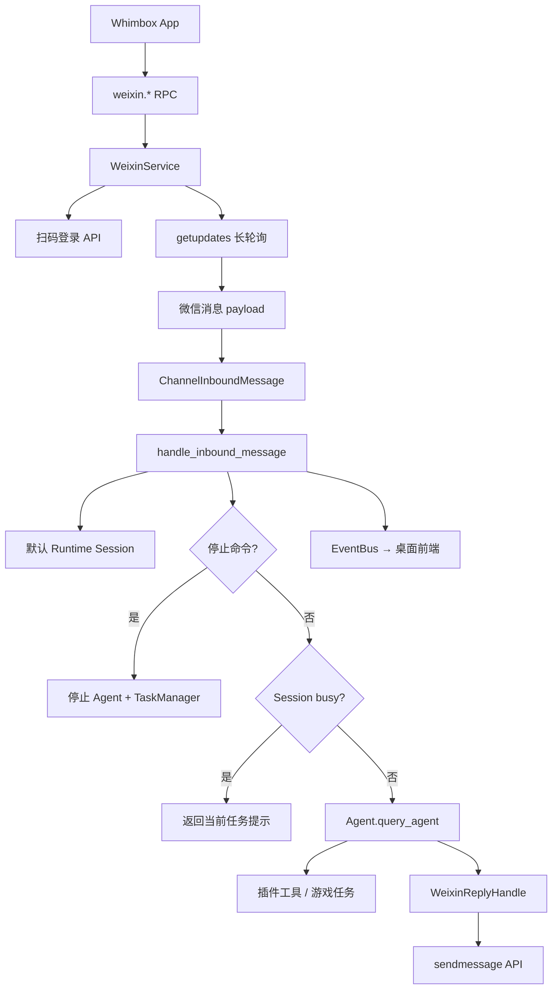
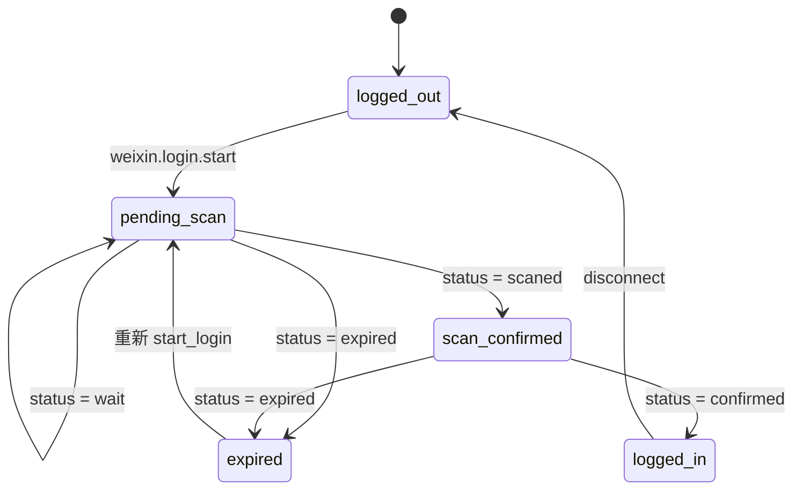
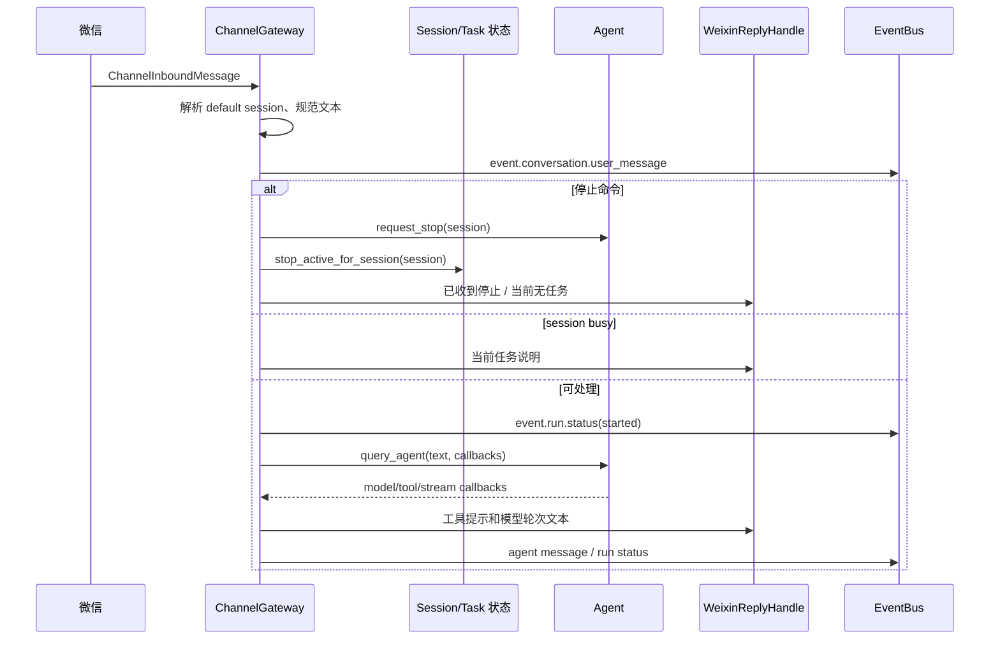

# 微信通道与远程控制

> 对应版本：Whimbox `2.5.4`
>
> 上位文档：[项目架构梳理](../项目架构梳理.md)

## 1. 分析范围

本文分析微信登录、凭据持久化、长轮询收消息、回复发送、通用 Channel Gateway、默认会话复用、停止命令和前端状态广播。

| 模块 | 职责 |
| --- | --- |
| [`weixin_service.py`](../../../../../reference_repos/whimbox/whimbox/weixin_service.py#L33) | 微信登录、API、长轮询、消息和回复适配 |
| [`channel_gateway.py`](../../../../../reference_repos/whimbox/whimbox/channel_gateway.py#L19) | 通用文本通道抽象、session、busy/stop 和 Agent 调用 |
| [`rpc_method_groups.py`](../../../../../reference_repos/whimbox/whimbox/rpc_method_groups.py#L170) | 微信相关 RPC 方法 |
| [`rpc_server.py`](../../../../../reference_repos/whimbox/whimbox/rpc_server.py#L952) | 启动时自动恢复微信 monitor |
| [`session_manager.py`](../../../../../reference_repos/whimbox/whimbox/session_manager.py#L26) | 默认 Runtime Session 创建和恢复 |
| [`agent.py`](../../../../../reference_repos/whimbox/whimbox/agent.py#L168) | 实际自然语言处理和工具调用 |
| [`event_bus.py`](../../../../../reference_repos/whimbox/whimbox/event_bus.py#L11) | 将微信侧消息和状态同步到桌面前端 |

## 2. 核心结论

1. 微信是一个外部输入/输出适配器，业务处理统一进入 `ChannelGateway → Agent → 插件工具`。
2. HTTP 调用使用标准库 `urllib`，通过 `asyncio.to_thread()` 避免阻塞主 RPC 事件循环。
3. 登录凭据和长轮询游标保存在 `<cwd>/configs/weixin/`，程序重启后可以自动恢复 monitor。
4. 所有微信联系人默认复用同一个 default session，因此共享聊天上下文和游戏运行状态。
5. 每条收到的消息创建独立 asyncio task；当前没有按联系人或 session 的完整串行队列。
6. busy 判断只覆盖“Agent 已进入工具执行”和 `TaskManager` 活跃任务，不覆盖纯模型思考/生成阶段。
7. 停止是协作式的，同时设置 Agent 和直接 RPC 任务的 stop event。

## 3. 总体链路



## 4. WeixinService 状态

[`WeixinService`](../../../../../reference_repos/whimbox/whimbox/weixin_service.py#L69) 是进程级单例。模块导入末尾创建 `weixin_service`。

### 4.1 常量

| 常量 | 当前值 | 用途 |
| --- | --- | --- |
| `DEFAULT_BASE_URL` | `https://ilinkai.weixin.qq.com/` | 登录 API 初始地址 |
| `DEFAULT_BOT_TYPE` | `3` | 获取二维码参数 |
| `DEFAULT_CHANNEL_VERSION` | `whimbox` | API `base_info.channel_version` |
| `QR_STATUS_TIMEOUT_SECONDS` | `35` | 二维码状态长轮询超时 |

### 4.2 内部状态

| 字段 | 含义 |
| --- | --- |
| `_auth` | token、base_url、account_id、user_id、保存时间 |
| `_login_state` | 登录状态 |
| `_monitor_state` | monitor 状态 |
| `_last_error` | 最近错误文本 |
| `_qrcode` | 二维码轮询标识 |
| `_qrcode_url` | 前端显示的二维码内容/URL |
| `_get_updates_buf` | getupdates 增量游标 |
| `_monitor_task` | 长轮询 asyncio task |
| `_monitor_stop` | monitor 停止事件 |
| `_context_tokens` | `sender_id → context_token` |
| `_active_inbound_tasks` | 正在处理的入站消息 task 集合 |
| `_lock` | 登录和 monitor 状态变更锁 |

### 4.3 状态输出

[`get_status()`](../../../../../reference_repos/whimbox/whimbox/weixin_service.py#L144) 返回：

```json
{
  "login_state": "logged_in",
  "monitor_state": "running",
  "account_id": "...",
  "last_error": null,
  "qrcode_url": null
}
```

token、user ID 和轮询游标不会直接返回前端。

## 5. 本地持久化

存储目录：

```text
<cwd>/configs/weixin/
├── auth.json
└── runtime.json
```

`CONFIG_PATH` 基于当前工作目录，因此 PyCharm Working directory 会决定实际微信凭据位置。

### 5.1 `auth.json`

由 [`_save_auth()`](../../../../../reference_repos/whimbox/whimbox/weixin_service.py#L128) 写入：

```json
{
  "token": "...",
  "base_url": "...",
  "account_id": "...",
  "user_id": "...",
  "saved_at": "..."
}
```

### 5.2 `runtime.json`

由 [`_save_runtime()`](../../../../../reference_repos/whimbox/whimbox/weixin_service.py#L139) 写入：

```json
{
  "get_updates_buf": "..."
}
```

游标在每次 getupdates 返回新值时更新，用于重启后继续增量读取。

### 5.3 启动恢复

构造函数调用 `_ensure_storage()` 和 `_load_state()`：

- auth 文件有 token：`login_state = logged_in`；
- runtime 文件存在：恢复 `_get_updates_buf`；
- 文件损坏：记录 warning，保留默认状态。

RPC 服务启动时异步调用 [`weixin_service.auto_restore()`](../../../../../reference_repos/whimbox/whimbox/rpc_server.py#L959)。有 token 且 monitor 未运行时，会自动 `start_monitor()`。

## 6. 前端 RPC 接口

[`handle_weixin_method()`](../../../../../reference_repos/whimbox/whimbox/rpc_method_groups.py#L170) 暴露：

| RPC 方法 | 服务方法 | 作用 |
| --- | --- | --- |
| `weixin.login.start` | `start_login()` | 获取二维码并进入待扫码状态 |
| `weixin.login.poll` | `poll_login()` | 长轮询二维码状态 |
| `weixin.status.get` | `get_status()` | 查询登录和 monitor 状态 |
| `weixin.monitor.start` | `start_monitor()` | 开始收消息 |
| `weixin.monitor.stop` | `stop_monitor()` | 停止收消息 |
| `weixin.disconnect` | `disconnect()` | 停止、清凭据并退出登录 |

这些方法最终由 RPC `_dispatch()` 在核心方法未命中后交给 method group。

## 7. 扫码登录状态机



### 7.1 获取二维码

[`start_login()`](../../../../../reference_repos/whimbox/whimbox/weixin_service.py#L153)：

1. 获取 `_lock`；
2. 在线程中 GET `ilink/bot/get_bot_qrcode`；
3. 参数为 `bot_type=3`；
4. 读取 `qrcode` 和 `qrcode_img_content`；
5. 缺少任一字段时抛出 `ValueError`；
6. 设置 `pending_scan` 并清空旧错误。

登录请求始终使用 `DEFAULT_BASE_URL`。

### 7.2 轮询二维码

[`poll_login()`](../../../../../reference_repos/whimbox/whimbox/weixin_service.py#L169)：

1. 没有 `_qrcode` 时直接返回当前状态；
2. GET `ilink/bot/get_qrcode_status`，超时 35 秒；
3. `TimeoutError` 归一化为 `status=wait`；
4. 根据服务端状态转换本地状态。

`confirmed` 时保存：

- `bot_token`；
- 服务端下发的 `baseurl`；
- `ilink_bot_id`；
- `ilink_user_id`；
- UTC 保存时间。

保存成功后释放状态锁，再调用 `start_monitor()`，避免在持有同一个 `_lock` 时递归获取。

## 8. Monitor 生命周期

### 8.1 启动

[`start_monitor()`](../../../../../reference_repos/whimbox/whimbox/weixin_service.py#L211)：

- 没 token：拒绝启动；
- 现有 task 未结束：幂等返回；
- 新建 `asyncio.Event`；
- 设置 `monitor_state=running`；
- 创建 `_monitor_loop()` task。

### 8.2 长轮询

[`_monitor_loop()`](../../../../../reference_repos/whimbox/whimbox/weixin_service.py#L272)：

```text
while not monitor_stop:
    POST ilink/bot/getupdates (timeout=40s)
    检查 errcode
    更新 get_updates_buf
    为每条 msgs 创建独立 asyncio task
```

HTTP 请求放入 `asyncio.to_thread()`，避免阻塞主事件循环。

特殊错误：

- `errcode == -14`：登录过期，设置 `login_state=expired`、`monitor_state=error` 并退出；
- 其他异常：记录 exception，设置 monitor error；
- 正常结束：`monitor_state=stopped`。

### 8.3 停止

[`stop_monitor()`](../../../../../reference_repos/whimbox/whimbox/weixin_service.py#L223)：

1. 在锁内设置 `_monitor_stop`；
2. 在锁外等待 monitor task；
3. 清空 `_monitor_task`；
4. 非 error 状态转为 `stopped`。

因为 `urlopen()` 位于工作线程中且无法由 `asyncio.Event` 中断，停止最长可能等待当前 40 秒长轮询结束。

### 8.4 断开连接

[`disconnect()`](../../../../../reference_repos/whimbox/whimbox/weixin_service.py#L235)：

1. 停止 monitor；
2. 重置 auth、登录、错误、二维码、游标；
3. 清空 context token；
4. 删除 `auth.json` 和 `runtime.json`。

删除后无法自动恢复，必须重新扫码。

## 9. 入站消息解析

[`_handle_weixin_message()`](../../../../../reference_repos/whimbox/whimbox/weixin_service.py#L308) 当前只接受：

```python
message_type == 1
```

然后要求：

- `from_user_id` 非空；
- `context_token` 非空。

它保存 `sender_id → context_token`，再从 `item_list` 中提取 `type == 1` 的 `text_item.text`。多个文本 item 用换行拼接。

图片、语音、文件和其他 message/item 类型会被忽略。空文本最终由 Channel Gateway 返回“不支持该消息类型”。

构造的通用消息：

```python
ChannelInboundMessage(
    channel="weixin",
    sender_id=sender_id,
    text=text,
    session_id=resolve_channel_session_id(),
    reply=_WeixinReplyHandle(...),
)
```

## 10. Channel Gateway 抽象

[`ChannelReplyHandle`](../../../../../reference_repos/whimbox/whimbox/channel_gateway.py#L19) 定义三个异步输出操作：

- `send_text()`；
- `send_tool_start()`；
- `send_error()`。

[`ChannelInboundMessage`](../../../../../reference_repos/whimbox/whimbox/channel_gateway.py#L31) 是通用输入 DTO：

| 字段 | 含义 |
| --- | --- |
| `channel` | 来源通道，例如 `weixin` |
| `sender_id` | 通道用户 ID |
| `text` | 文本内容 |
| `reply` | 回复适配器 |
| `session_id` | Whimbox session |
| `sender_name` | 可选展示名称 |
| `attachments` | 可选附件列表 |

当前 `handle_inbound_message()` 只把归一化后的 `text` 传给 Agent，未把 `attachments` 组装为 `MessageContent`。因此通用 DTO 虽已预留附件，通道链目前仍是纯文本路径。

## 11. 默认 Session 解析

[`resolve_channel_session_id()`](../../../../../reference_repos/whimbox/whimbox/channel_gateway.py#L41) 的顺序：

1. 调用方传入非 `default` ID：直接使用；
2. 查找现有 default Runtime Session；
3. Runtime Session 不存在时，从最近聊天 JSONL 恢复；
4. 仍不存在时，创建 `name=default, profile=default` 的 session。

微信调用时不传联系人专属 session，因此所有联系人都会进入同一个 default session。

后果：

- 共享 Agent 对话历史；
- 使用同一份 workspace 全局长期记忆上下文；这一点即使改成联系人独立 session 也不会自动隔离；
- 共享游戏任务 busy 状态；
- 任一联系人发送停止命令可能停止该 default session 的工作。

## 12. 消息处理流程

[`handle_inbound_message()`](../../../../../reference_repos/whimbox/whimbox/channel_gateway.py#L158)：



### 12.1 文本规范化

`_normalize_text()`：

- 去掉首尾空白；
- 将连续任意空白压成一个空格。

这也会把用户原本的多行文本合并为单行。

### 12.2 用户消息广播

所有非空消息在停止/busy 判断前广播：

```text
event.conversation.user_message
```

桌面前端因此可以同步显示微信侧输入。

## 13. Busy 和停止逻辑

### 13.1 Busy 判断

[`is_session_busy()`](../../../../../reference_repos/whimbox/whimbox/channel_gateway.py#L55) 只检查：

```python
whimbox_agent.is_tool_running(session_id)
or task_manager.has_active(session_id)
```

如 busy，`describe_session_activity()` 优先：

1. 取最新直接任务的 `tool_id`；
2. 从插件注册表解析展示名称；
3. 否则取 Agent 当前工具名称；
4. 最后返回通用处理中提示。

### 13.2 停止关键词

```python
("停止", "结束", "停止任务", "结束任务", "stop")
```

[`_is_stop_command()`](../../../../../reference_repos/whimbox/whimbox/channel_gateway.py#L107) 使用 `any(keyword in normalized)`，属于子串判断，而不是精确命令判断。

例如包含“结束”或英文 `stop` 的普通句子也可能被解释为停止命令。

### 13.3 停止范围

[`stop_session_work()`](../../../../../reference_repos/whimbox/whimbox/channel_gateway.py#L92) 同时：

- `whimbox_agent.request_stop(session_id)`；
- `task_manager.stop_active_for_session(session_id)`。

它不强制 cancel asyncio task 或线程，只设置协作式 stop event。

## 14. Agent 回调到微信回复

Gateway 为每条消息生成：

```text
tool_<uuid>
```

作为该通道处理的 `tool_call_id`，并广播 `event.run.status`。

### 14.1 `stream_callback`

模型 chunk 只广播到桌面前端的 `event.agent.message`，不会逐 token 发给微信。

### 14.2 `model_turn_callback`

每次完整模型轮次通过 `_queue_send()` 创建异步发送 task，交给微信回复。

这允许 ReAct 流程中工具调用前后的多个模型轮次分别发送。

### 14.3 `status_callback`

| Agent 状态 | Gateway 行为 |
| --- | --- |
| `generating` | 广播 `running/generating` |
| `completed` | 广播 completed |
| `cancelled` | 广播 cancelled |
| `error` / `on_tool_error` | 广播 error |
| `on_tool_start` | 微信发送“调用工具：<name>” |

### 14.4 最终回复兜底

如果本轮从未触发 `model_turn_callback`，Gateway 使用 `query_agent()` 的最终 `response_text` 发送一次，避免某些 LangChain 事件形态没有产生完整轮次回调。

所有 `_queue_send()` 创建的任务在 finally 中 `gather(return_exceptions=True)`，确保函数返回前已等待发送结束，但发送异常不会再次抛出。

## 15. WeixinReplyHandle

[`_WeixinReplyHandle`](../../../../../reference_repos/whimbox/whimbox/weixin_service.py#L41) 保存：

- 目标用户 ID；
- 当前消息 context token；
- 每条入站消息独立的 `asyncio.Lock`。

同一条入站消息产生的多次回复会串行发送。但不同入站消息各有自己的 handle 和 lock，因此同一个联系人并发发送两条消息时，两个回复序列仍可能交错。

`send_tool_start(name)` 转换为：

```text
调用工具：<name>
```

`send_error()` 直接复用 `send_text()`。

## 16. 发送消息 API

[`send_text_message()`](../../../../../reference_repos/whimbox/whimbox/weixin_service.py#L252) 构造：

```json
{
  "msg": {
    "from_user_id": "",
    "to_user_id": "...",
    "client_id": "whimbox-<timestamp>-<random>",
    "message_type": 2,
    "message_state": 2,
    "context_token": "...",
    "item_list": [
      {"type": 1, "text_item": {"text": "..."}}
    ]
  }
}
```

通过 `asyncio.to_thread(_api_post, ...)` 调用 `ilink/bot/sendmessage`。

## 17. HTTP 实现

### 17.1 Headers

[`_build_headers()`](../../../../../reference_repos/whimbox/whimbox/weixin_service.py#L338) 设置：

- `Content-Type: application/json`；
- `AuthorizationType: ilink_bot_token`；
- 随机 `X-WECHAT-UIN` 的 base64 值；
- 有 token 时 `Authorization: Bearer <token>`；
- POST 时显式 `Content-Length`。

### 17.2 GET

`_api_get()` 使用 `urljoin()` 拼接 endpoint、`urlencode()` 编码 query，再通过 `urlopen()` 读取 JSON。

`URLError.reason` 是 `TimeoutError` 时会重新抛出标准 `TimeoutError`，让二维码轮询把它转成 wait。

### 17.3 POST

`_api_post()` 会给 body 增加：

```json
{"base_info": {"channel_version": "whimbox"}}
```

再向服务端下发的 `_auth.base_url` 发送请求。

## 18. 调试建议

推荐断点：

1. [`handle_weixin_method()`](../../../../../reference_repos/whimbox/whimbox/rpc_method_groups.py#L170)；
2. [`WeixinService.start_login()`](../../../../../reference_repos/whimbox/whimbox/weixin_service.py#L153)；
3. [`WeixinService.poll_login()`](../../../../../reference_repos/whimbox/whimbox/weixin_service.py#L169)；
4. [`WeixinService._monitor_loop()`](../../../../../reference_repos/whimbox/whimbox/weixin_service.py#L272)；
5. [`WeixinService._handle_weixin_message()`](../../../../../reference_repos/whimbox/whimbox/weixin_service.py#L308)；
6. [`resolve_channel_session_id()`](../../../../../reference_repos/whimbox/whimbox/channel_gateway.py#L41)；
7. [`handle_inbound_message()`](../../../../../reference_repos/whimbox/whimbox/channel_gateway.py#L158)；
8. [`Agent.query_agent()`](../../../../../reference_repos/whimbox/whimbox/agent.py#L168)；
9. [`_WeixinReplyHandle.send_text()`](../../../../../reference_repos/whimbox/whimbox/weixin_service.py#L48)；
10. [`WeixinService._api_post()`](../../../../../reference_repos/whimbox/whimbox/weixin_service.py#L371)。

建议分别测试：

- 首次扫码、已扫码未确认、过期和确认；
- 重启后自动恢复 monitor；
- getupdates 游标持久化；
- 纯聊天、工具调用、工具失败；
- 工具运行中发送停止；
- 模型思考阶段发送第二条消息；
- 两个微信联系人同时发送消息；
- monitor 停止时正处于长轮询；
- token 过期 `errcode=-14`；
- 网络中断和服务端返回非法 JSON。

## 19. 风险与待验证点

### 19.1 所有联系人共享默认 Session

不同联系人因复用 default session 而共享聊天历史和部分任务/停止关联；同时，Agent 的 workspace 长期记忆本来就是所有 session 共用。多用户场景下可能出现上下文泄露、互相停止任务或指令串扰。若产品允许多人绑定，可按 `channel + sender_id` 映射独立 session，以隔离聊天 JSONL 和按 session 索引的部分运行状态；这仍不能隔离单例 `_active_session_id`、全局 MemoryStore、`game_runtime` 资源锁以及真实游戏/UI 状态，后者需要分别重构或建立用户级边界。

### 19.2 Busy 检查窗口不完整

Agent 在纯模型思考/生成阶段尚未进入 `on_tool_start`，`is_tool_running()` 为 false。此时第二条消息可能通过 busy 检查并与第一条并发调用同一个 Agent 单例。

### 19.3 Busy 检查和任务开始非原子

即使两个消息都将在之后调用工具，它们可能同时检查到 idle，再分别进入 Agent。资源锁能串行化游戏工具，但不能防止共享 `_active_session_id` 和聊天 Session 的竞态。

### 19.4 停止反馈误判

`stop_session_work()` 的 `stopped` 只根据“是否正在运行工具”或“是否有 TaskManager 任务”计算。Agent 正在思考但尚未调用工具时，`request_stop()` 可能已经设置 stop event，返回给用户的却可能是“当前没有运行中的任务”。

### 19.5 停止关键词过宽

使用子串匹配会把普通句子误判为停止命令。建议改为规范化后的精确命令或明确前缀。

### 19.6 Monitor 停止延迟

`asyncio.Event` 无法中断工作线程中的 `urlopen(timeout=40)`，停止 monitor 可能等待接近 40 秒。

### 19.7 活跃入站任务生命周期

`stop_monitor()` 只等待 monitor task，不取消或等待 `_active_inbound_tasks`。disconnect 后已经取到的消息仍可能继续调用 Agent 或发送回复。

### 19.8 每消息回复锁不覆盖同一联系人全局

锁位于 `_WeixinReplyHandle` 实例内。并发入站消息会创建多个锁，发送次序可能交错。

### 19.9 凭据明文保存

bot token 以明文 JSON 存在 `configs/weixin/auth.json`。应限制文件权限、避免打包或提交，并评估系统凭据存储方案。

### 19.10 服务端下发 Base URL

登录确认后，后续请求信任响应中的 `baseurl`。应确认上游协议保证 HTTPS 和可信域名，必要时增加 scheme/host allowlist。

### 19.11 通道附件未接入

`ChannelInboundMessage.attachments` 已存在，但 Gateway 当前只把文本传给 Agent；微信实现也只解析文本 item。多模态远程控制尚未真正贯通。

### 19.12 错误回复暴露内部异常

Gateway 对微信返回 `处理微信消息失败：{exc}`，可能把内部路径、网络或模型错误直接暴露给用户。应区分用户消息和详细日志。

## 20. 关联文档

- [RPC、会话、事件与通道](02-RPC会话事件与通道.md)
- [任务框架、调度与停止](04-任务框架调度与停止.md)
- [Agent 上下文、记忆与 Skills](10-Agent上下文记忆与Skills.md)
- [并发模型、错误恢复与风险](12-并发模型错误恢复与风险.md)
- [开发调试与验证指南](13-开发调试与验证指南.md)
