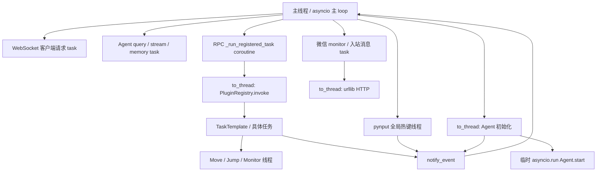
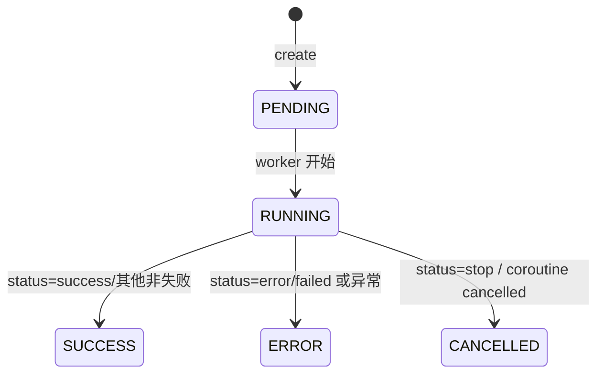

# 并发模型、错误恢复与风险

> 对应版本：Whimbox `2.5.4`
>
> 上位文档：[项目架构梳理](../项目架构梳理.md)

## 1. 分析范围

本文从跨模块角度分析：

- asyncio 主事件循环；
- 工作线程、监听线程和控制线程；
- 资源锁和对象锁；
- Session、Task、Agent 三套运行状态；
- 协作式停止和清理；
- RPC、插件、任务、Agent、微信和视觉层的错误恢复；
- 当前可见的竞态、死锁、状态错位和资源泄漏风险。

主要涉及：

| 模块 | 并发职责 |
| --- | --- |
| [`main.py`](../../../../../reference_repos/whimbox/whimbox/main.py#L48) | 主 loop、Agent 初始化工作线程 |
| [`rpc_server.py`](../../../../../reference_repos/whimbox/whimbox/rpc_server.py#L42) | WebSocket 并发请求、事件广播、任务后台执行 |
| [`task_manager.py`](../../../../../reference_repos/whimbox/whimbox/task_manager.py#L36) | TaskInfo 状态和 stop event |
| [`tool_invocation_coordinator.py`](../../../../../reference_repos/whimbox/whimbox/tool_invocation_coordinator.py#L26) | 跨入口资源互斥 |
| [`task/task_template.py`](../../../../../reference_repos/whimbox/whimbox/task/task_template.py#L60) | 父子任务、重试、停止和 finally |
| [`common/cvars.py`](../../../../../reference_repos/whimbox/whimbox/common/cvars.py#L18) | ContextVar 运行上下文和全局前台标志 |
| [`common/base_threading.py`](../../../../../reference_repos/whimbox/whimbox/common/base_threading.py#L17) | 游戏控制辅助线程框架 |
| [`agent.py`](../../../../../reference_repos/whimbox/whimbox/agent.py#L20) | Agent session task、stop event、记忆后台任务 |
| [`channel_gateway.py`](../../../../../reference_repos/whimbox/whimbox/channel_gateway.py#L55) | 通道 busy/stop 判断 |
| [`weixin_service.py`](../../../../../reference_repos/whimbox/whimbox/weixin_service.py#L69) | monitor、HTTP 工作线程和消息 task |
| [`interaction/interaction_core.py`](../../../../../reference_repos/whimbox/whimbox/interaction/interaction_core.py#L28) | 输入操作锁和全局交互对象 |

## 2. 核心结论

1. 主线程运行 WebSocket RPC、Agent 对话、微信 monitor 和大多数 asyncio task。
2. 长时间同步任务通过 `asyncio.to_thread()` 进入线程池；游戏移动、跳跃、热键和通知还会创建独立线程。
3. 所有含屏幕/输入权限的插件工具通过全局 `game_runtime` 资源锁串行化。
4. 停止主要依赖 `threading.Event` 和循环主动检查，不是抢占式取消。
5. 项目存在 Runtime Session、TaskInfo 和 Agent 三套状态，彼此关联但并非统一状态机。
6. 资源锁避免了大部分键鼠冲突，但不能自动保护全局 Agent session、聊天文件、配置和所有后台线程。
7. 当前最需要专项验证的是多 session Agent 并发、同 session 多任务状态、工具热重载和停止延迟。

## 3. 运行时并发拓扑



## 4. 主 asyncio 事件循环

[`start_rpc_server()`](../../../../../reference_repos/whimbox/whimbox/rpc_server.py#L952) 在主线程取得当前 loop，保存到全局 `_loop`，然后：

1. 绑定 EventBus notifier；
2. 创建微信自动恢复 task；
3. 启动 pynput 热键监听线程；
4. 启动 WebSocket server；
5. `await asyncio.Future()` 永久等待。

主 loop 同时承载：

- WebSocket 接收和发送；
- `_dispatch()` RPC 方法；
- Agent `query_agent()` 和 `astream_events()`；
- Agent 记忆压缩 task；
- 微信 monitor 和入站消息处理；
- 直接任务的状态 coroutine；
- 事件广播。

任何未移出主 loop 的同步阻塞调用都会影响所有这些功能。

## 5. WebSocket 请求并发

[`_ws_handler()`](../../../../../reference_repos/whimbox/whimbox/rpc_server.py#L924) 对每条消息执行：

```python
task = asyncio.create_task(_process_and_reply(message))
```

因此：

- 同一客户端的多条请求可以并发执行；
- 不同客户端天然并发；
- 连接关闭时，尚未完成的请求 task 会被 cancel 并 gather；
- 请求没有全局顺序保证。

### 5.1 发送串行化

每个 WebSocket 客户端有独立 `asyncio.Lock`：

```text
_client_send_locks[websocket]
```

RPC response 和 notification 发送时都使用该锁，避免同一连接上的多个 coroutine 同时调用 `send()`。

### 5.2 广播

[`_broadcast()`](../../../../../reference_repos/whimbox/whimbox/rpc_server.py#L42) 顺序遍历所有 `_clients`：

- 单个 client 发送失败会加入 stale；
- 遍历结束后移除 stale client；
- 广播给所有连接，没有服务端 session 订阅过滤。

一个响应较慢但未报错的客户端可能延迟同一次广播到后续客户端。

这里还直接迭代全局 `_clients`，循环内的 `await client.send()` 会让出主 loop。若另一个 `_ws_handler` 此时建立或关闭连接并修改同一 set，迭代器可抛出 `RuntimeError: Set changed size during iteration`，使本次 fire-and-forget 广播中止。应遍历连接快照，或用连接表锁/单独广播队列管理变更。[`_broadcast()`](../../../../../reference_repos/whimbox/whimbox/rpc_server.py#L42)

### 5.3 接入与权限边界

服务只绑定 `127.0.0.1:8350`，但 [`websockets.serve()`](../../../../../reference_repos/whimbox/whimbox/rpc_server.py#L952) 没有 token、Origin allowlist 或客户端身份校验；[`_ws_handler()`](../../../../../reference_repos/whimbox/whimbox/rpc_server.py#L924) 接受连接后即开放完整分派器。因而本机其他进程以及可连接回环地址的跨站浏览器页面都能调用任务、Agent、配置和微信方法。

该暴露面还包括凭据读取：`config.get` 原样返回配置对象，[`_get_config_value()`](../../../../../reference_repos/whimbox/whimbox/rpc_method_groups.py#L289) 不会对 `Agent.api_key` 脱敏。回环监听不是认证边界；应增加启动时随机 bearer token、Origin/客户端身份校验，或改用带操作系统 ACL 的本地 IPC。

## 6. 跨线程事件通知

[`_notify()`](../../../../../reference_repos/whimbox/whimbox/rpc_server.py#L63) 是线程到主 loop 的桥：

```text
同一 asyncio loop
→ asyncio.create_task(_broadcast)

其他线程 / 没有 running loop
→ asyncio.run_coroutine_threadsafe(_broadcast, _loop)
```

调用来源包括：

- 任务线程中的 `TaskTemplate.log_to_gui()`；
- Agent 初始化线程中的状态事件；
- pynput 热键线程；
- 主 loop 中的 Agent、微信和 RPC 状态。

### 6.1 全局关联状态

RPC 还维护：

- `_agent_stopping_sessions`；
- `_task_stopping_run_ids`；
- `_agent_active_tool_call_ids`；
- `_agent_pending_tool_call_ids`。

[`notify_event()`](../../../../../reference_repos/whimbox/whimbox/rpc_server.py#L82) 可能在任务工作线程中调用 `_resolve_agent_tool_call_id()`，而 Agent status callback 在主 loop 中绑定和完成同一批字典/deque。当前这些结构没有线程锁，存在跨线程竞态窗口。

## 7. Agent 初始化线程

[`main._run_whimbox_services()`](../../../../../reference_repos/whimbox/whimbox/main.py#L48) 创建 `_start_agent_background` task，内部：

```text
asyncio.to_thread(_run_agent_start)
→ 工作线程
→ asyncio.run(whimbox_agent.start())
→ Agent 初始化完成
→ 临时 loop 关闭，线程调用返回
```

后续 `query_agent()` 不是在该线程中运行，而是由 RPC 或 Channel Gateway 在主 loop 中执行。

这形成一个特殊边界：

- 模型和 LangChain agent 对象在初始化线程创建；
- 后续异步模型流在主 loop 使用这些对象。

如果 provider client 在构造时绑定事件循环，需要专项验证。

## 8. 直接任务的线程模型

前端 `task.run` 调用 [`_start_registered_task()`](../../../../../reference_repos/whimbox/whimbox/rpc_server.py#L511)：

1. 创建 `TaskInfo(PENDING)`；
2. Runtime Session 设为 `RUNNING`；
3. 创建 `_run_registered_task()` asyncio task；
4. 立即向前端返回 `task_id`。

执行 coroutine 随后通过 [`asyncio.to_thread()`](../../../../../reference_repos/whimbox/whimbox/rpc_server.py#L360) 运行同步的：

```text
PluginRegistry.invoke
→ 插件 handler
→ TaskAdapter.run
→ TaskTemplate.task_run
```

这使长时间游戏自动化不阻塞主 loop。

### 8.1 asyncio task 与工作线程不是同一生命周期

取消一个正在等待 `asyncio.to_thread()` 的 coroutine，不会强制终止底层 Python 线程。RPC 的 `task.stop` 没有 cancel coroutine，只设置 stop event，因此正常路径依赖 worker 主动退出。

如果其他代码直接 cancel `_run_registered_task`：

- coroutine 可能进入 `CancelledError` 分支并把状态标为 CANCELLED；
- 底层线程仍可能继续控制游戏，直到任务自己观察到 stop 或自然结束。

## 9. ToolInvocationCoordinator

[`ToolInvocationCoordinator`](../../../../../reference_repos/whimbox/whimbox/tool_invocation_coordinator.py#L26) 维护：

```text
resource_group → _ResourceSlot
```

每个 slot 包含：

- `threading.Condition`；
- `active`；
- `owner`。

### 9.1 获取锁

[`acquire_sync()`](../../../../../reference_repos/whimbox/whimbox/tool_invocation_coordinator.py#L39)：

```text
while slot.active:
    skip_if_busy → busy
    stop_event set → stopped
    第一次等待 → on_wait()
    condition.wait(0.1s)

stop_event set → stopped
slot.active = True
slot.owner = owner
```

### 9.2 释放

[`release()`](../../../../../reference_repos/whimbox/whimbox/tool_invocation_coordinator.py#L67)：

- slot 未 active：静默返回；
- owner 不匹配：静默返回；
- 匹配时清 active/owner 并 `notify_all()`。

### 9.3 资源组

插件注册表根据权限：

- `screen` 或 `input` → `game_runtime`；
- 其他插件工具 → `default`。

Workspace 文件工具使用 `workspace_fs`；截图分析使用 `game_runtime`。

### 9.4 特性和限制

- 没有显式 FIFO 公平队列；被唤醒线程竞争 slot；
- 不是可重入锁；同 owner 再次获取同 resource group 仍会等待；
- owner 不匹配释放不会报错，错误调用可能留下永久 active slot；
- `default` 会把所有非屏幕插件工具串行化，粒度可能过大；
- 只协调经过该 Coordinator 的操作，直接访问全局 `itt` 的后台线程不自动纳入锁。

## 10. TaskManager 状态

[`TaskInfo`](../../../../../reference_repos/whimbox/whimbox/task_manager.py#L9) 保存：

```text
task_id / session_id / tool_id
state
created_at / started_at / finished_at
error / result
stop_event
asyncio_task
```

[`TaskManager`](../../../../../reference_repos/whimbox/whimbox/task_manager.py#L36) 使用 `threading.Lock` 保护 `_tasks`。

### 10.1 状态图



`set_state()` 在：

- `RUNNING` 设置 `started_at`；
- `SUCCESS/ERROR/CANCELLED` 设置 `finished_at`。

TaskInfo 不会自动过期或清理，长时间运行进程中 `_tasks` 会持续增长。

`TaskManager.stop()` 也不校验当前 state。RPC 对已经 `SUCCESS/ERROR/CANCELLED` 的历史任务仍会返回成功并广播新的 `stopping`；由于任务不会再次进入 finally，`_task_stopping_run_ids` 中该 ID 也不会被正常清理。相比之下，`stop_all()` 和按 session 停止会筛选 `PENDING/RUNNING`。[`task_manager.py`](../../../../../reference_repos/whimbox/whimbox/task_manager.py#L79)

## 11. ContextVar 运行上下文

[`common/cvars.py`](../../../../../reference_repos/whimbox/whimbox/common/cvars.py#L18) 定义：

- `current_stop_flag`；
- `current_session_id`；
- `current_run_id`。

[`TaskAdapter.run()`](../../../../../reference_repos/whimbox/whimbox/task_adapter.py#L9) 在任务工作线程中设置这三项。

具体任务创建子任务时，`TaskTemplate.__init__()` 读取 `current_stop_flag`：

- 无 event：创建顶层 event；
- 已有 event：标记为子任务并复用。

这实现了父子任务链统一停止。

`asyncio.to_thread()` 会复制调用点的 context，但这里关键值由 TaskAdapter 在 worker 内主动设置。子任务通常同步运行在同一 worker context。

## 12. TaskTemplate 停止和重试

[`TaskTemplate.task_run()`](../../../../../reference_repos/whimbox/whimbox/task/task_template.py#L177)：

1. 顶层任务设置全局前台运行标志；
2. 执行 `_task_run()`；
3. `success/stop/failed` 直接返回；
4. 普通 `error` 且未停止时自动完整重试一次；
5. finally 停止键盘 listener、清全局标志和 `current_stop_flag`。

但 listener 已在 [`TaskTemplate.__init__()`](../../../../../reference_repos/whimbox/whimbox/task/task_template.py#L93) 启动，而 `TaskAdapter` 要等子类构造完全成功后才调用 `task_run()`。如果子类在基类构造后的路线、宏版本或资源校验中抛错，就永远到不了上述 finally，listener 及其绑定任务实例会残留。listener 的启动应移入 `task_run()` 的 `try/finally` 作用域。

[`need_stop()`](../../../../../reference_repos/whimbox/whimbox/task/task_template.py#L291) 检查共享 event，并把结果更新为 `stop`。

停止响应依赖每个循环或等待函数主动调用 `need_stop()`。没有统一机制中断：

- 长时间 `time.sleep()`；
- OCR/模板匹配；
- Win32 调用；
- 第三方库阻塞；
- 未检查 stop 的业务循环。

## 13. 全局前台标志和热键

[`set_foreground_task_running()`](../../../../../reference_repos/whimbox/whimbox/common/cvars.py#L63) 用一个全局 bool 和 `threading.Lock` 表示是否有前台任务。

这是布尔标志，不是引用计数。如果意外并发两个顶层任务：

- 两者都设置 true；
- 任一个先结束就设置 false；
- 另一个仍运行时全局状态已经错误。

[`_start_overlay_hotkey_listener()`](../../../../../reference_repos/whimbox/whimbox/rpc_server.py#L289) 创建 daemon pynput thread。按停止键时：

1. 200ms 去抖；
2. 如果 `has_foreground_task()`，停止所有 Agent 和 TaskManager 工作；
3. 无论是否停止任务，都广播 `event.overlay.show`。

## 14. 游戏控制辅助线程

[`BaseThreading`](../../../../../reference_repos/whimbox/whimbox/common/base_threading.py#L17) 是旧式游戏控制线程框架，被移动、跳跃和自动跑图监控使用。

### 14.1 标志

- `pause_threading_flag`；
- `stop_threading_flag`；
- `working_flag`；
- `stop_func_list`；
- `sub_threading_list`；
- `last_err_code`。

### 14.2 运行循环

[`run()`](../../../../../reference_repos/whimbox/whimbox/common/base_threading.py#L197)：

```text
sleep(while_sleep)
→ stop: return
→ pause: sleep(1) 并继续
→ 检查 stop_func
→ loop()
```

`stop_threading()` 只设置 flag 并停止子线程，不自动 `join()`。

### 14.3 强制终止模式

`THREAD_PAUSE_FORCE_TERMINATE` 通过在线程内部抛出 `ThreadTerminated` 结束当前线程，不是从外部异步注入异常。

### 14.4 子线程

`_add_sub_threading()`：

- 将子线程设为 daemon；
- 把父线程 `checkup_stop_func` 加入子线程 stop callback；
- 启动并保存引用。

`_clean_sub_threading()` 只调用 `stop_threading()` 并清列表，没有等待所有子线程实际退出。

### 14.5 AdvanceThreading

[`blocking_startup()`](../../../../../reference_repos/whimbox/whimbox/common/base_threading.py#L239) 不创建新线程，而是在当前线程循环调用另一个对象的 `loop()`，用于避免线程数量继续增长。

### 14.6 ThreadBlockingRequest

这是两个 bool 实现的轮询握手。`waiting_until_reply(timeout=10)` 实际使用硬编码 `10`，忽略传入的 `timeout` 参数。

### 14.7 ProcessThreading

`ProcessThreading` 几乎复制了线程 API，但 pause/stop 等字段是普通 Python 内存，不是 multiprocessing 共享对象。从父进程修改这些字段通常不会传播到已启动子进程。当前源码未见核心路径依赖它，应视为遗留实现并在使用前重构验证。

## 15. 细粒度锁清单

| 锁/同步原语 | 文件 | 保护对象 |
| --- | --- | --- |
| `threading.Condition` | `tool_invocation_coordinator.py` | 每个资源组的 active owner |
| `threading.Lock` | `task_manager.py` | TaskInfo 字典 |
| `threading.Lock` | `session_manager.py` | Runtime Session 字典 |
| `threading.Lock` | `common/cvars.py` | 全局前台 bool |
| `asyncio.Lock` | `rpc_server.py` | 单 WebSocket 发送 |
| `asyncio.Lock` | `weixin_service.py` | 登录/monitor 状态 |
| `asyncio.Lock` | `weixin_service.py` reply handle | 单条微信消息的回复顺序 |
| `asyncio.Lock` | `agent.py` | 单 session 记忆压缩 |
| `threading.Lock` | `interaction_core.py` | 鼠标移动/滚轮操作片段 |
| `threading.Lock` | `interaction/capture.py` | 截图缓存 |
| `threading.Lock` | OCR 实现 | OCR 引擎调用 |
| `threading.Lock` | `map/map.py` | 仅在 `Map.__init__()` 声明，当前没有 acquire/with/release，实际不保护地图状态 |
| `threading.Lock` | `ui/ui.py` | 页面切换；手工释放与 `locked()` 兜底存在误释放其他线程所持锁的竞态 |
| `threading.Lock` | `record_path_task.py` | 路线录制数据 |

锁是局部保护，不等于整个对象线程安全。尤其 `Agent`、ChatSession、配置和部分 RPC 全局映射仍无完整同步。

## 16. Agent 并发和停止

每轮 Agent 查询保存：

- `_session_stop_events[session_id]`；
- `_session_stream_tasks[session_id]`；
- `_tool_running_sessions`；
- `_current_tool_by_session`。

### 16.1 同 session 重入

第二次同 session `query_agent()` 会覆盖前一轮的 stop event 和 stream task 映射。前一轮 finally 又可能删除后一轮刚写入的映射。

Channel Gateway 的 busy 检查只覆盖工具执行期，无法彻底阻止模型思考期重入；WebSocket `agent.send_message` 也没有统一 session lock。

### 16.2 多 session 竞态

`Agent._active_session_id` 是单个共享字段，而插件工具 wrapper 执行时才读取它。两个 session 并发模型调用可能让工具取得错误 session 和 stop event。

### 16.3 记忆任务

记忆压缩按 session 使用 `asyncio.Lock`，能避免同 session 两个压缩同时写文件，但不能阻止主查询同时向同一个 ChatSession 增加消息或保存 JSONL。

此外，[`MemoryStore`](../../../../../reference_repos/whimbox/whimbox/agent_workspace/memory.py#L12) 的 `MEMORY.md/HISTORY.md` 是 workspace 全局共享文件。不同 session 使用不同锁，因而可以并发读取相同旧 MEMORY、各自生成更新并覆盖写入，形成最后写者覆盖；HISTORY 的 append 也没有 workspace 级串行化。

## 17. 微信并发

微信 monitor 为每条消息创建独立 task。当前：

- 没有 per-sender queue；
- 所有联系人默认复用同一个 default session；
- busy 检查和 Agent 开始不是原子操作；
- 每条消息的 reply lock 不覆盖其他消息；
- stop_monitor 不处理 `_active_inbound_tasks`；
- 长轮询工作线程无法被 event 立即中断。

详见 [微信通道与远程控制](11-微信通道与远程控制.md)。

## 18. 配置并发

`global_config` 是无锁单例：

- 任务和 UI 逻辑频繁读取；
- RPC 可以修改并保存；
- Keybind 更新还会修改全局 keybind 对象。

如果前端在任务运行中更新关键配置，读取方可能在同一业务流程中看到新旧混合值。JSON 文件保存也没有临时文件/原子替换。

## 19. 错误分类

### 19.1 RPC 错误

[`_handle_message()`](../../../../../reference_repos/whimbox/whimbox/rpc_server.py#L886) 映射：

| JSON-RPC code | 条件 |
| --- | --- |
| `-32700` | JSON 解析失败 |
| `-32600` | 非对象、版本错误、无 method |
| `-32602` | params 非对象或业务 `ValueError` |
| `-32601` | `NotImplementedError` |
| `-32603` | 未分类内部异常 |

notification 没有 response，异常只记 warning。

### 19.2 TaskResult 业务状态

[`task/task_template.py`](../../../../../reference_repos/whimbox/whimbox/task/task_template.py#L13)：

| 状态 | 含义 | 自动重试 |
| --- | --- | --- |
| `success` | 成功 | 否 |
| `error` | 异常型失败 | 顶层任务一次 |
| `stop` | 手动停止 | 否 |
| `failed` | 业务失败 | 否 |

RPC 把 `error` 和 `failed` 都转换为 TaskManager `ERROR`。

### 19.3 TaskTemplate 异常

`_task_run()` 捕获所有 `Exception`：

1. 调用 `handle_exception()`；
2. stop flag 已设置：结果为 stop；
3. 否则结果为 error，记录 traceback；
4. finally 调用 `handle_finally()`。

默认 `handle_finally()` 会回到主界面。如果这个恢复动作本身抛异常，它发生在原异常处理的 finally 中，可能覆盖原始错误。

### 19.4 插件加载异常

loader 只捕获 `PluginLoadError` 和 `ToolRegistryError`。JSON 解析错误、普通 ImportError、SyntaxError 或 entry 模块执行异常可能直接中断整个插件初始化和服务启动。

### 19.5 Agent 错误

- 初始化错误转为 `status=error`；
- stream 异常回调 error 后重新抛出；
- 图片分析异常转换为结构化 error；
- 记忆压缩异常只 warning，不影响用户请求。

### 19.6 微信错误

- monitor 顶层异常转为 `monitor_state=error`；
- 登录超时有显式 wait 处理；
- 入站处理异常由 Gateway 转为微信错误文本；
- 单个入站 task 的未处理异常仅由 task 完成回调从集合移除，没有统一读取 exception 的日志回调。

## 20. 恢复机制

| 场景 | 当前恢复方式 |
| --- | --- |
| 普通任务异常 | 顶层自动完整重试一次 |
| 任务 finally | 默认回游戏主界面 |
| 自动跑图卡住 | 5 秒跳跃脱困，持续卡住后抛错 |
| UI 导航失败 | 回主界面后有限次数重试 |
| 游戏焦点丢失 | 操作前强制前置窗口 |
| Agent 初始化失败 | 保存错误状态，前端可重新配置后重启/重载 |
| 记忆压缩失败 | warning，后续轮次再次尝试 |
| 微信 token 过期 | monitor error，要求重新扫码 |
| 微信程序重启 | 从 auth 和游标自动恢复 monitor |
| WebSocket 客户端断开 | cancel 该连接未完成请求，移除 client |

## 21. 高优先级风险

### P0/P1：可能导致错误游戏操作

1. **本地 RPC 控制面无鉴权**：本机进程或跨站浏览器页面可执行游戏任务、修改配置并读取 `Agent.api_key`。
2. **Agent `_active_session_id` 共享竞态**：多 session 工具可能绑定错 session。
3. **同 session Agent 重入**：stop/task 映射和聊天消息可能互相覆盖。
4. **直接取消 to_thread coroutine 不终止工作线程**：前端状态结束后游戏操作仍可能继续。
5. **后台直接使用 `itt` 绕过 game_runtime 锁**：可能与前台任务同时输入。
6. **全局前台运行 bool 非引用计数**：并发顶层任务状态可能提前变 false。

### P1/P2：状态和结果错误

1. 同 session 可以启动多个直接任务；任一任务 finally 都会把 Runtime Session 设为 IDLE，即使另一任务仍运行或等待资源锁。
2. `TaskInfo` 永不清理，长时间运行内存持续增长。
3. Agent thinking 阶段不算 busy，第二条消息可并发进入。
4. ChatSession JSONL、cache 和 messages 没有统一锁。
5. RPC agent tool-call 关联字典跨线程访问无锁。
6. 工具热重载未重建 LangChain agent graph。
7. 不同 session 的长期记忆压缩可并发覆盖 workspace 全局 `MEMORY.md`。
8. 广播期间连接表发生变化可中止 fire-and-forget 事件投递。
9. 已结束的历史任务仍可被 RPC 广播为 `stopping`，造成终态回退和去重 ID 滞留。
10. `UI.goto_page()` 先手工释放再抛错/递归，except 仅凭 `locked()` 再释放；并发调用时可能释放另一线程刚取得的导航锁。[`ui.py`](../../../../../reference_repos/whimbox/whimbox/ui/ui.py#L61) [`ui.py`](../../../../../reference_repos/whimbox/whimbox/ui/ui.py#L187)

### P2：延迟和可维护性

1. 协作停止受 sleep、OCR、HTTP 和系统调用延迟影响。
2. Coordinator 无公平队列，长任务和高频任务可能造成饥饿。
3. `default` 资源组粒度过粗。
4. BaseThreading 和 ProcessThreading 大量重复、flag 轮询和遗留 API。
5. 配置保存、聊天保存、微信凭据保存均缺少原子替换。
6. 后台自动钓鱼只调用顶层 `FishingTask.step2()`，每次触发都会遗留未 stop/join 的 pynput listener。
7. 顶层子类在基类构造后校验失败时，也会遗留已启动的 pynput listener。

## 22. 建议的并发收敛方向

### 22.1 SessionRunController

为每个 session 建立统一控制器，集中管理：

- Agent thinking/generating/tool；
- 直接 TaskInfo；
- stop event；
- run/tool_call ID；
- busy 状态；
- session 级 asyncio lock/queue。

避免三套状态分别维护。

### 22.2 ContextVar 取代共享 active session

工具调用上下文应在每个 Agent run 内绑定，避免使用 `Agent._active_session_id` 单字段。

### 22.3 显式任务队列

按资源组和 session 建立可观察的 FIFO 队列，提供：

- queued/running/cancelling 状态；
- 公平性；
- 排队取消；
- 统一超时；
- 前端可查询队列。

### 22.4 停止分层

明确区分：

- 请求停止；
- 已观察停止；
- 正在清理；
- 已完全停止。

只有 worker 真正退出并释放输入状态后，才向前端发送最终 cancelled。

### 22.5 原子持久化

配置、聊天 Session、微信 auth/runtime 可采用：

```text
写临时文件 → flush/fsync → os.replace
```

并为同一资源设置锁。

## 23. 验证矩阵

| 测试 | 预期验证点 |
| --- | --- |
| 两个 session 同时 Agent 聊天 | 工具 session、stop event、聊天历史不串线 |
| 同 session 连续发送两条消息 | 第二条排队或明确 busy |
| 同 session 启动两个 task.run | Session 状态直到全部结束才 IDLE |
| task 等待 game_runtime 时停止 | 排队任务快速返回 stop |
| task 执行长 sleep 时停止 | 量化停止延迟 |
| cancel `_run_registered_task` | 底层线程是否继续操作 |
| Agent 工具运行时按全局热键 | Agent、Task、输入线程均停止并清理 |
| 后台任务与前台任务同时启用 | 是否存在绕过资源锁的输入冲突 |
| 插件 reload 后调用新增工具 | LangChain graph 是否更新 |
| 记忆压缩与下一轮同时发生 | JSONL、MEMORY、HISTORY 一致性 |
| WebSocket 多客户端并发 | response/notification 无交错损坏 |
| 慢客户端接收广播 | 是否拖慢其他客户端 |
| 微信长轮询中 stop/disconnect | 实际停止时间和入站 task 生命周期 |

## 24. 调试入口

推荐断点：

1. [`main._run_whimbox_services()`](../../../../../reference_repos/whimbox/whimbox/main.py#L48)；
2. [`rpc_server._ws_handler()`](../../../../../reference_repos/whimbox/whimbox/rpc_server.py#L924)；
3. [`rpc_server._notify()`](../../../../../reference_repos/whimbox/whimbox/rpc_server.py#L63)；
4. [`rpc_server._run_registered_task()`](../../../../../reference_repos/whimbox/whimbox/rpc_server.py#L326)；
5. [`ToolInvocationCoordinator.acquire_sync()`](../../../../../reference_repos/whimbox/whimbox/tool_invocation_coordinator.py#L39)；
6. [`TaskManager.set_state()`](../../../../../reference_repos/whimbox/whimbox/task_manager.py#L53)；
7. [`TaskTemplate.task_run()`](../../../../../reference_repos/whimbox/whimbox/task/task_template.py#L177)；
8. [`TaskTemplate.need_stop()`](../../../../../reference_repos/whimbox/whimbox/task/task_template.py#L291)；
9. [`Agent.query_agent()`](../../../../../reference_repos/whimbox/whimbox/agent.py#L168)；
10. [`ChannelGateway.handle_inbound_message()`](../../../../../reference_repos/whimbox/whimbox/channel_gateway.py#L158)；
11. [`BaseThreading.run()`](../../../../../reference_repos/whimbox/whimbox/common/base_threading.py#L197)。

日志分析时至少关联：

- `session_id`；
- `run_id`；
- `task_id`；
- `tool_call_id`；
- `source=agent/task`；
- 当前线程名和时间。

## 25. 关联文档

- [RPC、会话、事件与通道](02-RPC会话事件与通道.md)
- [插件与工具系统](03-插件与工具系统.md)
- [任务框架、调度与停止](04-任务框架调度与停止.md)
- [平台抽象与交互核心](07-平台抽象与交互核心.md)
- [Agent 上下文、记忆与 Skills](10-Agent上下文记忆与Skills.md)
- [微信通道与远程控制](11-微信通道与远程控制.md)
- [开发调试与验证指南](13-开发调试与验证指南.md)
