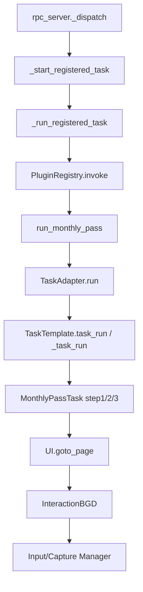

# 开发调试与验证指南

> 对应版本：Whimbox `2.5.4`
>
> 上位文档：[项目架构梳理](../项目架构梳理.md)

## 1. 目标

本文给出在 PyCharm 和终端中分析 Whimbox 的可重复方法，重点解决：

- 正确选择解释器和工作目录；
- 区分静态分析、无游戏集成和真实游戏调试；
- 沿一条纵向调用链设置断点；
- 使用 RPC、日志、截图和 CV 工具观察状态；
- 避免导入副作用、无限循环和误操作；
- 为后续修改建立分层验证清单。

## 2. 本地环境基线

### 2.1 Python 版本

[`pyproject.toml`](../../../../../reference_repos/whimbox/pyproject.toml#L11) 要求：

```text
Python == 3.12.8
```

当前工作区已有未跟踪的本地运行时：

```text
Python312/python.exe
```

已确认其版本为 Python 3.12.8。在本机终端可检查：

```powershell
.\Python312\python.exe --version
```

`Python312/` 不属于 Git 仓库，不应加入提交。

### 2.2 主要依赖

依赖定义在 [`pyproject.toml`](../../../../../reference_repos/whimbox/pyproject.toml#L22)，核心类别：

| 类别 | 依赖 |
| --- | --- |
| Agent | LangChain、LangGraph、各模型 provider |
| 日志 | Loguru |
| OCR/推理 | RapidOCR、ONNX Runtime |
| 数值/图像 | NumPy、SciPy、OpenCV 间接依赖 |
| 输入监听 | pynput |
| Windows | pywin32、win10toast 等 requirements 内容 |
| macOS | mss、PyObjC Cocoa/Quartz |

仓库同时保留 `requirements.txt` 和 `pyproject.toml`。分析依赖差异时应检查构建和开发环境分别使用哪一个入口。

### 2.3 系统权限

正常入口的 [`_prepare()`](../../../../../reference_repos/whimbox/whimbox/main.py#L24) 会：

1. 启用 DPI awareness；
2. 调用平台 `is_admin()`；
3. 权限不足时退出。

Windows 动态调试时通常需要以管理员权限启动 PyCharm 或终端。macOS 则依赖相应辅助功能/屏幕录制权限。

### 2.4 游戏显示条件

当前视觉资产以 16:9 为主要基准，坐标和 anchor 逻辑围绕 1920×1080 参考系适配。真实游戏调试前应确认：

- 游戏窗口可被查找到；
- 未最小化；
- 16:9 或 16:10 的受支持分辨率；
- UI 缩放和游戏版本与资产匹配；
- 键位与 Whimbox 配置一致。

## 3. PyCharm 配置

### 3.1 Interpreter

选择：

```text
D:\Games\nikkigallery\Whimbox\Whimbox\Python312\python.exe
```

如果改用虚拟环境，也必须基于 Python 3.12.8，并安装项目依赖。

### 3.2 Working directory

必须设置为：

```text
D:\Games\nikkigallery\Whimbox\Whimbox
```

原因见 [`common/path_lib.py`](../../../../../reference_repos/whimbox/whimbox/common/path_lib.py#L10)：

```python
CONFIG_PATH = os.path.join(os.getcwd(), "configs")
LOG_PATH = os.path.join(os.getcwd(), "logs")
SCRIPT_PATH = os.path.join(os.getcwd(), "scripts")
```

Working directory 错误会产生另一套配置、日志、Agent workspace 和脚本目录，导致“设置明明改了但程序没读取”等问题。

### 3.3 运行配置

正常后端：

```text
Module / Script: whimbox.main 或 whimbox/main.py
Parameters:      空
Working dir:     仓库根目录
Interpreter:     Python 3.12.8
```

一条龙旁路：

```text
Parameters: startOneDragon
```

旁路不会启动插件系统、Agent 和 RPC，只适合专门调试 `AllInOneTask`。

### 3.4 Attach 和子线程

直接任务在 `asyncio.to_thread()` 的线程池线程中运行；移动和跳跃还会启动额外线程。PyCharm 调试器需启用对多线程断点的支持，且不要设置只暂停当前线程而让其他输入线程继续操作游戏。

## 4. 导入副作用

静态阅读和动态导入的行为不同。以下模块导入会产生副作用。

### 4.1 配置

[`global_config = GlobalConfig()`](../../../../../reference_repos/whimbox/whimbox/config/config.py#L225) 在导入时：

- 创建 `configs/`；
- 首次复制默认配置；
- 迁移配置；
- 删除不再属于默认模式的项；
- 重写 `config.json`。

### 4.2 日志

[`common/logger.py`](../../../../../reference_repos/whimbox/whimbox/common/logger.py#L25) 在导入时删除 `logs/` 中超过 7 天且以 `whimbox-` 开头的日志，再配置 Loguru sink。

### 4.3 全局窗口和交互对象

导入 [`interaction/interaction_core.py`](../../../../../reference_repos/whimbox/whimbox/interaction/interaction_core.py#L477) 会创建全局 `itt`，其依赖全局游戏窗口 handler。

其他全局对象包括：

- `ui_control`；
- `nikki_map`；
- `global_config`；
- `whimbox_agent`；
- `weixin_service`。

### 4.4 开发脚本

部分 `dev_tool` 是交互式脚本，不适合作为普通模块导入。例如 [`dev_tool/snapshot.py`](../../../../../reference_repos/whimbox/whimbox/dev_tool/snapshot.py#L1) 顶层就会：

- `os.startfile()` 打开目录；
- 进入无限输入/截图循环。

运行开发工具前应先检查是否有 `if __name__ == "__main__"` 保护。

## 5. 开发模式和日志

### 5.1 开发模式条件

[`IS_DEV_MODE`](../../../../../reference_repos/whimbox/whimbox/common/path_lib.py#L12) 由当前工作目录是否存在 `dev_mode` 文件决定。

`DEBUG_MODE` 和 `CV_DEBUG_MODE` 还要求配置：

```text
General.debug = true
General.cv_debug = true
```

也就是说：

```text
dev_mode 文件存在 AND 对应配置开启
```

才会真正启用调试输出。

### 5.2 日志文件

[`common/logger.py`](../../../../../reference_repos/whimbox/whimbox/common/logger.py#L36) 写入：

```text
logs/whimbox-YYYY-MM-DD.log
```

特点：

- 最低级别 TRACE；
- `backtrace=True`；
- `enqueue=True`，支持多线程日志队列；
- DEBUG_MODE 时额外输出到 stdout；
- 自动清理 7 天前日志。

### 5.3 建议的关联字段

分析一次完整运行时，优先记录：

- `session_id`；
- `run_id`；
- `task_id`；
- `tool_call_id`；
- `tool_id`；
- `source=task/agent`；
- `phase`；
- 当前 Task step；
- 线程名和时间。

## 6. 分层分析策略

建议把验证分成四层。

### 6.1 纯静态层

不导入业务模块，只做：

- `rg` 搜索符号和调用；
- 阅读 manifest、配置和数据文件；
- `git diff --check`；
- Python 语法编译；
- Markdown 链接校验。

适合没有游戏、没有管理员权限的场景。

### 6.2 纯逻辑层

优先测试没有窗口依赖的函数：

- JSON Schema → Pydantic 类型；
- `ToolInvocationCoordinator`；
- Runtime/Chat Session 序列化；
- 消息 block 转换；
- Skills frontmatter 描述解析；
- 路线和宏数据结构解析；
- 坐标和角度纯函数；
- 配置值类型转换。

注意：从包路径导入纯函数也可能经由其他 import 触发全局对象，应先检查 import 链。

### 6.3 无游戏集成层

可验证：

- WebSocket `health`；
- `plugin.list`；
- session 创建、查询和关闭；
- 配置和脚本 RPC；
- Agent 缺少 API key 的状态；
- 使用测试模型或 mock provider 的 Agent 文本流；
- 微信状态和登录错误路径。

插件加载 `game_nikki/main.py` 会导入很多游戏模块，因此即使不执行任务，也可能触发窗口、配置和资产相关初始化。

### 6.4 真实游戏层

按风险从低到高：

1. 只截图；
2. 识别当前页面；
3. OCR 指定区域；
4. 模板匹配但不点击；
5. 页面跳转；
6. 小型领取任务；
7. 单动作任务；
8. 自动跑图；
9. 一条龙和多账号。

每提高一层，都应先确认停止热键、日志和截图可用。

## 7. 第一条纵向断点链

推荐使用 `nikki.monthly_pass`。



断点：

1. [`rpc_server._dispatch()`](../../../../../reference_repos/whimbox/whimbox/rpc_server.py#L582)；
2. [`rpc_server._start_registered_task()`](../../../../../reference_repos/whimbox/whimbox/rpc_server.py#L511)；
3. [`rpc_server._run_registered_task()`](../../../../../reference_repos/whimbox/whimbox/rpc_server.py#L326)；
4. [`PluginRegistry.invoke()`](../../../../../reference_repos/whimbox/whimbox/plugins/registry.py#L84)；
5. [`game_nikki.run_monthly_pass()`](../../../../../reference_repos/whimbox/whimbox/plugins/game_nikki/main.py#L298)；
6. [`TaskAdapter.run()`](../../../../../reference_repos/whimbox/whimbox/task_adapter.py#L9)；
7. [`TaskTemplate.task_run()`](../../../../../reference_repos/whimbox/whimbox/task/task_template.py#L177)；
8. [`TaskTemplate._task_run()`](../../../../../reference_repos/whimbox/whimbox/task/task_template.py#L209)；
9. [`MonthlyPassTask`](../../../../../reference_repos/whimbox/whimbox/task/daily_task/monthly_pass_task.py#L8)；
10. [`UI.goto_page()`](../../../../../reference_repos/whimbox/whimbox/ui/ui.py#L61)；
11. [`InteractionBGD.get_img_existence()`](../../../../../reference_repos/whimbox/whimbox/interaction/interaction_core.py#L134)；
12. [`InteractionNormal.key_press()`](../../../../../reference_repos/whimbox/whimbox/interaction/interaction_normal.py#L70)。

建议观察：

- `session_id/run_id/task_id`；
- `resource_group/owner`；
- `current_stop_flag`；
- `step_order/current_step`；
- 模板阈值和相似度；
- 当前页面识别结果；
- TaskResult 到 RPC 状态的映射。

## 8. Agent 断点链

```text
rpc_server agent.send_message
→ Agent.query_agent
→ ContextBuilder.build_messages
→ langchain_agent.astream_events
→ plugin StructuredTool
→ PluginRegistry.invoke
→ 与直接任务路径汇合
```

断点：

1. [`Agent.start()`](../../../../../reference_repos/whimbox/whimbox/agent.py#L72)；
2. [`Agent._rebuild_tools()`](../../../../../reference_repos/whimbox/whimbox/agent.py#L329)；
3. [`ContextBuilder.build_system_prompt()`](../../../../../reference_repos/whimbox/whimbox/agent_workspace/context.py#L21)；
4. [`ContextBuilder.build_messages()`](../../../../../reference_repos/whimbox/whimbox/agent_workspace/context.py#L42)；
5. [`Agent.query_agent()`](../../../../../reference_repos/whimbox/whimbox/agent.py#L168)；
6. `on_chat_model_stream` 和 `on_tool_start` 分支；
7. [`plugin_tools._tool_func`](../../../../../reference_repos/whimbox/whimbox/plugin_tools.py#L64)；
8. [`MemoryStore.consolidate()`](../../../../../reference_repos/whimbox/whimbox/agent_workspace/memory.py#L28)。

分别测试纯聊天、一次工具调用、多轮工具调用、停止和图片分析。

## 9. RPC 手工检查

服务地址：

```text
ws://127.0.0.1:8350
```

### 9.1 健康检查

```json
{
  "jsonrpc": "2.0",
  "id": 1,
  "method": "health",
  "params": {}
}
```

预期：

```json
{
  "jsonrpc": "2.0",
  "id": 1,
  "result": {"status": "ok"}
}
```

### 9.2 插件列表

```json
{
  "jsonrpc": "2.0",
  "id": 2,
  "method": "plugin.list",
  "params": {}
}
```

应确认：

- `game_nikki` 加载无 error；
- 工具数量和 manifest 一致；
- plugin runtime version 符合当前进程加载次数。

### 9.3 Session

```json
{
  "jsonrpc": "2.0",
  "id": 3,
  "method": "session.create",
  "params": {"name": "debug", "profile": "default"}
}
```

取得 `session_id` 后再调用 `task.run`。

### 9.4 运行任务

```json
{
  "jsonrpc": "2.0",
  "id": 4,
  "method": "task.run",
  "params": {
    "session_id": "<session-id>",
    "tool_id": "nikki.monthly_pass",
    "input": {}
  }
}
```

response 只返回 `task_id`，最终结果通过 `event.run.status` 和 `event.run.log` notification 观察。

## 10. 截图和 CV 调试

### 10.1 截图缓存

Agent 实时截图保存到：

```text
logs/screenshot/
```

正常启动会清理上一次运行的该目录内容。

### 10.2 模板相似度

可在 [`InteractionBGD.get_img_existence()`](../../../../../reference_repos/whimbox/whimbox/interaction/interaction_core.py#L134) 观察：

- `cap`；
- HSV/灰度处理结果；
- `imgicon.image`；
- `matching_rate`；
- `threshold`；
- `ret_mode`。

先使用 `IMG_RATE` 只看相似度，再启用点击，避免资产不匹配时误操作。

### 10.3 OCR

关注：

- 裁剪区域和 anchor；
- padding；
- HSV 范围；
- 单行/多行模式；
- OCR 引擎锁；
- 游戏语言和字体变化。

### 10.4 OpenCV 调试窗口

`CV_DEBUG_MODE` 会在部分地图和视觉代码中调用 `cv2.imshow()`。调试器暂停时窗口消息循环可能冻结，需要配合 `cv2.waitKey()`，并避免在无桌面环境启用。

## 11. 开发工具

| 工具 | 用途 | 注意事项 |
| --- | --- | --- |
| [`dev_tool/asset_index_generator.py`](../../../../../reference_repos/whimbox/whimbox/dev_tool/asset_index_generator.py#L8) | 重新生成 `imgs_index.json` | 同名不同扩展/目录会覆盖索引项 |
| [`dev_tool/assest_tools.py`](../../../../../reference_repos/whimbox/whimbox/dev_tool/assest_tools.py#L6) | 重抓特征资产 | 文件名存在历史拼写 `assest` |
| [`dev_tool/hsv_tool.py`](../../../../../reference_repos/whimbox/whimbox/dev_tool/hsv_tool.py#L8) | 调 HSV 阈值 | 多个 main 分支，用前先看启用条件 |
| [`dev_tool/gray_threshold_tool.py`](../../../../../reference_repos/whimbox/whimbox/dev_tool/gray_threshold_tool.py#L7) | 调灰度阈值 | 交互式 OpenCV 窗口 |
| [`dev_tool/map_assets_gen.py`](../../../../../reference_repos/whimbox/whimbox/dev_tool/map_assets_gen.py#L8) | 生成缩放地图、箭头旋转资产 | 会写大体积图片资产 |
| [`dev_tool/snapshot.py`](../../../../../reference_repos/whimbox/whimbox/dev_tool/snapshot.py#L1) | 人工按 Enter 截图 | 顶层无限循环且依赖仓库外 tools 目录 |
| [`task/test_task.py`](../../../../../reference_repos/whimbox/whimbox/task/test_task.py#L7) | 手工任务/模板相似度实验 | 不是自动化单元测试，main 中有无限循环 |

开发工具可能修改资产或无限运行，执行前应检查输入输出路径和 main guard。

## 12. 测试现状

当前仓库未见：

- 独立 `tests/` 目录；
- pytest/unittest 测试集合；
- 覆盖率配置；
- mock 游戏窗口的测试基础设施。

`whimbox/task/test_task.py` 是人工实验任务，不是自动断言测试。

因此当前验证主要依赖：

1. 静态检查；
2. 纯逻辑临时测试；
3. RPC 集成；
4. 日志和截图；
5. 实际游戏回归。

## 13. 建议优先补充的测试

### 13.1 纯单元测试

- JSON Schema 类型转换；
- Tool registry 注册冲突和权限资源组；
- Coordinator wait/busy/stop/release；
- TaskTemplate 步骤顺序、跳转、重试和父子 stop；
- Runtime Session 状态；
- ChatSession JSONL round-trip；
- 消息 block 和图片缩放；
- Skills frontmatter；
- Memory JSON 解析；
- 路线/宏序列化；
- 地图坐标转换、角度和距离纯函数。

### 13.2 集成测试

- WebSocket JSON-RPC 正常和错误码；
- 多客户端 response/notification；
- task.run 状态序列；
- 排队任务停止；
- Agent fake model 的文本和工具事件；
- plugin reload；
- 微信 API 使用本地 HTTP stub；
- 配置迁移使用临时目录。

### 13.3 视觉回归

建立固定截图数据集：

- 页面识别；
- 按钮模板相似度；
- OCR 文本；
- 小地图定位；
- 方向/视角检测；
- 不同分辨率和 UI 缩放。

视觉测试应输出相似度、坐标误差和失败截图，而不只断言布尔值。

## 14. 语法和静态验证

不导入模块的语法检查：

```powershell
.\Python312\python.exe -m compileall -q whimbox
```

查看工作区：

```powershell
git status --short --branch
git diff --check
```

搜索待处理代码：

```powershell
rg -n "TODO|FIXME|pass$|except Exception" whimbox
```

这些检查不会替代游戏集成测试，但能低成本发现语法、空白和异常吞噬问题。

## 15. 打包

[`build.bat`](../../../../../reference_repos/whimbox/build.bat#L1) 会：

1. 删除旧 `output/`、`build/`、`dist/` 和 `*.egg-info`；
2. 执行 `python -m build --wheel`；
3. 把产物移动到 `output/`；
4. 等待用户按键。

这是会删除构建目录的交互式脚本，不适合作为日常只读验证命令或无确认 CI 命令。

构建后至少检查：

- wheel 版本为 2.5.4；
- `whimbox.assets` 包含 JSON、YAML、Markdown 和图片；
- `whimbox.plugins` 包含 plugin JSON；
- Agent workspace 模板完整；
- 排除的原始大地图符合 `pyproject.toml`；
- 在干净 Python 3.12.8 环境安装并运行 health/plugin.list。

## 16. 修改后的分层验证清单

### 配置或路径修改

- 新旧 config 迁移；
- Working directory；
- 默认值和用户值；
- keybind 刷新；
- 原子保存和失败恢复。

### 插件或工具修改

- manifest 与 `TOOL_FUNCS` 一一对应；
- Schema 参数校验；
- Agent 工具列表；
- task.run；
- 权限和资源组；
- reload 后真实可调用。

### 任务修改

- 步骤注册顺序；
- success/error/failed/stop；
- 自动重试；
- 子任务 stop 传播；
- finally 输入释放和回主界面；
- RPC 最终状态。

### UI/资产修改

- 索引路径；
- 懒加载；
- anchor 和裁剪区域；
- 多截图相似度；
- 页面图正反向边；
- BFS 可达性；
- 失败重试。

### 地图/跑图修改

- 坐标系转换；
- 局部搜索窗口；
- 定位置信度；
- 速度异常过滤；
- 视角角度；
- 卡住恢复；
- 传送后重定位；
- 控制线程清理。

### Agent 修改

- 多 provider 启动；
- system prompt；
- 多 session；
- 工具事件；
- stop；
- JSONL；
- memory consolidation；
- Skills；
- 图片分析。

### 并发修改

- 同 session 重入；
- 多 session；
- 多 task.run；
- 排队停止；
- 热键停止；
- 慢客户端；
- 微信并发；
- 线程退出和资源释放。

## 17. 调试安全建议

- 首次执行点击逻辑前，先改为只返回识别率或在断点处阻止输入；
- 保持停止热键可用；
- 不在账号、支付、商城或抽卡界面调试通用点击；
- 项目已有 `_can_interact()` 防商城/抽卡误操作，但不能视为完整安全边界；
- 自动跑图断点暂停前先释放移动键或停止控制线程；
- 不在任务运行中修改关键键位、分辨率或 launcher 路径；
- 微信远程调试时确认只有受信联系人能访问；
- 不提交 `configs/`、日志、截图、微信 token 和 Agent memory；
- 运行会修改资产的 dev tool 前先确认 Git 状态和目标路径。

## 18. 文档维护约定

- 总览保留在 [`docs/项目架构梳理.md`](../项目架构梳理.md)；
- 专题分析统一放在 `docs/analysis/`；
- 协议规范继续放在 `docs/protocol/`；
- 源码链接使用仓库相对路径并尽量带行号；
- 代码重构后同步更新职责表、调用链和风险结论；
- 新专题先加入 [`docs/analysis/README.md`](README.md) 索引；
- 推测性结论必须标记为“待验证”，不要写成既定事实。

## 19. 关联文档

- [启动、配置与运行时](01-启动配置与运行时.md)
- [RPC、会话、事件与通道](02-RPC会话事件与通道.md)
- [任务框架、调度与停止](04-任务框架调度与停止.md)
- [UI 视觉识别与页面导航](08-UI视觉识别与页面导航.md)
- [地图定位与自动跑图](09-地图定位与自动跑图.md)
- [Agent 上下文、记忆与 Skills](10-Agent上下文记忆与Skills.md)
- [并发模型、错误恢复与风险](12-并发模型错误恢复与风险.md)
