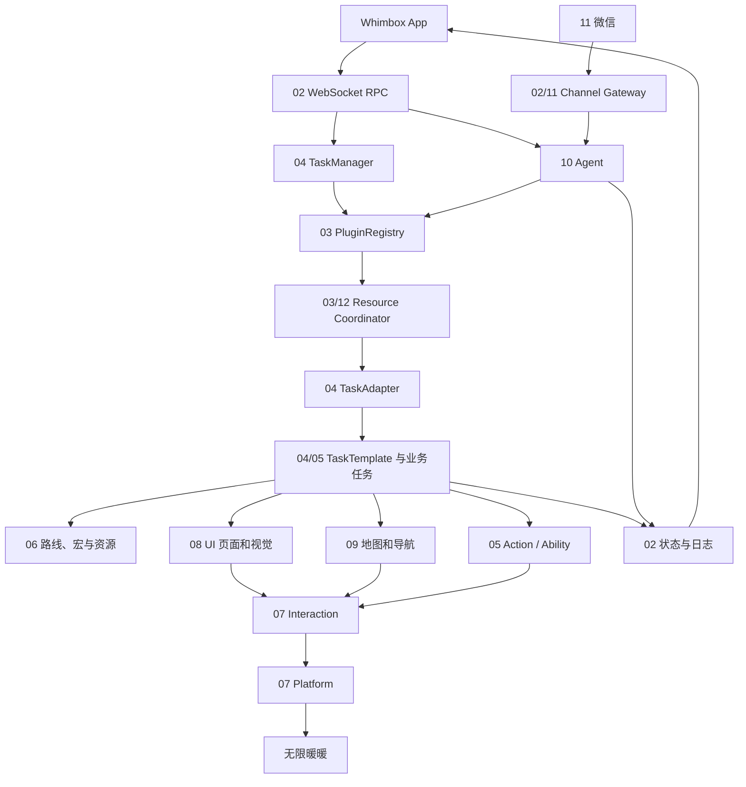

# Whimbox 2.5.4 源码分析索引

> 本目录是 [`项目架构梳理.md`](../项目架构梳理.md) 的专题展开。
>
> 分析基线：`2.5.4`，提交 `a10fa3059f7a47cd26ba65a562184c8735562320`。

## 1. 文档目标

这套文档用于回答四类问题：

1. 一个请求如何从前端或微信进入后端并最终操作游戏；
2. 每个源码模块、核心类、函数、状态和数据结构承担什么职责；
3. 视觉识别、页面导航、地图定位、自动跑图和 Agent 的具体原理；
4. 修改代码时应从哪里下手、如何调试、验证哪些并发和错误边界。

总览文档提供全局心智模型；本目录按模块和功能拆分，并在每篇中保留源码相对链接、调用链、调试入口、风险和待验证项。

## 2. 专题文档

| 编号 | 文档 | 主要覆盖 |
| --- | --- | --- |
| 01 | [启动、配置与运行时](01-启动配置与运行时.md) | 包入口、启动时序、路径、配置迁移、日志和全局对象 |
| 02 | [RPC、会话、事件与通道](02-RPC会话事件与通道.md) | WebSocket JSON-RPC、方法分派、Runtime Session、事件广播和通道边界 |
| 03 | [插件与工具系统](03-插件与工具系统.md) | 插件 manifest、动态加载、Registry、资源锁、Agent 工具适配和扩展方式 |
| 04 | [任务框架、调度与停止](04-任务框架调度与停止.md) | TaskManager、TaskAdapter、TaskTemplate、步骤状态机、重试、父子任务和停止 |
| 05 | [业务任务、动作与能力](05-业务任务动作与能力.md) | task 全族、AllInOne、后台任务、action、ability 和代表业务链 |
| 06 | [脚本、宏与资源管理](06-脚本宏与资源管理.md) | 路线/宏模型、发现查询、录制运行、资产索引和配置资源 |
| 07 | [平台抽象与交互核心](07-平台抽象与交互核心.md) | core 接口、Windows/macOS、窗口、截图、输入、分辨率和全局交互对象 |
| 08 | [UI 视觉识别与页面导航](08-UI视觉识别与页面导航.md) | 资产自动映射、Anchor、模板匹配、OCR、页面图和 BFS 导航 |
| 09 | [地图定位与自动跑图](09-地图定位与自动跑图.md) | 坐标系、地图资产、小/大地图定位、传送、视角移动闭环和卡住恢复 |
| 10 | [Agent 上下文、记忆与 Skills](10-Agent上下文记忆与Skills.md) | 模型初始化、LangChain 事件流、消息、workspace、JSONL、长期记忆和 Skills |
| 11 | [微信通道与远程控制](11-微信通道与远程控制.md) | 扫码登录、凭据、长轮询、Channel Gateway、回复、busy 和停止 |
| 12 | [并发模型、错误恢复与风险](12-并发模型错误恢复与风险.md) | asyncio/线程拓扑、锁、状态、取消、错误映射、竞态和验证矩阵 |
| 13 | [开发调试与验证指南](13-开发调试与验证指南.md) | PyCharm、断点、RPC、日志、CV 工具、测试现状、打包和修改检查单 |
| 14 | [公共工具与基础设施](14-公共工具与基础设施.md) | Keybind、通知、Timer、通用 JSON/数值函数、异常和包导出 |

## 3. 推荐阅读路线

### 3.1 第一次理解项目

```text
项目架构梳理
→ 01 启动配置
→ 02 RPC会话事件
→ 03 插件工具
→ 04 任务框架
→ 07 平台交互
→ 08 UI视觉
```

读完后应能完整解释：

```text
task.run
→ PluginRegistry
→ TaskAdapter
→ TaskTemplate
→ UI/Interaction
→ Platform
→ 游戏
```

### 3.2 开发新业务任务

```text
03 插件工具
→ 04 任务框架
→ 05 业务任务动作能力
→ 06 脚本宏资源
→ 08 UI视觉
→ 13 调试验证
```

### 3.3 分析 Agent

```text
02 RPC会话事件
→ 03 插件工具
→ 10 Agent上下文记忆Skills
→ 11 微信通道
→ 12 并发风险
```

### 3.4 分析自动跑图

```text
07 平台交互
→ 08 UI视觉
→ 09 地图自动跑图
→ 05 业务动作能力
→ 12 并发风险
```

### 3.5 排查稳定性问题

```text
12 并发错误恢复
→ 对应业务专题
→ 13 调试验证
```

## 4. 全局调用图



## 5. 源码目录覆盖

| 源码区域 | 主文档 | 辅助文档 |
| --- | --- | --- |
| `whimbox/main.py` | 01 | 12、13 |
| `whimbox/config/` | 01 | 02、12、13 |
| `whimbox/common/path_lib.py`、`logger.py` | 01 | 06、13 |
| `whimbox/rpc_server.py`、`rpc_method_groups.py` | 02 | 04、11、12、13 |
| `whimbox/session_manager.py`、`event_bus.py`、`channel_gateway.py` | 02 | 10、11、12 |
| `whimbox/plugin_runtime.py`、`plugin_tools.py`、`plugins/` | 03 | 04、05、10、12 |
| `whimbox/tool_invocation_coordinator.py` | 03 | 04、10、12 |
| `whimbox/task_manager.py`、`task_adapter.py`、`task/task_template.py` | 04 | 05、12、13 |
| `whimbox/task/` 具体业务任务 | 05 | 04、06、09 |
| `whimbox/action/`、`ability/` | 05 | 08、09 |
| `whimbox/common/scripts_manager.py`、宏/路线任务 | 06 | 05、09 |
| `whimbox/assets/`、`dev_tool/` | 06 | 08、09、10、13 |
| `whimbox/core/`、`platform/` | 07 | 08、09、13 |
| `whimbox/common/handle_lib.py`、`windows_dpi.py` | 07 | 01 |
| `whimbox/interaction/`、`api/` | 07 | 08、09 |
| `whimbox/ui/`、图像/坐标/UI utils | 08 | 05、07、09 |
| `whimbox/map/`、`view_and_move/` | 09 | 05、07、08 |
| `whimbox/agent.py`、`agent_workspace/` | 10 | 03、11、12 |
| `whimbox/weixin_service.py` | 11 | 02、10、12 |
| `whimbox/common/base_threading.py`、跨模块锁与停止 | 12 | 04、07、09 |
| `build.bat`、开发运行和测试策略 | 13 | 01、06 |
| `whimbox/common/keybind.py`、`notification.py`、`timer_module.py`、`utils.py`、`errors.py` | 14 | 01、04、08、12、13 |
| 各 package `__init__.py` | 14 | 对应领域专题 |

## 6. 三条关键纵向链

### 6.1 前端直接任务

```text
session.create
→ task.run
→ TaskManager.create
→ asyncio.to_thread(PluginRegistry.invoke)
→ game_nikki handler
→ TaskAdapter.run
→ TaskTemplate.task_run
→ 具体 UI/动作/导航逻辑
→ event.run.status / event.run.log
```

### 6.2 Agent 工具

```text
agent.send_message
→ Agent.query_agent
→ ContextBuilder
→ LangChain astream_events
→ StructuredTool
→ PluginRegistry.invoke
→ 与直接任务路径汇合
```

### 6.3 视觉控制闭环

```text
平台窗口截图
→ Anchor 区域裁剪
→ 模板匹配 / OCR / 地图定位
→ 任务状态判断
→ 键鼠输入
→ 再次截图验证
```

## 7. 术语

| 术语 | 含义 |
| --- | --- |
| Runtime Session | 前端/RPC 运行状态，不等于聊天 Session |
| Chat Session | Agent JSONL 对话历史 |
| TaskInfo | `task.run` 创建的外层后台任务记录 |
| TaskTemplate | 游戏业务步骤状态机 |
| ToolSpec | 插件注册表中的工具元数据和 handler |
| tool call | Agent 选择并执行一次 LangChain 工具 |
| resource group | 工具互斥组，例如 `game_runtime` |
| `itt` | 全局 `InteractionBGD` 实例 |
| UI page graph | 以页面为节点、按钮/快捷键为边的有向图 |
| route/path | 自动跑图使用的路线脚本和路径点 |
| macro | 录制的键鼠时序脚本 |
| workspace | `configs/agent_workspace` 下的 Agent 文件环境 |

## 8. 风险标记说明

文档中的风险分为：

- **源码已确认**：可以直接从当前控制流或数据结构证明；
- **待运行验证**：源码显示存在风险窗口，但需要真实 provider、平台或游戏环境复现；
- **设计限制**：当前行为明确，但是否需要修改取决于产品需求。

建议优先阅读 [并发模型、错误恢复与风险](12-并发模型错误恢复与风险.md) 中的验证矩阵，不要把待验证项直接当成已发生故障。

## 9. 文档维护规则

1. 后续分析 Markdown 继续放在 `docs/analysis/`；
2. 新文档先加入本索引，再添加与相关专题的交叉链接；
3. 协议契约放在 `docs/protocol/`，不要复制协议正文到分析文档；
4. 源码链接使用相对路径，专题文档到源码通常以 `../../` 开头；
5. 引用具体实现时尽量带 `#L` 行号；
6. 版本升级后先更新本文基线提交，再检查所有行号；
7. 代码重构时同步更新调用图、状态图、覆盖矩阵和风险结论；
8. 对运行环境、第三方 provider 或游戏行为的推断必须标记“待验证”。

## 10. 验证状态

文档集完成后统一执行：

- Markdown 相对链接目标检查；
- 源码 `#L` 行号范围检查；
- 文档交叉链接检查；
- `git diff --check`；
- 源码目录覆盖盘点；
- Mermaid fence 和 Markdown fence 配对检查；
- 工作区状态确认。

具体验证方法见 [开发调试与验证指南](13-开发调试与验证指南.md)。
