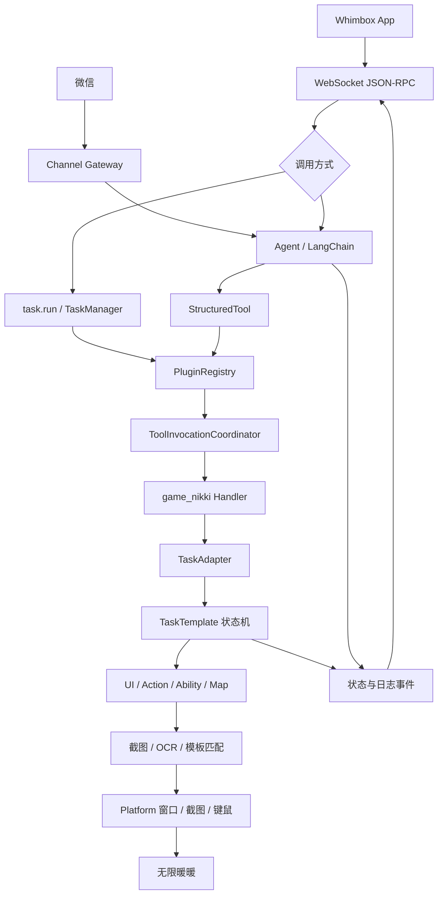

# Whimbox 2.5.4 项目架构梳理

> 本文基于 `2.5.4`（提交 `a10fa3059f7a47cd26ba65a562184c8735562320`）整理。
>
> 文档约定：专题分析统一放在 [`docs/analysis/`](analysis/README.md)，协议类文档继续放在 `docs/protocol/`。

## 1. 项目定位

Whimbox 是一个没有内置桌面 UI 的游戏自动化后端，主要负责：

- WebSocket JSON-RPC 服务；
- 大模型 Agent 和工具调用；
- 游戏任务编排；
- 截图、OCR、模板匹配和地图定位；
- 鼠标、键盘及窗口控制；
- 向 Whimbox App 和微信通道推送状态与日志。

前端界面位于独立的 `whimbox_app` 项目。本仓库中不包含桌面端 GUI。

理解项目时应先抓住一个核心判断：

> LLM 负责理解意图和选择工具，真正执行游戏操作的是确定性的任务状态机、图像识别和键鼠控制逻辑。

## 2. 总体架构



可以把代码分成六层：

1. **入口与控制层**：`main.py`、`rpc_server.py`、`channel_gateway.py`；
2. **插件与工具层**：`plugin_runtime.py`、`plugins/`、`plugin_tools.py`；
3. **任务编排层**：`task_manager.py`、`task_adapter.py`、`task/`；
4. **游戏领域层**：`ui/`、`action/`、`ability/`、`map/`、`view_and_move/`；
5. **感知与执行层**：`interaction/`、`api/`、`platform/`；
6. **Agent 上下文层**：`agent.py`、`agent_workspace/`。

## 3. 当前目录职责

```text
whimbox/
├── main.py                    # 进程入口
├── rpc_server.py              # WebSocket JSON-RPC、任务启动、事件广播
├── rpc_method_groups.py       # 配置、脚本、后台功能、微信等 RPC 方法组
├── session_manager.py         # RPC 运行时会话
├── task_manager.py            # 前端 task.run 创建的后台任务
├── task_adapter.py            # 插件 handler 到 TaskTemplate 的适配层
├── plugin_runtime.py          # 插件运行时和全局注册表
├── plugin_tools.py            # 插件 Schema 到 LangChain 工具的适配
├── tool_invocation_coordinator.py # 游戏资源互斥
├── agent.py                   # LLM Agent 单例
├── channel_gateway.py         # 微信等文本通道的统一入口
├── event_bus.py               # 进程内事件桥
├── plugins/                   # 插件声明、加载器、注册表、游戏插件
├── task/                      # 具体任务和任务模板
├── agent_workspace/           # Agent 上下文、会话、记忆、Skills
├── ui/                        # 游戏页面图、UI 特征和页面识别
├── interaction/               # 截图、OCR、图像匹配和输入封装
├── platform/                  # Windows/macOS 平台实现
├── core/                      # 平台抽象接口
├── map/                       # 地图定位、传送和坐标转换
├── view_and_move/             # 视角和移动控制
├── action/                    # 采集、钓鱼、捕虫等动作任务
├── ability/                   # 能力轮盘和能力切换
├── config/                    # 配置加载和迁移
├── common/                    # 日志、路径、线程、通用工具
├── api/                       # OCR 等第三方能力适配
└── assets/                    # 图片、地图、配置模板、Agent 模板
```

仓库根目录的 `README.md` 仍保留较早的目录说明，没有完整列出新版的 `core/`、`platform/`、`plugins/` 等模块。分析时以当前代码为准。

## 4. 启动流程

包命令入口定义在 [`pyproject.toml`](../../../../reference_repos/whimbox/pyproject.toml#L48)：

```toml
[project.scripts]
whimbox = "whimbox.main:main"
```

正常服务启动链：

```text
main()
→ run_whimbox()
→ _prepare()
→ init_plugins()
→ 后台启动 whimbox_agent.start()
→ start_rpc_server()
```

关键位置：

- [`main.py`](../../../../reference_repos/whimbox/whimbox/main.py#L24)：DPI、权限、版本和临时文件准备；
- [`main.py`](../../../../reference_repos/whimbox/whimbox/main.py#L38)：正常服务入口；
- [`main.py`](../../../../reference_repos/whimbox/whimbox/main.py#L48)：先加载插件，再并行启动 Agent 和 RPC；
- [`rpc_server.py`](../../../../reference_repos/whimbox/whimbox/rpc_server.py#L952)：启动 WebSocket 服务；
- [`common/cvars.py`](../../../../reference_repos/whimbox/whimbox/common/cvars.py#L13)：RPC 地址为 `127.0.0.1:8350`。

`startOneDragon` 是一条旁路：

```text
main("startOneDragon")
→ run_one_dragon()
→ AllInOneTask.task_run()
```

它不会启动插件系统、Agent 或 RPC，分析主服务架构时应与正常入口区分开。

## 5. 配置和运行目录

路径定义在 [`common/path_lib.py`](../../../../reference_repos/whimbox/whimbox/common/path_lib.py#L10)：

- `assets/`、`plugins/` 相对于 Python 包目录；
- `configs/`、`logs/`、`scripts/` 相对于当前工作目录 `os.getcwd()`；
- 根目录存在 `dev_mode` 文件时启用开发模式。

因此 PyCharm 的 **Working directory 必须设为仓库根目录**，否则程序会读取或创建另一套 `configs/`、`logs/` 和 `scripts/`。

配置由 [`config/config.py`](../../../../reference_repos/whimbox/whimbox/config/config.py#L10) 中的 `GlobalConfig` 单例管理：

1. 首次运行复制 `assets/default_config.json`；
2. 后续启动补充新增默认项；
3. 迁移部分旧配置值；
4. 删除默认配置模式中已经不存在的项；
5. 加载为内存中的全局配置。

`global_config` 在模块导入时创建，因此导入相关模块就可能触发配置目录创建或配置迁移。

## 6. 两条调用路径和一个汇合点

项目有两条主要任务入口。

### 6.1 前端直接任务

```text
RPC task.run
→ _start_registered_task()
→ TaskManager.create()
→ asyncio.create_task()
→ _run_registered_task()
→ asyncio.to_thread(PluginRegistry.invoke)
→ 插件 handler
→ TaskAdapter.run()
→ 具体任务
```

关键代码：

- [`rpc_server.py`](../../../../reference_repos/whimbox/whimbox/rpc_server.py#L824)：`task.run` 分派；
- [`rpc_server.py`](../../../../reference_repos/whimbox/whimbox/rpc_server.py#L511)：创建任务并立即返回 `task_id`；
- [`rpc_server.py`](../../../../reference_repos/whimbox/whimbox/rpc_server.py#L326)：后台执行与状态转换；
- [`task_manager.py`](../../../../reference_repos/whimbox/whimbox/task_manager.py#L36)：保存任务状态、结果和停止事件。

这条路径拥有明确的：

- `task_id`；
- `PENDING / RUNNING / SUCCESS / ERROR / CANCELLED` 状态；
- Runtime Session 的 `IDLE / RUNNING` 状态；
- RPC 状态与日志事件。

### 6.2 Agent 工具调用

```text
RPC agent.send_message 或微信消息
→ Agent.query_agent()
→ LangChain astream_events()
→ StructuredTool
→ PluginRegistry.invoke()
→ 插件 handler
→ TaskAdapter.run()
→ 具体任务
```

关键代码：

- [`rpc_server.py`](../../../../reference_repos/whimbox/whimbox/rpc_server.py#L586)：Agent 消息入口；
- [`agent.py`](../../../../reference_repos/whimbox/whimbox/agent.py#L168)：构造上下文并运行 Agent；
- [`plugin_tools.py`](../../../../reference_repos/whimbox/whimbox/plugin_tools.py#L46)：将插件工具包装为 `StructuredTool`；
- [`plugin_tools.py`](../../../../reference_repos/whimbox/whimbox/plugin_tools.py#L63)：最终调用插件注册表。

Agent 工具路径不会调用 `TaskManager.create()`。它使用 Agent 内部的 session stop event、当前工具集合和 `tool_call_id` 跟踪执行。

### 6.3 汇合点

两条路径最终都进入：

```text
PluginRegistry.invoke()
→ ToolInvocationCoordinator
→ game_nikki handler
→ TaskAdapter
→ TaskTemplate
```

这也是理解项目最重要的主干。

## 7. 插件和工具系统

### 7.1 插件声明

[`plugins/game_nikki/plugin.json`](../../../../reference_repos/whimbox/whimbox/plugins/game_nikki/plugin.json#L1) 描述：

- 插件 ID、版本和入口；
- `screen`、`input` 权限；
- 21 个游戏工具；
- 每个工具的名称、说明；
- JSON Schema 输入和输出格式。

例如：

```json
{
  "id": "nikki.monthly_pass",
  "name": "临取奇迹之旅（大月卡）奖励",
  "input_schema": {"type": "object", "properties": {}}
}
```

### 7.2 插件装载

```text
plugin_runtime.init_plugins()
→ plugins.loader.load_plugins()
→ 读取 plugin.json
→ importlib 动态加载 entry 模块
→ 将 manifest.tools 与 TOOL_FUNCS 按 tool_id 配对
→ PluginRegistry.register()
```

相关文件：

- [`plugin_runtime.py`](../../../../reference_repos/whimbox/whimbox/plugin_runtime.py#L15)；
- [`plugins/loader.py`](../../../../reference_repos/whimbox/whimbox/plugins/loader.py#L38)；
- [`plugins/registry.py`](../../../../reference_repos/whimbox/whimbox/plugins/registry.py#L24)；
- [`plugins/game_nikki/main.py`](../../../../reference_repos/whimbox/whimbox/plugins/game_nikki/main.py#L322)。

新增任务的完整接线通常是：

```text
TaskTemplate 子类
→ game_nikki handler
→ TOOL_FUNCS 映射
→ plugin.json 工具声明
```

### 7.3 资源互斥

[`plugins/registry.py`](../../../../reference_repos/whimbox/whimbox/plugins/registry.py#L84) 会根据权限选择资源组：

- 含 `screen` 或 `input`：`game_runtime`；
- 其他工具：`default`。

[`tool_invocation_coordinator.py`](../../../../reference_repos/whimbox/whimbox/tool_invocation_coordinator.py#L26) 保证每个资源组同时只有一个 owner。这样可以避免不同 session 或不同入口同时点击、移动和截图。

当前 `permissions` 的主要作用是资源分组，并不是插件沙箱或安全权限系统。插件代码仍在主进程中执行。

## 8. 任务状态机

任务基类是 [`task/task_template.py`](../../../../reference_repos/whimbox/whimbox/task/task_template.py#L60)。

### 8.1 步骤注册

`@register_step` 会给方法打标记并记录注册顺序：

```python
@register_step("打开奇迹之旅")
def step1(self):
    ...
```

初始化时，`TaskTemplate` 扫描继承链：

- 子类覆盖的方法优先；
- 带 `_register_step` 标记的方法会加入 `steps_dict`；
- 按装饰器注册顺序构建 `step_order`。

### 8.2 执行规则

[`TaskTemplate._task_run()`](../../../../reference_repos/whimbox/whimbox/task/task_template.py#L209) 的规则是：

- 步骤没有返回值：执行下一个注册步骤；
- 返回步骤名：跳到指定步骤；
- 返回 `STEP_NAME_FINISH`：结束；
- 抛出异常：转为 `error`；
- 顶层任务发生普通错误：自动重试一次；
- `failed` 和 `stop`：不自动重试；
- finally 默认尝试回到游戏主界面。

### 8.3 父子任务和停止

停止事件通过 [`common/cvars.py`](../../../../reference_repos/whimbox/whimbox/common/cvars.py#L18) 中的 `ContextVar[threading.Event]` 传播：

- 顶层任务创建或接收 stop event；
- 子任务复用父任务的 event；
- 一条龙、跑图及采集动作可以被同一个停止请求中断。

停止属于协作式取消：

```text
task.stop
→ 设置 threading.Event
→ 锁等待和任务循环检查 Event
→ 任务主动返回 status=stop
→ RPC 标记为 CANCELLED
```

它不会强制杀死工作线程，因此长时间 OCR、系统调用或 `sleep` 可能导致停止有延迟。

## 9. 视觉识别和键鼠控制

全局交互对象 `itt` 定义在 [`interaction/interaction_core.py`](../../../../reference_repos/whimbox/whimbox/interaction/interaction_core.py#L477)。

完整反馈链：

```text
获取游戏窗口
→ 截取窗口图像
→ 按 AnchorPosi 裁剪目标区域
→ OCR / 模板匹配 / HSV 或灰度处理
→ 判断页面、按钮和状态
→ 模拟鼠标或键盘
→ 再次截图验证结果
```

### 9.1 截图

[`InteractionBGD.capture()`](../../../../reference_repos/whimbox/whimbox/interaction/interaction_core.py#L47) 使用 `PrintWindowCapture`，底层再委托给平台 `CaptureManager`。

Windows 实现在 [`platform/windows/capture.py`](../../../../reference_repos/whimbox/whimbox/platform/windows/capture.py#L13)，通过 Win32 `PrintWindow` 获取 BGRA 图像。

### 9.2 OCR

[`interaction_core.py`](../../../../reference_repos/whimbox/whimbox/interaction/interaction_core.py#L82) 提供：

- 单行 OCR；
- 多行 OCR；
- OCR 文本和坐标检测。

OCR 实现由配置选择，目前主路径使用 RapidOCR。

### 9.3 模板匹配

[`InteractionBGD.get_img_existence()`](../../../../reference_repos/whimbox/whimbox/interaction/interaction_core.py#L134) 会：

1. 截取特征对应区域；
2. 按需应用 HSV 或灰度阈值；
3. 调用 OpenCV 相似度比较；
4. 与 `ImgIcon.threshold` 比较；
5. 返回布尔值、相似度或点击坐标。

[`appear_then_click()`](../../../../reference_repos/whimbox/whimbox/interaction/interaction_core.py#L200) 把识别与点击组合起来。

### 9.4 资产自动映射

UI 资产常用这种写法：

```python
IconPageMainFeature = ImgIcon()
AreaBigMapTeleportButton = Area()
```

[`common/utils/asset_utils.py`](../../../../reference_repos/whimbox/whimbox/common/utils/asset_utils.py#L18) 会从调用位置提取变量名，再通过 `assets/imgs/imgs_index.json` 找到同名图片。

[`ui/template/img_manager.py`](../../../../reference_repos/whimbox/whimbox/ui/template/img_manager.py#L9) 采用懒加载：第一次真正访问图片、截图区域或中心坐标时才读取图片并计算边界。

## 10. UI 页面图

页面定义在 [`ui/page_assets.py`](../../../../reference_repos/whimbox/whimbox/ui/page_assets.py#L7)。页面之间通过按钮、文本或快捷键建立有向边：

```python
page_main.link(keybind.ref("KEYBIND_MAP"), page_bigmap)
page_bigmap.link(keybind.ref("KEYBIND_MAP"), page_main)
```

[`UI.goto_page()`](../../../../reference_repos/whimbox/whimbox/ui/ui.py#L61) 的流程：

1. OCR 或图标识别当前页面；
2. 在页面图中使用 BFS 寻找目标路径；
3. 逐步点击按钮或按快捷键；
4. 等待画面稳定；
5. 处理加载画面；
6. 验证是否到达预期页面；
7. 失败时回主界面并重试。

因此 `ui/` 不是普通的页面对象集合，而是一个基于视觉验证的页面导航图。

## 11. 平台抽象

抽象接口位于 [`core/interfaces.py`](../../../../reference_repos/whimbox/whimbox/core/interfaces.py#L14)：

- `WindowManager`：查找窗口、前置、关闭、窗口坐标；
- `CaptureManager`：窗口截图；
- `InputManager`：鼠标和键盘注入；
- `PathManager`：游戏路径、权限和进程名。

[`platform/factory.py`](../../../../reference_repos/whimbox/whimbox/platform/factory.py#L15) 根据 `sys.platform` 返回 Windows 或 macOS 实现，并通过 `lru_cache` 维持单例。

领域层原则上只依赖接口和工厂，不直接处理操作系统差异。

## 12. 地图定位和自动跑图

### 12.1 地图定位

[`map/detection/minimap.py`](../../../../reference_repos/whimbox/whimbox/map/detection/minimap.py#L43) 使用小地图与完整地图进行局部模板匹配：

1. 从游戏截图中截取并处理圆形小地图；
2. 根据上次坐标在完整地图中选取邻近搜索区域；
3. 使用圆形 mask 和 `cv2.matchTemplate`；
4. 计算全局坐标和局部峰值置信度；
5. 根据最大移动速度过滤不合理跳变。

大地图定位位于 [`map/detection/bigmap.py`](../../../../reference_repos/whimbox/whimbox/map/detection/bigmap.py#L24)，通过缩放后的大地图截图与全图资产匹配得到中心坐标。

[`map/map.py`](../../../../reference_repos/whimbox/whimbox/map/map.py#L23) 组合 `MiniMap` 和 `BigMap`，并负责：

- 坐标缓存和异常过滤；
- 大地图拖动；
- 最近传送点选择；
- 区域切换；
- 传送后的坐标重置。

### 12.2 自动跑图

[`task/navigation_task/auto_path_task.py`](../../../../reference_repos/whimbox/whimbox/task/navigation_task/auto_path_task.py#L42) 是复杂度最高的任务之一。

核心闭环：

```text
读取路线点
→ 游戏原生坐标转换为地图图片坐标
→ 小地图定位当前位置
→ 计算到目标点的角度和距离
→ 调整视角
→ 控制前进、跳跃
→ 再次定位
→ 判断是否到达、卡住或意外中断
→ 到达路线点后触发动作子任务
```

关键能力：

- [`step0`](../../../../reference_repos/whimbox/whimbox/task/navigation_task/auto_path_task.py#L178)：启动移动、跳跃和跳过监控线程，初始化能力和地图；
- [`step1`](../../../../reference_repos/whimbox/whimbox/task/navigation_task/auto_path_task.py#L200)：位置、视角、移动和中断检测循环；
- [`inner_step_update_target`](../../../../reference_repos/whimbox/whimbox/task/navigation_task/auto_path_task.py#L276)：目标点推进及动作触发；
- [`inner_step_change_view`](../../../../reference_repos/whimbox/whimbox/task/navigation_task/auto_path_task.py#L526)：计算目标角度并转动视角；
- 卡住 5 秒尝试跳跃脱困，持续 15 秒则抛出异常；
- 在路线点触发采集、钓鱼、捕虫、清洁、宏等子任务；
- finally 中停止并回收控制线程。

## 13. Agent、上下文、记忆和 Skills

Agent 是 [`agent.py`](../../../../reference_repos/whimbox/whimbox/agent.py#L20) 中的单例。

启动流程：

```text
准备 AgentWorkspace
→ 创建 ContextBuilder / MemoryStore / ChatSessionManager
→ 从配置初始化模型
→ 构建插件工具和 workspace 工具
→ LangChain create_agent(model, tools)
```

### 13.1 工具适配

[`plugin_tools.py`](../../../../reference_repos/whimbox/whimbox/plugin_tools.py#L30) 将插件 JSON Schema 动态转换为 Pydantic 参数模型，再包装成 LangChain `StructuredTool`。

模型选择工具后，wrapper 仍然调用同一个 `PluginRegistry.invoke()`。因此 Agent 没有另一套游戏执行实现，只是复用插件和任务系统。

### 13.2 系统上下文

[`agent_workspace/context.py`](../../../../reference_repos/whimbox/whimbox/agent_workspace/context.py#L12) 每轮动态拼接：

1. 内置身份和 workspace 说明；
2. `AGENTS.md`；
3. `SOUL.md`；
4. `USER.md`；
5. `TOOLS.md`；
6. `memory/MEMORY.md`；
7. Skills 摘要；
8. 当前时间、session ID 和上传图片路径。

### 13.3 会话与记忆

- 聊天 session 以 JSONL 保存；
- 每轮加载最近 64 条消息；
- 达到窗口阈值后，后台调用同一 LLM 压缩旧会话；
- 历史摘要追加到 `HISTORY.md`；
- 稳定的长期信息合并到 `MEMORY.md`；
- 保留最近约一半的原始消息。

相关代码：

- [`agent_workspace/session.py`](../../../../reference_repos/whimbox/whimbox/agent_workspace/session.py#L228)；
- [`agent_workspace/memory.py`](../../../../reference_repos/whimbox/whimbox/agent_workspace/memory.py#L12)；
- [`agent.py`](../../../../reference_repos/whimbox/whimbox/agent.py#L350)。

### 13.4 Skills

[`agent_workspace/skills.py`](../../../../reference_repos/whimbox/whimbox/agent_workspace/skills.py#L7) 扫描 `skills/*/SKILL.md`，只把名称、描述和路径放进系统提示词。真正使用某个 Skill 时，模型再调用 workspace 的 `read_file` 工具读取全文。

## 14. 会话、事件和并发

项目存在两个不同的“会话管理器”：

1. [`session_manager.py`](../../../../reference_repos/whimbox/whimbox/session_manager.py#L26)：RPC 运行时 session，记录 `IDLE/RUNNING`、窗口句柄和 metadata；
2. [`agent_workspace/session.py`](../../../../reference_repos/whimbox/whimbox/agent_workspace/session.py#L265)：聊天 session，负责 JSONL 历史。

它们使用同一个 session ID 关联，但职责不同。

事件回流链：

```text
Agent / ChannelGateway emit_event
→ event_bus notifier
→ rpc_server.notify_event
→ 主事件循环
→ 广播给 WebSocket 客户端
```

直接任务的 `TaskTemplate.log_to_gui()` 目前仍直接调用 `rpc_server.notify_event()`，说明事件层尚未完全解耦。

## 15. 代表性纵向链路

第一次阅读建议选择 `nikki.monthly_pass`，它足够小，但覆盖完整架构。

```text
plugin.json: nikki.monthly_pass
→ game_nikki/main.py: run_monthly_pass
→ TaskAdapter.run(MonthlyPassTask)
→ MonthlyPassTask.task_run()
→ TaskTemplate._task_run()
→ step1 打开奇迹之旅
→ step2 识别并领取奖励
→ step3 返回主界面
→ UI.goto_page()
→ InteractionBGD OCR / 模板匹配 / 点击
→ Platform InputManager
```

对应文件：

- [`plugins/game_nikki/plugin.json`](../../../../reference_repos/whimbox/whimbox/plugins/game_nikki/plugin.json#L187)；
- [`plugins/game_nikki/main.py`](../../../../reference_repos/whimbox/whimbox/plugins/game_nikki/main.py#L298)；
- [`task_adapter.py`](../../../../reference_repos/whimbox/whimbox/task_adapter.py#L7)；
- [`task/daily_task/monthly_pass_task.py`](../../../../reference_repos/whimbox/whimbox/task/daily_task/monthly_pass_task.py#L8)；
- [`task/task_template.py`](../../../../reference_repos/whimbox/whimbox/task/task_template.py#L177)；
- [`ui/ui.py`](../../../../reference_repos/whimbox/whimbox/ui/ui.py#L61)；
- [`interaction/interaction_core.py`](../../../../reference_repos/whimbox/whimbox/interaction/interaction_core.py#L134)。

## 16. 推荐阅读顺序

### 第一阶段：启动和边界

1. `pyproject.toml`；
2. `whimbox/main.py`；
3. `whimbox/common/path_lib.py`；
4. `whimbox/config/config.py`；
5. `whimbox/rpc_server.py` 的 `_dispatch()` 和 `start_rpc_server()`。

目标：明确这是后端服务，知道配置、插件、Agent 和 RPC 何时启动。

### 第二阶段：插件主干

1. `plugin_runtime.py`；
2. `plugins/loader.py`；
3. `plugins/registry.py`；
4. `plugins/game_nikki/plugin.json`；
5. `plugins/game_nikki/main.py`。

目标：知道一个工具如何从声明变成可执行 handler。

### 第三阶段：任务生命周期

1. `rpc_server.py:326-538`；
2. `task_manager.py`；
3. `tool_invocation_coordinator.py`；
4. `task_adapter.py`；
5. `task/task_template.py`。

目标：理解任务状态、工作线程、互斥、重试和停止。

### 第四阶段：最小业务闭环

1. `task/daily_task/monthly_pass_task.py`；
2. `ui/page.py`；
3. `ui/page_assets.py`；
4. `ui/ui.py`；
5. `interaction/interaction_core.py`；
6. `ui/template/`；
7. `platform/factory.py` 和 Windows 实现。

目标：从一个小任务看懂截图、识别、页面导航和点击。

### 第五阶段：复杂任务

1. `task/daily_task/all_in_one_task.py`；
2. `map/detection/minimap.py`；
3. `map/map.py`；
4. `view_and_move/`；
5. `task/navigation_task/auto_path_task.py`；
6. `action/` 和 `ability/`。

目标：理解父子任务、地图定位、控制循环和动作组合。

### 第六阶段：Agent

1. `agent.py`；
2. `plugin_tools.py`；
3. `agent_workspace/context.py`；
4. `agent_workspace/session.py`；
5. `agent_workspace/memory.py`；
6. `agent_workspace/skills.py`；
7. `channel_gateway.py`；
8. `weixin_service.py`。

目标：理解自然语言如何复用同一套确定性任务工具。

## 17. PyCharm 断点建议

第一次动态分析可设置以下断点：

1. [`main._run_whimbox_services`](../../../../reference_repos/whimbox/whimbox/main.py#L48)；
2. [`rpc_server._dispatch`](../../../../reference_repos/whimbox/whimbox/rpc_server.py#L582)；
3. [`rpc_server._run_registered_task`](../../../../reference_repos/whimbox/whimbox/rpc_server.py#L326)；
4. [`PluginRegistry.invoke`](../../../../reference_repos/whimbox/whimbox/plugins/registry.py#L84)；
5. [`TaskAdapter.run`](../../../../reference_repos/whimbox/whimbox/task_adapter.py#L9)；
6. [`TaskTemplate.task_run`](../../../../reference_repos/whimbox/whimbox/task/task_template.py#L177)；
7. [`TaskTemplate._task_run`](../../../../reference_repos/whimbox/whimbox/task/task_template.py#L209)；
8. [`UI.goto_page`](../../../../reference_repos/whimbox/whimbox/ui/ui.py#L61)；
9. [`InteractionBGD.get_img_existence`](../../../../reference_repos/whimbox/whimbox/interaction/interaction_core.py#L134)；
10. [`Agent.query_agent`](../../../../reference_repos/whimbox/whimbox/agent.py#L168)。

推荐先由前端触发 `nikki.monthly_pass`，确认直接任务路径；再发送自然语言指令，比较 Agent 路径在 Registry 处如何与直接任务汇合。

## 18. 本地分析环境

- Python 必须为 `3.12.8`；
- PyCharm Working directory：仓库根目录；
- 实际运行主程序时需要相应系统权限；
- Windows 运行时使用 Win32 窗口、截图和输入 API；
- 动态调试视觉和自动跑图功能时需要游戏处于兼容的 16:9 或 16:10 分辨率；
- 项目未见独立的完整测试目录，复杂行为主要需要结合静态调用链、日志、截图和游戏实测验证。

## 19. 专题分析文档

完整专题索引见 [`docs/analysis/README.md`](analysis/README.md)。当前文档集包括：

1. 启动、配置与运行时；
2. RPC、会话、事件与通道；
3. 插件与工具系统；
4. 任务框架、调度与停止；
5. 业务任务、动作与能力；
6. 脚本、宏与资源管理；
7. 平台抽象与交互核心；
8. UI 视觉识别与页面导航；
9. 地图定位与自动跑图；
10. Agent 上下文、记忆与 Skills；
11. 微信通道与远程控制；
12. 并发模型、错误恢复与风险；
13. 开发调试与验证指南；
14. 公共工具与基础设施。

建议先阅读任务状态机和 UI 识别，再分析自动跑图，最后深入 Agent 和并发边界。这样每一层都有已经理解的下层实现作为基础。

## 20. 当前值得关注的边界

- Agent 工具和 RPC 直接任务使用两套运行状态，但会在 Registry 和资源锁处汇合；
- Agent 是进程级单例，当前活动 session 依赖共享字段，多 session 并发值得专项审计；
- 停止是协作式取消，阻塞调用可能造成响应延迟；
- 插件权限目前是资源分组，不是安全隔离；
- 插件在主进程中动态导入，普通导入异常可能影响整体启动；
- `plugin.reload` 后 Agent 已创建的 LangChain graph 是否完整获取新工具，需要实测；
- 配置迁移会删除默认模式中不存在的自定义项，扩展配置时必须同步默认配置；
- WebSocket 事件当前广播给所有连接客户端，客户端需要按 session/run ID 过滤；
- `global_config`、`itt`、`ui_control`、`nikki_map` 等全局对象具有导入期副作用和较强耦合。

这些边界适合在后续分析文档中逐项验证。
